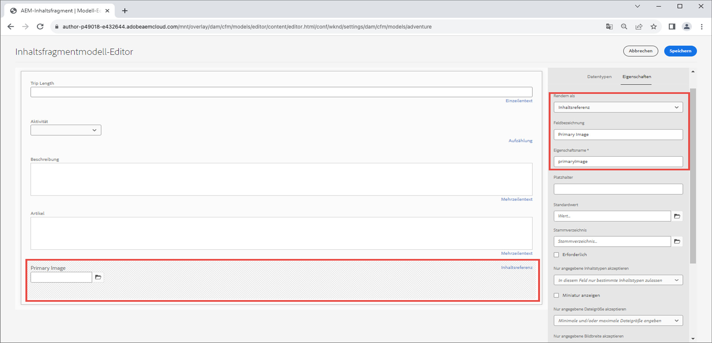

# Optimierte Bilder mit AEM Headless {#images-with-aem-headless}

Bilder sind ein wichtiger Aspekt in der [Entwicklung vielfältiger, überzeugender AEM Headless-Erlebnisse](https://experienceleague.adobe.com/docs/experience-manager-learn/getting-started-with-aem-headless/graphql/multi-step/overview.html?lang=de). AEM Headless unterstützt die Verwaltung von Bild-Assets und deren optimierte Bereitstellung.

Inhaltsfragmente, die bei der Inhaltsmodellierung in AEM Headless verwendet werden, verweisen häufig auf Bild-Assets, die für die Anzeige im Headless-Erlebnis vorgesehen sind. GraphQL-Abfragen können in AEM geschrieben werden, um abhängig davon, von wo aus ein Bild referenziert wird, URLs zu Bildern bereitzustellen.

Der Typ `ImageRef` verfügt über drei URL-Optionen für Inhaltsverweise:

+ `_path` ist der referenzierte Pfad in AEM und enthält keinen AEM-Ursprung (Host-Namen)
+ `_dynamicUrl` ist die vollständige URL zum bevorzugten, Web-optimierten Bild-Asset.
   + `_dynamicUrl` enthält keinen AEM-Ursprung. Daher muss die Domain (AEM-Author- oder -Publish-Service) von der Client-Anwendung bereitgestellt werden.
+ `_authorUrl` ist die vollständige URL zum Bild-Asset in AEM Author
   + [AEM-Autor](https://experienceleague.adobe.com/docs/experience-manager-learn/cloud-service/underlying-technology/introduction-author-publish.html?lang=de) kann verwendet werden, um eine Vorschau der Headless-Anwendung bereitzustellen.
+ `_publishUrl` ist die vollständige URL zum Bild-Asset in AEM Publish
   + [AEM-Veröffentlichung](https://experienceleague.adobe.com/docs/experience-manager-learn/cloud-service/underlying-technology/introduction-author-publish.html?lang=de) ist normalerweise der Ort, über den die Produktionsbereitstellung der Headless-Anwendung Bilder anzeigt.

`_dynamicUrl` ist die bevorzugte URL für Bild-Assets und sollte, sofern möglich, immer anstelle von `_path`, `_authorUrl` und `_publishUrl` verwendet werden.

|                                | AEM as a Cloud Service | AEM as a Cloud Service-RDE | AEM SDK | AEM 6.5 |
| ------------------------------ |:----------------------:|:--------------------------:|:-------:|:-------:|
| Unterstützung Web-optimierter Bilder? | ✔ | ✔ | ✘ | ✘ |


>[!CONTEXTUALHELP]
>id="aemcloud_learn_headless_graphql_images"
>title="Bilder mit AEM Headless"
>abstract="Erfahren Sie, wie AEM Headless die Verwaltung von Bild-Assets und deren optimierte Bereitstellung unterstützt."

## Inhaltsfragmentmodell

Stellen Sie sicher, dass das Inhaltsfragment-Feld, das die Bildreferenz enthält, vom Datentyp __Inhaltsreferenz__ ist.

Sie können die Feldtypen im [Inhaltsfragmentmodell](https://experienceleague.adobe.com/docs/experience-manager-cloud-service/content/assets/content-fragments/content-fragments-models.html?lang=de) überprüfen, indem Sie das Feld auswählen und die Registerkarte __Eigenschaften__ rechts anzeigen.



## GraphQL-persistierte Abfrage

Geben Sie in der GraphQL-Abfrage das Feld als `ImageRef`-Typ zurück und fordern Sie das `_dynamicUrl`-Feld an. Die Abfrage eines Abenteuers im [WKND-Site-Projekt](https://github.com/adobe/aem-guides-wknd) und das Einfügen der Bild-URL für die Bild-Asset-Referenzen im entsprechenden Feld `primaryImage` kann beispielsweise mit der neuen, persistierten Abfrage `wknd-shared/adventure-image-by-path` erfolgen, die wie folgt definiert ist:

```graphql {highlight="11"}
query($path: String!, $imageFormat: AssetTransformFormat=JPG, $imageSeoName: String, $imageWidth: Int, $imageQuality: Int) {
  adventureByPath(
    _path: $path
    _assetTransform: {
      format: $imageFormat
      width: $imageWidth
      quality: $imageQuality
      preferWebp: true
    }
  ) {
    item {
      _path
      title
      primaryImage {
        ... on ImageRef {
          _dynamicUrl
        }
      }
    }
  }
}
```

### Abfragevariablen

```json
{ 
  "path": "/content/dam/wknd-shared/en/adventures/bali-surf-camp/bali-surf-camp",
  "imageFormat": "JPG",
  "imageWidth": 1000,
}
```

Die Variable `$path`, die im Filter `_path` verwendet wird, erfordert den vollständigen Pfad zum Inhaltsfragment (zum Beispiel `/content/dam/wknd-shared/en/adventures/bali-surf-camp/bali-surf-camp`).

`_assetTransform` definiert, wie `_dynamicUrl` erstellt wird, um die Ausgabedarstellung des bereitgestellten Bildes zu optimieren. Web-optimierte Bild-URLs können auch auf dem Client angepasst werden, indem die Abfrageparameter der URL geändert werden.

| GraphQL-Parameter | URL-Parameter | Beschreibung | Erforderlich | GraphQL-Variablenwerte | URL-Parameterwerte | Beispiel-URL-Parameter |
|:---------|:----------|:-------------------------------|:--:|:--------------------------|:---|:--|
| `format` | Nicht zutreffend | Das Format des Bild-Assets. | ✔ | `GIF`, `PNG`, `PNG8`, `JPG`, `PJPG`, `BJPG`, `WEBP`, `WEBPLL`, `WEBPLY` | Nicht zutreffend | Nicht zutreffend |
| `seoName` | Nicht zutreffend | Der Name des Dateisegments in der URL. Ohne Angabe wird der Bild-Asset-Name verwendet. | ✘ | Alphanumerisch, `-` oder `_` | Nicht zutreffend | Nicht zutreffend |
| `crop` | `crop` | Der aus dem Bild entnommene Zuschnittrahmen muss innerhalb der Bildgröße liegen. | ✘ | Positive Ganzzahlen, die einen Zuschnittbereich innerhalb der Grenzen der ursprünglichen Bildabmessungen definieren | Kommagetrennte Zeichenfolge numerischer Koordinaten `<X_ORIGIN>,<Y_ORIGIN>,<CROP_WIDTH>,<CROP_HEIGHT>` | `?crop=10,20,300,400` |
| `size` | `size` | Die Größe des Ausgabebildes (sowohl Höhe als auch Breite) in Pixel. | ✘ | Positive Ganzzahlen | Kommagetrennte positive Ganzzahlen in der Reihenfolge `<WIDTH>,<HEIGHT>` | `?size=1200,800` |
| `rotation` | `rotate` | Die Drehung des Bildes in Grad. | ✘ | `R90`, `R180`, `R270` | `90`, `180`, `270` | `?rotate=90` |
| `flip` | `flip` | Spiegeln des Bildes. | ✘ | `HORIZONTAL`, `VERTICAL`, `HORIZONTAL_AND_VERTICAL` | `h`, `v`, `hv` | `?flip=h` |
| `quality` | `quality` | Die Bildqualität in Prozent der Originalqualität. | ✘ | 1–100 | 1–100 | `?quality=80` |
| `width` | `width` | Die Breite des Ausgabebildes in Pixel. Wenn `size` bereitgestellt wird, wird `width` ignoriert. | ✘ | Positive Ganzzahl | Positive Ganzzahl | `?width=1600` |
| `preferWebP` | `preferwebp` | Wenn `true` und AEM das WebP-Format bereitstellen, falls der Browser dies unterstützt, unabhängig vom `format`. | ✘ | `true`, `false` | `true`, `false` | `?preferwebp=true` |

## GraphQL-Antwort

Die resultierende JSON-Antwort beinhaltet die angeforderten Felder, die die Web-optimierte URL zu den Bild-Assets enthalten.

```json {highlight="8"}
{
  "data": {
    "adventureByPath": {
      "item": {
        "_path": "/content/dam/wknd-shared/en/adventures/bali-surf-camp/bali-surf-camp",
        "title": "Bali Surf Camp",
        "primaryImage": {
          "_dynamicUrl": "/adobe/dynamicmedia/deliver/dm-aid--a38886f7-4537-4791-aa20-3f6ef0ac3fcd/adobestock_175749320.jpg?preferwebp=true&width=1000&quality=80"
        }
      }
    }
  }
}
```

Verwenden Sie zum Laden des Web-optimierten Bildes des referenzierten Bildes in Ihrer Anwendung die `_dynamicUrl` von `primaryImage` als Quell-URL des Bildes.

In React sieht die Anzeige des Web-optimierten Bildes über AEM Publish wie folgt aus:

```jsx
// The AEM host is usually read from a environment variable of the SPA.
const AEM_HOST = "https://publish-p123-e456.adobeaemcloud.com";
...
let dynamicUrl = AEM_HOST + data.adventureByPath.item.primaryImage._dynamicUrl;
...

```

Denken Sie daran, dass `_dynamicUrl` nicht die AEM-Domain enthält. Daher müssen Sie den gewünschten Ursprung für die aufzulösende Bild-URL angeben.

## Responsive URLs

Im obigen Beispiel wird ein Bild mit einer einzigen Größe verwendet. In Web-Erlebnissen sind jedoch häufig responsive Bild-Sets erforderlich. Responsive Bilder können mithilfe von [img srcsets](https://css-tricks.com/a-guide-to-the-responsive-images-syntax-in-html/#using-srcset) oder [Bildelementen](https://css-tricks.com/a-guide-to-the-responsive-images-syntax-in-html/#using-srcset) implementiert werden. Das folgende Codesnippet zeigt, wie `_dynamicUrl` als Basis verwendet wird und verschiedene Breitenparameter angehängt werden, um unterschiedliche responsive Ansichten zu ermöglichen. Es kann nicht nur der Abfrageparameter `width` verwendet werden, sondern der Client kann auch andere Abfrageparameter hinzufügen, um das Bild-Asset entsprechend den Anforderungen weiter zu optimieren.

```javascript
// The AEM host is usually read from a environment variable of the SPA.
const AEM_HOST = "https://publish-p123-e456.adobeaemcloud.com";
...
// Read the data from GraphQL response
let dynamicUrl = AEM_HOST + data.adventureByPath.item.primaryImage._dynamicUrl;
let alt = data.adventureByPath.item.title;
...
{/*-- Example img srcset --*/}
document.body.innerHTML=`
    alt="${alt}"
    src="${dynamicUrl}&width=1000}"
    srcset="`
      ${dynamicUrl}&width=1000 1000w,
      ${dynamicUrl}&width=1600 1600w,
      ${dynamicUrl}&width=2000 2000w,
      `"
    sizes="calc(100vw - 10rem)"/>`;
...
{/*-- Example picture --*/}
document.body.innerHTML=`<picture>
      <source srcset="${dynamicUrl}&width=2600" media="(min-width: 2001px)"/>
      <source srcset="${dynamicUrl}&width=2000" media="(min-width: 1000px)"/>
      
    </picture>`;
```

## React-Beispiel

Erstellen wir nun auf Grundlage folgender [responsiver Bildmuster](https://css-tricks.com/a-guide-to-the-responsive-images-syntax-in-html/) eine einfache React-Anwendung, die Web-optimierte Bilder anzeigt. Es gibt zwei Hauptmuster für responsive Bilder:

+ [img-Element mit srcset](https://css-tricks.com/a-guide-to-the-responsive-images-syntax-in-html/#using-srcset) für eine höhere Leistung
+ [Bildelement](https://css-tricks.com/a-guide-to-the-responsive-images-syntax-in-html/#using-picture) zur Design-Kontrolle

### img-Element mit srcset

>[!VIDEO](https://video.tv.adobe.com/v/3418556/?quality=12&learn=on)

[img-Elemente mit srcset](https://css-tricks.com/a-guide-to-the-responsive-images-syntax-in-html/#using-srcset) werden mit dem Attribut `sizes` verwendet, um verschiedene Bild-Assets für unterschiedliche Bildschirmgrößen bereitzustellen. „img srcsets“ sind nützlich, wenn Sie verschiedene Bild-Assets für unterschiedliche Bildschirmgrößen bereitstellen.

### Bildelement

[Bildelemente](https://css-tricks.com/a-guide-to-the-responsive-images-syntax-in-html/#using-picture) werden mit mehreren `source`-Elementen verwendet, um verschiedene Bild-Assets für unterschiedliche Bildschirmgrößen bereitzustellen. Bildelemente sind nützlich, wenn Sie verschiedene Bilddarstellungen für unterschiedliche Bildschirmgrößen bereitstellen.

>[!VIDEO](https://video.tv.adobe.com/v/3418555/?quality=12&learn=on)

### Beispiel-Code

Diese einfache React-App nutzt das [AEM Headless-SDK](./aem-headless-sdk.md), um AEM Headless-APIs für Abenteuerinhalte abzufragen, und zeigt das Web-optimierte Bild über ein [img-Element mit srcset](#img-element-with-srcset) und [Bildelement](#picture-element) an. `srcset` und `sources` verwenden eine benutzerdefinierte `setParams`-Funktion zum Anhängen des Web-optimierten Abfrageparameters an `_dynamicUrl` für das Bild. Ändern Sie also die bereitgestellte Bilddarstellung entsprechend den Anforderungen des Webclients.

Die Abfrage in AEM wird über den benutzerdefinierten React-Hook [useAdventureByPath, der das AEM Headless-SDK verwendet](./aem-headless-sdk.md#graphql-persisted-queries), ausgeführt.

```javascript
// src/App.js

import "./App.css";
import { useAdventureByPath } from './api/persistedQueries'

const AEM_HOST = process.env.AEM_HOST;

function App() {

  /**
   * Update the dynamic URL with client-specific query parameters
   * @param {*} imageUrl the image URL
   * @param {*} params the AEM web-optimized image query parameters
   * @returns the dynamic URL with the query parameters
   */
  function setOptimizedImageUrlParams(imageUrl, params) {
    let url = new URL(imageUrl);
    Object.keys(params).forEach(key => {
      url.searchParams.set(key, params[key]);
    });
    return url.toString();
  }

  // Get data from AEM using GraphQL persisted query as defined above 
  // The details of defining a React useEffect hook are explored in How to > AEM Headless SDK
  // The 2nd parameter define the base GraphQL query parameters used to request the web-optimized image
  let { data, error } = useAdventureByPath(
        "/content/dam/wknd-shared/en/adventures/bali-surf-camp/bali-surf-camp", 
        { imageFormat: "JPG" }
      );

  // Wait for AEM Headless APIs to provide data
  if (!data) { return <></> }

  const alt = data.adventureByPath.item.title;
  const imageUrl =  AEM_HOST + data.adventureByPath.item.primaryImage._dynamicUrl;

  return (
    <div className="app">
      
      <h1>Web-optimized images</h1>

      {/* Render the web-optimized image img with srcset for the Adventure Primary Image */}
      <h2>Img srcset</h2>

      

       {/* Render the web-optimized picture for the Adventure Primary Image */}
        <h2>Picture element</h2>

        <picture>
          {/* When viewport width is greater than 2001px */}
          <source srcSet={setOptimizedImageUrlParams(imageUrl, { width : 2600 })} media="(min-width: 2001px)"/>        
          {/* When viewport width is between 1000px and 2000px */}
          <source srcSet={setOptimizedImageUrlParams(imageUrl, { width : 2000})} media="(min-width: 1000px)"/>
          {/* When viewport width is less than 799px */}
          
        </picture>
    </div>
  );
}

export default App;
```
