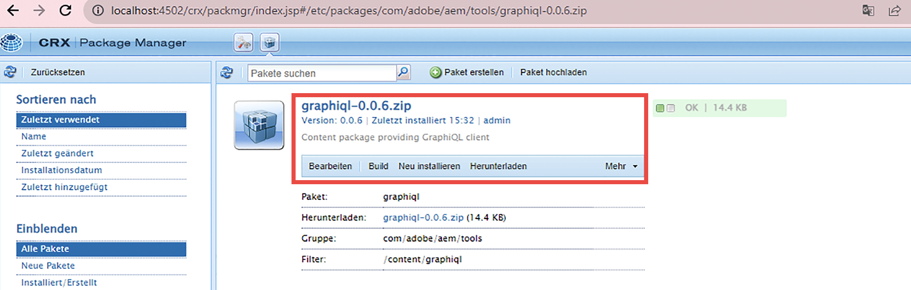
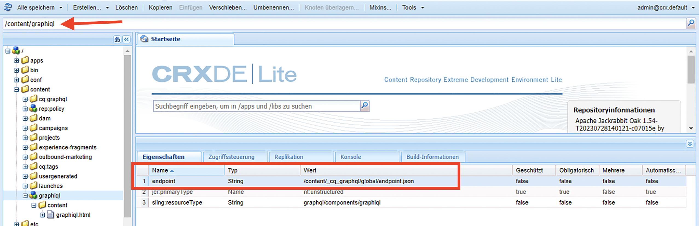

# Installieren der GraphiQL-IDE in AEM 6.5

In AEM 6.5 muss das GraphiQL IDE Tool manuell installiert werden.

1. Gehen Sie zum **[Software-Verteilungsportal](https://experience.adobe.com/#/downloads/content/software-distribution/de/aemcloud.html)** > **AEM as a Cloud Service**.
1. Suchen Sie nach &quot;GraphiQL&quot;(stellen Sie sicher, dass Sie die **i** in **GraphiQL**).
1. Neueste Version herunterladen **GraphiQL Content Package v.x.x.x**.

   

   Die ZIP-Datei ist ein AEM-Paket, das direkt installiert werden kann.

1. Navigieren Sie im AEM-Startmenü zu **Tools** > **Implementierung** > **Pakete**.
1. Klicken Sie auf **Paket hochladen** und wählen Sie das im vorherigen Schritt heruntergeladene Paket aus. Klicken Sie auf **Installieren**, um das Paket zu installieren.

   

1. Navigieren Sie zu **CRXDE Lite** > **Repository-Panel** und wählen Sie den Knoten `/content/graphiql` aus (z. B. <http://localhost:4502/crx/de/index.jsp#/content/graphiql>).
1. Ändern Sie auf der Registerkarte **Eigenschaften** den Wert der Eigenschaft `endpoint` zu `/content/_cq_graphql/wknd-shared/endpoint.json`.
   

1. Navigieren Sie zur Benutzeroberfläche zur **Konfiguration der Web-Konsole** und suchen Sie nach der **CSRF-Filter**-Konfiguration (z. B.<http://localhost:4502/system/console/configMgr/com.adobe.granite.csrf.impl.CSRFFilter)>
1. Aktualisieren Sie im Eigenschaftsnamenfeld `Excluded Paths` den WKND GraphQL-Endpunktpfad zu `/content/cq:graphql/wknd-shared/endpoint`.

1. Greifen Sie über `//HOST:PORT/content/graphiql.html` auf den GraphiQL-Editor zu und überprüfen Sie, ob Sie eine neue Abfrage erstellen oder eine vorhandene Abfrage ausführen können. (z. B. <http://localhost:4502/content/graphiql.html>)

>[!TIP]
>
>Um Ihr projektspezifisches GraphQL-Schema und die Ausführung von Abfragen zu unterstützen, müssen Sie die entsprechenden Änderungen für die `endpoint` und `Excluded Paths` -Werte in den oben genannten Schritten.
