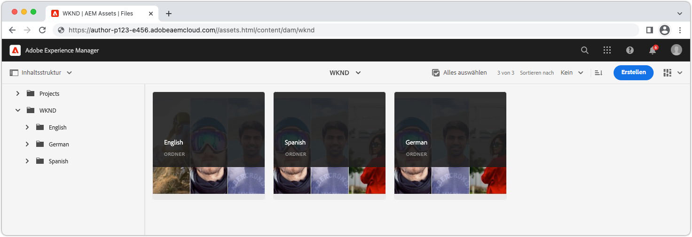

# Lokalisierte Inhalte mit AEM Headless

AEM bietet eine [Framework für die Übersetzungsintegration](https://experienceleague.adobe.com/docs/experience-manager-cloud-service/content/sites/administering/reusing-content/translation/integration-framework.html) für Headless-Inhalte, sodass Inhaltsfragmente und unterstützende Assets einfach übersetzt werden können, damit sie in verschiedenen Gebietsschemata verwendet werden können. Hierbei handelt es sich um dasselbe Framework, mit dem andere AEM Inhalte wie Seiten, Experience Fragments, Assets und Forms übersetzt werden. Einmal [Headless-Inhalt wurde übersetzt](https://experienceleague.adobe.com/docs/experience-manager-cloud-service/content/headless/journeys/translation/overview.html)und veröffentlicht wurde, ist es für den Verbrauch durch Headless-Anwendungen bereit.

## Asset-Ordnerstruktur{#assets-folder-structure}

Stellen Sie sicher, dass die lokalisierten Inhaltsfragmente in AEM dem [empfohlene Lokalisierungsstruktur](https://experienceleague.adobe.com/docs/experience-manager-cloud-service/content/headless/journeys/translation/getting-started.html#recommended-structure).



Die Gebietsschemaordner müssen gleichrangige Ordner sein, und der Ordnername muss ein gültiger Ordnername und nicht der Titel sein. [ISO 639-1-Code](https://en.wikipedia.org/wiki/List_of_ISO_639-1_codes) das Gebietsschema des im Ordner enthaltenen Inhalts darstellt.

Der Gebietsschema-Code ist auch der Wert, der zum Filtern der von der GraphQL-Abfrage zurückgegebenen Inhaltsfragmente verwendet wird.

| Gebietsschema-Code | AEM | Gebietsschema für Inhalte |
|--------------------------------|----------|----------|
| de | /content/dam/.../**de**/.. | Deutscher Inhalt |
| en | /content/dam/.../**en**/.. | englischer Inhalt |
| es | /content/dam/.../**es**/.. | Spanischer Inhalt |

## GraphQL-Abfrage

AEM bietet eine `_locale` GraphQL-Filter, der Inhalte automatisch nach Gebietsschema-Code filtert. Beispielsweise können Sie alle englischen Abenteuer im [WKND-Referenz-Demoprojekt](https://experienceleague.adobe.com/docs/experience-manager-cloud-service/content/onboarding/demo-add-on/create-site.html) würde wie folgt aussehen:

```graphql
{
  adventureList(_locale: "en") {
    items {      
      _path
      adventureTitle
    }
  }
}
```

Die `_locale` -Filter erfordert die Verwendung von [Lokalisierungskonvention für Asset-Ordner AEM](#assets-folder-structure).

## React-Beispiel

Erstellen wir eine einfache React-Anwendung, die steuert, welche Abenteuer-Inhalte von AEM basierend auf einem Gebietsschema-Selektor mithilfe der `_locale` Filter.

Wann __englisch__ wird in der Gebietsschema-Auswahl ausgewählt, dann unter &quot;Englisch Adventure Content Fragments&quot; `/content/dam/wknd/en` zurückgegeben werden, wenn __spanisch__ ausgewählt ist, wird Spanische Inhaltsfragmente unter `/content/dam/wknd/es`usw. usw.


### Erstellen Sie eine `LocaleContext`{#locale-context}

Erstellen Sie zunächst eine [React-Kontext](https://reactjs.org/docs/context.html) , damit das Gebietsschema über die Komponenten der React-Anwendung hinweg verwendet werden kann.

```javascript
// src/LocaleContext.js

import React from 'react'

const DEFAULT_LOCALE = 'en';

const LocaleContext = React.createContext({
    locale: DEFAULT_LOCALE, 
    setLocale: () => {}
});

export default LocaleContext;
```

### Erstellen Sie eine `LocaleSwitcher` React-Komponente{#locale-switcher}

Als Nächstes erstellen Sie eine React-Komponente mit dem Gebietsschema-Umschalter, die als [LocaleContext&#39;s](#locale-context) -Wert zur Auswahl des Benutzers hinzufügen.

Dieser Gebietsschemawert wird verwendet, um die GraphQL-Abfragen zu leiten und sicherzustellen, dass nur Inhalte zurückgegeben werden, die dem ausgewählten Gebietsschema entsprechen.

```javascript
// src/LocaleSwitcher.js

import { useContext } from "react";
import LocaleContext from "./LocaleContext";

export default function LocaleSwitcher() {
  const { locale, setLocale } = useContext(LocaleContext);

  return (
    <select value={locale}
            onChange={e => setLocale(e.target.value)}>
      <option value="de">Deutsch</option>
      <option value="en">English</option>
      <option value="es">Español</option>
    </select>
  );
}
```

### Abfrageinhalt mit `_locale` filter{#adventures}

Die Komponente Abenteuer fragt AEM alle Abenteuer nach Gebietsschema ab und listet deren Titel auf. Dies wird erreicht, indem der im React-Kontext gespeicherte Gebietsschemawert mithilfe der `_locale` Filter.

Dieser Ansatz kann auf andere Abfragen in Ihrer Anwendung erweitert werden, um sicherzustellen, dass alle Abfragen nur Inhalte enthalten, die durch die Gebietsschema-Auswahl eines Benutzers angegeben wurden.

Die Abfrage nach AEM wird im benutzerdefinierten React-Haken ausgeführt [useGraphQL, ausführlicher beschrieben in der Dokumentation AEM GraphQL .](./aem-headless-sdk.md).

```javascript
// src/Adventures.js

import { useContext } from "react"
import { useGraphQL } from './useGraphQL'
import LocaleContext from './LocaleContext'

export default function Adventures() {
    const { locale } = useContext(LocaleContext);

    let {data} = useGraphQL(`{
            adventureList(_locale: "${locale}") {
                items {      
                _path
                adventureTitle
             }
        }
    }`);

    return (
        <ul>
            {data?.adventureList?.items?.map((adventure, index) => { 
                return <li key={index}>{adventure.adventureTitle}</li>
            })}
        </ul>
    )
}
```

### Definieren Sie die `App.js`{#app-js}

Verbinden Sie alles, indem Sie die React-Anwendung in die `LanguageContext.Provider` und legen Sie den Gebietsschemawert fest. Dies ermöglicht die anderen React-Komponenten, [LocaleSwitcher](#locale-switcher)und [Abenteuer](#adventures) , um den Status der Gebietsschema-Auswahl freizugeben.

```javascript
// src/App.js

import { useState, useContext } from "react";
import LocaleContext from "./LocaleContext";
import LocaleSwitcher from "./LocaleSwitcher";
import Adventures from "./Adventures";

export default function App() {
  const [locale, setLocale] = useState(useContext(LocaleContext).locale);

  return (
    <LocaleContext.Provider value={{locale, setLocale}}>
      <LocaleSwitcher />
      <Adventures />
    </LocaleContext.Provider>
  );
}
```
