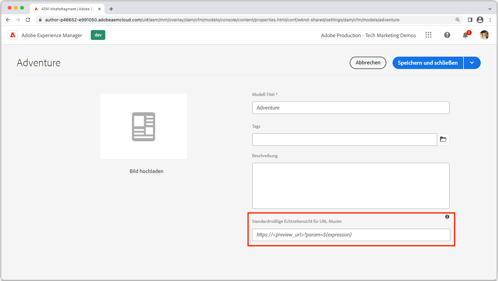
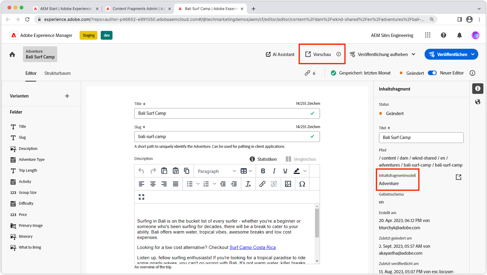

# Inhaltsfragmentvorschau

AEM Headless-Anwendungen unterstützen eine integrierte Authoring-Vorschau. Das Vorschauerlebnis verknüpft den Inhaltsfragment-Editor der AEM-Autoreninstanz mit Ihrer benutzerdefinierten App (über HTTP adressierbar), sodass ein Deep Link in die App eingefügt werden kann, mit der das in der Vorschau angezeigte Inhaltsfragment gerendert wird.

>[!VIDEO](https://video.tv.adobe.com/v/3416906?quality=12&learn=on)

Zur Verwendung der Inhaltsfragmentvorschau müssen mehrere Bedingungen erfüllt sein:

1. Die App muss in einer URL bereitgestellt werden, auf die Autoren zugreifen können
1. Das Programm muss so konfiguriert sein, dass eine Verbindung zum AEM-Autorendienst (und nicht zum AEM-Veröffentlichungsdienst) hergestellt wird.
1. Die App muss mit URLs oder Routen entwickelt werden, die [Inhaltsfragmentpfad oder ID](#url-expressions) , um die Inhaltsfragmente auszuwählen, die für die Vorschau im App-Erlebnis angezeigt werden sollen.

## Vorschau-URLs

Vorschau-URLs anzeigen, mithilfe von [URL-Ausdrücke](#url-expressions), werden in den Eigenschaften des Inhaltsfragmentmodells festgelegt.



1. Melden Sie sich beim AEM-Autorendienst als Administrator an
1. Navigieren Sie zu __Tools > Allgemein > Inhaltsfragmentmodelle__
1. Wählen Sie die __Inhaltsfragmentmodell__ und wählen Sie __Eigenschaften__ in der oberen Aktionsleiste.
1. Geben Sie die Vorschau-URL für das Inhaltsfragmentmodell mit ein. [URL-Ausdrücke](#url-expressions)
   + Die Vorschau-URL muss auf eine Bereitstellung der App verweisen, die eine Verbindung zum AEM-Autorendienst herstellt.

### URL-Ausdrücke

Jedes Inhaltsfragmentmodell kann über eine Vorschau-URL verfügen. Die Vorschau-URL kann pro Inhaltsfragment mithilfe der in der folgenden Tabelle aufgeführten URL-Ausdrücke parametrisiert werden. In einer Vorschau-URL können mehrere URL-Ausdrücke verwendet werden.

|  | URL-Ausdruck | Wert  |
| --------------------------------------- | ----------------------------------- | ----------- |
| Inhaltsfragmentpfad | `${contentFragment.path}` | `/content/dam/wknd-shared/en/adventures/surf-camp-bali/surf-camp-bali` |
| Inhaltsfragment-ID | `${contentFragment.id}` | `12c34567-8901-2aa3-45b6-d7890aa1c23c` |
| Inhaltsfragmentvariante | `${contentFragment.variation}` | `main` |
| Pfad des Inhaltsfragmentmodells | `${contentFragment.model.path}` | `/conf/wknd-shared/settings/dam/cfm/models/adventure` |
| Name des Inhaltsfragmentmodells | `${contentFragment.model.name}` | `adventure` |

Beispiel-Vorschau-URLs:

+ Eine Vorschau-URL auf der __Abenteuer__ -Modell könnte wie folgt aussehen: `https://preview.app.wknd.site/adventure${contentFragment.path}` aufgelöst in `https://preview.app.wknd.site/adventure/content/dam/wknd-shared/en/adventures/surf-camp-bali/surf-camp-bali`
+ Eine Vorschau-URL auf der __Artikel__ -Modell könnte wie folgt aussehen: `https://preview.news.wknd.site/${contentFragment.model.name}/${contentFragment.id}.html?variation=${contentFragment.variation}` aufgelöst `https://preview.news.wknd.site/article/99c34317-1901-2ab3-35b6-d7890aa1c23c.html?variation=main`

## In-App-Vorschau

Jedes Inhaltsfragment, das das konfigurierte Inhaltsfragmentmodell verwendet, verfügt über eine Vorschau -Schaltfläche. Über die Schaltfläche Vorschau wird die Vorschau-URL des Inhaltsfragmentmodells geöffnet und die Werte des geöffneten Inhaltsfragments werden in die [URL-Ausdrücke](#url-expressions).



Führen Sie bei der Vorschau von Inhaltsfragmentänderungen in der App eine Aktualisierung (Löschen des lokalen Cache des Browsers) durch.

## React-Beispiel

Im Folgenden wird die WKND-App vorgestellt, eine einfache React-Anwendung, die Abenteuer aus AEM mit AEM Headless-GraphQL-APIs anzeigt.

Der Beispielcode ist verfügbar unter [Github.com](https://github.com/adobe/aem-guides-wknd-graphql/tree/main/preview-tutorial).

## URLs und Routen

Die URLs oder Routen, die zur Vorschau eines Inhaltsfragments verwendet werden, müssen mithilfe von [URL-Ausdrücke](#url-expressions). In dieser für die Vorschau aktivierten Version der WKND-App werden die Inhaltsfragmente für das Abenteuer über die `AdventureDetail` Komponente, die an die Route gebunden ist `/adventure<CONTENT FRAGMENT PATH>`. Daher muss die Vorschau-URL des WKND Adventure-Modells auf `https://preview.app.wknd.site:3000/adventure${contentFragment.path}` , um zu dieser Route zu gelangen.

Die Inhaltsfragmentvorschau funktioniert nur, wenn die App über eine adressierbare Route verfügt, die mit [URL-Ausdrücke](#url-expressions) , das dieses Inhaltsfragment in der App in einer Vorschau wiedergibt.

+ `src/App.js`

```javascript
...
function App() {
  return (
    <Router>
      <div className="App">
        <header>
            <Link to={"/"}>
                
            </Link>        
            <hr />
        </header>
        <Switch>
          {/* The route's path must match the Adventure Model's Preview URL expression. In React since the path has `/` you must use wildcards to match instead of the usual `:path` */}
          <Route path='/adventure/*'>
            <AdventureDetail />
          </Route>
          <Route path="/">
            <Home />
          </Route>
        </Switch>
      </div>
    </Router>
  );
}

export default App;
```

### Anzeigen des erstellten Inhalts

Die `AdventureDetail` -Komponente analysiert einfach den Pfad des Inhaltsfragments, der über die `${contentFragment.path}` [URL-Ausdruck](#url-expressions), über die Route-URL und verwendet sie zum Erfassen und Rendern des WKND-Abenteuers.

+ `src/components/AdventureDetail.js`

```javascript
...
function AdventureDetail() {

    // Read the content fragment path value which is the parameter used to query for the adventure's details
    
    // Add the leading '/' back on since the params value captures the `*` wildcard in `/adventure/*`, or everything after the first `/` in the Content Fragment path.
    const path = '/' + useParams()[0];

    // Query AEM for the Adventures's details, using the Content Fragment's `path`
    const { adventure, references, error } = useAdventureByPath(path);

    // Handle error and loading conditions
    if (error) {
        return <Error errorMessage={error} />;
    } else if (!adventure) {
        return <Loading />;
    }

    return (<div className="adventure-detail">
        ...
        <AdventureDetailRender {...adventure} references={references} />
    </div>);
}
...
```
