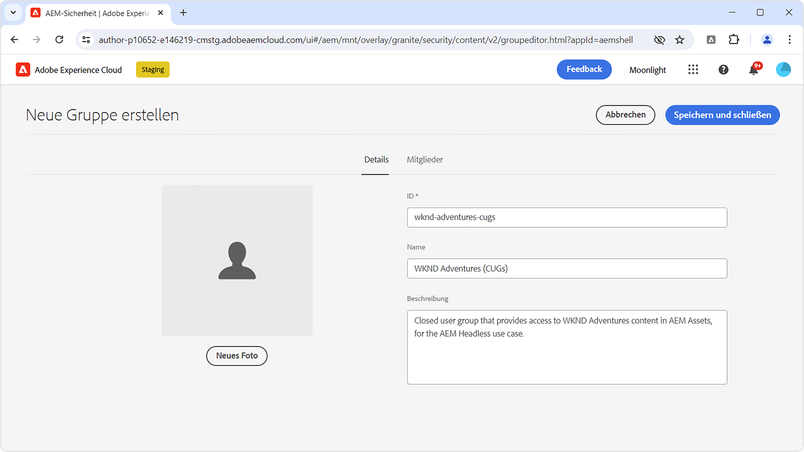
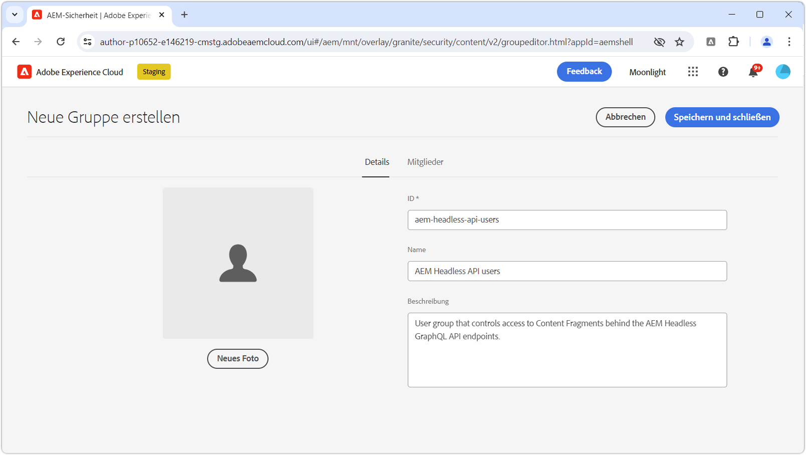
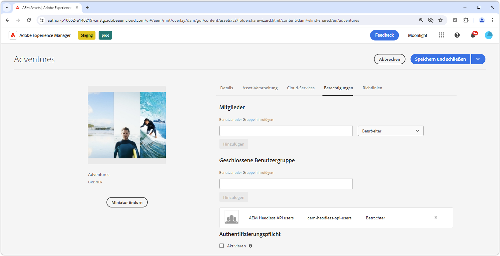

# Schützen von Inhalten in AEM Headless

Die Sicherstellung der Integrität und Sicherheit Ihrer Daten bei der Bereitstellung von AEM Headless-Inhalten aus AEM Publish ist bei der Bereitstellung sensibler Inhalte von entscheidender Bedeutung. Diese Anleitung führt Sie durch das Sichern der Inhalte, die von AEM Headless GraphQL API-Endpunkten bereitgestellt werden.

Die Anleitung in diesem Tutorial folgt strengen Anforderungen, damit Inhalte ausschließlich für bestimmte Benutzende oder Benutzergruppen verfügbar sind. Um Verwirrung und unbeabsichtigte Ergebnisse zu vermeiden, muss zwischen personalisierten Marketing-Inhalten und privaten Inhalten wie personenbezogenen Daten oder persönlichen Finanzdaten unterschieden werden. In diesem Tutorial geht es um den Schutz privater Inhalte.

Mit Marketing-Inhalten beziehen wir uns auf Inhalte, die auf einzelne Benutzer oder Gruppen zugeschnitten sind und nicht für den allgemeinen Gebrauch bestimmt sind. Dabei gilt es zu verstehen, dass diese Inhalte zwar für bestimmte Benutzende gedacht sind, ihre Präsentation außerhalb des beabsichtigten Kontexts (z. B. durch Manipulation von HTTP-Anfragen) jedoch kein Sicherheits-, Rechts- oder Reputationsrisiko darstellt.

Alle in diesem Artikel behandelten Inhalte werden als privat betrachtet und können nur von bestimmten Benutzenden oder Gruppen angesehen werden. Marketing-Inhalte erfordern oft keinen Schutz, vielmehr kann ihre Bereitstellung für bestimmte Benutzende von der Anwendung verwaltet und aus Leistungsgründen zwischengespeichert werden.

Diese Anleitung umfasst nicht:

- Direktes Sichern der Endpunkte, sie konzentriert sich jedoch auf das Sichern der von ihnen bereitgestellten Inhalte.
- Authentifizierung für AEM Publish oder Abrufen von Anmelde-Token. Authentifizierungsmethoden und das Übergeben von Berechtigungen hängen von einzelnen Anwendungsfällen und Implementierungen ab.

## Benutzergruppen

Zunächst muss eine [Benutzergruppe](https://experienceleague.adobe.com/de/docs/experience-manager-learn/cloud-service/accessing/aem-users-groups-and-permissions) definiert werden, welche die Benutzerinnen und Benutzer enthält, die Zugriff auf die geschützten Inhalte haben sollten.

{align="center"}

Benutzergruppen weisen den Zugriff auf AEM Headless-Inhalte zu, einschließlich von Inhaltsfragmenten oder anderen referenzierten Assets.

1. Melden Sie sich bei AEM Author als **Benutzeradmin** an.
1. Navigieren Sie zu **Tools** > **Sicherheit** > **Gruppen**.
1. Wählen Sie **Erstellen** in der oberen rechten Ecke aus.
1. Geben Sie in der Registerkarte **Details** die **Gruppen-ID** und den **Gruppennamen** an.
   - Die Gruppen-ID und der Gruppenname können beliebig sein. In diesem Beispiel wird der Name **AEM Headless-API-Benutzende** verwendet.
1. Klicken Sie auf **Speichern und schließen**.
1. Wählen Sie die neu erstellte Gruppe aus und wählen Sie dann **Aktivieren** in der Aktionsleiste.

Wenn verschiedene Zugriffsebenen erforderlich sind, erstellen Sie mehrere Benutzergruppen, die verschiedenen Inhalten zugeordnet werden können.

### Hinzufügen von Benutzerinnen und Benutzern zu Benutzergruppen

Um AEM Headless-GraphQL-API-Anfragen Zugriff auf geschützte Inhalte zu gewähren, können Sie die Headless-Anfrage mit einer Person verknüpfen, die zu einer bestimmten Benutzergruppe gehört. Im Folgenden finden Sie zwei gängige Ansätze:

1. **[Technische Konten](https://experienceleague.adobe.com/de/docs/experience-manager-learn/getting-started-with-aem-headless/authentication/service-credentials) in AEM as a Cloud Service:**
   - Erstellen Sie ein technisches Konto in der AEM as a Cloud Service Developer Console.
   - Melden Sie sich mit dem technischen Konto einmal bei AEM Author an.
   - Fügen Sie das technische Konto über **Werkzeuge > Sicherheit > Gruppen > AEM Headless-API-Benutzer > Mitglieder** der Benutzergruppe hinzu.
   - **Aktivieren** Sie sowohl die Benutzerin bzw. den Benutzer des technischen Kontos als auch die Benutzergruppe in AEM Publish.
   - Diese Methode erfordert, dass der Headless-Client die Service-Anmeldeinformationen nicht für die Benutzerin bzw. den Benutzer freilegt, da es sich um Anmeldeinformationen für eine bestimmte Person handelt und diese nicht weitergegeben werden sollten.

   {align="center"}

2. **Benannte Benutzerinnen und Benutzer:**
   - Authentifizieren Sie benannte Benutzerinnen und Benutzer und fügen Sie diese direkt der Benutzergruppe in AEM Publish hinzu.
   - Diese Methode erfordert, dass der Headless-Client Benutzeranmeldeinformationen mit AEM Publish authentifiziert, ein AEM-Anmelde- oder -Zugriffs-Token abruft und dieses Token für nachfolgende Anfragen an AEM verwendet. Die Einzelheiten dazu, wie dies erreicht werden kann, werden in dieser Anleitung nicht erläutert und hängen von der Implementierung ab.

## Schützen von Inhaltsfragmenten

Das Schützen von Inhaltsfragmenten ist für den Schutz Ihrer AEM Headless-Inhalte unerlässlich und wird durch Verknüpfen der Inhalte mit einer geschlossenen Benutzergruppe (CUG, Closed User Group) erreicht. Wenn eine Benutzerin oder ein Benutzer eine Anfrage an die AEM Headless GraphQL-API richtet, wird der zurückgegebene Inhalt anhand der CUGs der Person gefiltert.

{align="center"}

Führen Sie die folgenden Schritte aus, um dies durch [Geschlossene Benutzergruppen (CUGs)](https://experienceleague.adobe.com/de/docs/experience-manager-learn/assets/advanced/closed-user-groups) zu erreichen.

1. Melden Sie sich bei AEM Author als **DAM-Benutzerin oder -Benutzer** an.
2. Gehen Sie zu **Assets > Dateien** und wählen Sie den **Ordner** aus, der die Inhaltsfragmente enthält, die geschützt werden sollen. CUGs werden hierarchisch angewendet und wirken sich auf Unterordner aus, es sei denn, dies wird durch eine andere CUG überschrieben.
   - Stellen Sie sicher, dass Benutzerinnen und Benutzer, die zu anderen Kanälen gehören, die die Inhalte der Ordner verwenden, in dieser Benutzergruppe enthalten sind. Alternativ können Sie die Benutzergruppen, die mit diesen Kanälen verknüpft sind, in die Liste der CUGs aufnehmen. Andernfalls ist der Inhalt für diese Kanäle nicht verfügbar.
3. Wählen Sie den Ordner aus und klicken Sie in der Symbolleiste auf **Eigenschaften**.
4. Wählen Sie die Registerkarte **Berechtigungen** aus.
5. Geben Sie den **Gruppennamen** ein und wählen Sie die Schaltfläche **Hinzufügen**, um die neue CUG hinzuzufügen.
6. Klicken Sie auf **Speichern**, um die CUG anzuwenden.
7. Klicken Sie auf **Auswählen**, um den Asset-Ordner auszuwählen und wählen Sie **Veröffentlichen**, um den Ordner mit den angewendeten CUGs an AEM Publish zu senden, wo er als Berechtigung ausgewertet wird.

Führen Sie dieselben Schritte für alle Ordner mit Inhaltsfragmenten durch, die geschützt werden müssen, und wenden Sie die richtigen CUGs auf jeden Ordner an.

Wenn jetzt eine HTTP-Anfrage an den AEM Headless GraphQL-API-Endpunkt gesendet wird, werden nur diejenigen Inhaltsfragmente in das Ergebnis aufgenommen, auf die über die angegebenen CUGs der anfragenden Person zugegriffen werden kann. Wenn die Person keinen Zugriff auf irgendein Inhaltsfragment hat, ist das Ergebnis leer, es wird jedoch trotzdem ein HTTP-Status-Code 200 zurückgegeben.

### Schützen referenzierter Inhalte

Inhaltsfragmente verweisen häufig auf andere AEM-Inhalte wie Bilder. Wenden Sie zum Schützen dieser referenzierten Inhalte CUGs auf die Asset-Ordner an, in denen die referenzierten Assets gespeichert sind. Beachten Sie, dass referenzierte Assets in der Regel mit anderen Methoden angefordert werden als mit AEM Headless GraphQL-APIs. Daher kann die Art und Weise, wie Zugriffs-Token bei Anfragen an diese referenzierten Assets weitergegeben werden, unterschiedlich sein.

Abhängig von der Inhaltsarchitektur kann es erforderlich sein, CUGs auf mehrere Ordner anzuwenden, um sicherzustellen, dass alle referenzierten Inhalte geschützt sind.

## Verhindern der Zwischenspeicherung geschützter Inhalte

AEM as a Cloud Service [speichert standardmäßig HTTP-Antworten zwischen](https://experienceleague.adobe.com/de/docs/experience-manager-learn/cloud-service/caching/publish), um die Leistung zu verbessern. Dies kann jedoch zu Problemen bei der Bereitstellung geschützter Inhalte führen. Um das Zwischenspeichern solcher Inhalte zu verhindern, [entfernen Sie Cache-Header für bestimmte Endpunkte](https://experienceleague.adobe.com/de/docs/experience-manager-learn/cloud-service/caching/publish#how-to-customize-cache-rules-1) in der Apache-Konfiguration der AEM-Veröffentlichungsinstanz.

Fügen Sie die folgende Regel zur Apache-Konfigurationsdatei Ihres Dispatcher-Projekts hinzu, um Cache-Header für bestimmte Endpunkte zu entfernen:

```xml
# dispatcher/src/conf.d/available_vhosts/example.vhost

<VirtualHost *:80>
    ...
    # Replace `example` with the name of your GraphQL endpoint's configuration name.
    <LocationMatch "^/graphql/execute.json/example/.*$">
        # Remove cache headers for protected endpoints so they are not cached
        Header unset Cache-Control
        Header unset Surrogate-Control
        Header set Age 0
    </LocationMatch>
    ...
</VirtualHost>
```

Beachten Sie, dass dies eine Leistungsbeeinträchtigung zur Folge hat, da der Inhalt vom Dispatcher oder CDN nicht zwischengespeichert wird. Dies ist ein Kompromiss zwischen Leistung und Sicherheit.

## Schutz von AEM Headless GraphQL-API-Endpunkten

Dieses Handbuch befasst sich nicht mit dem Sichern der [AEM Headless GraphQL-API-Endpunkte](https://experienceleague.adobe.com/de/docs/experience-manager-cloud-service/content/headless/graphql-api/graphql-endpoint) selbst, sondern konzentriert sich vielmehr auf das Sichern der von ihnen bereitgestellten Inhalte. Alle Benutzerinnen und Benutzer, einschließlich anonymer Personen, können auf die Endpunkte zugreifen, die geschützte Inhalte enthalten. Nur der Inhalt, auf den die geschlossenen Benutzergruppen der Person zugreifen können, wird zurückgegeben. Wenn kein Inhalt verfügbar ist, verfügt die AEM Headless-API-Antwort weiterhin über einen HTTP-Antwortstatus-Code 200, die Ergebnisse werden jedoch leer sein. In der Regel ist das Sichern der Inhalte ausreichend, da die Endpunkte selbst keine vertraulichen Daten offenlegen. Wenn Sie die Endpunkte sichern müssen, wenden Sie ACLs auf sie in AEM Publish über [Sling-Repository-Initialisierungsskripte (repoinit)](https://sling.apache.org/documentation/bundles/repository-initialization.html#repoinit-parser-test-scenarios) an.
