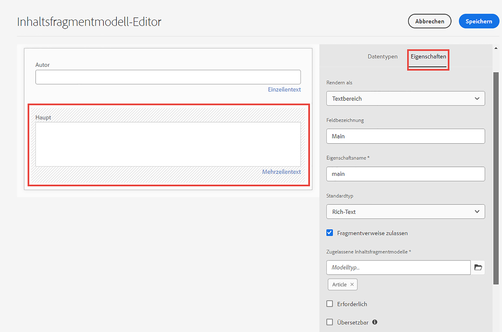
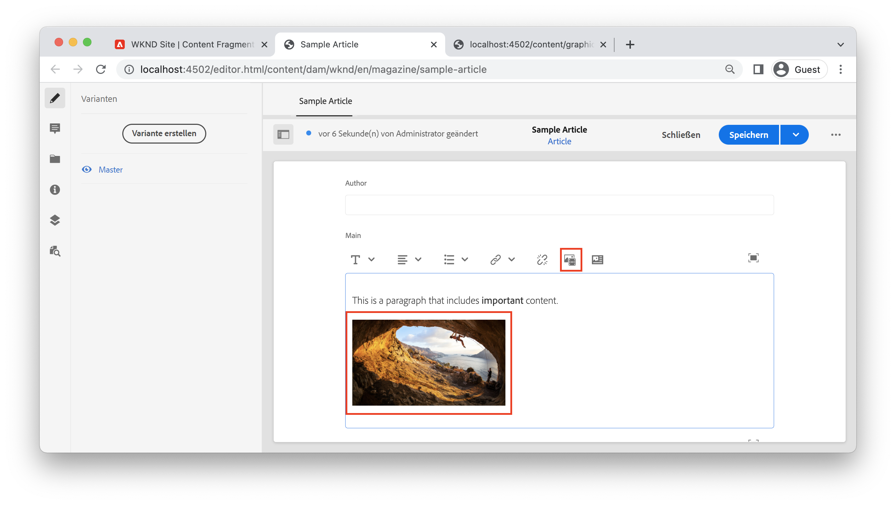
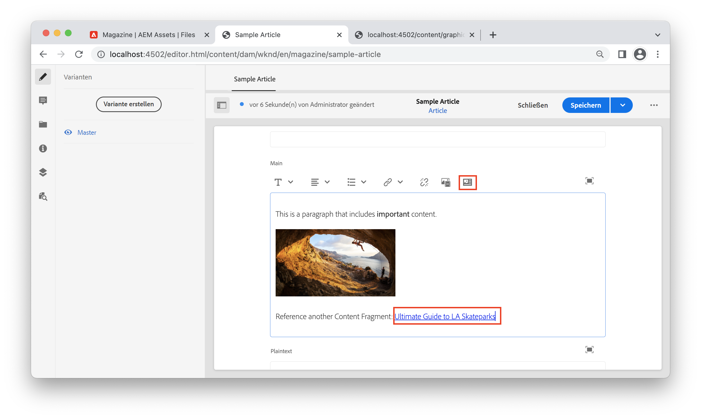

# Rich-Text mit AEM Headless

Das mehrzeilige Textfeld ist ein Datentyp von Inhaltsfragmenten, mit dem Autorinnen und Autoren Rich-Text-Inhalte erstellen können. Verweise auf andere Inhalte wie Bilder oder andere Inhaltsfragmente können dynamisch in Zeilen innerhalb des Textflusses eingefügt werden. Das einzeilige Textfeld ist ein weiterer Datentyp von Inhaltsfragmenten, der für einfache Textelemente verwendet werden sollte.

Die GraphQL-API von AEM bietet eine robuste Fähigkeit, Rich-Text als HTML, Nur-Text oder reines JSON zurückzugeben. Die JSON-Darstellung ist leistungsstark, da sie der Client-Anwendung die volle Kontrolle darüber gibt, wie der Inhalt gerendert werden kann.

## Mehrzeiliger Editor

>[!VIDEO](https://video.tv.adobe.com/v/342104?quality=12&learn=on)

Im Inhaltsfragment-Editor bietet die Menüleiste des mehrzeiligen Textfelds Autorinnen und Autoren standardmäßige Rich-Text-Formatierungsfunktionen wie **fett**, *kursiv* und unterstreichen. Das Öffnen des mehrzeiligen Felds im Vollbildmodus aktiviert [zusätzliche Formatierungswerkzeuge wie Absatztyp, Suchen und Ersetzen, Rechtschreibprüfung und mehr](https://experienceleague.adobe.com/docs/experience-manager-cloud-service/content/assets/content-fragments/content-fragments-variations.html?lang=de).

>[!NOTE]
>
> Die Plug-ins für Rich-Text im mehrzeiligen Editor können nicht angepasst werden.

## Mehrzeiliger Texttyp {#multi-line-data-type}

Verwenden Sie den Datentyp **Mehrzeiligen Text** bei der Definition Ihres Inhaltsfragmentmodells, um die Erstellung von Rich-Text zu ermöglichen.



Es können mehrere Eigenschaften des mehrzeiligen Felds konfiguriert werden.

Die Eigenschaft **Rendern als** kann auf Folgendes festgelegt werden:

* Textbereich – rendert ein einzelnes mehrzeiliges Feld
* Mehrere Felder – rendert mehrere mehrzeilige Felder.


Der **Standardtyp** kann auf Folgendes festgelegt werden:

* Rich-Text
* Markdown
* Nur Text

Der **Standardtyp** beeinflusst direkt das Bearbeitungserlebnis und bestimmt, ob die Rich-Text-Tools vorhanden sind.

Sie können auch [Inline-Verweise](#insert-fragment-references) zu anderen Inhaltsfragmenten aktivieren, indem Sie **Fragmentverweis zulassen** aktivieren und die **Zulässigen Inhaltsfragmentmodelle** konfigurieren.

Markieren Sie das Feld **Übersetzbar**, wenn der Inhalt lokalisiert werden soll. Nur Rich-Text und Nur-Text können lokalisiert werden. Siehe [Arbeiten mit lokalisierten Inhalten für weitere Informationen](./localized-content.md).

## Rich-Text-Antwort mit GraphQL-API

Beim Erstellen einer GraphQL-Abfrage können Entwicklerinnen und Entwickler verschiedene Antworttypen von `html`, `plaintext`, `markdown` und `json` in einem mehrzeiligen Feld auswählen.

Entwicklerinnen und Entwickler können die [JSON-Vorschau](https://experienceleague.adobe.com/docs/experience-manager-cloud-service/content/assets/content-fragments/content-fragments-json-preview.html?lang=de) im Inhaltsfragment-Editor verwenden, um alle Werte des aktuellen Inhaltsfragments anzuzeigen, die mit der GraphQL-API zurückgegeben werden können.

## Persistente GraphQL-Abfrage

Die Auswahl des Antwortformats `json` für das mehrzeilige Feld bietet die größte Flexibilität bei der Arbeit mit Rich-Text-Inhalten. Der Rich-Text-Inhalt wird als Array von JSON-Knotentypen bereitgestellt, die basierend auf der Client-Plattform eindeutig verarbeitet werden können.

Nachstehend finden Sie einen JSON-Antworttyp eines mehrzeiligen Felds mit dem Namen `main`, das einen Absatz enthält: „*Dies ist ein Absatz mit **wichtigem**Inhalt.*“, wobei „wichtigem“ als **fett** markiert ist.

```graphql
query ($path: String!) {
  articleByPath(_path: $path)
  {
    item {
      _path
      main {
        json
      }
    }
  }
}
```

Die Variable `$path`, die im Filter `_path` verwendet wird, erfordert den vollständigen Pfad zum Inhaltsfragment (zum Beispiel `/content/dam/wknd/en/magazine/sample-article`).

**GraphQL-Antwort:**

```json
{
  "data": {
    "articleByPath": {
      "item": {
        "_path": "/content/dam/wknd/en/magazine/sample-article",
        "main": {
          "json": [
            {
              "nodeType": "paragraph",
              "content": [
                {
                  "nodeType": "text",
                  "value": "This is a paragraph that includes "
                },
                {
                  "nodeType": "text",
                  "value": "important",
                  "format": {
                    "variants": [
                      "bold"
                    ]
                  }
                },
                {
                  "nodeType": "text",
                  "value": " content. "
                }
              ]
            }
          ]
        }
      }
    }
  }
}
```

### Weitere Beispiele

Nachfolgend sind einige Beispiele für Antworttypen eines mehrzeiligen Feldes mit dem Namen `main` aufgeführt, das einen Absatz enthält: „Dies ist ein Absatz mit **wichtigem** Inhalt.“ wobei „wichtigem“ als **fett** markiert ist.

+++HTML-Beispiel

**Persistierte GraphQL-Abfrage:**

```graphql
query ($path: String!) {
  articleByPath(_path: $path)
  {
    item {
      _path
      main {
        html
      }
    }
  }
}
```

**GraphQL-Antwort:**

```json
{
  "data": {
    "articleByPath": {
      "item": {
        "_path": "/content/dam/wknd/en/magazine/sample-article",
        "main": {
            "html": "<p>This is a paragraph that includes <b>important</b> content.&nbsp;</p>\n"
        }
      }
    }
  }
}
```

+++

+++ Markdown-Beispiel

**Persistierte GraphQL-Abfrage:**

```graphql
query ($path: String!) {
  articleByPath(_path: $path)
  {
    item {
      _path
      main {
        markdown
      }
    }
  }
}
```

**GraphQL-Antwort:**

```json
{
  "data": {
    "articleByPath": {
      "item": {
        "_path": "/content/dam/wknd/en/magazine/sample-article",
        "main": {
            "markdown": "This is a paragraph that includes **important** content. \n\n ",
        }
      }
    }
  }
}
```

+++

+++ Unverschlüsselter Beispieltext

**Persistierte GraphQL-Abfrage:**

```graphql
query ($path: String!) {
  articleByPath(_path: $path)
  {
    item {
      _path
      main {
        plaintext
      }
    }
  }
}
```

**GraphQL-Antwort:**

```json
{
  "data": {
    "articleByPath": {
      "item": {
        "_path": "/content/dam/wknd/en/magazine/sample-article",
        "main": {
            "plaintext": "This is a paragraph that includes important content. ",
        }
      }
    }
  }
}
```

Die `plaintext`-Render-Option streicht jede Formatierung.

+++


## Rendern einer Rich-Text-JSON-Antwort {#render-multiline-json-richtext}

Die Rich-Text-JSON-Antwort im mehrzeiligen Feld ist als hierarchischer Baum strukturiert. Jedes Objekt oder jeder Knoten stellt einen anderen HTML-Block des Rich-Texts dar.

Nachfolgend finden Sie eine JSON-Beispielantwort eines mehrzeiligen Textfelds. Beachten Sie, dass jedes Objekt bzw. jeder Knoten einen `nodeType` enthält, der den HTML-Block aus dem Rich-Text wie `paragraph`, `link` und `text` darstellt. Jeder Knoten enthält optional einen `content`, wobei es sich um ein Unterarray handelt, das alle untergeordneten Elemente des aktuellen Knotens enthält.

```json
"json": [// root "content" or child nodes
            {
                "nodeType": "paragraph", // node for a paragraph
                "content": [ // children of current node
                {
                    "nodeType": "text", // node for a text
                    "value": "This is the first paragraph. "
                },
                {
                    "nodeType": "link",
                    "data": {
                        "href": "http://www.adobe.com"
                    },
                    "value": "An external link"
                }
                ],
            },
            {
                "nodeType": "paragraph",
                "content": [
                {
                    "nodeType": "text",
                    "value": "This is the second paragraph."
                },
                ],
            },
]
```

Die einfachste Methode zum Rendern der mehrzeiligen `json`-Antwort besteht darin, jedes Objekt oder jeden Knoten in der Antwort zu verarbeiten und anschließend alle untergeordneten Elemente des aktuellen Knotens zu verarbeiten. Eine rekursive Funktion kann verwendet werden, um die JSON-Struktur zu durchlaufen.

Nachfolgend finden Sie ein Beispiel für einen Code, der einen rekursiven Durchlaufansatz veranschaulicht. Die Beispiele sind JavaScript-basiert und verwenden [JSX](https://reactjs.org/docs/introducing-jsx.html) von React, jedoch können die Programmierkonzepte auf jede Sprache angewendet werden.

```javascript
// renderNodeList - renders a list of nodes
function renderNodeList(childNodes) {
    
    if(!childNodes) {
        // null check
        return null;
    }

    return childNodes.map(node, index) => {
        return renderNode(node);
    }
}
```

`renderNodeList` ist eine rekursive Funktion, die ein Array von `childNodes` nutzt. Jeder Knoten im Array wird dann an eine Funktion `renderNode` übergeben, die wiederum `renderNodeList` aufruft, falls der Knoten untergeordnete Elemente hat.

```javascript
// renderNode - renders an individual node
function renderNode(node) {

    // if the current node has children, recursively process them
    const children = node.content ? renderNodeList(node.content) : null;

    // use a map to render the current node based on its nodeType
    return nodeMap[node.nodeType]?.(node, children);
}
```

Die Funktion `renderNode` erwartet ein einzelnes Objekt mit dem Namen `node`. Ein Knoten kann untergeordnete Elemente haben, die mithilfe der oben beschriebenen Funktion `renderNodeList` rekursiv verarbeitet werden. Schließlich wird eine `nodeMap` verwendet, um den Inhalt des Knotens basierend auf seinem `nodeType` zu rendern.

```javascript
// nodeMap - object literal that maps a JSX response based on a given key (nodeType)
const nodeMap = {
    'paragraph': (node, children) => <p>{children}</p>,
    'link': node => <a href={node.data.href} target={node.data.target}>{node.value}</a>,
    'text': node => node.value,
    'unordered-list': (node, children) => <ul>{children}</ul>,
    'ordered-list': (node, children) => <ol>{children}</ol>,
    'list-item': (node, children) => <li>{children}</li>,
    ...
}
```

Die `nodeMap` ist ein JavaScript-Objektliteral, das als Zuordnung verwendet wird. Jeder der „Schlüssel“ stellt einen anderen `nodeType` dar. Parameter von `node` und `children` können an die resultierenden Funktionen übergeben werden, die den Knoten rendern. Der in diesem Beispiel verwendete Rückgabetyp ist JSX. Der Ansatz kann jedoch angepasst werden, um ein Zeichenfolgenliteral zu erstellen, das HTML-Inhalte darstellt.

### Beispiel für vollständigen Code

Ein wiederverwendbares Rich-Text-Rendering-Dienstprogramm finden Sie im [React-Beispiel für WKND GraphQL](https://github.com/adobe/aem-guides-wknd-graphql/tree/main/react-app).

* [renderRichText.js](https://github.com/adobe/aem-guides-wknd-graphql/blob/main/react-app/src/utils/renderRichText.js) – wiederverwendbares Dienstprogramm, das eine Funktion `mapJsonRichText` verfügbar macht. Dieses Dienstprogramm kann von Komponenten verwendet werden, die dazu dienen, eine Rich-Text-JSON-Antwort als React-JSX zu rendern.
* [AdventureDetail.js](https://github.com/adobe/aem-guides-wknd-graphql/blob/main/react-app/src/components/AdventureDetail.js) – Beispielkomponente, die eine GraphQL-Anfrage mit Rich-Text ausführt. Die Komponente verwendet das Dienstprogramm `mapJsonRichText` zum Rendern des Rich-Texts und aller Verweise.


## Hinzufügen von Inline-Verweisen auf Rich-Text {#insert-fragment-references}

Mit dem mehrzeiligen Feld können Autorinnen und Autoren Bilder oder andere digitale Assets aus AEM Assets in den Fluss des Rich-Texts einfügen.



Der obige Screenshot zeigt ein Bild, das mithilfe der Schaltfläche **Asset einfügen** ins mehrzeilige Feld eingefügt wurde.

Verweise auf andere Inhaltsfragmente können auch über die Schaltfläche **Inhaltsfragment einfügen** im mehrzeiligen Feld verknüpft oder eingefügt werden.



Der obige Screenshot zeigt ein weiteres Inhaltsfragment, den Ultimate Guide to LA Skate Parks, das in das mehrzeilige Feld eingefügt wird. Die Typen von Inhaltsfragmenten, die in Felder eingefügt werden können, werden durch die Konfiguration **Zulässige Inhaltsfragmentmodelle** im [Mehrzeilendatentyp](#multi-line-data-type) im Inhaltsfragmentmodell gesteuert.

## Abfragen von Inline-Referenzen mit GraphQL

Mit der GraphQL-API können Entwicklerinnen und Entwickler eine Abfrage erstellen, die zusätzliche Eigenschaften zu Verweisen enthält, die in ein mehrzeiliges Feld eingefügt wurden. Die JSON-Antwort enthält ein separates Objekt `_references`, das diese zusätzlichen Eigenschaften auflistet. Die JSON-Antwort gibt Entwicklerinnen und Entwicklern die volle Kontrolle darüber, wie die Verweise oder Links gerendert werden, anstatt sich mit eigensinnigem HTML befassen zu müssen.

Sie können beispielsweise Folgendes tun:

* Bei der Implementierung einer Einzelseiten-App eine benutzerdefinierte Routing-Logik für die Verwaltung von Links zu anderen Inhaltsfragmenten einschließen, z. B. React-Router oder Next.js
* Ein Inline-Bild unter Verwendung des absoluten Pfads zu einer AEM Publish-Umgebung als `src`-Wert rendern.
* Ermitteln, wie Sie einen eingebetteten Verweis auf ein anderes Inhaltsfragment mit zusätzlichen benutzerdefinierten Eigenschaften rendern können.

Verwenden Sie den Rückgabetyp `json` und schließen Sie das Objekt `_references` beim Erstellen einer GraphQL-Abfrage ein:

**Persistierte GraphQL-Abfrage:**

```graphql
query ($path: String!) {
  articleByPath(_path: $path, _assetTransform: { format: JPG, preferWebp: true })
  {
    item {
      _path
      main {
        json
      }
    }
    _references {
      ...on ImageRef {
        _dynamicUrl
        __typename
      }
      ...on ArticleModel {
        _path
        author
        __typename
      }  
    }
  }
}
```

In der obigen Abfrage wird das Feld `main` als JSON zurückgegeben. Das Objekt `_references` enthält Fragmente zum Umgang mit Verweisen vom Typ `ImageRef` oder `ArticleModel`.

**JSON-Antwort:**

```json
{
  "data": {
    "articleByPath": {
      "item": {
        "_path": "/content/dam/wknd/en/magazine/sample-article",
        "main": {
          "json": [
            {
              "nodeType": "paragraph",
              "content": [
                {
                  "nodeType": "text",
                  "value": "This is a paragraph that includes "
                },
                {
                  "nodeType": "text",
                  "value": "important",
                  "format": {
                    "variants": [
                      "bold"
                    ]
                  }
                },
                {
                  "nodeType": "text",
                  "value": " content. "
                }
              ]
            },
            {
              "nodeType": "paragraph",
              "content": [
                {
                  "nodeType": "reference",
                  "data": {
                    "path": "/content/dam/wknd/en/activities/climbing/sport-climbing.jpg",
                    "mimetype": "image/jpeg"
                  }
                }
              ]
            },
            {
              "nodeType": "paragraph",
              "content": [
                {
                  "nodeType": "text",
                  "value": "Reference another Content Fragment: "
                },
                {
                  "nodeType": "reference",
                  "data": {
                    "href": "/content/dam/wknd/en/magazine/la-skateparks/ultimate-guide-to-la-skateparks",
                    "type": "fragment"
                  },
                  "value": "Ultimate Guide to LA Skateparks"
                }
              ]
            }
          ]
        }
      },
      "_references": [
        {
          "_dynamicUrl": "/adobe/dynamicmedia/deliver/dm-aid--dd42d814-88ec-4c4d-b5ef-e3dc4bc0cb42/sport-climbing.jpg?preferwebp=true",
          "__typename": "ImageRef"
        },
        {
          "_path": "/content/dam/wknd/en/magazine/la-skateparks/ultimate-guide-to-la-skateparks",
          "author": "Stacey Roswells",
          "__typename": "ArticleModel"
        }
      ]
    }
  }
}
```

Die JSON-Antwort enthält Informationen dazu, wo der Verweis in Rich-Text mit `"nodeType": "reference"` eingefügt wurde. Das `_references`-Objekt enthält dann jede Referenz.

## Rendern von Inline-Verweisen in Rich-Text

Um Inline-Verweise zu rendern, kann der unter [Rendern einer mehrzeiligen JSON-Antwort](#render-multiline-json-richtext) beschriebene rekursive Ansatz erweitert werden.

`nodeMap` ist dabei die Zuordnung, die die JSON-Knoten rendert.

```javascript
const nodeMap = {
        'reference': (node, children) => {

            // variable for reference in _references object
            let reference;
            
            // asset reference
            if (node.data.path) {
                // find reference based on path
                reference = references.find( ref => ref._path === node.data.path);
            }
            // Fragment Reference
            if (node.data.href) {
                // find in-line reference within _references array based on href and _path properties
                reference = references.find( ref => ref._path === node.data.href);
            }

            // if reference found, merge properties of reference and current node, then return render method of it using __typename property
            return reference ? renderReference[reference.__typename]({...reference, ...node}) : null;
        }
    }
```

Der allgemeine Ansatz besteht darin, jedes Mal, wenn in der mehrzeiligen JSON-Antwort `nodeType` gleich `reference` ist, eine Überprüfung durchzuführen. Anschließend kann eine benutzerdefinierte Render-Funktion aufgerufen werden, die das in der GraphQL-Antwort zurückgegebene Objekt `_references` enthält.

Der Inline-Verweispfad kann dann mit dem entsprechenden Eintrag im Objekt `_references` verglichen werden und es ist der Aufruf einer anderen benutzerdefinierten `renderReference`-Zuordnung möglich.

```javascript
const renderReference = {
    // node contains merged properties of the in-line reference and _references object
    'ImageRef': (node) => {
        // when __typename === ImageRef
        return  
    },
    'ArticleModel': (node) => {
        // when __typename === ArticleModel
        return <Link to={`/article:${node._path}`}>{`${node.value}`}</Link>;
    }
    ...
}
```

`__typename` des Objekts `_references` kann verwendet werden, um verschiedene Verweistypen unterschiedlichen Render-Funktionen zuzuordnen.

### Beispiel für vollständigen Code

Ein vollständiges Beispiel zum Schreiben eines benutzerdefinierten Verweis-Renderers finden Sie in der Datei [AdventureDetail.js](https://github.com/adobe/aem-guides-wknd-graphql/blob/main/react-app/src/components/AdventureDetail.js) als Teil des [WKND GraphQL-React-Beispiels](https://github.com/adobe/aem-guides-wknd-graphql/tree/main/react-app).

## End-to-End-Beispiel

>[!VIDEO](https://video.tv.adobe.com/v/342105?quality=12&learn=on)

>[!NOTE]
>
> Im obigen Video wird `_publishUrl` zum Rendern der Bildreferenz verwendet.  Bevorzugen Sie stattdessen `_dynamicUrl`, wie in der Anleitung [Web-optimierte Bilder](./images.md) erklärt;


Das vorherige Video zeigt ein End-to-End-Beispiel:

1. Aktualisieren des mehrzeiligen Textfelds eines Inhaltsfragmentmodells, um Fragmentverweise zuzulassen.
2. Verwendung des Inhaltsfragment-Editors, um ein Bild einzuschließen und auf ein anderes Fragment in einem mehrzeiligen Textfeld zu verweisen.
3. Erstellen einer GraphQL-Abfrage, die die mehrzeilige Textantwort als JSON und alle verwendeten `_references`-Objekte umfasst.
4. Schreiben einer React-SPA, die die Inline-Verweise der Rich-Text-Antwort rendert.
