# Erstellen von Inhaltsfragmenten {#authoring-content-fragments}

In diesem Kapitel erstellen und bearbeiten Sie ein neues Inhaltsfragment, das auf dem [neu definierten Inhaltsfragmentmodell](./content-fragment-models.md) basiert. Außerdem erfahren Sie, wie Sie Varianten von Inhaltsfragmenten erstellen.

## Voraussetzungen {#prerequisites}

Dies ist ein mehrteiliges Tutorial und es wird davon ausgegangen, dass Sie die Schritte, die in [Definieren von Inhaltsfragmentmodellen](./content-fragment-models.md) beschrieben sind, abgeschlossen haben.

## Ziele {#objectives}

* Erstellen eines Inhaltsfragments basierend auf einem Inhaltsfragmentmodell
* Erstellen einer Inhaltsfragmentvariante

## Erstellen eines Asset-Ordners

Inhaltsfragmente werden in AEM Assets in Ordnern gespeichert. Um Inhaltsfragmente aus den im vorherigen Kapitel erstellten Modellen zu erstellen, muss ein Ordner erstellt werden, in dem sie gespeichert werden. Eine Konfiguration des Ordners ist erforderlich, um die Erstellung von Fragmenten aus bestimmten Modellen zu ermöglichen.

1. Navigieren Sie im AEM-Start-Bildschirm zu **Assets** > **Dateien**.

   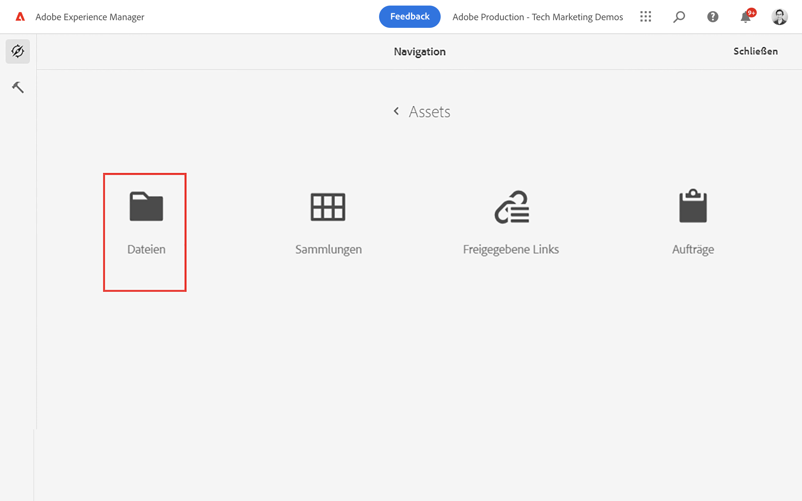

1. Tippen Sie auf **Erstellen** in der oberen rechten Ecke und dann auf **Ordner**. Geben Sie im daraufhin angezeigten Dialogfeld Folgendes ein:

   * Titel*: **Mein Projekt**
   * Name: **my-project**

   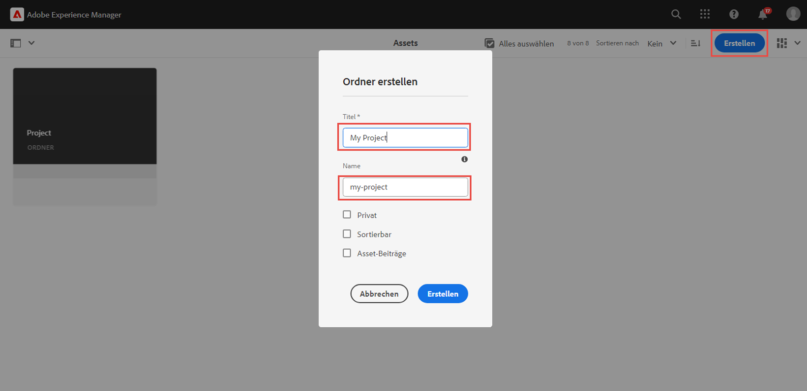

1. Wählen Sie den Ordner **Mein Ordner** und tippen Sie auf **Eigenschaften**.

   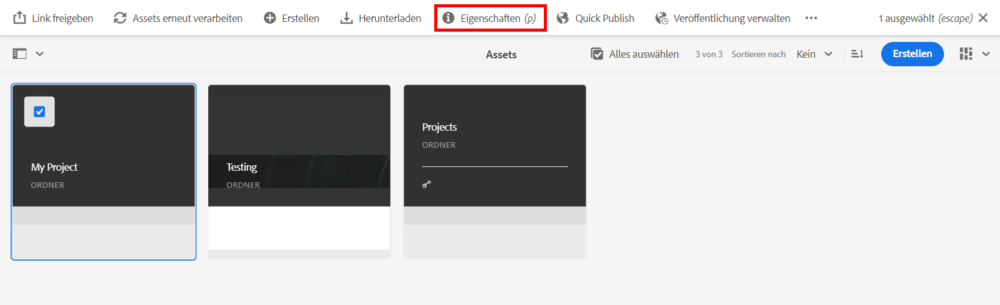

1. Tippen Sie auf die Registerkarte **Cloud Services**. Wählen Sie auf der Registerkarte „Cloud-Konfiguration“ mit dem Pfadsucher die Konfiguration **Mein Projekt** aus. Der Wert sollte `/conf/my-project` sein.

   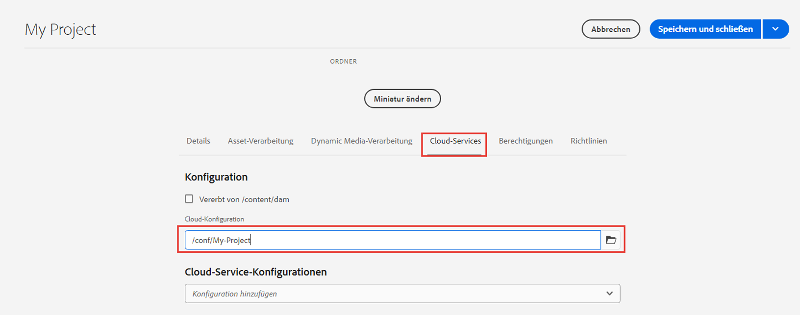

   Durch Festlegen dieser Eigenschaft können Inhaltsfragmente mithilfe der im vorherigen Kapitel erstellten Modelle erstellt werden.

1. Tippen Sie auf die Registerkarte **Richtlinien** und wählen Sie unter dem Feld **Zulässige Inhaltsfragmentmodelle** mit dem Pfadsucher das zuvor erstellte Modell **Person** und **Team** aus.

   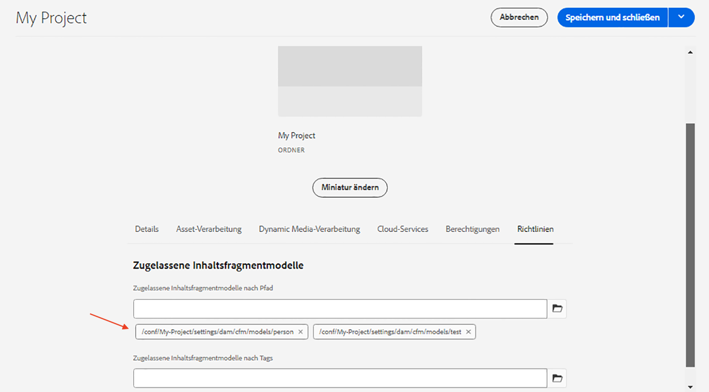

   Diese Richtlinien werden automatisch von allen Unterordnern übernommen und können überschrieben werden. Sie können auch Modelle nach Tags zulassen oder Modelle aus anderen Projektkonfigurationen aktivieren. Dieser Mechanismus bietet eine leistungsstarke Möglichkeit, Ihre Inhaltshierarchie zu verwalten.

1. Tippen Sie auf **Speichern und schließen**, um die Änderungen an den Ordnereigenschaften zu speichern.

1. Navigieren Sie in den Ordner **Mein Projekt**.

1. Erstellen Sie einen weiteren Ordner mit den folgenden Werten:

   * Titel*: **Englisch**
   * Name: **en**

   Es empfiehlt sich, Projekte für mehrsprachige Unterstützung einzurichten. Weitere Informationen finden Sie auf [der folgenden Dokumentseite](https://experienceleague.adobe.com/docs/experience-manager-cloud-service/content/assets/admin/translate-assets.html?lang=de).

## Erstellen eines Inhaltsmodells {#create-content-fragment}

Anschließend werden mehrere Inhaltsfragmente auf der Grundlage der Modelle **Team** und **Person** erstellt.

1. Tippen Sie auf dem AEM-Startbildschirm auf **Inhaltsfragmente**, um die Benutzeroberfläche für Inhaltsfragmente zu öffnen.

   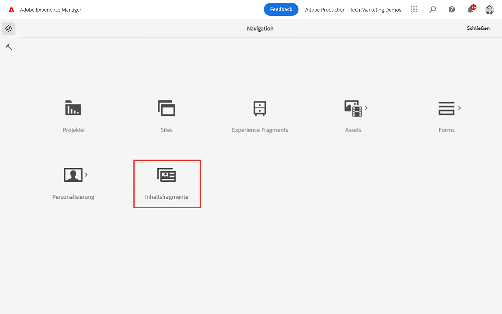

1. Erweitern Sie in der linken Leiste **Mein Projekt** und tippen Sie auf **Englisch**.
1. Tippen Sie auf **Erstellen**, um das Dialogfeld **Neues Inhaltsfragment** aufzurufen, und geben Sie die folgenden Werte ein:

   * Speicherort: `/content/dam/my-project/en`
   * Inhaltsfragmentmodell: **Person**
   * Titel: **Martin Müller**
   * Name: `john-doe`

   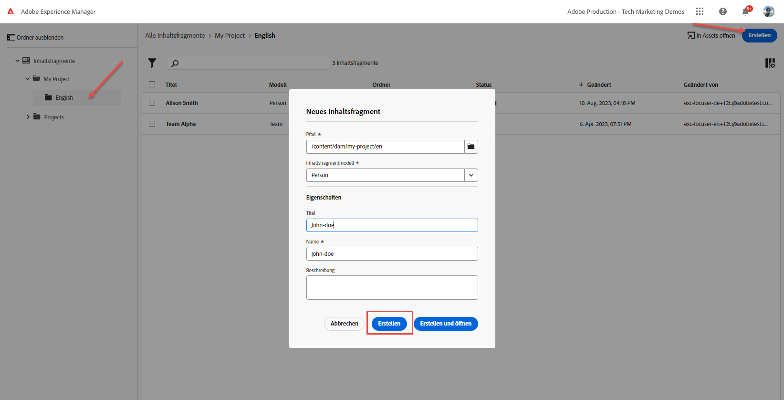
1. Tippen Sie auf **Erstellen**.
1. Wiederholen Sie die obigen Schritte, um ein Fragment zu erstellen, das **Alina Schmidt** darstellt:

   * Speicherort: `/content/dam/my-project/en`
   * Inhaltsfragmentmodell: **Person**
   * Titel: **Alina Schmidt**
   * Name: `alison-smith`

   Tippen Sie auf **Erstellen**, um das Fragment „Person“ zu erstellen.

1. Als Nächstes wiederholen Sie die Schritte, um ein **Team**-Fragment zu erstellen, das **Team Alpha** darstellt:

   * Speicherort: `/content/dam/my-project/en`
   * Inhaltsfragmentmodell: **Team**
   * Titel: **Team Alpha**
   * Name: `team-alpha`

   Tippen Sie auf **Erstellen**, um das Fragment „Team“ zu erstellen.

1. Unter **Mein Projekt** > **Englisch** sollten sich jetzt drei Inhaltsfragmente befinden:

   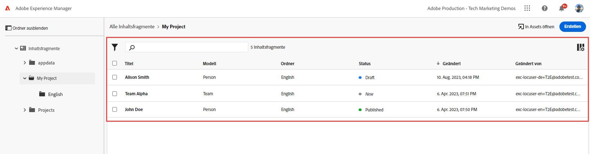

## Bearbeiten von Personen-Inhaltsfragmenten {#edit-person-content-fragments}

Füllen Sie anschließend die neu erstellten Fragmente mit Daten.

1. Tippen Sie auf das Kontrollkästchen neben **Martin Müller** und dann auf **Öffnen**.

   

1. Der Inhaltsfragment-Editor enthält ein Formular, das auf dem Inhaltsfragmentmodell basiert. Füllen Sie die verschiedenen Felder aus, um dem Fragment **Martin Müller** Inhalte hinzuzufügen. Laden Sie für das Profilbild Ihr eigenes Bild in AEM Assets hoch.

   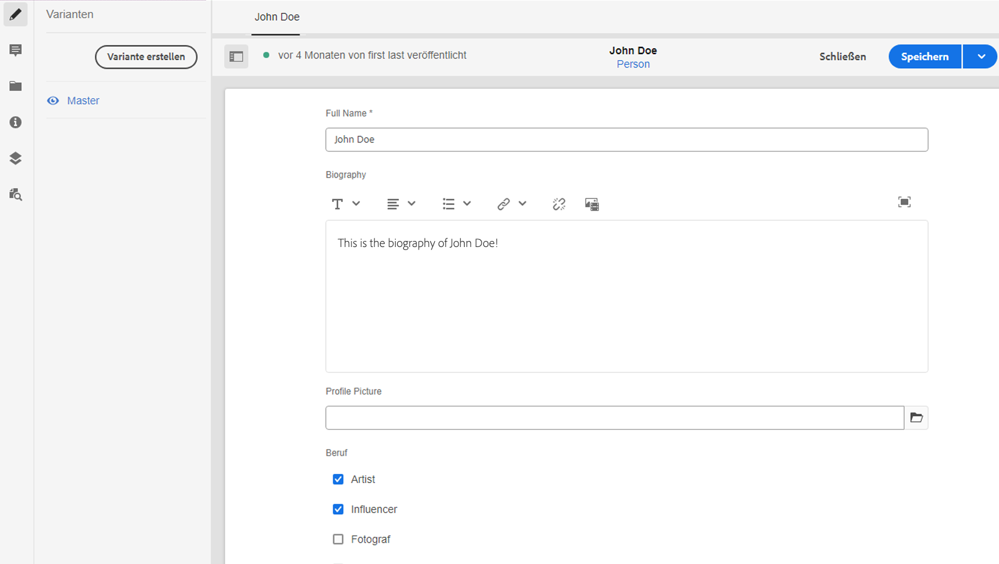

1. Tippen Sie auf **Speichern und schließen**, um die Änderungen am Fragment „Martin Müller“ zu speichern.
1. Kehren Sie zur Benutzeroberfläche „Inhaltsfragment“ zurück und öffnen Sie die Datei **Alina Schmidt** zur Bearbeitung.
1. Wiederholen Sie die obigen Schritte, um das Fragment **Alina Schmidt** mit Inhalten zu füllen.

## Bearbeiten des Team-Inhaltsfragments {#edit-team-content-fragment}

1. Öffnen Sie das Inhaltsfragment **Team Alpha** mithilfe der Benutzeroberfläche für Inhaltsfragmente.
1. Füllen Sie die Felder für **Titel**, **Kurzname** und **Beschreibung** aus.
1. Wählen Sie die Inhaltsfragmente **Martin Müller** und **Alina Schmidt** aus, um das Feld **Team-Mitglieder** zu füllen:

   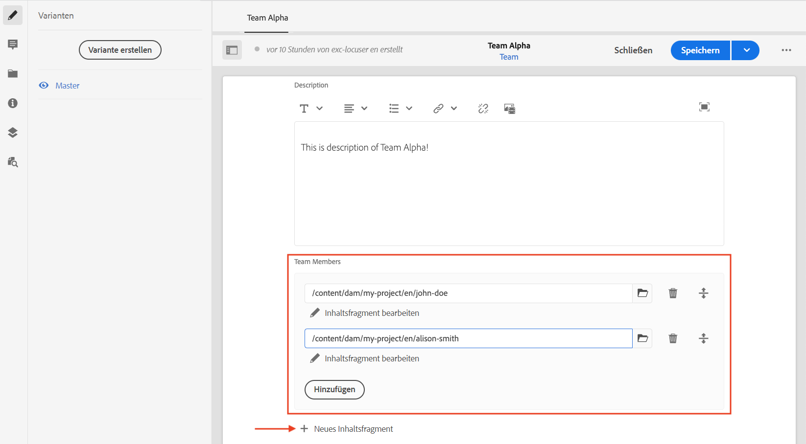

   >[!NOTE]
   >
   >Sie können Inhaltsfragmente auch inline erstellen, indem Sie die Schaltfläche **Neues Inhaltsfragment** verwenden.

1. Tippen Sie auf **Speichern und schließen**, um die Änderungen am Team Alpha-Fragment zu speichern.

## Veröffentlichen von Inhaltsfragmenten

Nach Überprüfung und Verifizierung veröffentlichen Sie die verfassten `Content Fragments`

1. Tippen Sie auf dem AEM-Startbildschirm auf **Inhaltsfragmente**, um die Benutzeroberfläche für Inhaltsfragmente zu öffnen.

1. Erweitern Sie in der linken Leiste **Mein Projekt** und tippen Sie auf **Englisch**.

1. Tippen Sie auf das Kontrollkästchen neben den Inhaltsfragmenten und dann auf **Veröffentlichen**.
   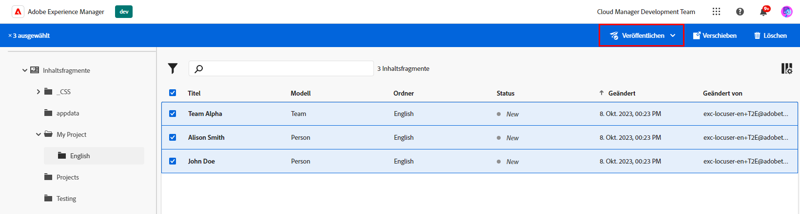

## Herzlichen Glückwunsch! {#congratulations}

Herzlichen Glückwunsch! Sie haben mehrere Inhaltsfragmente und eine Variation erstellt.

## Nächste Schritte {#next-steps}

Im nächsten Kapitel [GraphQL-APIs](explore-graphql-api.md) werden Sie AEM GraphQL-APIs mithilfe des integrierten GraphQL-Tools erkunden. Erfahren Sie, wie AEM automatisch ein GraphQL-Schema auf der Grundlage eines Inhaltsfragmentmodells generiert. Sie werden mit der Erstellung grundlegender Abfragen unter Verwendung der GraphQL-Syntax experimentieren.

## Verwandte Dokumentation

* [Verwalten von Inhaltsfragmenten](https://experienceleague.adobe.com/docs/experience-manager-cloud-service/content/assets/content-fragments/content-fragments-managing.html?lang=de)
* [Varianten – Erstellen von Fragmentinhalten](https://experienceleague.adobe.com/docs/experience-manager-cloud-service/content/assets/content-fragments/content-fragments-variations.html?lang=de)
