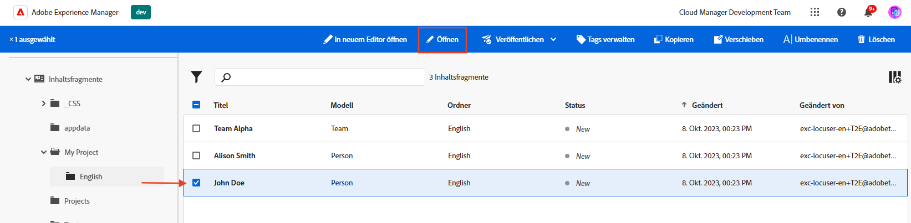

# Erstellen von Inhaltsfragmenten {#authoring-content-fragments}

In diesem Kapitel erstellen und bearbeiten Sie ein neues Inhaltsfragment, das auf dem [neu definiertes Inhaltsfragmentmodell](./content-fragment-models.md). Außerdem erfahren Sie, wie Sie Varianten von Inhaltsfragmenten erstellen.

## Voraussetzungen {#prerequisites}

Dies ist ein mehrteiliges Tutorial, und es wird davon ausgegangen, dass die im [Definieren von Inhaltsfragmentmodellen](./content-fragment-models.md) wurden abgeschlossen.

## Ziele {#objectives}

* Inhaltsfragment basierend auf einem Inhaltsfragmentmodell erstellen
* Erstellen einer Inhaltsfragmentvariante

## Erstellen eines Asset-Ordners

Inhaltsfragmente werden in Ordnern in AEM Assets gespeichert. Um Inhaltsfragmente aus den im vorherigen Kapitel erstellten Modellen zu erstellen, muss ein Ordner erstellt werden, in dem sie gespeichert werden. Für den Ordner ist eine Konfiguration erforderlich, um die Erstellung von Fragmenten aus bestimmten Modellen zu ermöglichen.

1. Navigieren Sie im Bildschirm AEM Start zu **Assets** > **Dateien**.

   

1. Tippen **Erstellen** in der Ecke tippen Sie auf **Ordner**. Geben Sie im daraufhin angezeigten Dialogfeld Folgendes ein:

   * Titel*: **Mein Projekt**
   * Name: **my-project**

   

1. Wählen Sie die **Eigener Ordner** Ordner und tippen Sie auf **Eigenschaften**.

   

1. Tippen Sie auf **Cloud Services** Registerkarte. under **Cloud-Konfiguration** Verwenden Sie die Pfadsuche, um die **Mein Projekt** Konfiguration. Der Wert sollte `/conf/my-project`.

   

   Durch Festlegen dieser Eigenschaft können Inhaltsfragmente mithilfe der im vorherigen Kapitel erstellten Modelle erstellt werden.

1. Tippen Sie auf **Richtlinien** Registerkarte. under **Zulässige Inhaltsfragmentmodelle** Verwenden Sie die Pfadsuche, um die **Person** und **Team** -Modell, das zuvor erstellt wurde.

   

   Diese Richtlinien werden automatisch von allen Unterordnern übernommen und können überschrieben werden. Beachten Sie, dass Sie auch Modelle nach Tags zulassen oder Modelle aus anderen Projektkonfigurationen aktivieren können (z. B. WKND Shared). Dieser Mechanismus bietet eine leistungsstarke Möglichkeit, Ihre Inhaltshierarchie zu verwalten.

1. Tippen **Speichern und schließen** , um die Änderungen an den Ordnereigenschaften zu speichern.

1. Navigieren Sie in der **Mein Projekt** Ordner.

1. Erstellen Sie einen weiteren Ordner mit den folgenden Werten:

   * Titel*: **englisch**
   * Name: **en**

   Es empfiehlt sich, Projekte für mehrsprachige Unterstützung einzurichten. Siehe [Weitere Informationen finden Sie auf der folgenden Dokumentationsseite .](https://experienceleague.adobe.com/docs/experience-manager-cloud-service/content/assets/admin/translate-assets.html).

## Erstellen eines Inhaltsfragments {#create-content-fragment}

Als Nächstes werden basierend auf dem **Team** und **Person** Modelle.

1. Tippen Sie auf dem AEM Startbildschirm auf **Inhaltsfragmente** , um die Benutzeroberfläche für Inhaltsfragmente zu öffnen.

   

1. Erweitern Sie in der linken Leiste **Mein Projekt** und tippen **englisch**.
1. Tippen **Erstellen** um **Neues Inhaltsfragment** und geben Sie die folgenden Werte ein:

   * Speicherort: `/content/dam/my-project/en`
   * Inhaltsfragmentmodell: **Person**
   * Titel: **John Doe**
   * Name: `john-doe`

   
1. Tippen Sie auf **Erstellen**.
1. Wiederholen Sie die obigen Schritte, um ein neues Fragment zu erstellen, das **Alison Smith**:

   * Speicherort: `/content/dam/my-project/en`
   * Inhaltsfragmentmodell: **Person**
   * Titel: **Alison Smith**
   * Name: `alison-smith`

   Tippen **Erstellen** , um das neue Personen-Fragment zu erstellen.

1. Wiederholen Sie als Nächstes die Schritte zum Erstellen eines neuen **Team** Fragmentdarstellung **Team Alpha**:

   * Speicherort: `/content/dam/my-project/en`
   * Inhaltsfragmentmodell: **Team**
   * Titel: **Team Alpha**
   * Name: `team-alpha`

   Tippen **Erstellen** , um das neue Team-Fragment zu erstellen.

1. Es sollten jetzt drei Inhaltsfragmente unter **Mein Projekt** > **englisch**:

   

## Bearbeiten von Personen-Inhaltsfragmenten {#edit-person-content-fragments}

Füllen Sie anschließend die neu erstellten Fragmente mit Daten.

1. Tippen Sie auf das Kontrollkästchen neben **John Doe** und tippen **Öffnen**.

   

1. Der Inhaltsfragment-Editor enthält ein Formular, das auf dem Inhaltsfragmentmodell basiert. Füllen Sie die verschiedenen Felder aus, um dem **John Doe** Fragment. Wählen Sie für den Profilbild eines der Bilder in WKND Shared aus oder laden Sie Ihr eigenes Bild in AEM Assets hoch.

   

1. Tippen Sie als Nächstes auf **Variante erstellen** in der linken Leiste. Fügen Sie im Dialogfeld einen Typ hinzu: **Alternative** für den Variantennamen.

1. Ändern Sie einige Elemente im **Alternative** -Variante.

   

   Mit der Variantenfunktion können Autoren verschiedene Versionen desselben Inhaltsfragments erstellen. Dies kann verwendet werden, um eine Zusammenfassungsversion eines Langform-Artikels bereitzustellen. Standardmäßig ist eine **Übergeordnet** -Variante erstellt wird. Mehrzeilige Textfeldelemente einer Variante können mit der Übergeordneten Variante synchronisiert werden.

1. Tippen **Speichern und schließen** , um die Änderungen am Fragment &quot;Max Mustermann&quot;zu speichern.
1. Kehren Sie zur Benutzeroberfläche &quot;Inhaltsfragment&quot;zurück und öffnen Sie die **Alison Smith** Datei zur Bearbeitung.
1. Wiederholen Sie die obigen Schritte, um die **Alison Smith** Fragment mit Inhalt.

## Bearbeiten von Team-Inhaltsfragmenten {#edit-team-content-fragment}

1. Öffnen Sie die **Team Alpha** Inhaltsfragment mithilfe der Benutzeroberfläche für Inhaltsfragmente.
1. Füllen Sie die Felder für **Titel**, **Kurzname** und **Beschreibung**.
1. Wählen Sie die **John Doe** und **Alison Smith** Inhaltsfragmente zum Ausfüllen der **Team-Mitglieder** -Feld:

   

   >[!NOTE]
   >
   >Sie können auch neue Inhaltsfragmente inline erstellen, indem Sie die **Neues Inhaltsfragment** Schaltfläche.

1. Tippen **Speichern und schließen** , um die Änderungen am Team Alpha-Fragment zu speichern.

## WKND-Inhaltsfragmente durchsuchen (optional) {#explore-wknd-content-fragments}

Wenn Sie [WKND Shared Sample Content installiert](./overview.md#install-sample-content) Sie können die Inhaltsfragmente nach den Modellen &quot;Adventures&quot;, &quot;Artikel&quot;und &quot;Autoren&quot;untersuchen, um weitere Ideen zum Erstellen von Inhalten zu erhalten.

## Herzlichen Glückwunsch! {#congratulations}

Herzlichen Glückwunsch! Sie haben gerade mehrere Inhaltsfragmente erstellt und eine Variante erstellt.

## Nächste Schritte {#next-steps}

Im nächsten Kapitel [GraphQL-APIs](explore-graphql-api.md), werden Sie AEM GraphQL-APIs mithilfe des integrierten GrapiQL-Tools untersuchen. Erfahren Sie, wie AEM basierend auf einem Inhaltsfragmentmodell automatisch ein GraphQL-Schema generiert. Sie experimentieren mit der Erstellung grundlegender Abfragen unter Verwendung der GraphQL-Syntax.

## Verwandte Dokumentation

* [Verwalten von Inhaltsfragmenten](https://experienceleague.adobe.com/docs/experience-manager-cloud-service/content/assets/content-fragments/content-fragments-managing.html)
* [Varianten – Erstellen von Fragmentinhalten](https://experienceleague.adobe.com/docs/experience-manager-cloud-service/content/assets/content-fragments/content-fragments-variations.html)
