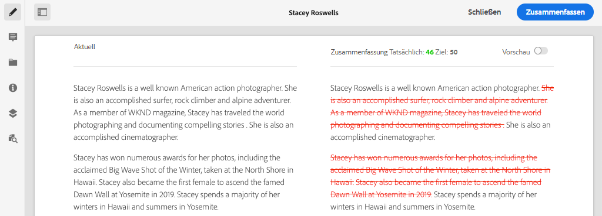

# Erstellen von Inhaltsfragmenten {#authoring-content-fragments}

In diesem Kapitel erstellen und bearbeiten Sie ein neues Inhaltsfragment, das auf dem [neu definierten Contributor Content Fragment Model](./content-fragment-models.md) basiert. Außerdem erfahren Sie, wie Sie Varianten von Inhaltsfragmenten erstellen.

## Voraussetzungen {#prerequisites}

Dies ist ein mehrteiliges Tutorial, und es wird davon ausgegangen, dass die unter [Definieren von Inhaltsfragmentmodellen](./content-fragment-models.md) beschriebenen Schritte abgeschlossen sind.

## Ziele {#objectives}

* Inhaltsfragment basierend auf einem Inhaltsfragmentmodell erstellen
* Erstellen einer Inhaltsfragmentvariante

## Inhaltsfragmentbearbeitung - Überblick {#overview}

>[!VIDEO](https://video.tv.adobe.com/v/22451/?quality=12&learn=on)

Das obige Video bietet einen allgemeinen Überblick über die Bearbeitung von Inhaltsfragmenten.

## Erstellen eines Inhaltsfragments {#create-content-fragment}

Im vorherigen Kapitel [Definieren von Inhaltsfragmentmodellen](./content-fragment-models.md) wurde ein **Contributor**-Modell erstellt. Erstellen Sie mit diesem Modell ein neues Inhaltsfragment.

1. Navigieren Sie im Menü **AEM Start** zu **Assets** > **Dateien**.
1. Klicken Sie durch die Ordner, um zu **WKND Site** > **English** > **Contributors** zu navigieren. Dieser Ordner enthält eine Liste von Kopfbildern für Mitarbeiter der WKND-Marke.

1. Klicken Sie oben rechts auf **Erstellen** und wählen Sie **Inhaltsfragment** aus:

   

1. Wählen Sie das Modell **Contributor** und klicken Sie auf **Next**.

   

   Dies ist dasselbe **Contributor**-Modell, das im vorherigen Kapitel erstellt wurde.

1. Geben Sie **Stacey Roswells** für den Titel ein und klicken Sie auf **Erstellen**.
1. Klicken Sie im Dialogfeld **Erfolg** auf **, um das neu erstellte Fragment zu öffnen.**

   

   Beachten Sie, dass die vom Modell definierten Felder jetzt für die Erstellung dieser Instanz des Inhaltsfragments verfügbar sind.

1. Geben Sie für **Vollständiger Name** ein: **Stacey Roswells**.
1. Geben Sie für **Biografie** eine kurze Biografie ein. Benötigen Sie Anregungen? Sie können diese [Textdatei](assets/author-content-fragments/stacey-roswells-bio.txt) einfach wiederverwenden.
1. Klicken Sie für **Picture Reference** auf das Symbol **folder** und navigieren Sie zu **WKND Site** > **English** > **Contributors** > **stacey-roswells.jpg** . Dies wird zum Pfad ausgewertet: `/content/dam/wknd/en/contributors/stacey-roswells.jpg`.
1. Wählen Sie für **Beruf** **Fotograf** aus.

   

1. Klicken Sie auf **Speichern**, um die Änderungen zu speichern.

## Erstellen einer Inhaltsfragmentvariante

Alle Inhaltsfragmente beginnen mit einer **Übergeordnet** -Variante. Die **Übergeordnet**-Variante kann als *Standardinhalt* des Fragments betrachtet werden und wird automatisch verwendet, wenn der Inhalt über die GraphQL-APIs verfügbar gemacht wird. Es ist auch möglich, Varianten eines Inhaltsfragments zu erstellen. Diese Funktion bietet zusätzliche Flexibilität beim Entwerfen einer Implementierung.

Varianten können verwendet werden, um bestimmte Kanäle auszuwählen. Beispielsweise kann eine **mobile** Variante erstellt werden, die eine kleinere Textmenge enthält oder auf ein kanalspezifisches Bild verweist. Wie Varianten verwendet werden, hängt in der Tat von der Implementierung ab. Wie jede Funktion sollte vor der Verwendung eine sorgfältige Planung erfolgen.

Erstellen Sie anschließend eine neue Variante, um sich einen Überblick über die verfügbaren Funktionen zu verschaffen.

1. Öffnen Sie das Inhaltsfragment **Stacey Roswells** erneut.
1. Klicken Sie in der linken Seitenleiste auf **Variante erstellen**.
1. Geben Sie im Modal **Neue Variante** einen Titel von **Zusammenfassung** ein.

   

1. Klicken Sie in das mehrzeilige Feld **Biografie** und klicken Sie auf die Schaltfläche **Erweitern** , um die Vollbildansicht für das mehrzeilige Feld einzugeben.

   

1. Klicken Sie oben rechts im Menü auf **Text zusammenfassen**.

1. Geben Sie **Target** von **50** ein und klicken Sie auf **Start**.

   

   Dadurch wird eine Vorschau der Zusammenfassung geöffnet. AEM maschineller Sprachprozessor versucht, den Text anhand der Zielwortzahl zusammenzufassen. Sie können auch verschiedene Sätze zum Entfernen auswählen.

1. Klicken Sie auf **Zusammenfassung**, wenn Sie mit der Zusammenfassung zufrieden sind. Klicken Sie in das mehrzeilige Textfeld und schalten Sie die Schaltfläche **Erweitern** um, um zur Hauptansicht zurückzukehren.

1. Klicken Sie auf **Speichern**, um die Änderungen zu speichern.

## Erstellen eines zusätzlichen Inhaltsfragments

Wiederholen Sie die unter [Erstellen eines Inhaltsfragments](#create-content-fragment) beschriebenen Schritte, um einen zusätzlichen **Mitarbeiter** zu erstellen. Dies wird im nächsten Kapitel als Beispiel für die Abfrage mehrerer Fragmente verwendet.

1. Klicken Sie im Ordner **Contributors** rechts oben auf **Create** und wählen Sie **Content Fragment** aus:
1. Wählen Sie das Modell **Contributor** und klicken Sie auf **Next**.
1. Geben Sie **Jacob Wester** für den Titel ein und klicken Sie auf **Erstellen**.
1. Klicken Sie im Dialogfeld **Erfolg** auf **, um das neu erstellte Fragment zu öffnen.**
1. Geben Sie für **Vollständiger Name** ein: **Jacob Wester**.
1. Geben Sie für **Biografie** eine kurze Biografie ein. Benötigen Sie Anregungen? Sie können diese [Textdatei](assets/author-content-fragments/jacob-wester.txt) einfach wiederverwenden.
1. Klicken Sie für **Picture Reference** auf das Symbol **folder** und navigieren Sie zu **WKND Site** > **English** > **Contributors** > **jacob_wester.jpg**. Dies wird zum Pfad ausgewertet: `/content/dam/wknd/en/contributors/jacob_wester.jpg`.
1. Wählen Sie für **Occupation** **Writer**.
1. Klicken Sie auf **Speichern**, um die Änderungen zu speichern. Es ist nicht erforderlich, eine Variante zu erstellen, es sei denn, Sie möchten sie!

   

   Sie sollten jetzt zwei **Mitwirkende** Fragmente haben.

## Herzlichen Glückwunsch! {#congratulations}

Herzlichen Glückwunsch! Sie haben gerade mehrere Inhaltsfragmente erstellt und eine Variante erstellt.

## Nächste Schritte {#next-steps}

Im nächsten Kapitel [GraphQL-APIs](explore-graphql-api.md) durchsuchen Sie AEM GraphQL-APIs mit dem integrierten GrapiQL-Tool. Erfahren Sie, wie AEM basierend auf einem Inhaltsfragmentmodell automatisch ein GraphQL-Schema generiert. Sie experimentieren mit der Erstellung grundlegender Abfragen unter Verwendung der GraphQL-Syntax.
