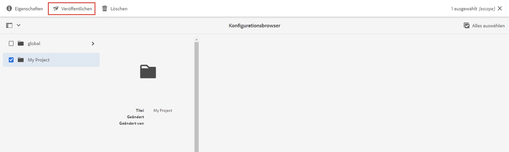
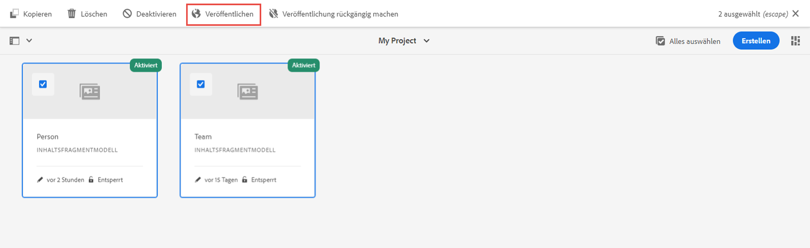

# Definieren von Inhaltsfragmentmodellen {#content-fragment-models}

In diesem Kapitel erfahren Sie, wie Sie Inhalte modellieren und ein Schema mit **Inhaltsfragmentmodellen** erstellen. Sie erfahren mehr über die verschiedenen Datentypen, mit denen ein Schema als Teil des Modells definiert werden kann.

Wir erstellen zwei einfache Modelle, **Team** und **Person**. Das Datenmodell **Team** hat einen Namen, einen Kurznamen und eine Beschreibung und verweist auf das Datenmodell **Person**, das den vollständigen Namen, Biodetails, ein Profilbild und eine Liste der Berufe enthält.

Sie können auch ein eigenes Modell erstellen, das den grundlegenden Schritten folgt und die entsprechenden Schritte wie GraphQL-Abfragen und React-App-Code anpassen oder einfach die in diesen Kapiteln beschriebenen Schritte ausführen.

## Voraussetzungen {#prerequisites}

Dies ist ein mehrteiliges Tutorial, bei dem davon ausgegangen wird, dass eine [AEM Author-Umgebung verfügbar ist](./overview.md#prerequisites).

## Ziele {#objectives}

* Erstellen eines Inhaltsfragmentmodells.
* Identifizieren Sie verfügbare Datentypen und Validierungsoptionen zum Erstellen von Modellen.
* Verstehen, wie das Inhaltsfragmentmodell **beide** das Datenschema und die Autorenvorlage für ein Inhaltsfragment definiert.

## Erstellen einer Projektkonfiguration

Eine Projektkonfiguration enthält alle Inhaltsfragmentmodelle, die einem bestimmten Projekt zugehören, und bietet die Möglichkeit, Modelle zu organisieren. Es muss mindestens ein Projekt **vor** dem Erstellen des Inhaltsfragmentmodells erstellt werden.

1. Melden Sie sich bei der AEM **Author-** Umgebung an (z. B. `https://author-pYYYY-eXXXX.adobeaemcloud.com/`)
1. Navigieren Sie im AEM-Startbildschirm zu **Tools** > **Allgemein** > **Konfigurations-Browser**.

   
1. Klicken Sie auf **Erstellen** in der oberen rechten Ecke
1. Geben Sie im daraufhin angezeigten Dialogfeld Folgendes ein:

   * Titel*: **Mein Projekt**
   * Name*: **mein-projekt** (verwenden Sie vorzugsweise nur Kleinbuchstaben mit Bindestrichen, um Wörter zu trennen. Diese Zeichenfolge beeinflusst den eindeutigen GraphQL-Endpunkt, an den Client-Anwendungen Anforderungen ausführen.)
   * Kreuzen Sie **Inhaltsfragmentmodelle** an
   * Kreuzen Sie **GraphQL – Persistente Abfragen** an

   

## Erstellen von Inhaltsfragmentmodellen

Erstellen Sie als Nächstes zwei Modelle für ein **Team** und eine **Person**.

### Erstellen des Personenmodells

Erstellen Sie ein Modell für eine **Person** als Datenmodell, das eine Person darstellt, die Teil eines Teams ist.

1. Navigieren Sie im AEM-Startbildschirm zu **Tools** > **Allgemein** > **Inhaltsfragmentmodelle**.

   

1. Navigieren Sie zum Ordner **Mein Projekt**.
1. Tippen Sie auf **Erstellen** in der oberen rechten Ecke, um den **Modellerstellungs**-Assistenten aufzurufen.
1. Geben Sie **Person** im Feld **Modelltitel** ein und tippen Sie auf **Erstellen**. Tippen Sie im daraufhin angezeigten Dialogfeld auf **Öffnen**, um das Modell zu erstellen.

1. Ziehen Sie ein **Einzelzeilentext**-Element in das Hauptbedienfeld. Geben Sie die folgenden Eigenschaften in der Registerkarte **Eigenschaften** ein:

   * **Feldbezeichnung**: **Vollständiger Name**
   * **Eigenschaftsname**: `fullName`
   * Auswahl **Erforderlich**

   

   Der **Eigenschaftsname** definiert den Namen der Eigenschaft, die in AEM persistiert wird. Der **Eigenschaftsname** definiert auch den Namen des **Schlüssels** für diese Eigenschaft als Teil des Datenschemas. Dieser **Schlüssel** wird verwendet, wenn die Inhaltsfragmentdaten über GraphQL-APIs verfügbar gemacht werden.

1. Tippen Sie auf die Registerkarte **Datentypen** und ziehen per Drag &amp; Drop ein **mehrzeiliger Textfeld** unter das Feld **Vollständiger Name**. Tragen Sie die folgenden Eigenschaften ein:

   * **Feldbezeichnung**: **Biografie**
   * **Eigenschaftsname**: `biographyText`
   * **Standardtyp**: **Rich-Text**

1. Klicken Sie auf die Registerkarte **Datentypen** und ziehen per Drag &amp; Drop das **Inhaltsreferenz**-Feld hinein. Tragen Sie die folgenden Eigenschaften ein:

   * **Feldbezeichnung**: **Profilbild**
   * **Eigenschaftsname**: `profilePicture`
   * **Stammverzeichnis**: `/content/dam`

   Bei der Konfiguration des **Stammverzeichnisses** können Sie auf das **Ordner**-Symbol klicken, um ein modales Fenster aufzurufen und den Pfad auszuwählen. Dadurch wird eingeschränkt, welche Ordner Autorinnen und Autoren nutzen können, um den Pfad auszufüllen. `/content/dam` ist der Stamm, in dem alle AEM Assets (Bilder, Videos, andere Inhaltsfragmente) gespeichert werden.

1. Fügen Sie eine Validierung zur **Bildreferenz** hinzu, sodass nur Content-Typen von **Bildern** zum Ausfüllen des Felds verwendet werden können.

   

1. Klicken Sie auf die Registerkarte **Datentypen** und ziehen Sie per Drag &amp; Drop einen **Auflistungs**-Datentyp unter das Feld **Bildreferenz**. Tragen Sie die folgenden Eigenschaften ein:

   * **Rendern als**: **Kontrollkästchen**
   * **Feldbezeichnung**: **Beruf**
   * **Eigenschaftsname**: `occupation`

1. Fügen Sie mehrere **Optionen** mithilfe der Schaltfläche **Option hinzufügen** hinzu. Verwenden Sie denselben Wert für **Optionsbeschriftung** und **Optionswert**:

   **Künstler oder Künstlerin**, **Influencer oder Influencerin**, **Fotograf oder Fotografin**, **Reisender oder Reisende**, **Verfasser oder Verfasserin**, **YouTuber oder YouTuberin**

1. Das endgültige **Personen** modell sollte wie folgt aussehen:

   

1. Klicken Sie auf **Speichern**, um die Änderungen zu speichern.

### Erstellen des Teammodells

Erstellen Sie ein Modell für ein **Team** als Datenmodell für ein Personenteam. Das Teammodell verweist auf das Personenmodell, um die Mitglieder des Teams zu repräsentieren.

1. Tippen Sie im Ordner **Mein Projekt** auf **Erstellen** in der oberen rechten Ecke, um den Assistenten zum **Erstellen eines Modells** aufzurufen.
1. Geben Sie im Feld **Modelltitel** **Team** ein und tippen Sie auf **Erstellen**.

   Tippen Sie auf **Öffnen** im erscheinenden Dialogfeld, um das neu erstellte Modell zu öffnen.

1. Ziehen Sie per Drag-and-Drop ein **Einzelzeilentext**-Element ins Hauptbedienfeld. Geben Sie die folgenden Eigenschaften in der Registerkarte **Eigenschaften** ein:

   * **Feldbezeichnung**: **Titel**
   * **Eigenschaftsname**: `title`
   * Kreuzen Sie **Erforderlich** an

1. Tippen Sie auf die Registerkarte **Datentypen** und ziehen Sie per Drag-and-Drop ein **Einzelzeilentext**-Element ins Hauptbedienfeld. Geben Sie die folgenden Eigenschaften in der Registerkarte **Eigenschaften** ein:

   * **Feldbezeichnung**: **Kurzname**
   * **Eigenschaftsname**: `shortName`
   * Kreuzen Sie **Erforderlich** an
   * Kreuzen Sie **Eindeutig** an
   * Wählen Sie unter **Validierungstyp** > **Benutzerdefiniert**
   * Geben Sie unter **Benutzerdefinierter Validierungs-Regex** > `^[a-z0-9\-_]{5,40}$` ein – dadurch wird sichergestellt, dass nur alphanumerische Kleinbuchstaben und Gedankenstriche zwischen 5 und 40 Zeichen eingegeben werden können.

   Die Eigenschaft `shortName` bietet uns eine Möglichkeit, ein einzelnes Team anhand eines verkürzten Pfads abzufragen. Die Einstellung **Eindeutig** stellt sicher, dass der Wert pro Inhaltsfragment dieses Modells immer eindeutig ist.

1. Tippen Sie auf die Registerkarte **Datentypen** und ziehen Sie per Drag-and-Drop ein **mehrzeiliges Text** feld unter das Feld **Kurzname**. Tragen Sie die folgenden Eigenschaften ein:

   * **Feldbezeichnung**: **Beschreibung**
   * **Eigenschaftsname**: `description`
   * **Standardtyp**: **Rich-Text**

1. Klicken Sie auf die Registerkarte **Datentypen** und legen Sie per Drag-and-Drop ein **Fragmentverweis**-Feld darin ab. Tragen Sie die folgenden Eigenschaften ein:

   * **Rendern als**: **Mehrere Felder**
   * **Feldbezeichnung**: **Team-Mitglieder**
   * **Eigenschaftsname**: `teamMembers`
   * **Zulässige Inhaltsfragmentmodelle**: Wählen Sie über das Ordnersymbol das **Personen** modell aus.

1. Das endgültige **Team** modell sollte wie folgt aussehen:

   

1. Klicken Sie auf **Speichern**, um die Änderungen zu speichern.

1. Sie sollten jetzt zwei Modelle haben, von denen aus Sie arbeiten können:

   

## Veröffentlichen von Projektkonfiguration und Inhaltsfragmentmodellen

Nach Überprüfung veröffentlichen Sie die `Project Configuration` und `Content Fragment Model`

1. Vom AEM-Startbildschirm, navigieren Sie zu **Tools** > **Allgemein** > **Konfigurations-Browser**.

1. Tippen Sie auf das Kontrollkästchen neben **Mein Projekt** und dann auf **Veröffentlichen**

   

1. Navigieren Sie auf dem AEM-Startbildschirm zu **Tools** > **Allgemein** > **Inhaltsfragmentmodelle**.

1. Navigieren Sie zum Ordner **Mein Projekt**.

1. Tippen Sie auf die Modelle **Person** und **Team** und dann auf **Veröffentlichen**.

   

## Herzlichen Glückwunsch! {#congratulations}

Herzlichen Glückwunsch, Sie haben gerade Ihre ersten Inhaltsfragmentmodelle erstellt!

## Nächste Schritte {#next-steps}

Im nächsten Kapitel, [Erstellen von Inhaltsfragmentmodellen](author-content-fragments.md), erstellen und bearbeiten Sie ein neues Inhaltsfragment, das auf einem Inhaltsfragmentmodell basiert. Außerdem erfahren Sie, wie Sie Varianten von Inhaltsfragmenten erstellen.

## Verwandte Dokumentation

* [Inhaltsfragmentmodelle](https://experienceleague.adobe.com/docs/experience-manager-cloud-service/content/assets/content-fragments/content-fragments-models.html?lang=de)

