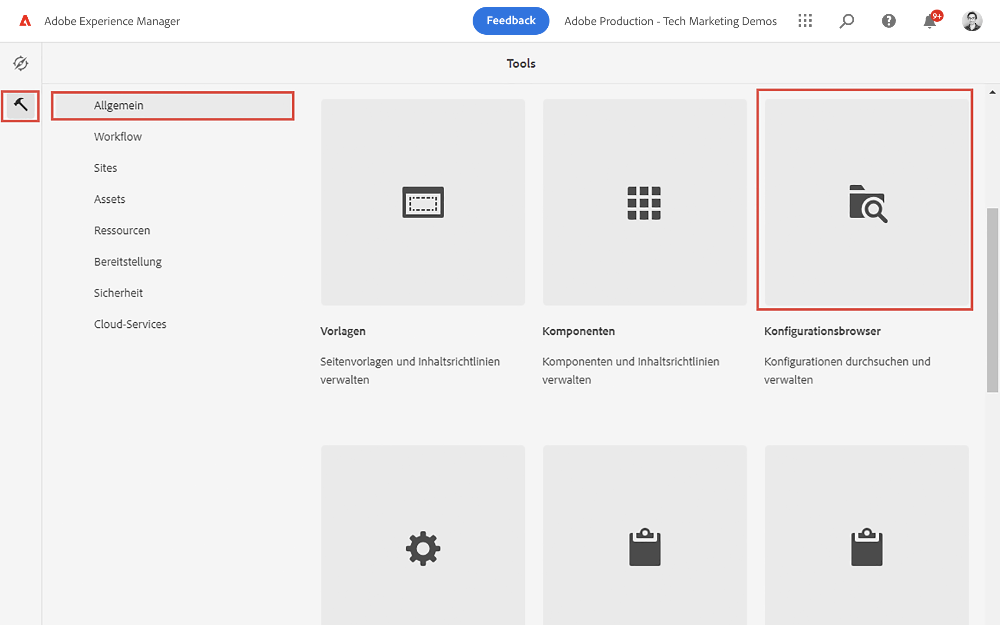
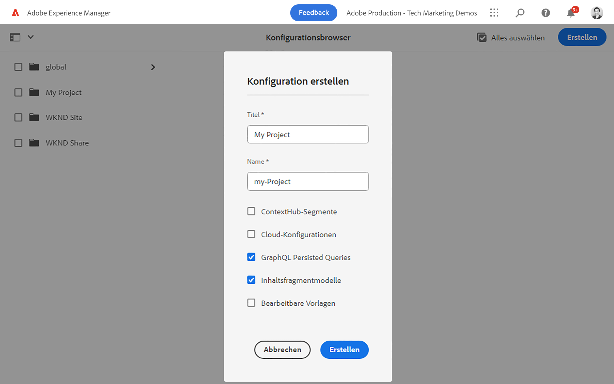
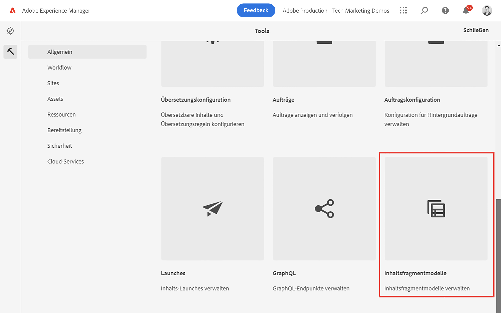
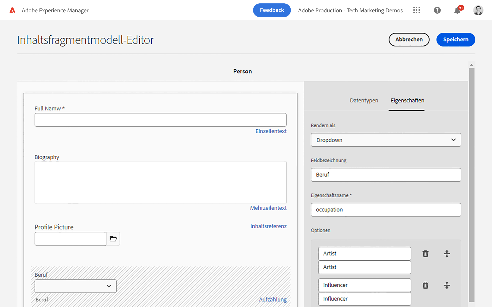
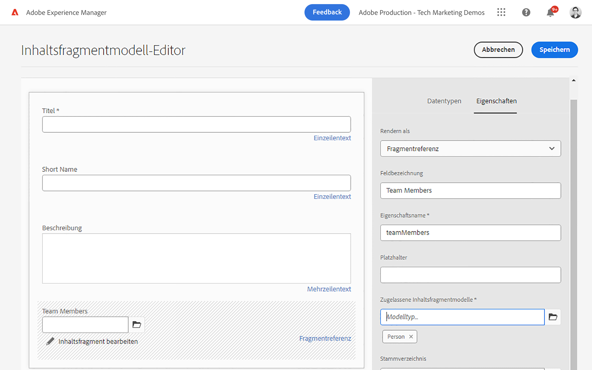
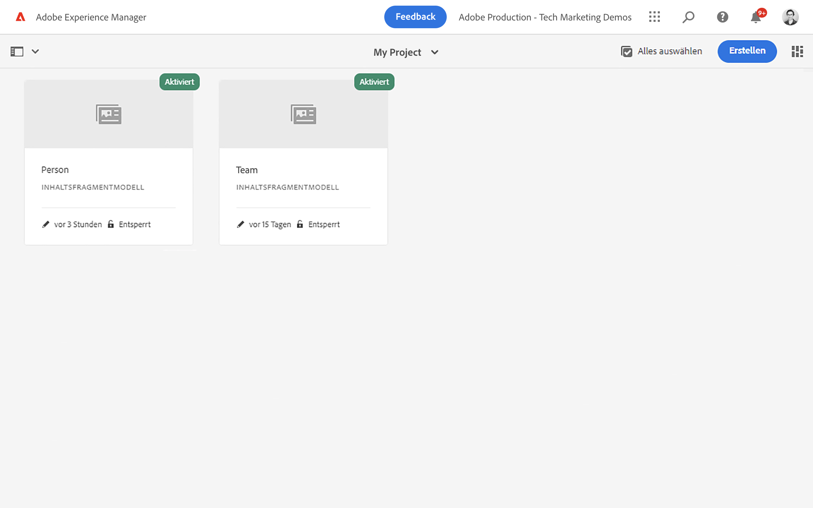
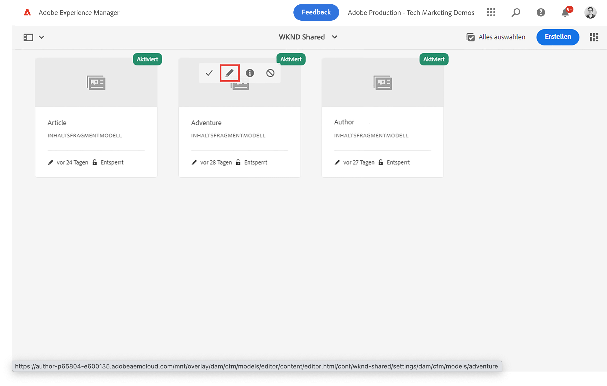

# Definieren von Inhaltsfragmentmodellen {#content-fragment-models}

In diesem Kapitel erfahren Sie, wie Sie Inhalte modellieren und ein Schema mit **Inhaltsfragmentmodelle**. Sie erfahren mehr über die verschiedenen Datentypen, mit denen ein Schema als Teil des Modells definiert werden kann.

In diesem Kapitel werden zwei einfache Modelle erstellt, **Team** und **Person**. Die **Team** Das Datenmodell verfügt über den Namen, den Kurznamen und die Beschreibung und referenziert die **Person** Datenmodell mit Vollname-, Biodetails-, Profilbild- und Berufsliste.

Sie können auch Ihr eigenes Modell gemäß den grundlegenden Schritten erstellen und die entsprechenden Schritte wie GraphQL-Abfragen und React-App-Code anpassen oder einfach die in diesen Kapiteln beschriebenen Schritte ausführen.

## Voraussetzungen {#prerequisites}

Dies ist ein mehrteiliges Tutorial, bei dem davon ausgegangen wird, dass ein [AEM Autorenumgebung ist verfügbar](./overview.md#prerequisites) und optional die [WKND Freigegebener Beispielinhalt wurde installiert](./overview.md#install-sample-content).

## Ziele {#objectives}

* Erstellen Sie ein neues Inhaltsfragmentmodell.
* Identifizieren Sie verfügbare Datentypen und Validierungsoptionen zum Erstellen von Modellen.
* So definiert das Inhaltsfragmentmodell **both** das Datenschema und die Authoring-Vorlage für ein Inhaltsfragment.

## Neue Projektkonfiguration erstellen

Eine Projektkonfiguration enthält alle Inhaltsfragmentmodelle, die mit einem bestimmten Projekt verknüpft sind, und bietet eine Möglichkeit, Modelle zu organisieren. Es muss mindestens ein Projekt erstellt werden **before** Erstellen eines neuen Inhaltsfragmentmodells.

1. Melden Sie sich beim AEM an **Autor** Umgebung.
1. Navigieren Sie im Bildschirm AEM Start zu **Instrumente** > **Allgemein** > **Konfigurationsbrowser**.

   
1. Klicken Sie auf **Erstellen**.
1. Geben Sie im daraufhin angezeigten Dialogfeld Folgendes ein:

   * Titel*: **Mein Projekt**
   * Name*: **my-project** (verwenden Sie vorzugsweise Kleinbuchstaben mit Bindestrichen, um Wörter zu trennen. Diese Zeichenfolge beeinflusst den eindeutigen GraphQL-Endpunkt, für den Clientanwendungen Anfragen ausführen.)
   * Überprüfen **Inhaltsfragmentmodelle**
   * Überprüfen **GraphQL - Persistente Abfragen**

   

## Erstellen von Inhaltsfragmentmodellen

Erstellen Sie als Nächstes zwei Modelle für eine **Team** und **Person**.

### Erstellen des Personenmodells

Erstellen Sie ein neues Modell für eine **Person**: das Datenmodell, das eine Person darstellt, die Teil eines Teams ist.

1. Navigieren Sie im Bildschirm AEM Start zu **Instrumente** > **Allgemein** > **Inhaltsfragmentmodelle**.

   

   Wenn Sie die [Beispielinhalt](overview.md#install-sample-content) dann werden Ihnen zwei Ordner angezeigt: **Mein Projekt** und **WKND Shared**.
1. Navigieren Sie zur **Mein Projekt** Ordner.
1. Tippen **Erstellen** in der oberen rechten Ecke, um die **Modell erstellen** Assistent.
1. Für **Modelltitel** enter: **Person** und tippen **Erstellen**.

   Tippen **Öffnen** im Dialogfeld, um das neu erstellte Modell zu öffnen.

1. Ziehen und Ablegen eines **Einzelzeilentext** -Element in das Hauptbedienfeld ein. Geben Sie die folgenden Eigenschaften in die **Eigenschaften** tab:

   * **Feldbezeichnung**: **Vollständiger Name**
   * **Eigenschaftsname**: `fullName`
   * Überprüfen **Erforderlich**

   

   Die **Eigenschaftsname** definiert den Namen der Eigenschaft, die in AEM beibehalten wird. Die **Eigenschaftsname** definiert auch **key** Name für diese Eigenschaft als Teil des Datenschemas. Diese **key** wird verwendet, wenn die Inhaltsfragmentdaten über GraphQL-APIs verfügbar gemacht werden.

1. Tippen Sie auf **Datentypen** Registerkarte und per Drag &amp; Drop **Mehrzeiliger Text** Feld unter **Vollständiger Name** -Feld. Geben Sie die folgenden Eigenschaften ein:

   * **Feldbezeichnung**: **Biografie**
   * **Eigenschaftsname**: `biographyText`
   * **Standardtyp**: **Rich-Text**

1. Klicken Sie auf **Datentypen** Registerkarte und per Drag &amp; Drop **Inhaltsreferenz** -Feld. Geben Sie die folgenden Eigenschaften ein:

   * **Feldbezeichnung**: **Profilbild**
   * **Eigenschaftsname**: `profilePicture`
   * **Stammverzeichnis**: `/content/dam`

   Bei der Konfiguration der **Stammverzeichnis** Sie können auf die **Ordner** -Symbol, um ein Modal aufzurufen und den Pfad auszuwählen. Dadurch wird eingeschränkt, welche Ordnerautoren den Pfad ausfüllen können. `/content/dam` ist der Stamm, in dem alle AEM Assets (Bilder, Videos, andere Inhaltsfragmente) gespeichert werden.

1. Hinzufügen einer Validierung zum **Picture Reference** sodass nur Content-Typen **Bilder** kann zum Ausfüllen des Felds verwendet werden.

   

1. Klicken Sie auf **Datentypen** Registerkarte und per Drag &amp; Drop **Auflistung**  Datentyp unter **Picture Reference** -Feld. Geben Sie die folgenden Eigenschaften ein:

   * **Rendern als**: **Kontrollkästchen**
   * **Feldbezeichnung**: **Beruf**
   * **Eigenschaftsname**: `occupation`

1. Mehrere hinzufügen **Optionen** mithilfe der **Option hinzufügen** Schaltfläche. Verwenden Sie denselben Wert für **Optionsbeschriftung** und **Optionswert**:

   **Künstler**, **Einflussnehmer**, **Fotograf**, **Reisende**, **Writer**, **YouTuber**

1. Das endgültige **Person** -Modell sollte wie folgt aussehen:

   

1. Klicken Sie auf **Speichern**, um die Änderungen zu speichern.

### Teammodell erstellen

Erstellen Sie ein neues Modell für eine **Team**, das Datenmodell für ein Personenteam. Das Team-Modell verweist auf das Personen-Modell, um die Mitglieder des Teams zu repräsentieren.

1. Im **Mein Projekt** Ordner, tippen Sie auf **Erstellen** in der oberen rechten Ecke, um die **Modell erstellen** Assistent.
1. Für **Modelltitel** enter: **Team** und tippen **Erstellen**.

   Tippen **Öffnen** im Dialogfeld, um das neu erstellte Modell zu öffnen.

1. Ziehen und Ablegen eines **Einzelzeilentext** -Element in das Hauptbedienfeld ein. Geben Sie die folgenden Eigenschaften in die **Eigenschaften** tab:

   * **Feldbezeichnung**: **Titel**
   * **Eigenschaftsname**: `title`
   * Überprüfen **Erforderlich**

1. Tippen Sie auf **Datentypen** Registerkarte erstellen und eine **Einzelzeilentext** -Element in das Hauptbedienfeld ein. Geben Sie die folgenden Eigenschaften in die **Eigenschaften** tab:

   * **Feldbezeichnung**: **Kurzname**
   * **Eigenschaftsname**: `shortName`
   * Überprüfen **Erforderlich**
   * Überprüfen **Eindeutig**
   * under **Validierungstyp** > Auswählen **Benutzerdefiniert**
   * under **Benutzerdefinierte Validierungsregex** > enter `^[a-z0-9\-_]{5,40}$` - Dadurch wird sichergestellt, dass nur alphanumerische Kleinbuchstaben und Bindestriche zwischen 5 und 40 Zeichen eingegeben werden können.

   Die `shortName` -Eigenschaft bietet uns eine Möglichkeit, ein einzelnes Team anhand eines verkürzten Pfads abzufragen. Die **Eindeutig** -Einstellung stellt sicher, dass der Wert pro Inhaltsfragment dieses Modells immer eindeutig ist.

1. Tippen Sie auf **Datentypen** Registerkarte und per Drag &amp; Drop **Mehrzeiliger Text** Feld unter **Kurzname** -Feld. Geben Sie die folgenden Eigenschaften ein:

   * **Feldbezeichnung**: **Beschreibung**
   * **Eigenschaftsname**: `description`
   * **Standardtyp**: **Rich-Text**

1. Klicken Sie auf **Datentypen** Registerkarte und per Drag &amp; Drop **Fragmentverweis** -Feld. Geben Sie die folgenden Eigenschaften ein:

   * **Rendern als**: **Mehrere Felder**
   * **Feldbezeichnung**: **Team-Mitglieder**
   * **Eigenschaftsname**: `teamMembers`
   * **Zulässige Inhaltsfragmentmodelle**: Wählen Sie über das Ordnersymbol die **Person** -Modell.

1. Das endgültige **Team** -Modell sollte wie folgt aussehen:

   

1. Klicken Sie auf **Speichern**, um die Änderungen zu speichern.

1. Sie sollten jetzt zwei Modelle haben, von denen aus Sie arbeiten können:

   

## Inspect der WKND-Inhaltsfragmentmodelle (optional)

Wenn Sie [WKND Shared Sample Content installiert](./overview.md#install-sample-content) Sie können die Modelle &quot;Adventure&quot;, &quot;Article&quot;und &quot;Author&quot;überprüfen, um mehr Ideen für Datenmodellierungstechniken zu erhalten.

1. Aus dem **AEM Start** Menünavigation zu **Instrumente** > **Allgemein** > **Inhaltsfragmentmodelle**.

1. Navigieren Sie zur **WKND Shared** -Ordner und sollten drei Modelle angezeigt werden: Artikel, Abenteuer und Autor.

1. Inspect der Modelle durch Bewegen des Mauszeigers über die Karte und Tippen auf das Bearbeitungssymbol (Bleistift)

   

1. Dadurch wird die **Inhaltsfragmentmodell-Editor** und Sie können die verschiedenen verwendeten Datentypen überprüfen.

   >[!CAUTION]
   >
   > Modell ändern **after** Inhaltsfragmente wurden erstellt und haben nachgelagerte Auswirkungen. Feldwerte in vorhandenen Fragmenten werden nicht mehr referenziert und das von GraphQL angezeigte Datenschema ändert sich, was sich auf bestehende Anwendungen auswirkt.

## Herzlichen Glückwunsch! {#congratulations}

Herzlichen Glückwunsch, Sie haben gerade Ihre ersten Inhaltsfragmentmodelle erstellt!

## Nächste Schritte {#next-steps}

Im nächsten Kapitel [Erstellen von Inhaltsfragmentmodellen](author-content-fragments.md)erstellen und bearbeiten Sie ein neues Inhaltsfragment, das auf einem Inhaltsfragmentmodell basiert. Außerdem erfahren Sie, wie Sie Varianten von Inhaltsfragmenten erstellen.

## Verwandte Dokumentation

* [Inhaltsfragmentmodelle](https://experienceleague.adobe.com/docs/experience-manager-cloud-service/content/assets/content-fragments/content-fragments-models.html)

