# Definieren von Inhaltsfragmentmodellen {#content-fragment-models}

In diesem Kapitel erfahren Sie, wie Sie Inhalte modellieren und ein Schema mit **Inhaltsfragmentmodellen** erstellen. Sie werden vorhandene Modelle überprüfen und ein neues Modell erstellen. Außerdem erfahren Sie mehr über die verschiedenen Datentypen, mit denen ein Schema als Teil des Modells definiert werden kann.

In diesem Kapitel erstellen Sie ein neues Modell für einen **Contributor**, der das Datenmodell für die Benutzer darstellt, die Zeitschriften- und Abenteuerinhalte als Teil der WKND-Marke erstellen.

## Voraussetzungen {#prerequisites}

Dies ist ein mehrteiliges Tutorial, und es wird davon ausgegangen, dass die in [Quick Setup](./setup.md) beschriebenen Schritte abgeschlossen sind.

## Ziele {#objectives}

* Erstellen Sie ein neues Inhaltsfragmentmodell.
* Identifizieren Sie verfügbare Datentypen und Validierungsoptionen zum Erstellen von Modellen.
* Erfahren Sie, wie das Inhaltsfragmentmodell **sowohl** das Datenschema als auch die Authoring-Vorlage für ein Inhaltsfragment definiert.

## Übersicht über das Inhaltsfragmentmodell {#overview}

>[!VIDEO](https://video.tv.adobe.com/v/22452/?quality=12&learn=on)

Das obige Video bietet einen allgemeinen Überblick über die Arbeit mit Inhaltsfragmentmodellen.

>[!CAUTION]
>
> Das obige Video zeigt die Erstellung des **Contributor**-Modells mit dem Namen `Contributors`. Stellen Sie beim Ausführen der Schritte in Ihrer eigenen Umgebung sicher, dass der Titel das Singular-Formular verwendet: `Contributor` ohne **s**. Die Benennung des Inhaltsfragmentmodells treibt die GraphQL-API-Aufrufe voran, die später im Tutorial durchgeführt werden.

## Inspect the Adventure Content Fragment Model

Im vorherigen Kapitel wurden mehrere Adventures-Inhaltsfragmente bearbeitet und in einer externen Anwendung angezeigt. Sehen wir uns das Adventure Content Fragment-Modell an, um das zugrunde liegende Datenschema dieser Fragmente zu verstehen.

1. Navigieren Sie im Menü **AEM Start** zu **Tools** > **Assets** > **Inhaltsfragmentmodelle**.

   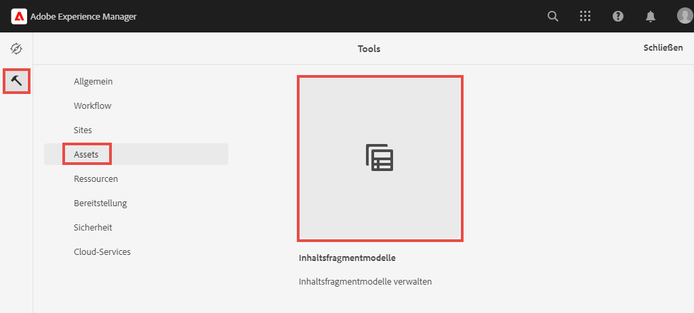

1. Navigieren Sie zum Ordner **WKND Site** und bewegen Sie den Mauszeiger über das Inhaltsfragmentmodell **Adventure** und klicken Sie auf das Symbol **Bearbeiten** (Stift), um das Modell zu öffnen.

   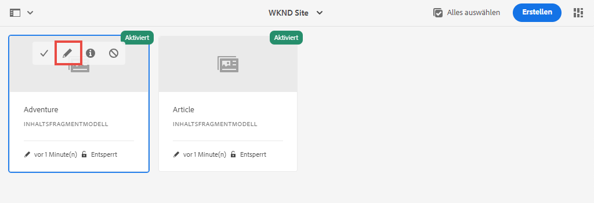

1. Dadurch wird der **Inhaltsfragmentmodell-Editor** geöffnet. Beachten Sie, dass die Felder, die das Abenteuer-Modell definieren, unterschiedliche **Datentypen** wie **Einzelzeilentext**, **Mehrzeiliger Text**, **Auflistung** und **Inhaltsreferenz** enthalten.

1. In der rechten Spalte des Editors werden die verfügbaren **Datentypen** aufgelistet, die die Formularfelder definieren, die für die Bearbeitung von Inhaltsfragmenten verwendet werden.

1. Wählen Sie im Hauptbereich das Feld **Titel** aus. Klicken Sie in der rechten Spalte auf die Registerkarte **Eigenschaften**:

   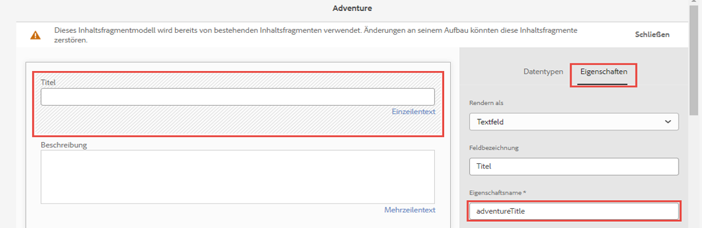

   Beachten Sie, dass das Feld **Eigenschaftsname** auf `adventureTitle` gesetzt ist. Dadurch wird der Name der Eigenschaft definiert, die in AEM beibehalten wird. Der **Eigenschaftsname** definiert auch den **key**-Namen für diese Eigenschaft als Teil des Datenschemas. Dieser **key** wird verwendet, wenn die Inhaltsfragmentdaten über GraphQL-APIs verfügbar gemacht werden.

   >[!CAUTION]
   >
   > Eine Änderung des **Eigenschaftsnamens** eines Felds **nach der** Inhaltsfragmente vom Modell abgeleitet werden, hat nachgelagerte Auswirkungen. Feldwerte in vorhandenen Fragmenten werden nicht mehr referenziert und das von GraphQL angezeigte Datenschema ändert sich, was sich auf bestehende Anwendungen auswirkt.

1. Scrollen Sie auf der Registerkarte **Eigenschaften** nach unten und sehen Sie sich das Dropdown-Menü **Validierungstyp** an.

   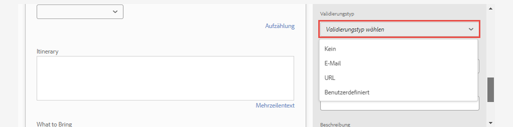

   Standardmäßige Formularvalidierungen sind für **E-Mail** und **URL** verfügbar. Es ist auch möglich, mithilfe eines regulären Ausdrucks eine **benutzerdefinierte** Validierung zu definieren.

1. Klicken Sie auf **Abbrechen** , um den Inhaltsfragmentmodell-Editor zu schließen.

## Erstellen eines Contributor-Modells

Erstellen Sie anschließend ein neues Modell für einen **Mitarbeiter**, das das Datenmodell für die Benutzer ist, die Zeitschriften- und Abenteuerinhalte als Teil der WKND-Marke erstellen.

1. Klicken Sie oben rechts auf **Erstellen** , um den Assistenten **Modell erstellen** aufzurufen.
1. Geben Sie für **Modelltitel** Folgendes ein: **Contributor** und klicken Sie auf **Erstellen**

   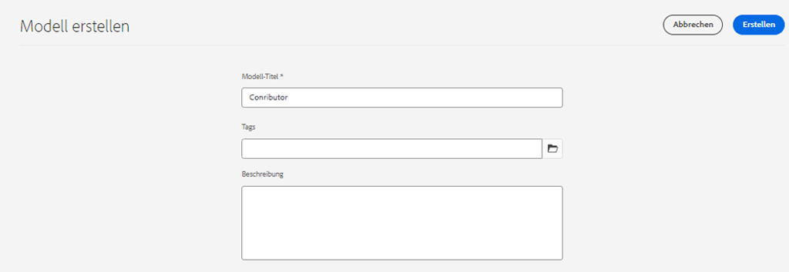

   Klicken Sie auf **Öffnen** , um das neu erstellte Modell zu öffnen.

1. Ziehen Sie ein Element **Einzelzeilentext** in den Hauptbereich. Geben Sie die folgenden Eigenschaften auf der Registerkarte **Eigenschaften** ein:

   * **Feldbezeichnung**:  **Vollständiger Name**
   * **Eigenschaftsname**: `fullName`
   * Überprüfen Sie **Erforderlich**

   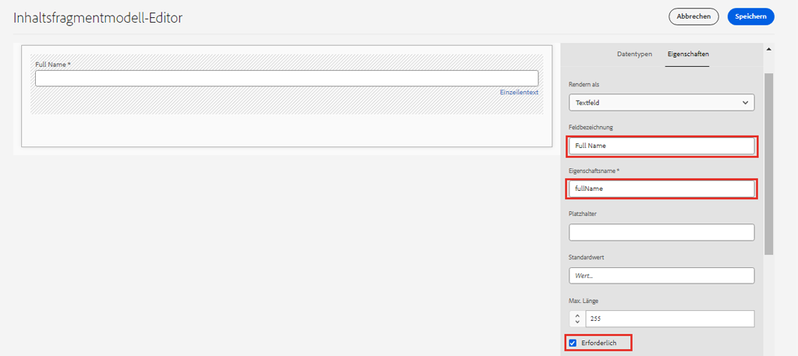

1. Klicken Sie auf die Registerkarte **Datentypen** und ziehen Sie ein Feld **Mehrzeiliger Text** unter das Feld **Vollständiger Name**. Geben Sie die folgenden Eigenschaften ein:

   * **Feldbezeichnung**:  **Biografie**
   * **Eigenschaftsname**: `biographyText`
   * **Standardtyp**:  **Rich-Text**

1. Klicken Sie auf die Registerkarte **Datentypen** und ziehen Sie ein Feld **Inhaltsreferenz** in den Arbeitsbereich. Geben Sie die folgenden Eigenschaften ein:

   * **Feldbezeichnung**:  **Picture Reference**
   * **Eigenschaftsname**: `pictureReference`
   * **Stammverzeichnis**: `/content/dam/wknd`

   Beim Konfigurieren von **Stammpfad** können Sie auf das Symbol **Ordner** klicken, um ein Modal zur Auswahl des Pfads aufzurufen. Dadurch wird eingeschränkt, welche Ordnerautoren den Pfad ausfüllen können.

   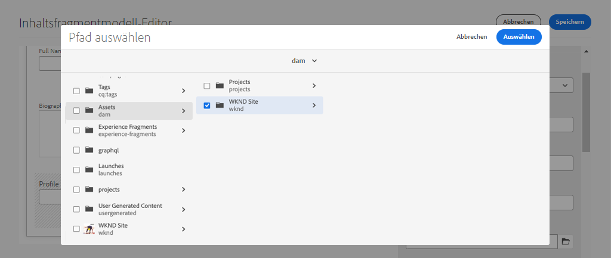

1. Fügen Sie dem **Bild-Verweis** eine Validierung hinzu, damit nur Inhaltstypen von **Bilder** zum Ausfüllen des Felds verwendet werden können.

   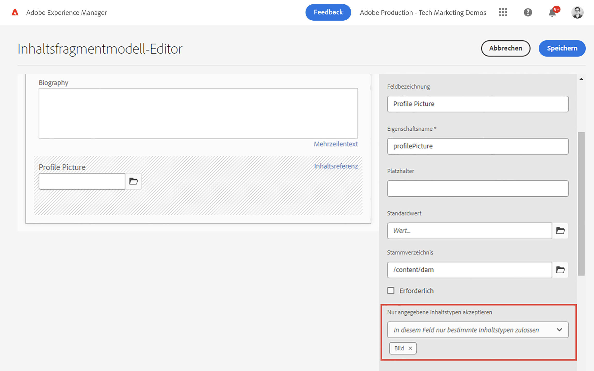

1. Klicken Sie auf die Registerkarte **Datentypen** und ziehen Sie einen **Auflistungstyp** unter das Feld **Bildverweis**. Geben Sie die folgenden Eigenschaften ein:

   * **Feldbezeichnung**:  **Beruf**
   * **Eigenschaftsname**: `occupation`

1. Fügen Sie mithilfe der Schaltfläche **Option** mehrere **Optionen** hinzu. Verwenden Sie denselben Wert für **Optionsbeschriftung** und **Optionswert**:

   **Künstler**,  **Einflussnehmer**,  **Fotograf**,  **Reisender**,  **Schriftsteller**,  **YouTuber**

   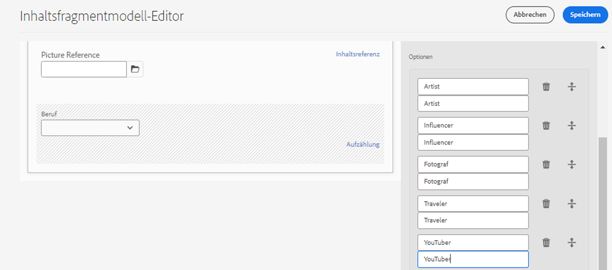

1. Das endgültige **Contributor**-Modell sollte wie folgt aussehen:

   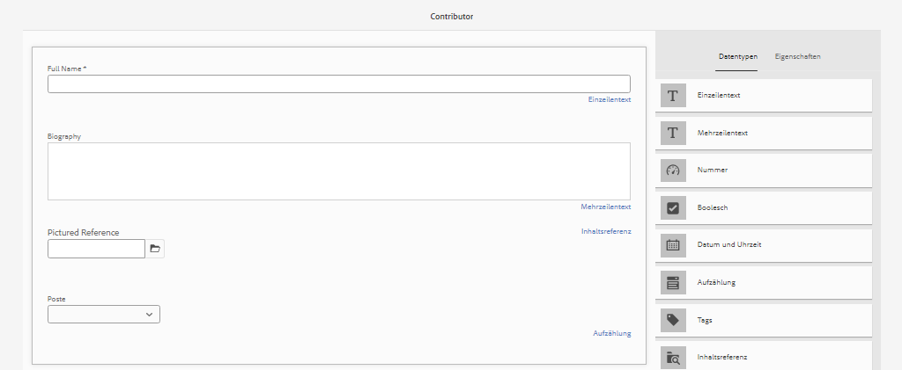

1. Klicken Sie auf **Speichern**, um die Änderungen zu speichern.

## Aktivieren des Contributor-Modells

Inhaltsfragmentmodelle müssen **Aktiviert** sein, bevor Inhaltsautoren sie verwenden können. Es ist möglich, ein Inhaltsfragmentmodell **zu deaktivieren** und so Autoren die Verwendung zu verbieten. Beachten Sie, dass sich durch die Änderung des **Eigenschaftsnamens** eines Felds im Modell das zugrunde liegende Datenschema ändert und erhebliche nachgelagerte Auswirkungen auf vorhandene Fragmente und externe Anwendungen haben können. Es wird empfohlen, die Benennungskonvention für die Felder **Eigenschaftsname** sorgfältig zu planen, bevor das Inhaltsfragmentmodell für Benutzer aktiviert wird.

1. Stellen Sie sicher, dass sich das Modell **Contributor** derzeit im Status **Aktiviert** befindet.

   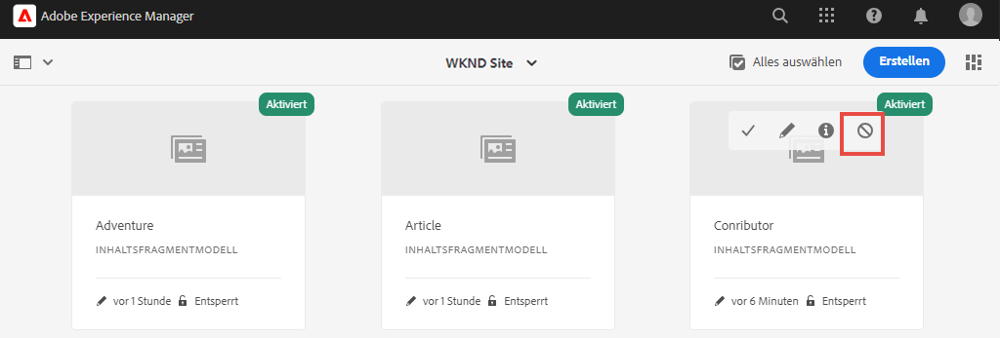

   Sie können den Status eines Inhaltsfragmentmodells umschalten, indem Sie den Mauszeiger über die Karte bewegen und auf das Symbol **Deaktivieren** / **Aktivieren** klicken.

## Herzlichen Glückwunsch! {#congratulations}

Herzlichen Glückwunsch! Sie haben gerade Ihr erstes Inhaltsfragmentmodell erstellt!

## Nächste Schritte {#next-steps}

Im nächsten Kapitel [Authoring von Inhaltsfragmentmodellen](author-content-fragments.md) erstellen und bearbeiten Sie ein neues Inhaltsfragment, das auf einem Inhaltsfragmentmodell basiert. Außerdem erfahren Sie, wie Sie Varianten von Inhaltsfragmenten erstellen.