# Erkunden der GraphQL-APIs {#explore-graphql-apis}

Die GraphQL-API von AEM bietet eine leistungsstarke Abfragesprache, mit der Daten von Inhaltsfragmenten für nachgelagerte Anwendungen bereitgestellt werden können. Inhaltsfragmentmodelle definieren das Datenschema, das von Inhaltsfragmenten verwendet wird. Jedes Mal, wenn ein Inhaltsfragmentmodell erstellt oder aktualisiert wird, wird das Schema übersetzt und dem „Graphen“ hinzugefügt, aus dem die GraphQL-API besteht.

In diesem Kapitel werden wir einige gängige GraphQL-Abfragen zum Sammeln von Inhalten mit einer IDE namens [GraphiQL](https://github.com/graphql/graphiql) untersuchen. Mit der GraphiQL-IDE können Sie die zurückgegebenen Abfragen und Daten schnell testen und verfeinern. GraphiQL bietet auch einen einfachen Zugang zur Dokumentation, sodass man leicht lernen und verstehen kann, welche Methoden verfügbar sind.

## Voraussetzungen {#prerequisites}

Dies ist ein mehrteiliges Tutorial, und es wird davon ausgegangen, dass die unter [Erstellen von Inhaltsfragmenten](./author-content-fragments.md) beschriebenen Schritte abgeschlossen sind.

## Ziele {#objectives}

* Erfahren Sie, wie Sie mit dem GraphiQL-Tool eine Abfrage mithilfe der GraphQL-Syntax erstellen können.
* Erfahren Sie, wie Sie eine Liste von Inhaltsfragmenten und ein einzelnes Inhaltsfragment abfragen.
* Erfahren Sie, wie Sie bestimmte Datenattribute filtern und anfordern.
* Erfahren Sie, wie Sie eine Abfrage mehrerer Inhaltsfragmentmodelle verbinden.
* Erfahren Sie, wie Sie GraphQL-Abfragen persistieren.

## Aktivieren eines GraphQL-Endpunkts {#enable-graphql-endpoint}

Es muss ein GraphQL-Endpunkt konfiguriert werden, um GraphQL-API-Abfragen für Inhaltsfragmente zu aktivieren.

1. Navigieren Sie im AEM-Startbildschirm zu **Tools** > **Allgemein** > **GraphQL**.

   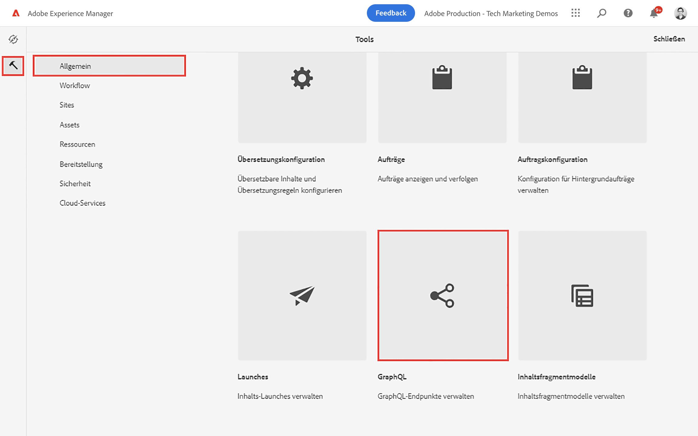

1. Tippen Sie auf **Erstellen** in der oberen rechten Ecke und geben Sie im daraufhin angezeigten Dialogfeld die folgenden Werte ein:

   * Name*: **Mein Projekt-Endpunkt**.
   * Verwenden Sie ein GraphQL-Schema, das von ... *: **Mein Projekt** bereitgestellt wird

   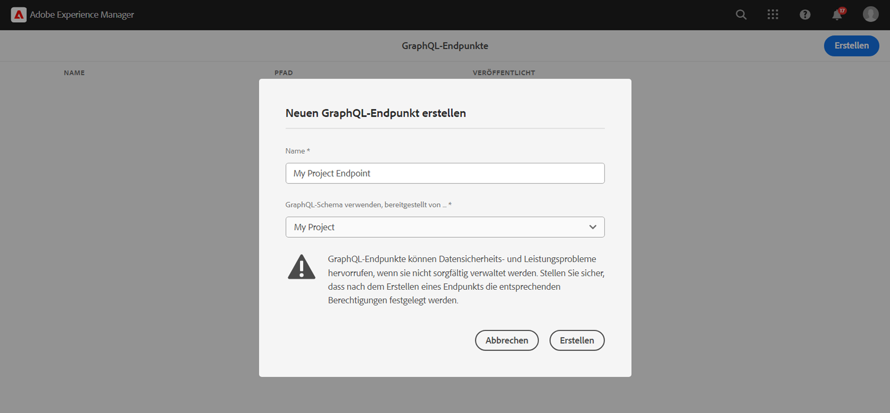

   Tippen Sie auf **Erstellen**, um den Endpunkt zu speichern.

   Die auf der Grundlage einer Projektkonfiguration erstellten GraphQL-Endpunkte ermöglichen nur Abfragen für Modelle, die zu diesem Projekt gehören. In diesem Fall können nur die Abfragen für die Modelle **Person** und **Team** verwendet werden.

   >[!NOTE]
   >
   > Es kann auch ein globaler Endpunkt erstellt werden, um Abfragen für Modelle über mehrere Konfigurationen hinweg zu aktivieren. Dies sollte mit Vorsicht verwendet werden, da es die Umgebung für zusätzliche Sicherheitslücken öffnen und die Verwaltung von AEM insgesamt komplexer machen kann.

1. Es sollte nun ein GraphQL-Endpunkt in Ihrer Umgebung aktiviert sein.

   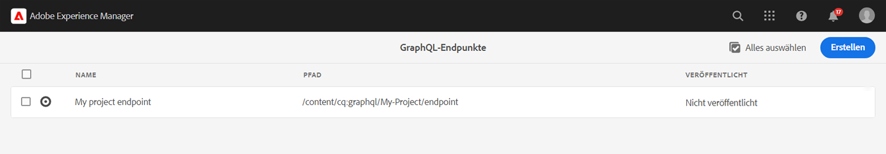

## Verwenden der GraphiQL-IDE

Das [GraphiQL](https://experienceleague.adobe.com/docs/experience-manager-cloud-service/content/headless/graphql-api/graphiql-ide.html?lang=de)-Tool ermöglicht es Entwicklerinnen und Entwicklern, Abfragen für Inhalte in der aktuellen AEM-Umgebung zu erstellen und zu testen. Das GraphiQL-Tool ermöglicht es den Benutzenden auch, **Abfragen zu persistieren oder zu speichern**, die von Client-Anwendungen in einer Produktionsumgebung verwendet werden können.

Als Nächstes erkunden Sie die Leistungsfähigkeit der GraphQL-API von AEM mithilfe der integrierten GraphiQL-IDE.

1. Navigieren Sie im AEM-Startbildschirm zu **Tools** > **Allgemein** > **GraphQL-Abfrage-Editor**.

   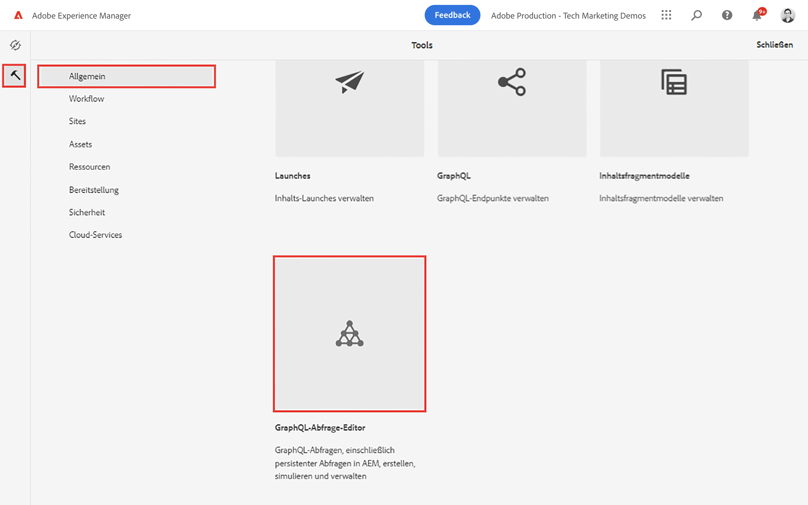

   >[!NOTE]
   >
   > In den älteren Versionen von AEM ist die GraphiQL-IDE möglicherweise nicht integriert. Sie kann manuell installiert werden, indem Sie den folgenden [Anweisungen](#install-graphiql) folgen.

1. Vergewissern Sie sich in der oberen rechten Ecke, dass der Endpunkt auf **Mein Projekt-Endpunkt** eingestellt ist.

   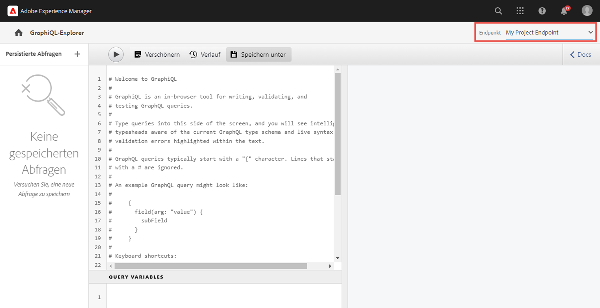

Dadurch werden alle Abfragen auf Modelle beschränkt, die im Projekt **Mein Projekt** erstellt wurden.

### Abfragen einer Liste von Inhaltsfragmenten {#query-list-cf}

Eine gängige Anforderung besteht darin, mehrere Inhaltsfragmente abzufragen.

1. Fügen Sie die folgende Abfrage in das Hauptbedienfeld ein (und ersetzen Sie damit die Liste der Kommentare):

   ```graphql
   query allTeams {
     teamList {
       items {
         _path
         title
       }
     }
   } 
   ```

1. Drücken Sie die **Wiedergabeschaltfläche** im oberen Menü, um die Abfrage auszuführen. Sie sollten die Ergebnisse der Inhaltsfragmente aus dem vorherigen Kapitel sehen:

   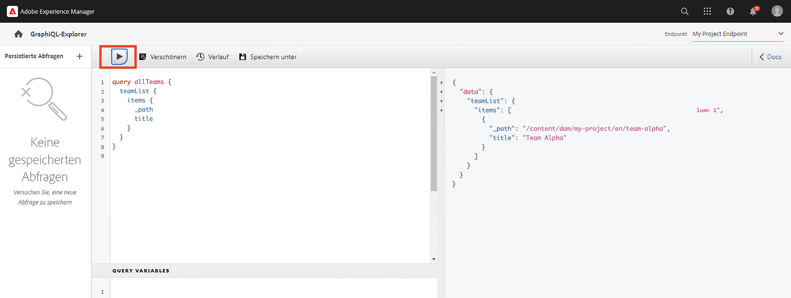

1. Positionieren Sie den Cursor unter dem Text `title` und drücken Sie **STRG+Leertaste**, um die Anzeige von Code-Hinweisen auszulösen. Fügen Sie `shortname` und `description` zur Abfrage hinzu.

   

1. Führen Sie die Abfrage erneut aus, indem Sie die **Wiedergabeschaltfläche** auswählen. Daraufhin sollte zu sehen sein, dass die Ergebnisse die zusätzlichen Eigenschaften von `shortname` und `description` umfassen.

   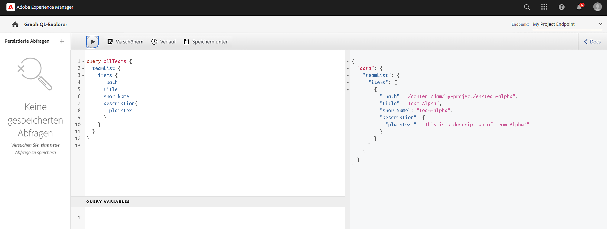

   Der `shortname` ist eine einfache Eigenschaft und `description` ein mehrzeiliges Textfeld. Über die GraphQL-API können verschiedene Formate für die Ergebnisse ausgewählt werden, z. B. `html`, `markdown`, `json` oder `plaintext`.

### Abfrage für verschachtelte Fragmente

Als Nächstes experimentieren Sie mit Abfragen, indem Sie verschachtelte Fragmente abrufen. Denken Sie daran, dass das **Team-Modell** auf das **Personenmodell** verweist.

1. Erweitern Sie die Abfrage um die Eigenschaft `teamMembers`. Denken Sie daran, dass es sich dabei um ein Feld mit einem **Fragmentverweis** für das Personenmodell handelt. Eigenschaften des Personenmodells können zurückgegeben werden:

   ```graphql
   query allTeams {
       teamList {
           items {
               _path
               title
               shortName
               description {
                   plaintext
               }
               teamMembers {
                   fullName
                   occupation
               }
           }
       }
   }
   ```

   JSON-Antwort:

   ```json
   {
       "data": {
           "teamList": {
           "items": [
               {
               "_path": "/content/dam/my-project/en/team-alpha",
               "title": "Team Alpha",
               "shortName": "team-alpha",
               "description": {
                   "plaintext": "This is a description of Team Alpha!"
               },
               "teamMembers": [
                   {
                   "fullName": "John Doe",
                   "occupation": [
                       "Artist",
                       "Influencer"
                   ]
                   },
                   {
                   "fullName": "Alison Smith",
                   "occupation": [
                       "Photographer"
                   ]
                   }
                 ]
           }
           ]
           }
       }
   }
   ```

   Die Möglichkeit, Abfragen für verschachtelte Fragmente durchzuführen, ist eine leistungsstarke Funktion der AEM GraphQL-API. In diesem einfachen Beispiel ist die Verschachtelung nur zwei Ebenen tief. Es ist jedoch möglich, Fragmente noch weiter zu verschachteln. Bei einem **Adressmodell**, das mit einem **Personenmodell** verknüpft ist, ist es beispielsweise möglich, Daten aus allen drei Modellen im Rahmen einer einzigen Abfrage zurückzugeben.

### Filtern einer Liste von Inhaltsfragmenten {#filter-list-cf}

Als Nächstes erfahren Sie, wie es möglich ist, Ergebnisse basierend auf einem Eigenschaftswert nach einer Teilmenge von Inhaltsfragmenten zu filtern.

1. Geben Sie die folgende Abfrage in die GraphiQL-Benutzeroberfläche ein:

   ```graphql
   query personByName($name:String!){
     personList(
       filter:{
         fullName:{
           _expressions:[{
             value:$name
             _operator:EQUALS
           }]
         }
       }
     ){
       items{
         _path
         fullName
         occupation
       }
     }
   }  
   ```

   Mit der obigen Abfrage wird eine Suche nach allen Personenfragmenten im System durchgeführt. Der am Anfang der Abfrage hinzugefügte Filter führt einen Vergleich des Felds `name` und der Variablenzeichenfolge `$name` durch.

1. Geben Sie im Bedienfeld **Abfragevariablen** Folgendes ein:

   ```json
   {"name": "John Doe"}
   ```

1. Führen Sie die Abfrage aus. Es sollte nur das Inhaltsfragment für **Personen** mit dem Wert `John Doe` zurückgegeben werden.

   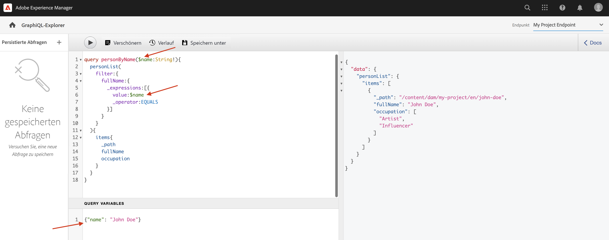

   Es gibt viele weitere Optionen zum Filtern und Erstellen komplexer Abfragen. Siehe [Verwenden von GraphQL mit AEM – Beispielinhalt und Beispielabfragen](https://experienceleague.adobe.com/docs/experience-manager-cloud-service/content/headless/graphql-api/sample-queries.html?lang=de).

1. Erweitern Sie die obige Abfrage zum Abrufen des Profilbilds.

   ```graphql
   query personByName($name:String!){
     personList(
       filter:{
         fullName:{
           _expressions:[{
             value:$name
             _operator:EQUALS
           }]
         }
       }
     ){
       items{  
         _path
         fullName
         occupation
         profilePicture{
           ... on ImageRef{
             _path
             _authorUrl
             _publishUrl
             height
             width
   
           }
         }
       }
     }
   } 
   ```

   `profilePicture` ist ein Inhaltsverweis, wofür ein Bild erwartet wird. Daher wird das integrierte Objekt `ImageRef` verwendet. Dadurch können zusätzliche Daten zum Bild angefordert werden, auf das verwiesen wird, z. B. `width` und `height`.

### Abfragen eines einzelnen Inhaltsfragments {#query-single-cf}

Es ist auch möglich, ein einzelnes Inhaltsfragment direkt abzufragen. Inhalte in AEM werden hierarchisch gespeichert, wobei die eindeutige Kennung für ein Fragment auf dem Pfad des Fragments basiert.

1. Geben Sie die folgende Abfrage im GraphiQL-Editor ein:

   ```graphql
   query personByPath($path: String!) {
       personByPath(_path: $path) {
           item {
           fullName
           occupation
           }
       }
   }
   ```

1. Geben Sie Folgendes für die **Abfragevariablen** ein:

   ```json
   {"path": "/content/dam/my-project/en/alison-smith"}
   ```

1. Führen Sie die Abfrage aus und beachten Sie, dass das einzelne Ergebnis zurückgegeben wird.

## Persistieren von Abfragen {#persist-queries}

Sobald Entwicklerinnen und Entwickler mit der Abfrage und den von der Abfrage zurückgegebenen Ergebnisdaten zufrieden sind, besteht der nächste Schritt darin, die Abfrage zu speichern oder in AEM als persistierte Abfrage beizubehalten. [Persistierte Abfragen](https://experienceleague.adobe.com/docs/experience-manager-cloud-service/content/headless/graphql-api/persisted-queries.html?lang=de) sind der bevorzugte Mechanismus zur Bereitstellung der GraphQL-API für Client-Anwendungen. Nachdem eine Abfrage persistent geworden ist, kann sie mithilfe einer GET-Anfrage angefordert und auf Dispatcher- und CDN-Ebenen zwischengespeichert werden. Persistierte Abfragen sind deutlich leistungsstärker. Zusätzlich zu den Leistungsvorteilen stellen persistierte Abfragen sicher, dass zusätzliche Daten nicht versehentlich Client-Anwendungen zur Verfügung gestellt werden. Weitere Informationen über persistierte Abfragen [finden Sie hier](https://experienceleague.adobe.com/docs/experience-manager-cloud-service/content/headless/graphql-api/persisted-queries.html?lang=de).

Als Nächstes legen Sie zwei einfache Abfragen als persistent fest, die im nächsten Kapitel verwendet werden.

1. Geben Sie die folgende Abfrage in die GraphiQL-IDE ein:

   ```graphql
   query allTeams {
       teamList {
           items {
               _path
               title
               shortName
               description {
                   plaintext
               }
               teamMembers {
                   fullName
                   occupation
               }
           }
       }
   }
   ```

   Überprüfen Sie, ob die Abfrage funktioniert.

1. Tippen Sie als Nächstes auf **Speichern unter** und geben Sie `all-teams` als **Abfragenamen** ein.

   Die Abfrage sollte in der linken Leiste unter **Persistierte Abfragen** angezeigt werden.

   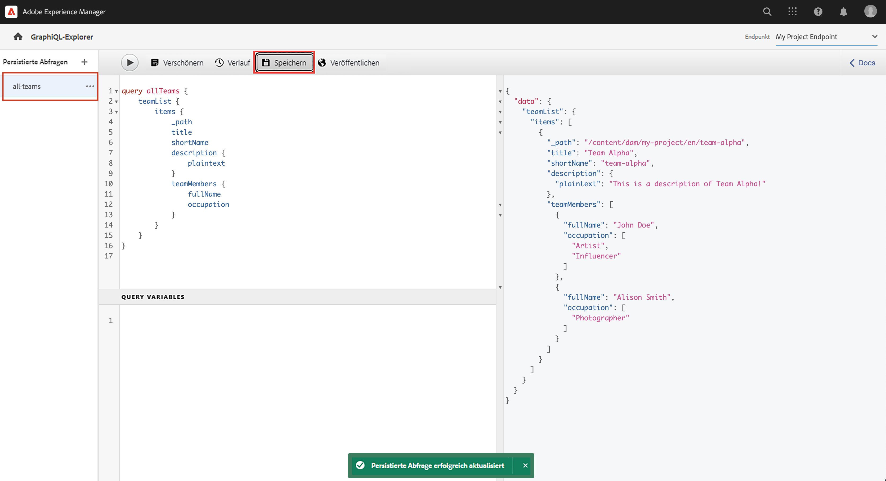
1. Tippen Sie als Nächstes auf die Auslassungspunkte **…** neben der persistenten Abfrage und dann auf **URL kopieren**, um den Pfad in die Zwischenablage zu kopieren.

   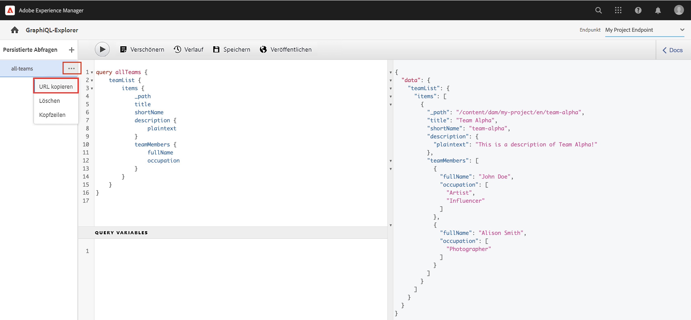

1. Öffnen Sie eine neue Registerkarte und fügen Sie den kopierten Pfad in Ihren Browser ein:

   ```plain
   https://$YOUR-AEMasCS-INSTANCEID$.adobeaemcloud.com/graphql/execute.json/my-project/all-teams
   ```

   Es sollte ähnlich wie der obige Pfad aussehen. Sie sollten sehen, dass die JSON-Ergebnisse der Abfrage zurückgegeben wurden.

   Aufschlüsseln der oben genannten URL:

   | Name | Beschreibung |
   | ---------|---------- |
   | `/graphql/execute.json` | Persistenter Abfrageendpunkt |
   | `/my-project` | Projektkonfiguration für `/conf/my-project` |
   | `/all-teams` | Name der persistierten Abfrage |

1. Kehren Sie zur GraphiQL-IDE zurück und benutzen Sie die Plustaste **+**, um die NEUE Abfrage beizubehalten

   ```graphql
   query personByName($name: String!) {
     personList(
       filter: {
         fullName:{
           _expressions: [{
             value: $name
             _operator:EQUALS
           }]
         }
       }){
       items {
         _path
         fullName
         occupation
         biographyText {
           json
         }
         profilePicture {
           ... on ImageRef {
             _path
             _authorUrl
             _publishUrl
             width
             height
           }
         }
       }
     }
   }
   ```

1. Speichern Sie die Abfrage als `person-by-name`.
1. Es sollten zwei persistierte Abfragen gespeichert worden sein:

   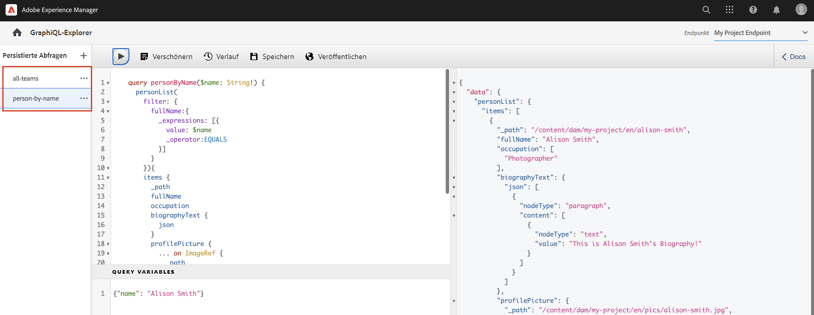


## Veröffentlichen von GraphQL-Endpunkt und persistierten Abfragen

Nach Überprüfung und Verifizierung veröffentlichen Sie `GraphQL Endpoint` und `Persisted Queries`

1. Navigieren Sie im AEM-Startbildschirm zu **Tools** > **Allgemein** > **GraphQL**.

1. Tippen Sie auf das Kontrollkästchen neben **Mein Projekt-Endpunkt** und dann auf **Veröffentlichen**

   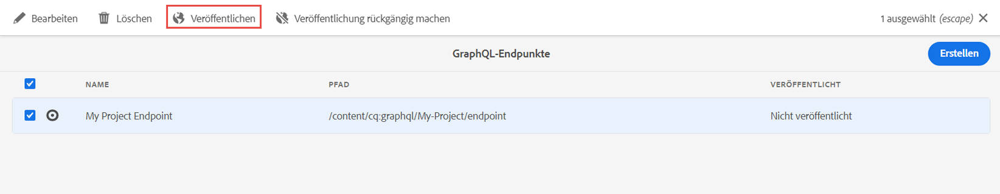

1. Navigieren Sie im AEM-Startbildschirm zu **Tools** > **Allgemein** > **GraphQL-Abfrage-Editor**

1. Tippen Sie auf die Abfrage **Alle Teams** im Bedienfeld „Persistierte Abfragen“ und dann auf **Veröffentlichen**

   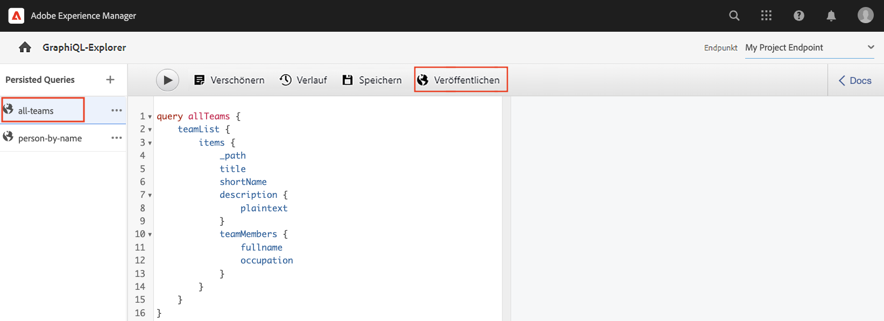

1. Wiederholen Sie den obigen Schritt für die Abfrage `person-by-name`

## Lösungsdateien {#solution-files}

Laden Sie den Inhalt, die Modelle und die persistierten Abfragen herunter, die in den letzten drei Kapiteln erstellt wurden: [basic-tutorial-solution.content.zip](assets/explore-graphql-api/basic-tutorial-solution.content.zip)

## Zusätzliche Ressourcen

Weitere Informationen zu GraphQL-Abfragen finden Sie unter [Verwendung von GraphQL mit AEM – Beispielinhalt und Beispielabfragen](https://experienceleague.adobe.com/docs/experience-manager-cloud-service/content/headless/graphql-api/sample-queries.html?lang=de).

## Herzlichen Glückwunsch! {#congratulations}

Herzlichen Glückwunsch! Sie haben mehrere GraphQL-Abfragen erstellt und ausgeführt!

## Nächste Schritte {#next-steps}

Im nächsten Kapitel [Erstellen einer React-App](./graphql-and-react-app.md) erfahren Sie, wie eine externe Anwendung die GraphQL-Endpunkte von AEM abfragen und diese beiden persistierten Abfragen verwenden kann. Außerdem werden Sie mit der grundlegenden Fehlerbehandlung während der Ausführung von GraphQL-Abfragen vertraut gemacht.

## Installieren des GraphiQL-Tools (optional) {#install-graphiql}

In einigen Versionen von AEM (6.x.x) muss das GraphiQL IDE-Tool manuell installiert werden. Verwenden Sie hierzu [diese Anweisungen](../how-to/install-graphiql-aem-6-5.md).

