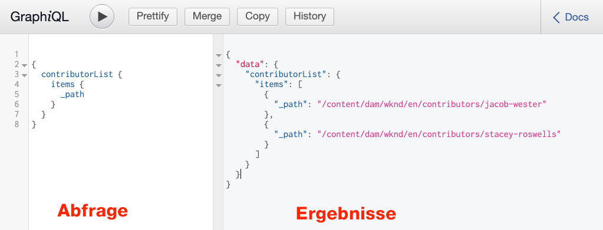
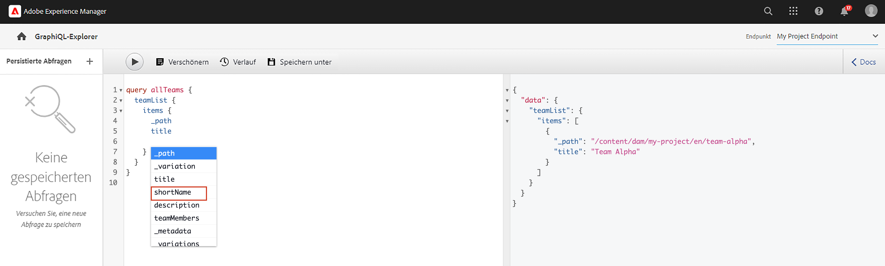

# GraphQL-APIs {#explore-graphql-apis}

Die GraphQL-API von AEM bietet eine leistungsstarke Abfragesprache, um Daten von Inhaltsfragmenten für nachgelagerte Anwendungen verfügbar zu machen. Inhaltsfragmentmodelle definieren das Datenschema, das von Inhaltsfragmenten verwendet wird. Jedes Mal, wenn ein Inhaltsfragmentmodell erstellt oder aktualisiert wird, wird das Schema übersetzt und zum &quot;Diagramm&quot;hinzugefügt, aus dem die GraphQL-API besteht.

In diesem Kapitel werden wir einige gängige GraphQL-Abfragen untersuchen, um Inhalte mithilfe einer IDE namens [GraphiQL](https://github.com/graphql/graphiql) zu erfassen. Mit der GraphiQL IDE können Sie die zurückgegebenen Abfragen und Daten schnell testen und verfeinern. GraphiQL bietet außerdem einfachen Zugriff auf die Dokumentation, sodass Sie leicht wissen können, welche Methoden verfügbar sind.

## Voraussetzungen {#prerequisites}

Dies ist ein mehrteiliges Tutorial, und es wird davon ausgegangen, dass die in [Authoring von Inhaltsfragmenten](./author-content-fragments.md) beschriebenen Schritte abgeschlossen sind.

## Ziele {#objectives}

* Erfahren Sie, wie Sie mit dem GraphQL-Tool eine Abfrage mithilfe der GraphQL-Syntax erstellen können.
* Erfahren Sie, wie Sie eine Liste von Inhaltsfragmenten und ein einzelnes Inhaltsfragment abfragen.
* Erfahren Sie, wie Sie bestimmte Datenattribute filtern und anfordern.
* Erfahren Sie, wie Sie eine Variante eines Inhaltsfragments abfragen.
* Erfahren Sie, wie Sie eine Abfrage mehrerer Inhaltsfragmentmodelle verbinden.

## Installieren des GraphiQL-Tools {#install-graphiql}

Die GraphiQL-IDE ist ein Entwicklungstool und wird nur in Umgebungen auf niedrigerer Ebene wie einer Entwicklungs- oder lokalen Instanz benötigt. Daher ist es nicht im AEM Projekt enthalten, sondern wird als separates Paket bereitgestellt, das auf Ad-hoc-Basis installiert werden kann.

1. Navigieren Sie zum **[Software Distribution-Portal](https://experience.adobe.com/#/downloads/content/software-distribution/en/aemcloud.html)** > **AEM als Cloud Service**.
1. Suchen Sie nach &quot;GraphiQL&quot;(schließen Sie **i** in **GraphiQL** ein.
1. Laden Sie das neueste **GraphiQL Content Package v.x.x.x** herunter.

   

   Die ZIP-Datei ist ein AEM Paket, das direkt installiert werden kann.

1. Navigieren Sie im Menü **AEM Start** zu **Tools** > **Bereitstellung** > **Pakete**.
1. Klicken Sie auf **Paket hochladen** und wählen Sie das im vorherigen Schritt heruntergeladene Paket aus. Klicken Sie auf **Installieren** , um das Paket zu installieren.

   

## Abfragen einer Liste von Inhaltsfragmenten {#query-list-cf}

Eine gängige Anforderung besteht darin, mehrere Inhaltsfragmente abzufragen.

1. Navigieren Sie zur GraphiQL IDE unter [http://localhost:4502/content/graphiql.html](http://localhost:4502/content/graphiql.html).
1. Fügen Sie die folgende Abfrage in den linken Bereich ein (unter der Liste der Kommentare):

   ```graphql
   {
     contributorList {
       items {
           _path
         }
     }
   }
   ```

1. Drücken Sie die Schaltfläche **Play** im oberen Menü, um die Abfrage auszuführen. Sie sollten die Ergebnisse der Inhaltsfragmente der Mitwirkenden aus dem vorherigen Kapitel sehen:

   

1. Positionieren Sie den Cursor unter dem Text `_path` und geben Sie **Strg+Leertaste** ein, um Trigger-Code-Hinweise anzuzeigen. Fügen Sie der Abfrage `fullName` und `occupation` hinzu.

   

1. Führen Sie die Abfrage erneut aus, indem Sie auf die Schaltfläche **Abspielen** klicken. Die Ergebnisse sollten die zusätzlichen Eigenschaften von `fullName` und `occupation` enthalten.

   

   `fullName` und  `occupation` sind einfache Eigenschaften. Erinnern Sie sich an das Kapitel [Definieren von Inhaltsfragmentmodellen](./content-fragment-models.md) , dass `fullName` und `occupation` die Werte sind, die beim Definieren der **Eigenschaftsname** der entsprechenden Felder verwendet werden.

1. `pictureReference` und komplexere Felder  `biographyText` darstellen. Aktualisieren Sie die Abfrage mit folgendem Code, um Daten zu den Feldern `pictureReference` und `biographyText` zurückzugeben.

   ```graphql
   {
   contributorList {
       items {
         _path
         fullName
         occupation
         biographyText {
           html
         }
         pictureReference {
           ... on ImageRef {
               _path
               width
               height
               }
           }
       }
     }
   }
   ```

   `biographyText` ist ein mehrzeiliges Textfeld und die GraphQL-API ermöglicht es uns, eine Vielzahl von Formaten für die Ergebnisse wie  `html`,  `markdown`  `json` oder  `plaintext`auszuwählen.

   `pictureReference` ist eine Inhaltsreferenz und es wird erwartet, dass es ein Bild ist. Daher wird ein integriertes  `ImageRef` Objekt verwendet. Auf diese Weise können wir zusätzliche Daten zum Bild anfordern, auf das verwiesen wird, z. B. `width` und `height`.

1. Als Nächstes experimentieren Sie mit der Abfrage nach einer Liste von **Adventures**. Führen Sie die folgende Abfrage aus:

   ```graphql
   {
     adventureList {
       items {
         adventureTitle
         adventureType
         adventurePrimaryImage {
           ...on ImageRef {
             _path
             mimeType
           }
         }
       }
     }
   }
   ```

   Es sollte eine Liste von **Abenteuer** angezeigt werden. Experimentieren Sie einfach, indem Sie der Abfrage zusätzliche Felder hinzufügen.

## Filtern einer Liste von Inhaltsfragmenten {#filter-list-cf}

Als Nächstes sehen wir uns an, wie es möglich ist, die Ergebnisse basierend auf einem Eigenschaftswert nach einer Untergruppe von Inhaltsfragmenten zu filtern.

1. Geben Sie die folgende Abfrage in die GraphiQL-Benutzeroberfläche ein:

   ```graphql
   {
   contributorList(filter: {
     occupation: {
       _expressions: {
         value: "Photographer"
         }
       }
     }) {
       items {
         _path
         fullName
         occupation
       }
     }
   }
   ```

   Die obige Abfrage führt eine Suche für alle Mitwirkenden im System durch. Der am Anfang der Abfrage hinzugefügte Filter führt einen Vergleich für das Feld `occupation` und die Zeichenfolge &quot;**Fotograf**&quot;durch.

1. Führen Sie die Abfrage aus. Es wird erwartet, dass nur ein einzelner **Mitarbeiter** zurückgegeben wird.
1. Geben Sie die folgende Abfrage ein, um eine Liste von **Adventures** abzufragen, wobei `adventureActivity` **not** gleich **&quot;Surfen&quot;** ist:

   ```graphql
   {
     adventureList(filter: {
       adventureActivity: {
           _expressions: {
               _operator: EQUALS_NOT
               value: "Surfing"
           }
       }
   }) {
       items {
       _path
       adventureTitle
       adventureActivity
       }
     }
   }
   ```

1. Führen Sie die Abfrage aus und überprüfen Sie die Ergebnisse. Beachten Sie, dass keines der Ergebnisse ein `adventureType` gleich **&quot;Surfen&quot;** enthält.

Es gibt viele weitere Optionen zum Filtern und Erstellen komplexer Abfragen. Die obigen Beispiele sind nur einige Beispiele.

## Einzelnes Inhaltsfragment abfragen {#query-single-cf}

Es ist auch möglich, ein einzelnes Inhaltsfragment direkt abzufragen. Der Inhalt in AEM wird hierarchisch gespeichert und die eindeutige Kennung für ein Fragment basiert auf dem Pfad des Fragments. Wenn das Ziel darin besteht, Daten über ein einzelnes Fragment zurückzugeben, wird empfohlen, den Pfad zu verwenden und das Modell direkt abzufragen. Die Verwendung dieser Syntax bedeutet, dass die Abfragekomplexität sehr gering ist und zu einem schnelleren Ergebnis führt.

1. Geben Sie die folgende Abfrage im Editor &quot;GraphiQL&quot;ein:

   ```graphql
   {
    contributorByPath(_path: "/content/dam/wknd/en/contributors/stacey-roswells") {
       item {
         _path
         fullName
         biographyText {
           html
         }
       }
     }
   }
   ```

1. Führen Sie die Abfrage aus und beobachten Sie, dass das einzelne Ergebnis für das Fragment **Stacey Roswells** zurückgegeben wird.

   In der vorherigen Übung haben Sie einen Filter verwendet, um eine Liste von Ergebnissen einzugrenzen. Sie können eine ähnliche Syntax verwenden, um nach Pfad zu filtern. Die obige Syntax wird jedoch aus Leistungsgründen bevorzugt.

1. Erinnern Sie sich im Kapitel [Inhaltsfragmente erstellen](./author-content-fragments.md) daran, dass eine **Zusammenfassung**-Variante für **Stacey Roswells** erstellt wurde. Aktualisieren Sie die Abfrage, um die **Summary**-Variante zurückzugeben:

   ```graphql
   {
   contributorByPath
   (
       _path: "/content/dam/wknd/en/contributors/stacey-roswells"
       variation: "summary"
   ) {
       item {
         _path
         fullName
         biographyText {
           html
         }
       }
     }
   }
   ```

   Obwohl die Variante **Zusammenfassung** hieß, werden Varianten in Kleinbuchstaben beibehalten und `summary` wird verwendet.

1. Führen Sie die Abfrage aus und beachten Sie, dass das `biography` -Feld ein wesentlich kürzeres `html` -Ergebnis enthält.

## Abfrage nach mehreren Inhaltsfragmentmodellen {#query-multiple-models}

Es ist auch möglich, separate Abfragen in einer einzigen Abfrage zu kombinieren. Dies ist nützlich, um die Anzahl der HTTP-Anfragen zu minimieren, die zum Hochladen der Anwendung erforderlich sind. Beispielsweise kann die Ansicht *Home* einer Anwendung Inhalte basierend auf **zwei** verschiedenen Inhaltsfragmentmodellen anzeigen. Anstatt **zwei** separate Abfragen auszuführen, können wir die Abfragen zu einer einzigen Anfrage zusammenfassen.

1. Geben Sie die folgende Abfrage im Editor &quot;GraphiQL&quot;ein:

   ```graphql
   {
     adventureList {
       items {
         _path
         adventureTitle
       }
     }
     contributorList {
       items {
         _path
         fullName
       }
     }
   }
   ```

1. Führen Sie die Abfrage aus und stellen Sie sicher, dass die Ergebnismenge Daten von **Adventures** und **Contributors** enthält:

```json
{
  "data": {
    "adventureList": {
      "items": [
        {
          "_path": "/content/dam/wknd/en/adventures/bali-surf-camp/bali-surf-camp",
          "adventureTitle": "Bali Surf Camp"
        },
        {
          "_path": "/content/dam/wknd/en/adventures/beervana-portland/beervana-in-portland",
          "adventureTitle": "Beervana in Portland"
        },
        ...
      ]
    },
    "contributorList": {
      "items": [
        {
          "_path": "/content/dam/wknd/en/contributors/jacob-wester",
          "fullName": "Jacob Wester"
        },
        {
          "_path": "/content/dam/wknd/en/contributors/stacey-roswells",
          "fullName": "Stacey Roswells"
        }
      ]
    }
  }
}
```

## Zusätzliche Ressourcen

Weitere Beispiele für GraphQL-Abfragen finden Sie unter: [Erlernen der Verwendung von GraphQL mit AEM - Beispielinhalt und Abfragen](https://experienceleague.adobe.com/docs/experience-manager-cloud-service/assets/admin/content-fragments-graphql-samples.html?lang=de).

## Herzlichen Glückwunsch! {#congratulations}

Herzlichen Glückwunsch! Sie haben gerade mehrere GraphQL-Abfragen erstellt und ausgeführt!

## Nächste Schritte {#next-steps}

Im nächsten Kapitel [Abfragende AEM von einer React-App](./graphql-and-external-app.md) erfahren Sie, wie eine externe Anwendung GraphQL-Endpunkte AEM. Die externe App, die die WKND GraphQL React-Beispielanwendung ändert, um Filterungs-GraphQL-Abfragen hinzuzufügen, sodass der Anwender der App Abenteuer nach Aktivität filtern kann. Außerdem werden Sie mit der grundlegenden Fehlerbehandlung vertraut gemacht.
