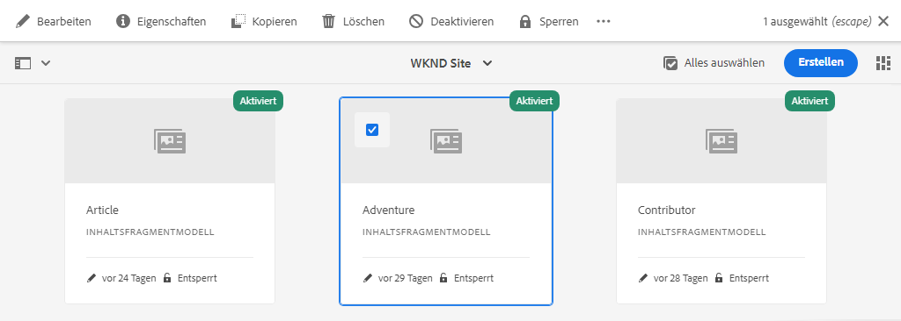
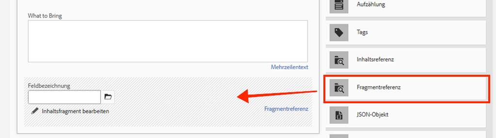
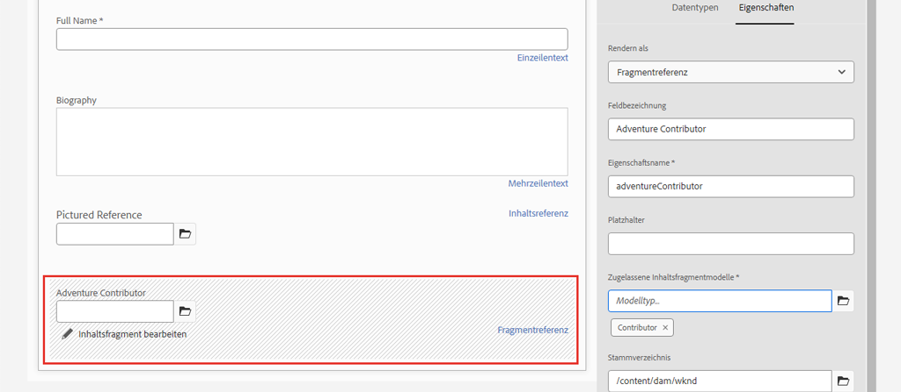
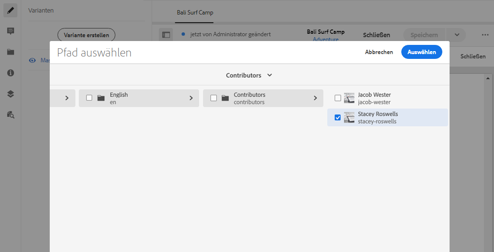
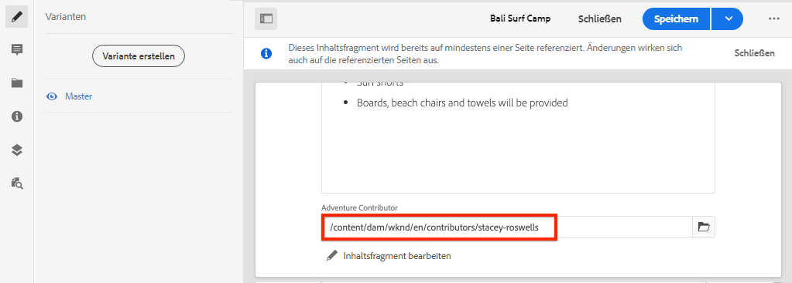

# Erweiterte Datenmodellierung mit Fragmentverweisen

Es ist möglich, ein Inhaltsfragment aus einem anderen Inhaltsfragment zu referenzieren. Dadurch kann ein Benutzer komplexe Datenmodelle mit Beziehungen zwischen Fragmenten erstellen.

In diesem Kapitel aktualisieren Sie das Abenteuer-Modell, um mithilfe der **Fragmentverweis** -Feld. Außerdem erfahren Sie, wie Sie eine GraphQL-Abfrage ändern, um Felder aus einem referenzierten Modell einzuschließen.

## Voraussetzungen

Dies ist ein mehrteiliges Tutorial, und es wird davon ausgegangen, dass die in den vorherigen Teilen beschriebenen Schritte abgeschlossen wurden.

## Ziele

In diesem Kapitel lernen wir Folgendes:

* Aktualisieren eines Inhaltsfragmentmodells zur Verwendung des Fragmentverweisfelds
* Erstellen einer GraphQL-Abfrage, die Felder aus einem referenzierten Modell zurückgibt

## Fragmentverweis hinzufügen {#add-fragment-reference}

Aktualisieren Sie das Adventure Content Fragment-Modell, um eine Referenz zum Contributor-Modell hinzuzufügen.

1. Öffnen Sie einen neuen Browser und navigieren Sie zu AEM.
1. Aus dem **AEM Start** Menünavigation zu **Instrumente** > **Assets** > **Inhaltsfragmentmodelle** > **WKND-Site**.
1. Öffnen Sie die **Abenteuer** Inhaltsfragmentmodell

   

1. under **Datentypen**, ziehen Sie eine **Fragmentverweis** in den Hauptbereich.

   

1. Aktualisieren Sie die **Eigenschaften** für dieses Feld mit folgenden Eigenschaften:

   * Rendern als - `fragmentreference`
   * Feldbezeichnung - **Adventure Contributor**
   * Eigenschaftsname - `adventureContributor`
   * Modelltyp - Wählen Sie die **Mitarbeiter** model
   * Stammverzeichnis - `/content/dam/wknd`

   

   Der Eigenschaftsname `adventureContributor` kann jetzt verwendet werden, um auf ein Contributor Content Fragment zu verweisen.

1. Speichern Sie die Änderungen am Modell.

## Zuweisen eines Beitragenden zu einem Abenteuer

Nachdem das Abenteuer-Inhaltsfragmentmodell aktualisiert wurde, können wir ein vorhandenes Fragment bearbeiten und auf einen Mitwirkenden verweisen. Beachten Sie, dass Sie das Inhaltsfragmentmodell bearbeiten *betrifft* alle vorhandenen Inhaltsfragmente, die daraus erstellt wurden.

1. Navigieren Sie zu **Assets** > **Dateien** > **WKND-Site** > **englisch** > **Abenteuer** > **[Bali Surf Camp](http://localhost:4502/assets.html/content/dam/wknd/en/adventures/bali-surf-camp)**.

   

1. Klicken Sie in die **Bali Surf Camp** Inhaltsfragment , um den Inhaltsfragment-Editor zu öffnen.
1. Aktualisieren Sie die **Adventure Contributor** und wählen Sie einen Mitarbeiter aus, indem Sie auf das Ordnersymbol klicken.

   

   *Pfad zu einem Beitragsfragment auswählen*

   

   Beachten Sie, dass nur Fragmente mit dem **Mitarbeiter** -Modell ausgewählt werden können.

1. Speichern Sie die Änderungen am Fragment.

1. Wiederholen Sie die obigen Schritte, um Abenteuern wie [Yosemite Backpacken](http://localhost:4502/editor.html/content/dam/wknd/en/adventures/yosemite-backpacking/yosemite-backpacking) und [Colorado Rock Climbing](http://localhost:4502/editor.html/content/dam/wknd/en/adventures/colorado-rock-climbing/colorado-rock-climbing)

## Abfragen von verschachtelten Inhaltsfragmenten mit GraphiQL

Führen Sie anschließend eine Abfrage für ein Abenteuer durch und fügen Sie verschachtelte Eigenschaften des referenzierten Contributor-Modells hinzu. Wir werden das GraphiQL-Tool verwenden, um die Syntax der Abfrage schnell zu überprüfen.

1. Navigieren Sie in AEM zum GraphiQL-Tool: [http://localhost:4502/content/graphiql.html](http://localhost:4502/content/graphiql.html)

1. Geben Sie die folgende Abfrage ein:

   ```graphql
   {
     adventureByPath(_path:"/content/dam/wknd/en/adventures/bali-surf-camp/bali-surf-camp") {
        item {
          _path
          adventureTitle
          adventureContributor {
            fullName
            occupation
            pictureReference {
           ...on ImageRef {
             _path
           }
         }
       }
     }
    }
   }
   ```

   Die obige Abfrage bezieht sich auf einen einzelnen Abenteuer-Pfad. Die `adventureContributor` -Eigenschaft verweist auf das Contributor-Modell und wir können dann Eigenschaften vom verschachtelten Inhaltsfragment anfordern.

1. Führen Sie die Abfrage aus und Sie sollten ein Ergebnis wie das folgende erhalten:

   ```json
   {
     "data": {
       "adventureByPath": {
           "item": {
               "_path": "/content/dam/wknd/en/adventures/bali-surf-camp/bali-surf-camp",
               "adventureTitle": "Bali Surf Camp",
               "adventureContributor": {
                   "fullName": "Stacey Roswells",
                   "occupation": "Photographer",
                   "pictureReference": {
                       "_path": "/content/dam/wknd/en/contributors/stacey-roswells.jpg"
                   }
               }
           }
        }
     }
   }
   ```

1. Experimentieren mit anderen Abfragen wie `adventureList` und fügen Sie Eigenschaften für das referenzierte Inhaltsfragment unter hinzu `adventureContributor`.

## Aktualisieren der React-App zur Anzeige von Contributor-Inhalten

Aktualisieren Sie anschließend die von der React-Anwendung verwendeten Abfragen, um den neuen Mitarbeiter aufzunehmen und Informationen über den Beitragenden im Rahmen der Detailansicht des Abenteuer anzuzeigen.

1. Öffnen Sie die WKND GraphQL React-App in Ihrer IDE.

1. Öffnen Sie die Datei `src/components/AdventureDetail.js`.

   

1. Funktion suchen `adventureDetailQuery(_path)`. Die `adventureDetailQuery(..)` -Funktion umbricht einfach eine GraphQL-Filterabfrage, die AEM verwendet `<modelName>ByPath` -Syntax, um ein einzelnes Inhaltsfragment abzufragen, das durch seinen JCR-Pfad identifiziert wird.

1. Aktualisieren Sie die Abfrage, um Informationen zum referenzierten Mitarbeiter hinzuzufügen:

   ```javascript
   function adventureDetailQuery(_path) {
       return `{
           adventureByPath (_path: "${_path}") {
           item {
               _path
               adventureTitle
               adventureActivity
               adventureType
               adventurePrice
               adventureTripLength
               adventureGroupSize
               adventureDifficulty
               adventurePrice
               adventurePrimaryImage {
                   ... on ImageRef {
                   _path
                   mimeType
                   width
                   height
                   }
               }
               adventureDescription {
                   html
               }
               adventureItinerary {
                   html
               }
               adventureContributor {
                   fullName
                   occupation
                   pictureReference {
                       ...on ImageRef {
                           _path
                       }
                   }
               }
             }
          }
        }
       `;
   }
   ```

   Mit dieser Aktualisierung erhalten Sie zusätzliche Eigenschaften zu `adventureContributor`, `fullName`, `occupation`und `pictureReference` wird in die Abfrage aufgenommen.

1. Inspect `Contributor` Komponente eingebettet in `AdventureDetail.js` Datei unter `function Contributor(...)`. Diese Komponente rendert den Namen, den Beruf und das Bild des Mitwirkenden, falls die Eigenschaften vorhanden sind.

   Die `Contributor` -Komponente wird im Abschnitt `AdventureDetail(...)` `return` -Methode:

   ```javascript
   function AdventureDetail(props) {
       ...
       return (
           ...
            <h2>Itinerary</h2>
           <hr />
           <div className="adventure-detail-itinerary"
                dangerouslySetInnerHTML={{__html: adventureData.adventureItinerary.html}}></div>
           {/* Contributor component is instaniated and 
               is passed the adventureContributor object from the GraphQL Query results */}
           <Contributer {...adventureData.adventureContributor} />
           ...
       )
   }
   ```

1. Speichern Sie die Änderungen in der Datei.
1. Starten Sie die React-App, falls noch nicht ausgeführt:

   ```shell
   $ cd aem-guides-wknd-graphql/react-app
   $ npm start
   ```

1. Navigieren Sie zu [http://localhost:3000](http://localhost:3000/) und klicken Sie auf ein Abenteuer, das über einen referenzierten Mitarbeiter verfügt. Sie sollten nun die Mitarbeiter-Informationen sehen, die unten unter der **Route**:

   

## Herzlichen Glückwunsch!{#congratulations}

Herzlichen Glückwunsch! Sie haben ein vorhandenes Inhaltsfragmentmodell aktualisiert, um auf ein verschachteltes Inhaltsfragment zu verweisen, indem Sie die **Fragmentverweis** -Feld. Außerdem haben Sie erfahren, wie Sie eine GraphQL-Abfrage ändern, um Felder aus einem referenzierten Modell einzuschließen.

## Nächste Schritte {#next-steps}

Im nächsten Kapitel [Produktionsbereitstellung mithilfe einer AEM-Veröffentlichungsumgebung](./production-deployment.md), erfahren Sie mehr über die Autoren- und Veröffentlichungsdienste von AEM und das empfohlene Bereitstellungsmuster für Headless-Anwendungen. Sie aktualisieren eine vorhandene Anwendung, um Umgebungsvariablen zu verwenden, um einen GraphQL-Endpunkt basierend auf der Zielumgebung dynamisch zu ändern. Außerdem erfahren Sie, wie Sie AEM für Cross-Origin Resource Sharing (CORS) ordnungsgemäß konfigurieren.
