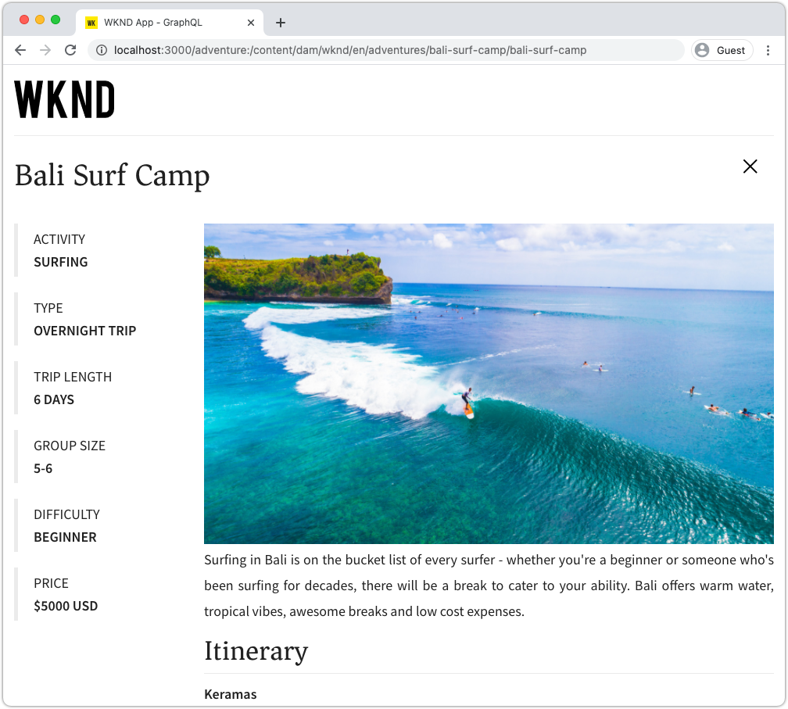

# Abfragen AEM GraphQL aus einer externen App

In diesem Kapitel wird untersucht, wie AEM GraphQL-APIs verwendet werden können, um das Erlebnis in einer externen Anwendung zu fördern.

In diesem Tutorial wird eine einfache React-App verwendet, um Abenteuerinhalte abzufragen und anzuzeigen, die von AEM GraphQL-APIs bereitgestellt werden. Die Verwendung von React ist größtenteils unwichtig, und die verbrauchende externe Anwendung könnte in jedem Rahmen für jede Plattform geschrieben werden.

## Voraussetzungen

Dies ist ein mehrteiliges Tutorial, und es wird davon ausgegangen, dass die in den vorherigen Teilen beschriebenen Schritte abgeschlossen wurden.

_IDE-Screenshots in diesem Kapitel stammen aus  [Visual Studio Code](https://code.visualstudio.com/)_

Installieren Sie optional eine Browsererweiterung wie [GraphQL Network Inspector](https://chrome.google.com/webstore/detail/graphql-network-inspector/ndlbedplllcgconngcnfmkadhokfaaln), um weitere Details zu einer GraphQL-Abfrage anzeigen zu können.

## Ziele

In diesem Kapitel lernen wir Folgendes:

* Starten und Verstehen der Funktionalität der React-Beispielanwendung
* Erfahren Sie, wie Aufrufe von der externen App an AEM GraphQL-Endpunkte gesendet werden.
* Definieren einer GraphQL-Abfrage zum Filtern einer Liste von Abenteuerinhaltsfragmenten nach Aktivität
* Aktualisieren Sie die React-App, um Steuerelemente zum Filtern über GraphQL bereitzustellen, die Liste der Abenteuer nach Aktivität.

## React-App starten

Da sich dieses Kapitel auf die Entwicklung eines Clients für die Verwendung von Inhaltsfragmenten über GraphQL konzentriert, muss der Quellcode der [WKND GraphQL React-App heruntergeladen und ](./setup.md#react-app) auf Ihrem lokalen Computer eingerichtet werden und das [AEM SDK wird als Autorendienst](./setup.md#aem-sdk) mit der [Beispiel-WKND-Site](./setup.md#wknd-site) ausgeführt.

Der Start der React-App wird im Kapitel [Quick Setup](./setup.md) ausführlicher beschrieben. Die gekürzten Anweisungen können jedoch befolgt werden:

1. Wenn Sie dies noch nicht getan haben, klonen Sie die WKND GraphQL-React-Beispielanwendung von [Github.com](https://github.com/adobe/aem-guides-wknd-graphql)

   ```shell
   $ git clone --branch tutorial/react git@github.com:adobe/aem-guides-wknd-graphql.git
   ```

1. Öffnen Sie die WKND GraphQL React-App in Ihrer IDE.

   

1. Navigieren Sie in der Befehlszeile zum Ordner `react-app` .
1. Starten Sie die WKND GraphQL React-App, indem Sie den folgenden Befehl aus dem Projektstamm (Ordner `react-app` ) ausführen.

   ```shell
   $ cd aem-guides-wknd-graphql/react-app
   $ npm start
   ```

1. Überprüfen Sie die App unter [http://localhost:3000/](http://localhost:3000/). Die React-Beispielanwendung besteht aus zwei Hauptteilen:

   * Das Starterlebnis dient als Index von WKND Adventures, indem es __Adventure__ Inhaltsfragmente in AEM mit GraphQL abfragt. In diesem Kapitel werden wir diese Ansicht ändern, um die Filterung von Abenteuern nach Aktivität zu unterstützen.

      

   * Das Erlebnis mit Abenteuerdetails verwendet GraphQL, um das spezifische __Adventure__-Inhaltsfragment abzufragen, und zeigt weitere Datenpunkte an.

      

1. Verwenden Sie die Entwicklungs-Tools des Browsers und eine Browsererweiterung wie [GraphQL Network Inspector](https://chrome.google.com/webstore/detail/graphql-network-inspector/ndlbedplllcgconngcnfmkadhokfaaln), um die an AEM gesendeten GraphQL-Abfragen und deren JSON-Antworten zu überprüfen. Dieser Ansatz kann verwendet werden, um GraphQL-Anforderungen und -Antworten zu überwachen, um sicherzustellen, dass sie korrekt formuliert sind und ihre Antworten erwartungsgemäß sind.

   

   *GraphQL-Abfrage, die von der React-App an AEM gesendet wird*

   

   *JSON-Antwort von AEM auf die React-App*

   Die Abfragen und Antworten sollten mit denen in der GraphiQL-IDE übereinstimmen.

   >[!NOTE]
   >
   > Während der Entwicklung ist die React-App so konfiguriert, dass HTTP-Anforderungen über den Webpack Development Server auf AEM übertragen werden. Die React-App sendet Anfragen an `http://localhost:3000`, die sie an den AEM-Autorendienst weiterleitet, der unter `http://localhost:4502` ausgeführt wird. Weitere Informationen finden Sie in der Datei `src/setupProxy.js` und `env.development` .
   >
   > In Nicht-Entwicklungs-Szenarios wird die React-App direkt konfiguriert, um Anfragen an AEM zu senden.

## GraphQL-Code der App durchsuchen

1. Öffnen Sie in Ihrer IDE die Datei `src/api/useGraphQL.js`.

   Dies ist ein [React Effect Hook](https://reactjs.org/docs/hooks-overview.html#effect-hook), der auf Änderungen am `query` der App wartet und beim Ändern eine HTTP-POST-Anfrage an den AEM GraphQL-Endpunkt sendet und die JSON-Antwort an die App zurückgibt.

   Jedes Mal, wenn die React-App eine GraphQL-Abfrage durchführen muss, ruft sie diesen benutzerdefinierten `useGraphQL(query)`-Hook auf und übergibt die GraphQL an AEM.

   Dieses Hook verwendet das einfache `fetch`-Modul, um die HTTP-POST GraphQL-Anforderung zu erstellen. Andere Module wie der [Apollo GraphQL-Client](https://www.apollographql.com/docs/react/) können jedoch ähnlich verwendet werden.

1. Öffnen Sie `src/components/Adventures.js` in der IDE, die für die Abenteuerliste der Startansicht zuständig ist, und überprüfen Sie den Aufruf des Hooks `useGraphQL`.

   Dieser Code setzt den Standard `query` so, dass er wie unten in dieser Datei definiert den `allAdventuresQuery` darstellt.

   ```javascript
   const [query, setQuery] = useState(allAdventuresQuery);
   ```

   ... und jedes Mal, wenn sich die Variable `query` ändert, wird der Hook `useGraphQL` aufgerufen, der wiederum die GraphQL-Abfrage gegen AEM ausführt und die JSON an die Variable `data` zurückgibt, die dann zum Rendern der Abenteuerliste verwendet wird.

   ```javascript
   const { data, errorMessage } = useGraphQL(query);
   ```

   `allAdventuresQuery` ist eine konstante GraphQL-Abfrage, die in der Datei definiert ist und alle Adventure-Inhaltsfragmente ohne Filterung abfragt und nur die Datenpunkte zurückgibt, die die Startansicht rendern müssen.

   ```javascript
   const allAdventuresQuery = `
   {
       adventureList {
         items {
           _path
           adventureTitle
           adventurePrice
           adventureTripLength
           adventurePrimaryImage {
           ... on ImageRef {
               _path
               mimeType
               width
               height
             }
           }
         }
     }
   }
   `;
   ```

1. Öffnen Sie `src/components/AdventureDetail.js`, die React-Komponente, die für die Anzeige des Erlebnisses mit Abenteuerdetails zuständig ist. Diese Ansicht fordert ein bestimmtes Inhaltsfragment an, verwendet dessen JCR-Pfad als eindeutige ID und rendert die angegebenen Details.

   Ähnlich wie `Adventures.js` wird der benutzerdefinierte `useGraphQL` React Hook wiederverwendet, um diese GraphQL-Abfrage gegen AEM durchzuführen.

   Der Pfad des Inhaltsfragments wird vom `props` oberen Rand der Komponente erfasst und zum Angeben des Inhaltsfragments verwendet, für das abgefragt werden soll.

   ```javascript
   const contentFragmentPath = props.location.pathname.substring(props.match.url.length);
   ```

   ... und die parametrisierte GraphQL-Abfrage mithilfe der Funktion `adventureDetailQuery(..)` erstellt und an `useGraphQL(query)` übergeben wird, wodurch die GraphQL-Abfrage gegen AEM ausgeführt wird und die Ergebnisse an die Variable `data` zurückgegeben werden.

   ```javascript
   const { data, errorMessage } = useGraphQL(adventureDetailQuery(contentFragmentPath));
   ```

   Die Funktion `adventureDetailQuery(..)` umschließt einfach eine GraphQL-Filterabfrage, die AEM `<modelName>ByPath`-Syntax verwendet, um ein einzelnes Inhaltsfragment abzufragen, das durch seinen JCR-Pfad identifiziert wird, und alle angegebenen Datenpunkte zurückgibt, die zum Rendern der Details des Abenteuers erforderlich sind.

   ```javascript
   function adventureDetailQuery(_path) {
   return `{
       adventureByPath (_path: "${_path}") {
         item {
           _path
           adventureTitle
           adventureActivity
           adventureType
           adventurePrice
           adventureTripLength
           adventureGroupSize
           adventureDifficulty
           adventurePrice
           adventurePrimaryImage {
               ... on ImageRef {
               _path
               mimeType
               width
               height
               }
           }
           adventureDescription {
               html
           }
           adventureItinerary {
               html
           }
         }
       }
   }
   `;
   }
   ```

## Erstellen einer parametrisierten GraphQL-Abfrage

Ändern wir anschließend die React-App, um parametrisierte GraphQL-Abfragen durchzuführen, die die Startansicht durch die Aktivität der Abenteuer einschränken.

1. Öffnen Sie in Ihrer IDE die Datei: `src/components/Adventures.js`. Diese Datei stellt die Abenteuer-Komponente des Starterlebnisses dar, die die Abenteuer-Karten abfragt und anzeigt.
1. Inspect die Funktion `filterQuery(activity)`, die nicht verwendet wird, aber zur Erstellung einer GraphQL-Abfrage vorbereitet wurde, die Abenteuer durch `activity` filtert.

   Beachten Sie, dass der Parameter `activity` als Teil eines `filter` im Feld `adventureActivity` in die GraphQL-Abfrage eingefügt wird, sodass der Wert dieses Felds mit dem Parameterwert übereinstimmt.

   ```javascript
   function filterQuery(activity) {
       return `
           {
           adventures (filter: {
               adventureActivity: {
               _expressions: [
                   {
                   value: "${activity}"
                   }
                 ]
               }
           }){
               items {
               _path
               adventureTitle
               adventurePrice
               adventureTripLength
               adventurePrimaryImage {
               ... on ImageRef {
                   _path
                   mimeType
                   width
                   height
               }
               }
             }
         }
       }
       `;
   }
   ```

1. Aktualisieren Sie die `return`-Anweisung der React Adventures-Komponente, um Schaltflächen hinzuzufügen, die die neuen parametrisierten `filterQuery(activity)` aufrufen, um die zu listenden Abenteuer bereitzustellen.

   ```javascript
   function Adventures() {
       ...
       return (
           <div className="adventures">
   
           {/* Add these three new buttons that set the GraphQL query accordingly */}
   
           {/* The first button uses the default `allAdventuresQuery` */}
           <button onClick={() => setQuery(allAdventuresQuery)}>All</button>
   
           {/* The 2nd and 3rd button use the `filterQuery(..)` to filter by activity */}
           <button onClick={() => setQuery(filterQuery('Camping'))}>Camping</button>
           <button onClick={() => setQuery(filterQuery('Surfing'))}>Surfing</button>
   
           <ul className="adventure-items">
           ...
       )
   }
   ```

1. Speichern Sie die Änderungen und laden Sie die React-App im Webbrowser neu. Die drei neuen Schaltflächen werden oben angezeigt. Wenn Sie darauf klicken, werden automatisch AEM für Adventure-Inhaltsfragmente mit der entsprechenden Aktivität neu abgefragt.

   

1. Versuchen Sie, weitere Filterschaltflächen für die Aktivitäten hinzuzufügen: `Rock Climbing`, `Cycling` und `Skiing`

## Verarbeiten von GraphQL-Fehlern

GraphQL ist stark typisiert und kann daher hilfreiche Fehlermeldungen zurückgeben, wenn die Abfrage ungültig ist. Als Nächstes simulieren wir eine falsche Abfrage, um die zurückgegebene Fehlermeldung anzuzeigen.

1. Öffnen Sie die Datei `src/api/useGraphQL.js` erneut. Inspect Sie das folgende Snippet, um die Fehlerbehandlung anzuzeigen:

   ```javascript
   //useGraphQL.js
   .then(({data, errors}) => {
           //If there are errors in the response set the error message
           if(errors) {
               setErrors(mapErrors(errors));
           }
           //Otherwise if data in the response set the data as the results
           if(data) {
               setData(data);
           }
       })
       .catch((error) => {
           setErrors(error);
       });
   ```

   Die Antwort wird daraufhin überprüft, ob sie ein `errors` -Objekt enthält. Das `errors`-Objekt wird von AEM gesendet, wenn Probleme mit der GraphQL-Abfrage auftreten, z. B. ein nicht definiertes Feld, das auf dem Schema basiert. Wenn kein `errors` -Objekt vorhanden ist, wird `data` festgelegt und zurückgegeben.

   `window.fetch` enthält eine `.catch` -Anweisung zu *catch* alle häufigen Fehler wie eine ungültige HTTP-Anforderung oder wenn die Verbindung zum Server nicht hergestellt werden kann.

1. Öffnen Sie die Datei `src/components/Adventures.js`.
1. Ändern Sie `allAdventuresQuery`, um eine ungültige Eigenschaft `adventurePetPolicy` einzuschließen:

   ```javascript
   /**
    * Query for all Adventures
    * adventurePetPolicy has been added beneath items
   */
   const allAdventuresQuery = `
   {
       adventureList {
         items {
           adventurePetPolicy
           _path
           adventureTitle
           adventurePrice
           adventureTripLength
           adventurePrimaryImage {
           ... on ImageRef {
               _path
               mimeType
               width
               height
           }
           }
         }
       }
   }
   `;
   ```

   Wir wissen, dass `adventurePetPolicy` nicht Teil des Abenteuer-Modells ist, daher sollte dies einen Fehler Trigger haben.

1. Speichern Sie die Änderungen und kehren Sie zum Browser zurück. Es sollte eine Fehlermeldung wie die folgende angezeigt werden:

   

   Die GraphQL-API erkennt, dass `adventurePetPolicy` im `AdventureModel` nicht definiert ist, und gibt eine entsprechende Fehlermeldung zurück.

1. Inspect Sie die Antwort von AEM mithilfe der Entwicklertools des Browsers, um das JSON-Objekt `errors` anzuzeigen:

   

   Das `errors` -Objekt ist ausführlich und enthält Informationen zum Speicherort der fehlerhaften Abfrage und Classification des Fehlers.

1. Kehren Sie zu `Adventures.js` zurück und kehren Sie die Abfrageänderung zurück, um die App wieder in den richtigen Status zu versetzen.

## Herzlichen Glückwunsch!{#congratulations}

Herzlichen Glückwunsch! Sie haben den Code der WKND GraphQL React-Beispielanwendung erfolgreich durchsucht und aktualisiert, um sie mit parametrisierten GraphQL-Abfragen zu filtern und Abenteuer nach Aktivität aufzulisten! Sie haben auch die Möglichkeit erhalten, einige grundlegende Fehlerbehebungen zu untersuchen.

## Nächste Schritte {#next-steps}

Im nächsten Kapitel [Erweiterte Datenmodellierung mit Fragmentverweisen](./fragment-references.md) erfahren Sie, wie Sie mit der Funktion &quot;Fragmentverweis&quot;eine Beziehung zwischen zwei verschiedenen Inhaltsfragmenten erstellen. Außerdem erfahren Sie, wie Sie eine GraphQL-Abfrage ändern, um Felder aus einem referenzierten Modell einzuschließen.
