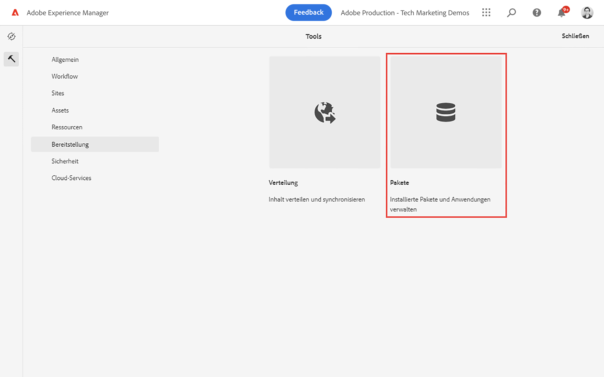
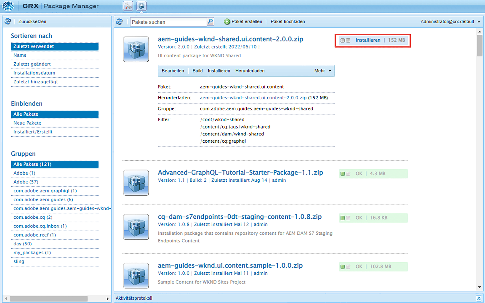

# Erste Schritte mit AEM Headless – GraphQL

Ein durchgehendes Tutorial, in dem erläutert wird, wie Inhalte mithilfe AEM GraphQL-APIs erstellt und bereitgestellt werden, die von einer externen App in einem Headless-CMS-Szenario genutzt werden.

In diesem Tutorial wird untersucht, wie AEM GraphQL-APIs und Headless-Funktionen verwendet werden können, um die in einer externen App angezeigten Erlebnisse zu optimieren.

In diesem Tutorial werden die folgenden Themen behandelt:

* Erstellen einer neuen Projektkonfiguration
* Erstellen neuer Inhaltsfragmentmodelle zum Modellieren von Daten
* Erstellen Sie neue Inhaltsfragmente basierend auf den zuvor erstellten Modellen.
* Erfahren Sie, wie Inhaltsfragmente in AEM mithilfe des integrierten GraphiQL-Entwicklungstools abgefragt werden können.
* So speichern oder speichern Sie die GraphQL-Abfragen in AEM
* Beibehaltene GraphQL-Abfragen aus einer React-Beispielanwendung nutzen

## Voraussetzungen {#prerequisites}

Für dieses Tutorial sind folgende Schritte erforderlich:

* Grundlegende HTML- und JavaScript-Kenntnisse
* Die folgenden Tools müssen lokal installiert sein:
   * [Node.js v10+](https://nodejs.org/en/)
   * [npm 6+](https://www.npmjs.com/)
   * [Git](https://git-scm.com/)
   * Eine IDE (z. B. [Microsoft® Visual Studio Code](https://code.visualstudio.com/))

### AEM-Umgebung

Zum Abschließen dieses Tutorials ist eine Adobe Experience Manager-Umgebung erforderlich. Sie können Folgendes verwenden (Screenshots werden aus einer AEM as a Cloud Service Umgebung aufgezeichnet):

* AEM as a Cloud Service Umgebung mit:
   * [Zugriff auf AEM as a Cloud Service und Cloud Manager](/help/cloud-service/accessing/overview.md)
      * **AEM Administrator** Zugang zu AEM as a Cloud Service
      * **Cloud Manager - Entwickler** Zugriff auf Cloud Manager
* [Lokales AEM as a Cloud Service Schnellstart-SDK](/help/cloud-service/local-development-environment/aem-runtime.md).
* [AEM 6.5.13+](https://experienceleague.adobe.com/docs/experience-manager-65/release-notes/release-notes.html?lang=de)

### Beispielinhalt installieren {#install-sample-content}

Es kann hilfreich sein, Beispielinhalte bereits in der AEM-Umgebung verfügbar zu haben, die als Referenz verwendet werden können.

1. Navigieren Sie zum [AEM WKND Shared Project](https://github.com/adobe/aem-guides-wknd-shared/releases).
1. Laden Sie das neueste veröffentlichte Asset herunter: `aem-guides-wknd-shared.ui.content-x.x.x.zip`.
1. Melden Sie sich bei der AEM Autorenumgebung an, die für das Tutorial verwendet werden soll.
1. Navigieren Sie im Startbildschirm von AEM zu **Instrumente** > **Implementierung** > **Pakete**:

   
1. Tippen **Paket hochladen** und wählen Sie die `aem-guides-wknd-shared.ui.content-x.x.x.zip` Datei heruntergeladen haben. Tippen **Ok** hochladen.
1. Nachdem das Paket hochgeladen wurde, tippen Sie auf **Installieren** um den Inhalt zu installieren.

   

1. Beispiel-Inhaltsfragmente, Inhaltsfragmentmodelle, Bilder und mehr werden für die fiktive [WKND-Marke](https://wknd.site/). Der Beispielinhalt wird später im Tutorial referenziert.

## Fangen wir an!

1. Starten Sie das Tutorial mit [Definieren von Inhaltsfragmentmodellen](content-fragment-models.md).

## GitHub-Projekt

Der Quell-Code und die Inhaltspakete sind im [AEM-Handbücher - WKND GraphQL GitHub-Projekt](https://github.com/adobe/aem-guides-wknd-graphql).

Wenn Sie ein Problem mit dem Tutorial oder dem Code finden, hinterlassen Sie bitte eine [GitHub-Problem](https://github.com/adobe/aem-guides-wknd-graphql/issues).

Beispiele für Inhaltsfragmente, Modelle und Abfragen finden Sie im [AEM WKND Shared Project](https://github.com/adobe/aem-guides-wknd-shared)
