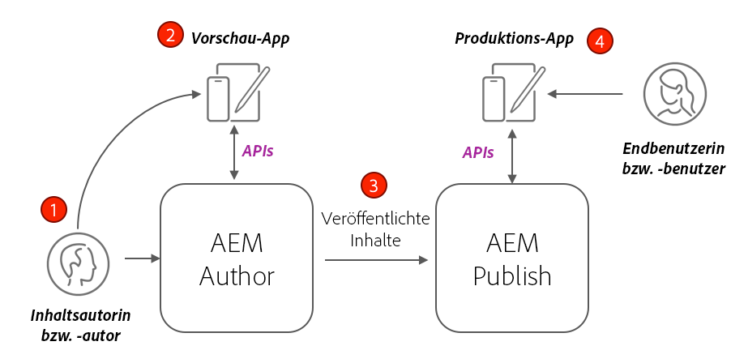
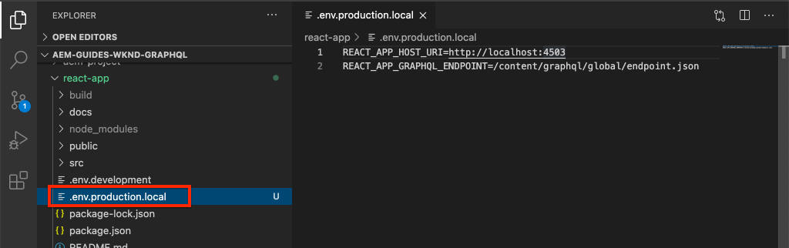
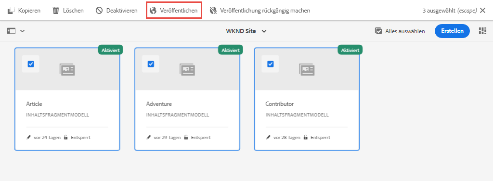
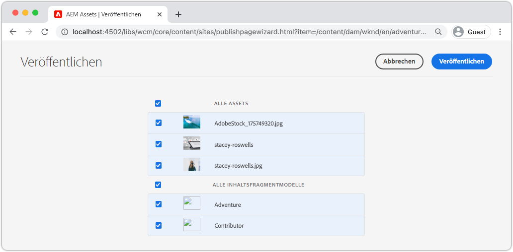

# Produktionsbereitstellung mit einem AEM-Veröffentlichungs-Service

In diesem Tutorial richten Sie eine lokale Umgebung ein, um zu simulieren, wie Inhalte von einer Autoreninstanz an eine Veröffentlichungsinstanz verteilt werden. Sie generieren außerdem den Produktions-Build einer React-App, die für die Verwendung von Inhalten aus der AEM Publish-Umgebung mithilfe der GraphQL-APIs konfiguriert ist. Außerdem erfahren Sie, wie Sie Umgebungsvariablen effektiv verwenden und die CORS-Konfigurationen von AEM aktualisieren können.

## Voraussetzungen

Dieses Tutorial ist Teil eines mehrteiligen Tutorials. Es wird davon ausgegangen, dass die in den vorherigen Teilen beschriebenen Schritte abgeschlossen sind.

## Ziele

Erfahren Sie mehr über Folgendes:

* Machen Sie sich mit der Author- und Publish-Architektur von AEM vertraut.
* Erfahren Sie mehr über Best Practices für die Verwaltung von Umgebungsvariablen.
* Erfahren Sie, wie Sie AEM für Cross-Origin Resource Sharing (CORS) ordnungsgemäß konfigurieren.

## Bereitstellungsmuster von Author und Publish {#deployment-pattern}

Eine vollständige AEM-Umgebung besteht aus Author, Publish und Dispatcher. Der Autoren-Service ist der Ort, wo interne Benutzende Inhalte erstellen, verwalten und in der Vorschau anzeigen. Der Veröffentlichungs-Service fungiert als „Live“-Umgebung und ist in der Regel der Bereich, mit dem die Endbenutzenden interagieren. Inhalte werden nach der Bearbeitung und Genehmigung im Autoren-Service an den Veröffentlichungs-Service weitergeleitet.

Das häufigste Bereitstellungsmuster bei AEM Headless-Programmen besteht darin, die Produktionsversion des Programms mit dem AEM-Veröffentlichungs-Service zu verbinden.



Das obige Diagramm zeigt dieses allgemeine Bereitstellungsmuster.

1. **Inhaltsautorinnen und -autoren** verwenden den AEM-Autoren-Service zum Erstellen, Bearbeiten und Verwalten von Inhalten.
2. Der **Inhaltsautor** und andere interne Benutzende können die Inhalte direkt im Autoren-Service in der Vorschau anzeigen. Es kann eine Vorschauversion des Programms eingerichtet werden, die eine Verbindung zum Autoren-Service herstellt.
3. Sobald der Inhalt genehmigt wurde, kann er über den AEM-Veröffentlichungs-Service **veröffentlicht** werden.
4. **Endbenutzende** interagieren mit der Produktionsversion des Programms. Die Produktions-Anwendung stellt eine Verbindung zum Veröffentlichungs-Service her und verwendet die GraphQL-APIs, um Inhalte anzufragen und zu nutzen.

Das Tutorial simuliert die oben genannte Bereitstellung, indem eine AEM-Veröffentlichungsinstanz zur aktuellen Einrichtung hinzugefügt wird. In früheren Kapiteln fungierte die React-App als Vorschau, indem sie eine direkte Verbindung zur Autoreninstanz herstellte. Ein Produktions-Build der React-App wird auf einem statischen Node.js-Server bereitgestellt, der eine Verbindung zur neuen Veröffentlichungsinstanz herstellt.

Am Ende werden drei lokale Server ausgeführt:

* http://localhost:4502 – Autoreninstanz
* http://localhost:4503 – Veröffentlichungsinstanz
* http://localhost:5000 – React-App im Produktionsmodus, die eine Verbindung zur Veröffentlichungsinstanz herstellt.

## Installieren von AEM SDK – Veröffentlichungsmodus {#aem-sdk-publish}

Derzeit befindet sich eine laufende Instanz des SDKs im **Autoren**-Modus. Das SDK kann auch im **Veröffentlichungs**-Modus gestartet werden, um eine AEM Publish-Umgebung zu simulieren.

Eine detailliertere Anleitung zum Einrichten einer lokalen Entwicklungsumgebung [finden Sie hier](https://experienceleague.adobe.com/docs/experience-manager-learn/cloud-service/local-development-environment-set-up/overview.html?lang=de#local-development-environment-set-up).

1. Erstellen Sie auf Ihrem lokalen Dateisystem einen dedizierten Ordner, um die Veröffentlichungsinstanz zu installieren, z. B. mit dem Namen `~/aem-sdk/publish`.
1. Kopieren Sie die Schnellstart-JAR-Datei, die in vorherigen Kapiteln für die Autoreninstanz verwendet wurde, und fügen Sie sie in das Verzeichnis `publish` ein. Alternativ können Sie zum [Software Distribution-Portal](https://experience.adobe.com/#/downloads/content/software-distribution/de/aemcloud.html) navigieren, das neueste SDK herunterladen und die Schnellstart-JAR-Datei extrahieren.
1. Benennen Sie die JAR-Datei in `aem-publish-p4503.jar` um.

   Die Zeichenfolge `publish` gibt an, dass die Schnellstart-JAR-Datei im Veröffentlichungsmodus gestartet wird. `p4503` gibt an, dass der Schnellstart-Server auf Port 4503 ausgeführt wird.

1. Öffnen Sie ein neues Terminal-Fenster und navigieren Sie zu dem Ordner, der die JAR-Datei enthält. Installieren und starten Sie die AEM-Instanz:

   ```shell
   $ cd ~/aem-sdk/publish
   $ java -jar aem-publish-p4503.jar
   ```

1. Geben Sie ein Administratorkennwort als `admin` an. Jedes Administratorkennwort ist akzeptabel. Es wird jedoch empfohlen, den Standard für die lokale Entwicklung zu verwenden, um zusätzliche Konfigurationen zu vermeiden.
1. Wenn die Installation der AEM-Instanz abgeschlossen ist, wird ein neues Browser-Fenster unter [http://localhost:4503/content.html](http://localhost:4503/content.html) geöffnet

   Es wird erwartet, dass „404: Seite nicht gefunden“ zurückgegeben wird. Dies ist eine brandneue AEM-Instanz und es wurde kein Inhalt installiert.

## Installieren Sie einen Beispielinhalt und GraphQL-Endpunkte {#wknd-site-content-endpoints}

Wie bei der Autoreninstanz muss die Veröffentlichungsinstanz die GraphQL-Endpunkte aktiviert haben und benötigt Beispielinhalte. Installieren Sie anschließend die WKND-Referenz-Site auf der Veröffentlichungsinstanz.

1. Laden Sie das neueste kompilierte AEM-Paket für die WKND-Site herunter: [aem-guides-wknd.all-x.x.x.zip](https://github.com/adobe/aem-guides-wknd/releases/latest).

   >[!NOTE]
   >
   > Stellen Sie sicher, dass Sie die Standardversion herunterladen, die mit AEM as a Cloud Service kompatibel ist, und **nicht** die Version `classic`.

1. Melden Sie sich bei der Veröffentlichungsinstanz an, indem Sie direkt zu folgenden Elementen navigieren: [http://localhost:4503/libs/granite/core/content/login.html](http://localhost:4503/libs/granite/core/content/login.html) mit dem Benutzernamen `admin` und Kennwort `admin`.
1. Navigieren Sie dann zum Package Manager unter [http://localhost:4503/crx/packmgr/index.jsp](http://localhost:4503/crx/packmgr/index.jsp).
1. Klicken Sie auf **Paket hochladen** und wählen Sie das im vorherigen Schritt heruntergeladene WKND-Paket aus. Klicken Sie auf **Installieren**, um das Paket zu installieren.
1. Nach der Installation des Pakets ist die WKND-Referenz-Site nun unter [http://localhost:4503/content/wknd/us/en.html](http://localhost:4503/content/acme/us/en.html) verfügbar.
1. Melden Sie sich als `admin` ab, indem Sie in der Menüleiste auf die Schaltfläche „Abmelden“ klicken.

   

   Im Gegensatz zur AEM-Autoreninstanz wird für die AEM-Veröffentlichungsinstanzen standardmäßig der anonyme schreibgeschützte Zugriff verwendet. Wir möchten das Erlebnis eines anonymen Benutzenden beim Ausführen der React-App simulieren.

## Aktualisieren von Umgebungsvariablen, um auf die Veröffentlichungsinstanz zu verweisen {#react-app-publish}

Aktualisieren Sie anschließend die von der React-App verwendeten Umgebungsvariablen, um auf die Veröffentlichungsinstanz zu verweisen. Die React-App sollte sich **nur** im Produktionsmodus mit der Veröffentlichungsinstanz verbinden.

Als Nächstes fügen Sie eine neue Datei `.env.production.local` hinzu, um das Produktionserlebnis zu simulieren.

1. Öffnen Sie die WKND GraphQL-React-App in Ihrer IDE.

1. Unterhalb von `aem-guides-wknd-graphql/react-app`, fügen Sie eine Datei mit dem Namen `.env.production.local` hinzu.
1. Füllen Sie `.env.production.local` wie folgt:

   ```plain
   REACT_APP_HOST_URI=http://localhost:4503
   REACT_APP_GRAPHQL_ENDPOINT=/content/graphql/global/endpoint.json
   ```

   

   Die Verwendung von Umgebungsvariablen erleichtert den Wechsel des GraphQL-Endpunkts zwischen einer Author- oder Publish-Umgebung, ohne dass im Anwendungscode zusätzliche Logik hinzugefügt wird. Weitere Informationen über [benutzerdefinierte Umgebungsvariablen für React finden Sie hier](https://create-react-app.dev/docs/adding-custom-environment-variables).

   >[!NOTE]
   >
   > Beachten Sie, dass keine Authentifizierungsinformationen enthalten sind, da Publish-Umgebungen standardmäßig anonymen Zugriff auf Inhalte bieten.

## Bereitstellen eines statischen Knoten-Servers {#static-server}

Die React-App kann über den Webpack-Server gestartet werden, dies dient jedoch nur der Entwicklung. Simulieren Sie als Nächstes eine Produktionsbereitstellung mithilfe von [serve](https://github.com/vercel/serve), um einen Produktionsaufbau der React-App mit Node.js zu hosten.

1. Öffnen Sie ein neues Terminal-Fenster und navigieren Sie zum Verzeichnis `aem-guides-wknd-graphql/react-app`.

   ```shell
   $ cd aem-guides-wknd-graphql/react-app
   ```

1. Installieren Sie [serve](https://github.com/vercel/serve) mit dem folgenden Befehl:

   ```shell
   $ npm install serve --save-dev
   ```

1. Öffnen Sie die Datei `package.json` unter `react-app/package.json`. Fügen Sie ein Skript mit dem Namen `serve` hinzu:

   ```diff
    "scripts": {
       "start": "react-scripts start",
       "build": "react-scripts build",
       "test": "react-scripts test",
       "eject": "react-scripts eject",
   +   "serve": "npm run build && serve -s build"
   },
   ```

   Das `serve`-Skript führt zwei Aktionen aus. Als Erstes wird ein Produktions-Build der React-App generiert. Danach wird der Node.js-Server gestartet, der den Produktions-Build verwendet.

1. Kehren Sie zum Terminal zurück und geben Sie den Befehl ein, um den statischen Server zu starten:

   ```shell
   $ npm run serve
   
   ┌────────────────────────────────────────────────────┐
   │                                                    │
   │   Serving!                                         │
   │                                                    │
   │   - Local:            http://localhost:5000        │
   │   - On Your Network:  http://192.168.86.111:5000   │
   │                                                    │
   │   Copied local address to clipboard!               │
   │                                                    │
   └────────────────────────────────────────────────────┘
   ```

1. Öffnen Sie einen neuen Browser und navigieren Sie zu [http://localhost:5000/](http://localhost:5000/). Sie sollten sehen, wie die React-App bereitgestellt wird.

   

   Beachten Sie, dass die GraphQL-Abfrage auf der Startseite funktioniert. Überprüfen Sie die **XHR**-Anfrage mit Ihren Entwickler-Tools. Beachten Sie, dass „GraphQL-POST“ an die Veröffentlichungsinstanz unter `http://localhost:4503/content/graphql/global/endpoint.json` gesendet wird.

   Alle Bilder sind jedoch auf der Startseite beschädigt!

1. Klicken Sie auf eine der Adventure-Detailseiten.

   

   Beachten Sie, dass ein GraphQL-Fehler für `adventureContributor` ausgelöst wird. In den nächsten Übungen werden die beschädigten Bilder und die `adventureContributor`-Probleme behoben.

## Absolute Bildverweise {#absolute-image-references}

Die Bilder scheinen beschädigt zu sein, weil das Attribut `` zu verweisen:

   ```diff
   - 
   + 
   ```

1. Öffnen Sie die Datei `AdventureDetail.js` unter `react-app/src/components/AdventureDetail.js`.
1. Wiederholen Sie die gleichen Schritte, um die GraphQL-Abfrage zu ändern und die Eigenschaft `_publishUrl` für das Adventure hinzuzufügen

   ```diff
    adventureByPath (_path: "${_path}") {
       item {
           _path
           adventureTitle
           adventureActivity
           adventureType
           adventurePrice
           adventureTripLength
           adventureGroupSize
           adventureDifficulty
           adventurePrice
           adventurePrimaryImage {
               ... on ImageRef {
               _path
   +           _publishUrl
               mimeType
               width
               height
               }
           }
           adventureDescription {
               html
           }
           adventureItinerary {
               html
           }
           adventureContributor {
               fullName
               occupation
               pictureReference {
                   ...on ImageRef {
                       _path
   +                   _publishUrl
                   }
               }
           }
       }
       }
   } 
   ```

1. Ändern Sie die beiden ``-Tags für das primäre Bild des Adventures und den Verweis auf die Bildreferenz in `AdventureDetail.js`:

   ```diff
   /* AdventureDetail.js */
   ...
   
   ...
   pictureReference =  
   ```

1. Kehren Sie zum Terminal zurück und starten Sie den statischen Server:

   ```shell
   $ npm run serve
   ```

1. Navigieren Sie zu [http://localhost:5000/](http://localhost:5000/) und stellen Sie fest, dass Bilder erscheinen und dass das Attribut `` auf `http://localhost:4503` verweist.

   

## Simulieren der Inhaltsveröffentlichung {#content-publish}

Erinnern Sie sich, dass ein GraphQL-Fehler für `adventureContributor` ausgelöst wird, wenn eine Adventure-Detailseite angefordert wird. Das **Anbieter**-Inhaltsfragmentmodell ist noch nicht in der Veröffentlichungsinstanz vorhanden. Aktualisierungen des **Adventure**-Inhaltsfragmentmodells sind ebenfalls nicht in der Veröffentlichungsinstanz verfügbar. Diese Änderungen wurden direkt an der Autoreninstanz vorgenommen und müssen an die Veröffentlichungsinstanz verteilt werden.

Dies ist zu berücksichtigen, wenn Sie neue Updates für eine Anwendung einführen, die auf Updates für ein Inhaltsfragment oder ein Inhaltsfragmentmodell angewiesen ist.

Als Nächstes wird die Simulation der Inhaltsveröffentlichung zwischen der lokalen Autoren- und Veröffentlichungsinstanz ermöglicht.

1. Starten Sie die Autoreninstanz (falls noch nicht gestartet) und navigieren Sie zu Package Manager unter [http://localhost:4502/crx/packmgr/index.jsp](http://localhost:4502/crx/packmgr/index.jsp)
1. Laden Sie das Paket [EnableReplicationAgent.zip](./assets/publish-deployment/EnableReplicationAgent.zip) herunter und installieren Sie es mit Package Manager.

   Dieses Paket installiert eine Konfiguration, die es der Autoreninstanz ermöglicht, Inhalte in der Veröffentlichungsinstanz zu veröffentlichen. Manuelle Schritte für [diese Konfiguration finden Sie hier](https://experienceleague.adobe.com/docs/experience-manager-learn/cloud-service/local-development-environment-set-up/aem-runtime.html?lang=de#content-distribution).

   >[!NOTE]
   >
   > In einer AEM as a Cloud Service Umgebung wird die Autorenebene automatisch so eingerichtet, dass Inhalte an die Veröffentlichungsebene verteilt werden.

1. Aus dem **AEM Start**-Menü, navigieren Sie zu **Tools** > **Assets** > **Inhaltsfragmentmodelle**.

1. Klicken Sie in den **WKND-Site**-Ordner.

1. Wählen Sie alle drei Modelle aus und klicken Sie auf **Veröffentlichen**:

   

   Ein Bestätigungsdialogfeld wird angezeigt, klicken Sie auf **Veröffentlichen**.

1. Navigieren Sie zum Inhaltsfragment des Bali Surf Camp unter [http://localhost:4502/editor.html/content/dam/wknd/en/adventures/bali-surf-camp/bali-surf-camp](http://localhost:4502/editor.html/content/dam/wknd/en/adventures/bali-surf-camp/bali-surf-camp).

1. Klicken Sie auf die Schaltfläche **Veröffentlichen** in der oberen Menüleiste.

   

1. Der Veröffentlichungsassistent zeigt alle abhängigen Assets an, die veröffentlicht werden sollen. In diesem Fall wird das referenzierte Fragment **stacey-roswells** aufgeführt, und es wird auch auf mehrere Bilder verwiesen. Die referenzierten Assets werden zusammen mit dem Fragment veröffentlicht.

   

   Klicken Sie erneut auf **Veröffentlichen**, um das Inhaltsfragment und die abhängigen Assets zu veröffentlichen.

1. Kehren Sie zur React-App zurück, die unter [http://localhost:5000/](http://localhost:5000/) läuft. Sie können jetzt in das Bali Surf Camp klicken, um die Adventure-Details zu sehen.

1. Wechseln Sie zurück zur AEM-Autoreninstanz unter [http://localhost:4502/editor.html/content/dam/wknd/en/adventures/bali-surf-camp/bali-surf-camp](http://localhost:4502/editor.html/content/dam/wknd/en/adventures/bali-surf-camp/bali-surf-camp) und aktualisieren Sie den **Titel** des Fragments. **Speichern und schließen** Sie das Fragment. **Veröffentlichen** Sie dann das Fragment.
1. Kehren Sie zu [http://localhost:5000/adventure:/content/dam/wknd/en/adventures/bali-surf-camp/bali-surf-camp](http://localhost:5000/adventure:/content/dam/wknd/en/adventures/bali-surf-camp/bali-surf-camp) zurück und betrachten Sie die veröffentlichten Änderungen.

   

## Aktualisieren der CORS-Konfiguration

AEM ist standardmäßig sicher und lässt keine clientseitigen Aufrufe von Nicht-AEM-Web-Eigenschaften zu. Die Cross-Origin Resource Sharing(CORS)-Konfiguration von AEM kann bestimmten Domains erlauben, AEM aufzurufen.

Experimentieren Sie anschließend mit der CORS-Konfiguration der AEM-Veröffentlichungsinstanz.

1. Kehren Sie zum Terminal-Fenster zurück, in dem die React-App mit folgendem Befehl ausgeführt wird `npm run serve`:

   ```shell
   ┌────────────────────────────────────────────────────┐
   │                                                    │
   │   Serving!                                         │
   │                                                    │
   │   - Local:            http://localhost:5000        │
   │   - On Your Network:  http://192.168.86.205:5000   │
   │                                                    │
   │   Copied local address to clipboard!               │
   │                                                    │
   └────────────────────────────────────────────────────┘
   ```

   Beachten Sie, dass zwei URLs bereitgestellt werden. Eine mit `localhost` und eine weitere mit der IP-Adresse des lokalen Netzwerks.

1. Navigieren Sie zur Adresse, die mit [http://192.168.86.XXX:5000](http://192.168.86.XXX:5000) beginnt. Die Adresse ist für jeden lokalen Computer etwas anders. Beachten Sie, dass beim Abrufen der Daten ein CORS-Fehler auftritt. Das liegt daran, dass die aktuelle CORS-Konfiguration nur Anfragen von `localhost` zulässt.

   

   Aktualisieren Sie anschließend die AEM-Publish-CORS-Konfiguration, um Anforderungen von der Netzwerk-IP-Adresse zuzulassen.

1. Navigieren Sie zu [http://localhost:4503/content/wknd/us/en/errors/sign-in.html](http://localhost:4503/content/wknd/us/en/errors/sign-in.html) und melden Sie sich mit dem Benutzernamen `admin` und Kennwort `admin` an.

1. Navigieren Sie zu [http://localhost:4503/system/console/configMgr](http://localhost:4503/system/console/configMgr) und finden Sie die WKND-GraphQL-Konfiguration unter `com.adobe.granite.cors.impl.CORSPolicyImpl~wknd-graphql`.

1. Aktualisieren Sie das Feld **Zulässige Ursprünge**, um die Netzwerk-IP-Adresse aufzunehmen:

   

   Es ist auch möglich, einen regulären Ausdruck einzufügen, um alle Anforderungen einer bestimmten Subdomain zuzulassen. Speichern Sie die Änderungen.

1. Suchen Sie nach **Apache Sling Referrer Filter** und überprüfen Sie die Konfiguration. Die Konfiguration **Leeres Feld zulassen** wird auch benötigt, um GraphQL-Anfragen von einer externen Domain zu ermöglichen.

   

   Diese wurden als Teil der WKND-Referenz-Website konfiguriert. Sie können den vollständigen Satz der OSGi-Konfigurationen über [das GitHub-Repository](https://github.com/adobe/aem-guides-wknd/tree/master/ui.config/src/main/content/jcr_root/apps/wknd/osgiconfig) einsehen.

   >[!NOTE]
   >
   > OSGi-Konfigurationen werden in einem AEM-Projekt verwaltet, das der Quell-Code-Verwaltung zugewiesen ist. Ein AEM-Projekt kann mithilfe von Cloud Manager in AEM as a Cloud Service-Umgebungen bereitgestellt werden. Der [AEM-Projektarchetyp](https://github.com/adobe/aem-project-archetype) kann dabei helfen, ein Projekt für eine bestimmte Implementierung zu erstellen.

1. Kehren Sie zur React-App zurück, die mit [http://192.168.86.XXX:5000](http://192.168.86.XXX:5000) beginnt, und achten Sie darauf, dass die Anwendung keinen CORS-Fehler mehr auslöst.

   

## Herzlichen Glückwunsch! {#congratulations}

Herzlichen Glückwunsch! Sie haben jetzt eine vollständige Produktionsbereitstellung mithilfe einer AEM Publish-Umgebung simuliert. Sie haben auch gelernt, wie die CORS-Konfiguration in AEM verwendet wird.

## Sonstige Ressourcen

Weitere Informationen zu Inhaltsfragmenten und GraphQL finden Sie in den folgenden Ressourcen:

* [Headless-Bereitstellung von Inhalten mithilfe von Inhaltsfragmenten mit GraphQL](https://experienceleague.adobe.com/docs/experience-manager-cloud-service/assets/content-fragments/content-fragments-graphql.html?lang=de)
* [AEM GraphQL-API zur Verwendung mit Inhaltsfragmenten](https://experienceleague.adobe.com/docs/experience-manager-cloud-service/assets/admin/graphql-api-content-fragments.html?lang=de)
* [Token-basierte Authentifizierung](https://experienceleague.adobe.com/docs/experience-manager-learn/getting-started-with-aem-headless/authentication/overview.html?lang=de#authentication)
* [Bereitstellen von Code für AEM as a Cloud Service](https://experienceleague.adobe.com/docs/experience-manager-learn/cloud-service/cloud-manager/devops/deploy-code.html?lang=de#cloud-manager)
