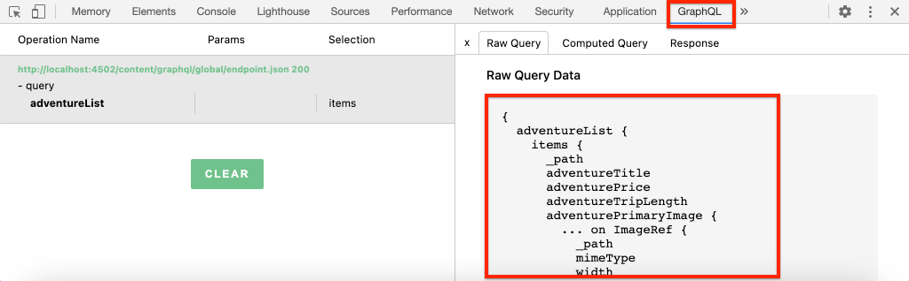

# Schnelleinstellungen {#setup}

Dieses Kapitel bietet eine schnelle Einrichtung einer lokalen Umgebung, um zu sehen, wie eine externe Anwendung Inhalte von AEM mithilfe AEM GraphQL-APIs nutzt. Spätere Kapitel im Tutorial werden von dieser Einrichtung aufbauen.

## Voraussetzungen {#prerequisites}

Die folgenden Tools sollten lokal installiert werden:

* [JDK 11](https://experience.adobe.com/#/downloads/content/software-distribution/en/general.html?1_group.propertyvalues.property=.%2Fjcr%3Acontent%2Fmetadata%2Fdc%3AsoftwareType&amp;1_group.propertyvalues.operation=equals&amp;1_group.propertyvalues.0_values=software-type%3Atooling&amp;fulltext=Oracle%7E+JDK%7E+11%7E&amp;orderby=%40jcr%3Acontent Fjcr%3AlastModified&amp;orderby.sort=desc&amp;layout=list&amp;p.offset=0&amp;p.limit=14)
* [Node.js v10+](https://nodejs.org/en/)
* [npm 6+](https://www.npmjs.com/)
* [Git](https://git-scm.com/)

## Ziele {#objectives}

1. Laden Sie das AEM SDK herunter und installieren Sie es.
1. Laden Sie Beispielinhalte von der WKND-Referenz-Website herunter und installieren Sie sie.
1. Laden Sie eine Beispielanwendung herunter und installieren Sie sie, um Inhalte mithilfe der GraphQL-APIs zu nutzen.

## Installieren des AEM SDK {#aem-sdk}

In diesem Tutorial werden die [AEM als Cloud Service-SDK](https://experienceleague.adobe.com/docs/experience-manager-cloud-service/implementing/developing/aem-as-a-cloud-service-sdk.html?lang=en#aem-as-a-cloud-service-sdk) verwendet, um AEM GraphQL-APIs zu untersuchen. Dieser Abschnitt enthält eine kurze Anleitung zum Installieren des AEM SDK und dessen Ausführung im Autorenmodus. Eine detailliertere Anleitung zum Einrichten einer lokalen Entwicklungsumgebung [finden Sie hier](https://experienceleague.adobe.com/docs/experience-manager-learn/cloud-service/local-development-environment-set-up/overview.html?lang=de#local-development-environment-set-up).

>[!NOTE]
>
> Sie können dem Tutorial auch eine AEM als Cloud Service-Umgebung folgen lassen. Weitere Hinweise zur Verwendung einer Cloud-Umgebung finden Sie im Tutorial.

1. Navigieren Sie zum **[Software Distribution-Portal](https://experience.adobe.com/#/downloads/content/software-distribution/en/aemcloud.html)** > **AEM als Cloud Service** und laden Sie die neueste Version des **AEM SDK** herunter.

   

   >[!CAUTION]
   >
   > Die GraphQL-Funktion ist standardmäßig nur im AEM SDK 2021-02-04 oder höher aktiviert.

1. Entpacken Sie den Download und kopieren Sie die Schnellstart-JAR (`aem-sdk-quickstart-XXX.jar`) in einen dedizierten Ordner, d. h. `~/aem-sdk/author`.
1. Benennen Sie die JAR-Datei erneut mit `aem-author-p4502.jar`.

   Der Name `author` gibt an, dass die Schnellstart-JAR-Datei im Autorenmodus gestartet wird. `p4502` gibt an, dass der Quickstart-Server auf Port 4502 ausgeführt wird.

1. Öffnen Sie ein neues Terminal-Fenster und navigieren Sie zu dem Ordner, der die JAR-Datei enthält. Führen Sie den folgenden Befehl aus, um die AEM-Instanz zu installieren und zu starten:

   ```shell
   $ cd ~/aem-sdk/author
   $ java -jar aem-author-p4502.jar
   ```

1. Geben Sie als Administrator-Kennwort `admin` an. Jedes Administratorkennwort ist akzeptabel. Es wird jedoch empfohlen, den Standard für die lokale Entwicklung zu verwenden, um eine Neukonfiguration zu vermeiden.
1. Nach einigen Minuten wird die Installation der AEM-Instanz abgeschlossen und ein neues Browser-Fenster sollte unter [http://localhost:4502](http://localhost:4502) geöffnet werden.
1. Melden Sie sich mit dem Benutzernamen `admin` und dem Kennwort `admin` an.

## Beispielinhalt und GraphQL-Endpunkte {#wknd-site-content-endpoints} installieren

Beispielinhalte von der **WKND-Referenz-Site** werden installiert, um das Tutorial zu beschleunigen. Die WKND ist eine fiktive Lebensmarke, die häufig in Verbindung mit AEM Training verwendet wird.

Die WKND-Referenz-Site enthält Konfigurationen, die zum Anzeigen eines [GraphQL-Endpunkts](https://experienceleague.adobe.com/docs/experience-manager-cloud-service/assets/admin/graphql-api-content-fragments.html?lang=en#graphql-aem-endpoint) erforderlich sind. Führen Sie in einer realen Implementierung die dokumentierten Schritte aus, um [die GraphQL-Endpunkte](https://experienceleague.adobe.com/docs/experience-manager-cloud-service/assets/admin/graphql-api-content-fragments.html?lang=en#graphql-aem-endpoint) in Ihr Kundenprojekt aufzunehmen. Ein [CORS](#cors-config) wurde ebenfalls als Teil der WKND-Site gepackt. Eine CORS-Konfiguration ist erforderlich, um Zugriff auf eine externe Anwendung zu gewähren. Weitere Informationen zu [CORS](#cors-config) finden Sie unten.

1. Laden Sie das neueste kompilierte AEM-Paket für die WKND-Site herunter: [aem-guides-wknd.all-x.x.x.zip](https://github.com/adobe/aem-guides-wknd/releases/latest).

   >[!NOTE]
   >
   > Laden Sie die mit AEM als Cloud Service kompatible Standardversion herunter und **not** die `classic` -Version.

1. Navigieren Sie im Menü **AEM Start** zu **Tools** > **Bereitstellung** > **Pakete**.

   

1. Klicken Sie auf **Paket hochladen** und wählen Sie das im vorherigen Schritt heruntergeladene WKND-Paket aus. Klicken Sie auf **Installieren** , um das Paket zu installieren.

1. Navigieren Sie im Menü **AEM Start** zu **Assets** > **Dateien**.
1. Klicken Sie durch die Ordner, um zu **WKND Site** > **English** > **Adventures** zu navigieren.

   

   Dies ist ein Ordner aller Assets, aus denen die verschiedenen Adventures der Marke WKND bestehen. Dazu gehören herkömmliche Medientypen wie Bilder und Videos sowie für AEM spezifische Medien wie **Inhaltsfragmente**.

1. Klicken Sie in den Ordner **Abwärts Skiing Wyoming** und klicken Sie auf die Karte **Abwärts Skiing Wyoming Content Fragment** .

   

1. Die Benutzeroberfläche des Inhaltsfragmente-Editors wird für das Abenteuer &quot;Wyoming beim Skifahren&quot;geöffnet.

   

   Beachten Sie, dass verschiedene Felder wie **Titel**, **Beschreibung** und **Aktivität** das Fragment definieren.

   **Inhaltsfragmente** sind eine der Möglichkeiten, Inhalte in AEM zu verwalten. Inhaltsfragmente sind wiederverwendbare, präsentationsunabhängige Inhalte, die aus strukturierten Datenelementen wie Text, Rich-Text, Daten oder Verweisen auf andere Inhaltsfragmente bestehen. Inhaltsfragmente werden später im Tutorial genauer untersucht.

1. Klicken Sie auf **Abbrechen** , um das Fragment zu schließen. Sie können auch in andere Ordner navigieren und die anderen Adventure-Inhalte durchsuchen.

>[!NOTE]
>
> Informationen zum Bereitstellen einer Codebasis wie der WKND-Referenz-Site in einer Cloud Service-Umgebung](https://experienceleague.adobe.com/docs/experience-manager-cloud-service/implementing/deploying/overview.html?lang=de#deploying) finden Sie in der Dokumentation zur Verwendung einer Cloud Service-Umgebung.[

## Installieren der Beispielanwendung{#sample-app}

Eines der Ziele dieses Tutorials besteht darin, zu zeigen, wie AEM Inhalte von einer externen Anwendung mit den GraphQL-APIs genutzt werden können. In diesem Tutorial wird eine React-App-Beispielanwendung verwendet, die teilweise abgeschlossen wurde, um das Tutorial zu beschleunigen. Die gleichen Lektionen und Konzepte gelten für Apps, die mit iOS, Android oder anderen Plattformen erstellt wurden. Die React-App ist absichtlich einfach, um unnötige Komplexität zu vermeiden. Es soll keine Referenzimplementierung sein.

1. Öffnen Sie ein neues Terminal-Fenster und klonen Sie die Tutorial-Starterverzweigung mithilfe von Git:

   ```shell
   $ git clone --branch tutorial/react git@github.com:adobe/aem-guides-wknd-graphql.git
   ```

1. Öffnen Sie in der IDE Ihrer Wahl die Datei `.env.development` unter `aem-guides-wknd-graphql/react-app/.env.development`. Stellen Sie sicher, dass die Zeile `REACT_APP_AUTHORIZATION` nicht kommentiert ist und die Datei wie folgt aussieht:

   ```plain
   REACT_APP_HOST_URI=http://localhost:4502
   REACT_APP_GRAPHQL_ENDPOINT=/content/graphql/global/endpoint.json
   # Use Authorization when connecting to an AEM Author environment
   REACT_APP_AUTHORIZATION=admin:admin
   ```

   Stellen Sie sicher, dass `React_APP_HOST_URI` mit Ihrer lokalen AEM übereinstimmt. In diesem Kapitel werden wir die React-App direkt mit der AEM **Autorenumgebung** verbinden. **** Autorenumgebungen erfordern standardmäßig eine Authentifizierung, sodass unsere App als  `admin` Benutzer eine Verbindung herstellt. Dies ist eine gängige Praxis bei der Entwicklung, da es uns ermöglicht, schnell Änderungen an der AEM-Umgebung vorzunehmen und sie sofort in der App widerzuspiegeln.

   >[!NOTE]
   >
   > In einem Produktionsszenario stellt die App eine Verbindung zu einer AEM **Publish**-Umgebung her. Weitere Informationen hierzu finden Sie im Kapitel [Produktionsbereitstellung](production-deployment.md) .

1. Navigieren Sie zum Ordner `aem-guides-wknd-graphql/react-app` . Installieren und starten Sie das Programm:

   ```shell
   $ cd aem-guides-wknd-graphql/react-app
   $ npm install
   $ npm start
   ```

1. Ein neues Browser-Fenster sollte die App automatisch unter [http://localhost:3000](http://localhost:3000) starten.

   

   Eine Liste des aktuellen Abenteuer-Inhalts von AEM sollte angezeigt werden.

1. Klicken Sie auf eines der Abenteuerbilder, um die Details des Abenteuers anzuzeigen. Es wird AEM gebeten, das Detail für ein Abenteuer zurückzugeben.

   

1. Verwenden Sie die Entwicklertools des Browsers, um die **Netzwerk**-Anforderungen zu überprüfen. Zeigen Sie die **XHR**-Anforderungen an und beobachten Sie mehrere POST-Anforderungen an `/content/graphql/global/endpoint.json`, den für AEM konfigurierten GraphQL-Endpunkt.

   

1. Sie können die Parameter und die JSON-Antwort auch anzeigen, indem Sie die Netzwerkanforderung überprüfen. Es kann hilfreich sein, eine Browsererweiterung wie [GraphQL Network](https://chrome.google.com/webstore/detail/graphql-network/igbmhmnkobkjalekgiehijefpkdemocm) für Chrome zu installieren, um ein besseres Verständnis der Abfrage und Antwort zu erhalten.

   

   *Verwenden des GraphQL-Netzwerks der Chrome-Erweiterung*

## Inhaltsfragment ändern

Nachdem die React-App ausgeführt wird, aktualisieren Sie den Inhalt in AEM und sehen Sie sich die Änderung in der App an.

1. Navigieren Sie zu AEM [http://localhost:4502](http://localhost:4502).
1. Navigieren Sie zu **Assets** > **Dateien** > **WKND-Site** > **Englisch** > **Abenteuer** > **[Bali Surf Camp](http://localhost:4502/assets.html/content/dam/wknd/en/adventures/bali-surf-camp)** .

   

1. Klicken Sie in das Inhaltsfragment **Bali Surf Camp** , um den Inhaltsfragment-Editor zu öffnen.
1. Ändern Sie den **Titel** und die **Beschreibung** des Abenteuers

   

1. Klicken Sie auf **Speichern**, um die Änderungen zu speichern.
1. Navigieren Sie zurück zur React-App unter [http://localhost:3000](http://localhost:3000) und aktualisieren Sie, um Ihre Änderungen anzuzeigen:

   

## Installieren des GraphiQL-Tools {#install-graphiql}

[](https://github.com/graphql/graphiql) GraphiQL ist ein Entwicklungstool und wird nur in Umgebungen auf niedrigerer Ebene wie einer Entwicklungs- oder lokalen Instanz benötigt. Mit der GraphiQL IDE können Sie die zurückgegebenen Abfragen und Daten schnell testen und verfeinern. GraphiQL bietet außerdem einfachen Zugriff auf die Dokumentation, sodass Sie leicht wissen können, welche Methoden verfügbar sind.

1. Navigieren Sie zum **[Software Distribution-Portal](https://experience.adobe.com/#/downloads/content/software-distribution/en/aemcloud.html)** > **AEM als Cloud Service**.
1. Suchen Sie nach &quot;GraphiQL&quot;(schließen Sie **i** in **GraphiQL** ein.
1. Laden Sie das neueste **GraphiQL Content Package v.x.x.x** herunter.

   

   Die ZIP-Datei ist ein AEM Paket, das direkt installiert werden kann.

1. Navigieren Sie im Menü **AEM Start** zu **Tools** > **Bereitstellung** > **Pakete**.
1. Klicken Sie auf **Paket hochladen** und wählen Sie das im vorherigen Schritt heruntergeladene Paket aus. Klicken Sie auf **Installieren** , um das Paket zu installieren.

   
1. Navigieren Sie zur GraphiQL-IDE unter [http://localhost:4502/content/graphiql.html](http://localhost:4502/content/graphiql.html) und beginnen Sie mit dem Erkunden der GraphQL-APIs.

   >[!NOTE]
   >
   > Das GraphQL-Tool und die GraphQL-API werden später im Tutorial](./explore-graphql-api.md) genauer untersucht.[

## Herzlichen Glückwunsch! {#congratulations}

Herzlichen Glückwunsch! Sie haben jetzt eine externe Anwendung, die AEM Inhalte mit GraphQL verbraucht. Sie können den Code in der React-App prüfen und mit der Änderung vorhandener Inhaltsfragmente experimentieren.

## Nächste Schritte {#next-steps}

Im nächsten Kapitel [Definieren von Inhaltsfragmentmodellen](content-fragment-models.md) erfahren Sie, wie Sie Inhalte modellieren und ein Schema mit **Inhaltsfragmentmodellen** erstellen. Sie werden vorhandene Modelle überprüfen und ein neues Modell erstellen. Außerdem erfahren Sie mehr über die verschiedenen Datentypen, mit denen ein Schema als Teil des Modells definiert werden kann.

## (Bonus) CORS-Konfiguration {#cors-config}

AEM blockiert standardmäßig ursprungsübergreifende Anforderungen und verhindert so, dass nicht autorisierte Anwendungen eine Verbindung zu ihrem Inhalt herstellen und ihn aufdecken.

Damit die React-App dieses Tutorials mit AEM GraphQL-API-Endpunkten interagieren kann, wurde im WKND-Site-Referenzprojekt eine ursprungsübergreifende Konfiguration für die Ressourcenfreigabe definiert.


So zeigen Sie die bereitgestellte Konfiguration an:

1. Navigieren Sie zur Web-Konsole AEM SDK unter [http://localhost:4502/system/console](http://localhost:4502/system/console).

   >[!NOTE]
   >
   > Die Web-Konsole ist nur im SDK verfügbar. In einer AEM as a Cloud Service-Umgebung können diese Informationen über [die Entwicklerkonsole](https://experienceleague.adobe.com/docs/experience-manager-learn/cloud-service/debugging/debugging-aem-as-a-cloud-service/developer-console.html) angezeigt werden.

1. Klicken Sie im oberen Menü auf **OSGI** > **Konfiguration** , um alle [OSGi-Konfigurationen](http://localhost:4502/system/console/configMgr) anzuzeigen.
1. Scrollen Sie auf der Seite **Adobe Granite Cross-Origin Resource Sharing** nach unten.
1. Klicken Sie auf die Konfiguration für `com.adobe.granite.cors.impl.CORSPolicyImpl~wknd-graphql`.
1. Die folgenden Felder wurden aktualisiert:
   * Zulässiger Ursprung (Regex): `http://localhost:.*`
      * Ermöglicht alle lokalen Host-Verbindungen.
   * Zulässige Pfade: `/content/graphql/global/endpoint.json`
      * Dies ist der einzige derzeit konfigurierte GraphQL-Endpunkt. Als Best Practice sollten die COR-Konfigurationen so restriktiv wie möglich sein.
   * Zulässige Methoden: `GET`, `HEAD`, `POST`
      * Für GraphQL ist nur `POST` erforderlich. Die anderen Methoden können jedoch bei der Headless-Interaktion mit AEM nützlich sein.
   * Unterstützte Kopfzeilen: **authorization** wurde hinzugefügt, um grundlegende Authentifizierung in der Autorenumgebung zu übergeben.
   * Unterstützt Anmeldedaten: `Yes`
      * Dies ist erforderlich, da unsere React-App mit den geschützten GraphQL-Endpunkten im AEM-Autorendienst kommuniziert.

Diese Konfiguration und die GraphQL-Endpunkte sind Teil des AEM WKND-Projekts. Sie können alle [OSGi-Konfigurationen hier](https://github.com/adobe/aem-guides-wknd/tree/master/ui.config/src/main/content/jcr_root/apps/wknd/osgiconfig) anzeigen.
