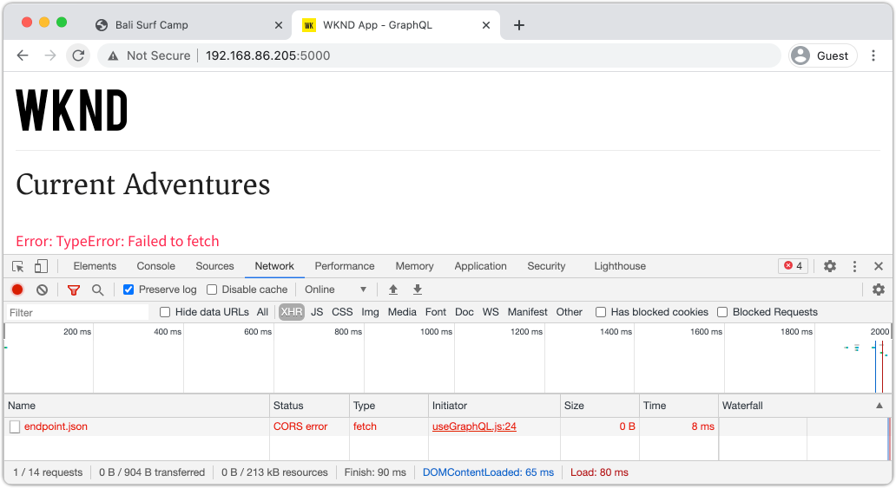
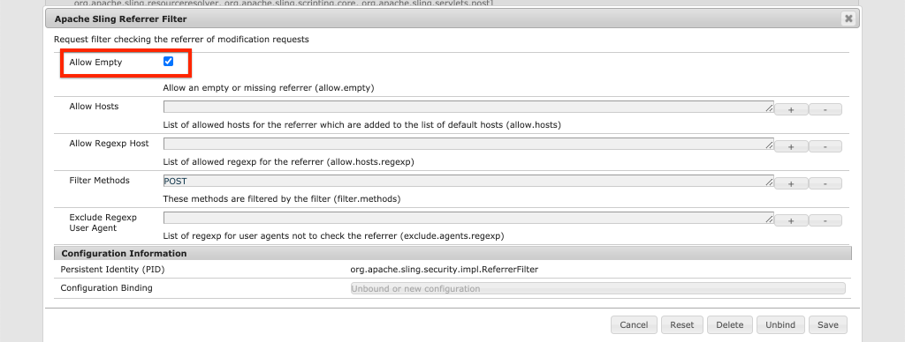

# Produktionsimplementierung mit einem AEM Publishing-Dienst

In diesem Lernprogramm richten Sie eine lokale Umgebung ein, um zu simulieren, wie Inhalte von einer Autoreninstanz an eine Veröffentlichungsinstanz verteilt werden. Sie generieren außerdem den Produktionsaufbau einer React-App, die so konfiguriert ist, dass Inhalte aus der AEM Publish-Umgebung mit den GraphQL-APIs verwendet werden. Auf diesem Weg lernen Sie, wie Sie die Umgebung effektiv nutzen und die AEM CORS-Konfigurationen aktualisieren können.

## Voraussetzungen

Dieses Tutorial ist Teil eines mehrteiligen Tutorials. Es wird davon ausgegangen, dass die in den vorherigen Teilen beschriebenen Schritte abgeschlossen sind.

## Ziele

Erfahren Sie, wie:

* Verstehen Sie die Architektur von AEM Author und Publish.
* Erfahren Sie, welche Best Practices für die Verwaltung von Umgebung-Variablen gelten.
* Erfahren Sie, wie Sie AEM für Cross-Herkunft Resource Sharing (CORS) ordnungsgemäß konfigurieren.

## Veröffentlichungsbereitstellungsmuster für Autoren {#deployment-pattern}

Eine vollständige AEM Umgebung besteht aus einem Autor, einem Veröffentlichen und einem Dispatcher. Im Autorendienst können interne Benutzer Inhalte erstellen, verwalten und Vorschauen bereitstellen. Der Publish-Dienst wird als &quot;Live&quot;-Umgebung betrachtet und ist in der Regel das, mit dem Endbenutzer interagieren. Nach der Bearbeitung und Genehmigung im Autorendienst werden Inhalte an den Veröffentlichungsdienst verteilt.

Das häufigste Bereitstellungsmuster bei AEM kostenlosen Anwendungen besteht darin, dass die Produktionsversion der Anwendung mit einem AEM Publish-Dienst verbunden wird.


Das obige Diagramm zeigt dieses allgemeine Bereitstellungsmuster.

1. Ein **Inhaltsautor** verwendet den AEM Autorendienst, um Inhalte zu erstellen, zu bearbeiten und zu verwalten.
2. Der **Content-Autor** und andere interne Benutzer können den Inhalt direkt im Authoring-Dienst Vorschau haben. Es kann eine Anwendungsversion eingerichtet werden, die eine Vorschau mit dem Autorendienst herstellt.
3. Sobald der Inhalt genehmigt wurde, kann er im AEM Publish-Dienst **veröffentlicht** werden.
4. **Beenden Sie** UserInteract mit der Produktionsversion der Anwendung. Die Produktionsanwendung stellt eine Verbindung zum Publish-Dienst her und verwendet die GraphQL-APIs, um Inhalte anzufordern und zu konsumieren.

Das Lernprogramm simuliert die oben genannte Bereitstellung, indem es der aktuellen Einrichtung eine AEM Publish-Instanz hinzufügt. In früheren Kapiteln fungierte die React App als Vorschau, indem sie eine direkte Verbindung zur Autoreninstanz herstellte. Ein Produktionsaufbau der React-App wird auf einem statischen Node.js-Server bereitgestellt, der eine Verbindung zur neuen Veröffentlichungsinstanz herstellt.

Am Ende werden drei lokale Server ausgeführt:

* http://localhost:4502 - Autoreninstanz
* http://localhost:4503 - Veröffentlichungsinstanz
* http://localhost:5000 - React App im Produktionsmodus, eine Verbindung zur Veröffentlichungsinstanz herstellen.

## AEM SDK installieren - Veröffentlichungsmodus {#aem-sdk-publish}

Derzeit befindet sich eine laufende Instanz des SDK im Modus **Autor**. Das SDK kann auch im **Veröffentlichungsmodus** gestartet werden, um eine AEM Publish-Umgebung zu simulieren.

Eine ausführlichere Anleitung zum Einrichten einer lokalen Entwicklungs-Umgebung [finden Sie hier](https://experienceleague.adobe.com/docs/experience-manager-learn/cloud-service/local-development-environment-set-up/overview.html?lang=de#local-development-environment-set-up).

1. Erstellen Sie im lokalen Dateisystem einen eigenen Ordner, um die Veröffentlichungsinstanz zu installieren, d. h. `~/aem-sdk/publish`.
1. Kopieren Sie die Quickstart-JAR-Datei, die in früheren Kapiteln für die Autoreninstanz verwendet wurde, und fügen Sie sie im Ordner `publish` ein. Alternativ können Sie das [Software Distribution Portal](https://experience.adobe.com/#/downloads/content/software-distribution/en/aemcloud.html) aufrufen und das neueste SDK herunterladen und die Quickstart-JAR-Datei extrahieren.
1. Benennen Sie die JAR-Datei in `aem-publish-p4503.jar` um.

   Die Zeichenfolge `publish` gibt an, dass die Schnellstart-JAR-Beginn im Veröffentlichungsmodus ausgeführt werden. Das `p4503` gibt an, dass der Quickstart-Server auf Port 4503 ausgeführt wird.

1. Öffnen Sie ein neues Terminalfenster und navigieren Sie zu dem Ordner, der die JAR-Datei enthält. Installieren und Beginn der AEM Instanz:

   ```shell
   $ cd ~/aem-sdk/publish
   $ java -jar aem-publish-p4503.jar
   ```

1. Geben Sie ein Administratorkennwort als `admin` ein. Jedes Admin-Kennwort ist zulässig. Es wird jedoch empfohlen, den Standard für die lokale Entwicklung zu verwenden, um zusätzliche Konfigurationen zu vermeiden.
1. Wenn die Installation der AEM abgeschlossen ist, wird unter [http://localhost:4503/content.html](http://localhost:4503/content.html) ein neues Browserfenster geöffnet

   Es wird erwartet, dass eine Seite &quot;404 nicht gefunden&quot;zurückgegeben wird. Dies ist eine ganz neue AEM Instanz, und es wurden keine Inhalte installiert.

## Beispielinhalt und GraphQL-Endpunkte {#wknd-site-content-endpoints} installieren

Genau wie bei der Autoreninstanz müssen für die Veröffentlichungsinstanz die GraphQL-Endpunkte aktiviert sein und Beispielinhalte benötigt werden. Installieren Sie anschließend die WKND-Referenz-Website auf der Veröffentlichungsinstanz.

1. Laden Sie das neueste kompilierte AEM-Paket für die WKND-Site herunter: [aem-guides-wknd.all-x.x.x.zip](https://github.com/adobe/aem-guides-wknd/releases/latest).

   >[!NOTE]
   >
   > Laden Sie unbedingt die Standardversion herunter, die mit AEM als Cloud Service kompatibel ist, und **nicht** die `classic`-Version.

1. Melden Sie sich bei der Veröffentlichungsinstanz an, indem Sie direkt zu folgenden Elementen navigieren: [http://localhost:4503/libs/granite/core/content/login.html](http://localhost:4503/libs/granite/core/content/login.html) mit dem Benutzernamen `admin` und dem Kennwort `admin`.
1. Navigieren Sie anschließend zum Package Manager unter [http://localhost:4503/crx/packmgr/index.jsp](http://localhost:4503/crx/packmgr/index.jsp).
1. Klicken Sie auf **Paket hochladen** und wählen Sie das im vorherigen Schritt heruntergeladene WKND-Paket. Klicken Sie auf **Installieren**, um das Paket zu installieren.
1. Nach der Installation des Pakets ist die WKND-Referenz-Website jetzt unter [http://localhost:4503/content/wknd/us/en.html](http://localhost:4503/content/wknd/us/en.html) verfügbar.
1. Melden Sie sich als `admin`-Benutzer ab, indem Sie in der Menüleiste auf die Schaltfläche &quot;Abmelden&quot;klicken.

   

   Im Gegensatz zur AEM-Autoreninstanz wird in den AEM Publish-Instanzen standardmäßig der anonyme schreibgeschützte Zugriff verwendet. Wir möchten das Erlebnis eines anonymen Benutzers beim Ausführen der React-Anwendung simulieren.

## Aktualisieren Sie die Variablen &quot;Umgebung&quot;, um auf die Veröffentlichungsinstanz {#react-app-publish} zu verweisen

Aktualisieren Sie anschließend die von der React-Umgebung verwendeten Variablen, um auf die Veröffentlichungsinstanz zu verweisen. Die React-App sollte im Produktionsmodus nur eine Verbindung zur Veröffentlichungsinstanz herstellen.****

Fügen Sie dann eine neue Datei `.env.production.local` hinzu, um das Produktionserlebnis zu simulieren.

1. Öffnen Sie die WKND GraphQL React-App in Ihrer IDE.

1. Fügen Sie unter `aem-guides-wknd-graphql/react-app` eine Datei mit dem Namen `.env.production.local` hinzu.
1. Füllen Sie `.env.production.local` wie folgt:

   ```plain
   REACT_APP_HOST_URI=http://localhost:4503
   REACT_APP_GRAPHQL_ENDPOINT=/content/graphql/global/endpoint.json
   ```

   

   Die Verwendung von Umgebung-Variablen erleichtert das Umschalten des GraphQL-Endpunkts zwischen einer Author- oder einer Publish-Umgebung, ohne zusätzliche Logik im Anwendungscode hinzuzufügen. Weitere Informationen zu den Variablen für die benutzerspezifische Umgebung finden Sie hier.[](https://create-react-app.dev/docs/adding-custom-environment-variables)

   >[!NOTE]
   >
   > Beachten Sie, dass keine Authentifizierungsinformationen enthalten sind, da Umgebung im Veröffentlichungsmodus standardmäßig anonymen Zugriff auf Inhalte bieten.

## Einen statischen Node-Server {#static-server} bereitstellen

Die React-App kann mit dem Webpack-Server gestartet werden, dies ist jedoch nur für die Entwicklung vorgesehen. Anschließend simulieren Sie eine Produktionsimplementierung, indem Sie [server](https://github.com/vercel/serve) verwenden, um einen Produktionsaufbau der React-App mit Node.js zu hosten.

1. Öffnen Sie ein neues Terminalfenster und navigieren Sie zum Ordner `aem-guides-wknd-graphql/react-app`

   ```shell
   $ cd aem-guides-wknd-graphql/react-app
   ```

1. Installieren Sie [serve](https://github.com/vercel/serve) mit dem folgenden Befehl:

   ```shell
   $ npm install serve --save-dev
   ```

1. Öffnen Sie die Datei `package.json` unter `react-app/package.json`. hinzufügen eines Skripts mit dem Namen `serve`:

   ```diff
    "scripts": {
       "start": "react-scripts start",
       "build": "react-scripts build",
       "test": "react-scripts test",
       "eject": "react-scripts eject",
   +   "serve": "npm run build && serve -s build"
   },
   ```

   Das Skript `serve` führt zwei Aktionen aus. Zunächst wird ein Produktionsaufbau der React-App generiert. Zweitens, die Node.js-Server-Beginn und verwendet den Produktions-Build.

1. Kehren Sie zum Terminal zurück und geben Sie den Befehl ein, um den statischen Server Beginn:

   ```shell
   $ npm run serve
   
   ┌────────────────────────────────────────────────────┐
   │                                                    │
   │   Serving!                                         │
   │                                                    │
   │   - Local:            http://localhost:5000        │
   │   - On Your Network:  http://192.168.86.111:5000   │
   │                                                    │
   │   Copied local address to clipboard!               │
   │                                                    │
   └────────────────────────────────────────────────────┘
   ```

1. Öffnen Sie einen neuen Browser und navigieren Sie zu [http://localhost:5000/](http://localhost:5000/). Sie sollten sehen, wie die React-App bereitgestellt wird.

   

   Beachten Sie, dass die GraphQL-Abfrage an der Startseite arbeitet. Inspect Sie die Anforderung **XHR** mit Ihren Entwicklerwerkzeugen. Beachten Sie, dass die GraphQL-POST der Veröffentlichungsinstanz bei `http://localhost:4503/content/graphql/global/endpoint.json` entspricht.

   Aber alle Bilder sind auf der Startseite kaputt!

1. Klicken Sie auf eine der Adventure Detail-Seiten.

   

   Beachten Sie, dass für `adventureContributor` ein GraphQL-Fehler ausgegeben wird. In den nächsten Übungen wurden die beschädigten Bilder und die `adventureContributor`-Probleme behoben.

## Absolute Bildreferenzen {#absolute-image-references}

Die Bilder erscheinen beschädigt, da das ``-Tags auf die `_publishUrl`-Eigenschaft statt auf die `_path`-Eigenschaft zu verweisen:

   ```diff
   - 
   + 
   ```

1. Öffnen Sie die Datei `AdventureDetail.js` unter `react-app/src/components/AdventureDetail.js`.
1. Wiederholen Sie die gleichen Schritte, um die GraphQL-Abfrage zu ändern und die `_publishUrl`-Eigenschaft für das Adventure hinzuzufügen.

   ```diff
    adventureByPath (_path: "${_path}") {
       item {
           _path
           adventureTitle
           adventureActivity
           adventureType
           adventurePrice
           adventureTripLength
           adventureGroupSize
           adventureDifficulty
           adventurePrice
           adventurePrimaryImage {
               ... on ImageRef {
               _path
   +           _publishUrl
               mimeType
               width
               height
               }
           }
           adventureDescription {
               html
           }
           adventureItinerary {
               html
           }
           adventureContributor {
               fullName
               occupation
               pictureReference {
                   ...on ImageRef {
                       _path
   +                   _publishUrl
                   }
               }
           }
       }
       }
   } 
   ```

1. Ändern Sie die beiden ``-Tags für das Adventure Primär Image und den Mitarbeiter-Picture-Verweis in `AdventureDetail.js`:

   ```diff
   /* AdventureDetail.js */
   ...
   
   ...
   pictureReference =  
   ```

1. Kehren Sie zum Terminal zurück und Beginn des statischen Servers:

   ```shell
   $ npm run serve
   ```

1. Navigieren Sie zu [http://localhost:5000/](http://localhost:5000/) und stellen Sie fest, dass Bilder angezeigt werden und dass das ``-Attribut auf `http://localhost:4503` verweist.

   

## Inhaltsveröffentlichung simulieren {#content-publish}

Denken Sie daran, dass für `adventureContributor` ein GraphQL-Fehler ausgegeben wird, wenn eine Seite mit den Abenteuerdetails angefordert wird. Das Inhaltsfragmentmodell **Mitarbeiter** ist in der Veröffentlichungsinstanz noch nicht vorhanden. Aktualisierungen am Inhaltsfragmentmodell **Adventure** sind auch auf der Veröffentlichungsinstanz nicht verfügbar. Diese Änderungen wurden direkt an der Autoreninstanz vorgenommen und müssen an die Veröffentlichungsinstanz weitergegeben werden.

Dies ist bei der Bereitstellung neuer Aktualisierungen für eine Anwendung zu beachten, die auf Aktualisierungen eines Inhaltsfragments oder eines Inhaltsfragmentmodells beruht.

Als Nächstes können Sie die Inhaltsveröffentlichung zwischen der lokalen Instanz im Autorenmodus und der Instanz im Veröffentlichungsmodus simulieren.

1. Beginn Sie die Autoreninstanz (falls noch nicht gestartet) und navigieren Sie zum Package Manager unter [http://localhost:4502/crx/packmgr/index.jsp](http://localhost:4502/crx/packmgr/index.jsp)
1. Laden Sie das Paket [EnableReplicationAgent.zip](./assets/publish-deployment/EnableReplicationAgent.zip) herunter und installieren Sie es mit Package Manager.

   Mit diesem Paket wird eine Konfiguration installiert, mit der die Autoreninstanz Inhalte in der Veröffentlichungsinstanz veröffentlichen kann. Manuelle Schritte für [diese Konfiguration finden Sie hier](https://experienceleague.adobe.com/docs/experience-manager-learn/cloud-service/local-development-environment-set-up/aem-runtime.html?lang=en#content-distribution).

   >[!NOTE]
   >
   > In einer AEM als Cloud Service-Umgebung wird die Autorenebene automatisch so eingerichtet, dass Inhalte auf der Veröffentlichungsstufe verteilt werden.

1. Navigieren Sie im Menü **AEM Beginn** zu **Tools** > **Assets** > **Inhaltsfragmentmodelle**.

1. Klicken Sie in den Ordner **WKND Site**.

1. Wählen Sie alle drei Modelle aus und klicken Sie auf **Veröffentlichen**:

   

   Ein Bestätigungsdialogfeld wird angezeigt und klicken Sie auf **Veröffentlichen**.

1. Navigieren Sie zum Inhaltsfragment des Bali Surf Camp unter [http://localhost:4502/editor.html/content/dam/wknd/en/adventures/bali-surf-camp/bali-surf-camp](http://localhost:4502/editor.html/content/dam/wknd/en/adventures/bali-surf-camp/bali-surf-camp).

1. Klicken Sie in der oberen Menüleiste auf die Schaltfläche **Veröffentlichen**.

   

1. Der Veröffentlichungsassistent zeigt alle abhängigen Assets an, die veröffentlicht werden sollen. In diesem Fall wird das referenzierte Fragment **stacey-roswells** aufgelistet und es werden auch mehrere Bilder referenziert. Die referenzierten Assets werden zusammen mit dem Fragment veröffentlicht.

   

   Klicken Sie erneut auf die Schaltfläche **Veröffentlichen**, um das Inhaltsfragment und die abhängigen Assets zu veröffentlichen.

1. Kehren Sie zur React App unter [http://localhost:5000/](http://localhost:5000/) zurück. Sie können nun in das Bali Surf Camp klicken, um die Abenteuerdetails zu sehen.

1. Wechseln Sie zurück zur AEM-Autoreninstanz unter [http://localhost:4502/editor.html/content/dam/wknd/en/adventures/bali-surf-camp/bali-surf-camp](http://localhost:4502/editor.html/content/dam/wknd/en/adventures/bali-surf-camp/bali-surf-camp) und aktualisieren Sie **Title** des Fragments. **Speichern und** schließen Sie das Fragment. Dann **publish** das Fragment.
1. Kehren Sie zu [http://localhost:5000/adventure:/content/dam/wknd/en/adventures/bali-surf-camp/bali-surf-camp](http://localhost:5000/adventure:/content/dam/wknd/en/adventures/bali-surf-camp/bali-surf-camp) zurück und beobachten Sie die veröffentlichten Änderungen.

   

## COR-Konfiguration aktualisieren

AEM ist standardmäßig sicher und erlaubt es nicht-AEM Webeigenschaften nicht, clientseitige Aufrufe durchzuführen. AEM CORS-Konfiguration (Cross-Herkunft Resource Sharing) kann es bestimmten Domänen ermöglichen, AEM aufzurufen.

Experimentieren Sie anschließend mit der CORS-Konfiguration der AEM Publish-Instanz.

1. Kehren Sie zum Terminalfenster zurück, in dem die React-App mit dem Befehl `npm run serve` ausgeführt wird:

   ```shell
   ┌────────────────────────────────────────────────────┐
   │                                                    │
   │   Serving!                                         │
   │                                                    │
   │   - Local:            http://localhost:5000        │
   │   - On Your Network:  http://192.168.86.205:5000   │
   │                                                    │
   │   Copied local address to clipboard!               │
   │                                                    │
   └────────────────────────────────────────────────────┘
   ```

   Beachten Sie, dass zwei URLs bereitgestellt werden. Eine mit `localhost` und eine andere mit der lokalen Netzwerk-IP-Adresse.

1. Navigieren Sie zur Adresse, die mit [http://192.168.86.XXX:5000](http://192.168.86.XXX:5000) beginnt. Die Adresse wird für jeden lokalen Computer etwas anders sein. Beachten Sie, dass beim Abrufen der Daten ein CORS-Fehler auftritt. Dies liegt daran, dass die aktuelle CORS-Konfiguration nur Anforderungen von `localhost` zulässt.

   

   Aktualisieren Sie anschließend die AEM Publish CORS-Konfiguration, um Anforderungen von der Netzwerk-IP-Adresse zuzulassen.

1. Navigieren Sie zu [http://localhost:4503/content/wknd/us/en/errors/sign-in.html](http://localhost:4503/content/wknd/us/en/errors/sign-in.html) und melden Sie sich mit dem Benutzernamen `admin` und dem Kennwort `admin` an.

1. Navigieren Sie zu [http://localhost:4503/system/console/configMgr](http://localhost:4503/system/console/configMgr) und suchen Sie die WKND GraphQL-Konfiguration unter `com.adobe.granite.cors.impl.CORSPolicyImpl~wknd-graphql`.

1. Aktualisieren Sie das Feld **Zulässige Herkünfte**, um die Netzwerk-IP-Adresse einzuschließen:

   

   Es ist auch möglich, einen regulären Ausdruck einzubinden, um alle Anforderungen einer bestimmten Subdomäne zuzulassen. Speichern Sie die Änderungen.

1. Suchen Sie nach **Apache Sling Werber Filter** und überprüfen Sie die Konfiguration. Die Konfiguration **Leeres Feld zulassen** ist ebenfalls erforderlich, um GraphQL-Anforderungen von einer externen Domäne zu aktivieren.

   

   Diese wurden als Teil der WKND-Referenz-Website konfiguriert. Sie können den vollständigen Satz von OSGi-Konfigurationen über [das GitHub-Repository](https://github.com/adobe/aem-guides-wknd/tree/master/ui.config/src/main/content/jcr_root/apps/wknd/osgiconfig) Ansicht durchführen.

   >[!NOTE]
   >
   > OSGi-Konfigurationen werden in einem AEM Projekt verwaltet, das der Quellcodeverwaltung verpflichtet ist. Ein AEM Projekt kann mit Cloud Manager AEM als Cloud Service-Umgebung bereitgestellt werden. Der [AEM Projektarchiv](https://github.com/adobe/aem-project-archetype) kann dabei helfen, ein Projekt für eine bestimmte Implementierung zu erstellen.

1. Kehren Sie zur React App zurück, die mit [http://192.168.86.XXX:5000](http://192.168.86.XXX:5000) beginnt, und stellen Sie fest, dass die Anwendung keinen CORS-Fehler mehr ausgibt.

   

## Herzlichen Glückwunsch! {#congratulations}

Herzlichen Glückwunsch! Sie haben jetzt eine vollständige Produktionsimplementierung mit einer AEM Publish-Umgebung simuliert. Sie haben auch gelernt, wie Sie die CORS-Konfiguration in AEM verwenden.

## Sonstige Ressourcen

Weitere Informationen zu Inhaltsfragmenten und GraphQL finden Sie in den folgenden Ressourcen:

* [Headless-Bereitstellung von Inhalten mithilfe von Inhaltsfragmenten mit GraphQL](https://experienceleague.adobe.com/docs/experience-manager-cloud-service/assets/content-fragments/content-fragments-graphql.html)
* [AEM GraphQL-API zur Verwendung mit Inhaltsfragmenten](https://experienceleague.adobe.com/docs/experience-manager-cloud-service/assets/admin/graphql-api-content-fragments.html)
* [Token-basierte Authentifizierung](https://experienceleague.adobe.com/docs/experience-manager-learn/getting-started-with-aem-headless/authentication/overview.html?lang=en#authentication)
* [Bereitstellen von Code für AEM als Cloud Service](https://experienceleague.adobe.com/docs/experience-manager-learn/cloud-service/cloud-manager/devops/deploy-code.html?lang=en#cloud-manager)
