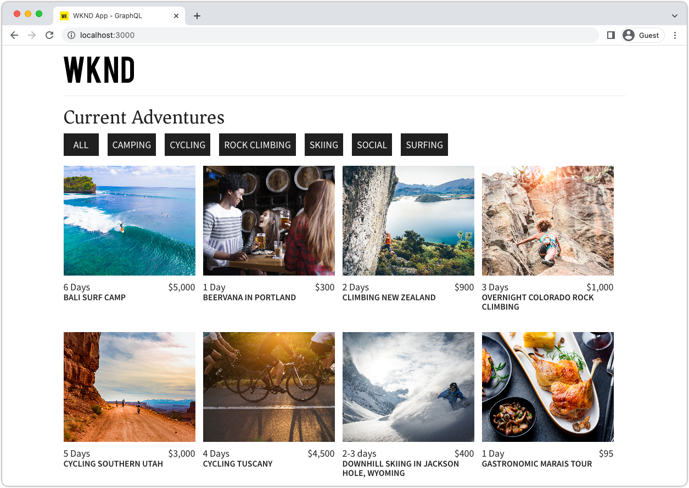
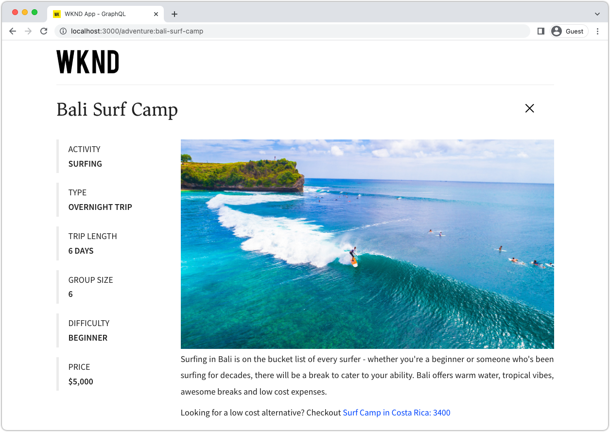

# AEM Headless-Schnelleinrichtung mit dem lokalen AEM SDK {#setup}

Mit der AEM Headless-Schnelleinrichtung erhalten Sie praktische Informationen zu AEM Headless. Sie verwenden dabei Inhalte aus dem WKND-Site-Beispielprojekt und einer Beispiel-React-App (einer SPA), die Inhalte über AEM Headless-GraphQL-APIs bezieht. In diesem Handbuch wird das [AEM as a Cloud Service-SDK](https://experienceleague.adobe.com/docs/experience-manager-cloud-service/content/implementing/developing/aem-as-a-cloud-service-sdk.html?lang=de) verwendet.

## Voraussetzungen {#prerequisites}

Folgende Tools sollten lokal installiert werden:

* [JDK 11](https://experience.adobe.com/#/downloads/content/software-distribution/en/general.html?1_group.propertyvalues.property=.%2Fjcr%3Acontent%2Fmetadata%2Fdc%3AsoftwareType&amp;1_group.propertyvalues.operation=equals&amp;1_group.propertyvalues.0_values=software-type%3Atooling&amp;fulltext=Oracle%7E+JDK%7E+11%7E&amp;orderby=%40jcr%3Acontent%2Fjcr%3AlastModified&amp;orderby.sort=desc&amp;layout=list&amp;p.offset=0&amp;p.limit=14)
* [Node.js v18](https://nodejs.org/de/)
* [Git](https://git-scm.com/)

## 1. Installieren des AEM-SDKs {#aem-sdk}

Dieses Setup verwendet das [AEM as a Cloud Service-SDK](https://experienceleague.adobe.com/docs/experience-manager-cloud-service/implementing/developing/aem-as-a-cloud-service-sdk.html?lang=de#aem-as-a-cloud-service-sdk), um AEM-GraphQL-APIs zu erkunden. Dieser Abschnitt enthält eine kurze Anleitung zum Installieren des AEM-SDKs und dessen Ausführung im Autorenmodus. Eine detailliertere Anleitung zum Einrichten einer lokalen Entwicklungsumgebung [finden Sie hier](https://experienceleague.adobe.com/docs/experience-manager-learn/cloud-service/local-development-environment-set-up/overview.html?lang=de#local-development-environment-set-up).

>[!NOTE]
>
> Es ist auch möglich, dem Tutorial mit einer [AEM as a Cloud Service-Umgebung](./cloud-service.md) zu folgen. Weitere Hinweise zur Verwendung einer Cloud-Umgebung finden Sie im Tutorial.

1. Navigieren Sie zu **[Software Distribution-Portal](https://experience.adobe.com/#/downloads/content/software-distribution/de/aemcloud.html?fulltext=AEM*+SDK*&amp;orderby=%40jcr%3Acontent%2Fjcr%3AlastModified&amp;orderby.sort=desc&amp;layout=list&amp;p.offset=0&amp;p.limit=1)** > **AEM as a Cloud Service** und laden Sie die neueste Version des **AEM-SDKs** herunter.

   

1. Entpacken Sie die heruntergeladene Datei und kopieren Sie die Schnellstart-JAR-Datei (`aem-sdk-quickstart-XXX.jar`) in einen dedizierten Ordner, d. h. `~/aem-sdk/author`.
1. Benennen Sie die JAR-Datei um zu `aem-author-p4502.jar`.

   Der Name `author` gibt an, dass die Schnellstart-JAR-Datei im Autorenmodus gestartet wird. `p4502` spezifiziert den Schnellstart-Vorgang für Port 4502.

1. Um die AEM-Instanz zu installieren und zu starten, öffnen Sie eine Eingabeaufforderung im Ordner, der die JAR-Datei enthält, und führen Sie den folgenden Befehl aus:

   ```shell
   $ cd ~/aem-sdk/author
   $ java -jar aem-author-p4502.jar
   ```

1. Geben Sie ein Administratorpasswort als `admin` an. Jedes Administratorpasswort ist akzeptabel. Es wird jedoch empfohlen, `admin` für die lokale Entwicklung zu verwenden, um eine erneute Konfiguration zu vermeiden.
1. Nach Installation des AEM-Service sollte sich ein neues Browser-Fenster unter [http://localhost:4502](http://localhost:4502) öffnen.
1. Melden Sie sich mit dem Benutzernamen `admin` und dem während des ersten AEM-Starts ausgewählten Passwort (normalerweise `admin`) an.

## 2. Installieren von Beispielinhalten {#install-sample-content}

Beispielinhalte von der **WKND-Referenz-Website** werden verwendet, um während des Tutorials Zeit zu sparen. WKND ist eine fiktive Lifestyle-Marke, die häufig zum AEM-Training verwendet wird.

Die WKND-Website enthält Konfigurationen, die erforderlich sind, um einen [GraphQL-Endpunkt](https://experienceleague.adobe.com/docs/experience-manager-cloud-service/content/headless/graphql-api/content-fragments.html?lang=de) bereitzustellen. Führen Sie in einer realen Implementierung die dokumentierten Schritte aus, um in Ihrem Kundenprojekt [GraphQL-Endpunkte einzuschließen](https://experienceleague.adobe.com/docs/experience-manager-cloud-service/content/headless/graphql-api/content-fragments.html?lang=de). Eine [CORS](#cors-config)-Konfiguration ist ebenfalls in der WKND-Website enthalten. Diese ist erforderlich, damit Zugriff auf eine externe Anwendung gewährleistet ist. Weitere Informationen zu [CORS](#cors-config) finden Sie weiter unten.

1. Laden Sie das neueste kompilierte AEM-Paket für die WKND-Website herunter: [aem-guides-wknd.all-x.x.x.zip](https://github.com/adobe/aem-guides-wknd/releases/latest).

   >[!NOTE]
   >
   > Laden Sie die Standardversion herunter, die mit AEM as a Cloud Service kompatibel ist, und **nicht** die `classic`-Version.

1. Navigieren Sie über das **AEM-Startmenü** zu **Tools** > **Bereitstellung** > **Pakete**.

   

1. Klicken Sie auf **Paket hochladen** und wählen Sie das im vorherigen Schritt heruntergeladene WKND-Paket aus. Klicken Sie auf **Installieren**, um das Paket zu installieren.

1. Navigieren Sie über das **AEM-Startmenü** zu **Assets** > **Dateien** > **WKND Shared** > **Englisch** > **Adventures**.

   

   Dies ist ein Ordner mit allen Assets, die die Adventures der Marke WKND umfassen. Dazu gehören herkömmliche Medientypen wie Bilder und Videos sowie AEM-Medien wie **Inhaltsfragmente**.

1. Klicken Sie auf den Ordner **Skifahren Wyoming** und danach auf die Karte **Inhaltsfragment Skifahren Wyoming**:

   

1. Der Inhaltsfragment-Editor wird für das Adventure „Downhill Skiing Wyoming“ geöffnet.

   

   Beachten Sie, dass verschiedene Felder wie **Titel**, **Beschreibung** und **Aktivität** das Fragment definieren.

   **Inhaltsfragmente** bieten eine von mehreren Möglichkeiten, Inhalte in AEM zu verwalten. Inhaltsfragmente sind wiederverwendbare, darstellungsunabhängige Inhalte, die aus strukturierten Datenelementen wie Text, Rich-Text, Datumsangaben oder Verweisen auf andere Inhaltsfragmente bestehen. Inhaltsfragmente werden später bei der schnellen Einrichtung genauer betrachtet.

1. Klicken Sie auf **Abbrechen**, um das Fragment zu schließen. Sie können auch andere Ordner öffnen und die anderen Adventure-Inhalte durchsuchen.

>[!NOTE]
>
> Informationen zur Verwendung einer Cloud Service-Umgebung finden Sie in der Dokumentation [Bereitstellen einer Code-Basis wie der WKND-Referenz-Site in einer Cloud Service-Umgebung](https://experienceleague.adobe.com/docs/experience-manager-cloud-service/implementing/deploying/overview.html?lang=de#coding-against-the-right-aem-version).

## 3. Herunterladen und Ausführen der WKND-React-App {#sample-app}

Eines der Ziele dieses Tutorials ist es zu zeigen, wie AEM-Inhalte von einer externen Anwendung mithilfe der GraphQL-APIs genutzt werden können. In diesem Tutorial wird eine Beispiel-React-App verwendet. Die React-App ist absichtlich einfach, damit Sie sich auf die Integration mit AEM GraphQL-APIs konzentrieren können.

1. Öffnen Sie eine neue Eingabeaufforderung und klonen Sie die Beispiel-React-App aus GitHub:

   ```shell
   $ git clone git@github.com:adobe/aem-guides-wknd-graphql.git
   $ cd aem-guides-wknd-graphql/react-app
   ```

1. Öffnen Sie die React-App in `aem-guides-wknd-graphql/react-app` in einer beliebigen IDE.
1. Öffnen Sie in der IDE die Datei `.env.development` unter `/.env.development`. Stellen Sie sicher, dass die Zeile `REACT_APP_AUTHORIZATION` nicht kommentiert ist und die Datei die folgenden Variablen deklariert:

   ```plain
   REACT_APP_HOST_URI=http://localhost:4502
   REACT_APP_GRAPHQL_ENDPOINT=/content/graphql/global/endpoint.json
   # Use Authorization when connecting to an AEM Author environment
   REACT_APP_AUTHORIZATION=admin:admin
   ```

   Stellen Sie sicher, dass `REACT_APP_HOST_URI` auf Ihr lokales AEM-SDK verweist. Zur Vereinfachung wird in diesem Schnellstart die React-App mit **AEM Author** verbunden. **Autoren**-Services müssen authentifiziert werden, weshalb die App zur Herstellung der Verbindung die `admin`-Benutzenden verwendet. Die Verbindung einer App mit der AEM-Autoreninstanz ist gängige Praxis bei der Entwicklung, da sie die schnelle Iteration von Inhalten ermöglicht, ohne Änderungen veröffentlichen zu müssen.

   >[!NOTE]
   >
   > In einem Produktionsszenario stellt die App eine Verbindung zu einer **Veröffentlichungsumgebung** von AEM her. Weitere Informationen hierzu finden Sie im Abschnitt _Produktionsbereitstellung_.


1. Installieren und starten Sie die React-App:

   ```shell
   $ cd aem-guides-wknd-graphql/react-app
   $ npm install
   $ npm start
   ```

1. Ein neues Browser-Fenster öffnet die App automatisch auf [http://localhost:3000](http://localhost:3000).

   

   Eine Liste der Adventure-Inhalte von AEM wird angezeigt.

1. Klicken Sie auf eines der Adventure-Bilder, um die Details des Adventures anzuzeigen. Es ergeht eine Anfrage an AEM, Details zu einem Adventure zurückzugeben.

   

1. Verwenden Sie die Entwickler-Tools des Browsers, um die **Netzwerk**-Anfragen zu überprüfen. Zeigen Sie die **XHR**-Anfragen an und beobachten Sie mehrere GET-Anfragen an `/graphql/execute.json/...`. Dieses Pfadpräfix ruft den AEM-Endpunkt der persistierten Abfrage auf, indem die persistierte auszuführende Abfrage anhand des Namens und der dem Präfix folgenden Parameter ausgewählt wird.

   

## 4. Bearbeiten von Inhalten in AEM

Während die React-App ausgeführt wird, aktualisieren Sie den Inhalt in AEM, um zu überprüfen, ob die Änderung in der App übernommen wird.

1. Gehen Sie zu AEM [http://localhost:4502](http://localhost:4502).
1. Gehen Sie zu **Assets** > **Dateien** > **WKND Shared** > **Englisch** > **Adventures** > **[Bali Surfcamp](http://localhost:4502/assets.html/content/dam/wknd-shared/en/adventures/bali-surf-camp)**.

   

1. Klicken Sie auf das Inhaltsfragment **Bali Surf Camp**, um den Inhaltsfragment-Editor zu öffnen.
1. Ändern Sie den **Titel** und die **Beschreibung** des Adventures.

   

1. Klicken Sie auf **Speichern**, um die Änderungen zu speichern.
1. Aktualisieren Sie die React-App unter [http://localhost:3000](http://localhost:3000), um Ihre Änderungen zu sehen:

   

## 5. GraphiQL erkunden {#graphiql}

1. Öffnen Sie [GraphiQL](http://localhost:4502/aem/graphiql.html), indem sie zu **Tools** > **Allgemein** > **GraphQL-Abfrage-Editor** navigieren.
1. Wählen Sie auf der linken Seite vorhandene persistierte Abfragen aus und führen Sie sie aus, um die Ergebnisse anzuzeigen.

   >[!NOTE]
   >
   > Das GraphiQL-Tool und die GraphiQL-API werden [später im Tutorial detaillierter erläutert](../multi-step/explore-graphql-api.md).

## Herzlichen Glückwunsch!{#congratulations}

Herzlichen Glückwunsch! Sie haben jetzt eine externe Anwendung, die AEM-Inhalte mit GraphQL verwendet. Sie können sich gern den Code in der React-App ansehen und mit der Änderung vorhandener Inhaltsfragmente weiter experimentieren.

### Nächste Schritte

* [Starten des AEM Headless-Tutorials](../multi-step/overview.md)
