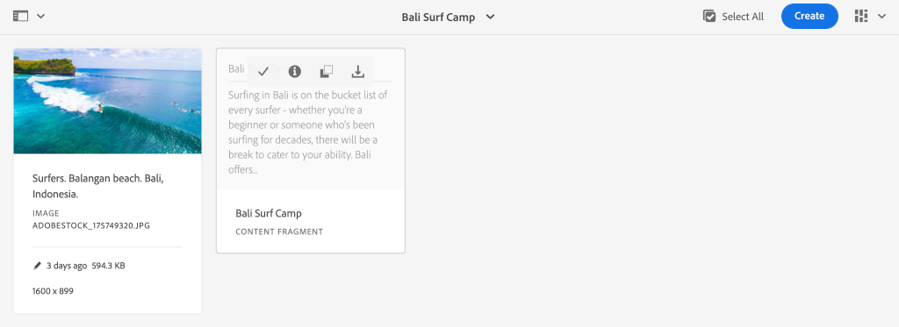

# Quick Setup {#setup}

Dieses Kapitel Angebot eine schnelle Einrichtung einer lokalen Umgebung, um zu sehen, wie eine externe Anwendung Inhalte von AEM mit AEM GraphQL APIs nutzt. Später Kapitel im Tutorial werden aus dieser Einrichtung aufbauen.

## Voraussetzungen {#prerequisites}

Die folgenden Tools sollten lokal installiert werden:

* [JDK 11](https://experience.adobe.com/#/downloads/content/software-distribution/en/general.html?1_group.propertyvalues.property=.%2Fjcr%3Acontent%2Fmetadata%2Fdc%3AsoftwareType&amp;1_group.propertyvalues.operation=equals&amp;1_group.propertyvalues.0_values=software-type%3Atooling&amp;fulltext=Oracle%7E+JDK%7E+11%7E&amp;orderby=%40jcr%3Acontent Fjcr%3AlastModified&amp;orderby.sort=desc&amp;layout=Liste&amp;p.offset=0&amp;p.limit=14)
* [Node.js v10+](https://nodejs.org/en/)
* [npm 6+](https://www.npmjs.com/)
* [Git](https://git-scm.com/)

## Ziele {#objectives}

1. Laden Sie das AEM SDK herunter und installieren Sie es.
1. Laden Sie Beispielinhalte von der WKND-Referenz-Website herunter und installieren Sie sie.
1. Laden Sie eine Beispielanwendung herunter und installieren Sie sie, um Inhalte mit den GraphQL-APIs zu konsumieren.

## AEM SDK {#aem-sdk} installieren

Dieses Lernprogramm verwendet die AEM [als Cloud Service-SDK](https://experienceleague.adobe.com/docs/experience-manager-cloud-service/implementing/developing/aem-as-a-cloud-service-sdk.html?lang=en#aem-as-a-cloud-service-sdk), um AEM GraphQL-APIs zu untersuchen. Dieser Abschnitt enthält eine kurze Anleitung zum Installieren des AEM SDK und zum Ausführen des SDK im Autorenmodus. Eine ausführlichere Anleitung zum Einrichten einer lokalen Entwicklungs-Umgebung [finden Sie hier](https://experienceleague.adobe.com/docs/experience-manager-learn/cloud-service/local-development-environment-set-up/overview.html?lang=de#local-development-environment-set-up).

>[!NOTE]
>
> Es ist auch möglich, dem Tutorial mit einem AEM als Cloud Service-Umgebung folgen. Weitere Hinweise zur Verwendung einer Cloud-Umgebung finden Sie im gesamten Lernprogramm.

1. Navigieren Sie zum **[Software Distribution Portal](https://experience.adobe.com/#/downloads/content/software-distribution/en/aemcloud.html)** > **AEM als Cloud Service** und laden Sie die neueste Version des **AEM SDK** herunter.

   

   >[!CAUTION]
   >
   > Die GraphQL-Funktion ist standardmäßig nur für das AEM SDK von 2021-02-04 oder höher aktiviert.

1. Dekomprimieren Sie den Download und kopieren Sie die Quickstart-JAR-Datei (`aem-sdk-quickstart-XXX.jar`) in einen dedizierten Ordner, z. B. `~/aem-sdk/author`.
1. Benennen Sie die JAR-Datei erneut in `aem-author-p4502.jar`.

   Der Name `author` gibt an, dass die Schnellstartjar im Autorenmodus Beginn wird. Das `p4502` gibt an, dass der Quickstart-Server auf Port 4502 ausgeführt wird.

1. Öffnen Sie ein neues Terminalfenster und navigieren Sie zu dem Ordner, der die JAR-Datei enthält. Führen Sie den folgenden Befehl aus, um die AEM Instanz zu installieren und Beginn:

   ```shell
   $ cd ~/aem-sdk/author
   $ java -jar aem-author-p4502.jar
   ```

1. Geben Sie ein Administratorkennwort als `admin` ein. Jedes Admin-Kennwort ist zulässig. Es wird jedoch empfohlen, den Standard für die lokale Entwicklung zu verwenden, um eine Neukonfiguration zu vermeiden.
1. Nach einigen Minuten wird die Installation der AEM beendet und ein neues Browserfenster sollte unter [http://localhost:4502](http://localhost:4502) geöffnet werden.
1. Melden Sie sich mit dem Benutzernamen `admin` und dem Kennwort `admin` an.

## Beispielinhalt und GraphQL-Endpunkte {#wknd-site-content-endpoints} installieren

Beispielinhalte der **WKND-Referenz-Website** werden installiert, um das Lernprogramm zu beschleunigen. Die WKND ist eine fiktive Marke im Lebensgefühl, die oft in Verbindung mit AEM Training eingesetzt wird.

Die WKND-Referenz-Website enthält Konfigurationen, die zum Bereitstellen eines [GraphQL-Endpunkts](https://experienceleague.adobe.com/docs/experience-manager-cloud-service/assets/admin/graphql-api-content-fragments.html?lang=en#graphql-aem-endpoint) erforderlich sind. Führen Sie in einer realen Implementierung die dokumentierten Schritte aus, um [die GraphQL-Endpunkte](https://experienceleague.adobe.com/docs/experience-manager-cloud-service/assets/admin/graphql-api-content-fragments.html?lang=en#graphql-aem-endpoint) in Ihr Kundenprojekt einzubeziehen. Ein [CORS](#cors-config) wurde ebenfalls als Teil der WKND-Site verpackt. Eine CORS-Konfiguration ist erforderlich, um Zugriff auf eine externe Anwendung zu gewähren. Weitere Informationen zu [CORS](#cors-config) finden Sie unten.

1. Laden Sie das neueste kompilierte AEM-Paket für die WKND-Site herunter: [aem-guides-wknd.all-x.x.x.zip](https://github.com/adobe/aem-guides-wknd/releases/latest).

   >[!NOTE]
   >
   > Laden Sie unbedingt die Standardversion herunter, die mit AEM als Cloud Service kompatibel ist, und **nicht** die `classic`-Version.

1. Navigieren Sie im Menü **AEM Beginn** zu **Tools** > **Bereitstellung** > **Pakete**.

   

1. Klicken Sie auf **Paket hochladen** und wählen Sie das im vorherigen Schritt heruntergeladene WKND-Paket. Klicken Sie auf **Installieren**, um das Paket zu installieren.

1. Navigieren Sie im Menü **AEM Beginn** zu **Assets** > **Dateien**.
1. Klicken Sie durch die Ordner, um zu **WKND-Site** > **Englisch** > **Abenteuer** zu navigieren.

   

   Es handelt sich um einen Ordner mit allen Assets, die die verschiedenen Abenteuer der Marke WKND umfassen. Dazu gehören herkömmliche Medientypen wie Bilder und Videos sowie für AEM spezifische Medien wie **Inhaltsfragmente**.

1. Klicken Sie in den Ordner **Abfahrender Skiing Wyoming** und klicken Sie auf die Karte **Abfahrendes Wyoming Content Fragment**:

   

1. Die Benutzeroberfläche des Inhaltsfragment-Editors wird für das Abenteuer &quot;Skiing Wyoming&quot;geöffnet.

   

   Beachten Sie, dass verschiedene Felder wie **title**, **description** und **Aktivität** das Fragment definieren.

   **Inhaltsfragmente** sind eine der Möglichkeiten, Inhalte in AEM zu verwalten. Inhaltsfragment sind wiederverwendbare, darstellungsunabhängige Inhalte, die aus strukturierten Datenelementen wie Text, Rich-Text, Daten oder Verweisen auf andere Inhaltsfragmente bestehen. Inhaltsfragmente werden später im Lernprogramm genauer untersucht.

1. Klicken Sie auf **Abbrechen**, um das Fragment zu schließen. Sie können in einige der anderen Ordner navigieren und die anderen Adventure-Inhalte erkunden.

>[!NOTE]
>
> Wenn Sie eine Cloud Service-Umgebung verwenden, lesen Sie die Dokumentation, wie [Sie eine Codebasis wie die WKND-Referenz-Website für eine Cloud Service-Umgebung](https://experienceleague.adobe.com/docs/experience-manager-cloud-service/implementing/deploying/overview.html?lang=de#deploying) bereitstellen.

## Beispielanwendung{#sample-app} installieren

Eines der Ziele dieses Lernprogramms ist es, zu zeigen, wie AEM Inhalte einer externen Anwendung mit den GraphQL APIs genutzt werden können. In diesem Lernprogramm wird eine Beispielanwendung &quot;Reaktion&quot;verwendet, die teilweise abgeschlossen wurde, um das Lernprogramm zu beschleunigen. Die gleichen Lektionen und Konzepte gelten für Apps, die mit iOS, Android oder einer anderen Plattform erstellt wurden. Die React-App ist absichtlich einfach, um unnötige Komplexität zu vermeiden. Es ist nicht als Referenzimplementierung gedacht.

1. Öffnen Sie ein neues Terminalfenster und klonen Sie eine Tutorial-Starterverzweigung mit Git:

   ```shell
   $ git clone --branch tutorial/react git@github.com:adobe/aem-guides-wknd-graphql.git
   ```

1. Öffnen Sie in der IDE Ihrer Wahl die Datei `.env.development` unter `aem-guides-wknd-graphql/react-app/.env.development`. Entfernen Sie den Kommentar für die Zeile `REACT_APP_AUTHORIZATION`, sodass die Datei wie folgt aussieht:

   ```plain
   REACT_APP_HOST_URI=http://localhost:4502
   REACT_APP_GRAPHQL_ENDPOINT=/content/graphql/global/endpoint.json
   REACT_APP_AUTHORIZATION=admin:admin
   ```

   Stellen Sie sicher, dass `React_APP_HOST_URI` mit Ihrer lokalen AEM übereinstimmt. In diesem Kapitel verbinden wir die React App direkt mit der AEM **Author** Umgebung. **In** Autorenumgebungen ist standardmäßig eine Authentifizierung erforderlich. Daher stellt unsere App eine Verbindung zum  `admin` Benutzer her. Dies ist eine gängige Praxis bei der Entwicklung, da wir so schnell Änderungen an der AEM Umgebung vornehmen und sie sofort in der App wiedergeben können.

   >[!NOTE]
   >
   > In einem Produktionsszenario stellt die App eine Verbindung zu einer AEM **Publish**-Umgebung her. Dies wird ausführlicher behandelt, später im Tutorial.

1. Navigieren Sie zum Ordner `aem-guides-wknd-graphql/react-app`. Installieren und Beginn der App:

   ```shell
   $ cd aem-guides-wknd-graphql/react-app
   $ npm install
   $ npm start
   ```

1. Ein neues Browserfenster sollte die App automatisch unter [http://localhost:3000](http://localhost:3000) starten.

   

   Eine Liste des aktuellen Adventure-Inhalts von AEM sollte angezeigt werden.

1. Klicken Sie auf eines der Abenteuerbilder, um die Abenteuerdetails Ansicht. Es wird eine Anfrage an AEM gemacht, um die Details für ein Abenteuer zurückzugeben.

   

1. Verwenden Sie die Entwicklerwerkzeuge des Browsers, um die **Network**-Anforderungen zu überprüfen. Ansicht der **XHR**-Anforderungen und Beobachtung mehrerer POST-Anfragen an `/content/graphql/global/endpoint.json`, den für AEM konfigurierten GraphQL-Endpunkt.

   

1. Sie können die Parameter und die JSON-Antwort auch durch Überprüfen der Netzwerkanforderung Ansicht werden. Es kann hilfreich sein, eine Browsererweiterung wie [GraphQL Network](https://chrome.google.com/webstore/detail/graphql-network/igbmhmnkobkjalekgiehijefpkdemocm) für Chrome zu installieren, um ein besseres Verständnis der Abfrage und Antwort zu erhalten.

   

   *Verwenden der Chrome-Erweiterung GraphQL Network*

## Inhaltsfragment ändern

Nachdem die React-App ausgeführt wird, aktualisieren Sie den Inhalt in AEM und sehen Sie die Änderung in der App.

1. Navigieren Sie zu AEM [http://localhost:4502](http://localhost:4502).
1. Navigieren Sie zu **Assets** > **Dateien** > **WKND-Site** > **Englisch** > **Abenteuer** > **[Bali Surf Camp](http://localhost:4502/assets.html/content/dam/wknd/en/adventures/bali-surf-camp).**

   

1. Klicken Sie in das Inhaltsfragment **Bali Surf Camp**, um den Inhaltsfragment-Editor zu öffnen.
1. Ändern Sie die Werte **title** und **description** des Abenteuers

   

1. Klicken Sie auf **Speichern**, um die Änderungen zu speichern.
1. Gehen Sie zurück zur React-App unter [http://localhost:3000](http://localhost:3000) und aktualisieren Sie, um Ihre Änderungen anzuzeigen:

   

## GraphiQL-Tool {#install-graphiql} installieren

[](https://github.com/graphql/graphiql) GraphiQL ist ein Entwicklungstool und wird nur auf Umgebung der unteren Ebene wie einer Entwicklungs- oder einer lokalen Instanz benötigt. Mit der GraphiQL IDE können Sie die zurückgegebenen Abfragen und Daten schnell testen und verfeinern. GraphiQL bietet außerdem einen einfachen Zugriff auf die Dokumentation, sodass Sie leicht erkennen und verstehen können, welche Methoden verfügbar sind.

1. Navigieren Sie zum **[Softwareverteilungsportal](https://experience.adobe.com/#/downloads/content/software-distribution/en/aemcloud.html)** > **AEM als Cloud Service**.
1. Suchen Sie nach &quot;GraphiQL&quot; (stellen Sie sicher, dass Sie **i** in **GraphiQL** einschließen.
1. Laden Sie das neueste **GraphiQL Content Package v.x.x.x** herunter

   

   Die ZIP-Datei ist ein AEM Paket, das direkt installiert werden kann.

1. Navigieren Sie im Menü **AEM Beginn** zu **Tools** > **Bereitstellung** > **Pakete**.
1. Klicken Sie auf **Paket hochladen** und wählen Sie das im vorherigen Schritt heruntergeladene Paket. Klicken Sie auf **Installieren**, um das Paket zu installieren.

   
1. Navigieren Sie zur GraphiQL-IDE unter [http://localhost:4502/content/graphiql.html](http://localhost:4502/content/graphiql.html) und beginnen Sie mit der Erforschung der GraphQL-APIs.

   >[!NOTE]
   >
   > Das GraphiQL-Tool und die GraphQL-API werden später im Tutorial [genauer untersucht.](./explore-graphql-api.md)

## Herzlichen Glückwunsch! {#congratulations}

Herzlichen Glückwunsch, Sie haben jetzt eine externe Anwendung, die AEM Inhalt mit GraphQL konsumiert. Sie können den Code in der React-App überprüfen und mit der Bearbeitung vorhandener Inhaltsfragmente experimentieren.

## Nächste Schritte {#next-steps}

Im nächsten Kapitel [Definieren von Inhaltsfragmentmodellen](content-fragment-models.md) erfahren Sie, wie Sie Inhalte modellieren und ein Schema mit **Inhaltsfragmentmodellen** erstellen. Sie werden vorhandene Modelle überprüfen und ein neues Modell erstellen. Außerdem erfahren Sie mehr über die verschiedenen Datentypen, mit denen ein Schema als Teil des Modells definiert werden kann.

## (Bonus) CORS-Konfiguration {#cors-config}

AEM blockiert standardmäßig sichere Cross-Herkunft-Anforderungen, wodurch verhindert wird, dass nicht autorisierte Anwendungen eine Verbindung zu ihrem Inhalt herstellen und ihn aufdecken.

Damit die React-App dieses Tutorials mit AEM GraphQL API-Endpunkten interagieren kann, wurde im WKND-Site-Referenzprojekt eine Ressourcenfreigabe für mehrere Herkünfte definiert.


Zur Ansicht der bereitgestellten Konfiguration:

1. Navigieren Sie zur Webkonsole AEM SDK unter [http://localhost:4502/system/console](http://localhost:4502/system/console).

   >[!NOTE]
   >
   > Die Web-Konsole ist nur für das SDK verfügbar. In einer AEM als Cloud Service-Umgebung können diese Informationen über [die Developer Console](https://experienceleague.adobe.com/docs/experience-manager-learn/cloud-service/debugging/debugging-aem-as-a-cloud-service/developer-console.html) angezeigt werden.

1. Klicken Sie im oberen Menü auf **OSGI** > **Konfiguration**, um alle [OSGi Konfigurationen](http://localhost:4502/system/console/configMgr) anzuzeigen.
1. Blättern Sie nach unten auf der Seite **Adobe Granite Cross-Herkunft Resource Sharing**.
1. Klicken Sie auf die Konfiguration für `com.adobe.granite.cors.impl.CORSPolicyImpl~wknd-graphql`.
1. Die folgenden Felder wurden aktualisiert:
   * Zulässige Herkünfte (Regex): `http://localhost:.*`
      * Ermöglicht alle lokalen Hostverbindungen.
   * Zulässige Pfade: `/content/graphql/global/endpoint.json`
      * Dies ist der einzige derzeit konfigurierte GraphQL-Endpunkt. Als bewährtes Verfahren sollten die COR-Konfigurationen so restriktiv wie möglich sein.
   * Zulässige Methoden: `GET`, `HEAD`, `POST`
      * Für GraphQL ist nur `POST` erforderlich. Die anderen Methoden können jedoch nützlich sein, wenn AEM auf kopflose Weise interagieren.
   * Unterstützte Kopfzeilen: **Autorisierung** wurde hinzugefügt, um die einfache Authentifizierung auf der Autor-Umgebung zu übergeben.
   * Unterstützt Anmeldeinformationen: `Yes`
      * Dies ist erforderlich, da unsere React-App mit den geschützten GraphQL-Endpunkten im AEM Author-Dienst kommuniziert.

Diese Konfiguration und die GraphQL Endpunkte sind Teil des AEM WKND Projektes. Alle [OSGi Konfigurationen können hier Ansicht werden.](https://github.com/adobe/aem-guides-wknd/tree/master/ui.config/src/main/content/jcr_root/apps/wknd/osgiconfig)
