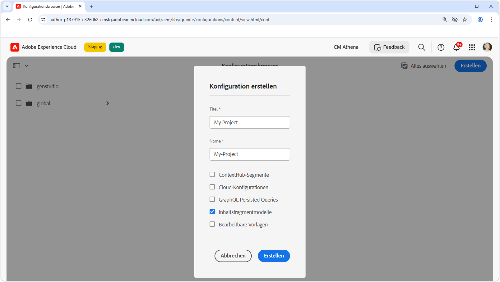
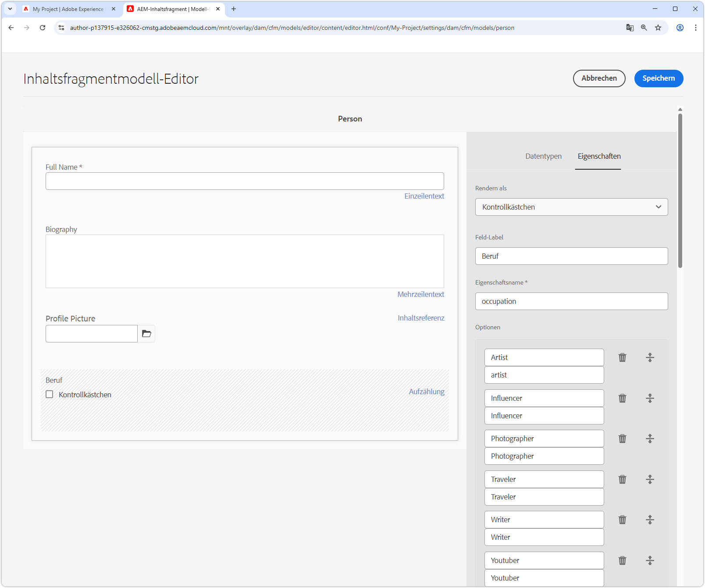
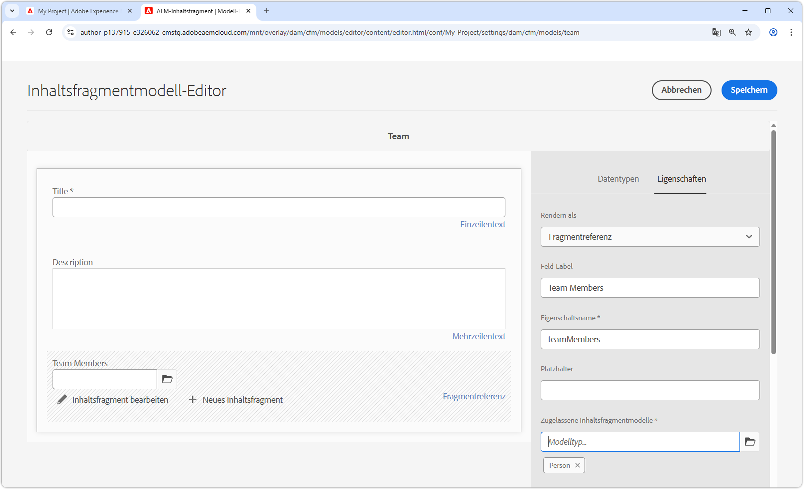
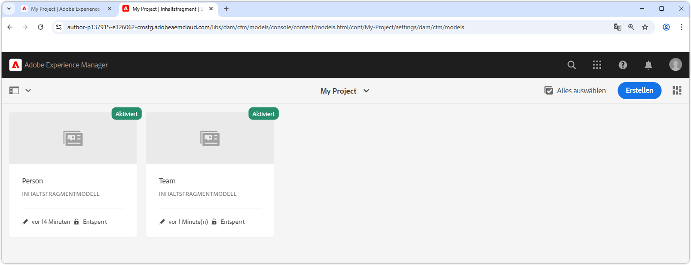

# Erstellen von Inhaltsfragmentmodellen

In diesem Kapitel erfahren Sie, wie Sie Inhalte modellieren und ein Schema mit **Inhaltsfragmentmodellen** erstellen und wie die verschiedenen Datentypen ein Inhaltsfragmentmodell definieren.

In diesem Tutorial erstellen Sie zwei einfache Modelle, **Team** und **Person**. Das Datenmodell **Team** hat einen Namen, einen Kurznamen und eine Beschreibung und verweist auf das Datenmodell **Person**, das den vollständigen Namen, Biodetails, ein Profilbild und eine Liste der Berufe enthält.

## Ziele

* Erstellen eines Inhaltsfragmentmodells.
* Erkunden Sie die verfügbaren Datentypen und Validierungsoptionen zum Erstellen von Modellen.
* Erfahren Sie, wie Inhaltsfragmentmodelle **sowohl** Datenschema als auch die Autorenvorlage für ein Inhaltsfragment definieren.

## Erstellen einer Projektkonfiguration

Eine Projektkonfiguration enthält alle Inhaltsfragmentmodelle, die einem bestimmten Projekt zugeordnet sind, und bietet die Möglichkeit, Modelle zu organisieren. Erstellen Sie mindestens ein Projekt **vor** Erstellen des Inhaltsfragmentmodells.

1. Melden Sie sich bei der AEM **Author**-Umgebung an (z. B. `https://author-p<PROGRAM_ID>-e<ENVIRONMENT_ID>.adobeaemcloud.com/`)
1. Navigieren Sie im AEM-Startbildschirm zu **Tools** > **Allgemein** > **Konfigurations-Browser**.
1. Klicken **in** oberen Aktionsleiste auf „Erstellen“ und geben Sie die folgenden Konfigurationsdetails ein:
   * Titel: **Mein Projekt**
   * Name: **my-project**
   * Inhaltsfragmentmodelle: **aktiviert**

   

1. Wählen **Erstellen**, um die Projektkonfiguration zu erstellen.

## Erstellen von Inhaltsfragmentmodellen

Erstellen Sie als Nächstes Inhaltsfragmentmodelle für ein **Team** und eine **Person**. Diese dienen als Datenmodelle oder Schemata, die ein Team und eine Person repräsentieren, die Teil eines Teams ist, und definieren die Oberfläche für Autoren zum Erstellen und Bearbeiten von Inhaltsfragmenten, die auf diesen Modellen basieren.

### Erstellen des Personen-Inhaltsfragmentmodells

Erstellen Sie ein Inhaltsfragmentmodell für eine **Person** das Datenmodell oder Schema, das eine Person darstellt, die Teil eines Teams ist.

1. Navigieren Sie auf dem AEM-Startbildschirm zu **Tools** > **Allgemein** > **Inhaltsfragmentmodelle**.
1. Navigieren Sie zum Ordner **Mein Projekt**.
1. Wählen **oben rechts** Erstellen“ aus, um den Assistenten **Modell erstellen“**.
1. Erstellen Sie ein Inhaltsfragmentmodell mit den folgenden Eigenschaften:

   * Modelltitel: **person**
   * Modell aktivieren: **aktiviert**

   Wählen Sie **Erstellen**. Wählen Sie im daraufhin angezeigten Dialogfeld die Option **Öffnen** aus, um das Modell zu erstellen.

1. Ziehen Sie ein **Einzelzeilentext**-Element in das Hauptbedienfeld. Geben Sie die folgenden Eigenschaften in der Registerkarte **Eigenschaften** ein:

   * Feldbezeichnung: **Vollständiger Name**
   * Eigenschaftsname: `fullName`
   * Auswahl **Erforderlich**

   Der **Eigenschaftsname** definiert den Namen der Eigenschaft, in der der erstellte Wert in AEM gespeichert wird. Der **Eigenschaftsname** definiert auch den Namen **key** für diese Eigenschaft als Teil des Datenschemas und wird als Schlüssel in der JSON-Antwort verwendet, wenn das Inhaltsfragment über die OpenAPIs von AEM bereitgestellt wird.

1. Wählen Sie die **Datentypen** aus und ziehen per Drag-and-Drop ein **Mehrzeiliger Text**-Feld unter das Feld **Vollständiger Name**. Tragen Sie die folgenden Eigenschaften ein:

   * Feldbezeichnung: **Biografie**
   * Eigenschaftsname: `biographyText`
   * Standardtyp: **Rich-Text**

1. Klicken Sie auf die Registerkarte **Datentypen** und ziehen per Drag &amp; Drop das **Inhaltsreferenz**-Feld hinein. Tragen Sie die folgenden Eigenschaften ein:

   * Feldbezeichnung: **Profilbild**
   * Eigenschaftsname: `profilePicture`
   * Stammverzeichnis: `/content/dam`

     Bei der Konfiguration des **Stammverzeichnisses** können Sie auf das **Ordner**-Symbol klicken, um ein modales Fenster aufzurufen und den Pfad auszuwählen. Dadurch wird eingeschränkt, welche Ordner Autorinnen und Autoren nutzen können, um den Pfad auszufüllen. `/content/dam` ist der Stamm, in dem alle AEM Assets (Bilder, Videos, andere Inhaltsfragmente) gespeichert werden.

   * Nur bestimmte Inhaltstypen akzeptieren: **Bild**

     Fügen Sie eine Validierung zur **Bildreferenz** hinzu, sodass nur Content-Typen von **Bildern** zum Ausfüllen des Felds verwendet werden können.

   * Miniaturansicht anzeigen: **aktiviert**

1. Klicken Sie auf die Registerkarte **Datentypen** und ziehen Sie per Drag &amp; Drop einen **Aufzählungs**-Datentyp unter das Feld **Bildreferenz**. Tragen Sie die folgenden Eigenschaften ein:

   * Rendern als: **Kontrollkästchen**
   * Feldbezeichnung: **Beruf**
   * Eigenschaftsname: `occupation`
   * Optionen:
      * **Künstler**
      * **Influencer**
      * **Fotograf**
      * **Reisender**
      * **Writer**
      * **YouTuber**

   Setzen Sie sowohl die Optionsbeschriftung als auch den Wert auf denselben Wert.

1. Das endgültige **Personen** modell sollte wie folgt aussehen:

   

1. Klicken Sie auf **Speichern**, um die Änderungen zu speichern.

### Erstellen des Team-Inhaltsfragmentmodells

Erstellen Sie ein Inhaltsfragmentmodell für ein **Team**, das das Datenmodell für ein Personenteam ist. Das Team -Modell verweist auf die Personen-Inhaltsfragmente, die die Mitglieder des Teams repräsentieren.

1. Wählen Sie im Ordner **Mein Projekt** in der oberen rechten Ecke **Erstellen**, um den Assistenten **Modell erstellen** aufzurufen.
1. Geben Sie **Feld** Modelltitel **„Team** ein und wählen Sie **Erstellen**.

   Wählen **im** Dialogfeld die Option „Öffnen“ aus, um das neu erstellte Modell zu öffnen.

1. Ziehen Sie ein **Einzelzeilentext**-Element in das Hauptbedienfeld. Geben Sie die folgenden Eigenschaften in der Registerkarte **Eigenschaften** ein:

   * Feldbezeichnung: **title**
   * Eigenschaftsname: `title`
   * Auswahl **Erforderlich**

1. Wählen Sie die **Datentypen** aus und ziehen per Drag-and-Drop ein **Mehrzeiliger Text**-Feld unter das Feld **Kurzname**. Tragen Sie die folgenden Eigenschaften ein:

   * Feldbezeichnung: **description**
   * Eigenschaftsname: `description`
   * Standardtyp: **Rich-Text**

1. Klicken Sie auf die Registerkarte **Datentypen** und legen Sie per Drag-and-Drop ein **Fragmentverweis**-Feld darin ab. Tragen Sie die folgenden Eigenschaften ein:

   * Rendern als: **Mehrere Felder**
   * Mindestanzahl der Elemente: **2**
   * Feldbezeichnung: **Team-Mitglieder**
   * Eigenschaftsname: `teamMembers`
   * Zulässige Inhaltsfragmentmodelle: Wählen Sie über das Ordnersymbol das Modell **Person** aus.

1. Das endgültige **Team** modell sollte wie folgt aussehen:

   

1. Klicken Sie auf **Speichern**, um die Änderungen zu speichern.

1. Sie sollten jetzt zwei Modelle haben, von denen aus Sie arbeiten können:

   

## Herzlichen Glückwunsch!

Herzlichen Glückwunsch, Sie haben gerade Ihre ersten Inhaltsfragmentmodelle erstellt!

## Nächste Schritte

Im nächsten Kapitel, [Erstellen von Inhaltsfragmentmodellen](2-author-content-fragments.md), erstellen und bearbeiten Sie ein neues Inhaltsfragment, das auf einem Inhaltsfragmentmodell basiert. Außerdem erfahren Sie, wie Sie Varianten von Inhaltsfragmenten erstellen.

## Verwandte Dokumentation

* [Inhaltsfragmentmodelle](https://experienceleague.adobe.com/docs/experience-manager-cloud-service/content/assets/content-fragments/content-fragments-models.html?lang=de)

