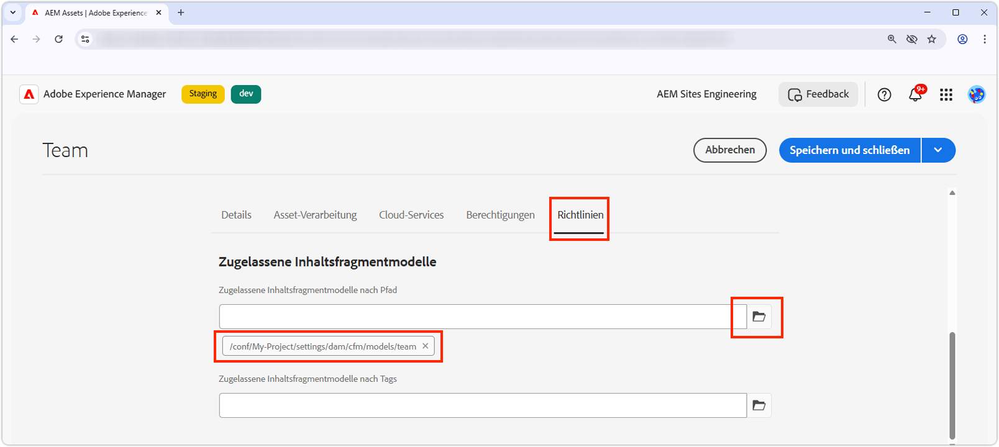
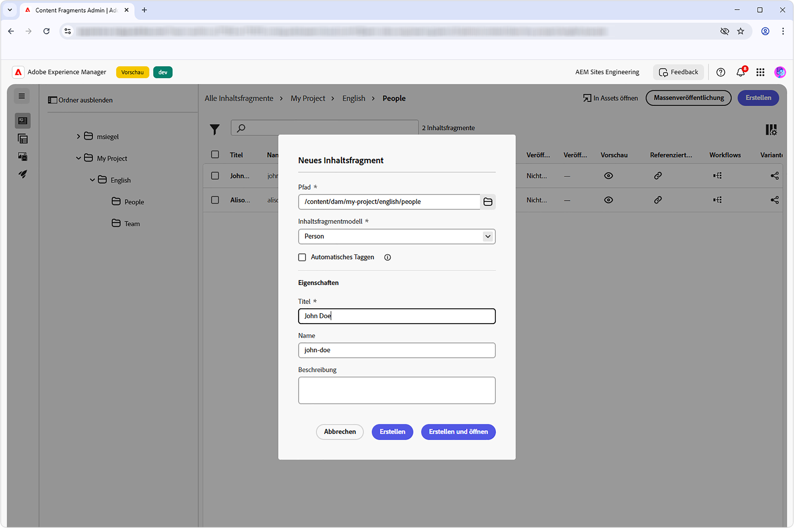
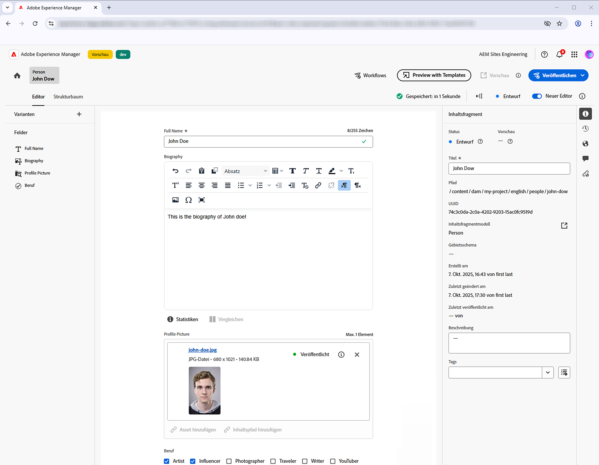
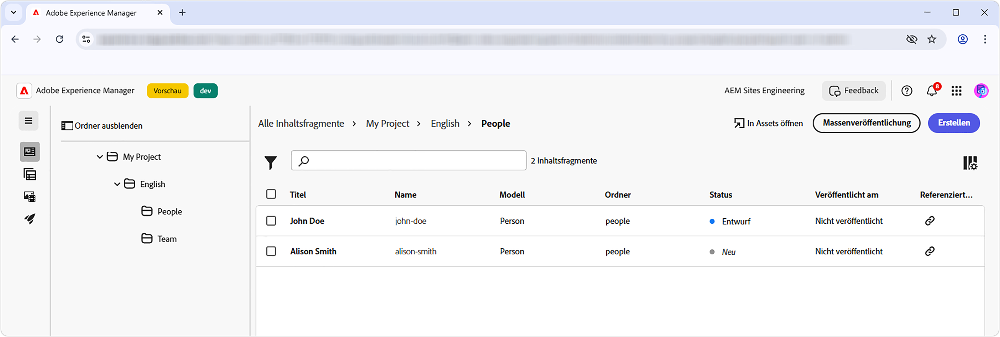
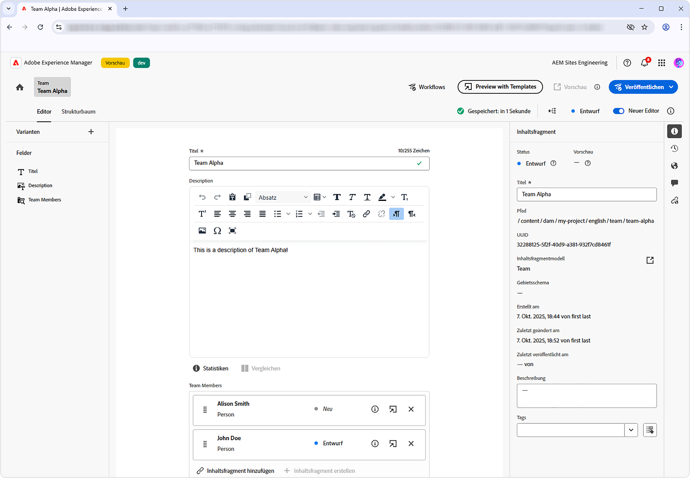
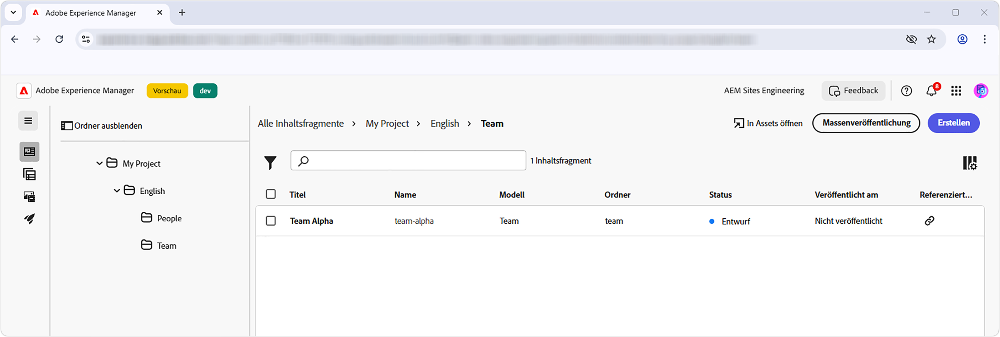
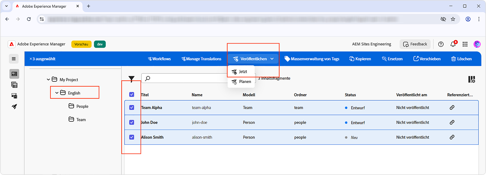
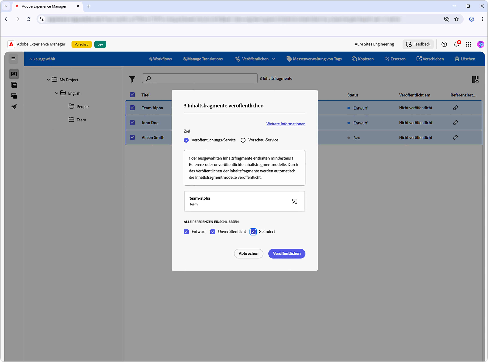

# Erstellen von Inhaltsfragmenten

In diesem Kapitel erstellen und bearbeiten Sie neue Inhaltsfragmente auf der Grundlage der Inhaltsfragmentmodelle [Team und Person](./1-content-fragment-models.md). Diese Inhaltsfragmente sind die Inhalte, die von der React-App unter Verwendung der AEM-Bereitstellung von Inhaltsfragmenten mit OpenAPIs genutzt werden.

## Voraussetzungen

Dies ist ein mehrteiliges Tutorial und es wird davon ausgegangen, dass Sie die Schritte, die in [Definieren von Inhaltsfragmentmodellen](./1-content-fragment-models.md) beschrieben sind, abgeschlossen haben.

## Ziele

* Erstellen Sie ein Inhaltsfragment, das auf einem Inhaltsfragmentmodell basiert.
* Erstellen Sie ein Inhaltsfragment.
* Veröffentlichen Sie ein Inhaltsfragment.

## Erstellen von Asset-Ordnern für Inhaltsfragmente

Inhaltsfragmente werden in AEM Assets in Ordnern gespeichert. Um Inhaltsfragmente aus den im vorherigen Kapitel erstellten Inhaltsfragmentmodellen zu erstellen, muss ein Ordner vorhanden sein, in dem sie gespeichert werden. Für den Ordner ist eine Konfiguration erforderlich, um die Erstellung von Inhaltsfragmenten aus bestimmten Inhaltsfragmentmodellen zu ermöglichen.

AEM unterstützt eine „flache“ Ordnerorganisation, d. h. Inhaltsfragmente verschiedener Inhaltsfragmentmodelle werden in einem Ordner zusammengeführt. In diesem Tutorial wird jedoch eine Ordnerstruktur, die sich an den Inhaltsfragmentmodellen ausrichtet, teilweise verwendet, um die API **Alle Inhaltsfragmente nach Ordner auflisten** im [nächsten Kapitel ](./3-explore-openapis.md). Berücksichtigen Sie bei der Bestimmung Ihrer Inhaltsfragmentorganisation sowohl, wie Sie Ihre Inhaltsfragmente erstellen und verwalten möchten, als auch, wie Sie sie über die Bereitstellung von AEM-Inhaltsfragmenten mit OpenAPIs bereitstellen und nutzen können.

1. Navigieren Sie im AEM-Start-Bildschirm zu **Assets** > **Dateien**.
1. Wählen **oben rechts** Erstellen“ aus und klicken Sie auf **Ordner**. Geben Sie ein:

   * Titel: **Mein Projekt**
   * Name: **my-project**

   Wählen Sie **Erstellen**, um den Ordner zu erstellen.

1. Öffnen Sie den neuen Ordner **Mein Projekt** und erstellen Sie einen Unterordner unter dem neuen Ordner **Mein Projekt** mit den folgenden Werten:

   * Titel: **Englisch**
   * Name: **en**

   Ein Sprachstamm-Ordner wird erstellt, um das Projekt so zu positionieren, dass es die nativen Lokalisierungsfunktionen von AEM unterstützt. Eine Best Practice ist es, Projekte für mehrsprachigen Support einzurichten, auch wenn Sie heutzutage keine Lokalisierung benötigen. Weitere Informationen finden Sie auf [der folgenden Dokumentseite](https://experienceleague.adobe.com/docs/experience-manager-cloud-service/content/assets/admin/translate-assets.html?lang=de).

1. Erstellen Sie zwei Unterordner unter dem neuen Ordner **Mein Projekt > Englisch** mit den folgenden Werten:

   Ein `teams` Ordner, der die Inhaltsfragmente **Team** enthält

   * Titel: **Teams**
   * Name: **teams**

   … und einen `people` Ordner, der die Inhaltsfragmente **Person** enthält.

   * Titel: **Personen**
   * Name: **people**

1. Navigieren Sie zurück zum Ordner **Mein Projekt > Englisch** und stellen Sie sicher, dass die beiden neuen Ordner erstellt werden.
1. Wählen Sie den Ordner **Teams** und wählen Sie **Eigenschaften** in der oberen Aktionsleiste aus.
1. Wählen Sie die **Richtlinien** aus und deaktivieren Sie **Von`/content/dam/my-project`** übernommen.
1. Wählen Sie auf **Registerkarte** das Inhaltsfragmentmodell **Team** im Feld **Zulässige Inhaltsfragmentmodelle nach Pfad** aus.

   

   Diese Richtlinien werden automatisch von Unterordnern übernommen, können jedoch überschrieben werden. Inhaltsfragmentmodelle können nach Tags zulässig sein oder Inhaltsfragmentmodelle aus anderen Projektkonfigurationen aktivieren. Dieser Mechanismus bietet eine leistungsstarke Möglichkeit, Ihre Inhaltshierarchie zu verwalten.

1. Klicken Sie **Speichern und schließen**, um die Änderungen an den Ordnereigenschaften zu speichern.
1. Aktualisieren Sie **Richtlinien** für den **Personen**-Ordner auf dieselbe Weise, wählen Sie jedoch stattdessen das **Person**-Inhaltsfragmentmodell aus.

## Personen-Inhaltsfragment erstellen

Erstellen Sie Inhaltsfragmente auf der Grundlage **Inhaltsfragmentmodells „Person** im Ordner **Mein Projekt > Englisch > Personen**.

1. Wählen Sie auf dem AEM-Startbildschirm die Option **Inhaltsfragmente** aus, um die Inhaltsfragmentkonsole zu öffnen.
1. Klicken Sie auf **Ordner anzeigen**, um den Ordnerbrowser zu öffnen.
1. Wählen Sie den Ordner **Mein Projekt > Englisch > Personen** aus.
1. Wählen Sie **Erstellen > Inhaltsfragment** und geben Sie die folgenden Werte ein:

   * Speicherort: `/content/dam/my-project/en/people`
   * Inhaltsfragmentmodell: **Person**
   * Titel: **Martin Müller**
   * Name: `john-doe`

   Denken Sie daran **dass die Felder Titel**, **Name** und **Beschreibung** im Dialogfeld **Neues Inhaltsfragment** als Metadaten zum Inhaltsfragment gespeichert werden und nicht als Teil der Daten des Inhaltsfragments.

   

1. Wählen Sie **Erstellen und öffnen** aus.
1. Füllen Sie die Felder für das Fragment **Martin Müller** aus:

   * Vollständiger Name: **John Doe**
   * Biografie: **John Doe liebt soziale Medien und einen Reiselustigen.**
   * Profilbild: Wählen Sie ein Bild aus `/content/dam` oder laden Sie ein neues hoch.
   * Beruf: **Influencer**, **Traveller**

   Diese Felder und Werte definieren den Inhalt des Inhaltsfragments, der über die Bereitstellung von AEM-Inhaltsfragmenten mit OpenAPIs genutzt wird.

   

1. Änderungen an Inhaltsfragmenten werden automatisch gespeichert, sodass keine Schaltfläche **Speichern** vorhanden ist.
1. Kehren Sie zur Inhaltsfragmentkonsole zurück und wählen Sie **Mein Projekt > Englisch > Person**, um Ihr neues Inhaltsfragment anzuzeigen.

### Erstellen zusätzlicher Personen-Inhaltsfragmente

Wiederholen Sie die obigen Schritte, um zusätzliche **Person**-Fragmente zu erstellen.

1. Erstellen Sie ein Personen-Inhaltsfragment für **Alina Schmidt** mit den folgenden Eigenschaften:

   * Speicherort: `/content/dam/my-project/en/people`
   * Inhaltsfragmentmodell: **Person**
   * Titel: **Alina Schmidt**
   * Name: `alison-smith`

   Wählen Sie **Erstellen und öffnen** und verfassen Sie die folgenden Werte:

   * Vollständiger Name: **Alina Schmidt**
   * Biografie: **Alison ist Fotografin und liebt es, über ihre Reisen zu schreiben.**
   * Profilbild: Wählen Sie ein Bild aus `/content/dam` oder laden Sie ein neues hoch.
   * Beruf: **Fotograf**, **Reisender**, **Autor**.

Sie sollten jetzt zwei Inhaltsfragmente im Ordner **Mein Projekt > Englisch > Personen** haben:

Sie können optional einige weitere Personen-Inhaltsfragmente erstellen, um weitere Personen darzustellen.

## Team-Inhaltsfragment erstellen

Erstellen Sie mit demselben Ansatz ein Fragment **Team** basierend auf dem Inhaltsfragmentmodell **Team** im Ordner **Mein Projekt > Englisch > Teams**.

1. Erstellen Sie ein **Team**-Fragment, das **Team Alpha** mit den folgenden Eigenschaften darstellt:

   * Speicherort: `/content/dam/my-project/en`
   * Inhaltsfragmentmodell: **Team**
   * Titel: **Team Alpha**
   * Name: `team-alpha`

   Wählen Sie **Erstellen und öffnen** und verfassen Sie die folgenden Werte:

   * Titel: **Team Alpha**
   * Beschreibung: **Team Alpha ist ein Reise-Content-Team, das sich auf Fotografie und Reiseschreiben spezialisiert hat.**
   * **Teammitglieder**: Wählen Sie die Inhaltsfragmente **Martin Müller** und **Alina Schmidt** aus, um das Feld **Teammitglieder** auszufüllen.

   

1. Wählen Sie **Erstellen und öffnen** um das Team-Inhaltsfragment zu erstellen
1. Es sollte ein Inhaltsfragment unter &quot;**Projekt > Englisch > Team“** sein:

Sie sollten jetzt über ein Inhaltsfragment **Team Alpha** im Ordner **Mein Projekt > Englisch > Teams** verfügen:

Erstellen Sie optional ein **Team Omega** mit einer anderen Personengruppe.

## Veröffentlichen von Inhaltsfragmenten

Um Inhaltsfragmente über OpenAPIs verfügbar zu machen, veröffentlichen Sie sie. Die Veröffentlichung ermöglicht den Zugriff auf die Inhaltsfragmente über:

* **Veröffentlichungs-Service** stellt Inhalte für Produktionsanwendungen bereit.
* **Vorschau-Service** stellt Inhalte für die Vorschau von Programmen bereit.

Normalerweise werden Inhalte zuerst im **Vorschau-Service** veröffentlicht und in einem Vorschau-Programm überprüft, bevor sie im **Veröffentlichungs-Service)** werden. Das Veröffentlichen im **Veröffentlichungs-Service** erfolgt nicht auch im **Vorschau-Service**. Sie müssen separat im **Vorschau-Service** veröffentlichen.

In diesem Tutorial veröffentlichen wir im AEM-Veröffentlichungs-Service. Die Verwendung des AEM-Vorschau-Service ist jedoch so einfach wie das Ändern der URL des [AEM-Service in der React-App](./4-react-app.md)

1. Suchen Sie in der Inhaltsfragmentkonsole den Ordner **Mein Projekt > Englisch**.
1. Wählen Sie alle Inhaltsfragmente im Ordner **Englisch** aus, der alle Inhaltsfragmente in allen Unterordnern anzeigt, und wählen Sie **Veröffentlichen > Jetzt** aus der oberen Aktionsleiste.

   

1. Wählen Sie den **Veröffentlichungs-** unter **Alle Verweise einschließen** die Optionen **Veröffentlichung aufgehoben** und **Geändert** und **Veröffentlichen** aus.

   

Jetzt werden die Inhaltsfragmente und alle personenbezogenen Inhaltsfragmente, auf die das Team-Inhaltsfragment verweist, sowie alle referenzierten Assets im **Veröffentlichungs-Service** veröffentlicht.

Sie können auf die gleiche Weise **den** Vorschau-Service“ veröffentlichen.

## Herzlichen Glückwunsch!

Herzlichen Glückwunsch! Sie haben erfolgreich Inhaltsfragmente auf der Grundlage von Inhaltsfragmentmodellen in AEM erstellt. Sie haben ein **Person**-Inhaltsfragmentmodell erstellt, mehrere **Person**-Inhaltsfragmente erstellt und ein **Team**-Inhaltsfragment erstellt, das auf mehrere **Person**-Inhaltsfragmente verweist.

Nach der Veröffentlichung der Inhaltsfragmente können Sie jetzt über die AEM-Bereitstellung von Inhaltsfragmenten mit OpenAPIs darauf zugreifen.

## Nächste Schritte

Im nächsten Kapitel [Erkunden von OpenAPIs](3-explore-openapis.md) werden Sie die Bereitstellung von AEM-Inhaltsfragmenten mit OpenAPIs mithilfe der in der API **Dokumentation integrierten** „Try It“ erkunden.

