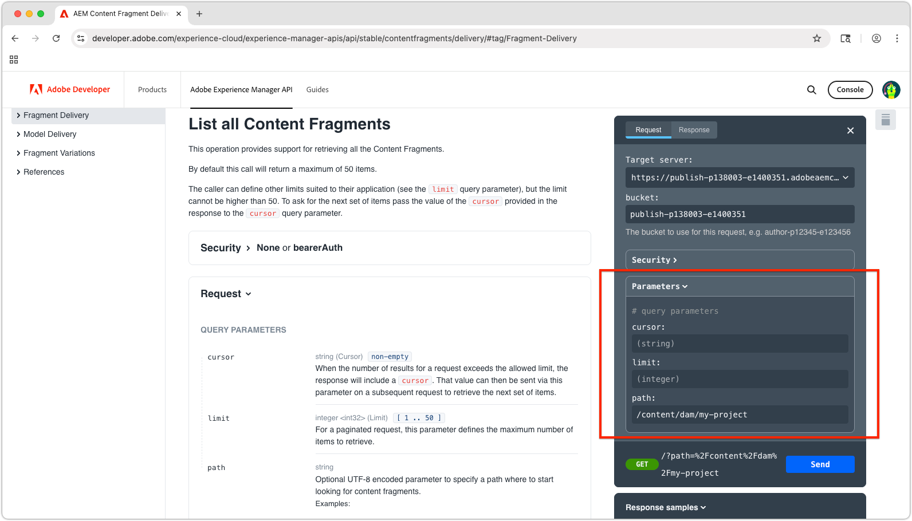

# Erkunden der AEM OpenAPI-basierten APIs zur Bereitstellung von Inhaltsfragmenten

Die [Bereitstellung von AEM-Inhaltsfragmenten mit APIs von OpenAPI](https://developer.adobe.com/experience-cloud/experience-manager-apis/api/stable/contentfragments/delivery/) in AEM bietet eine leistungsstarke Möglichkeit, strukturierte Inhalte für jede Anwendung oder jeden Kanal bereitzustellen. In diesem Kapitel erkunden wir, wie Sie mit den OpenAPIs Inhaltsfragmente über die Funktion **Ausprobieren** der Dokumentation abrufen können.

## Voraussetzungen {#prerequisites}

Dies ist ein mehrteiliges Tutorial. Es wird vorausgesetzt, dass die unter [Erstellen von Inhaltsfragmenten](./2-author-content-fragments.md) beschriebenen Schritte abgeschlossen sind.

Stellen Sie sicher, dass Folgendes verfügbar ist:

* Der Host-Name des AEM-Veröffentlichungs-Service (z. B. `https://publish-<PROGRAM_ID>-e<ENVIRONMENT_ID >.adobeaemcloud.com/`) zur [Veröffentlichung der Inhaltsfragmente](./2-author-content-fragments.md#publish-content-fragments). Wenn Sie einen AEM-Vorschau-Service verwenden, stellen Sie sicher, dass dieser Host-Name verfügbar ist (z. B. `https://preview-<PROGRAM_ID>-e<ENVIRONMENT_ID>.adobeaemcloud.com/`).

## Ziele {#objectives}

* Machen Sie sich mit der Bereitstellung von [AEM-Inhaltsfragmenten mit OpenAPIs vertraut](https://developer.adobe.com/experience-cloud/experience-manager-apis/api/stable/contentfragments/delivery/).
* Rufen Sie die APIs mithilfe der Funktion **Ausprobieren** in der API-Dokumentation auf.

## Bereitstellungs-APIs

Die Bereitstellung von AEM-Inhaltsfragmenten mit OpenAPIs bietet eine RESTful-Schnittstelle zum Abrufen von Inhaltsfragmenten. Die in diesem Tutorial behandelten APIs sind nur für die Veröffentlichungs- und Vorschau-Services von AEM verfügbar, nicht für den Autoren-Service. Es gibt andere OpenAPIs für die [Interaktion mit Inhaltsfragmenten im AEM-Autoren-Service](https://developer.adobe.com/experience-cloud/experience-manager-apis/api/stable/sites/).

## Erkunden der APIs

[Die Dokumentation zur Bereitstellung von AEM-Inhaltsfragmenten mit OpenAPIs](https://developer.adobe.com/experience-cloud/experience-manager-apis/api/stable/contentfragments/delivery/) verfügt über eine Funktion „Ausprobieren“, mit der Sie die APIs erkunden und direkt im Browser testen können. Dies ist eine hervorragende Möglichkeit, sich mit den API-Endpunkten und ihren Funktionen vertraut zu machen.

Öffnen Sie die [AEM Sites-API-Dokumentation](https://developer.adobe.com/experience-cloud/experience-manager-apis/api/stable/contentfragments/delivery/) in Ihrem Browser.

Die APIs werden im linken Navigationsbereich im Abschnitt **Bereitstellen von Fragmenten** aufgeführt. Sie können diesen Abschnitt erweitern, um die verfügbaren APIs anzuzeigen. Wenn Sie eine API auswählen, werden im Haupt-Panel die API-Details und in der rechten Leiste ein Abschnitt **Ausprobieren** angezeigt, in dem Sie die API direkt im Browser testen und erkunden können.


## Auflisten von Inhaltsfragmenten

1. Öffnen Sie die [Entwicklerdokumentation zur Bereitstellung von AEM-Inhaltsfragmenten mit OpenAPI](https://developer.adobe.com/experience-cloud/experience-manager-apis/api/stable/contentfragments/delivery/) in Ihrem Browser.
1. Erweitern Sie in der linken Navigation den Abschnitt **Bereitstellen von Fragmenten** und wählen Sie die API **Alle Inhaltsfragmente auflisten** aus

Mit dieser API können Sie eine paginierte Liste aller Inhaltsfragmente aus AEM nach Ordner abrufen. Die einfachste Möglichkeit, diese API zu verwenden, besteht darin, den Pfad zum Ordner mit den Inhaltsfragmenten anzugeben.

1. Wählen Sie oben in der rechten Leiste **Ausprobieren** aus.
1. Geben Sie die ID des AEM-Service ein, mit dem sich die API zum Abrufen der Inhaltsfragmente verbinden soll. Der Bucket ist der erste Teil der URL des AEM-Veröffentlichungs- (oder Vorschau-) Service, in der Regel im folgenden Format: `publish-p<PROGRAM_ID>-e<ENVIRONMENT_ID>` oder `preview-p<PROGRAM_ID>-e<ENVIRONMENT_ID>`.

Da wir den AEM-Veröffentlichungs-Service verwenden, setzen Sie den Bucket auf die ID des AEM-Veröffentlichungs-Service. Beispiel:

* **bucket**: `publish-p138003-e1400351`


Wenn der Bucket festgelegt ist, wird das Feld **Ziel-Server** automatisch auf die vollständige API-URL des AEM-Veröffentlichungs-Service aktualisiert, z. B.: `https://publish-p138003-e1400351.adobeaemcloud.com/adobe/contentFragments`

1. Erweitern Sie den Abschnitt **Sicherheit** und setzen Sie **Sicherheitsschema** auf **Ohne**. Der AEM-Veröffentlichungs- (und Vorschau-) Service erfordert keine Authentifizierung für die Bereitstellung von AEM-Inhaltsfragmenten mit APIs von OpenAPI.

1. Erweitern Sie den Abschnitt **Parameter**, um die Details des abzurufenden Inhaltsfragments anzugeben.

* **cursor**: Lassen Sie dieses Feld leer. Es wird für die Paginierung verwendet und dies ist eine erste Anfrage.
* **limit**: Lassen Sie das Feld leer, um die Anzahl der pro Ergebnisseite zurückgegebenen Ergebnisse zu begrenzen.
* **path**: `/content/dam/my-project/en`

  >[!TIP]
  > Stellen Sie bei der Eingabe eines Pfads sicher, dass das Präfix `/content/dam/` ist und er **nicht** mit einem Schrägstrich `/` endet.

  

1. Wählen Sie die Schaltfläche **Senden**, um den API-Aufruf auszuführen.
1. Auf der Registerkarte **Antwort** im Panel **Ausprobieren** sollte eine JSON-Antwort mit einer Liste von Inhaltsfragmenten im angegebenen Ordner angezeigt werden. Die Seite sieht dann ähnlich wie die folgende aus:

   

1. Die Antwort enthält alle Inhaltsfragmente im Ordner `/content/dam/my-project` des `path`-Parameters, einschließlich Unterordnern, einschließlich der Inhaltsfragmente **Person** und **Team**.
1. Klicken Sie durch das `items`-Array und suchen Sie nach dem Wert `id` des Elements `Team Alpha`. Die ID wird im nächsten Abschnitt zum Abrufen der Details eines einzelnen Inhaltsfragments verwendet.
1. Wählen Sie **Anfrage bearbeiten** im oberen Bereich des Panels **Ausprobieren** und die verschiedenen Parameter im API-Aufruf aus, um zu sehen, wie sich die Antwort ändert. Sie können beispielsweise den Pfad in einen anderen Ordner ändern, der Inhaltsfragmente enthält, oder Abfrageparameter hinzufügen, um die Ergebnisse zu filtern. Ändern Sie beispielsweise den Parameter `path` zu `/content/dam/my-project/teams`, um die Inhaltsfragmente auf diesen Ordner (und die Unterordner) einzuschränken.

## Abrufen von Inhaltsfragmentdetails

Ähnlich wie die API **Alle Inhaltsfragmente auflisten** ruft die API **Inhaltsfragment abrufen** ein einzelnes Inhaltsfragment nach seiner ID sowie alle optionalen Verweise ab. Um diese API zu erkunden, fordern wir das Team-Inhaltsfragment an, das auf mehrere Personen-Inhaltsfragmente verweist.

1. Erweitern Sie den Abschnitt **Fragmentbereitstellung** in der linken Leiste und wählen Sie die API **Inhaltsfragment abrufen** aus.
1. Wählen Sie oben in der rechten Leiste **Ausprobieren** aus.
1. Überprüfen Sie, ob der `bucket` auf Ihren AEM as a Cloud Service-Veröffentlichungs- oder Vorschau-Service verweist.
1. Erweitern Sie den Abschnitt **Sicherheit** und stellen Sie **Sicherheitsschema** auf **Ohne** ein. Der AEM-Veröffentlichungs-Service erfordert keine Authentifizierung für die Bereitstellung von AEM-Inhaltsfragmenten mit APIs von OpenAPI.
1. Erweitern Sie den Abschnitt **Parameter**, um die Details des Inhaltsfragments anzugeben, das abgerufen werden soll:

Verwenden Sie in diesem Beispiel die ID des im vorherigen Abschnitt abgerufenen Team-Inhaltsfragments. Verwenden Sie beispielsweise für diese Inhaltsfragmentantwort in **Alle Inhaltsfragmente auflisten** den Wert im Feld `id` von `b954923a-0368-4fa2-93ea-2845f599f512`. (Ihre `id` unterscheidet sich von dem im Tutorial verwendeten Wert.)

```json
{
    "path": "/content/dam/my-project/teams/team-alpha",
    "name": "",
    "title": "Team Alpha",
    "id": "50f28a14-fec7-4783-a18f-2ce2dc017f55", // This is the Content Fragment ID
    "description": "",
    "model": {},
    "fields": {} 
}
```

* **fragmentId**: `50f28a14-fec7-4783-a18f-2ce2dc017f55`
* **references**: `none`
* **depth**: Lassen Sie dieses Feld leer. Der Parameter **references** bestimmt die Tiefe der referenzierten Fragmente.
* **hydrated**: Lassen Sie dieses Feld leer. Der Parameter **references** bestimmt die Hydratation der referenzierten Fragmente.
* **If-None-Match**: Leer lassen

1. Wählen Sie die Schaltfläche **Senden**, um den API-Aufruf auszuführen.
1. Überprüfen Sie die Antwort auf der Registerkarte **Antwort** im Panel **Ausprobieren**. Es sollte eine JSON-Antwort mit den Details des Inhaltsfragments angezeigt werden, einschließlich seiner Eigenschaften und aller Verweise.
1. Wählen Sie **Anfrage bearbeiten** oben im Panel **Ausprobieren** aus und ändern Sie im Abschnitt **Parameter** den Parameter `references` in `all-hydrated`, damit der gesamte Inhalt des referenzierten Inhaltsfragments in den API-Aufruf aufgenommen wird.

   * **fragmentId**: `50f28a14-fec7-4783-a18f-2ce2dc017f55`
   * **references**: `all-hydrated`
   * **depth**: Lassen Sie dieses Feld leer. Der Parameter **references** bestimmt die Tiefe der referenzierten Fragmente.
   * **hydrated**: Lassen Sie dieses Feld leer. Der Parameter **references** bestimmt die Hydratation der referenzierten Fragmente.
   * **If-None-Match**: Leer lassen

1. Klicken Sie auf die Schaltfläche **Erneut senden**, um den API-Aufruf erneut auszuführen.
1. Überprüfen Sie die Antwort auf der Registerkarte **Antwort** im Panel **Ausprobieren**. Es sollte eine JSON-Antwort mit den Details des Inhaltsfragments angezeigt werden, einschließlich seiner Eigenschaften und der Eigenschaften der referenzierten Personen-Inhaltsfragmente.

Beachten Sie, dass das `teamMembers`-Array jetzt die Details der referenzierten personenbezogenen Inhaltsfragmente enthält. Die Hydratisierung der Verweise ermöglicht es Ihnen, alle erforderlichen Daten in einem einzigen API-Aufruf abzurufen, was besonders nützlich ist, um die Anzahl der von Client-Anwendungen gestellten Anfragen zu reduzieren.

## Herzlichen Glückwunsch!

Herzlichen Glückwunsch! Sie haben mehrere AEM-Inhaltsfragmentbereitstellungen mit API-Aufrufen von OpenAPI erstellt und ausgeführt, indem Sie die Funktion **Ausprobieren** der AEM-Dokumentation verwendet haben.

## Nächste Schritte

Im nächsten Kapitel [Erstellen einer React-App](./4-react-app.md) erfahren Sie, wie eine externe Anwendung mit der Bereitstellung von AEM-Inhaltsfragmenten mit APIs von OpenAPI interagieren kann.
