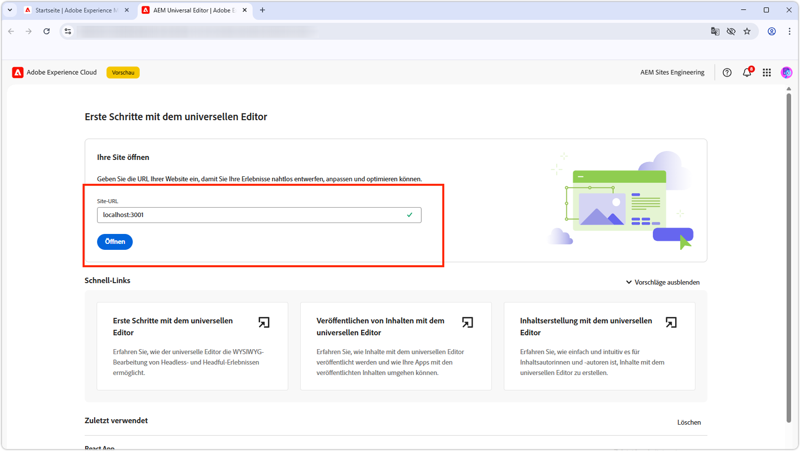

# Bearbeiten der React-App mit dem universellen Editor

In diesem Kapitel erfahren Sie, wie Sie die im vorherigen [ erstellte React-App mit ](./4-react-app.md) universellen Editor von AEM bearbeitbar machen. Mit dem universellen Editor können Inhaltsautorinnen und -autoren Inhalte direkt im Kontext des React-App-Erlebnisses bearbeiten, während das nahtlose Erlebnis einer Headless-Anwendung erhalten bleibt.


Der universelle Editor bietet eine leistungsstarke Möglichkeit, die kontextbezogene Bearbeitung für jede Web-Anwendung zu aktivieren, sodass Autoren Inhalte bearbeiten können, ohne zwischen verschiedenen Authoring-Oberflächen zu wechseln.

## Voraussetzungen

* Die vorherigen Schritte dieses Tutorials wurden abgeschlossen, insbesondere [Erstellen einer React-App, die die OpenAPIs zur Bereitstellung von Inhaltsfragmenten in AEM verwendet](./4-react-app.md)
* Ein praktisches Wissen über [Verwendung und Implementierung des universellen Editors](https://experienceleague.adobe.com/de/docs/experience-manager-cloud-service/content/implementing/developing/universal-editor/introduction).

## Ziele

Erfahren Sie mehr über:

* Fügen Sie der React-App universelle Editor-Instrumentierung hinzu.
* Konfigurieren der React-App für den universellen Editor.
* Aktivieren der Inhaltsbearbeitung direkt in der React-App-Oberfläche mit dem universellen Editor.

## Instrumentierung des universellen Editors

Der universelle Editor erfordert [HTML-Attribute und Meta-](https://experienceleague.adobe.com/de/docs/experience-manager-cloud-service/content/implementing/developing/universal-editor/attributes-types), um bearbeitbare Inhalte zu identifizieren und die Verbindung zwischen der Benutzeroberfläche und AEM-Inhalten herzustellen.

### Hinzufügen universeller Editor-Tags

Fügen Sie zunächst die erforderlichen Meta-Tags hinzu, um die React-App als mit dem universellen Editor kompatibel zu identifizieren.

1. Öffnen Sie `public/index.html` in Ihrer React-App.
1. Fügen Sie [ Abschnitt &quot;](https://experienceleague.adobe.com/de/docs/experience-manager-cloud-service/content/implementing/developing/universal-editor/getting-started)&quot; der React-App die Meta`<head>`Tags und das CORS-Skript des universellen Editors hinzu:

   ```html
   <!DOCTYPE html>
   <html lang="en">
   <head>
       <meta charset="utf-8" />
       <link rel="icon" href="%PUBLIC_URL%/favicon.ico" />
       <meta name="viewport" content="width=device-width, initial-scale=1" />
       <meta name="theme-color" content="#000000" />
       <meta name="description" content="WKND Teams React App" />
   
       <!-- Universal Editor meta tags and CORS script -->
       <meta name="urn:adobe:aue:system:aemconnection" content="aem:%REACT_APP_AEM_AUTHOR_HOST_URI%" />
       <script src="https://universal-editor-service.adobe.io/cors.js"></script>
   
       <link rel="apple-touch-icon" href="%PUBLIC_URL%/logo192.png" />
       <link rel="manifest" href="%PUBLIC_URL%/manifest.json" />
       <title>WKND Teams</title>
   </head>
   <body>
       <noscript>You need to enable JavaScript to run this app.</noscript>
       <div id="root"></div>
   </body>
   </html>
   ```

1. Aktualisieren Sie die `.env` der React-App so, dass sie den Host des AEM-Autoren-Service enthält, um Writebacks im universellen Editor zu unterstützen (der im Wert des `urn:adobe:aue:system:aemconnection`-Metat-Tags verwendet wird).

   ```bash
   # The AEM Publish (or Preview) service
   REACT_APP_HOST_URI=https://publish-p123-e456.adobeaemcloud.com
   
   # The AEM Author service
   REACT_APP_AEM_AUTHOR_HOST_URI=https://author-p123-e456.adobeaemcloud.com
   ```

### Instrumentieren der Komponente Teams

Fügen Sie jetzt Attribute des universellen Editors hinzu, damit die Team-Komponente bearbeitet werden kann.

1. Öffnen Sie `src/components/Teams.js`.
1. Aktualisieren Sie die `Team`-Komponente, um [Datenattribute des universellen Editors](https://experienceleague.adobe.com/de/docs/experience-manager-cloud-service/content/implementing/developing/universal-editor/attributes-types) einzuschließen:

   Stellen Sie beim Festlegen des `data-aue-resource` sicher, dass der AEM-Pfad zum Inhaltsfragment, wie er von der AEM-Inhaltsfragmentbereitstellung mit OpenAPIs zurückgegeben wird, mit dem Unterpfad zur Inhaltsfragmentvariante versehen ist. In diesem Fall `/jcr:content/data/master`.

   ```javascript
   import { useEffect, useState } from "react";
   import { Link } from "react-router-dom";
   import "./Teams.scss";
   
   function Teams() {
   
   // The teams folder is the only folder-tree that is allowed to contain Team Content Fragments.
   const TEAMS_FOLDER = '/content/dam/my-project/en/teams';
   
   // State to store the teams data
   const [teams, setTeams] = useState(null);
   
   useEffect(() => {
       /**
       * Fetches all teams and their associated member details
       * This is a two-step process:
       * 1. First, get all team content fragments from the specified folder
       * 2. Then, for each team, fetch the full details including hydrated references to get the team member names
       */
       const fetchData = async () => {
       try {
           // Step 1: Fetch all teams from the teams folder
           const response = await fetch(
           `${process.env.REACT_APP_HOST_URI}/adobe/contentFragments?path=${TEAMS_FOLDER}`
           );
           const allTeams = (await response.json()).items || [];
   
           // Step 2: Fetch detailed information for each team with hydrated references
           const hydratedTeams = [];
           for (const team of allTeams) {
               const hydratedTeamResponse = await fetch(
                   `${process.env.REACT_APP_HOST_URI}/adobe/contentFragments/${team.id}?references=direct-hydrated`
               );
               hydratedTeams.push(await hydratedTeamResponse.json());
           }
   
           setTeams(hydratedTeams);
       } catch (error) {
           console.error("Error fetching content fragments:", error);
       }
       };
   
       fetchData();
   }, [TEAMS_FOLDER]);
   
   // Show loading state while teams data is being fetched
   if (!teams) {
       return <div>Loading teams...</div>;
   }
   
   // Render the teams
   return (
       <div className="teams">
       {teams.map((team, index) => {
           return (
           <Team
               key={index}
               {...team}
           />
           );
       })}
       </div>
   );
   }
   
   /**
   * Team - renders a single team with its details and members
   * @param {Object} fields - The authored Content Fragment fields
   * @param {Object} references - Hydrated references containing member details such as fullName
   * @param {string} path - Path of the team content fragment
   */
   function Team({ fields, references, path }) {
   if (!fields.title || !fields.teamMembers) {
       return null;
   }
   
   return (
       <>
       {/* Specify the correct Content Fragment variation path suffix in the data-aue-resource attribute */}
       <div className="team"
           data-aue-resource={`urn:aemconnection:${path}/jcr:content/data/master`}
           data-aue-type="component"
           data-aue-label={fields.title}>
   
           <h2 className="team__title"
           data-aue-prop="title"
           data-aue-type="text"
           data-aue-label="Team Title">{fields.title}</h2>
           <p className="team__description"
           data-aue-prop="description"
           data-aue-type="richtext"
           data-aue-label="Team Description"
           dangerouslySetInnerHTML={{ __html: fields.description.value }}
           />
           <div>
           <h4 className="team__members-title">Members</h4>
           <ul className="team__members">
               {fields.teamMembers.map((teamMember, index) => {
               return (
                   <li key={index} className="team__member">
                   <Link to={`/person/${teamMember}`}>
                       {references[teamMember].value.fields.fullName}
                   </Link>
                   </li>
               );
               })}
           </ul>
           </div>
       </div>
       </>
   );
   }
   
   export default Teams;
   ```

### Instrumentieren der Personenkomponente

Fügen Sie auf ähnliche Weise der Komponente Person universelle Editor-Attribute hinzu.

1. Öffnen Sie `src/components/Person.js`.
1. Aktualisieren Sie die Komponente, um [Datenattribute des universellen Editors](https://experienceleague.adobe.com/de/docs/experience-manager-cloud-service/content/implementing/developing/universal-editor/attributes-types) einzuschließen:

   Stellen Sie beim Festlegen des `data-aue-resource` sicher, dass der AEM-Pfad zum Inhaltsfragment, wie er von der AEM-Inhaltsfragmentbereitstellung mit OpenAPIs zurückgegeben wird, mit dem Unterpfad zur Inhaltsfragmentvariante versehen ist. In diesem Fall `/jcr:content/data/master`.

   ```javascript
   import "./Person.scss";
   import { useEffect, useState } from "react";
   import { useParams } from "react-router-dom";
   
   /**
   * Person component - displays detailed information about a single person
   * Fetches person data from AEM using the ID from the URL parameters
   */
   function Person() {
       const { id } = useParams();
       const [person, setPerson] = useState(null);
   
       useEffect(() => {
           const fetchData = async () => {
           try {
               const response = await fetch(
               `${process.env.REACT_APP_HOST_URI}/adobe/contentFragments/${id}?references=direct-hydrated`
               );
               const json = await response.json();
               setPerson(json || null);
           } catch (error) {
               console.error("Error fetching person data:", error);
           }
           };
           fetchData();
       }, [id]);
   
       if (!person) {
           return <div>Loading person...</div>;
       }
   
       /* Add the Universal Editor data-aue-* attirbutes to the rendered HTML */
       return (
           <div className="person"
               data-aue-resource={`urn:aemconnection:${person.path}/jcr:content/data/master`}
               data-aue-type="component"
               data-aue-label={person.fields.fullName}>
               
               <div className="person__occupations">
                   {person.fields.occupation.map((occupation, index) => {
                   return (
                       <span key={index} className="person__occupation">
                           {occupation}
                       </span>
                   );
                   })}
               </div>
   
               <div className="person__content">
                   <h1 className="person__full-name"
                       data-aue-prop="fullName"
                       data-aue-type="text"
                       data-aue-label="Full Name">
                       {person.fields.fullName}
                   </h1>
                   <div className="person__biography"
                       data-aue-prop="biographyText"
                       data-aue-type="richtext"
                       data-aue-label="Biography"
                       dangerouslySetInnerHTML={{ __html: person.fields.biographyText.value }}
                   />
               </div>
           </div>
       );
   }
   ```

### Abrufen des ausgefüllten Codes

Der vollständige Quell-Code für dieses Kapitel ist [auf Github.com verfügbar](https://github.com/adobe/aem-tutorials/tree/headless_open-api_basic_5-end).


```bash
$ git fetch --tags
$ git tag
$ git checkout tags/headless_open-api_basic_5-end
```

## Integration des universellen Editors testen

Testen Sie jetzt die Kompatibilitätsaktualisierungen für den universellen Editor, indem Sie die React-App im universellen Editor öffnen.

### Starten der React-App

1. Stellen Sie sicher, dass Ihre React-App ausgeführt wird:

   ```bash
   $ cd ~/Code/aem-guides-wknd-openapi/basic-tutorial
   $ npm install
   $ npm start
   ```

1. Überprüfen Sie, ob die App unter `http://localhost:3000` geladen wird und die Inhalte von Teams und Personen anzeigt.

### Lokalen SSL-Proxy ausführen

Für den universellen Editor muss die bearbeitbare Anwendung über HTTPS geladen werden.

1. Um die lokale React-App über HTTPS auszuführen, verwenden Sie das npm-Modul [local-ssl-proxy](https://www.npmjs.com/package/local-ssl-proxy) von der Befehlszeile aus.

   ```bash
   $ npm install -g local-ssl-proxy
   $ local-ssl-proxy --source 3001 --target 3000
   ```

1. Öffnen Sie `https://localhost:3001` in Ihrem Webbrowser
1. das selbstsignierte Zertifikat akzeptieren.
1. Überprüfen Sie, ob die React-App geladen wird.

### Im universellen Editor öffnen



1. Navigieren Sie zu [universeller Editor](https://experience.adobe.com/#/@myOrg/aem/editor/canvas/).
1. Geben Sie im Feld **Site** URL die HTTPS-React-App-URL ein: `https://localhost:3001`.
1. Klicken Sie auf **Öffnen**.

Der universelle Editor sollte Ihre React-App mit aktivierten Bearbeitungsfunktionen laden.

### Testen der Bearbeitungsfunktion


1. Bewegen Sie im universellen Editor den Mauszeiger über bearbeitbare Elemente in Ihrer React-App.

1. Um in der React-App zu navigieren, aktivieren **den**-Modus und deaktivieren Sie ihn erneut, um ihn zu bearbeiten. Denken Sie daran **dass &quot;**&quot; nichts mit dem AEM-Vorschau-Service zu tun hat, sondern das Bearbeitungs-Chrome im universellen Editor ein- und ausschaltet.

1. Sie sollten Bearbeitungsindikatoren sehen und in der Lage sein, auf die verschiedenen bearbeitbaren Elemente der React-App zu klicken.

1. Bearbeiten Sie einen Team-Titel:
   * Auf einen Team-Titel klicken
   * Bearbeiten Sie den Text im Bedienfeld „Eigenschaften“
   * Speichern Sie die Änderungen

1. Versuchen Sie, das Profilbild einer Person zu bearbeiten:
   * Klicken Sie auf das Profilbild einer Person
   * Neues Bild aus der Asset-Auswahl auswählen
   * Speichern Sie die Änderungen

1. Klicken Sie **Veröffentlichen** oben rechts im universellen Editor, um Änderungen im Veröffentlichungs- (oder Vorschau-) Service von AEM zu veröffentlichen, sodass sie in der React-App im universellen Editor angezeigt werden.

## Datenattribute des universellen Editors

Die vollständige Dokumentation zum Instrumentieren einer Anwendung für den universellen Editor finden Sie in der [Dokumentation zum universellen Editor](https://experience.adobe.com/#/@myOrg/aem/editor/canvas/).

## Herzlichen Glückwunsch!

Herzlichen Glückwunsch! Sie haben den universellen Editor erfolgreich in Ihre React-App integriert. Inhaltsautoren können Inhaltsfragmente jetzt direkt in der React-App-Benutzeroberfläche bearbeiten, was ein nahtloses Authoring-Erlebnis bietet und gleichzeitig die Vorteile einer Headless-Architektur bietet.

Denken Sie daran, dass Sie den endgültigen Quell-Code für dieses Tutorial immer aus der `main` Verzweigung des Repositorys [GitHub.com abrufen ](https://github.com/adobe/aem-tutorials/tree/main).
