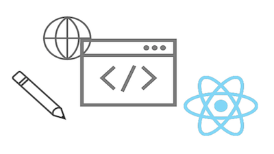

# Headless-Tutorials für AEM{#aem-headless-tutorials}

Adobe Experience Manager (AEM) bietet mehrere Optionen für die Definition von Headless-Endpunkten und die Bereitstellung von Inhalten als JSON. Nutzen Sie die praktischen Anleitungen, um die verschiedenen Optionen zu erkunden und die für Sie passende auszuwählen.

>[!TIP]
>
>Diese Sammlung von Tutorials richtet sich an all jene, die anhand von **praktischen Übungen lernen** möchten. Wenn Sie Lernkonzepte bevorzugen, in denen alles von Grund auf erklärt wird, schauen Sie sich die [AEM Headless-Entwickler-Tour](https://experienceleague.adobe.com/docs/experience-manager-cloud-service/content/headless/journeys/developer/overview.html?lang=de) an. Diese Reihe von Tutorials und die Tour ergänzen sich gegenseitig.

## Tutorials gruppiert nach API

<table>
<tr>
  <td>
    
    

      <a href="https://experienceleague.adobe.com/docs/experience-manager-learn/getting-started-with-aem-headless/graphql/overview.html?lang=de">
    <strong>GraphQL-API</strong>
    </a>
    

    

    <em>Erfahren Sie, wie eine Anwendung die AEM-GraphQL-API zum Abfragen von Inhalten verwenden kann.</em>
    

  </td>
  <td>
    
     

      <a href="./open-api/basic/overview.md">
        <strong>OpenAPI</strong>
      </a>
    

    

    <em>Erfahren Sie, wie eine Anwendung eine OpenAPI-basierte REST-APIs verwenden kann, um Inhalte zu nutzen.</em>
    

  </td>
  <td>
    
    

    <a href="https://experienceleague.adobe.com/docs/experience-manager-learn/getting-started-with-aem-headless/authentication/overview.html?lang=de">
    <strong>Token-Authentifizierung</strong>
    </a>
    

    

    <em>Erfahren Sie, wie eine Anwendung sicher mit AEM authentifiziert werden kann.</em>
    

  </td>  
</tr>
</table>

## Beispielanwendungen

Beispielanwendungen eignen sich hervorragend, um die Headless-Funktionen von Adobe Experience Manager (AEM) zu erkunden. Laden Sie diese fertigen Beispiele herunter und installieren Sie sie, damit Sie sofort loslegen können.

<table>
<tr>
  <td>
    
    

      <a href="https://experienceleague.adobe.com/docs/experience-manager-learn/getting-started-with-aem-headless/graphql/example-apps/ios-swiftui-app.html?lang=de">
    <strong>Beispiel für iOS SwiftUI</strong>
    </a>
    

    

    <em>Eine iOS-Anwendung, die von AEM GraphQL-APIs unterstützt wird.</em>
    

  </td>
  <td>
    
    

    <a href="https://experienceleague.adobe.com/docs/experience-manager-learn/getting-started-with-aem-headless/graphql/example-apps/android-app.html?lang=de">
    <strong>Android™-Beispiel</strong>
    </a>
    

    

    <em>Eine Android™-Anwendung, die von AEM GraphQL-APIs unterstützt wird.</em>
    

  </td>
  <td>
    
     

      <a href="https://experienceleague.adobe.com/docs/experience-manager-learn/getting-started-with-aem-headless/graphql/example-apps/react-app.html?lang=de">
        <strong>React-Beispiel</strong>
      </a>
    

    

    <em>Eine React-App, die von AEM GraphQL-APIs unterstützt wird.</em>
    

  </td>
</tr>
</table>

## Tutorials

Sehen Sie sich die folgenden Tutorials an, in denen unterschiedliche Technologien verwendet werden. Erfahren Sie, wieso AEM mehr bietet als reine Headless-Anwendungsfälle und welche Optionen für In-Context-Authoring und Experience Management zur Verfügung stehen.

<table>
<tr>
  <td>
    
    

      <a href="https://experienceleague.adobe.com/docs/experience-manager-learn/getting-started-with-aem-headless/graphql/overview.html?lang=de">
    <strong>React – Headless</strong>
    </a>
    

    

    <em>Erstellen Sie eine React-JS-App mit GraphQL in einem reinen Headless-Szenario.</em>
    

  </td>
  <td>
    
     

      <a href="https://experienceleague.adobe.com/de/docs/experience-manager-learn/cloud-service/developing/universal-editor/react-app-editing/overview">
<strong>React – Bearbeiten von Inhalten über den universellen Editor</strong>
</a>
    

    

    <em>Verwenden Sie den universellen Editor, um den Inhalt einer React-Anwendung zu bearbeiten.</em>
    

  </td>  
  <td>
    
    

    <a href="https://experienceleague.adobe.com/docs/experience-manager-learn/getting-started-with-aem-headless/spa-editor/remote-spa/overview.html?lang=de">
    <strong>React – Remote-Editor</strong>
    </a>
    

    

    <em>Verfassen Sie im Kontext einen Teil einer remote gehosteten React-App.</em>
    

  </td>
</tr>
<tr>  
  <td>
    
     

      <a href="https://experienceleague.adobe.com/docs/experience-manager-learn/getting-started-with-aem-headless/spa-editor/react/overview.html?lang=de">
        <strong>React – SPA-Editor</strong>
      </a>
    

    

    <em>Verwenden Sie den AEM-SPA-Editor, um das gesamte React-App-Erlebnis zu verwalten.</em>
    

  </td>
  <td>
    
    

    <a href="https://experienceleague.adobe.com/docs/experience-manager-learn/getting-started-with-aem-headless/content-services/overview.html?lang=de">
    <strong>Android – Content Services</strong>
    </a>
    

    

    <em>Verwenden Sie Content Services und REST, um eine mobile Android™-Anwendung zu betreiben.</em>
    

  </td>
  <td>
    
     

      <a href="https://experienceleague.adobe.com/docs/experience-manager-learn/getting-started-with-aem-headless/authentication/overview.html?lang=de">
 <strong>Node.js – Authentifizierung</strong>
 </a>
    

    

    <em>Erstellen Sie eine Node.js-App mit Entwickler- und Service-Token zur Authentifizierung.</em>
    

  </td>
</tr>
</table>
