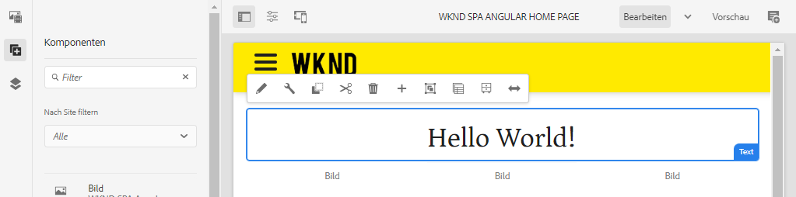
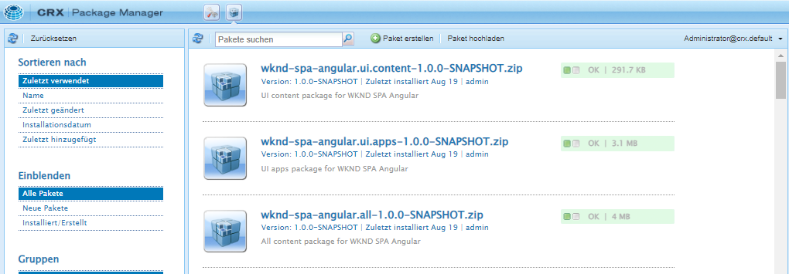
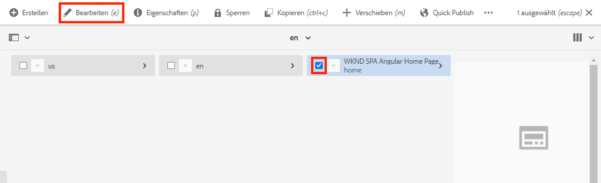
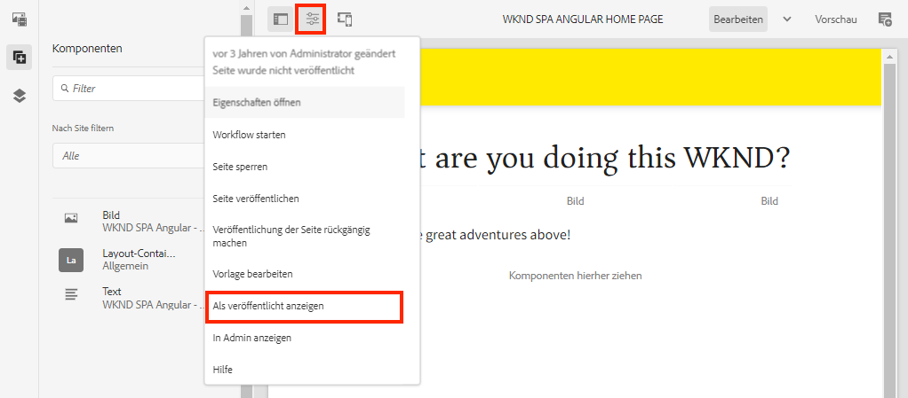

# SPA-Editor-Projekt {#create-project}

Erfahren Sie, wie Sie ein Maven-Projekt in Adobe Experience Manager (AEM) als Ausgangspunkt für eine mit dem AEM-SPA-Editor integrierte Angular-Anwendung verwenden.

## Ziel

1. Machen Sie sich mit der Struktur eines neuen AEM-SPA-Editor-Projekts vertraut, das aus einem Maven-Archetyp erstellt wurde.
2. Bereitstellen des Ausgangsprojekts in einer lokalen Instanz von AEM.

## Was Sie erstellen werden

In diesem Kapitel wird ein neues AEM-Projekt bereitgestellt, das auf dem [AEM-Projekt-Archetyp](https://github.com/adobe/aem-project-archetype) basiert. Das Bootstrapping für das AEM-Projekt erfolgt mit einem sehr einfachen Ausgangspunkt für die Angular-SPA. Das in diesem Kapitel verwendete Projekt dient als Grundlage für die Umsetzung des WKND-SPA, und zukünftige Kapitel bauen darauf auf.



*Eine klassische „Hello World“-Nachricht.*

## Voraussetzungen

Vergegenwärtigen Sie sich die erforderlichen Tools und Anweisungen zum Einrichten einer [lokalen Entwicklungsumgebung](overview.md#local-dev-environment). Stellen Sie sicher, dass eine neue Instanz von Adobe Experience Manager, die im **Autorenmodus** gestartet wurde, lokal ausgeführt wird.

## Projekt abrufen

Es gibt mehrere Möglichkeiten, ein Maven-Projekt mit mehreren Modulen für AEM zu erstellen. In diesem Tutorial wurde der neueste [AEM-Projekt-Archetyp](https://github.com/adobe/aem-project-archetype) als Grundlage für den Tutorial-Code verwendet. Der Projekt-Code wurde geändert, um mehrere Versionen von AEM zu unterstützen. Bitte lesen Sie den [Hinweis zur Abwärtskompatibilität](overview.md#compatibility).

>[!CAUTION]
>
>Es empfiehlt sich, bei der Erstellung eines neuen Projekts die **neueste** Version des [Archetyps](https://github.com/adobe/aem-project-archetype) für eine reale Umsetzung zu verwenden. AEM-Projekte sollten auf eine einzelne Version von AEM ausgerichtet sein, wobei die `aemVersion`-Eigenschaft des Archetyps verwendet wird.

1. Laden Sie den Ausgangspunkt für dieses Tutorial über Git herunter:

   ```shell
   $ git clone git@github.com:adobe/aem-guides-wknd-spa.git
   $ cd aem-guides-wknd-spa
   $ git checkout Angular/create-project-start
   ```

2. Die folgende Ordner- und Dateistruktur stellt das AEM Projekt dar, das vom Maven-Archetyp im lokalen Dateisystem generiert wurde:

   ```plain
   |--- aem-guides-wknd-spa
       |--- all/
       |--- core/
       |--- dispatcher/
       |--- ui.apps/
       |--- ui.apps.structure/
       |--- ui.content/
       |--- ui.frontend /
       |--- it.tests/
       |--- pom.xml
       |--- README.md
       |--- .gitignore
       |--- archetype.properties
   ```

3. Die folgenden Eigenschaften wurden beim Generieren des AEM-Projekts aus dem [AEM-Projekt-Archetyp](https://github.com/Adobe-Marketing-Cloud/aem-project-archetype/releases/tag/aem-project-archetype-14) verwendet:

   | Eigenschaft | Wert |
   |-----------------|---------------------------------------|
   | aemVersion | cloud |
   | appTitle | WKND SPA Angular |
   | appId | wknd-spa-angular |
   | groupId | com.adobe.aem.guides |
   | frontendModule | angular |
   | package | com.adobe.aem.guides.wknd.spa.angular |
   | includeExamples | n |

   >[!NOTE]
   >
   > Beachten Sie die Eigenschaft `frontendModule=angular`. Dadurch wird der AEM Projektarchetyp angewiesen, das Bootstrapping für ein Projekt mit einer [Angular-Code-Basis](https://experienceleague.adobe.com/docs/experience-manager-core-components/using/developing/archetype/uifrontend-angular.html?lang=de) als Startpunkt durchzuführen, die mit dem AEM-SPA-Editor verwendet wird.

## Erstellen des Projekts

Kompilieren und erstellen Sie anschließend mithilfe von Maven den Projekt-Code in einer lokalen Instanz von AEM und stellen Sie ihn bereit.

1. Stellen Sie sicher, dass eine Instanz von AEM lokal auf Port **4502** ausgeführt wird.
2. Überprüfen Sie im Befehlszeilen-Terminal, ob Maven installiert ist:

   ```shell
   $ mvn --version
   Apache Maven 3.6.2
   Maven home: /Library/apache-maven-3.6.2
   Java version: 11.0.4, vendor: Oracle Corporation, runtime: /Library/Java/JavaVirtualMachines/jdk-11.0.4.jdk/Contents/Home
   ```

3. Führen Sie den folgenden Maven-Befehl aus dem Verzeichnis `aem-guides-wknd-spa` aus, um das Projekt zu erstellen und in AEM bereitzustellen:

   ```shell
   $ mvn -PautoInstallSinglePackage clean install
   ```

   Bei Verwendung von [AEM 6.x](overview.md#compatibility):

   ```shell
   $ mvn clean install -PautoInstallSinglePackage -Pclassic
   ```

   Die verschiedenen Module des Projekts sollten kompiliert und in AEM bereitgestellt sein.

   ```plain
   [INFO] ------------------------------------------------------------------------
   [INFO] Reactor Summary for wknd-spa-angular 1.0.0-SNAPSHOT:
   [INFO] 
   [INFO] wknd-spa-angular ................................... SUCCESS [  0.473 s]
   [INFO] WKND SPA Angular - Core ............................ SUCCESS [ 54.866 s]
   [INFO] wknd-spa-angular.ui.frontend - UI Frontend ......... SUCCESS [02:10 min]
   [INFO] WKND SPA Angular - Repository Structure Package .... SUCCESS [  0.694 s]
   [INFO] WKND SPA Angular - UI apps ......................... SUCCESS [  6.351 s]
   [INFO] WKND SPA Angular - UI content ...................... SUCCESS [  2.885 s]
   [INFO] WKND SPA Angular - All ............................. SUCCESS [  1.736 s]
   [INFO] WKND SPA Angular - Integration Tests Bundles ....... SUCCESS [  2.563 s]
   [INFO] WKND SPA Angular - Integration Tests Launcher ...... SUCCESS [  1.846 s]
   [INFO] WKND SPA Angular - Dispatcher ...................... SUCCESS [  0.270 s]
   [INFO] ------------------------------------------------------------------------
   [INFO] BUILD SUCCESS
   [INFO] ------------------------------------------------------------------------
   ```

   Das Maven-Profil ***autoInstallSinglePackage*** kompiliert die einzelnen Module des Projekts und stellt ein einzelnes Paket in der AEM-Instanz bereit. Standardmäßig wird dieses Paket in einer AEM-Instanz bereitgestellt, die am Port **4502** lokal mit den Anmeldeinformationen **admin:admin** ausgeführt wird.

4. Navigieren Sie in Ihrer lokalen AEM-Instanz zu **[!UICONTROL Package Manager]**: [http://localhost:4502/crx/packmgr/index.jsp](http://localhost:4502/crx/packmgr/index.jsp).

5. Sie sollten drei Pakete sehen für `wknd-spa-angular.all`, `wknd-spa-angular.ui.apps` und `wknd-spa-angular.ui.content`.

   

   Der gesamte für das Projekt benötigte benutzerspezifische Code ist in diesen Paketen gebündelt und wird zur AEM-Laufzeit installiert.

6. Sie sollten auch mehrere Pakete sehen für `spa.project.core` und `core.wcm.components`. Hierbei handelt es sich um Abhängigkeiten, die automatisch vom Archetyp eingeschlossen sind. Weitere Informationen zu den [AEM Kernkomponenten finden Sie hier:](https://experienceleague.adobe.com/docs/experience-manager-core-components/using/introduction.html?lang=de).

## Authoring von Inhalten

Öffnen Sie als Nächstes die Starter-SPA, die vom Archetyp generiert wurde, und aktualisieren Sie einige Inhalte.

1. Navigieren Sie zur **[!UICONTROL Sites]**-Konsole: [http://localhost:4502/sites.html/content](http://localhost:4502/sites.html/content).

   Die WKND-SPA enthält eine grundlegende Website-Struktur mit einem Land, einer Sprache und einer Startseite. Diese Hierarchie basiert auf den Standardwerten des Archetyps für `language_country` und `isSingleCountryWebsite`. Diese Werte können überschrieben werden, indem die [verfügbaren Eigenschaften](https://github.com/adobe/aem-project-archetype#available-properties) beim Erstellen eines Projekts aktualisiert werden.

2. Öffnen Sie die Seite **[!DNL us]** > **[!DNL en]** > **[!DNL WKND SPA Angular Home Page]** durch Auswahl der Seite und Klicken auf die Schaltfläche **[!UICONTROL Bearbeiten]** in der Menüleiste:

   

3. Eine **[!UICONTROL Textkomponente]** wurde der Seite bereits hinzugefügt. Sie können diese Komponente wie jede andere Komponente in AEM bearbeiten.

   

4. Fügen Sie der Seite eine zusätzliche **[!UICONTROL Textkomponente]** hinzu.

   Beachten Sie, dass das Authoring-Erlebnis dem herkömmlichen AEM Sites-Seitenerlebnis ähnelt. Derzeit ist eine begrenzte Anzahl von Komponenten verfügbar, die verwendet werden können. Im Laufe des Tutorials kommen weitere hinzu.

## Überprüfen der Single Page Application

Überprüfen Sie anschließend mithilfe der Entwickler-Tools Ihres Browsers, ob es sich um eine Single Page Application handelt.

1. Klicken Sie im **[!UICONTROL Seiten-Editor]**, auf das Menü **[!UICONTROL Seiteninformationen]** > **[!UICONTROL Als veröffentlicht anzeigen]**:

   

   Dadurch wird eine neue Registerkarte mit dem Abfrageparameter `?wcmmode=disabled` geöffnet, wodurch der AEM-Editor effektiv deaktiviert wird: [http://localhost:4502/content/wknd-spa-angular/us/en/home.html?wcmmode=disabled](http://localhost:4502/content/wknd-spa-angular/us/en/home.html?wcmmode=disabled)

2. Zeigen Sie den Quell-Code der Seite an. Sie werden feststellen, dass weder der Text **[!DNL Hello World]** noch ein anderer Inhalt vorhanden ist. Stattdessen sollten Sie HTML-Code wie den folgenden sehen:

   ```html
   ...
   <body>
       <noscript>You need to enable JavaScript to run this app.</noscript>
       <div id="spa-root"></div>
       <script type="text/javascript" src="/etc.clientlibs/wknd-spa-angular/clientlibs/clientlib-angular.min.js"></script>
       ...
   </body>
   ...
   ```

   `clientlib-angular.min.js` ist die Angular-SPA, die auf die Seite geladen wird und für die Wiedergabe des Inhalts verantwortlich ist.

   *Woher kommt der Inhalt?*

3. Kehren Sie zur Registerkarte zurück: [http://localhost:4502/content/wknd-spa-angular/us/en/home.html?wcmmode=disabled](http://localhost:4502/content/wknd-spa-angular/us/en/home.html?wcmmode=disabled)
4. Öffnen Sie die Entwickler-Tools des Browsers und überprüfen Sie den Netzwerk-Traffic der Seite während einer Aktualisierung. Zeigen Sie die **XHR**-Anfragen an:

   

   Es sollte eine Anfrage geben an [http://localhost:4502/content/wknd-spa-angular/us/en.model.json](http://localhost:4502/content/wknd-spa-angular/us/en.model.json). Diese enthält den gesamten Inhalt, formatiert in JSON, für die SPA.

5. Öffnen Sie in einer neuen Registerkarte [http://localhost:4502/content/wknd-spa-angular/us/en.model.json](http://localhost:4502/content/wknd-spa-angular/us/en.model.json)

   Die Anfrage `en.model.json` stellt das Inhaltsmodell dar, das die App antreibt. Überprüfen Sie die JSON-Ausgabe. Sie sollten den Code-Ausschnitt finden können, der für die **[!UICONTROL Textkomponente(n)]** steht.

   ```json
   ...
   ":items": {
       "text": {
           "text": "<p>Hello World! Updated content!</p>\r\n",
           "richText": true,
           ":type": "wknd-spa-angular/components/text"
       },
       "text_98796435": {
           "text": "<p>A new text component.</p>\r\n",
           "richText": true,
           ":type": "wknd-spa-angular/components/text"
   },
   ...
   ```

   Im nächsten Kapitel werden wir überprüfen, wie der JSON-Inhalt von AEM-Komponenten den SPA-Komponenten zugeordnet wird, um die Grundlage für den AEM-SPA-Editor zu bilden.

   >[!NOTE]
   >
   > Es kann hilfreich sein, eine Browser-Erweiterung zu installieren, um die JSON-Ausgabe automatisch zu formatieren.

## Herzlichen Glückwunsch! {#congratulations}

Herzlichen Glückwunsch! Sie haben soeben Ihr erstes AEM-SPA-Editor-Projekt erstellt.

Es ist bisher recht einfach, in den nächsten Kapiteln kommen aber weitere Funktionen dazu.

### Nächste Schritte {#next-steps}

[SPA integrieren](integrate-spa.md): Erfahren Sie, wie der SPA-Quell-Code in das AEM-Projekt integriert wird, und lernen Sie die verfügbaren Tools kennen, um die SPA schnell zu entwickeln.
