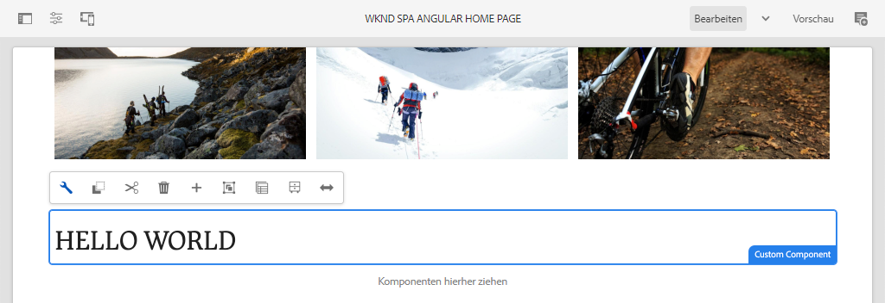
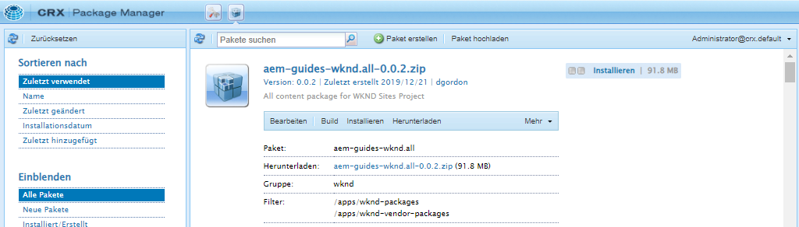
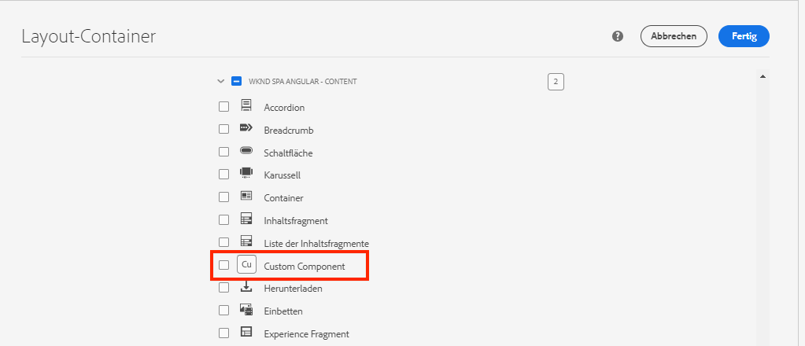
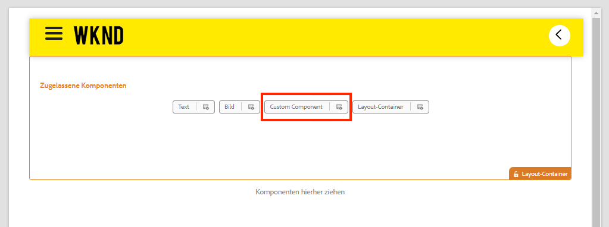
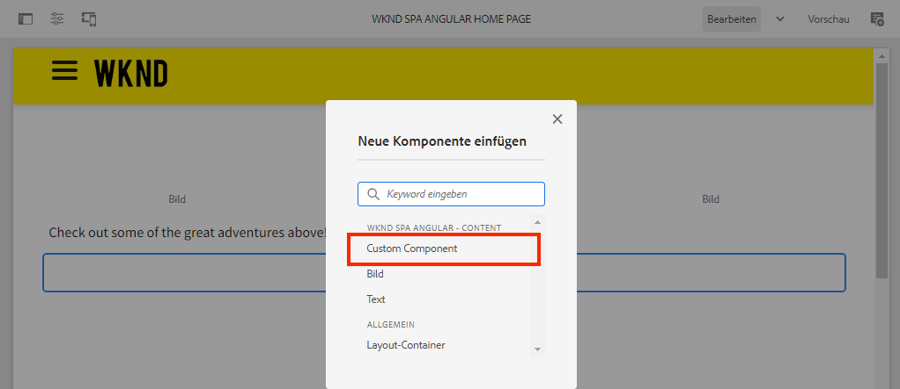
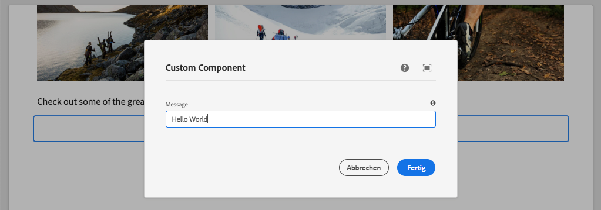

# Erstellen einer benutzerdefinierten Komponente {#custom-component}

Erfahren Sie, wie Sie eine benutzerdefinierte Komponente erstellen, die mit dem AEM-SPA-Editor verwendet werden kann. Erfahren Sie, wie Sie Autorendialogfelder und Sling-Modelle entwickeln, um das JSON-Modell zu erweitern und eine benutzerdefinierte Komponente zu füllen.

## Ziel

1. Machen Sie sich mit der Rolle von Sling-Modellen bei der Bearbeitung der von AEM bereitgestellten JSON-Modell-API vertraut.
2. Erfahren Sie, wie Sie AEM-Komponentendialogfelder erstellen.
3. Erfahren Sie, wie Sie eine **benutzerdefinierte** AEM-Komponente erstellen, die mit dem SPA-Editor-Framework kompatibel ist.

## Was Sie erstellen werden

Der Schwerpunkt früherer Kapitel lag in der Entwicklung der SPA-Komponenten und deren Zuordnung zu *vorhandenen* AEM-Kernkomponenten. In diesem Kapitel wird beschrieben, wie Sie *neue* AEM-Komponenten erstellen und erweitern und das von AEM bereitgestellte JSON-Modell bearbeiten.

Eine einfache `Custom Component` veranschaulicht die Schritte, die zum Erstellen einer neuen AEM-Komponente erforderlich sind.



## Voraussetzungen

Vergegenwärtigen Sie sich die erforderlichen Tools und Anweisungen zum Einrichten einer [lokalen Entwicklungsumgebung](overview.md#local-dev-environment).

### Abrufen des Codes

1. Laden Sie den Ausgangspunkt für dieses Tutorial über Git herunter:

   ```shell
   $ git clone git@github.com:adobe/aem-guides-wknd-spa.git
   $ cd aem-guides-wknd-spa
   $ git checkout Angular/custom-component-start
   ```

2. Stellen Sie die Code-Basis mithilfe von Maven in einer lokalen AEM-Instanz bereit:

   ```shell
   $ mvn clean install -PautoInstallSinglePackage
   ```

   Wenn Sie [AEM 6.x](overview.md#compatibility) verwenden, fügen Sie das Profil `classic` hinzu:

   ```shell
   $ mvn clean install -PautoInstallSinglePackage -Pclassic
   ```

3. Installieren Sie das fertige Paket für die herkömmliche [WKND-Referenz-Site](https://github.com/adobe/aem-guides-wknd/releases/latest). Die Bilder von der [WKND-Referenz-Site](https://github.com/adobe/aem-guides-wknd/releases/latest) werden auf der WKND-SPA wiederverwendet. Das Paket kann mit [AEM Package Manager](http://localhost:4502/crx/packmgr/index.jsp) installiert werden.

   

Sie können den fertigen Code jederzeit auf [GitHub](https://github.com/adobe/aem-guides-wknd-spa/tree/Angular/custom-component-solution) einsehen oder den Code lokal auschecken, indem Sie zur Verzweigung `Angular/custom-component-solution` wechseln.

## Definieren der AEM-Komponente

Eine AEM-Komponente ist definiert als ein Knoten und Eigenschaften. Im Projekt werden diese Knoten und Eigenschaften als XML-Dateien im `ui.apps`-Modul dargestellt. Erstellen Sie anschließend die AEM-Komponente im `ui.apps`-Modul.

>[!NOTE]
>
> Eine kurze Auffrischung der [Grundlagen der AEM-Komponenten könnte hilfreich sein](https://experienceleague.adobe.com/docs/experience-manager-learn/getting-started-wknd-tutorial-develop/project-archetype/component-basics.html?lang=de).

1. Öffnen Sie den Ordner `ui.apps` in der IDE Ihrer Wahl.
2. Navigieren Sie zu `ui.apps/src/main/content/jcr_root/apps/wknd-spa-angular/components` und erstellen Sie einen Ordner namens `custom-component`.
3. Erstellen Sie eine Datei mit dem Namen `.content.xml` unter dem Ordner `custom-component`. Befüllen Sie `custom-component/.content.xml` mit dem Folgenden:

   ```xml
   <?xml version="1.0" encoding="UTF-8"?>
   <jcr:root xmlns:sling="http://sling.apache.org/jcr/sling/1.0" xmlns:cq="http://www.day.com/jcr/cq/1.0" xmlns:jcr="http://www.jcp.org/jcr/1.0"
       jcr:primaryType="cq:Component"
       jcr:title="Custom Component"
       componentGroup="WKND SPA Angular - Content"/>
   ```

   

   `jcr:primaryType="cq:Component"`: gibt an, dass dieser Knoten eine AEM-Komponente ist.

   `jcr:title` ist der Wert, der den Inhaltsautorinnen und -autoren angezeigt wird, und `componentGroup` bestimmt die Gruppierung von Komponenten in der Authoring-Benutzeroberfläche.

4. Erstellen Sie unter dem Ordner `custom-component` einen weiteren Ordner mit dem Namen `_cq_dialog`.
5. Legen Sie unter dem Ordner `_cq_dialog` eine Datei mit dem Namen `.content.xml` an und befüllen Sie sie mit folgendem Inhalt:

   ```xml
   <?xml version="1.0" encoding="UTF-8"?>
   <jcr:root xmlns:sling="http://sling.apache.org/jcr/sling/1.0" xmlns:granite="http://www.adobe.com/jcr/granite/1.0" xmlns:cq="http://www.day.com/jcr/cq/1.0" xmlns:jcr="http://www.jcp.org/jcr/1.0" xmlns:nt="http://www.jcp.org/jcr/nt/1.0"
       jcr:primaryType="nt:unstructured"
       jcr:title="Custom Component"
       sling:resourceType="cq/gui/components/authoring/dialog">
       <content
           jcr:primaryType="nt:unstructured"
           sling:resourceType="granite/ui/components/coral/foundation/container">
           <items jcr:primaryType="nt:unstructured">
               <tabs
                   jcr:primaryType="nt:unstructured"
                   sling:resourceType="granite/ui/components/coral/foundation/tabs"
                   maximized="{Boolean}true">
                   <items jcr:primaryType="nt:unstructured">
                       <properties
                           jcr:primaryType="nt:unstructured"
                           jcr:title="Properties"
                           sling:resourceType="granite/ui/components/coral/foundation/container"
                           margin="{Boolean}true">
                           <items jcr:primaryType="nt:unstructured">
                               <columns
                                   jcr:primaryType="nt:unstructured"
                                   sling:resourceType="granite/ui/components/coral/foundation/fixedcolumns"
                                   margin="{Boolean}true">
                                   <items jcr:primaryType="nt:unstructured">
                                       <column
                                           jcr:primaryType="nt:unstructured"
                                           sling:resourceType="granite/ui/components/coral/foundation/container">
                                           <items jcr:primaryType="nt:unstructured">
                                               <message
                                                   jcr:primaryType="nt:unstructured"
                                                   sling:resourceType="granite/ui/components/coral/foundation/form/textfield"
                                                   fieldDescription="The text to display on the component."
                                                   fieldLabel="Message"
                                                   name="./message"/>
                                           </items>
                                       </column>
                                   </items>
                               </columns>
                           </items>
                       </properties>
                   </items>
               </tabs>
           </items>
       </content>
   </jcr:root>
   ```

   

   Die obige XML-Datei generiert ein einfaches Dialogfeld für `Custom Component`. Der kritische Teil der Datei ist der innere `<message>`-Knoten. Dieses Dialogfeld enthält ein einfaches `textfield` mit Namen `Message` und behält den Wert des Textfelds in einer Eigenschaft mit dem Namen `message` bei.

   Als Nächstes wird ein Sling-Modell erstellt, um den Wert der `message`-Eigenschaft über das JSON-Modell offenzulegen.

   >[!NOTE]
   >
   > Sie können viele weitere [Beispiele für Dialoge in den Definitionen der Kernkomponenten sehen](https://github.com/adobe/aem-core-wcm-components/tree/master/content/src/content/jcr_root/apps/core/wcm/components). Sie können auch zusätzliche Formularfelder anzeigen, zum Beispiel `select`, `textarea`, `pathfield`, verfügbar unter `/libs/granite/ui/components/coral/foundation/form` in [CRXDE-Lite](http://localhost:4502/crx/de/index.jsp#/libs/granite/ui/components/coral/foundation/form).

   Bei einer herkömmlichen AEM-Komponente ist normalerweise ein [HTL](https://experienceleague.adobe.com/docs/experience-manager-htl/content/overview.html?lang=de)-Skript erforderlich. Da die SPA die Komponente rendert, ist kein HTL-Skript erforderlich.

## Erstellen des Sling-Modells

Sling-Modelle sind von Anmerkungen gesteuerte Java™-„POJOs“ (Plain Old Java™ Objects), die die Zuordnung von Daten aus JCR zu Java™-Variablen erleichtern. [Sling-Modelle](https://experienceleague.adobe.com/docs/experience-manager-learn/getting-started-wknd-tutorial-develop/project-archetype/component-basics.html?lang=de#sling-models) dienen normalerweise zum Einkapseln komplexer Server-seitiger Business-Logik für AEM-Komponenten.

Im Zusammenhang mit dem SPA-Editor stellen Sling-Modelle den Inhalt einer Komponente durch das JSON-Modell über eine Funktion mit dem [Sling-Modell-Exporter](https://experienceleague.adobe.com/docs/experience-manager-learn/foundation/development/develop-sling-model-exporter.html?lang=de) dar.

1. Öffnen Sie das `core`-Modul in der IDE Ihrer Wahl. `CustomComponent.java` und `CustomComponentImpl.java` wurden bereits als Teil des Codes zu Beginn des Kapitels erstellt und ausgelagert.

   >[!NOTE]
   >
   > Bei Verwendung der Visual Studio Code-IDE kann es hilfreich sein, die [Erweiterungen für Java™](https://code.visualstudio.com/docs/java/extensions) zu installieren.

2. Öffnen Sie die Java™-Benutzeroberfläche `CustomComponent.java` unter `core/src/main/java/com/adobe/aem/guides/wknd/spa/angular/core/models/CustomComponent.java`:

   

   Dies ist die Java™-Schnittstelle, die vom Sling-Modell implementiert wird.

3. Aktualisieren Sie `CustomComponent.java` so, dass es die Schnittstelle `ComponentExporter` erweitert:

   ```java
   package com.adobe.aem.guides.wknd.spa.angular.core.models;
   import com.adobe.cq.export.json.ComponentExporter;
   
   public interface CustomComponent extends ComponentExporter {
   
       public String getMessage();
   
   }
   ```

   Das Implementieren der `ComponentExporter` -Schnittstelle ist eine Voraussetzung dafür, dass das Sling-Modell automatisch von der JSON-Modell-API erfasst wird.

   Die `CustomComponent` -Schnittstelle enthält eine einzige Getter-Methode `getMessage()`. Dies ist die Methode, die den Wert des Autorendialogfelds über das JSON-Modell verfügbar macht. Nur Getter-Methoden mit leeren Parametern `()` werden im JSON-Modell exportiert.

4. Öffnen von `CustomComponentImpl.java` bei `core/src/main/java/com/adobe/aem/guides/wknd/spa/angular/core/models/impl/CustomComponentImpl.java`.

   Dies ist die Implementierung der `CustomComponent`-Schnittstelle. Die Anmerkung `@Model` identifiziert die Java™-Klasse als Sling-Modell. Die Anmerkung `@Exporter` ermöglicht die Serialisierung und den Export der Java™-Klasse über den Sling-Modell-Exporter.

5. Aktualisieren Sie die statische Variable `RESOURCE_TYPE` so, dass sie auf die in der vorherigen Übung erstellte AEM-Komponente `wknd-spa-angular/components/custom-component` verweist.

   ```java
   static final String RESOURCE_TYPE = "wknd-spa-angular/components/custom-component";
   ```

   Es ist der Ressourcentyp der Komponente, der das Sling-Modell an die AEM-Komponente bindet und letztendlich der Angular-Komponente zuordnet.

6. Fügen Sie die Methode `getExportedType()` zur `CustomComponentImpl`-Klasse hinzu, um den Komponenten-Ressourcentyp zurückzugeben:

   ```java
   @Override
   public String getExportedType() {
       return CustomComponentImpl.RESOURCE_TYPE;
   }
   ```

   Diese Methode ist erforderlich, wenn die `ComponentExporter`-Schnittstelle implementiert wird, und gibt den Ressourcentyp an, der die Zuordnung zur Angular-Komponente ermöglicht.

7. Aktualisieren Sie die Methode `getMessage()` so, dass sie den Wert der `message`-Eigenschaft zurückgibt, die vom Autorendialogfeld persistiert wird. Verwenden Sie die Anmerkung `@ValueMap`, um den JCR-Wert `message` einer Java™-Variable zuzuordnen:

   ```java
   import org.apache.commons.lang3.StringUtils;
   ...
   
   @ValueMapValue
   private String message;
   
   @Override
   public String getMessage() {
       return StringUtils.isNotBlank(message) ? message.toUpperCase() : null;
   }
   ```

   Es wird eine zusätzliche „Business-Logik“ hinzugefügt, um den Wert der Nachricht in Großbuchstaben zurückzugeben. Auf diese Weise können wir den Unterschied zwischen dem im Autorendialogfeld gespeicherten Rohwert und dem vom Sling-Modell bereitgestellten Wert sehen.

   >[!NOTE]
   >
   >Sie können die [fertige CustomComponentImpl.java hier ansehen](https://github.com/adobe/aem-guides-wknd-spa/blob/Angular/custom-component-solution/core/src/main/java/com/adobe/aem/guides/wknd/spa/angular/core/models/impl/CustomComponentImpl.java).

## Update der Angular-Komponente

Der Angular-Code für die benutzerdefinierte Komponente wurde bereits erstellt. Nehmen Sie als Nächstes einige Aktualisierungen vor, um die Angular-Komponente der AEM-Komponente zuzuordnen.

1. Öffnen Sie im Modul `ui.frontend` die Datei `ui.frontend/src/app/components/custom/custom.component.ts`
2. Beobachten Sie die Zeile `@Input() message: string;`. Es wird erwartet, dass der umgewandelte Wert in Großbuchstaben dieser Variablen zugeordnet wird.
3. Importieren Sie das `MapTo`-Objekt vom AEM SPA Editor JS SDK und verwenden Sie es, um es der AEM-Komponente zuzuordnen:

   ```diff
   + import {MapTo} from '@adobe/cq-angular-editable-components';
   
    ...
    export class CustomComponent implements OnInit {
        ...
    }
   
   + MapTo('wknd-spa-angular/components/custom-component')(CustomComponent, CustomEditConfig);
   ```

4. Öffnen Sie `cutom.component.html` und beachten Sie, dass der Wert von `{{message}}` neben einem `<h2>`-Tag angezeigt wird.
5. Öffnen Sie `custom.component.css` und fügen Sie die folgende Regel hinzu:

   ```css
   :host-context {
       display: block;
   }
   ```

   Damit der AEM-Editor-Platzhalter richtig angezeigt wird, wenn die Komponente leer ist, muss `:host-context` oder ein anderes `<div>` auf `display: block;` gesetzt werden.

6. Stellen Sie die Aktualisierungen mithilfe Ihrer Maven-Kenntnisse in einer lokalen AEM-Umgebung aus dem Stammverzeichnis des Projektverzeichnisses bereit:

   ```shell
   $ cd aem-guides-wknd-spa
   $ mvn clean install -PautoInstallSinglePackage
   ```

## Aktualisieren der Vorlagenrichtlinie

Navigieren Sie anschließend zu AEM, um die Aktualisierungen zu überprüfen und zuzulassen, dass `Custom Component` zu der SPA hinzugefügt wird.

1. Überprüfen Sie die Registrierung des neuen Sling-Modells, indem Sie zu [http://localhost:4502/system/console/status-slingmodels](http://localhost:4502/system/console/status-slingmodels) navigieren.

   ```plain
   com.adobe.aem.guides.wknd.spa.angular.core.models.impl.CustomComponentImpl - wknd-spa-angular/components/custom-component
   
   com.adobe.aem.guides.wknd.spa.angular.core.models.impl.CustomComponentImpl exports 'wknd-spa-angular/components/custom-component' with selector 'model' and extension '[Ljava.lang.String;@6fb4a693' with exporter 'jackson'
   ```

   Sie sollten die beiden obigen Zeilen sehen, die anzeigen, dass `CustomComponentImpl` mit der Komponente `wknd-spa-angular/components/custom-component` verbunden ist und dass sie über den Sling-Modell-Exporter registriert ist.

2. Navigieren Sie zur SPA-Seitenvorlage unter [http://localhost:4502/editor.html/conf/wknd-spa-angular/settings/wcm/templates/spa-page-template/structure.html](http://localhost:4502/editor.html/conf/wknd-spa-angular/settings/wcm/templates/spa-page-template/structure.html).
3. Aktualisieren Sie die Richtlinie des Layout-Containers, um die neue `Custom Component` als zulässige Komponente hinzuzufügen:

   

   Speichern Sie die Änderungen an der Richtlinie und betrachten Sie die `Custom Component` als zulässige Komponente:

   

## Erstellen der benutzerdefinierten Komponente

Als Nächstes erstellen Sie die `Custom Component` mit dem AEM-SPA-Editor.

1. Navigieren Sie zu [http://localhost:4502/editor.html/content/wknd-spa-angular/us/en/home.html](http://localhost:4502/editor.html/content/wknd-spa-angular/us/en/home.html).
2. Fügen Sie die `Custom Component` im Modus `Edit` dem `Layout Container` hinzu:

   

3. Öffnen Sie das Dialogfeld der Komponente und geben Sie eine Nachricht ein, die einige Kleinbuchstaben enthält.

   

   Dies ist das Dialogfeld, das basierend auf der XML-Datei früher im Kapitel erstellt wurde.

4. Speichern Sie die Änderungen. Beachten Sie, dass die angezeigte Nachricht vollständig in Großbuchstaben geschrieben ist.

   

5. Zeigen Sie das JSON-Modell durch Navigieren zu [http://localhost:4502/content/wknd-spa-angular/us/en.model.json](http://localhost:4502/content/wknd-spa-angular/us/en.model.json) an. Suchen Sie nach `wknd-spa-angular/components/custom-component`:

   ```json
   "custom_component_208183317": {
       "message": "HELLO WORLD",
       ":type": "wknd-spa-angular/components/custom-component"
   }
   ```

   Beachten Sie, dass der JSON-Wert aufgrund der zum Sling-Modell hinzugefügten Logik auf ausschließlich Großbuchstaben eingestellt ist.

## Herzlichen Glückwunsch! {#congratulations}

Herzlichen Glückwunsch! Sie haben gelernt, wie eine benutzerdefinierte AEM-Komponente erstellt wird und wie Sling-Modelle und -Dialogfelder mit dem JSON-Modell funktionieren.

Sie können sich den fertigen Code jederzeit auf [GitHub](https://github.com/adobe/aem-guides-wknd-spa/tree/Angular/custom-component-solution) ansehen oder den Code lokal herunterladen, indem Sie zu der Verzweigung `Angular/custom-component-solution` wechseln.

### Nächste Schritte {#next-steps}

[Erweitern einer Kernkomponente](extend-component.md) – erfahren Sie, wie Sie eine vorhandene Kernkomponente erweitern, um sie mit dem AEM-SPA-Editor zu verwenden. Das Verständnis, wie Eigenschaften und Inhalte zu einer vorhandenen Komponente hinzugefügt werden, ist eine leistungsstarke Methode, um die Funktionen einer Implementierung des AEM-SPA-Editors zu erweitern.
