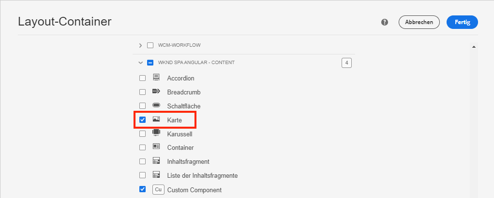
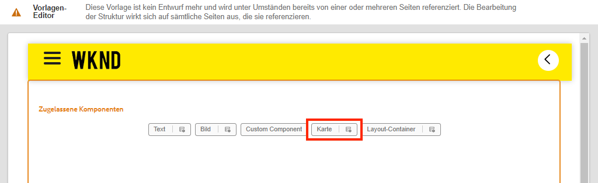
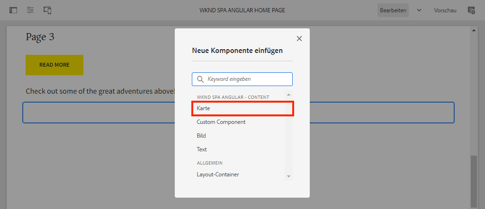
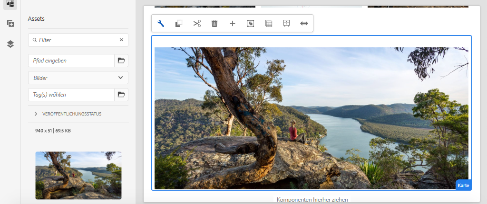
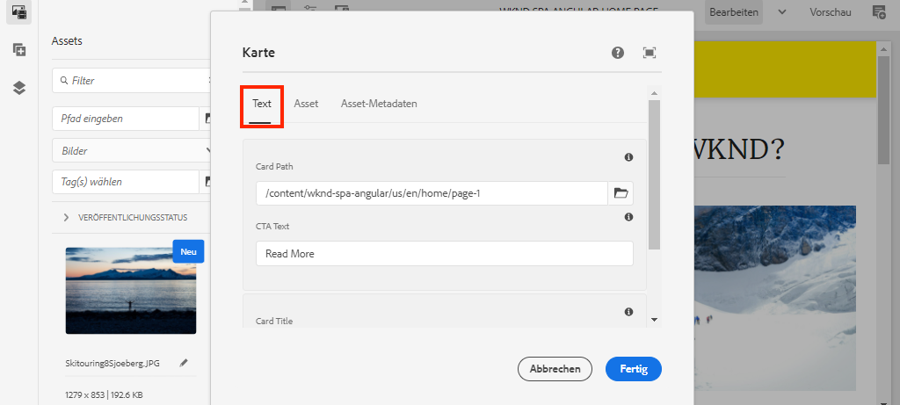
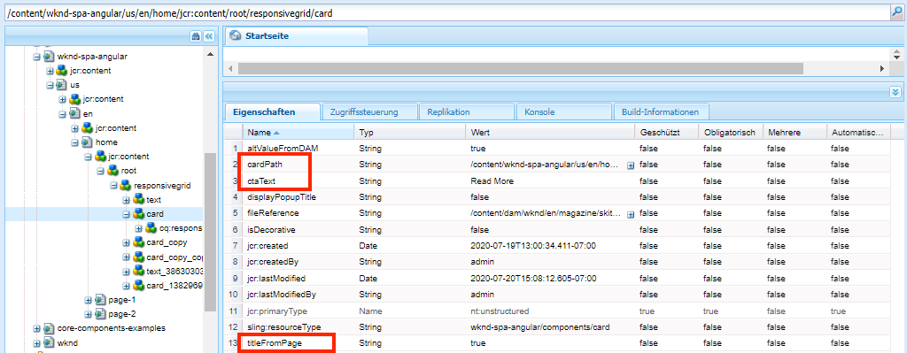
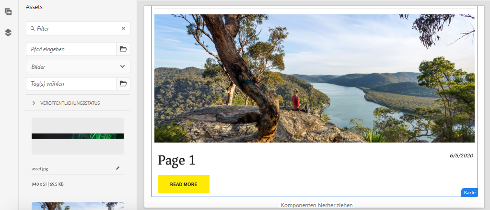

# Erweitern einer Kernkomponente {#extend-component}

Erfahren Sie, wie Sie eine vorhandene Kernkomponente erweitern, um sie mit dem AEM SPA Editor zu verwenden. Das Verständnis, wie eine vorhandene Komponente erweitert wird, ist eine leistungsstarke Methode, um die Funktionen einer AEM SPA Editor-Implementierung anzupassen und zu erweitern.

## Ziel

1. Erweitern einer vorhandenen Kernkomponente mit zusätzlichen Eigenschaften und Inhalten.
2. Grundlegendes zur Komponentenvererbung mit der Verwendung von `sling:resourceSuperType`.
3. Erfahren Sie, wie Sie die [Delegationsmuster](https://github.com/adobe/aem-core-wcm-components/wiki/Delegation-Pattern-for-Sling-Models) für Sling-Modelle verwenden, um vorhandene Logik und Funktionalität wiederzuverwenden.

## Was Sie erstellen werden

In diesem Kapitel wird eine neue `Card` -Komponente erstellt. Die `Card` -Komponente erweitert die [Bild-Kernkomponente](https://experienceleague.adobe.com/docs/experience-manager-core-components/using/components/image.html?lang=de) Fügen Sie zusätzliche Inhaltsfelder wie einen Titel und eine Aktionsaufruf-Schaltfläche hinzu, um die Rolle eines Teasers für andere Inhalte im SPA auszuführen.


>[!NOTE]
>
> In einer realen Implementierung ist es vielleicht sinnvoller, einfach die [Teaser-Komponente](https://experienceleague.adobe.com/docs/experience-manager-core-components/using/components/teaser.html) als [Bild-Kernkomponente](https://experienceleague.adobe.com/docs/experience-manager-core-components/using/components/image.html) , um `Card` -Komponente entsprechend den Projektanforderungen. Es wird immer empfohlen, [Kernkomponenten](https://experienceleague.adobe.com/docs/experience-manager-core-components/using/introduction.html?lang=de) nach Möglichkeit.

## Voraussetzungen

Überprüfen Sie die erforderlichen Tools und Anweisungen zum Einrichten eines [lokale Entwicklungsumgebung](overview.md#local-dev-environment).

### Code abrufen

1. Laden Sie den Ausgangspunkt für dieses Tutorial über Git herunter:

   ```shell
   $ git clone git@github.com:adobe/aem-guides-wknd-spa.git
   $ cd aem-guides-wknd-spa
   $ git checkout Angular/extend-component-start
   ```

2. Stellen Sie die Codebasis mithilfe von Maven in einer lokalen AEM-Instanz bereit:

   ```shell
   $ mvn clean install -PautoInstallSinglePackage
   ```

   Wenn Sie [AEM 6.x](overview.md#compatibility) Fügen Sie die `classic` profile:

   ```shell
   $ mvn clean install -PautoInstallSinglePackage -Pclassic
   ```

3. Installieren Sie das fertige Paket für das herkömmliche [WKND-Referenz-Site](https://github.com/adobe/aem-guides-wknd/releases/tag/aem-guides-wknd-2.1.0). Die von [WKND-Referenz-Site](https://github.com/adobe/aem-guides-wknd/releases/latest) wird auf der WKND-SPA wiederverwendet. Das Paket kann mit [AEM Package Manager](http://localhost:4502/crx/packmgr/index.jsp).

   

Sie können den fertigen Code immer in [GitHub](https://github.com/adobe/aem-guides-wknd-spa/tree/Angular/extend-component-solution) oder den Code lokal auschecken, indem Sie zu der Verzweigung wechseln `Angular/extend-component-solution`.

## Inspect-ErstKartenimplementierung

Eine anfängliche Kartenkomponente wurde vom Code des Kapitelstarters bereitgestellt. Inspect als Ausgangspunkt für die Kartenimplementierung.

1. Öffnen Sie in der IDE Ihrer Wahl die `ui.apps` -Modul.
2. Navigieren Sie zu `ui.apps/src/main/content/jcr_root/apps/wknd-spa-angular/components/card` und zeigen Sie die `.content.xml` -Datei.

   

   ```xml
   <?xml version="1.0" encoding="UTF-8"?>
   <jcr:root xmlns:sling="http://sling.apache.org/jcr/sling/1.0" xmlns:cq="http://www.day.com/jcr/cq/1.0" xmlns:jcr="http://www.jcp.org/jcr/1.0"
       jcr:primaryType="cq:Component"
       jcr:title="Card"
       sling:resourceSuperType="wknd-spa-angular/components/image"
       componentGroup="WKND SPA Angular - Content"/>
   ```

   Die Eigenschaft `sling:resourceSuperType` weist auf `wknd-spa-angular/components/image` mit dem Hinweis, dass `Card` -Komponente erbt die Funktionalität von der WKND-SPA Bildkomponente.

3. Prüfen Sie die Datei `ui.apps/src/main/content/jcr_root/apps/wknd-spa-angular/components/image/.content.xml`:

   ```xml
   <?xml version="1.0" encoding="UTF-8"?>
   <jcr:root xmlns:sling="http://sling.apache.org/jcr/sling/1.0" xmlns:cq="http://www.day.com/jcr/cq/1.0" xmlns:jcr="http://www.jcp.org/jcr/1.0"
       jcr:primaryType="cq:Component"
       jcr:title="Image"
       sling:resourceSuperType="core/wcm/components/image/v2/image"
       componentGroup="WKND SPA Angular - Content"/>
   ```

   Beachten Sie, dass `sling:resourceSuperType` weist auf `core/wcm/components/image/v2/image`. Dies bedeutet, dass die WKND SPA Image-Komponente die Funktionalität vom Kernkomponentenbild übernimmt.

   Wird auch als [Proxy-Muster](https://experienceleague.adobe.com/docs/experience-manager-core-components/using/developing/guidelines.html#proxy-component-pattern) Die Vererbung von Sling-Ressourcen ist ein leistungsstarkes Designmuster, mit dem untergeordnete Komponenten Funktionen übernehmen und das Verhalten bei Bedarf erweitern/überschreiben können. Die Sling-Vererbung unterstützt mehrere Vererbungsebenen, sodass letztendlich die neue `Card` -Komponente erbt die Funktionalität des Kernkomponentenbilds.

   Viele Entwicklungsteams streben danach, D.R.Y. zu sein (wiederholen Sie sich nicht selbst). Die Sling-Vererbung ermöglicht dies mit AEM.

4. Unter dem `card` Ordner, öffnen Sie die Datei `_cq_dialog/.content.xml`.

   Diese Datei ist die Definition des Komponentendialogfelds für die `Card` -Komponente. Bei Verwendung der Sling-Vererbung ist es möglich, Funktionen der [Sling Resource Merger](https://experienceleague.adobe.com/docs/experience-manager-65/developing/platform/sling-resource-merger.html?lang=de) , um Teile des Dialogfelds zu überschreiben oder zu erweitern. In diesem Beispiel wurde dem Dialogfeld eine neue Registerkarte hinzugefügt, um zusätzliche Daten von einem Autor zu erfassen und die Kartenkomponente zu füllen.

   Eigenschaften wie `sling:orderBefore` können Entwickler wählen, wo neue Registerkarten oder Formularfelder eingefügt werden sollen. In diesem Fall wird die `Text` vor dem `asset` Registerkarte. Um den Sling Resource Merger vollständig zu nutzen, ist es wichtig, die ursprüngliche Dialogfeldknotenstruktur für die [Dialogfeld &quot;Bildkomponente&quot;](https://github.com/adobe/aem-core-wcm-components/blob/master/content/src/content/jcr_root/apps/core/wcm/components/image/v2/image/_cq_dialog/.content.xml).

5. Unter dem `card` Ordner, öffnen Sie die Datei `_cq_editConfig.xml`. Diese Datei bestimmt das Drag-and-Drop-Verhalten in der AEM Authoring-Benutzeroberfläche. Beim Erweitern der Bildkomponente ist es wichtig, dass der Ressourcentyp mit der Komponente selbst übereinstimmt. Überprüfen Sie die `<parameters>` node:

   ```xml
   <parameters
       jcr:primaryType="nt:unstructured"
       sling:resourceType="wknd-spa-angular/components/card"
       imageCrop=""
       imageMap=""
       imageRotate=""/>
   ```

   Die meisten Komponenten erfordern keine `cq:editConfig`, das Bild und untergeordnete untergeordnete Elemente der Bildkomponente sind Ausnahmen.

6. Wechseln Sie in der IDE zum `ui.frontend` -Modul, navigieren Sie zu `ui.frontend/src/app/components/card`:

   

7. Prüfen Sie die Datei `card.component.ts`.

   Die Komponente wurde bereits ausgelagert, um sie dem AEM zuzuordnen. `Card` Komponente mit dem Standard `MapTo` -Funktion.

   ```js
   MapTo('wknd-spa-angular/components/card')(CardComponent, CardEditConfig);
   ```

   Überprüfen Sie die drei `@Input` Parameter in der Klasse für `src`, `alt`und `title`. Dies sind erwartete JSON-Werte aus der AEM Komponente, die der Angular-Komponente zugeordnet sind.

8. Öffnen Sie die Datei `card.component.html`:

   ```html
   <div class="card"  *ngIf="hasContent">
       <app-image class="card__image" [src]="src" [alt]="alt" [title]="title"></app-image>
   </div>
   ```

   In diesem Beispiel haben wir die vorhandene Angular-Image-Komponente wiederverwendet `app-image` durch einfache Übergabe der `@Input` Parameter aus `card.component.ts`. Später im Tutorial werden zusätzliche Eigenschaften hinzugefügt und angezeigt.

## Vorlagenrichtlinie aktualisieren

Mit dieser ersten `Card` Implementierung überprüft die Funktionalität im AEM SPA Editor. So zeigen Sie die ersten `Card` -Komponente ein Update der Vorlagenrichtlinie erforderlich ist.

1. Stellen Sie den Starter-Code auf einer lokalen Instanz von AEM bereit, falls Sie dies noch nicht getan haben:

   ```shell
   $ cd aem-guides-wknd-spa
   $ mvn clean install -PautoInstallSinglePackage
   ```

2. Navigieren Sie zur SPA Seitenvorlage unter [http://localhost:4502/editor.html/conf/wknd-spa-angular/settings/wcm/templates/spa-page-template/structure.html](http://localhost:4502/editor.html/conf/wknd-spa-angular/settings/wcm/templates/spa-page-template/structure.html).
3. Aktualisieren Sie die Richtlinie des Layout-Containers, um die neue `Card` -Komponente als zulässige Komponente:

   

   Speichern Sie die Änderungen an der Richtlinie und beachten Sie die `Card` -Komponente als zulässige Komponente:

   

## Autorenkartenkomponente

Als Nächstes erstellen Sie die `Card` -Komponente mit dem AEM-SPA-Editor.

1. Navigieren Sie zu [http://localhost:4502/editor.html/content/wknd-spa-angular/us/en/home.html](http://localhost:4502/editor.html/content/wknd-spa-angular/us/en/home.html).
2. In `Edit` -Modus, fügen Sie die `Card` -Komponente `Layout Container`:

   

3. Ziehen Sie ein Bild aus der Asset-Suche in den `Card` component:

   

4. Öffnen Sie die `Card` Komponenten-Dialogfeld anzeigen und das Hinzufügen eines **Text** Registerkarte.
5. Geben Sie die folgenden Werte auf der **Text** tab:

   

   **Kartenpfad** - Wählen Sie eine Seite unter der SPA Homepage aus.

   **CTA-Text** - &quot;mehr dazu&quot;

   **Kartentitel** - leer lassen

   **Titel von verknüpfter Seite abrufen** - aktivieren Sie das Kontrollkästchen, um &quot;true&quot;anzugeben.

6. Aktualisieren Sie die **Asset-Metadaten** Registerkarte zum Hinzufügen von Werten für **Alternativtext** und **Beschriftung**.

   Derzeit werden nach der Aktualisierung des Dialogfelds keine weiteren Änderungen angezeigt. Um die neuen Felder der Angular-Komponente verfügbar zu machen, müssen wir das Sling-Modell für die `Card` -Komponente.

7. Öffnen Sie eine neue Registerkarte und navigieren Sie zu [CRXDE-Lite](http://localhost:4502/crx/de/index.jsp#/content/wknd-spa-angular/us/en/home/jcr%3Acontent/root/responsivegrid/card). Inspect der Inhaltsknoten unter `/content/wknd-spa-angular/us/en/home/jcr:content/root/responsivegrid` , um `Card` Komponenteninhalt.

   

   Beachten Sie, dass Eigenschaften `cardPath`, `ctaText`, `titleFromPage` werden vom Dialogfeld beibehalten.

## Aktualisieren des Karten-Sling-Modells

Um die Werte aus dem Komponentendialogfeld letztendlich für die Angular-Komponente verfügbar zu machen, müssen wir das Sling-Modell aktualisieren, das die JSON für die `Card` -Komponente. Wir haben auch die Möglichkeit, zwei Elemente der Geschäftslogik zu implementieren:

* Wenn `titleFromPage` nach **true**, geben Sie den Titel der Seite zurück, der durch `cardPath` sonst den Wert von `cardTitle` Textfeld.
* Gibt das Datum der letzten Änderung der Seite zurück, die durch `cardPath`.

Kehren Sie zur IDE Ihrer Wahl zurück und öffnen Sie die `core` -Modul.

1. Öffnen Sie die Datei `Card.java` unter `core/src/main/java/com/adobe/aem/guides/wknd/spa/angular/core/models/Card.java`.

   Beachten Sie, dass die `Card` -Schnittstelle erweitert `com.adobe.cq.wcm.core.components.models.Image` und erbt daher die Methoden der `Image` -Schnittstelle. Die `Image` -Benutzeroberfläche erweitert bereits die `ComponentExporter` -Schnittstelle, über die das Sling-Modell als JSON exportiert und vom SPA-Editor zugeordnet werden kann. Daher müssen wir die `ComponentExporter` Benutzeroberfläche, wie wir es in [Kapitel &quot;Benutzerdefinierte Komponente&quot;](custom-component.md).

2. Fügen Sie der -Oberfläche die folgenden Methoden hinzu:

   ```java
   @ProviderType
   public interface Card extends Image {
   
       /***
       * The URL to populate the CTA button as part of the card.
       * The link should be based on the cardPath property that points to a page.
       * @return String URL
       */
       public String getCtaLinkURL();
   
       /***
       * The text to display on the CTA button of the card.
       * @return String CTA text
       */
       public String getCtaText();
   
   
   
       /***
       * The date to be displayed as part of the card.
       * This is based on the last modified date of the page specified by the cardPath
       * @return
       */
       public Calendar getCardLastModified();
   
   
       /**
       * Return the title of the page specified by cardPath if `titleFromPage` is set to true.
       * Otherwise return the value of `cardTitle`
       * @return
       */
       public String getCardTitle();
   }
   ```

   Diese Methoden werden über die JSON-Modell-API bereitgestellt und an die Angular-Komponente übergeben.

3. Öffnen Sie `CardImpl.java`. Dies ist die Implementierung von `Card.java` -Schnittstelle. Diese Implementierung wurde teilweise gestoppt, um das Tutorial zu beschleunigen.  Beachten Sie die Verwendung der `@Model` und `@Exporter` Anmerkungen, um sicherzustellen, dass das Sling-Modell über den Sling Model Exporter als JSON serialisiert werden kann.

   `CardImpl.java` verwendet auch die [Delegationsmuster für Sling-Modelle](https://github.com/adobe/aem-core-wcm-components/wiki/Delegation-Pattern-for-Sling-Models) , um zu vermeiden, dass die Logik aus der Bild-Kernkomponente umgeschrieben wird.

4. Beachten Sie die folgenden Zeilen:

   ```java
   @Self
   @Via(type = ResourceSuperType.class)
   private Image image;
   ```

   Die obige Anmerkung instanziiert ein Bildobjekt mit dem Namen `image` basierend auf der `sling:resourceSuperType` Vererbung der `Card` -Komponente.

   ```java
   @Override
   public String getSrc() {
       return null != image ? image.getSrc() : null;
   }
   ```

   Dann ist es möglich, einfach die `image` -Objekt, um Methoden zu implementieren, die von der `Image` -Schnittstelle, ohne die Logik selbst schreiben zu müssen. Diese Technik wird für `getSrc()`, `getAlt()`und `getTitle()`.

5. Implementieren Sie anschließend die `initModel()` Methode zum Initiieren einer privaten Variablen `cardPage` basierend auf dem Wert von `cardPath`

   ```java
   @PostConstruct
   public void initModel() {
       if(StringUtils.isNotBlank(cardPath) && pageManager != null) {
           cardPage = pageManager.getPage(this.cardPath);
       }
   }
   ```

   Die `@PostConstruct initModel()` wird aufgerufen, wenn das Sling-Modell initialisiert wird. Daher ist es eine gute Gelegenheit, Objekte zu initialisieren, die von anderen Methoden im Modell verwendet werden können. Die `pageManager` ist einer von mehreren [Java™-unterstützte globale Objekte](https://experienceleague.adobe.com/docs/experience-manager-htl/content/global-objects.html) für Sling-Modelle über die `@ScriptVariable` -Anmerkung. Die [getPage](https://developer.adobe.com/experience-manager/reference-materials/cloud-service/javadoc/com/day/cq/wcm/api/PageManager.html) -Methode akzeptiert einen Pfad und gibt eine AEM zurück. [Seite](https://developer.adobe.com/experience-manager/reference-materials/cloud-service/javadoc/com/day/cq/wcm/api/Page.html) -Objekt oder null , wenn der Pfad nicht auf eine gültige Seite verweist.

   Dadurch wird die `cardPage` -Variable, die von den anderen neuen Methoden verwendet wird, um Daten zur zugrunde liegenden verknüpften Seite zurückzugeben.

6. Überprüfen Sie die globalen Variablen, die den JCR-Eigenschaften bereits zugeordnet sind, und speichern Sie das Autorendialogfeld. Die `@ValueMapValue` -Anmerkung wird verwendet, um automatisch die Zuordnung durchzuführen.

   ```java
   @ValueMapValue
   private String cardPath;
   
   @ValueMapValue
   private String ctaText;
   
   @ValueMapValue
   private boolean titleFromPage;
   
   @ValueMapValue
   private String cardTitle;
   ```

   Diese Variablen werden verwendet, um die zusätzlichen Methoden für die `Card.java` -Schnittstelle.

7. Implementieren Sie die in der Variablen `Card.java` -Schnittstelle:

   ```java
   @Override
   public String getCtaLinkURL() {
       if(cardPage != null) {
           return cardPage.getPath() + ".html";
       }
       return null;
   }
   
   @Override
   public String getCtaText() {
       return ctaText;
   }
   
   @Override
   public Calendar getCardLastModified() {
      if(cardPage != null) {
          return cardPage.getLastModified();
      }
      return null;
   }
   
   @Override
   public String getCardTitle() {
       if(titleFromPage) {
           return cardPage != null ? cardPage.getTitle() : null;
       }
       return cardTitle;
   }
   ```

   >[!NOTE]
   >
   > Sie können die [fertige CardImpl.java hier](https://github.com/adobe/aem-guides-wknd-spa/blob/Angular/extend-component-solution/core/src/main/java/com/adobe/aem/guides/wknd/spa/angular/core/models/impl/CardImpl.java).

8. Öffnen Sie ein Terminal-Fenster und stellen Sie nur die Updates für `core` -Modul mithilfe des Maven-Moduls `autoInstallBundle` Profil aus `core` Verzeichnis.

   ```shell
   $ cd core/
   $ mvn clean install -PautoInstallBundle
   ```

   Wenn Sie [AEM 6.x](overview.md#compatibility) Fügen Sie die `classic` Profil.

9. Zeigen Sie die JSON-Modellantwort unter: [http://localhost:4502/content/wknd-spa-angular/us/en.model.json](http://localhost:4502/content/wknd-spa-angular/us/en.model.json) und suchen Sie nach `wknd-spa-angular/components/card`:

   ```json
   "card": {
       "ctaText": "Read More",
       "cardTitle": "Page 1",
       "title": "Woman chillaxing with river views in Australian bushland",
       "src": "/content/wknd-spa-angular/us/en/home/_jcr_content/root/responsivegrid/card.coreimg.jpeg/1595190732886/adobestock-216674449.jpeg",
       "alt": "Female sitting on a large rock relaxing in afternoon dappled light the Australian bushland with views over the river",
       "cardLastModified": 1591360492414,
       "ctaLinkURL": "/content/wknd-spa-angular/us/en/home/page-1.html",
       ":type": "wknd-spa-angular/components/card"
   }
   ```

   Beachten Sie, dass das JSON-Modell mit zusätzlichen Schlüssel/Wert-Paaren aktualisiert wird, nachdem die Methoden in der `CardImpl` Sling-Modell.

## Angular-Komponente aktualisieren

Jetzt, da das JSON-Modell mit neuen Eigenschaften für `ctaLinkURL`, `ctaText`, `cardTitle`und `cardLastModified` können wir die Angular-Komponente aktualisieren, um sie anzuzeigen.

1. Kehren Sie zur IDE zurück und öffnen Sie die `ui.frontend` -Modul. Optional können Sie den Webpack Development Server über ein neues Terminal-Fenster starten, um die Änderungen in Echtzeit anzuzeigen:

   ```shell
   $ cd ui.frontend
   $ npm install
   $ npm start
   ```

2. Öffnen `card.component.ts` at `ui.frontend/src/app/components/card/card.component.ts`. Hinzufügen des zusätzlichen `@Input` Anmerkungen zum Erfassen des neuen Modells:

   ```diff
   export class CardComponent implements OnInit {
   
        @Input() src: string;
        @Input() alt: string;
        @Input() title: string;
   +    @Input() cardTitle: string;
   +    @Input() cardLastModified: number;
   +    @Input() ctaLinkURL: string;
   +    @Input() ctaText: string;
   ```

3. Fügen Sie Methoden hinzu, um zu überprüfen, ob der Aktionsaufruf bereit ist, und um eine Datums-/Uhrzeitzeichenfolge basierend auf der Variablen `cardLastModified` input:

   ```js
   export class CardComponent implements OnInit {
       ...
       get hasCTA(): boolean {
           return this.ctaLinkURL && this.ctaLinkURL.trim().length > 0 && this.ctaText && this.ctaText.trim().length > 0;
       }
   
       get lastModifiedDate(): string {
           const lastModifiedDate = this.cardLastModified ? new Date(this.cardLastModified) : null;
   
           if (lastModifiedDate) {
           return lastModifiedDate.toLocaleDateString();
           }
           return null;
       }
       ...
   }
   ```

4. Öffnen `card.component.html` und fügen Sie das folgende Markup hinzu, um den Titel, den Aktionsaufruf und das Datum der letzten Änderung anzuzeigen:

   ```html
   <div class="card"  *ngIf="hasContent">
       <app-image class="card__image" [src]="src" [alt]="alt" [title]="title"></app-image>
       <div class="card__content">
           <h2 class="card__title">
               {{cardTitle}}
               <span class="card__lastmod" *ngIf="lastModifiedDate">{{lastModifiedDate}}</span>
           </h2>
           <div class="card__action-container" *ngIf="hasCTA">
               <a [routerLink]="ctaLinkURL" class="card__action-link" [title]="ctaText">
                   {{ctaText}}
               </a>
           </div>
       </div>
   </div>
   ```

   Sass-Regeln wurden bereits hinzugefügt unter `card.component.scss` um den Titel, den Aktionsaufruf und das Datum der letzten Änderung zu formatieren.

   >[!NOTE]
   >
   > Sie können die fertigen [Angular-Karten-Komponentencode hier](https://github.com/adobe/aem-guides-wknd-spa/tree/Angular/extend-component-solution/ui.frontend/src/app/components/card).

5. Stellen Sie mithilfe von Maven die vollständigen Änderungen an AEM aus dem Stammverzeichnis des Projekts bereit:

   ```shell
   $ cd aem-guides-wknd-spa
   $ mvn clean install -PautoInstallSinglePackage
   ```

6. Navigieren Sie zu [http://localhost:4502/editor.html/content/wknd-spa-angular/us/en/home.html](http://localhost:4502/editor.html/content/wknd-spa-angular/us/en/home.html) um die aktualisierte Komponente anzuzeigen:

   

7. Sie sollten den vorhandenen Inhalt erneut verfassen können, um eine Seite ähnlich der folgenden zu erstellen:

   

## Herzlichen Glückwunsch! {#congratulations}

Herzlichen Glückwunsch! Sie haben gelernt, wie Sie eine AEM-Komponente erweitern und wie Sling-Modelle und -Dialogfelder mit dem JSON-Modell funktionieren.

Sie können den fertigen Code immer in [GitHub](https://github.com/adobe/aem-guides-wknd-spa/tree/Angular/extend-component-solution) oder den Code lokal auschecken, indem Sie zu der Verzweigung wechseln `Angular/extend-component-solution`.
