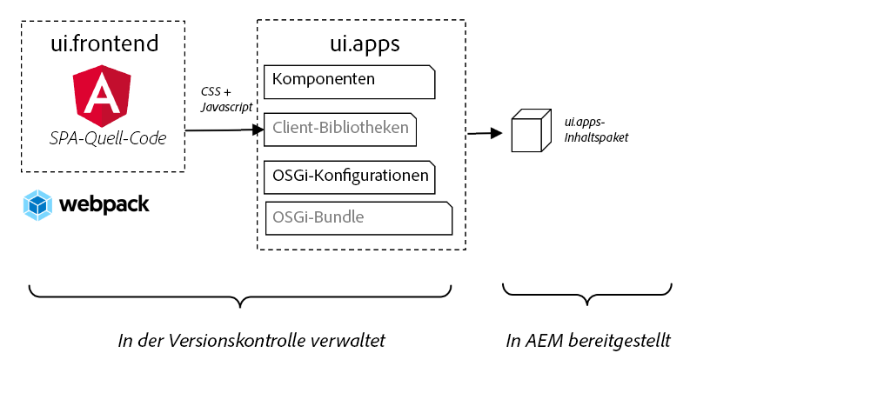

# SPA integrieren {#integrate-spa}

Erfahren Sie, wie der Quellcode für eine Einzelseiten-App (SPA), die auf Angular geschrieben wurde, in ein Adobe Experience Manager (AEM)-Projekt integriert werden kann. Erfahren Sie, wie Sie mit modernen Frontend-Tools wie einem Webpack Development Server die SPA schnell mit der AEM JSON-Modell-API entwickeln können.

## Ziel

1. Erfahren Sie, wie das SPA-Projekt in AEM mit Client-seitigen Bibliotheken integriert ist.
2. Erfahren Sie, wie Sie einen lokalen Entwicklungsserver für die dedizierte Front-End-Entwicklung verwenden.
3. Nutzung einer **Proxy** und statisch **mock** Datei für die Entwicklung mit der AEM JSON-Modell-API

## Was Sie erstellen werden

Dieses Kapitel fügt ein einfaches `Header` -Komponente in die SPA. Im Prozess der Erstellung dieser statischen `Header` -Komponente werden verschiedene Ansätze zur AEM SPA-Entwicklung verwendet.


*Der SPA wird erweitert, um einen statischen `Header` component*

## Voraussetzungen

Überprüfen Sie die erforderlichen Tools und Anweisungen zum Einrichten eines [lokale Entwicklungsumgebung](overview.md#local-dev-environment).

### Code abrufen

1. Laden Sie den Ausgangspunkt für dieses Tutorial über Git herunter:

   ```shell
   $ git clone git@github.com:adobe/aem-guides-wknd-spa.git
   $ cd aem-guides-wknd-spa
   $ git checkout Angular/integrate-spa-start
   ```

2. Stellen Sie die Codebasis mithilfe von Maven in einer lokalen AEM-Instanz bereit:

   ```shell
   $ mvn clean install -PautoInstallSinglePackage
   ```

   Wenn Sie [AEM 6.x](overview.md#compatibility) Fügen Sie die `classic` profile:

   ```shell
   $ mvn clean install -PautoInstallSinglePackage -Pclassic
   ```

Sie können den fertigen Code immer in [GitHub](https://github.com/adobe/aem-guides-wknd-spa/tree/Angular/integrate-spa-solution) oder den Code lokal auszuchecken, indem Sie zu der Verzweigung wechseln `Angular/integrate-spa-solution`.

## Integrationsansatz {#integration-approach}

Im Rahmen des AEM wurden zwei Module erstellt: `ui.apps` und `ui.frontend`.

Die `ui.frontend` -Modul [Webpack](https://webpack.js.org/) -Projekt, das den gesamten SPA Quellcode enthält. Ein Großteil der SPA Entwicklung und Tests erfolgt im webpack-Projekt. Wenn ein Produktions-Build ausgelöst wird, wird der SPA mithilfe des Webpack erstellt und kompiliert. Die kompilierten Artefakte (CSS und JavaScript) werden in die `ui.apps` -Modul, das dann zur AEM Laufzeit bereitgestellt wird.



*Eine allgemeine Darstellung der SPA Integration.*

Weitere Informationen zum Front-End-Build finden Sie unter [hier finden](https://experienceleague.adobe.com/docs/experience-manager-core-components/using/developing/archetype/uifrontend-angular.html).

## Inspect - SPA {#inspect-spa-integration}

Überprüfen Sie anschließend die `ui.frontend` -Modul, um die SPA zu verstehen, die automatisch von der [AEM Projektarchetyp](https://experienceleague.adobe.com/docs/experience-manager-core-components/using/developing/archetype/uifrontend-angular.html).

1. Öffnen Sie in der IDE Ihrer Wahl das AEM Projekt für die WKND-SPA. In diesem Tutorial wird die [Visual Studio Code-IDE](https://experienceleague.adobe.com/docs/experience-manager-learn/cloud-service/local-development-environment-set-up/development-tools.html?lang=de#microsoft-visual-studio-code).

   

2. Erweitern und überprüfen Sie die `ui.frontend` Ordner. Öffnen Sie die Datei `ui.frontend/package.json`

3. Unter dem `dependencies` sollten mehrere `@angular`:

   ```json
   "@angular/animations": "~9.1.11",
   "@angular/common": "~9.1.11",
   "@angular/compiler": "~9.1.11",
   "@angular/core": "~9.1.11",
   "@angular/forms": "~9.1.10",
   "@angular/platform-browser": "~9.1.10",
   "@angular/platform-browser-dynamic": "~9.1.10",
   "@angular/router": "~9.1.10",
   ```

   Die `ui.frontend` -Modul [Angular-Applikation](https://angular.io) generiert mithilfe der [Angular CLI-Tool](https://angular.io/cli) das Routing umfasst.

4. Es gibt auch drei Abhängigkeiten mit dem Präfix `@adobe`:

   ```json
   "@adobe/cq-angular-editable-components": "^2.0.2",
   "@adobe/cq-spa-component-mapping": "^1.0.3",
   "@adobe/cq-spa-page-model-manager": "^1.1.3",
   ```

   Die oben genannten Module bilden die [AEM SPA Editor JS SDK](https://experienceleague.adobe.com/docs/experience-manager-65/developing/headless/spas/spa-blueprint.html) und stellen die Funktionalität bereit, mit der es möglich ist, SPA Komponenten AEM Komponenten zuzuordnen.

5. Im `package.json` Datei mehrere `scripts` definiert werden:

   ```json
   "scripts": {
       "start": "ng serve --open --proxy-config ./proxy.conf.json",
       "build": "ng lint && ng build && clientlib",
       "build:production": "ng lint && ng build --prod && clientlib",
       "test": "ng test",
       "sync": "aemsync -d -w ../ui.apps/src/main/content"
   }
   ```

   Diese Skripte basieren auf gängigen [Angular CLI-Befehle](https://angular.io/cli/build) wurden jedoch geringfügig geändert, um mit dem größeren AEM-Projekt zu arbeiten.

   `start` - führt die Angular-App lokal über einen lokalen Webserver aus. Es wurde aktualisiert, um den Inhalt der lokalen AEM-Instanz zu simulieren.

   `build` - kompiliert die Angular-App für die Produktionsverteilung. Die Hinzufügung von `&& clientlib` ist für das Kopieren der kompilierten SPA in die `ui.apps` -Modul als clientseitige Bibliothek während eines Builds. Das npm-Modul [aem-clientlib-generator](https://github.com/wcm-io-frontend/aem-clientlib-generator) wird verwendet, um dies zu erleichtern.

   Weitere Informationen zu den verfügbaren Skripten finden Sie unter [here](https://experienceleague.adobe.com/docs/experience-manager-core-components/using/developing/archetype/uifrontend-angular.html).

6. Prüfen Sie die Datei `ui.frontend/clientlib.config.js`. Diese Konfigurationsdatei wird von [aem-clientlib-generator](https://github.com/wcm-io-frontend/aem-clientlib-generator#clientlibconfigjs) , um zu bestimmen, wie die Client-Bibliothek generiert wird.

7. Prüfen Sie die Datei `ui.frontend/pom.xml`. Diese Datei transformiert die `ui.frontend` Ordner in ein [Maven-Modul](https://maven.apache.org/guides/mini/guide-multiple-modules.html). Die `pom.xml` wurde aktualisiert, um die [frontend-maven-plugin](https://github.com/eirslett/frontend-maven-plugin) nach **test** und **build** die SPA während eines Maven-Builds.

8. Inspect der Datei `app.component.ts` at `ui.frontend/src/app/app.component.ts`:

   ```js
   import { Constants } from '@adobe/cq-angular-editable-components';
   import { ModelManager } from '@adobe/cq-spa-page-model-manager';
   import { Component } from '@angular/core';
   
   @Component({
   selector: '#spa-root', // tslint:disable-line
   styleUrls: ['./app.component.css'],
   templateUrl: './app.component.html'
   })
   export class AppComponent {
       ...
   
       constructor() {
           ModelManager.initialize().then(this.updateData);
       }
   
       private updateData = pageModel => {
           this.path = pageModel[Constants.PATH_PROP];
           this.items = pageModel[Constants.ITEMS_PROP];
           this.itemsOrder = pageModel[Constants.ITEMS_ORDER_PROP];
       }
   }
   ```

   `app.component.js` ist der Einstiegspunkt des SPA. `ModelManager` wird vom AEM SPA Editor JS SDK bereitgestellt. Es ist für das Aufrufen und Einfügen der `pageModel` (der JSON-Inhalt) in die Anwendung.

## Hinzufügen einer Kopfzeilenkomponente {#header-component}

Fügen Sie anschließend eine neue Komponente zum SPA hinzu und stellen Sie die Änderungen auf einer lokalen AEM-Instanz bereit, um die Integration anzuzeigen.

1. Öffnen Sie ein neues Terminal-Fenster und navigieren Sie zum Ordner `ui.frontend`:

   ```shell
   $ cd aem-guides-wknd-spa/ui.frontend
   ```

2. Installieren [Angular CLI](https://angular.io/cli#installing-angular-cli) global Dies wird zum Generieren von Angular-Komponenten sowie zum Erstellen und Bereitstellen der Angular-Anwendung über die **ng** Befehl.

   ```shell
   $ npm install -g @angular/cli
   ```

   >[!CAUTION]
   >
   > Die Version von **@angular/cli** von diesem Projekt verwendet wird **9.1.7**. Es wird empfohlen, die Angular-CLI-Versionen synchron zu halten.

3. Erstellen Sie eine neue `Header` -Komponente durch Ausführen der Angular-CLI `ng generate component` -Befehl innerhalb von `ui.frontend` Ordner.

   ```shell
   $ ng generate component components/header
   
   CREATE src/app/components/header/header.component.css (0 bytes)
   CREATE src/app/components/header/header.component.html (21 bytes)
   CREATE src/app/components/header/header.component.spec.ts (628 bytes)
   CREATE src/app/components/header/header.component.ts (269 bytes)
   UPDATE src/app/app.module.ts (1809 bytes)
   ```

   Dadurch wird ein Skelett für die neue Angular-Header-Komponente unter erstellt. `ui.frontend/src/app/components/header`.

4. Öffnen Sie die `aem-guides-wknd-spa` -Projekt in der IDE Ihrer Wahl. Navigieren Sie zum Ordner `ui.frontend/src/app/components/header`. 

   

5. Öffnen Sie die Datei `header.component.html` und ersetzen Sie den Inhalt durch Folgendes:

   ```html
   <!--/* header.component.html */-->
   <header className="header">
       <div className="header-container">
           <h1>WKND</h1>
       </div>
   </header>
   ```

   Beachten Sie, dass hier statische Inhalte angezeigt werden, sodass diese Angular-Komponente keine Anpassungen am standardmäßig generierten Inhalt erfordert `header.component.ts`.

6. Öffnen Sie die Datei **app.component.html** at  `ui.frontend/src/app/app.component.html`. Fügen Sie die `app-header`:

   ```html
   <app-header></app-header>
   <router-outlet></router-outlet>
   ```

   Dies umfasst die `header` -Komponente vor allem den Seiteninhalt.

7. Öffnen Sie ein neues Terminal und navigieren Sie zum `ui.frontend` und führen Sie die `npm run build` command:

   ```shell
   $ cd ui.frontend
   $ npm run build
   
   Linting "angular-app"...
   All files pass linting.
   Generating ES5 bundles for differential loading...
   ES5 bundle generation complete.
   ```

8. Navigieren Sie zum Ordner `ui.apps`. darunter `ui.apps/src/main/content/jcr_root/apps/wknd-spa-angular/clientlibs/clientlib-angular` Sie sollten sehen, dass die kompilierten SPA aus dem`ui.frontend/build` Ordner.

   

9. Kehren Sie zum Terminal zurück und navigieren Sie zum `ui.apps` Ordner. Führen Sie den folgenden Maven-Befehl aus:

   ```shell
   $ cd ../ui.apps
   $ mvn clean install -PautoInstallPackage
   ...
   [INFO] ------------------------------------------------------------------------
   [INFO] BUILD SUCCESS
   [INFO] ------------------------------------------------------------------------
   [INFO] Total time:  9.629 s
   [INFO] Finished at: 2020-05-04T17:48:07-07:00
   [INFO] ------------------------------------------------------------------------
   ```

   Dadurch wird die `ui.apps` auf eine lokale, laufende Instanz von AEM.

10. Öffnen Sie eine Browser-Registerkarte und navigieren Sie zu [http://localhost:4502/editor.html/content/wknd-spa-angular/us/en/home.html](http://localhost:4502/editor.html/content/wknd-spa-angular/us/en/home.html). Sie sollten nun den Inhalt der `Header` -Komponente in der SPA angezeigt.

   

   Schritte **7-9** werden automatisch ausgeführt, wenn ein Maven-Build aus dem Stammverzeichnis des Projekts ausgelöst wird (d. h. `mvn clean install -PautoInstallSinglePackage`). Sie sollten jetzt die Grundlagen der Integration zwischen den SPA- und AEM Client-seitigen Bibliotheken verstehen. Beachten Sie, dass Sie weiterhin bearbeiten und hinzufügen können. `Text` Komponenten in AEM, jedoch die `Header` -Komponente nicht bearbeitbar ist.

## Webpack Dev Server - Proxy der JSON-API {#proxy-json}

Wie in den vorherigen Übungen gezeigt, dauert es einige Minuten, einen Build durchzuführen und die Client-Bibliothek mit einer lokalen Instanz von AEM zu synchronisieren. Dies ist für Endtests akzeptabel, aber nicht ideal für den Großteil der SPA.

A [webpack-Dev-Server](https://webpack.js.org/configuration/dev-server/) kann zur schnellen Entwicklung des SPA verwendet werden. Die SPA wird von einem JSON-Modell gesteuert, das von AEM generiert wurde. In dieser Übung lautet der JSON-Inhalt einer laufenden Instanz von AEM **proxid** in den vom Entwicklungs-Server konfigurierten Entwicklungsserver [Angular-Projekt](https://angular.io/guide/build).

1. Kehren Sie zur IDE zurück und öffnen Sie die Datei . **proxy.conf.json** at `ui.frontend/proxy.conf.json`.

   ```json
   [
       {
           "context": [
                       "/content/**/*.(jpg|jpeg|png|model.json)",
                       "/etc.clientlibs/**/*"
                   ],
           "target": "http://localhost:4502",
           "auth": "admin:admin",
           "logLevel": "debug"
       }
   ]
   ```

   Die [Angular-App](https://angular.io/guide/build#proxying-to-a-backend-server) bietet einen einfachen Mechanismus zum Proxy von API-Anfragen. Die in `context` über `localhost:4502`, der lokale AEM Schnellstart.

2. Öffnen Sie die Datei **index.html** at `ui.frontend/src/index.html`. Dies ist die HTML-Stammdatei, die vom Dev-Server verwendet wird.

   Beachten Sie, dass ein Eintrag für `base href="/"`. Die [base-Tag](https://angular.io/guide/deployment#the-base-tag) ist wichtig, damit die App relative URLs auflöst.

   ```html
   <base href="/">
   ```

3. Öffnen Sie ein Terminal-Fenster und navigieren Sie zum `ui.frontend` Ordner. Führen Sie den Befehl `npm start` aus:

   ```shell
   $ cd ui.frontend
   $ npm start
   
   > wknd-spa-angular@0.1.0 start /Users/dgordon/Documents/code/aem-guides-wknd-spa/ui.frontend
   > ng serve --open --proxy-config ./proxy.conf.json
   
   10% building 3/3 modules 0 active[HPM] Proxy created: [ '/content/**/*.(jpg|jpeg|png|model.json)', '/etc.clientlibs/**/*' ]  ->  http://localhost:4502
   [HPM] Subscribed to http-proxy events:  [ 'error', 'close' ]
   ℹ ｢wds｣: Project is running at http://localhost:4200/webpack-dev-server/
   ℹ ｢wds｣: webpack output is served from /
   ℹ ｢wds｣: 404s will fallback to //index.html
   ```

4. Öffnen Sie eine neue Browser-Registerkarte (falls noch nicht geöffnet) und navigieren Sie zu [http://localhost:4200/content/wknd-spa-angular/us/en/home.html](http://localhost:4200/content/wknd-spa-angular/us/en/home.html).

   

   Sie sollten denselben Inhalt wie in AEM sehen, jedoch ohne eine der Authoring-Funktionen aktiviert zu haben.

5. Kehren Sie zur IDE zurück und erstellen Sie einen neuen Ordner mit dem Namen `img` at `ui.frontend/src/assets`.
6. Laden Sie das folgende WKND-Logo herunter und fügen Sie es zum `img` Ordner:

   

7. Öffnen **header.component.html** at `ui.frontend/src/app/components/header/header.component.html` und das Logo einfügen:

   ```html
   <header class="header">
       <div class="header-container">
           <div class="logo">
               
           </div>
       </div>
   </header>
   ```

   Speichern Sie die Änderungen in **header.component.html**.

8. Kehren Sie zum Browser zurück. Sie sollten die Änderungen an der App sofort sehen.

   

   Sie können Inhaltsaktualisierungen in **AEM** und sehen Sie sie in **webpack-Dev-Server**, da wir den Inhalt proxieren. Beachten Sie, dass die Inhaltsänderungen nur im **webpack-Dev-Server**.

9. Beenden Sie den lokalen Webserver mit `ctrl+c` im Terminal.

## Webpack Dev Server - JSON-API nachahmen {#mock-json}

Ein weiterer Ansatz für die schnelle Entwicklung besteht darin, eine statische JSON-Datei zu verwenden, um als JSON-Modell zu fungieren. Durch &quot;nachahmen&quot;der JSON entfernen wir die Abhängigkeit von einer lokalen AEM-Instanz. Darüber hinaus kann ein Frontend-Entwickler das JSON-Modell aktualisieren, um die Funktionalität zu testen und Änderungen an der JSON-API vorzunehmen, die später von einem Back-End-Entwickler implementiert würden.

Die anfängliche Einrichtung der JSON-nachgeahmten Datei **eine lokale AEM-Instanz benötigen**.

1. Navigieren Sie im Browser zu [http://localhost:4502/content/wknd-spa-angular/us/en.model.json](http://localhost:4502/content/wknd-spa-angular/us/en.model.json).

   Dies ist die von AEM exportierte JSON, die die Anwendung steuert. Kopieren Sie die JSON-Ausgabe.

2. Kehren Sie zur IDE zurück und navigieren Sie zu `ui.frontend/src` und fügen Sie neue Ordner hinzu namens **Mäuse** und **json** , um die folgende Ordnerstruktur abzugleichen:

   ```plain
   |-- ui.frontend
       |-- src
           |-- mocks
               |-- json
   ```

3. Erstellen Sie eine neue Datei mit dem Namen **en.model.json** unter `ui.frontend/public/mocks/json`. Fügen Sie die JSON-Ausgabe aus **Schritt 1** hier.

   

4. Neue Datei erstellen **proxy.mock.conf.json** unter `ui.frontend`. Füllen Sie die Datei mit folgendem Inhalt:

   ```json
   [
       {
       "context": [
           "/content/**/*.model.json"
       ],
       "pathRewrite": { "^/content/wknd-spa-angular/us" : "/mocks/json"} ,
       "target": "http://localhost:4200",
       "logLevel": "debug"
       }
   ]
   ```

   Diese Proxykonfiguration schreibt Anforderungen neu, die mit `/content/wknd-spa-angular/us` mit `/mocks/json` und bedienen die entsprechende statische JSON-Datei, z. B.:

   ```plain
   /content/wknd-spa-angular/us/en.model.json -> /mocks/json/en.model.json
   ```

5. Öffnen Sie die Datei **angular.json**. Hinzufügen neuer **dev** Konfiguration mit aktualisierter **Assets** Array, das auf die **Mäuse** Ordner erstellt.

   ```json
    "dev": {
             "assets": [
               "src/mocks",
               "src/assets",
               "src/favicon.ico",
               "src/logo192.png",
               "src/logo512.png",
               "src/manifest.json"
             ]
       },
   ```

   

   Erstellung eines dedizierten **dev** -Konfiguration stellt sicher, dass **Mäuse** -Ordner wird nur während der Entwicklung verwendet und nie in einem Produktions-Build AEM bereitgestellt.

6. Im **angular.json** -Datei, dann aktualisieren Sie die **browserTarget** Konfiguration zur Verwendung der neuen **dev** Konfiguration:

   ```diff
     ...
     "serve": {
         "builder": "@angular-devkit/build-angular:dev-server",
         "options": {
   +       "browserTarget": "angular-app:build:dev"
   -       "browserTarget": "angular-app:build"
         },
     ...
   ```

   

7. Öffnen Sie die Datei `ui.frontend/package.json` und fügen Sie eine neue **start:mock** -Befehl zum Referenzieren der **proxy.mock.conf.json** -Datei.

   ```diff
       "scripts": {
           "start": "ng serve --open --proxy-config ./proxy.conf.json",
   +       "start:mock": "ng serve --open --proxy-config ./proxy.mock.conf.json",
           "build": "ng lint && ng build && clientlib",
           "build:production": "ng lint && ng build --prod && clientlib",
           "test": "ng test",
           "sync": "aemsync -d -w ../ui.apps/src/main/content"
       }
   ```

   Durch Hinzufügen eines neuen Befehls ist es einfach, zwischen den Proxy-Konfigurationen umzuschalten.

8. Wenn sie derzeit ausgeführt wird, beenden Sie die **webpack-Dev-Server**. Starten Sie die **webpack-Dev-Server** mithilfe der **start:mock** script:

   ```shell
   $ npm run start:mock
   
   > wknd-spa-angular@0.1.0 start:mock /Users/dgordon/Documents/code/aem-guides-wknd-spa/ui.frontend
   > ng serve --open --proxy-config ./proxy.mock.conf.json
   ```

   Navigieren Sie zu [http://localhost:4200/content/wknd-spa-angular/us/en/home.html](http://localhost:4200/content/wknd-spa-angular/us/en/home.html) und Sie sollten denselben SPA sehen, aber der Inhalt wird jetzt aus dem **mock** JSON-Datei.

9. Nehmen Sie eine kleine Änderung an der **en.model.json** zuvor erstellte Datei. Der aktualisierte Inhalt sollte sofort in der **webpack-Dev-Server**.

   

   Die Fähigkeit, das JSON-Modell zu bearbeiten und die Auswirkungen auf eine Live-SPA zu sehen, kann Entwicklern dabei helfen, die JSON-Modell-API zu verstehen. Es ermöglicht auch die parallele Entwicklung von Frontend- und Backend-Anwendungen.

## Stile mit Sass hinzufügen

Als Nächstes werden dem Projekt einige Stile hinzugefügt, die aktualisiert wurden. Dieses Projekt wird [Sass](https://sass-lang.com/) Unterstützung für einige nützliche Funktionen wie Variablen.

1. Öffnen Sie ein Terminal-Fenster und stoppen Sie die **webpack-Dev-Server** wenn gestartet. Von innen `ui.frontend` Ordner geben Sie den folgenden Befehl ein, um die Angular-App zur Verarbeitung zu aktualisieren **.scss** Dateien.

   ```shell
   $ cd ui.frontend
   $ ng config schematics.@schematics/angular:component.styleext scss
   ```

   Dadurch wird die `angular.json` Datei mit einem neuen Eintrag am Ende der Datei:

   ```json
   "schematics": {
       "@schematics/angular:component": {
       "styleext": "scss"
       }
   }
   ```

2. Installieren `normalize-scss` um die Stile über Browser hinweg zu normalisieren:

   ```shell
   $ npm install normalize-scss --save
   ```

3. Kehren Sie zur IDE und unter zurück. `ui.frontend/src` Erstellen Sie einen neuen Ordner mit dem Namen `styles`.
4. Erstellen Sie eine neue Datei unter `ui.frontend/src/styles` benannt `_variables.scss` und fügen Sie die folgenden Variablen hinzu:

   ```scss
   //_variables.scss
   
   //== Colors
   //
   //## Gray and brand colors for use across theme.
   
   $black:                  #202020;
   $gray:                   #696969;
   $gray-light:             #EBEBEB;
   $gray-lighter:           #F7F7F7;
   $white:                  #FFFFFF;
   $yellow:                 #FFEA00;
   $blue:                   #0045FF;
   
   
   //== Typography
   //
   //## Font, line-height, and color for body text, headings, and more.
   
   $font-family-sans-serif:  "Helvetica Neue", Helvetica, Arial, sans-serif;
   $font-family-serif:       Georgia, "Times New Roman", Times, serif;
   $font-family-base:        $font-family-sans-serif;
   $font-size-base:          18px;
   
   $line-height-base:        1.5;
   $line-height-computed:    floor(($font-size-base * $line-height-base));
   
   // Functional Colors
   $brand-primary:             $yellow;
   $body-bg:                   $white;
   $text-color:                $black;
   $text-color-inverse:        $gray-light;
   $link-color:                $blue;
   
   //Layout
   $max-width: 1024px;
   $header-height: 75px;
   
   // Spacing
   $gutter-padding: 12px;
   ```

5. Benennen Sie die Erweiterung der Datei erneut. **styles.css** at `ui.frontend/src/styles.css` nach **styles.scss**. Ersetzen Sie den Inhalt durch Folgendes:

   ```scss
   /* styles.scss * /
   
   /* Normalize */
   @import '~normalize-scss/sass/normalize';
   
   @import './styles/variables';
   
   body {
       background-color: $body-bg;
       font-family: $font-family-base;
       margin: 0;
       padding: 0;
       font-size: $font-size-base;
       text-align: left;
       color: $text-color;
       line-height: $line-height-base;
   }
   
   body.page {
       max-width: $max-width;
       margin: 0 auto;
       padding: $gutter-padding;
       padding-top: $header-height;
   }
   ```

6. Aktualisieren **angular.json** und alle Verweise auf **style.css** mit **styles.scss**. Es sollte 3 Verweise geben.

   ```diff
     "styles": [
   -    "src/styles.css"
   +    "src/styles.scss"
      ],
   ```

## Header-Stile aktualisieren

Fügen Sie als Nächstes einige markenspezifische Stile zum **Kopfzeile** Komponente mit Sass.

1. Starten Sie die **webpack-Dev-Server** um die Stile zu sehen, die in Echtzeit aktualisiert werden:

   ```shell
   $ npm run start:mock
   ```

2. under `ui.frontend/src/app/components/header` rename **header.component.css** nach **header.component.scss**. Füllen Sie die Datei mit folgendem Inhalt:

   ```scss
   @import "~src/styles/variables";
   
   .header {
       width: 100%;
       position: fixed;
       top: 0;
       left:0;
       z-index: 99;
       background-color: $brand-primary;
       box-shadow: 0px 0px 10px 0px rgba(0, 0, 0, 0.24);
   }
   
   .header-container {
       display: flex;
       max-width: $max-width;
       margin: 0 auto;
       padding-left: $gutter-padding;
       padding-right: $gutter-padding;
   }
   
   .logo {
       z-index: 100;
       display: flex;
       padding-top: $gutter-padding;
       padding-bottom: $gutter-padding;
   }
   
   .logo-img {
       width: 100px;
   }
   ```

3. Aktualisieren **header.component.ts** Verweis **header.component.scss**:

   ```diff
   ...
     @Component({
       selector: 'app-header',
       templateUrl: './header.component.html',
   -   styleUrls: ['./header.component.css']
   +   styleUrls: ['./header.component.scss']
     })
   ...
   ```

4. Kehren Sie zum Browser zurück und **webpack-Dev-Server**:

   

   Sie sollten nun die aktualisierten Stile sehen, die zum **Kopfzeile** -Komponente.

## Bereitstellen SPA Updates für AEM

Die Änderungen an den **Kopfzeile** sind derzeit nur über die **webpack-Dev-Server**. Stellen Sie die aktualisierte SPA für AEM bereit, um die Änderungen anzuzeigen.

1. Stoppen Sie die **webpack-Dev-Server**.
2. Navigieren zum Stammverzeichnis des Projekts `/aem-guides-wknd-spa` und stellen Sie das Projekt mithilfe von Maven für AEM bereit:

   ```shell
   $ cd ..
   $ mvn clean install -PautoInstallSinglePackage
   ```

3. Navigieren Sie zu [http://localhost:4502/editor.html/content/wknd-spa-angular/us/en/home.html](http://localhost:4502/editor.html/content/wknd-spa-angular/us/en/home.html). Sie sollten die aktualisierte **Kopfzeile** mit angewendetem Logo und angewendeten Stilen:

   

   Nachdem sich die aktualisierte SPA in AEM befindet, kann die Bearbeitung fortgesetzt werden.

## Herzlichen Glückwunsch! {#congratulations}

Herzlichen Glückwunsch, Sie haben die SPA aktualisiert und die Integration mit AEM untersucht! Sie kennen jetzt zwei verschiedene Ansätze zur Entwicklung des SPA mit der AEM JSON-Modell-API mit einer **webpack-Dev-Server**.

Sie können den fertigen Code immer in [GitHub](https://github.com/adobe/aem-guides-wknd-spa/tree/Angular/integrate-spa-solution) oder den Code lokal auszuchecken, indem Sie zu der Verzweigung wechseln `Angular/integrate-spa-solution`.

### Nächste Schritte {#next-steps}

[Zuordnen SPA Komponenten zu AEM Komponenten](map-components.md) - Erfahren Sie, wie Sie Angular-Komponenten Adobe Experience Manager-Komponenten (AEM) mit dem AEM SPA Editor JS SDK zuordnen. Die Komponentenzuordnung ermöglicht es Autoren, im AEM SPA Editor dynamische Aktualisierungen an SPA -Komponenten vorzunehmen, ähnlich wie beim herkömmlichen AEM.
