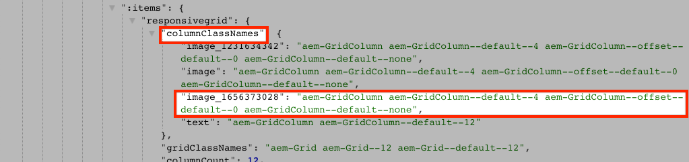

# Zuordnen SPA Komponenten zu AEM Komponenten {#map-components}

Erfahren Sie, wie Sie Angular-Komponenten Adobe Experience Manager-Komponenten (AEM) mit dem AEM SPA Editor JS SDK zuordnen. Die Komponentenzuordnung ermöglicht es Benutzern, im AEM SPA Editor dynamische Aktualisierungen an SPA -Komponenten vorzunehmen, ähnlich wie beim herkömmlichen AEM.

In diesem Kapitel werden die AEM JSON-Modell-API und die Möglichkeiten erläutert, wie der von einer AEM-Komponente angezeigte JSON-Inhalt automatisch als Props in eine Angular-Komponente eingefügt werden kann.

## Ziel

1. Erfahren Sie, wie Sie AEM Komponenten SPA Komponenten zuordnen.
2. den Unterschied zwischen **Container** Komponenten und **Inhalt** Komponenten.
3. Erstellen Sie eine neue Angular-Komponente, die einer vorhandenen AEM zugeordnet ist.

## Was Sie erstellen werden

In diesem Kapitel wird untersucht, wie die `Text` SPA Komponente wird der AEM zugeordnet `Text`-Komponente. Eine neue `Image` SPA Komponente wird erstellt, die in der SPA verwendet und in AEM erstellt werden kann. Vorkonfigurierte Funktionen der **Layout-Container** und **Vorlagen-Editor** -Richtlinien werden auch verwendet, um eine Ansicht zu erstellen, die etwas abwechslungsreicher erscheint.


## Voraussetzungen

Überprüfen Sie die erforderlichen Tools und Anweisungen zum Einrichten eines [lokale Entwicklungsumgebung](overview.md#local-dev-environment).

### Code abrufen

1. Laden Sie den Ausgangspunkt für dieses Tutorial über Git herunter:

   ```shell
   $ git clone git@github.com:adobe/aem-guides-wknd-spa.git
   $ cd aem-guides-wknd-spa
   $ git checkout Angular/map-components-start
   ```

2. Stellen Sie die Codebasis mithilfe von Maven in einer lokalen AEM-Instanz bereit:

   ```shell
   $ mvn clean install -PautoInstallSinglePackage
   ```

   Wenn Sie [AEM 6.x](overview.md#compatibility) Fügen Sie die `classic` profile:

   ```shell
   $ mvn clean install -PautoInstallSinglePackage -Pclassic
   ```

Sie können den fertigen Code immer in [GitHub](https://github.com/adobe/aem-guides-wknd-spa/tree/Angular/map-components-solution) oder den Code lokal auszuchecken, indem Sie zu der Verzweigung wechseln `Angular/map-components-solution`.

## Mapping-Ansatz

Das grundlegende Konzept besteht darin, eine SPA Komponente einer AEM Komponente zuzuordnen. AEM Komponenten, Server-seitig ausführen, Inhalte als Teil der JSON-Modell-API exportieren. Der JSON-Inhalt wird vom SPA verwendet, der clientseitig im Browser ausgeführt wird. Es wird eine 1:1-Zuordnung zwischen SPA Komponenten und einer AEM Komponente erstellt.


*Allgemeine Übersicht über die Zuordnung einer AEM-Komponente zu einer Angular-Komponente*

## Inspect der Textkomponente

Die [AEM Projektarchetyp](https://github.com/adobe/aem-project-archetype) bietet eine `Text` Komponente, die dem AEM zugeordnet ist [Textkomponente](https://experienceleague.adobe.com/docs/experience-manager-core-components/using/components/text.html?lang=de). Dies ist ein Beispiel für eine **content** Komponente, da sie *content* von AEM.

Sehen wir uns an, wie die Komponente funktioniert.

### Inspect des JSON-Modells

1. Bevor Sie in den SPA-Code springen, müssen Sie das von AEM bereitgestellte JSON-Modell verstehen. Navigieren Sie zum [Kernkomponentenbibliothek](https://www.aemcomponents.dev/content/core-components-examples/library/core-content/text.html) und zeigen Sie die Seite für die Textkomponente an. Die Kernkomponentenbibliothek enthält Beispiele für alle AEM Kernkomponenten.
2. Wählen Sie die **JSON** für eines der folgenden Beispiele:

   

   Es sollten drei Eigenschaften angezeigt werden: `text`, `richText`und `:type`.

   `:type` ist eine reservierte Eigenschaft, die die `sling:resourceType` (oder Pfad) der AEM Komponente. Der Wert von `:type` wird verwendet, um die AEM Komponente der SPA zuzuordnen.

   `text` und `richText` sind zusätzliche Eigenschaften, die für die SPA-Komponente verfügbar gemacht werden.

### Inspect der Textkomponente

1. Öffnen Sie ein neues Terminal und navigieren Sie zum `ui.frontend` Ordner innerhalb des Projekts. Ausführen `npm install` und dann `npm start` , um **webpack-Dev-Server**:

   ```shell
   $ cd ui.frontend
   $ npm run start:mock
   ```

   Die `ui.frontend` -Modul eingerichtet ist, um die [JSON-Modell nachahmen](./integrate-spa.md#mock-json).

2. Es sollte ein neues Browserfenster geöffnet sein, in dem [http://localhost:4200/content/wknd-spa-angular/us/en/home.html](http://localhost:4200/content/wknd-spa-angular/us/en/home.html)

   

3. Öffnen Sie in der IDE Ihrer Wahl das AEM Projekt für die WKND-SPA. Erweitern Sie die `ui.frontend` -Modul und öffnen Sie die -Datei **text.component.ts** under `ui.frontend/src/app/components/text/text.component.ts`:

   

4. Der erste zu prüfende Bereich ist die `class TextComponent` bei ~line 35:

   ```js
   export class TextComponent {
       @Input() richText: boolean;
       @Input() text: string;
       @Input() itemName: string;
   
       @HostBinding('innerHtml') get content() {
           return this.richText
           ? this.sanitizer.bypassSecurityTrustHtml(this.text)
           : this.text;
       }
       @HostBinding('attr.data-rte-editelement') editAttribute = true;
   
       constructor(private sanitizer: DomSanitizer) {}
   }
   ```

   [@Input()](https://angular.io/api/core/Input) dekorator wird verwendet, um Felder zu deklarieren, deren Werte über das zugeordnete JSON-Objekt festgelegt werden, das zuvor überprüft wurde.

   `@HostBinding('innerHtml') get content()` ist eine Methode, die den erstellten Textinhalt aus dem Wert von `this.text`. Wenn es sich bei dem Inhalt um Rich-Text handelt (bestimmt durch die Variable `this.richText` Markierung) Die integrierte Sicherheitsfunktion von Angular wird umgangen. Angular [DomSanitizer](https://angular.io/api/platform-browser/DomSanitizer) wird verwendet, um die unformatierte HTML zu scrubben und Sicherheitslücken beim Cross Site Scripting zu vermeiden. Die -Methode ist an die `innerHtml` -Eigenschaft mithilfe der [@HostBinding](https://angular.io/api/core/HostBinding) Dekorator.

5. Nächste Überprüfung der `TextEditConfig` bei ~Zeile 24:

   ```js
   const TextEditConfig = {
       emptyLabel: 'Text',
       isEmpty: cqModel =>
           !cqModel || !cqModel.text || cqModel.text.trim().length < 1
   };
   ```

   Der obige Code ist für die Bestimmung verantwortlich, wann der Platzhalter in der AEM Autorenumgebung wiedergegeben werden soll. Wenn die Variable `isEmpty` Methodenzurückgaben **true** dann wird der Platzhalter gerendert.

6. Sehen Sie sich abschließend die `MapTo` Aufruf bei ~line 53:

   ```js
   MapTo('wknd-spa-angular/components/text')(TextComponent, TextEditConfig );
   ```

   **MapTo** wird vom AEM SPA Editor JS SDK (`@adobe/cq-angular-editable-components`). Der Pfad `wknd-spa-angular/components/text` steht für `sling:resourceType` der AEM Komponente. Dieser Pfad entspricht dem `:type` durch das zuvor beobachtete JSON-Modell verfügbar gemacht werden. **MapTo** analysiert die JSON-Modellantwort und übergibt die richtigen Werte an die `@Input()` Variablen der SPA Komponente.

   Sie finden die AEM `Text` Komponentendefinition unter `ui.apps/src/main/content/jcr_root/apps/wknd-spa-angular/components/text`.

7. Experiment durch Ändern der **en.model.json** Datei unter `ui.frontend/src/mocks/json/en.model.json`.

   Aktualisieren Sie bei ~line 62 die erste `Text` -Wert zu verwenden **`H1`** und **`u`** Tags:

   ```json
       "text": {
           "text": "<h1><u>Hello World!</u></h1>",
           "richText": true,
           ":type": "wknd-spa-angular/components/text"
       }
   ```

   Kehren Sie zum Browser zurück, um die vom **webpack-Dev-Server**:

   

   Versuchen Sie, die `richText` Eigenschaft zwischen **true** / **false** , um die Renderlogik in Aktion zu sehen.

8. Inspect **text.component.html** at `ui.frontend/src/app/components/text/text.component.html`.

   Diese Datei ist leer, da der gesamte Inhalt der Komponente durch die Variable `innerHTML` -Eigenschaft.

9. Inspect **app.module.ts** at `ui.frontend/src/app/app.module.ts`.

   ```js
   @NgModule({
   imports: [
       BrowserModule,
       SpaAngularEditableComponentsModule,
       AppRoutingModule
   ],
   providers: [ModelManagerService, { provide: APP_BASE_HREF, useValue: '/' }],
   declarations: [AppComponent, TextComponent, PageComponent, HeaderComponent],
   entryComponents: [TextComponent, PageComponent],
   bootstrap: [AppComponent]
   })
   export class AppModule {}
   ```

   Die **TextComponent** ist nicht explizit enthalten, sondern dynamisch über **AEMResponsiveGridComponent** bereitgestellt vom AEM SPA Editor JS SDK. Daher muss in der **app.module.ts**&#39; [entryComponents](https://angular.io/guide/entry-components) Array.

## Erstellen der Bildkomponente

Erstellen Sie anschließend eine `Image` Angular-Komponente, die dem AEM zugeordnet ist [Bildkomponente](https://experienceleague.adobe.com/docs/experience-manager-core-components/using/components/image.html?lang=de). Die `Image` -Komponente ist ein weiteres Beispiel für eine **content** -Komponente.

### Inspect the JSON

Bevor Sie in den SPA-Code springen, überprüfen Sie das von AEM bereitgestellte JSON-Modell.

1. Navigieren Sie zum [Bildbeispiele in der Kernkomponentenbibliothek](https://www.aemcomponents.dev/content/core-components-examples/library/core-content/image.html).

   

   Eigenschaften von `src`, `alt`und `title` werden zum Ausfüllen der SPA verwendet `Image` -Komponente.

   >[!NOTE]
   >
   > Es werden andere Bildeigenschaften bereitgestellt (`lazyEnabled`, `widths`), die es einem Entwickler ermöglichen, eine adaptive und verzögerte Ladekomponente zu erstellen. Die in diesem Tutorial erstellte Komponente ist einfach und erfüllt folgende Aufgaben: **not** Verwenden Sie diese erweiterten Eigenschaften.

2. Kehren Sie zu Ihrer IDE zurück und öffnen Sie die `en.model.json` at `ui.frontend/src/mocks/json/en.model.json`. Da dies eine netto-neue Komponente für unser Projekt ist, müssen wir die Bild-JSON &quot;nachahmen&quot;.

   Fügen Sie in ~line 70 einen JSON-Eintrag für die `image` -Modell (vergessen Sie nicht das nachfolgende Komma) `,` nach dem zweiten `text_386303036`) und aktualisieren Sie die `:itemsOrder` Array.

   ```json
   ...
   ":items": {
               ...
               "text_386303036": {
                   "text": "<p>A new text component.</p>\r\n",
                   "richText": true,
                   ":type": "wknd-spa-angular/components/text"
                   },
               "image": {
                   "alt": "Rock Climber in New Zealand",
                   "title": "Rock Climber in New Zealand",
                   "src": "/mocks/images/adobestock-140634652.jpeg",
                   ":type": "wknd-spa-angular/components/image"
               }
           },
           ":itemsOrder": [
               "text",
               "text_386303036",
               "image"
           ],
   ```

   Das Projekt enthält ein Beispielbild unter `/mock-content/adobestock-140634652.jpeg` , die mit der **webpack-Dev-Server**.

   Sie können die vollständige [en.model.json hier](https://github.com/adobe/aem-guides-wknd-spa/blob/Angular/map-components-solution/ui.frontend/src/mocks/json/en.model.json).

3. Fügen Sie ein Lagerbild hinzu, das von der Komponente angezeigt werden soll.

   Erstellen Sie einen neuen Ordner mit dem Namen **images** unter `ui.frontend/src/mocks`. Download [adobestock-140634652.jpeg](assets/map-components/adobestock-140634652.jpeg) und platzieren Sie sie in der neu erstellten **images** Ordner. Sie können bei Bedarf Ihr eigenes Bild verwenden.

### Implementieren der Bildkomponente

1. Stoppen Sie die **webpack-Dev-Server** wenn gestartet.
2. Erstellen einer neuen Bildkomponente durch Ausführen der Angular-CLI `ng generate component` -Befehl innerhalb von `ui.frontend` Ordner:

   ```shell
   $ ng generate component components/image
   ```

3. Öffnen Sie in der IDE **image.component.ts** at `ui.frontend/src/app/components/image/image.component.ts` und aktualisieren Sie wie folgt:

   ```js
   import {Component, Input, OnInit} from '@angular/core';
   import {MapTo} from '@adobe/cq-angular-editable-components';
   
   const ImageEditConfig = {
   emptyLabel: 'Image',
   isEmpty: cqModel =>
       !cqModel || !cqModel.src || cqModel.src.trim().length < 1
   };
   
   @Component({
   selector: 'app-image',
   templateUrl: './image.component.html',
   styleUrls: ['./image.component.scss']
   })
   export class ImageComponent implements OnInit {
   
   @Input() src: string;
   @Input() alt: string;
   @Input() title: string;
   
   constructor() { }
   
   get hasImage() {
       return this.src && this.src.trim().length > 0;
   }
   
   ngOnInit() { }
   }
   
   MapTo('wknd-spa-angular/components/image')(ImageComponent, ImageEditConfig);
   ```

   `ImageEditConfig` ist die Konfiguration, um zu bestimmen, ob der Autoren-Platzhalter in AEM wiedergegeben werden soll, basierend darauf, ob die `src` -Eigenschaft gefüllt wird.

   `@Input()` von `src`, `alt`und `title` sind die Eigenschaften, die von der JSON-API zugeordnet sind.

   `hasImage()` ist eine Methode, die bestimmt, ob das Bild gerendert werden soll.

   `MapTo` ordnet die SPA Komponente der AEM Komponente zu, die sich unter `ui.apps/src/main/content/jcr_root/apps/wknd-spa-angular/components/image`.

4. Öffnen **image.component.html** und aktualisieren Sie sie wie folgt:

   ```html
   <ng-container *ngIf="hasImage">
       
   </ng-container>
   ```

   Dadurch wird die `` Element if `hasImage` return **true**.

5. Öffnen **image.component.scss** und aktualisieren Sie sie wie folgt:

   ```scss
   :host-context {
       display: block;
   }
   
   .image {
       margin: 1rem 0;
       width: 100%;
       border: 0;
   }
   ```

   >[!NOTE]
   >
   > Die `:host-context` Regel ist **kritisch** , damit der Platzhalter AEM SPA Editor ordnungsgemäß funktioniert. Alle SPA Komponenten, die im AEM Seiteneditor erstellt werden sollen, benötigen diese Regel mindestens.

6. Öffnen `app.module.ts` und fügen Sie die `ImageComponent` der `entryComponents` array:

   ```js
   entryComponents: [TextComponent, PageComponent, ImageComponent],
   ```

   Ist wie `TextComponent`, die `ImageComponent` dynamisch geladen wird und in die `entryComponents` Array.

7. Starten Sie die **webpack-Dev-Server** um die `ImageComponent` rendern.

   ```shell
   $ npm run start:mock
   ```

   

   *Bild SPA hinzugefügt*

   >[!NOTE]
   >
   > **Bonusaufgabe**: Implementieren einer neuen Methode zur Anzeige des Werts von `title` als Beschriftung unter dem Bild.

## Richtlinien in AEM aktualisieren

Die `ImageComponent` Komponente ist nur im **webpack-Dev-Server**. Stellen Sie anschließend die aktualisierte SPA bereit, um die Vorlagenrichtlinien zu AEM und zu aktualisieren.

1. Stoppen Sie die **webpack-Dev-Server** und von **root** Stellen Sie die Änderungen mithilfe Ihrer Maven-Fähigkeiten in AEM bereit:

   ```shell
   $ cd aem-guides-wknd-spa
   $ mvn clean install -PautoInstallSinglePackage
   ```

2. Navigieren Sie im Bildschirm AEM Start zu **[!UICONTROL Instrumente]** > **[!UICONTROL Vorlagen]** > **[WKND SPA Angular](http://localhost:4502/libs/wcm/core/content/sites/templates.html/conf/wknd-spa-angular)**.

   Auswählen und Bearbeiten des **SPA**:

   

3. Wählen Sie die **Layout-Container** und klicken Sie auf **policy** Symbol zum Bearbeiten der Richtlinie:

   

4. under **Zugelassene Komponenten** > **WKND SPA Angular - Inhalt** > überprüfen Sie die **Bild** component:

   

   under **Standardkomponenten** > **Zuordnung hinzufügen** und wählen Sie die **Image - WKND SPA Angular - Content** component:

   

   Geben Sie einen **MIME-Typ** von `image/*`.

   Klicken **Fertig** , um die Richtlinienaktualisierungen zu speichern.

5. Im **Layout-Container** klicken Sie auf **policy** -Symbol für **Text** component:

   

   Erstellen Sie eine neue Richtlinie mit dem Namen **WKND SPA Text**. under **Plugins** > **Formatierung** > aktivieren Sie alle Kästchen, um zusätzliche Formatierungsoptionen zu aktivieren:

   

   under **Plugins** > **Absatzformate** > aktivieren Sie das Kontrollkästchen **Absatzstile aktivieren**:

   

   Klicken **Fertig** , um die Richtlinienaktualisierung zu speichern.

6. Navigieren Sie zum **Homepage** [http://localhost:4502/editor.html/content/wknd-spa-angular/us/en/home.html](http://localhost:4502/editor.html/content/wknd-spa-angular/us/en/home.html).

   Sie sollten auch die `Text` Komponente hinzufügen und zusätzliche Absatzstile in **Vollbild** -Modus.

   

7. Sie sollten auch ein Bild per Drag-and-Drop aus der **Asset-Suche**:

   

8. Fügen Sie Ihre eigenen Bilder hinzu über [AEM Assets](http://localhost:4502/assets.html/content/dam) oder installieren Sie die fertige Codebasis für den Standard [WKND-Referenz-Site](https://github.com/adobe/aem-guides-wknd/releases/latest). Die [WKND-Referenz-Site](https://github.com/adobe/aem-guides-wknd/releases/latest) enthält viele Bilder, die auf der WKND-SPA wiederverwendet werden können. Das Paket kann mit [AEM Package Manager](http://localhost:4502/crx/packmgr/index.jsp).

   

## Inspect des Layout-Containers

Unterstützung für **Layout-Container** wird automatisch vom AEM SPA Editor SDK bereitgestellt. Die **Layout-Container**, wie durch den Namen angegeben, ist ein **container** -Komponente. Container-Komponenten sind Komponenten, die JSON-Strukturen akzeptieren, die *other* Komponenten und instanziieren sie dynamisch.

Überprüfen wir nun den Layout-Container weiter.

1. Öffnen Sie in der IDE **responsive-grid.component.ts** at `ui.frontend/src/app/components/responsive-grid`:

   ```js
   import { AEMResponsiveGridComponent,MapTo } from '@adobe/cq-angular-editable-components';
   
   MapTo('wcm/foundation/components/responsivegrid')(AEMResponsiveGridComponent);
   ```

   Die `AEMResponsiveGridComponent` wird als Teil des AEM SPA Editor SDK implementiert und ist in das Projekt über `import-components`.

2. Navigieren Sie in einem Browser zu [http://localhost:4502/content/wknd-spa-angular/us/en.model.json](http://localhost:4502/content/wknd-spa-angular/us/en.model.json)

   

   Die **Layout-Container** -Komponente verfügt über eine `sling:resourceType` von `wcm/foundation/components/responsivegrid` und vom SPA Editor mithilfe der `:type` -Eigenschaft, genau wie die `Text` und `Image` Komponenten.

   Die gleichen Funktionen für die Neuskalierung einer Komponente mit [Layout-Modus](https://experienceleague.adobe.com/docs/experience-manager-65/authoring/siteandpage/responsive-layout.html#defining-layouts-layout-mode) sind mit dem SPA Editor verfügbar.

3. Zurück zu [http://localhost:4502/editor.html/content/wknd-spa-angular/us/en/home.html](http://localhost:4502/editor.html/content/wknd-spa-angular/us/en/home.html). Hinzufügen zusätzlicher **Bild** Komponenten und versuchen Sie, sie mithilfe der **Layout** Option:

   

4. Erneutes Öffnen des JSON-Modells [http://localhost:4502/content/wknd-spa-angular/us/en.model.json](http://localhost:4502/content/wknd-spa-angular/us/en.model.json) und beobachten Sie die `columnClassNames` als Teil des JSON:

   

   Der Klassenname `aem-GridColumn--default--4` gibt an, dass die Komponente basierend auf einem 12-Spalten-Raster 4 Spalten breit sein sollte. Weitere Informationen zum [Responsives Raster finden Sie hier .](https://adobe-marketing-cloud.github.io/aem-responsivegrid/).

5. Kehren Sie zur IDE zurück und im `ui.apps` -Modul gibt es eine clientseitige Bibliothek, die unter definiert ist. `ui.apps/src/main/content/jcr_root/apps/wknd-spa-angular/clientlibs/clientlib-grid`. Öffnen Sie die Datei `less/grid.less`.

   Diese Datei bestimmt die Haltepunkte (`default`, `tablet`und `phone`) verwendet von der **Layout-Container**. Diese Datei soll gemäß den Projektspezifikationen angepasst werden. Derzeit sind die Haltepunkte auf `1200px` und `650px`.

6. Sie sollten die responsiven Funktionen und die aktualisierten Rich-Text-Richtlinien der `Text` -Komponente, um eine Ansicht wie die folgende zu erstellen:

   

## Herzlichen Glückwunsch! {#congratulations}

Herzlichen Glückwunsch! Sie haben gelernt, wie Sie SPA Komponenten AEM Komponenten zuordnen und eine neue `Image` -Komponente. Außerdem haben Sie die Möglichkeit, die responsiven Funktionen der **Layout-Container**.

Sie können den fertigen Code immer in [GitHub](https://github.com/adobe/aem-guides-wknd-spa/tree/Angular/map-components-solution) oder den Code lokal auszuchecken, indem Sie zu der Verzweigung wechseln `Angular/map-components-solution`.

### Nächste Schritte {#next-steps}

[Navigation und Routing](navigation-routing.md) - Erfahren Sie, wie mehrere Ansichten im SPA unterstützt werden können, indem Sie sie mit dem SPA Editor SDK AEM Seiten zuordnen. Die dynamische Navigation wird mithilfe des Angular-Routers implementiert und einer vorhandenen Kopfzeilenkomponente hinzugefügt.

## Bonus - Beibehalten von Konfigurationen zur Quell-Code-Verwaltung {#bonus}

In vielen Fällen ist es insbesondere zu Beginn eines AEM-Projekts nützlich, Konfigurationen wie Vorlagen und zugehörige Inhaltsrichtlinien zur Quell-Code-Verwaltung beizubehalten. Dadurch wird sichergestellt, dass alle Entwickler mit demselben Inhalt und denselben Konfigurationen arbeiten und zusätzliche Konsistenz zwischen Umgebungen sichergestellt wird. Sobald ein Projekt einen gewissen Reifegrad erreicht hat, kann die Verwaltung von Vorlagen einer speziellen Gruppe von Power-Benutzern übertragen werden.

Die nächsten Schritte werden mit der Visual Studio Code-IDE und [VSCode AEM Sync](https://marketplace.visualstudio.com/items?itemName=yamato-ltd.vscode-aem-sync) kann jedoch jedes beliebige Tool und jede IDE verwenden, für die Sie konfiguriert haben **abrufen** oder **importieren** Inhalt von einer lokalen Instanz von AEM.

1. Stellen Sie in der Visual Studio Code-IDE sicher, dass Sie **VSCode AEM Sync** über die Marketplace-Erweiterung installiert wird:

   

2. Erweitern Sie die **ui.content** -Modul im Projekt-Explorer ein und navigieren Sie zu `/conf/wknd-spa-angular/settings/wcm/templates`.

3. **Rechts+Klicken** die `templates` Ordner und wählen Sie **Import von AEM Server**:

   

4. Wiederholen Sie die Schritte zum Importieren von Inhalten, wählen Sie jedoch die **policies** Ordner unter `/conf/wknd-spa-angular/settings/wcm/policies`.

5. Inspect `filter.xml` Datei unter `ui.content/src/main/content/META-INF/vault/filter.xml`.

   ```xml
   <!--ui.content filter.xml-->
   <?xml version="1.0" encoding="UTF-8"?>
    <workspaceFilter version="1.0">
        <filter root="/conf/wknd-spa-angular" mode="merge"/>
        <filter root="/content/wknd-spa-angular" mode="merge"/>
        <filter root="/content/dam/wknd-spa-angular" mode="merge"/>
        <filter root="/content/experience-fragments/wknd-spa-angular" mode="merge"/>
    </workspaceFilter>
   ```

   Die `filter.xml` -Datei ist für die Identifizierung der Pfade von Knoten verantwortlich, die mit dem Paket installiert werden. Beachten Sie die `mode="merge"` bei jedem Filter, der anzeigt, dass existierender Inhalt nicht geändert wird, werden nur neue Inhalte hinzugefügt. Da Inhaltsautoren diese Pfade möglicherweise aktualisieren, ist es wichtig, dass eine Codebereitstellung **not** Inhalt überschreiben. Siehe [FileVault-Dokumentation](https://jackrabbit.apache.org/filevault/filter.html) Weitere Informationen zum Arbeiten mit Filterelementen.

   Vergleichen `ui.content/src/main/content/META-INF/vault/filter.xml` und `ui.apps/src/main/content/META-INF/vault/filter.xml` um die verschiedenen Knoten zu verstehen, die von den einzelnen Modulen verwaltet werden.
