# Hinzufügen von Navigation und Routing {#navigation-routing}

Erfahren Sie, wie mehrere Ansichten in der SPA mithilfe von AEM-Seiten und dem SPA Editor SDK unterstützt werden. Die dynamische Navigation wird mithilfe von Angular-Routen implementiert und zu einer vorhandenen Header-Komponente hinzugefügt.

## Ziel

1. Machen Sie sich mit den SPA-Modell-Routing-Optionen vertraut, die bei Verwendung des SPA-Editors verfügbar sind.
2. Lernen Sie die Verwendung von [Angular-Routing](https://angular.io/guide/router), um zwischen verschiedenen Ansichten der SPA zu navigieren.
3. Implementieren Sie eine dynamische Navigation, die von der AEM-Seitenhierarchie gesteuert wird.

## Was Sie erstellen werden

Dieses Kapitel fügt ein Navigationsmenü zu einer bestehenden `Header`-Komponente hinzu. Das Navigationsmenü wird von der AEM-Seitenhierarchie gesteuert und verwendet das JSON-Modell, das von der [Navigations-Kernkomponente](https://experienceleague.adobe.com/docs/experience-manager-core-components/using/components/embed.html?lang=de) bereitgestellt wird.


## Voraussetzungen

Vergegenwärtigen Sie sich die erforderlichen Tools und Anweisungen zum Einrichten einer [lokalen Entwicklungsumgebung](overview.md#local-dev-environment).

### Abrufen des Codes

1. Laden Sie den Ausgangspunkt für dieses Tutorial über Git herunter:

   ```shell
   $ git clone git@github.com:adobe/aem-guides-wknd-spa.git
   $ cd aem-guides-wknd-spa
   $ git checkout Angular/navigation-routing-start
   ```

2. Stellen Sie die Code-Basis mithilfe von Maven in einer lokalen AEM-Instanz bereit:

   ```shell
   $ mvn clean install -PautoInstallSinglePackage
   ```

   Wenn Sie [AEM 6.x](overview.md#compatibility) verwenden, fügen Sie das Profil `classic` hinzu:

   ```shell
   $ mvn clean install -PautoInstallSinglePackage -Pclassic
   ```

3. Installieren Sie das fertige Paket für die herkömmliche [WKND-Referenz-Website](https://github.com/adobe/aem-guides-wknd/releases/latest). Die Bilder von der [WKND-Referenz-Website](https://github.com/adobe/aem-guides-wknd/releases/latest) werden auf der WKND-SPA wiederverwendet. Das Paket kann mit [AEM Package Manager](http://localhost:4502/crx/packmgr/index.jsp) installiert werden.

   

Sie können den fertigen Code jederzeit auf [GitHub](https://github.com/adobe/aem-guides-wknd-spa/tree/Angular/navigation-routing-solution) ansehen oder den Code lokal auschecken, indem Sie zur Verzweigung `Angular/navigation-routing-solution` wechseln.

## Prüfen der HeaderComponent-Updates {#inspect-header}

In vorherigen Kapiteln wurde die `HeaderComponent`-Komponente als reine Angular-Komponente hinzugefügt, die über `app.component.html` eingebunden wurde. In diesem Kapitel wird die `HeaderComponent`-Komponente aus der App entfernt und über den [Vorlageneditor](https://experienceleague.adobe.com/docs/experience-manager-learn/sites/page-authoring/template-editor-feature-video-use.html?lang=de) hinzugefügt. Dies ermöglicht es den Benutzenden, das Navigationsmenü der `HeaderComponent` von AEM aus zu konfigurieren.

>[!NOTE]
>
> Für die Code-Basis wurden am Anfang dieses Kapitels bereits mehrere CSS- und JavaScript-Aktualisierungen vorgenommen. Um sich auf die Kernkonzepte zu konzentrieren, werden nicht **alle** der Code-Änderungen erklärt. Sie können die vollständigen Änderungen [hier](https://github.com/adobe/aem-guides-wknd-spa/compare/Angular/map-components-solution...Angular/navigation-routing-start) einsehen.

1. Öffnen Sie in der IDE Ihrer Wahl das SPA-Startprojekt für dieses Kapitel.
2. Überprüfen Sie unter dem `ui.frontend`-Modul die Datei `header.component.ts` unter `ui.frontend/src/app/components/header/header.component.ts`.

   Es wurden mehrere Aktualisierungen vorgenommen, darunter das Hinzufügen einer `HeaderEditConfig` und `MapTo`, damit die Komponente einem `wknd-spa-angular/components/header` einer AEM-Komponente zugeordnet werden kann.

   ```js
   /* header.component.ts */
   ...
   const HeaderEditConfig = {
       ...
   };
   
   @Component({
   selector: 'app-header',
   templateUrl: './header.component.html',
   styleUrls: ['./header.component.scss']
   })
   export class HeaderComponent implements OnInit {
   @Input() items: object[];
       ...
   }
   ...
   MapTo('wknd-spa-angular/components/header')(withRouter(Header), HeaderEditConfig);
   ```

   Beachten Sie die Anmerkung `@Input()` für `items`. `items` enthält ein Array von Navigationsobjekten, die von AEM übergeben werden.

3. Prüfen Sie im `ui.apps`-Modul die Komponentendefinition der AEM-`Header`-Komponente: `ui.apps/src/main/content/jcr_root/apps/wknd-spa-angular/components/header/.content.xml`:

   ```xml
   <?xml version="1.0" encoding="UTF-8"?>
   <jcr:root xmlns:sling="http://sling.apache.org/jcr/sling/1.0" xmlns:cq="http://www.day.com/jcr/cq/1.0"
       xmlns:jcr="http://www.jcp.org/jcr/1.0"
       jcr:primaryType="cq:Component"
       jcr:title="Header"
       sling:resourceSuperType="wknd-spa-angular/components/navigation"
       componentGroup="WKND SPA Angular - Structure"/>
   ```

   Die AEM-`Header`-Komponente übernimmt die gesamte Funktionalität der [Navigations-Kernkomponente](https://experienceleague.adobe.com/docs/experience-manager-core-components/using/components/embed.html?lang=de) über die `sling:resourceSuperType`-Eigenschaft.

## Hinzufügen der HeaderComponent zur SPA-Vorlage {#add-header-template}

1. Öffnen Sie einen Browser und melden Sie sich bei AEM an, [http://localhost:4502/](http://localhost:4502/). Die Code-Basis für den Start sollte bereits bereitgestellt sein.
2. Navigieren Sie zur **[!UICONTROL SPA Seitenvorlage]**: [http://localhost:4502/editor.html/conf/wknd-spa-angular/settings/wcm/templates/spa-page-template/structure.html](http://localhost:4502/editor.html/conf/wknd-spa-angular/settings/wcm/templates/spa-page-template/structure.html).
3. Wählen Sie den äußersten **[!UICONTROL Stamm-Layout-Container]** aus und klicken Sie auf das Symbol **[!UICONTROL Richtlinie]**. Achten Sie darauf, dass Sie **nicht** den **[!UICONTROL Layout-Container]** auswählen, der für das Authoring entsperrt ist.

   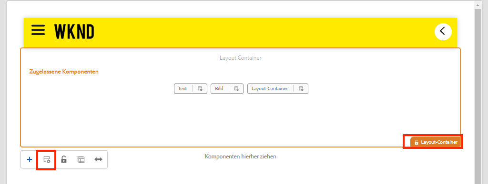

4. Kopieren Sie die aktuelle Richtlinie und erstellen Sie eine neue Richtlinie mit dem Namen **[!UICONTROL SPA-Struktur]**:

   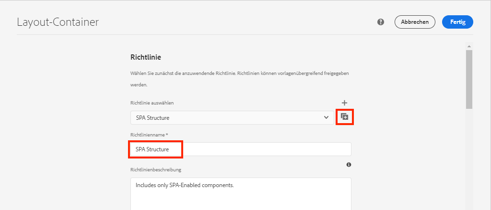

   Wählen Sie unter **[!UICONTROL Zugelassene Komponenten]** > **[!UICONTROL Allgemein]** die **[!UICONTROL Layout-Container]**-Komponente.

   Wählen Sie unter **[!UICONTROL Zugelassene Komponenten]** > **[!UICONTROL WKND SPA ANGULAR – STRUKTUR]** die **[!UICONTROL Header]**-Komponente:

   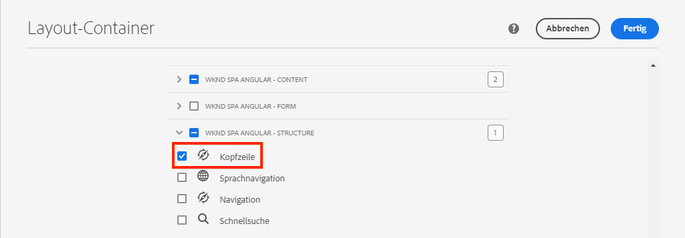

   Wählen Sie unter **[!UICONTROL Zugelassene Komponenten]** > **[!UICONTROL WKND SPA ANGULAR – Inhalt]** die **[!UICONTROL Bild-]** und **[!UICONTROL Text]**-Komponenten. Es sollten insgesamt vier Komponenten ausgewählt sein.

   Klicken Sie auf **[!UICONTROL Fertig]**, um die Änderungen zu speichern.

5. **Aktualisieren** Sie die Seite. Fügen Sie die **[!UICONTROL Header]**-Komponente über dem nicht gesperrten **[!UICONTROL Layout-Container]** hinzu:

   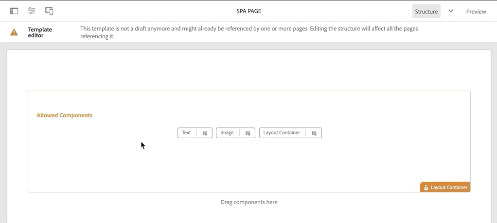

6. Wählen Sie die **[!UICONTROL Header]**-Komponente und klicken Sie auf das **Richtlinien**-Symbol zum Bearbeiten der Richtlinie.

   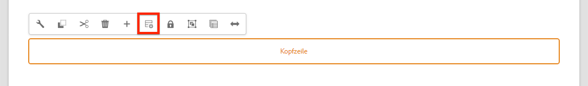

7. Erstellen Sie eine neue Richtlinie mit **[!UICONTROL Richtliniennamen]** **„WKND SPA-Header“**.

   Unter den **[!UICONTROL Eigenschaften]**:

   * Legen Sie den **[!UICONTROL Navigationsstamm]** auf `/content/wknd-spa-angular/us/en` fest.
   * Legen Sie für **[!UICONTROL Stammebenen ausschließen]** den Wert **1** fest.
   * Deaktivieren Sie **[!UICONTROL Alle untergeordneten Seiten erfassen]**.
   * Setzen Sie die **[!UICONTROL Navigationsstrukturtiefe]** auf **3**.

   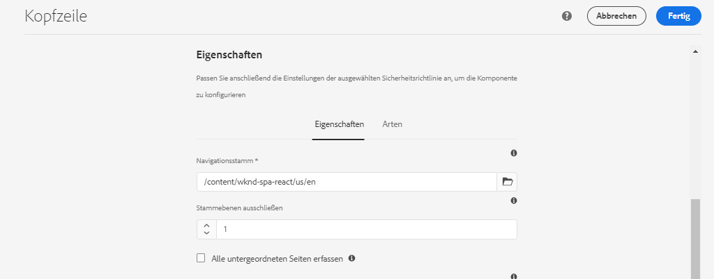

   Dadurch wird die Navigation 2 Ebenen unterhalb von `/content/wknd-spa-angular/us/en` erfasst.

8. Nach dem Speichern der Änderungen sollten Sie den aufgefüllten `Header` als Teil der Vorlage sehen:

   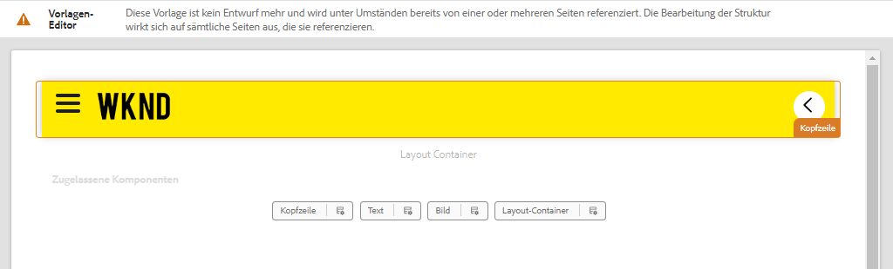

## Erstellen untergeordneter Seiten

Als Nächstes erstellen wir zusätzliche Seiten in AEM, die als verschiedene Ansichten in der SPA dienen. Wir werden auch die hierarchische Struktur des von AEM bereitgestellten JSON-Modells untersuchen.

1. Navigieren Sie zur **Sites**-Konsole: [http://localhost:4502/sites.html/content/wknd-spa-angular/us/en/home](http://localhost:4502/sites.html/content/wknd-spa-angular/us/en/home). Wählen Sie die **WKND SPA Angular-Homepage** und klicken Sie auf **[!UICONTROL Erstellen]** > **[!UICONTROL Seite]**:

   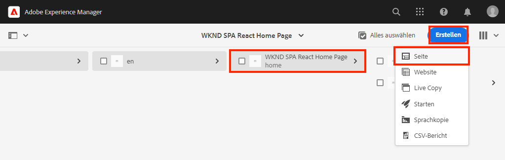

2. Wählen Sie unter **[!UICONTROL Vorlage]** die Option **[!UICONTROL SPA-Seite]** aus. Geben Sie unter **[!UICONTROL Eigenschaften]** **„Seite 1“** für den **[!UICONTROL Titel]** und **„Seite 1“** als Namen ein.

   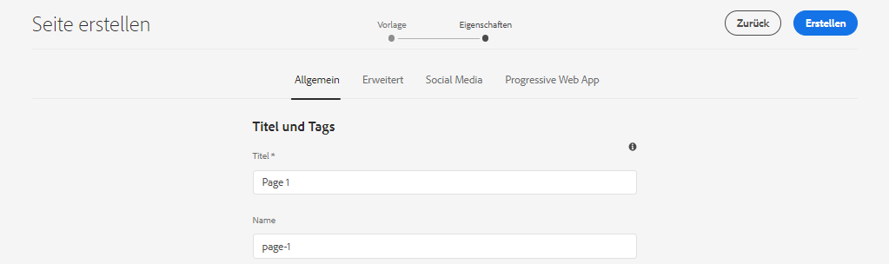

   Klicken Sie auf **[!UICONTROL Erstellen]** und dann im Dialogfeld-Popup auf **[!UICONTROL Öffnen]**, um die Seite im AEM-SPA-Editor zu öffnen.

3. Fügen Sie eine neue **[!UICONTROL Text]**-Komponente zum Haupt-**[!UICONTROL Layout-Container]** hinzu. Bearbeiten Sie die Komponente und geben Sie folgenden Text ein: **„Seite 1“** unter Verwendung des RTE und des Elements **H1** (Sie müssen in den Vollbildmodus wechseln, um die Absatzelemente zu ändern)

   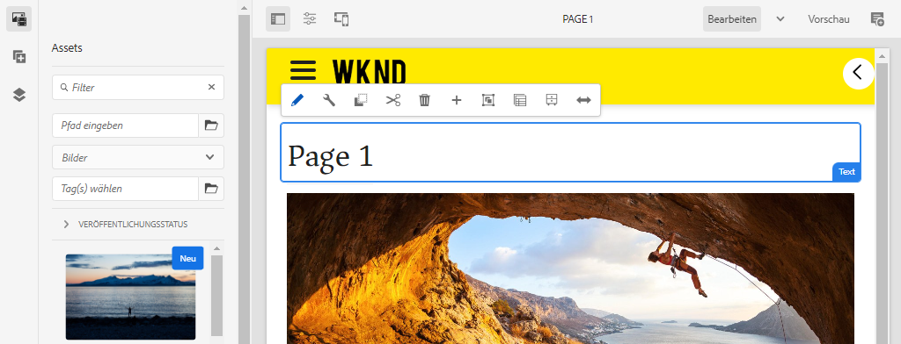

   Sie können gerne zusätzliche Inhalte hinzufügen, z. B. ein Bild.

4. Kehren Sie zur AEM Sites-Konsole zurück und wiederholen Sie die obigen Schritte, indem Sie eine zweite Seite mit dem Namen **„Seite 2“** als gleichgeordnet zu **Seite 1** erstellen. Fügen Sie Inhalt auf **Seite 2** ein, sodass sie leicht zu erkennen ist.
5. Erstellen Sie abschließend eine dritte Seite, **„Seite 3“**, diese jedoch als **untergeordnet** zu **Seite 2**. Danach sollte die Website-Hierarchie wie folgt aussehen:

   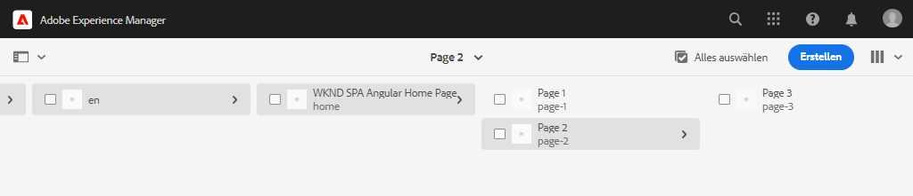

6. Öffnen Sie in einer neuen Registerkarte die von AEM bereitgestellte JSON-Modell-API: [http://localhost:4502/content/wknd-spa-angular/us/en.model.json](http://localhost:4502/content/wknd-spa-angular/us/en.model.json). Dieser JSON-Inhalt wird angefordert, wenn die SPA zum ersten Mal geladen wird. Die äußere Struktur sieht wie folgt aus:

   ```json
   {
   "language": "en",
   "title": "en",
   "templateName": "spa-app-template",
   "designPath": "/libs/settings/wcm/designs/default",
   "cssClassNames": "spa page basicpage",
   ":type": "wknd-spa-angular/components/spa",
   ":items": {},
   ":itemsOrder": [],
   ":hierarchyType": "page",
   ":path": "/content/wknd-spa-angular/us/en",
   ":children": {
       "/content/wknd-spa-angular/us/en/home": {},
       "/content/wknd-spa-angular/us/en/home/page-1": {},
       "/content/wknd-spa-angular/us/en/home/page-2": {},
       "/content/wknd-spa-angular/us/en/home/page-2/page-3": {}
       }
   }
   ```

   Unter `:children` sollte für jede der erstellten Seiten ein Eintrag angezeigt werden. Der Inhalt für alle Seiten ist in dieser ersten JSON-Anfrage enthalten. Sobald das Navigations-Routing implementiert ist, werden nachfolgende Ansichten der SPA schnell geladen, da der Inhalt bereits Client-seitig verfügbar ist.

   Es ist nicht ratsam, den **GESAMTEN** Inhalt einer SPA in der ersten JSON-Anfrage zu laden, da dies das anfängliche Laden der Seite verlangsamen würde. Als Nächstes sehen wir, wie die Hierarchietiefe der Seiten erfasst wird.

7. Navigieren Sie zur **SPA-Stamm**-Vorlage unter: [http://localhost:4502/editor.html/conf/wknd-spa-angular/settings/wcm/templates/spa-app-template/structure.html](http://localhost:4502/editor.html/conf/wknd-spa-angular/settings/wcm/templates/spa-app-template/structure.html).

   Klicken Sie auf das Menü **[!UICONTROL Seiteneigenschaften]** > **[!UICONTROL Seitenrichtlinie]**:

   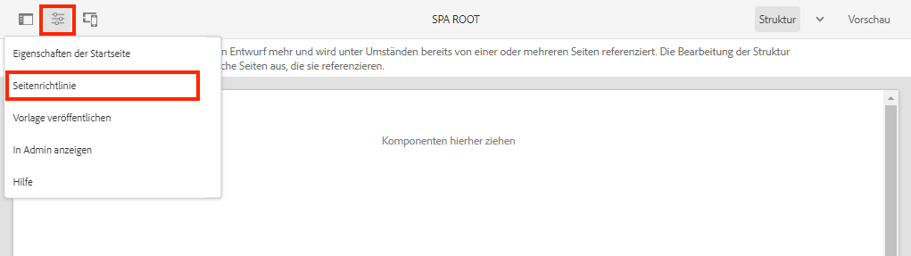

8. Die **SPA-Stammvorlage** weist die zusätzliche Registerkarte **[!UICONTROL Hierarchische Struktur]** für den erfassten JSON-Inhalt auf. Die **[!UICONTROL Strukturtiefe]** bestimmt, wie tief in der Website-Hierarchie untergeordnete Seiten unterhalb des **Stamms** erfasst werden. Sie können auch das Feld **[!UICONTROL Strukturmuster]** zum Filtern zusätzlicher Seiten basierend auf einem regulären Ausdruck verwenden.

   Aktualisieren Sie die **[!UICONTROL Strukturtiefe]** auf **„2“**:

   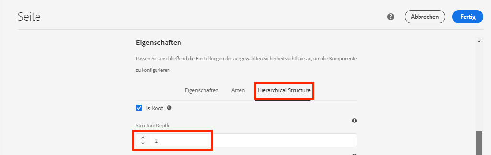

   Klicken Sie auf **[!UICONTROL Fertig]**, um die Änderungen an der Richtlinie zu speichern.

9. Öffnen Sie erneut das JSON-Modell [http://localhost:4502/content/wknd-spa-angular/us/en.model.json](http://localhost:4502/content/wknd-spa-angular/us/en.model.json).

   ```json
   {
   "language": "en",
   "title": "en",
   "templateName": "spa-app-template",
   "designPath": "/libs/settings/wcm/designs/default",
   "cssClassNames": "spa page basicpage",
   ":type": "wknd-spa-angular/components/spa",
   ":items": {},
   ":itemsOrder": [],
   ":hierarchyType": "page",
   ":path": "/content/wknd-spa-angular/us/en",
   ":children": {
       "/content/wknd-spa-angular/us/en/home": {},
       "/content/wknd-spa-angular/us/en/home/page-1": {},
       "/content/wknd-spa-angular/us/en/home/page-2": {}
       }
   }
   ```

   Beachten Sie, dass der Pfad von **Seite 3** entfernt wurde: `/content/wknd-spa-angular/us/en/home/page-2/page-3` vom ersten JSON-Modell.

   Später werden wir sehen, wie das AEM SPA Editor SDK zusätzliche Inhalte dynamisch laden kann.

## Implementieren der Navigation

Implementieren Sie anschließend das Navigationsmenü mit einer neuen `NavigationComponent`. Wir könnten den Code direkt in `header.component.html` hinzufügen, doch es empfiehlt sich, große Komponenten zu vermeiden. Implementieren Sie stattdessen eine `NavigationComponent`, die später möglicherweise wiederverwendet werden kann.

1. Überprüfen Sie die JSON, die von der AEM-`Header`-Komponente unter [http://localhost:4502/content/wknd-spa-angular/us/en.model.json](http://localhost:4502/content/wknd-spa-angular/us/en.model.json) bereitgestellt wird:

   ```json
   ...
   "header": {
       "items": [
       {
       "level": 0,
       "active": true,
       "path": "/content/wknd-spa-angular/us/en/home",
       "description": null,
       "url": "/content/wknd-spa-angular/us/en/home.html",
       "lastModified": 1589062597083,
       "title": "WKND SPA Angular Home Page",
       "children": [
               {
               "children": [],
               "level": 1,
               "active": false,
               "path": "/content/wknd-spa-angular/us/en/home/page-1",
               "description": null,
               "url": "/content/wknd-spa-angular/us/en/home/page-1.html",
               "lastModified": 1589429385100,
               "title": "Page 1"
               },
               {
               "level": 1,
               "active": true,
               "path": "/content/wknd-spa-angular/us/en/home/page-2",
               "description": null,
               "url": "/content/wknd-spa-angular/us/en/home/page-2.html",
               "lastModified": 1589429603507,
               "title": "Page 2",
               "children": [
                   {
                   "children": [],
                   "level": 2,
                   "active": false,
                   "path": "/content/wknd-spa-angular/us/en/home/page-2/page-3",
                   "description": null,
                   "url": "/content/wknd-spa-angular/us/en/home/page-2/page-3.html",
                   "lastModified": 1589430413831,
                   "title": "Page 3"
                   }
               ],
               }
           ]
           }
       ],
   ":type": "wknd-spa-angular/components/header"
   ```

   Die hierarchische Natur von AEM-Seiten ist in der JSON-Datei modelliert, die zum Ausfüllen eines Navigationsmenüs verwendet werden kann. Erinnern Sie sich daran, dass die `Header`-Komponente die gesamte Funktionalität der [Navigations-Kernkomponente](https://www.aemcomponents.dev/content/core-components-examples/library/core-structure/navigation.html) übernimmt und der über die JSON angezeigte Inhalt automatisch der `@Input`-Notierung von Angular zugeordnet wird.

2. Öffnen Sie ein neues Terminal-Fenster und navigieren Sie zum Ordner `ui.frontend` des SPA-Projekts. Erstellen Sie eine neue `NavigationComponent` mit dem Angular CLI-Tool:

   ```shell
   $ cd ui.frontend
   $ ng generate component components/navigation
   CREATE src/app/components/navigation/navigation.component.scss (0 bytes)
   CREATE src/app/components/navigation/navigation.component.html (25 bytes)
   CREATE src/app/components/navigation/navigation.component.spec.ts (656 bytes)
   CREATE src/app/components/navigation/navigation.component.ts (286 bytes)
   UPDATE src/app/app.module.ts (2032 bytes)
   ```

3. Erstellen Sie als Nächstes eine Klasse mit dem Namen `NavigationLink` mithilfe der Angular-CLI im neu erstellten Verzeichnis `components/navigation`:

   ```shell
   $ cd src/app/components/navigation/
   $ ng generate class NavigationLink
   CREATE src/app/components/navigation/navigation-link.spec.ts (187 bytes)
   CREATE src/app/components/navigation/navigation-link.ts (32 bytes)
   ```

4. Kehren Sie zur IDE Ihrer Wahl zurück und öffnen Sie die Datei auf `navigation-link.ts` unter `/src/app/components/navigation/navigation-link.ts`.

   

5. Füllen Sie `navigation-link.ts` wie folgt:

   ```js
   export class NavigationLink {
   
       title: string;
       path: string;
       url: string;
       level: number;
       children: NavigationLink[];
       active: boolean;
   
       constructor(data) {
           this.path = data.path;
           this.title = data.title;
           this.url = data.url;
           this.level = data.level;
           this.active = data.active;
           this.children = data.children.map( item => {
               return new NavigationLink(item);
           });
       }
   }
   ```

   Dies ist eine einfache Klasse zur Darstellung eines einzelnen Navigationslinks. Im Klassenkonstruktor erwarten wir, dass `data` das von AEM übergebene JSON-Objekt ist. Diese Klasse wird in den beiden Komponenten `NavigationComponent` und `HeaderComponent` verwendet, um die Navigationsstruktur einfach zu befüllen.

   Es wird keine Datenumwandlung durchgeführt. Diese Klasse wird hauptsächlich erstellt, um das JSON-Modell stark zu typisieren. Beachten Sie, dass `this.children` als `NavigationLink[]` typisiert wird und dass der Konstruktor rekursiv neue `NavigationLink`-Objekte für jedes der Elemente im `children`-Array erstellt. Erinnern Sie sich daran, dass das JSON-Modell für `Header` hierarchisch ist.

6. Öffnen Sie die Datei `navigation-link.spec.ts`. Dies ist die Testdatei für die Klasse `NavigationLink`. Aktualisieren Sie sie wie folgt:

   ```js
   import { NavigationLink } from './navigation-link';
   
   describe('NavigationLink', () => {
       it('should create an instance', () => {
           const data = {
               children: [],
               level: 1,
               active: false,
               path: '/content/wknd-spa-angular/us/en/home/page-1',
               description: null,
               url: '/content/wknd-spa-angular/us/en/home/page-1.html',
               lastModified: 1589429385100,
               title: 'Page 1'
           };
           expect(new NavigationLink(data)).toBeTruthy();
       });
   });
   ```

   Beachten Sie, dass `const data` demselben JSON-Modell folgt, das zuvor auf einen einzelnen Link überprüft wurde. Dies ist alles andere als ein robuster Komponententest, doch es sollte ausreichen, um den Konstruktor von `NavigationLink` zu testen.

7. Öffnen Sie die Datei `navigation.component.ts`. Aktualisieren Sie sie wie folgt:

   ```js
   import { Component, OnInit, Input } from '@angular/core';
   import { NavigationLink } from './navigation-link';
   
   @Component({
   selector: 'app-navigation',
   templateUrl: './navigation.component.html',
   styleUrls: ['./navigation.component.scss']
   })
   export class NavigationComponent implements OnInit {
   
       @Input() items: object[];
   
       constructor() { }
   
       get navigationLinks(): NavigationLink[] {
   
           if (this.items && this.items.length > 0) {
               return this.items.map(item => {
                   return new NavigationLink(item);
               });
           }
   
           return null;
       }
   
       ngOnInit() {}
   
   }
   ```

   `NavigationComponent` erwartet ein `object[]` namens `items`, welches das JSON-Modell aus AEM ist. Diese Klasse stellt eine Einzelmethode `get navigationLinks()` bereit, die ein Array von `NavigationLink`-Objekten zurückgibt.

8. Öffnen Sie die Datei `navigation.component.html` und aktualisieren Sie sie wie folgt:

   ```html
   <ul *ngIf="navigationLinks && navigationLinks.length > 0" class="navigation__group">
       <ng-container *ngTemplateOutlet="recursiveListTmpl; context:{ links: navigationLinks }"></ng-container>
   </ul>
   ```

   Dadurch wird ein erster `<ul>` generiert und die Methode `get navigationLinks()` von `navigation.component.ts` abgerufen. Ein `<ng-container>` wird verwendet, um eine Vorlage mit dem Namen `recursiveListTmpl` abzurufen, und er übergibt ihr die `navigationLinks` als eine Variable namens `links`.

   Fügen Sie als Nächstes das `recursiveListTmpl` hinzu:

   ```html
   <ng-template #recursiveListTmpl let-links="links">
       <li *ngFor="let link of links" class="{{'navigation__item navigation__item--' + link.level}}">
           <a [routerLink]="link.url" class="navigation__item-link" [title]="link.title" [attr.aria-current]="link.active">
               {{link.title}}
           </a>
           <ul *ngIf="link.children && link.children.length > 0">
               <ng-container *ngTemplateOutlet="recursiveListTmpl; context:{ links: link.children }"></ng-container>
           </ul>
       </li>
   </ng-template>
   ```

   Hier wird der Rest des Renderings für den Navigations-Link implementiert. Beachten Sie, dass die Variable `link` vom Typ `NavigationLink` ist und alle von dieser Klasse erstellten Methoden/Eigenschaften verfügbar sind. [`[routerLink]`](https://angular.io/api/router/RouterLink) wird anstelle des normalen `href`-Attributs verwendet. Auf diese Weise können wir Links zu bestimmten Routen in der App erstellen, ohne dass die Seite vollständig aktualisiert wird.

   Der rekursive Teil der Navigation wird ebenfalls implementiert, indem ein anderer `<ul>` erstellt wird, wenn der aktuelle `link` ein nicht-leeres `children`-Array besitzt.

9. Aktualisieren Sie `navigation.component.spec.ts`, um Unterstützung für `RouterTestingModule` hinzuzufügen:

   ```diff
    ...
   + import { RouterTestingModule } from '@angular/router/testing';
    ...
    beforeEach(async(() => {
       TestBed.configureTestingModule({
   +   imports: [ RouterTestingModule ],
       declarations: [ NavigationComponent ]
       })
       .compileComponents();
    }));
    ...
   ```

   Das Hinzufügen des `RouterTestingModule` ist erforderlich, da die Komponente `[routerLink]` verwendet.

10. Aktualisieren Sie `navigation.component.scss`, um einige grundlegende Stile zur `NavigationComponent` hinzuzufügen:

   ```scss
   @import "~src/styles/variables";
   
   $link-color: $black;
   $link-hover-color: $white;
   $link-background: $black;
   
   :host-context {
       display: block;
       width: 100%;
   }
   
   .navigation__item {
       list-style: none;
   }
   
   .navigation__item-link {
       color: $link-color;
       font-size: $font-size-large;
       text-transform: uppercase;
       padding: $gutter-padding;
       display: flex;
       border-bottom: 1px solid $gray;
   
       &:hover {
           background: $link-background;
           color: $link-hover-color;
       }
   
   }
   ```

## Aktualisieren der Header-Komponente

Nun, da `NavigationComponent` implementiert worden ist, muss `HeaderComponent` aktualisiert werden, um darauf zu verweisen.

1. Öffnen Sie ein Terminal und navigieren Sie zum Ordner `ui.frontend` im SPA-Projekt. Starten Sie den **Webpack-Dev-Server**:

   ```shell
   $ npm start
   ```

2. Öffnen Sie im Browser eine Registerkarte und navigieren Sie zu [http://localhost:4200/](http://localhost:4200/).

   Der **Webpack-Dev-Server** sollte so konfiguriert sein, dass eine lokale Instanz von AEM (`ui.frontend/proxy.conf.json`) als Proxy für das JSON-Modell fungiert. Auf diese Weise können wir Code direkt anhand der Inhalte erstellen, die zuvor im Tutorial in AEM erstellt wurden.

   

   Für die `HeaderComponent` ist die Menüumschalter-Funktion bereits implementiert. Fügen Sie als Nächstes die Navigationskomponente hinzu.

3. Kehren Sie zur IDE Ihrer Wahl zurück und öffnen Sie die Datei `header.component.ts` unter `ui.frontend/src/app/components/header/header.component.ts`.
4. Aktualisieren Sie die Methode `setHomePage()`, um die hart-codierte Zeichenfolge zu entfernen und die von der AEM-Komponente übergebenen dynamischen Eigenschaften zu verwenden:

   ```js
   /* header.component.ts */
   import { NavigationLink } from '../navigation/navigation-link';
   ...
    setHomePage() {
       if (this.hasNavigation) {
           const rootNavigationLink: NavigationLink = new NavigationLink(this.items[0]);
           this.isHome = rootNavigationLink.path === this.route.snapshot.data.path;
           this.homePageUrl = rootNavigationLink.url;
       }
   }
   ...
   ```

   Eine neue Instanz von `NavigationLink` wird basierend auf `items[0]` erstellt, dem Stamm des JSON-Navigationsmodells, das von AEM übergeben wurde. `this.route.snapshot.data.path` gibt den Pfad der aktuellen Angular-Route zurück. Mit diesem Wert wird bestimmt, ob die aktuelle Route die **Startseite** ist. `this.homePageUrl` wird verwendet, um den Anker-Link auf dem **Logo** einzufügen.

5. Öffnen Sie `header.component.html` und ersetzen Sie den statischen Platzhalter für die Navigation durch einen Verweis auf die neu erstellte `NavigationComponent`:

   ```diff
       <div class="header-navigation">
           <div class="navigation">
   -            Navigation Placeholder
   +           <app-navigation [items]="items"></app-navigation>
           </div>
       </div>
   ```

   Das Attribut `[items]=items` übergibt `@Input() items` von der `HeaderComponent` an die `NavigationComponent`, wo es die Navigation ausbaut.

6. Öffnen Sie `header.component.spec.ts` und fügen Sie eine Deklaration für die `NavigationComponent` hinzu:

   ```diff
       /* header.component.spect.ts */
   +   import { NavigationComponent } from '../navigation/navigation.component';
   
       describe('HeaderComponent', () => {
       let component: HeaderComponent;
       let fixture: ComponentFixture<HeaderComponent>;
   
       beforeEach(async(() => {
           TestBed.configureTestingModule({
           imports: [ RouterTestingModule ],
   +       declarations: [ HeaderComponent, NavigationComponent ]
           })
           .compileComponents();
       }));
   ```

   Da die `NavigationComponent` jetzt als Teil der `HeaderComponent` verwendet wird, muss sie als Teil der Testumgebung deklariert werden.

7. Speichern Sie Änderungen an allen geöffneten Dateien und kehren Sie zurück zum **Webpack-Dev-Server**: [http://localhost:4200/](http://localhost:4200/)

   

   Öffnen Sie die Navigation, indem Sie auf den Menüumschalter klicken. Daraufhin sollten die ausgefüllten Navigations-Links angezeigt werden. Sie sollten zu verschiedenen Ansichten der SPA navigieren können.

## Verstehen des SPA-Routings

Nachdem die Navigation implementiert wurde, überprüfen Sie das Routing in AEM.

1. Öffnen Sie in der IDE die Datei `app-routing.module.ts` unter `ui.frontend/src/app`.

   ```js
   /* app-routing.module.ts */
   import { AemPageDataResolver, AemPageRouteReuseStrategy } from '@adobe/cq-angular-editable-components';
   import { NgModule } from '@angular/core';
   import { RouteReuseStrategy, RouterModule, Routes, UrlMatchResult, UrlSegment } from '@angular/router';
   import { PageComponent } from './components/page/page.component';
   
   export function AemPageMatcher(url: UrlSegment[]): UrlMatchResult {
       if (url.length) {
           return {
               consumed: url,
               posParams: {
                   path: url[url.length - 1]
               }
           };
       }
   }
   
   const routes: Routes = [
       {
           matcher: AemPageMatcher,
           component: PageComponent,
           resolve: {
               path: AemPageDataResolver
           }
       }
   ];
   @NgModule({
       imports: [RouterModule.forRoot(routes)],
       exports: [RouterModule],
       providers: [
           AemPageDataResolver,
           {
           provide: RouteReuseStrategy,
           useClass: AemPageRouteReuseStrategy
           }
       ]
   })
   export class AppRoutingModule {}
   ```

   Das `routes: Routes = [];`-Array definiert die Routen oder Navigationspfade zu Angular-Komponenten-Zuordnungen.

   `AemPageMatcher` ist ein benutzerdefinierter Angular-Router [UrlMatcher](https://angular.io/api/router/UrlMatcher), der alles als Übereinstimmung zählt, was wie eine Seite in AEM, die Teil dieser Angular-Anwendung ist, „aussieht“.

   `PageComponent` ist die Angular-Komponente, die eine Seite in AEM darstellt und zum Rendern der übereinstimmenden Routen verwendet wird. Die `PageComponent` wird später im Tutorial behandelt.

   `AemPageDataResolver`, bereitgestellt vom AEM SPA Editor JS SDK, ist ein benutzerdefinierter [Angular Router-Resolver](https://angular.io/api/router/Resolve), der verwendet wird, um die Routen-URL (den Pfad in AEM einschließlich der Erweiterung .html) in den Ressourcenpfad in AEM umzuwandeln, welcher dem Seitenpfad ohne die Erweiterung entspricht.

   Beispiel: Der `AemPageDataResolver` transformiert die URL einer Route von `content/wknd-spa-angular/us/en/home.html` in einen Pfad von `/content/wknd-spa-angular/us/en/home`. Damit wird der Seiteninhalt basierend auf dem Pfad in der JSON-Modell-API aufgelöst.

   `AemPageRouteReuseStrategy`, bereitgestellt vom AEM SPA Editor JS SDK, ist eine benutzerdefinierte [RouteReuseStrategy](https://angular.io/api/router/RouteReuseStrategy), die die Wiederverwendung der `PageComponent` über Routen hinweg verhindert. Andernfalls wird beim Navigieren zur Seite „B“ möglicherweise Inhalt von Seite „A“ angezeigt.

2. Öffnen Sie die Datei `page.component.ts` unter `ui.frontend/src/app/components/page/`.

   ```js
   ...
   export class PageComponent {
       items;
       itemsOrder;
       path;
   
       constructor(
           private route: ActivatedRoute,
           private modelManagerService: ModelManagerService
       ) {
           this.modelManagerService
           .getData({ path: this.route.snapshot.data.path })
           .then(data => {
               this.path = data[Constants.PATH_PROP];
               this.items = data[Constants.ITEMS_PROP];
               this.itemsOrder = data[Constants.ITEMS_ORDER_PROP];
           });
       }
   }
   ```

   Die `PageComponent` ist erforderlich, um die von AEM abgerufene JSON zu verarbeiten, und wird als Angular-Komponente zum Rendern der Routen verwendet.

   `ActivatedRoute`, bereitgestellt vom Angular-Router-Modul, enthält den Status, der angibt, welcher JSON-Inhalt einer AEM Seite in diese Instanz einer Angular-Seitenkomponente geladen werden soll.

   `ModelManagerService` ruft die JSON-Daten basierend auf der Route ab und ordnet die Daten den Klassenvariablen `path`, `items` und `itemsOrder` zu. Diese werden dann an die [AEMPageComponent](https://www.npmjs.com/package/@adobe/cq-angular-editable-components#aempagecomponent.md) weitergegeben.

3. Öffnen Sie die Datei `page.component.html` unter `ui.frontend/src/app/components/page/`

   ```html
   <aem-page 
       class="structure-page" 
       [attr.data-cq-page-path]="path" 
       [cqPath]="path" 
       [cqItems]="items" 
       [cqItemsOrder]="itemsOrder">
   </aem-page>
   ```

   `aem-page` enthält die [AEMPageComponent](https://www.npmjs.com/package/@adobe/cq-angular-editable-components#aempagecomponent.md). Die Variablen `path`, `items` und `itemsOrder` werden an die `AEMPageComponent` weitergegeben. Die `AemPageComponent`, die über die SPA-Editor-JavaScript-SDKs bereitgestellt wird, durchläuft diese Daten und instanziiert Angular-Komponenten dynamisch basierend auf den JSON-Daten, wie im [Tutorial zum Zuordnen von Komponenten](./map-components.md) zu sehen ist.

   Die `PageComponent` ist in Wirklichkeit nur ein Proxy für die `AEMPageComponent`, und es ist die `AEMPageComponent`, die den Großteil der Arbeit leistet, um das JSON-Modell korrekt den Angular-Komponenten zuzuordnen.

## Überprüfen des SPA-Routings in AEM

1. Öffnen Sie ein Terminal und stoppen Sie den **Webpack-Dev-Server**, falls er gestartet wurde. Navigieren Sie zum Stammverzeichnis des Projekts und stellen Sie das Projekt mithilfe Ihrer Maven-Fähigkeiten AEM bereit:

   ```shell
   $ cd aem-guides-wknd-spa
   $ mvn clean install -PautoInstallSinglePackage
   ```

   >[!CAUTION]
   >
   > Für das Angular-Projekt sind einige sehr strenge Verknüpfungsregeln aktiviert. Wenn der Maven-Build fehlschlägt, überprüfen Sie den Fehler und suchen Sie nach gefundenen **Lint-Fehlern in den aufgelisteten Dateien.**. Korrigieren Sie alle vom Linter gefundenen Probleme und führen Sie den Maven-Befehl erneut aus.

2. Navigieren Sie zur SPA-Homepage in AEM, [http://localhost:4502/content/wknd-spa-angular/us/en/home.html](http://localhost:4502/content/wknd-spa-angular/us/en/home.html), und öffnen Sie die Entwickler-Tools Ihres Browsers. Die folgenden Screenshots stammen vom Google Chrome-Browser.

   Aktualisieren Sie die Seite. Sie sollten jetzt eine XHR-Anfrage an `/content/wknd-spa-angular/us/en.model.json` sehen, den SPA-Stamm. Beachten Sie, dass nur drei untergeordnete Seiten enthalten sind. Dies basiert auf der Hierarchietiefenkonfiguration der SPA-Stammvorlage, die zuvor im Tutorial vorgenommen wurde. Dies umfasst nicht **Seite 3**.

   

3. Navigieren Sie bei geöffneten Entwickler-Tools zu **Seite 3**:

   

   Beachten Sie, dass eine neue XHR-Anfrage an `/content/wknd-spa-angular/us/en/home/page-2/page-3.model.json` gesendet wird

   

   Der AEM-Modell-Manager versteht, dass der JSON-Inhalt für **Seite 3** nicht verfügbar ist und triggert automatisch die zusätzliche XHR-Anfrage.

4. Fahren Sie mit dem Navigieren der SPA durch Verwenden der verschiedenen Navigations-Links fort. Beachten Sie, dass keine zusätzlichen XHR-Anfragen erfolgen und keine vollständigen Seitenaktualisierungen stattfinden. Dadurch wird die SPA für die Endbenutzenden schneller, und die Zahl der unnötigen Anfragen zurück an AEM wird reduziert.

   

5. Experimentieren Sie mit Deep-Links, indem Sie direkt zu [http://localhost:4502/content/wknd-spa-angular/us/en/home/page-2.html](http://localhost:4502/content/wknd-spa-angular/us/en/home/page-2.html) navigieren. Beachten Sie, dass der Zurück-Button des Browsers weiterhin funktioniert.

## Herzlichen Glückwunsch! {#congratulations}

Herzlichen Glückwunsch! Sie wissen jetzt, wie mehrere Ansichten in der SPA durch die Zuordnung zu AEM-Seiten mit dem SPA Editor SDK unterstützt werden können. Die dynamische Navigation wurde durch Verwenden des Angular-Routings implementiert und zur `Header`-Komponente hinzugefügt.

Sie können den fertigen Code jederzeit auf [GitHub](https://github.com/adobe/aem-guides-wknd-spa/tree/Angular/navigation-routing-solution) ansehen oder den Code lokal auschecken, indem Sie zur Verzweigung `Angular/navigation-routing-solution` wechseln.

### Nächste Schritte {#next-steps}

[Erstellen einer benutzerdefinierten Komponente](custom-component.md): Erfahren Sie, wie Sie eine benutzerdefinierte Komponente erstellen, die mit dem AEM-SPA-Editor verwendet werden kann. Erfahren Sie, wie Sie Autorendialogfelder und Sling-Modelle entwickeln, um das JSON-Modell zu erweitern und eine benutzerdefinierte Komponente zu füllen.
