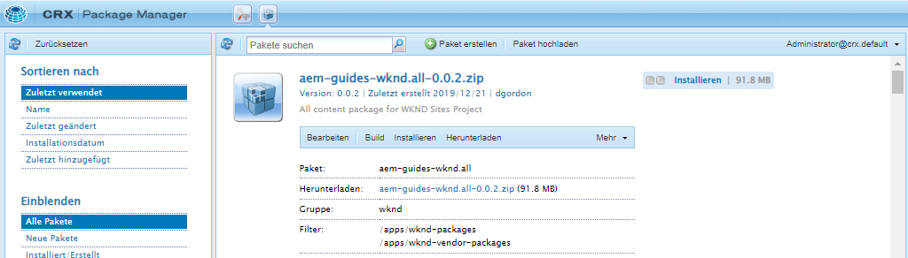

# Hinzufügen von Navigation und Routing {#navigation-routing}

Erfahren Sie, wie mehrere Ansichten in der SPA mithilfe von AEM Seiten und dem SPA Editor SDK unterstützt werden. Die dynamische Navigation wird mithilfe von Angular-Routen implementiert und zu einer vorhandenen Kopfzeilenkomponente hinzugefügt.

## Ziel

1. Machen Sie sich mit den SPA Routing-Optionen vertraut, die bei Verwendung des SPA-Editors verfügbar sind.
2. Verwendung [Angular-Routing](https://angular.io/guide/router) um zwischen verschiedenen Ansichten des SPA zu navigieren.
3. Implementieren Sie eine dynamische Navigation, die von der AEM-Seitenhierarchie gesteuert wird.

## Was Sie erstellen werden

Dieses Kapitel fügt einem vorhandenen `Header` -Komponente. Das Navigationsmenü wird von der AEM Seitenhierarchie gesteuert und verwendet das JSON-Modell, das von der [Navigations-Kernkomponente](https://experienceleague.adobe.com/docs/experience-manager-core-components/using/components/navigation.html).


## Voraussetzungen

Überprüfen Sie die erforderlichen Tools und Anweisungen zum Einrichten eines [lokale Entwicklungsumgebung](overview.md#local-dev-environment).

### Code abrufen

1. Laden Sie den Ausgangspunkt für dieses Tutorial über Git herunter:

   ```shell
   $ git clone git@github.com:adobe/aem-guides-wknd-spa.git
   $ cd aem-guides-wknd-spa
   $ git checkout Angular/navigation-routing-start
   ```

2. Stellen Sie die Codebasis mithilfe von Maven in einer lokalen AEM-Instanz bereit:

   ```shell
   $ mvn clean install -PautoInstallSinglePackage
   ```

   Wenn Sie [AEM 6.x](overview.md#compatibility) Fügen Sie die `classic` profile:

   ```shell
   $ mvn clean install -PautoInstallSinglePackage -Pclassic
   ```

3. Installieren Sie das fertige Paket für das herkömmliche [WKND-Referenz-Site](https://github.com/adobe/aem-guides-wknd/releases/latest). Die von [WKND-Referenz-Site](https://github.com/adobe/aem-guides-wknd/releases/latest) werden auf der WKND-SPA wiederverwendet. Das Paket kann mit [AEM Package Manager](http://localhost:4502/crx/packmgr/index.jsp).

   

Sie können den fertigen Code immer in [GitHub](https://github.com/adobe/aem-guides-wknd-spa/tree/Angular/navigation-routing-solution) oder den Code lokal auszuchecken, indem Sie zu der Verzweigung wechseln `Angular/navigation-routing-solution`.

## Aktualisierungen der Inspect HeaderComponent {#inspect-header}

In vorherigen Kapiteln wird die `HeaderComponent` wurde als reine Angular-Komponente hinzugefügt, die über `app.component.html`. In diesem Kapitel `HeaderComponent` -Komponente aus der App entfernt und über das [Vorlagen-Editor](https://experienceleague.adobe.com/docs/experience-manager-learn/sites/page-authoring/template-editor-feature-video-use.html?lang=de). Dadurch können Benutzer das Navigationsmenü der `HeaderComponent` von innerhalb AEM.

>[!NOTE]
>
> Für die Codebasis wurden bereits mehrere CSS- und JavaScript-Aktualisierungen vorgenommen, um dieses Kapitel zu starten. So konzentrieren Sie sich auf Kernkonzepte, nicht **all** der Codeänderungen werden erläutert. Sie können die vollständigen Änderungen anzeigen [here](https://github.com/adobe/aem-guides-wknd-spa/compare/Angular/map-components-solution...Angular/navigation-routing-start).

1. Öffnen Sie in der IDE Ihrer Wahl das SPA Startprojekt für dieses Kapitel.
2. Unter dem `ui.frontend` Modul überprüfen die Datei `header.component.ts` unter: `ui.frontend/src/app/components/header/header.component.ts`.

   Es wurden mehrere Aktualisierungen vorgenommen, darunter das Hinzufügen eines `HeaderEditConfig` und `MapTo` , damit die Komponente einer AEM zugeordnet werden kann `wknd-spa-angular/components/header`.

   ```js
   /* header.component.ts */
   ...
   const HeaderEditConfig = {
       ...
   };
   
   @Component({
   selector: 'app-header',
   templateUrl: './header.component.html',
   styleUrls: ['./header.component.scss']
   })
   export class HeaderComponent implements OnInit {
   @Input() items: object[];
       ...
   }
   ...
   MapTo('wknd-spa-angular/components/header')(withRouter(Header), HeaderEditConfig);
   ```

   Beachten Sie die `@Input()` Anmerkung für `items`. `items` enthält ein Array von Navigationsobjekten, die von AEM übergeben werden.

3. Im `ui.apps` -Modul überprüfen die Komponentendefinition des AEM `Header` component: `ui.apps/src/main/content/jcr_root/apps/wknd-spa-angular/components/header/.content.xml`:

   ```xml
   <?xml version="1.0" encoding="UTF-8"?>
   <jcr:root xmlns:sling="http://sling.apache.org/jcr/sling/1.0" xmlns:cq="http://www.day.com/jcr/cq/1.0"
       xmlns:jcr="http://www.jcp.org/jcr/1.0"
       jcr:primaryType="cq:Component"
       jcr:title="Header"
       sling:resourceSuperType="wknd-spa-angular/components/navigation"
       componentGroup="WKND SPA Angular - Structure"/>
   ```

   Die AEM `Header` -Komponente übernimmt die gesamte Funktionalität der [Navigations-Kernkomponente](https://experienceleague.adobe.com/docs/experience-manager-core-components/using/components/navigation.html) über die `sling:resourceSuperType` -Eigenschaft.

## Hinzufügen der HeaderComponent zur SPA Vorlage {#add-header-template}

1. Öffnen Sie einen Browser und melden Sie sich bei AEM an. [http://localhost:4502/](http://localhost:4502/). Die Basis für den Startcode sollte bereits bereitgestellt werden.
2. Navigieren Sie zum **[!UICONTROL SPA Seitenvorlage]**: [http://localhost:4502/editor.html/conf/wknd-spa-angular/settings/wcm/templates/spa-page-template/structure.html](http://localhost:4502/editor.html/conf/wknd-spa-angular/settings/wcm/templates/spa-page-template/structure.html).
3. Auswählen des äußersten **[!UICONTROL Root Layout Container]** und klicken Sie auf **[!UICONTROL Politik]** Symbol. Pass auf **not** zur Auswahl der **[!UICONTROL Layout-Container]** nicht gesperrt für die Bearbeitung.

   

4. Kopieren Sie die aktuelle Richtlinie und erstellen Sie eine neue Richtlinie mit dem Namen **[!UICONTROL SPA]**:

   

   under **[!UICONTROL Zugelassene Komponenten]** > **[!UICONTROL Allgemein]** > wählen Sie die **[!UICONTROL Layout-Container]** -Komponente.

   under **[!UICONTROL Zugelassene Komponenten]** > **[!UICONTROL WKND SPA ANGULAR - STRUKTUR]** > wählen Sie die **[!UICONTROL Kopfzeile]** component:

   

   under **[!UICONTROL Zugelassene Komponenten]** > **[!UICONTROL WKND SPA ANGULAR - Inhalt]** > wählen Sie die **[!UICONTROL Bild]** und **[!UICONTROL Text]** Komponenten. Es sollten vier Komponenten ausgewählt sein.

   Klicken **[!UICONTROL Fertig]** , um die Änderungen zu speichern.

5. **Aktualisieren Sie die Seite.** Fügen Sie die **[!UICONTROL Kopfzeile]** Komponente über der nicht gesperrten **[!UICONTROL Layout-Container]**:

   

6. Wählen Sie die **[!UICONTROL Kopfzeile]** Komponente und klicken Sie auf ihre **Politik** zum Bearbeiten der Richtlinie.

   

7. Erstellen Sie eine neue Richtlinie mit einer **[!UICONTROL Richtlinienname]** von **&quot;WKND SPA Header&quot;**.

   Unter dem **[!UICONTROL Eigenschaften]**:

   * Legen Sie die **[!UICONTROL Navigationsstamm]** nach `/content/wknd-spa-angular/us/en`.
   * Legen Sie die **[!UICONTROL Ausschließen von Stammebenen]** nach **1**.
   * Deaktivieren **[!UICONTROL Sammlung aller untergeordneten Seiten]**.
   * Legen Sie die **[!UICONTROL Navigationsstrukturtiefe]** nach **3**.

   

   Dadurch werden die Navigations-2-Ebenen unten erfasst `/content/wknd-spa-angular/us/en`.

8. Nach dem Speichern der Änderungen sollte die `Header` als Teil der Vorlage:

   

## Untergeordnete Seiten erstellen

Als Nächstes erstellen Sie zusätzliche Seiten in AEM , die als verschiedene Ansichten in der SPA dienen. Wir werden auch die hierarchische Struktur des von AEM bereitgestellten JSON-Modells untersuchen.

1. Navigieren Sie zum **Sites** console: [http://localhost:4502/sites.html/content/wknd-spa-angular/us/en/home](http://localhost:4502/sites.html/content/wknd-spa-angular/us/en/home). Wählen Sie die **WKND SPA Angular-Homepage** und klicken Sie auf **[!UICONTROL Erstellen]** > **[!UICONTROL Seite]**:

   

2. under **[!UICONTROL Vorlage]** select **[!UICONTROL SPA]**. under **[!UICONTROL Eigenschaften]** enter **&quot;Seite 1&quot;** für **[!UICONTROL Titel]** und **&quot;page-1&quot;** als Namen.

   

   Klicken **[!UICONTROL Erstellen]** und klicken Sie im Popup-Dialogfeld auf **[!UICONTROL Öffnen]** , um die Seite im AEM SPA Editor zu öffnen.

3. Hinzufügen neuer **[!UICONTROL Text]** -Komponente in die Hauptkomponente **[!UICONTROL Layout-Container]**. Bearbeiten Sie die Komponente und geben Sie den Text ein: **&quot;Seite 1&quot;** mithilfe des RTE und der **H1** Element (Sie müssen in den Vollbildmodus wechseln, um die Absatzelemente zu ändern)

   

   Sie können zusätzliche Inhalte hinzufügen, wie z. B. ein Bild.

4. Kehren Sie zur AEM Sites-Konsole zurück und wiederholen Sie die oben beschriebenen Schritte. Erstellen Sie dann eine zweite Seite mit dem Namen **&quot;Seite 2&quot;** als Geschwister **Seite 1**. Inhalt hinzufügen zu **Seite 2** damit sie leicht identifiziert werden können.
5. Erstellen Sie abschließend eine dritte Seite. **&quot;Seite 3&quot;** aber als **child** von **Seite 2**. Nach Abschluss der Site-Hierarchie sollte wie folgt aussehen:

   

6. Öffnen Sie in einer neuen Registerkarte die von AEM bereitgestellte JSON-Modell-API: [http://localhost:4502/content/wknd-spa-angular/us/en.model.json](http://localhost:4502/content/wknd-spa-angular/us/en.model.json). Dieser JSON-Inhalt wird angefordert, wenn die SPA zum ersten Mal geladen wird. Die äußere Struktur sieht wie folgt aus:

   ```json
   {
   "language": "en",
   "title": "en",
   "templateName": "spa-app-template",
   "designPath": "/libs/settings/wcm/designs/default",
   "cssClassNames": "spa page basicpage",
   ":type": "wknd-spa-angular/components/spa",
   ":items": {},
   ":itemsOrder": [],
   ":hierarchyType": "page",
   ":path": "/content/wknd-spa-angular/us/en",
   ":children": {
       "/content/wknd-spa-angular/us/en/home": {},
       "/content/wknd-spa-angular/us/en/home/page-1": {},
       "/content/wknd-spa-angular/us/en/home/page-2": {},
       "/content/wknd-spa-angular/us/en/home/page-2/page-3": {}
       }
   }
   ```

   under `:children` sollte für jede der erstellten Seiten ein Eintrag angezeigt werden. Der Inhalt für alle Seiten befindet sich in dieser ersten JSON-Anfrage. Sobald das Navigations-Routing implementiert ist, werden nachfolgende Ansichten des SPA schnell geladen, da der Inhalt bereits clientseitig verfügbar ist.

   Es ist nicht ratsam, **ALL** des Inhalts einer SPA in der ersten JSON-Anfrage, da dies das anfängliche Laden der Seite verlangsamen würde. Als Nächstes sehen wir, wie die Hierarchietiefe der Seiten erfasst wird.

7. Navigieren Sie zum **SPA** Vorlage unter: [http://localhost:4502/editor.html/conf/wknd-spa-angular/settings/wcm/templates/spa-app-template/structure.html](http://localhost:4502/editor.html/conf/wknd-spa-angular/settings/wcm/templates/spa-app-template/structure.html).

   Klicken Sie auf **[!UICONTROL Menü &quot;Seiteneigenschaften&quot;]** > **[!UICONTROL Seitenrichtlinie]**:

   

8. Die **SPA** -Vorlage weist eine zusätzliche **[!UICONTROL Hierarchische Struktur]** -Tab, um den erfassten JSON-Inhalt zu steuern. Die **[!UICONTROL Strukturtiefe]** bestimmt, wie tief in der Site-Hierarchie untergeordnete Seiten unterhalb der **root**. Sie können auch die **[!UICONTROL Strukturmuster]** -Feld zum Filtern zusätzlicher Seiten basierend auf einem regulären Ausdruck.

   Aktualisieren Sie die **[!UICONTROL Strukturtiefe]** nach **&quot;2&quot;**:

   

   Klicken **[!UICONTROL Fertig]** , um die Änderungen an der Richtlinie zu speichern.

9. Erneutes Öffnen des JSON-Modells [http://localhost:4502/content/wknd-spa-angular/us/en.model.json](http://localhost:4502/content/wknd-spa-angular/us/en.model.json).

   ```json
   {
   "language": "en",
   "title": "en",
   "templateName": "spa-app-template",
   "designPath": "/libs/settings/wcm/designs/default",
   "cssClassNames": "spa page basicpage",
   ":type": "wknd-spa-angular/components/spa",
   ":items": {},
   ":itemsOrder": [],
   ":hierarchyType": "page",
   ":path": "/content/wknd-spa-angular/us/en",
   ":children": {
       "/content/wknd-spa-angular/us/en/home": {},
       "/content/wknd-spa-angular/us/en/home/page-1": {},
       "/content/wknd-spa-angular/us/en/home/page-2": {}
       }
   }
   ```

   Beachten Sie, dass **Seite 3** path wurde entfernt: `/content/wknd-spa-angular/us/en/home/page-2/page-3` vom ersten JSON-Modell aus.

   Später werden wir feststellen, wie das AEM SPA Editor SDK zusätzliche Inhalte dynamisch laden kann.

## Implementieren der Navigation

Implementieren Sie anschließend das Navigationsmenü mit einer neuen `NavigationComponent`. Wir könnten den Code direkt in `header.component.html` Es empfiehlt sich jedoch, große Komponenten zu vermeiden. Implementieren Sie stattdessen eine `NavigationComponent` die später möglicherweise wiederverwendet werden könnten.

1. Überprüfen Sie die JSON, die von der AEM bereitgestellt wird. `Header` Komponente bei [http://localhost:4502/content/wknd-spa-angular/us/en.model.json](http://localhost:4502/content/wknd-spa-angular/us/en.model.json):

   ```json
   ...
   "header": {
       "items": [
       {
       "level": 0,
       "active": true,
       "path": "/content/wknd-spa-angular/us/en/home",
       "description": null,
       "url": "/content/wknd-spa-angular/us/en/home.html",
       "lastModified": 1589062597083,
       "title": "WKND SPA Angular Home Page",
       "children": [
               {
               "children": [],
               "level": 1,
               "active": false,
               "path": "/content/wknd-spa-angular/us/en/home/page-1",
               "description": null,
               "url": "/content/wknd-spa-angular/us/en/home/page-1.html",
               "lastModified": 1589429385100,
               "title": "Page 1"
               },
               {
               "level": 1,
               "active": true,
               "path": "/content/wknd-spa-angular/us/en/home/page-2",
               "description": null,
               "url": "/content/wknd-spa-angular/us/en/home/page-2.html",
               "lastModified": 1589429603507,
               "title": "Page 2",
               "children": [
                   {
                   "children": [],
                   "level": 2,
                   "active": false,
                   "path": "/content/wknd-spa-angular/us/en/home/page-2/page-3",
                   "description": null,
                   "url": "/content/wknd-spa-angular/us/en/home/page-2/page-3.html",
                   "lastModified": 1589430413831,
                   "title": "Page 3"
                   }
               ],
               }
           ]
           }
       ],
   ":type": "wknd-spa-angular/components/header"
   ```

   Die hierarchische Natur der AEM ist in der JSON-Datei modelliert, die zum Ausfüllen eines Navigationsmenüs verwendet werden kann. Erinnern Sie sich daran, dass die `Header` -Komponente übernimmt die gesamte Funktionalität der [Navigations-Kernkomponente](https://www.aemcomponents.dev/content/core-components-examples/library/core-structure/navigation.html) und der über die JSON angezeigte Inhalt automatisch der Angular zugeordnet wird `@Input` -Anmerkung.

2. Öffnen Sie ein neues Terminal-Fenster und navigieren Sie zum `ui.frontend` Ordner des SPA-Projekts. Erstellen Sie eine neue `NavigationComponent` mit dem Angular CLI-Tool:

   ```shell
   $ cd ui.frontend
   $ ng generate component components/navigation
   CREATE src/app/components/navigation/navigation.component.scss (0 bytes)
   CREATE src/app/components/navigation/navigation.component.html (25 bytes)
   CREATE src/app/components/navigation/navigation.component.spec.ts (656 bytes)
   CREATE src/app/components/navigation/navigation.component.ts (286 bytes)
   UPDATE src/app/app.module.ts (2032 bytes)
   ```

3. Erstellen Sie als Nächstes eine Klasse mit dem Namen `NavigationLink` Verwendung der Angular-CLI in der neu erstellten `components/navigation` directory:

   ```shell
   $ cd src/app/components/navigation/
   $ ng generate class NavigationLink
   CREATE src/app/components/navigation/navigation-link.spec.ts (187 bytes)
   CREATE src/app/components/navigation/navigation-link.ts (32 bytes)
   ```

4. Kehren Sie zur IDE Ihrer Wahl zurück und öffnen Sie die Datei unter `navigation-link.ts` at `/src/app/components/navigation/navigation-link.ts`.

   

5. Füllen Sie `navigation-link.ts` wie folgt:

   ```js
   export class NavigationLink {
   
       title: string;
       path: string;
       url: string;
       level: number;
       children: NavigationLink[];
       active: boolean;
   
       constructor(data) {
           this.path = data.path;
           this.title = data.title;
           this.url = data.url;
           this.level = data.level;
           this.active = data.active;
           this.children = data.children.map( item => {
               return new NavigationLink(item);
           });
       }
   }
   ```

   Dies ist eine einfache Klasse zur Darstellung eines einzelnen Navigationslinks. Im Klassenkonstruktor erwarten wir `data` , um das von AEM übergebene JSON-Objekt zu sein. Diese Klasse wird innerhalb der beiden Variablen `NavigationComponent` und `HeaderComponent` um die Navigationsstruktur einfach zu füllen.

   Es wird keine Datenumwandlung durchgeführt. Diese Klasse wird hauptsächlich erstellt, um das JSON-Modell stark einzugeben. Beachten Sie Folgendes: `this.children` als `NavigationLink[]` und dass der Konstruktor rekursiv neue `NavigationLink` -Objekte für jedes der Elemente im `children` Array. Erinnern Sie sich daran, dass das JSON-Modell für die `Header` ist hierarchisch.

6. Öffnen Sie die Datei `navigation-link.spec.ts`. Dies ist die Testdatei für die `NavigationLink` -Klasse. Aktualisieren Sie es mit folgenden Daten:

   ```js
   import { NavigationLink } from './navigation-link';
   
   describe('NavigationLink', () => {
       it('should create an instance', () => {
           const data = {
               children: [],
               level: 1,
               active: false,
               path: '/content/wknd-spa-angular/us/en/home/page-1',
               description: null,
               url: '/content/wknd-spa-angular/us/en/home/page-1.html',
               lastModified: 1589429385100,
               title: 'Page 1'
           };
           expect(new NavigationLink(data)).toBeTruthy();
       });
   });
   ```

   Beachten Sie Folgendes: `const data` folgt demselben JSON-Modell, das zuvor auf einen einzelnen Link überprüft wurde. Dies ist alles andere als ein robuster Komponententest, es sollte jedoch ausreichen, den Konstruktor von `NavigationLink`.

7. Öffnen Sie die Datei `navigation.component.ts`. Aktualisieren Sie es mit folgenden Daten:

   ```js
   import { Component, OnInit, Input } from '@angular/core';
   import { NavigationLink } from './navigation-link';
   
   @Component({
   selector: 'app-navigation',
   templateUrl: './navigation.component.html',
   styleUrls: ['./navigation.component.scss']
   })
   export class NavigationComponent implements OnInit {
   
       @Input() items: object[];
   
       constructor() { }
   
       get navigationLinks(): NavigationLink[] {
   
           if (this.items && this.items.length > 0) {
               return this.items.map(item => {
                   return new NavigationLink(item);
               });
           }
   
           return null;
       }
   
       ngOnInit() {}
   
   }
   ```

   `NavigationComponent` erwartet eine `object[]` benannt `items` Dies ist das JSON-Modell von AEM. Diese Klasse stellt eine einzelne Methode bereit `get navigationLinks()` , das ein Array von `NavigationLink` Objekte.

8. Öffnen Sie die Datei `navigation.component.html` und aktualisieren Sie sie wie folgt:

   ```html
   <ul *ngIf="navigationLinks && navigationLinks.length > 0" class="navigation__group">
       <ng-container *ngTemplateOutlet="recursiveListTmpl; context:{ links: navigationLinks }"></ng-container>
   </ul>
   ```

   Dadurch wird eine erste `<ul>` und ruft `get navigationLinks()` Methode aus `navigation.component.ts`. Ein `<ng-container>` wird verwendet, um eine Vorlage mit dem Namen `recursiveListTmpl` und übergibt die `navigationLinks` als Variable namens `links`.

   Fügen Sie die `recursiveListTmpl` next:

   ```html
   <ng-template #recursiveListTmpl let-links="links">
       <li *ngFor="let link of links" class="{{'navigation__item navigation__item--' + link.level}}">
           <a [routerLink]="link.url" class="navigation__item-link" [title]="link.title" [attr.aria-current]="link.active">
               {{link.title}}
           </a>
           <ul *ngIf="link.children && link.children.length > 0">
               <ng-container *ngTemplateOutlet="recursiveListTmpl; context:{ links: link.children }"></ng-container>
           </ul>
       </li>
   </ng-template>
   ```

   Hier wird der Rest des Renderings für den Navigationslink implementiert. Beachten Sie, dass die Variable `link` ist vom Typ `NavigationLink` und alle von dieser Klasse erstellten Methoden/Eigenschaften verfügbar sind. [`[routerLink]`](https://angular.io/api/router/RouterLink) anstelle von normal verwendet wird `href` -Attribut. Auf diese Weise können wir Links zu bestimmten Routen im Programm erstellen, ohne dass die Seite vollständig aktualisiert wird.

   Der rekursive Teil der Navigation wird ebenfalls implementiert, indem eine andere `<ul>` wenn die aktuelle `link` hat einen nicht leeren `children` Array.

9. Aktualisieren `navigation.component.spec.ts` um Unterstützung für `RouterTestingModule`:

   ```diff
    ...
   + import { RouterTestingModule } from '@angular/router/testing';
    ...
    beforeEach(async(() => {
       TestBed.configureTestingModule({
   +   imports: [ RouterTestingModule ],
       declarations: [ NavigationComponent ]
       })
       .compileComponents();
    }));
    ...
   ```

   Hinzufügen der `RouterTestingModule` ist erforderlich, da die Komponente `[routerLink]`.

10. Aktualisieren `navigation.component.scss` , um einige grundlegende Stile zum `NavigationComponent`:

   ```scss
   @import "~src/styles/variables";
   
   $link-color: $black;
   $link-hover-color: $white;
   $link-background: $black;
   
   :host-context {
       display: block;
       width: 100%;
   }
   
   .navigation__item {
       list-style: none;
   }
   
   .navigation__item-link {
       color: $link-color;
       font-size: $font-size-large;
       text-transform: uppercase;
       padding: $gutter-padding;
       display: flex;
       border-bottom: 1px solid $gray;
   
       &:hover {
           background: $link-background;
           color: $link-hover-color;
       }
   
   }
   ```

## Aktualisieren der Kopfzeilenkomponente

Nun, dass `NavigationComponent` wurde implementiert, `HeaderComponent` muss aktualisiert werden, um darauf zu verweisen.

1. Öffnen Sie ein Terminal und navigieren Sie zum `ui.frontend` Ordner im SPA Projekt. Starten Sie die **webpack-Dev-Server**:

   ```shell
   $ npm start
   ```

2. Öffnen Sie eine Browser-Registerkarte und navigieren Sie zu [http://localhost:4200/](http://localhost:4200/).

   Die **webpack-Dev-Server** sollte so konfiguriert werden, dass das JSON-Modell von einer lokalen Instanz von AEM (`ui.frontend/proxy.conf.json`). Auf diese Weise können wir direkt mit den Inhalten vergleichen, die in AEM zuvor im Tutorial erstellt wurden.

   

   Die `HeaderComponent` verfügt derzeit über die bereits implementierte Menüumschalter-Funktion. Fügen Sie als Nächstes die Navigationskomponente hinzu.

3. Kehren Sie zur IDE Ihrer Wahl zurück und öffnen Sie die Datei . `header.component.ts` at `ui.frontend/src/app/components/header/header.component.ts`.
4. Aktualisieren Sie die `setHomePage()` -Methode zum Entfernen der hartcodierten Zeichenfolge und Verwenden der von der AEM-Komponente übergebenen dynamischen Eigenschaften:

   ```js
   /* header.component.ts */
   import { NavigationLink } from '../navigation/navigation-link';
   ...
    setHomePage() {
       if (this.hasNavigation) {
           const rootNavigationLink: NavigationLink = new NavigationLink(this.items[0]);
           this.isHome = rootNavigationLink.path === this.route.snapshot.data.path;
           this.homePageUrl = rootNavigationLink.url;
       }
   }
   ...
   ```

   Eine neue Instanz von `NavigationLink` wird basierend auf `items[0]`, der Stamm des JSON-Navigationsmodells, das von AEM übergeben wurde. `this.route.snapshot.data.path` gibt den Pfad der aktuellen Angular-Route zurück. Mit diesem Wert wird bestimmt, ob die aktuelle Route die **Startseite**. `this.homePageUrl` wird verwendet, um den Ankerlink auf der **logo**.

5. Öffnen `header.component.html` und ersetzen Sie den statischen Platzhalter für die Navigation durch einen Verweis auf die neu erstellte `NavigationComponent`:

   ```diff
       <div class="header-navigation">
           <div class="navigation">
   -            Navigation Placeholder
   +           <app-navigation [items]="items"></app-navigation>
           </div>
       </div>
   ```

   `[items]=items` übergibt `@Input() items` von `HeaderComponent` der `NavigationComponent` wo sie die Navigation aufbaut.

6. Öffnen `header.component.spec.ts` und fügen Sie eine Deklaration für die `NavigationComponent`:

   ```diff
       /* header.component.spect.ts */
   +   import { NavigationComponent } from '../navigation/navigation.component';
   
       describe('HeaderComponent', () => {
       let component: HeaderComponent;
       let fixture: ComponentFixture<HeaderComponent>;
   
       beforeEach(async(() => {
           TestBed.configureTestingModule({
           imports: [ RouterTestingModule ],
   +       declarations: [ HeaderComponent, NavigationComponent ]
           })
           .compileComponents();
       }));
   ```

   Da die Variable `NavigationComponent` wird jetzt als Teil der `HeaderComponent` sie muss als Teil des Prüfbetts deklariert werden.

7. Speichern Sie Änderungen an allen geöffneten Dateien und kehren Sie zum **webpack-Dev-Server**: [http://localhost:4200/](http://localhost:4200/)

   

   Öffnen Sie die Navigation, indem Sie auf den Menüumschalter klicken. Daraufhin sollten die ausgefüllten Navigationslinks angezeigt werden. Sie sollten zu verschiedenen Ansichten des SPA navigieren können.

## Informationen zum SPA Routing

Nachdem die Navigation implementiert wurde, überprüfen Sie das Routing in AEM.

1. Öffnen Sie die -Datei in der IDE. `app-routing.module.ts` at `ui.frontend/src/app`.

   ```js
   /* app-routing.module.ts */
   import { AemPageDataResolver, AemPageRouteReuseStrategy } from '@adobe/cq-angular-editable-components';
   import { NgModule } from '@angular/core';
   import { RouteReuseStrategy, RouterModule, Routes, UrlMatchResult, UrlSegment } from '@angular/router';
   import { PageComponent } from './components/page/page.component';
   
   export function AemPageMatcher(url: UrlSegment[]): UrlMatchResult {
       if (url.length) {
           return {
               consumed: url,
               posParams: {
                   path: url[url.length - 1]
               }
           };
       }
   }
   
   const routes: Routes = [
       {
           matcher: AemPageMatcher,
           component: PageComponent,
           resolve: {
               path: AemPageDataResolver
           }
       }
   ];
   @NgModule({
       imports: [RouterModule.forRoot(routes)],
       exports: [RouterModule],
       providers: [
           AemPageDataResolver,
           {
           provide: RouteReuseStrategy,
           useClass: AemPageRouteReuseStrategy
           }
       ]
   })
   export class AppRoutingModule {}
   ```

   Die `routes: Routes = [];` -Array definiert die Routen oder Navigationspfade zu Angular-Komponenten-Zuordnungen.

   `AemPageMatcher` ist ein benutzerdefinierter Angular-Router [UrlMatcher](https://angular.io/api/router/UrlMatcher), die mit allen Elementen übereinstimmt, die einer Seite in AEM, die Teil dieser Angular-Anwendung ist, &quot;aussehen&quot;.

   `PageComponent` ist die Angular-Komponente, die eine Seite in AEM darstellt und zum Rendern der übereinstimmenden Routen verwendet wird. Die `PageComponent` wird später im Tutorial überprüft.

   `AemPageDataResolver`, bereitgestellt vom AEM SPA Editor JS SDK, ist ein benutzerdefinierter [Angular Router-Resolver](https://angular.io/api/router/Resolve) wird verwendet, um die Route-URL (den Pfad in AEM einschließlich der Erweiterung .html) in den Ressourcenpfad in AEM umzuwandeln, was dem Seitenpfad abzüglich der Erweiterung entspricht.

   Beispiel: die `AemPageDataResolver` transformiert die URL einer Route von `content/wknd-spa-angular/us/en/home.html` in einen Pfad von `/content/wknd-spa-angular/us/en/home`. Damit wird der Seiteninhalt basierend auf dem Pfad in der JSON-Modell-API aufgelöst.

   `AemPageRouteReuseStrategy`, bereitgestellt vom AEM SPA Editor JS SDK, ist ein benutzerdefinierter [RouteReuseStrategy](https://angular.io/api/router/RouteReuseStrategy) die die Wiederverwendung der `PageComponent` über Routen hinweg. Andernfalls wird beim Navigieren zur Seite &quot;B&quot;möglicherweise Inhalt von Seite &quot;A&quot;angezeigt.

2. Öffnen Sie die Datei `page.component.ts` unter `ui.frontend/src/app/components/page/`.

   ```js
   ...
   export class PageComponent {
       items;
       itemsOrder;
       path;
   
       constructor(
           private route: ActivatedRoute,
           private modelManagerService: ModelManagerService
       ) {
           this.modelManagerService
           .getData({ path: this.route.snapshot.data.path })
           .then(data => {
               this.path = data[Constants.PATH_PROP];
               this.items = data[Constants.ITEMS_PROP];
               this.itemsOrder = data[Constants.ITEMS_ORDER_PROP];
           });
       }
   }
   ```

   Die `PageComponent` ist erforderlich, um die von AEM abgerufene JSON zu verarbeiten, und wird als Angular-Komponente zum Rendern der Routen verwendet.

   `ActivatedRoute`, das vom Angular-Router-Modul bereitgestellt wird, enthält den Status, der angibt, welcher JSON-Inhalt AEM Seite in diese Angular-Seiten-Komponenteninstanz geladen werden soll.

   `ModelManagerService`ruft die JSON-Daten basierend auf der Route ab und ordnet die Daten den Klassenvariablen zu. `path`, `items`, `itemsOrder`. Diese werden dann an die [AEMPageComponent](https://www.npmjs.com/package/@adobe/cq-angular-editable-components#aempagecomponent.md)

3. Öffnen Sie die Datei `page.component.html` unter `ui.frontend/src/app/components/page/`

   ```html
   <aem-page 
       class="structure-page" 
       [attr.data-cq-page-path]="path" 
       [cqPath]="path" 
       [cqItems]="items" 
       [cqItemsOrder]="itemsOrder">
   </aem-page>
   ```

   `aem-page` enthält [AEMPageComponent](https://www.npmjs.com/package/@adobe/cq-angular-editable-components#aempagecomponent.md). Die Variablen `path`, `items`und `itemsOrder` an die `AEMPageComponent`. Die `AemPageComponent`, die über die SPA Editor JavaScript SDKs bereitgestellt werden, durchlaufen diese Daten und instanziieren Angular-Komponenten dynamisch basierend auf den JSON-Daten, wie in der [Tutorial zu Zuordnungskomponenten](./map-components.md).

   Die `PageComponent` ist wirklich nur ein Proxy für die `AEMPageComponent` und es ist `AEMPageComponent` die den Großteil der schweren Anhebung durchführt, um das JSON-Modell korrekt den Angular-Komponenten zuzuordnen.

## Inspect SPA Routing in AEM

1. Öffnen Sie ein Terminal und stoppen Sie die **webpack-Dev-Server** wenn gestartet. Navigieren Sie zum Stammverzeichnis des Projekts und stellen Sie das Projekt mithilfe Ihrer Maven-Fähigkeiten AEM bereit:

   ```shell
   $ cd aem-guides-wknd-spa
   $ mvn clean install -PautoInstallSinglePackage
   ```

   >[!CAUTION]
   >
   > Für das Angular-Projekt sind einige sehr strenge Verknüpfungsregeln aktiviert. Wenn der Maven-Build fehlschlägt, überprüfen Sie den Fehler und suchen Sie nach **In den aufgelisteten Dateien gefundene Lint-Fehler.**. Korrigieren Sie alle vom Cluster gefundenen Probleme und führen Sie den Maven-Befehl erneut aus.

2. Navigieren Sie zur SPA Homepage in AEM: [http://localhost:4502/content/wknd-spa-angular/us/en/home.html](http://localhost:4502/content/wknd-spa-angular/us/en/home.html) und öffnen Sie die Entwicklertools Ihres Browsers. Die folgenden Screenshots werden aus dem Chrome-Browser von Google erfasst.

   Aktualisieren Sie die Seite und Sie sollten eine XHR-Anfrage an `/content/wknd-spa-angular/us/en.model.json`, der SPA Stamm. Beachten Sie, dass nur drei untergeordnete Seiten enthalten sind, basierend auf der Hierarchietiefenkonfiguration der SPA-Stammvorlage, die zuvor im Tutorial vorgenommen wurde. Dies umfasst nicht **Seite 3**.

   

3. Navigieren Sie bei geöffneten Entwicklertools zu **Seite 3**:

   

   Beachten Sie, dass eine neue XHR-Anfrage an Folgendes gesendet wird: `/content/wknd-spa-angular/us/en/home/page-2/page-3.model.json`

   

   Der AEM Model Manager versteht, dass die **Seite 3** JSON-Inhalt ist nicht verfügbar und Trigger automatisch die zusätzliche XHR-Anforderung.

4. Fahren Sie mit den verschiedenen Navigationslinks mit dem SPA fort. Beachten Sie, dass keine zusätzlichen XHR-Anforderungen gestellt werden und keine vollständigen Seitenaktualisierungen stattfinden. Dadurch wird der SPA für den Endbenutzer schnell und unnötige Anforderungen werden an AEM reduziert.

   

5. Experimentieren Sie mit Deep-Links, indem Sie direkt zu folgenden Elementen navigieren: [http://localhost:4502/content/wknd-spa-angular/us/en/home/page-2.html](http://localhost:4502/content/wknd-spa-angular/us/en/home/page-2.html). Beachten Sie, dass die Zurück-Schaltfläche des Browsers weiterhin funktioniert.

## Herzlichen Glückwunsch! {#congratulations}

Herzlichen Glückwunsch! Sie haben erfahren, wie mehrere Ansichten im SPA durch die Zuordnung zu AEM Seiten mit dem SPA Editor SDK unterstützt werden können. Die dynamische Navigation wurde mithilfe des Angular-Routing implementiert und zum `Header` -Komponente.

Sie können den fertigen Code immer in [GitHub](https://github.com/adobe/aem-guides-wknd-spa/tree/Angular/navigation-routing-solution) oder den Code lokal auszuchecken, indem Sie zu der Verzweigung wechseln `Angular/navigation-routing-solution`.

### Nächste Schritte {#next-steps}

[Erstellen einer benutzerdefinierten Komponente](custom-component.md) - Erfahren Sie, wie Sie eine benutzerdefinierte Komponente erstellen, die mit dem AEM SPA Editor verwendet werden kann. Erfahren Sie, wie Sie Bearbeitungsdialogfelder und Sling-Modelle entwickeln, um das JSON-Modell zu erweitern und eine benutzerdefinierte Komponente zu füllen.
