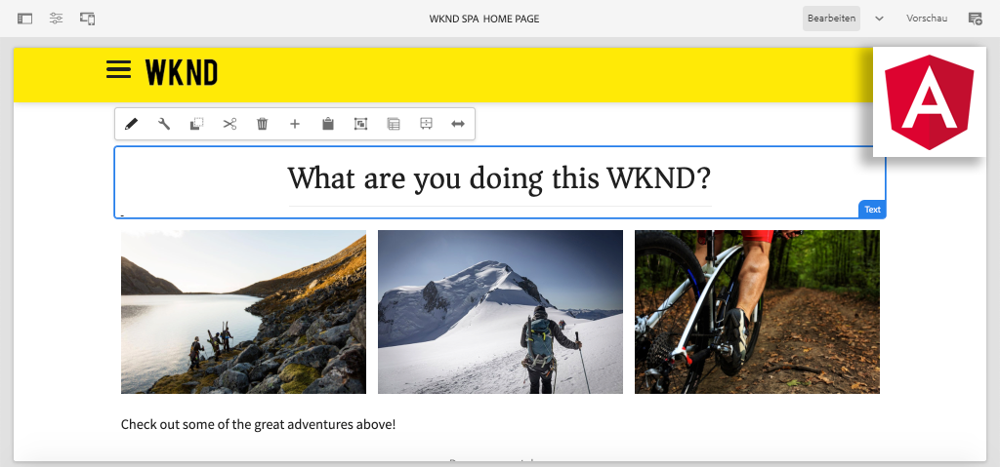

# Erstellen Ihres ersten Angular-SPA-Projekts in AEM {#introduction}

Willkommen bei einem mehrteiligen Tutorial, das für Entwickler konzipiert ist, die neu bei der **SPA Editor** Funktion in Adobe Experience Manager (AEM). Dieses Tutorial führt durch die Implementierung einer Angular-Anwendung für eine fiktive Lifestyle-Marke, die WKND. Das Angular-Programm wird entwickelt und für die Bereitstellung mit AEM SPA Editor entwickelt, der Angular-Komponenten AEM Komponenten zuordnet. Die abgeschlossene SPA, die in AEM bereitgestellt wird, kann mit herkömmlichen In-line-Bearbeitungswerkzeugen von AEM dynamisch erstellt werden.



*WKND SPA Implementierung*

## Info

Ziel dieses mehrteiligen Tutorials ist es, Entwicklern beizubringen, wie eine Angular-Anwendung implementiert wird, um mit der SPA Editor-Funktion von AEM zu arbeiten. In einem realen Szenario werden die Entwicklungsaktivitäten nach Persona aufgeschlüsselt, wobei häufig eine **Frontend-Entwickler** und **Back End-Entwickler**. Wir glauben, dass es für jeden Entwickler, der an einem AEM SPA Editor-Projekt beteiligt sein wird, von Vorteil ist, dieses Tutorial abzuschließen.

Das Tutorial wurde für die Verwendung mit **AEM as a Cloud Service** und ist abwärtskompatibel mit **AEM 6.5.4+** und **AEM 6.4.8+**. Die SPA wird mithilfe von implementiert:

* [Maven-AEM-Projektarchetyp](https://experienceleague.adobe.com/docs/experience-manager-core-components/using/developing/archetype/overview.html?lang=de)
* [SPA Editor](https://experienceleague.adobe.com/docs/experience-manager-65/developing/headless/spas/spa-walkthrough.html#content-editing-experience-with-spa)
* [Kernkomponenten](https://experienceleague.adobe.com/docs/experience-manager-core-components/using/introduction.html?lang=de)
* [Angular](https://angular.io/)

*Schätzen Sie 1-2 Stunden, um die einzelnen Teile des Tutorials zu durchlaufen.*

## Neuester Code

Den gesamten Tutorial-Code finden Sie unter [GitHub](https://github.com/adobe/aem-guides-wknd-spa).

Die [aktuelle Codebasis](https://github.com/adobe/aem-guides-wknd-spa/releases) ist als herunterladbare AEM Packages verfügbar.

## Voraussetzungen

Bevor Sie mit diesem Tutorial beginnen, benötigen Sie Folgendes:

* Grundlegendes zu HTML, CSS und JavaScript
* Grundlegende Vertrautheit mit [Angular](https://angular.io/)
* [AEM as a Cloud Service SDK](https://experienceleague.adobe.com/docs/experience-manager-learn/cloud-service/local-development-environment-set-up/aem-runtime.html?lang=de#download-the-aem-as-a-cloud-service-sdk), [AEM 6.5.4+](https://helpx.adobe.com/experience-manager/aem-releases-updates.html#65) oder [AEM 6.4.8+](https://helpx.adobe.com/experience-manager/aem-releases-updates.html#64)
* [Java](https://downloads.experiencecloud.adobe.com/content/software-distribution/en/general.html)
* [Apache Maven](https://maven.apache.org/) (3.3.9 oder höher)
* [Node.js](https://nodejs.org/en/) und [npm](https://www.npmjs.com/)

*Es ist zwar nicht erforderlich, es ist jedoch von Vorteil, über ein grundlegendes Verständnis der [Entwickeln herkömmlicher AEM Sites-Komponenten](https://experienceleague.adobe.com/docs/experience-manager-learn/getting-started-wknd-tutorial-develop/overview.html?lang=de).*

## Lokale Entwicklungsumgebung {#local-dev-environment}

Zum Abschluss dieses Tutorials ist eine lokale Entwicklungsumgebung erforderlich. Screenshots und Videos werden mit dem AEM as a Cloud Service SDK erfasst, das in einer Mac OS-Umgebung mit [Visual Studio-Code](https://code.visualstudio.com/) als IDE. Befehle und Code sollten unabhängig vom lokalen Betriebssystem sein, sofern nicht anders angegeben.

>[!NOTE]
>
> **Neu bei AEM as a Cloud Service?** Sehen Sie sich die [Befolgen Sie die Anleitung zum Einrichten einer lokalen Entwicklungsumgebung mit dem AEM as a Cloud Service SDK.](https://experienceleague.adobe.com/docs/experience-manager-learn/cloud-service/local-development-environment-set-up/overview.html?lang=de).
>
> **Neu bei AEM 6.5?** Sehen Sie sich die [Anleitung zum Einrichten einer lokalen Entwicklungsumgebung](https://experienceleague.adobe.com/docs/experience-manager-learn/foundation/development/set-up-a-local-aem-development-environment.html?lang=de).

## Nächste Schritte {#next-steps}

Worauf wartest du?! Starten Sie das Tutorial, indem Sie zur [SPA Editor-Projekt](create-project.md) Kapitel und erfahren Sie, wie Sie ein Projekt mit aktiviertem SPA-Editor mithilfe des Projektarchetyps AEM erstellen.

## Abwärtskompatibilität {#compatibility}

Der Projektcode für dieses Tutorial wurde für AEM as a Cloud Service erstellt. Damit der Projektcode abwärtskompatibel zu **6.5.4+** und **6.4.8+** mehrere Änderungen vorgenommen wurden.

Die [UberJar](https://experienceleague.adobe.com/docs/experience-manager-65/developing/devtools/ht-projects-maven.html#what-is-the-uberjar) **v6.4.4** wurde als Abhängigkeit einbezogen:

```xml
<!-- Adobe AEM 6.x Dependencies -->
<dependency>
    <groupId>com.adobe.aem</groupId>
    <artifactId>uber-jar</artifactId>
    <version>6.4.4</version>
    <classifier>apis</classifier>
    <scope>provided</scope>
</dependency>
```

Ein zusätzliches Maven-Profil mit dem Namen `classic` wurde hinzugefügt, um den Build zu ändern, um AEM 6.x-Umgebungen auszuwählen:

```xml
  <!-- AEM 6.x Profile to include Core Components-->
    <profile>
        <id>classic</id>
        <activation>
            <activeByDefault>false</activeByDefault>
        </activation>
        <build>
        ...
    </profile>
```

Die `classic` Profil ist standardmäßig deaktiviert. Wenn Sie dem Tutorial mit AEM 6.x folgen, fügen Sie die `classic` Profil, wann immer es angewiesen wird, einen Maven-Build durchzuführen:

```shell
$ mvn clean install -PautoInstallSinglePackage -Pclassic
```

Verwenden Sie beim Generieren eines neuen Projekts für eine AEM-Implementierung immer die neueste Version des [AEM Projektarchetyp](https://github.com/adobe/aem-project-archetype) und aktualisieren Sie die `aemVersion` , um Ihre beabsichtigte Version von AEM auszuwählen.
