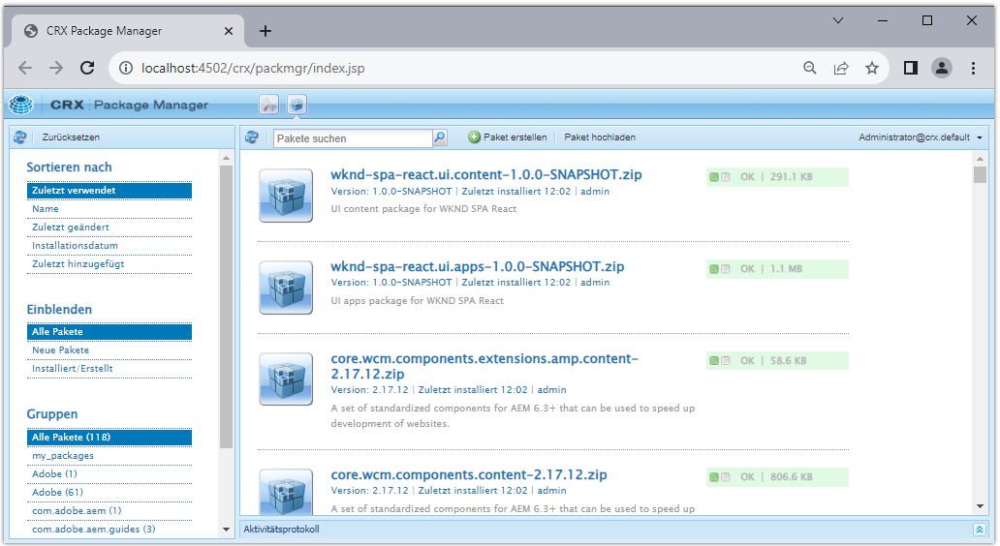
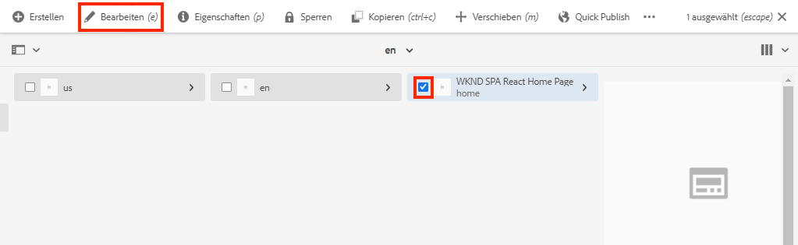
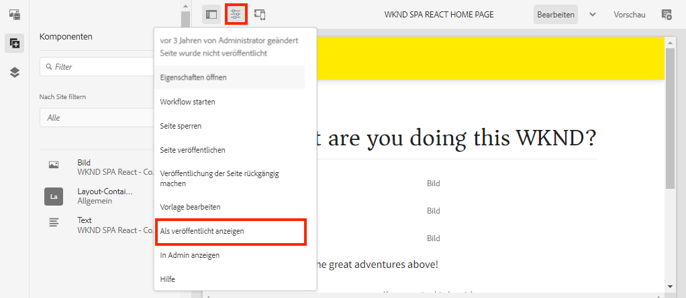

# Erstellen eines Projekts {#spa-editor-project}

Erfahren Sie, wie Sie ein Adobe Experience Manager (AEM)-Maven-Projekt als Ausgangspunkt für eine im AEM-SPA-Editor integrierte React-App erstellen.

## Ziel

1. Erstellen eines SPA-Editor-aktivierten Projekts mithilfe des AEM-Projektarchetyps.
2. Bereitstellen des Ausgangsprojekts in einer lokalen Instanz von AEM.

## Was Sie erstellen werden {#what-build}

In diesem Kapitel wird ein neues AEM-Projekt basierend auf dem [AEM-Projektarchetyp](https://github.com/adobe/aem-project-archetype) erstellt. Das AEM-Projekt wird über einen sehr einfachen Ausgangspunkt für die React-SPA aktiviert („Bootstrapping“).

**Was ist ein Maven-Projekt?** [Apache Maven](https://maven.apache.org/) ist ein Software-Management-Tool zum Erstellen von Projekten. *Alle Adobe Experience Manager*-Implementierungen verwenden Maven-Projekte zum Erstellen, Verwalten und Bereitstellen von benutzerdefiniertem Code zusätzlich zu AEM.

**Was ist ein Maven-Archetyp?** Ein [Maven-Archetyp](https://maven.apache.org/archetype/index.html) ist eine Vorlage oder ein Muster zum Erstellen neuer Projekte. Der AEM-Projektarchetyp ermöglicht es, ein neues Projekt mit einem benutzerdefinierten Namespace zu erstellen und eine Projektstruktur mit Best Practices einzufügen, was zu einer deutlichen Projektbeschleunigung führt.

## Voraussetzungen

Vergegenwärtigen Sie sich die erforderlichen Tools und Anweisungen zum Einrichten einer [lokalen Entwicklungsumgebung](overview.md#local-dev-environment). Stellen Sie sicher, dass eine neue, im **Authoring**-Modus gestartete Instanz von Adobe Experience Manager lokal ausgeführt wird.

## Erstellen eines Projekts {#create}

>[!NOTE]
>
>In diesem Tutorial wird Version **35** des Archetyps verwendet.

1. Öffnen Sie ein Befehlszeilen-Terminal und geben Sie den folgenden Maven-Befehl ein:

   ```shell
   mvn -B org.apache.maven.plugins:maven-archetype-plugin:3.2.1:generate \
    -D archetypeGroupId=com.adobe.aem \
    -D archetypeArtifactId=aem-project-archetype \
    -D archetypeVersion=35 \
    -D appTitle="WKND SPA React" \
    -D appId="wknd-spa-react" \
    -D artifactId="aem-guides-wknd-spa.react" \
    -D groupId="com.adobe.aem.guides.wkndspa.react" \
    -D frontendModule="react" \
    -D aemVersion="cloud"
   ```

   >[!NOTE]
   >
   > Ab AEM 6.5.5 müssen Sie `aemVersion="cloud"` durch `aemVersion="6.5.5"` ersetzen. Ab Version 6.4.8 müssen Sie `aemVersion="6.4.8"` verwenden.

   Achten Sie auf die Eigenschaft `frontendModule=react`. Dadurch wird der AEM-Projektarchetyp angewiesen, das Projekt mit einer [React-Code-Starterbasis](https://experienceleague.adobe.com/docs/experience-manager-core-components/using/developing/archetype/uifrontend-react.html?lang=de) für die Verwendung mit dem AEM-SPA-Editor per Bootstrapping zu aktivieren. Eigenschaften wie `appTitle`, `appId`, `artifactId` und `groupId` werden verwendet, um das Projekt und den Zweck zu identifizieren.

   Eine vollständige Liste der verfügbaren Eigenschaften zum Konfigurieren eines Projekts [finden Sie hier](https://github.com/adobe/aem-project-archetype#available-properties).

1. Die folgende Ordner- und Dateistruktur wird vom Maven-Archetyp in Ihrem lokalen Dateisystem generiert:

   ```plain
   |--- aem-guides-wknd-spa.react/
       |--- LICENSE
       |--- README.md
       |--- all/
       |--- archetype.properties
       |--- core/
       |--- dispatcher/
       |--- it.tests/
       |--- pom.xml
       |--- ui.apps/
       |--- ui.apps.structure/
       |--- ui.config/
       |--- ui.content/
       |--- ui.frontend/
       |--- ui.tests /
       |--- .gitignore
   ```

   Jeder Ordner stellt ein einzelnes Maven-Modul dar. In diesem Tutorial arbeiten wir hauptsächlich mit dem Modul `ui.frontend`, d. h. der React-App. Weitere Informationen zu den einzelnen Modulen finden Sie in der [Dokumentation zum AEM-Projektarchetyp](https://experienceleague.adobe.com/docs/experience-manager-core-components/using/developing/archetype/overview.html?lang=de).

## Erstellen und Bereitstellen des Projekts

Kompilieren und erstellen Sie anschließend mithilfe von Maven den Projekt-Code in einer lokalen Instanz von AEM und stellen Sie ihn bereit.

1. Stellen Sie sicher, dass eine AEM-Instanz lokal über Port **4502** ausgeführt wird.
1. Navigieren Sie in der Befehlszeile zum Projektverzeichnis `aem-guides-wknd-spa.react`.

   ```shell
   $ cd aem-guides-wknd-spa.react
   ```

1. Führen Sie den folgenden Befehl aus, um das gesamte Projekt zu erstellen und in AEM bereitzustellen:

   ```shell
   $ mvn clean install -PautoInstallSinglePackage
   ```

   Der Erstellvorgang dauert etwa eine Minute und sollte mit der folgenden Meldung enden:

   ```shell
   ...
   [INFO] ------------------------------------------------------------------------
   [INFO] Reactor Summary for aem-guides-wknd-spa.react 1.0.0-SNAPSHOT:
   [INFO]
   [INFO] aem-guides-wknd-spa.react .......................... SUCCESS [  0.257 s]
   [INFO] WKND SPA React - Core .............................. SUCCESS [ 12.553 s]
   [INFO] WKND SPA React - UI Frontend ....................... SUCCESS [01:46 min]
   [INFO] WKND SPA React - Repository Structure Package ...... SUCCESS [  1.082 s]
   [INFO] WKND SPA React - UI apps ........................... SUCCESS [  8.237 s]
   [INFO] WKND SPA React - UI content ........................ SUCCESS [  5.633 s]
   [INFO] WKND SPA React - UI config ......................... SUCCESS [  0.234 s]
   [INFO] WKND SPA React - All ............................... SUCCESS [  0.643 s]
   [INFO] WKND SPA React - Integration Tests ................. SUCCESS [ 12.377 s]
   [INFO] WKND SPA React - Dispatcher ........................ SUCCESS [  0.066 s]
   [INFO] WKND SPA React - UI Tests .......................... SUCCESS [  0.074 s]
   [INFO] WKND SPA React - Project Analyser .................. SUCCESS [ 31.287 s]
   [INFO] ------------------------------------------------------------------------
   [INFO] BUILD SUCCESS
   [INFO] ------------------------------------------------------------------------
   ```

   Das Maven-Profil `autoInstallSinglePackage` kompiliert die einzelnen Module des Projekts und stellt der AEM-Instanz ein einziges Paket bereit. Standardmäßig wird dieses Paket in einer AEM-Instanz bereitgestellt, die lokal über den Port **4502** und mit den Anmeldeinformationen von `admin:admin` ausgeführt wird.

1. Navigieren Sie in Ihrer lokalen AEM-Instanz zu **Package Manager**: [http://localhost:4502/crx/packmgr/index.jsp](http://localhost:4502/crx/packmgr/index.jsp).

1. Es sollten mehrere Pakete mit dem Präfix `aem-guides-wknd-spa.react` zu sehen sein.

   

   *AEM Package Manager*

   Der gesamte für das Projekt benötigte benutzerspezifische Code wird in diesen Paketen gebündelt und in der AEM-Umgebung installiert.

## Authoring von Inhalten

Öffnen Sie als Nächstes die Starter-SPA, die vom Archetyp generiert wurde, und aktualisieren Sie einige Inhalte.

1. Navigieren Sie zur **Sites**-Konsole: [http://localhost:4502/sites.html/content](http://localhost:4502/sites.html/content).

   Die WKND-SPA enthält eine grundlegende Website-Struktur mit einem Land, einer Sprache und einer Startseite. Diese Hierarchie basiert auf den Standardwerten des Archetyps für `language_country` und `isSingleCountryWebsite`. Diese Werte können überschrieben werden, indem die [verfügbaren Eigenschaften](https://github.com/adobe/aem-project-archetype#available-properties) beim Erstellen eines Projekts aktualisiert werden.

2. Öffnen Sie die Seite **us** > **en** > **WKND SPA React Home Page**, indem Sie die Seite auswählen und in der Menüleiste auf **Bearbeiten** klicken.

   

3. Eine **Textkomponente** wurde der Seite bereits hinzugefügt. Sie können diese Komponente wie jede andere Komponente in AEM bearbeiten.

   

4. Fügen Sie der Seite eine zusätzliche **Textkomponente** hinzu.

   Beachten Sie, dass das Authoring-Erlebnis dem herkömmlichen AEM Sites-Seitenerlebnis ähnelt. Derzeit ist eine begrenzte Anzahl von Komponenten verfügbar, die verwendet werden können. Im Laufe des Tutorials kommen weitere hinzu.

## Überprüfen der Single Page Application

Überprüfen Sie anschließend mithilfe der Entwickler-Tools Ihres Browsers, ob es sich um eine Single Page Application handelt.

1. Klicken Sie im **Seiten-Editor** auf die Schaltfläche **Seiteninformationen** und dann auf **Als veröffentlicht anzeigen**:

   

   Dadurch wird eine neue Registerkarte mit dem Abfrageparameter `?wcmmode=disabled` geöffnet, wodurch der AEM-Editor deaktiviert wird: [http://localhost:4502/content/wknd-spa-react/us/en/home.html?wcmmode=disabled](http://localhost:4502/content/wknd-spa-react/us/en/home.html?wcmmode=disabled)

2. Zeigen Sie den Quell-Code der Seite an. Sie werden feststellen, dass weder der Text **[!DNL Hello World]** noch der andere Inhalt vorhanden ist. Stattdessen sollten Sie HTML-Code wie den folgenden sehen:

   ```html
   ...
   <body>
       <noscript>You need to enable JavaScript to run this app.</noscript>
       <div id="spa-root"></div>
       <script type="text/javascript" src="/etc.clientlibs/wknd-spa-react/clientlibs/clientlib-react.lc-xxxx-lc.min.js"></script>
   </body>
   ...
   ```

   `clientlib-react.min.js` ist die React-SPA, die auf die Seite geladen wird und für das Rendering des Inhalts verantwortlich ist.

   Aber *woher kommt der Inhalt eigentlich?*

3. Kehren Sie zur Registerkarte zurück: [http://localhost:4502/content/wknd-spa-react/us/en/home.html?wcmmode=disabled](http://localhost:4502/content/wknd-spa-react/us/en/home.html?wcmmode=disabled)
4. Öffnen Sie die Entwickler-Tools des Browsers und überprüfen Sie den Netzwerk-Traffic der Seite während einer Aktualisierung. Zeigen Sie die **XHR**-Anfragen an:

   

   Es sollte eine Anfrage an [http://localhost:4502/content/wknd-spa-react/us/en.model.json](http://localhost:4502/content/wknd-spa-react/us/en.model.json) vorhanden sein. Diese enthält den gesamten Inhalt, formatiert in JSON, für die SPA.

5. Öffnen Sie Folgendes auf einer neuen Registerkarte: [http://localhost:4502/content/wknd-spa-react/us/en.model.json](http://localhost:4502/content/wknd-spa-react/us/en.model.json)

   Die Anfrage `en.model.json` stellt das Inhaltsmodell für die Anwendung dar. Überprüfen Sie die JSON-Ausgabe. Sie sollten den Code-Ausschnitt finden können, der für die **[!UICONTROL Text]**-Komponente(n) steht.

   ```json
   ...
   ":items": {
       "text": {
           "text": "<p>Hello World! Updated content!</p>\r\n",
           "richText": true,
           ":type": "wknd-spa-react/components/text"
       },
       "text_98796435": {
           "text": "<p>A new text component.</p>\r\n",
           "richText": true,
           ":type": "wknd-spa-react/components/text"
       },
   }
   ...
   ```

   Im nächsten Kapitel untersuchen wir, wie dieser JSON-Inhalt von AEM-Komponenten zu SPA-Komponenten zugeordnet wird, um die Grundlage für das AEM-SPA-Editor-Erlebnis zu bilden.

   >[!NOTE]
   >
   > Es kann hilfreich sein, eine Browser-Erweiterung zu installieren, um die JSON-Ausgabe automatisch zu formatieren.

## Herzlichen Glückwunsch! {#congratulations}

Herzlichen Glückwunsch! Sie haben soeben Ihr erstes AEM-SPA-Editor-Projekt erstellt.

Noch ist die SPA ganz einfach gehalten. In den nächsten Kapiteln kommen aber weitere Funktionen dazu.

### Nächste Schritte {#next-steps}

[SPA integrieren](integrate-spa.md): Erfahren Sie, wie der SPA-Quell-Code in das AEM-Projekt integriert ist, und lernen Sie die verfügbaren Tools für eine schnelle SPA-Entwicklung kennen.
