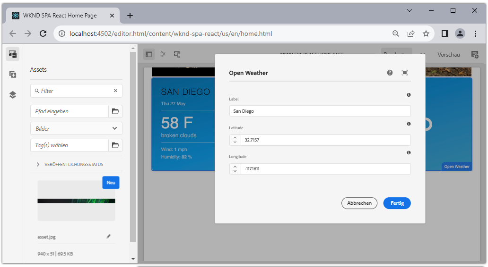
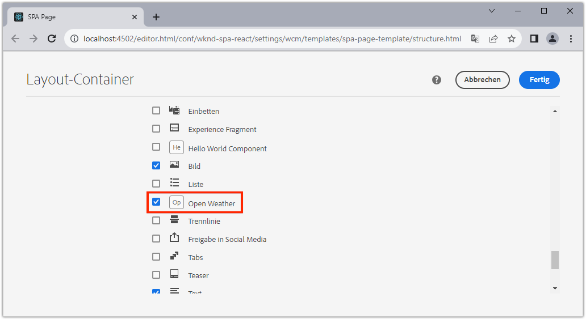
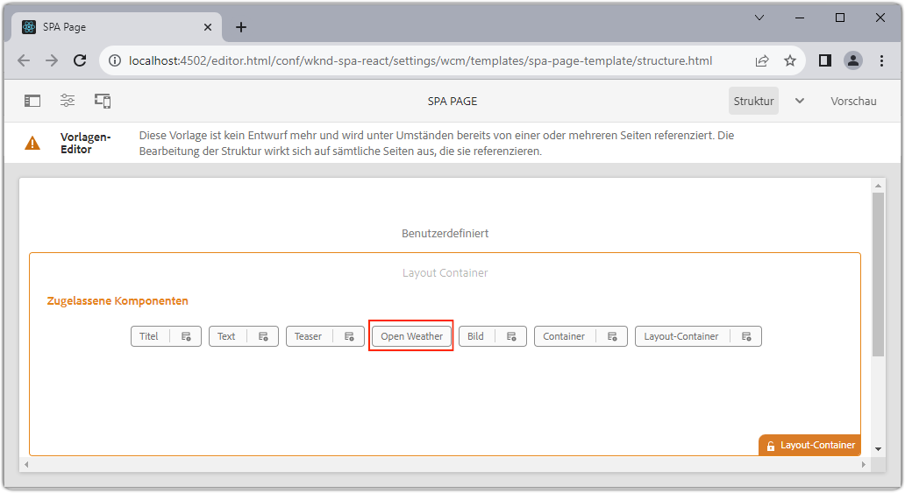
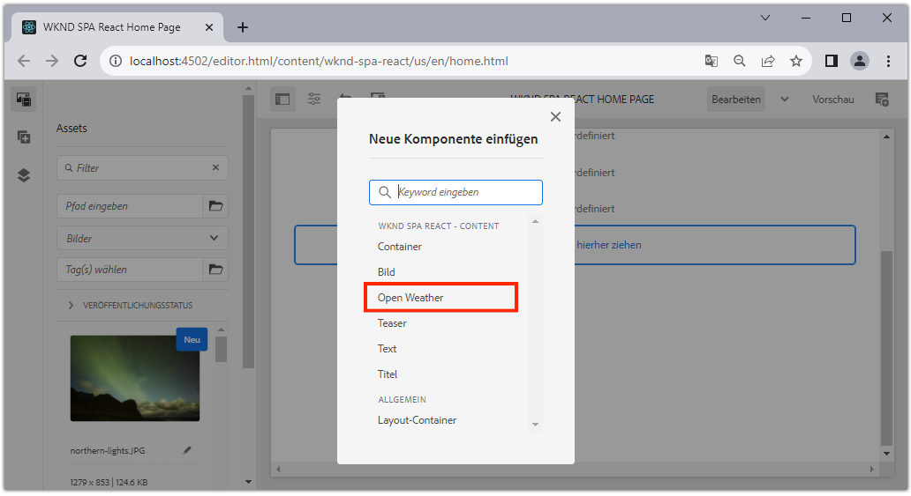
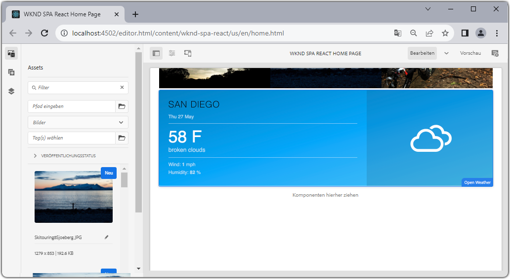

# Erstellen einer benutzerdefinierten WeatherComponent {#custom-component}

Erfahren Sie, wie Sie eine benutzerdefinierte Wetterkomponente erstellen, die mit dem AEM-SPA-Editor verwendet werden kann. Erfahren Sie, wie Sie Autorendialogfelder und Sling-Modelle entwickeln, um das JSON-Modell zu erweitern und eine benutzerdefinierte Komponente zu füllen. Die [Open Weather API](https://openweathermap.org) und die [Open Weather-Komponente von React](https://www.npmjs.com/package/react-open-weather) werden verwendet.

## Ziel

1. Machen Sie sich mit der Rolle von Sling-Modellen bei der Bearbeitung der von AEM bereitgestellten JSON-Modell-API vertraut.
2. Erfahren Sie, wie Sie neue AEM-Komponenten-Dialogfelder erstellen.
3. Lernen Sie, eine **benutzerdefinierte** AEM-Komponente zu erstellen, die mit dem Framework des SPA-Editors kompatibel ist.

## Was Sie erstellen werden

Es wird eine einfache Wetterkomponente erstellt. Diese Komponente kann von Inhaltsautorinnen und -autoren zur SPA hinzugefügt werden. Über ein AEM-Dialogfeld können Autorinnen und Autoren den Ort festlegen, für den das Wetter angezeigt werden soll.  Die Implementierung dieser Komponente zeigt die Schritte, die zum Erstellen einer neuen AEM-Komponente erforderlich sind, die mit dem Framework des AEM-SPA-Editors kompatibel ist.



## Voraussetzungen

Vergegenwärtigen Sie sich die erforderlichen Tools und Anweisungen zum Einrichten einer [lokalen Entwicklungsumgebung](overview.md#local-dev-environment). Dieses Kapitel ist eine Fortsetzung des Kapitels [Navigation und Routing](navigation-routing.md). Um diesem Kapitel zu folgen, benötigen Sie lediglich ein SPA-aktiviertes AEM-Projekt, das in einer lokalen AEM-Instanz bereitgestellt wird.

### Open Weather-API-Schlüssel

Um dem Tutorial folgen zu können, benötigen Sie einen API-Schlüssel von [Open Weather](https://openweathermap.org/). Die Anmeldung ist für eine begrenzte Anzahl von API-Aufrufen [kostenlos](https://home.openweathermap.org/users/sign_up).

## Definieren der AEM-Komponente

Eine AEM-Komponente ist definiert als ein Knoten und Eigenschaften. Im Projekt werden diese Knoten und Eigenschaften als XML-Dateien im `ui.apps`-Modul dargestellt. Erstellen Sie anschließend die AEM-Komponente im `ui.apps`-Modul.

>[!NOTE]
>
> Eine kurze Auffrischung der [Grundlagen der AEM-Komponenten könnte hilfreich sein](https://experienceleague.adobe.com/docs/experience-manager-learn/getting-started-wknd-tutorial-develop/project-archetype/component-basics.html?lang=de).

1. Öffnen Sie den Ordner `ui.apps` in der IDE Ihrer Wahl.
2. Navigieren Sie zu `ui.apps/src/main/content/jcr_root/apps/wknd-spa-react/components` und erstellen Sie einen neuen Ordner namens `open-weather`.
3. Erstellen Sie eine neue Datei mit dem Namen `.content.xml` unterhalb des Ordners `open-weather`. Befüllen Sie `open-weather/.content.xml` mit dem Folgenden:

   ```xml
   <?xml version="1.0" encoding="UTF-8"?>
   <jcr:root xmlns:sling="http://sling.apache.org/jcr/sling/1.0" xmlns:cq="http://www.day.com/jcr/cq/1.0" xmlns:jcr="http://www.jcp.org/jcr/1.0"
       jcr:primaryType="cq:Component"
       jcr:title="Open Weather"
       componentGroup="WKND SPA React - Content"/>
   ```

   

   `jcr:primaryType="cq:Component"`: gibt an, dass dieser Knoten eine AEM-Komponente ist.

   `jcr:title` ist der Wert, der den Inhaltsautorinnen und -autoren angezeigt wird, und `componentGroup` bestimmt die Gruppierung von Komponenten in der Authoring-Benutzeroberfläche.

4. Erstellen Sie unter dem Ordner `custom-component` einen weiteren Ordner mit dem Namen `_cq_dialog`.
5. Erstellen Sie unter dem Ordner `_cq_dialog` eine neue Datei mit dem Namen `.content.xml` und fügen Sie Folgendes hinzu:

   ```xml
   <?xml version="1.0" encoding="UTF-8"?>
   <jcr:root xmlns:sling="http://sling.apache.org/jcr/sling/1.0" xmlns:granite="http://www.adobe.com/jcr/granite/1.0" xmlns:cq="http://www.day.com/jcr/cq/1.0" xmlns:jcr="http://www.jcp.org/jcr/1.0" xmlns:nt="http://www.jcp.org/jcr/nt/1.0"
       jcr:primaryType="nt:unstructured"
       jcr:title="Open Weather"
       sling:resourceType="cq/gui/components/authoring/dialog">
       <content
           jcr:primaryType="nt:unstructured"
           sling:resourceType="granite/ui/components/coral/foundation/container">
           <items jcr:primaryType="nt:unstructured">
               <tabs
                   jcr:primaryType="nt:unstructured"
                   sling:resourceType="granite/ui/components/coral/foundation/tabs"
                   maximized="{Boolean}true">
                   <items jcr:primaryType="nt:unstructured">
                       <properties
                           jcr:primaryType="nt:unstructured"
                           jcr:title="Properties"
                           sling:resourceType="granite/ui/components/coral/foundation/container"
                           margin="{Boolean}true">
                           <items jcr:primaryType="nt:unstructured">
                               <columns
                                   jcr:primaryType="nt:unstructured"
                                   sling:resourceType="granite/ui/components/coral/foundation/fixedcolumns"
                                   margin="{Boolean}true">
                                   <items jcr:primaryType="nt:unstructured">
                                       <column
                                           jcr:primaryType="nt:unstructured"
                                           sling:resourceType="granite/ui/components/coral/foundation/container">
                                           <items jcr:primaryType="nt:unstructured">
                                               <label
                                                   jcr:primaryType="nt:unstructured"
                                                   sling:resourceType="granite/ui/components/coral/foundation/form/textfield"
                                                   fieldDescription="The label to display for the component"
                                                   fieldLabel="Label"
                                                   name="./label"/>
                                               <lat
                                                   jcr:primaryType="nt:unstructured"
                                                   sling:resourceType="granite/ui/components/coral/foundation/form/numberfield"
                                                   fieldDescription="The latitude of the location."
                                                   fieldLabel="Latitude"
                                                   step="any"
                                                   name="./lat" />
                                               <lon
                                                   jcr:primaryType="nt:unstructured"
                                                   sling:resourceType="granite/ui/components/coral/foundation/form/numberfield"
                                                   fieldDescription="The longitude of the location."
                                                   fieldLabel="Longitude"
                                                   step="any"
                                                   name="./lon"/>
                                           </items>
                                       </column>
                                   </items>
                               </columns>
                           </items>
                       </properties>
                   </items>
               </tabs>
           </items>
       </content>
   </jcr:root>
   ```

   

   Die obige XML-Datei generiert ein sehr einfaches Dialogfeld für die `Weather Component`. Der kritische Teil der Datei sind die inneren Knoten `<label>`, `<lat>` und `<lon>`. Dieser Dialog enthält zwei `numberfield`s und ein `textfield`, mit denen Benutzende das anzuzeigende Wetter konfigurieren können.

   Als Nächstes wird ein Sling-Modell erstellt, um den Wert der Eigenschaften `label`, `lat` und `long` über das JSON-Modell offenzulegen.

   >[!NOTE]
   >
   > Sie können viele weitere [Beispiele für Dialoge in den Kernkomponenten-Definitionen sehen](https://github.com/adobe/aem-core-wcm-components/tree/master/content/src/content/jcr_root/apps/core/wcm/components). Sie können auch zusätzliche Formularfelder anzeigen, zum Beispiel `select`, `textarea`, `pathfield`, verfügbar unter `/libs/granite/ui/components/coral/foundation/form` in [CRXDE-Lite](http://localhost:4502/crx/de/index.jsp#/libs/granite/ui/components/coral/foundation/form).

   Bei einer herkömmlichen AEM-Komponente ist normalerweise ein [HTL](https://experienceleague.adobe.com/docs/experience-manager-htl/using/overview.html?lang=de)-Skript erforderlich. Da die SPA die Komponente rendert, ist kein HTL-Skript erforderlich.

## Erstellen des Sling-Modells

Sling-Modelle sind von Anmerkungen gesteuerte Java „POJO&#39;s“ (Plain Old Java Objects), die die Zuordnung von Daten aus dem JCR auf Java-Variablen erleichtern. [Sling-Modelle](https://experienceleague.adobe.com/docs/experience-manager-learn/getting-started-wknd-tutorial-develop/project-archetype/component-basics.html?lang=de#sling-models) dienen normalerweise dazu, komplexe Server-seitige Geschäftslogik für AEM-Komponenten einzukapseln.

Im Zusammenhang mit dem SPA-Editor stellen Sling-Modelle den Inhalt einer Komponente durch das JSON-Modell über eine Funktion mit dem [Sling-Modell-Exporter](https://experienceleague.adobe.com/docs/experience-manager-learn/foundation/development/develop-sling-model-exporter.html?lang=de) dar.

1. Öffnen Sie das `core`-Modul unter `aem-guides-wknd-spa.react/core` in der IDE Ihrer Wahl.
1. Erstellen Sie eine Datei mit dem Namen `OpenWeatherModel.java` unter `core/src/main/java/com/adobe/aem/guides/wkndspa/react/core/models`.
1. Befüllen Sie `OpenWeatherModel.java` wie folgt:

   ```java
   package com.adobe.aem.guides.wkndspa.react.core.models;
   
   import com.adobe.cq.export.json.ComponentExporter;
   
   // Sling Models intended to be used with SPA Editor must extend ComponentExporter interface
   public interface OpenWeatherModel extends ComponentExporter {
       public String getLabel();
       public double getLat();
       public double getLon();
   }
   ```

   Dies ist die Java-Schnittstelle für unsere Komponente. Damit unser Sling-Modell mit dem SPA-Editor-Framework kompatibel ist, muss es die `ComponentExporter`-Klasse erweitern.

1. Erstellen Sie einen Ordner mit dem Namen `impl` unterhalb von `core/src/main/java/com/adobe/aem/guides/wkndspa/react/core/models`.
1. Erstellen Sie eine Datei mit dem Namen `OpenWeatherModelImpl.java` unterhalb von `impl` und fügen Sie Folgendes ein:

   ```java
   package com.adobe.aem.guides.wkndspa.react.core.models.impl;
   
   import org.apache.sling.models.annotations.*;
   import org.apache.sling.models.annotations.injectorspecific.ValueMapValue;
   import com.adobe.cq.export.json.ComponentExporter;
   import com.adobe.cq.export.json.ExporterConstants;
   import org.apache.commons.lang3.StringUtils;
   import org.apache.sling.api.SlingHttpServletRequest;
   import com.adobe.aem.guides.wkndspa.react.core.models.OpenWeatherModel;
   
   // Sling Model annotation
   @Model(
       adaptables = SlingHttpServletRequest.class, 
       adapters = { OpenWeatherModel.class, ComponentExporter.class }, 
       resourceType = OpenWeatherModelImpl.RESOURCE_TYPE, 
       defaultInjectionStrategy = DefaultInjectionStrategy.OPTIONAL
   )
   @Exporter( //Exporter annotation that serializes the modoel as JSON
       name = ExporterConstants.SLING_MODEL_EXPORTER_NAME, 
       extensions = ExporterConstants.SLING_MODEL_EXTENSION
   )
   public class OpenWeatherModelImpl implements OpenWeatherModel {
   
       @ValueMapValue
       private String label; //maps variable to jcr property named "label" persisted by Dialog
   
       @ValueMapValue
       private double lat; //maps variable to jcr property named "lat"
   
       @ValueMapValue
       private double lon; //maps variable to jcr property named "lon"
   
       // points to AEM component definition in ui.apps
       static final String RESOURCE_TYPE = "wknd-spa-react/components/open-weather";
   
       // public getter method to expose value of private variable `label`
       // adds additional logic to default the label to "(Default)" if not set.
       @Override
       public String getLabel() {
           return StringUtils.isNotBlank(label) ? label : "(Default)";
       }
   
       // public getter method to expose value of private variable `lat`
       @Override
       public double getLat() {
           return lat;
       }
   
       // public getter method to expose value of private variable `lon`
       @Override
       public double getLon() {
           return lon;
       }
   
       // method required by `ComponentExporter` interface
       // exposes a JSON property named `:type` with a value of `wknd-spa-react/components/open-weather`
       // required to map the JSON export to the SPA component props via the `MapTo`
       @Override
       public String getExportedType() {
           return OpenWeatherModelImpl.RESOURCE_TYPE;
       }
   } 
   ```

   Die statische Variable `RESOURCE_TYPE` muss auf den Pfad in `ui.apps` der Komponente zeigen. `getExportedType()` wird verwendet, um die JSON-Eigenschaften über `MapTo` auf die SPA-Komponente abzubilden. `@ValueMapValue` ist eine Anmerkung, die die vom Dialog gespeicherte jcr-Eigenschaft liest.

## Aktualisieren der SPA

Aktualisieren Sie als Nächstes den React-Code, um die [Komponente „React Open Weather“](https://www.npmjs.com/package/react-open-weather) einzubinden, und lassen Sie sie der in den vorherigen Schritten erstellten AEM-Komponente zuordnen.

1. Installieren Sie die Komponente „React Open Weather“ als **npm**-Abhängigkeit:

   ```shell
   $ cd aem-guides-wknd-spa.react/ui.frontend
   $ npm i react-open-weather
   ```

1. Erstellen Sie einen neuen Ordner mit dem Namen `OpenWeather` unter `ui.frontend/src/components/OpenWeather`.
1. Fügen Sie eine Datei mit dem Namen `OpenWeather.js` hinzu und fügen Sie Folgendes ein:

   ```js
   import React from 'react';
   import {MapTo} from '@adobe/aem-react-editable-components';
   import ReactWeather, { useOpenWeather } from 'react-open-weather';
   
   // Open weather API Key
   // For simplicity it is hard coded in the file, ideally this is extracted in to an environment variable
   const API_KEY = 'YOUR_API_KEY';
   
   // Logic to render placeholder or component
   const OpenWeatherEditConfig = {
   
       emptyLabel: 'Weather',
       isEmpty: function(props) {
           return !props || !props.lat || !props.lon || !props.label;
       }
   };
   
   // Wrapper function that includes react-open-weather component
   function ReactWeatherWrapper(props) {
       const { data, isLoading, errorMessage } = useOpenWeather({
           key: API_KEY,
           lat: props.lat, // passed in from AEM JSON
           lon: props.lon, // passed in from AEM JSON
           lang: 'en',
           unit: 'imperial', // values are (metric, standard, imperial)
       });
   
       return (
           <div className="cmp-open-weather">
               <ReactWeather
                   isLoading={isLoading}
                   errorMessage={errorMessage}
                   data={data}
                   lang="en"
                   locationLabel={props.label} // passed in from AEM JSON
                   unitsLabels={{ temperature: 'F', windSpeed: 'mph' }}
                   showForecast={false}
                 />
           </div>
       );
   }
   
   export default function OpenWeather(props) {
   
           // render nothing if component not configured
           if (OpenWeatherEditConfig.isEmpty(props)) {
               return null;
           }
   
           // render ReactWeather component if component configured
           // pass props to ReactWeatherWrapper. These props include the mapped properties from AEM JSON
           return ReactWeatherWrapper(props);
   
   }
   
   // Map OpenWeather to AEM component
   MapTo('wknd-spa-react/components/open-weather')(OpenWeather, OpenWeatherEditConfig);
   ```

1. Aktualisieren Sie `import-components.js` unter `ui.frontend/src/components/import-components.js`, um die Komponente `OpenWeather` einzuschließen:

   ```diff
     // import-component.js
     import './Container/Container';
     import './ExperienceFragment/ExperienceFragment';
   + import './OpenWeather/OpenWeather';
   ```

1. Stellen Sie mithilfe Ihrer Maven-Kenntnisse alle Aktualisierungen in einer lokalen AEM-Umgebung aus dem Stammverzeichnis des Projektverzeichnisses bereit:

   ```shell
   $ cd aem-guides-wknd-spa.react
   $ mvn clean install -PautoInstallSinglePackage
   ```

## Aktualisieren der Vorlagenrichtlinie

Navigieren Sie anschließend zu AEM, um die Aktualisierungen zu überprüfen und zuzulassen, dass die Komponente `OpenWeather` zur SPA hinzugefügt wird.

1. Überprüfen Sie die Registrierung des neuen Sling-Modells, indem Sie zu [http://localhost:4502/system/console/status-slingmodels](http://localhost:4502/system/console/status-slingmodels) navigieren.

   ```plain
   com.adobe.aem.guides.wkndspa.react.core.models.impl.OpenWeatherModelImpl - wknd-spa-react/components/open-weather
   
   com.adobe.aem.guides.wkndspa.react.core.models.impl.OpenWeatherModelImpl exports 'wknd-spa-react/components/open-weather' with selector 'model' and extension '[Ljava.lang.String;@2fd80fc5' with exporter 'jackson'
   ```

   Sie sollten die beiden obigen Zeilen sehen, die anzeigen, dass die `OpenWeatherModelImpl` mit der Komponente `wknd-spa-react/components/open-weather` verbunden ist und dass sie über den Sling-Modell-Exporter registriert ist.

1. Navigieren Sie zu der SPA-Seitenvorlage unter [http://localhost:4502/editor.html/conf/wknd-spa-react/settings/wcm/templates/spa-page-template/structure.html](http://localhost:4502/editor.html/conf/wknd-spa-react/settings/wcm/templates/spa-page-template/structure.html).
1. Aktualisieren Sie die Richtlinie des Layout-Containers, um das neue `Open Weather` als zulässige Komponente hinzuzufügen:

   

   Speichern Sie die Änderungen an der Richtlinie und betrachten Sie die `Open Weather` als zulässige Komponente:

   

## Erstellen der Komponente „Open Weather“

Als Nächstes erstellen Sie mit dem AEM-SPA-Editor die Komponente `Open Weather`.

1. Navigieren Sie zu [http://localhost:4502/editor.html/content/wknd-spa-react/us/en/home.html](http://localhost:4502/editor.html/content/wknd-spa-react/us/en/home.html).
1. Fügen Sie im `Edit`-Modus `Open Weather` zum `Layout Container` hinzu:

   

1. Öffnen Sie das Dialogfeld der Komponente und geben Sie einen **Titel**, **Breitengrad** und **Längengrad** ein. Zum Beispiel **San Diego**, **32.7157** und **-117.1611**. Die Zahlen der westlichen Hemisphäre und der südlichen Hemisphäre werden mit der Open Weather-API als negative Zahlen dargestellt.

   

   Dies ist das Dialogfeld, das basierend auf der XML-Datei früher im Kapitel erstellt wurde.

1. Speichern Sie die Änderungen. Beachten Sie, dass das Wetter für **San Diego** angezeigt wird:

   

1. Zeigen Sie das JSON-Modell durch Navigieren zu [http://localhost:4502/content/wknd-spa-react/us/en.model.json](http://localhost:4502/content/wknd-spa-react/us/en.model.json) an. Suchen Sie nach `wknd-spa-react/components/open-weather`:

   ```json
   "open_weather": {
       "label": "San Diego",
       "lat": 32.7157,
       "lon": -117.1611,
       ":type": "wknd-spa-react/components/open-weather"
   }
   ```

   Die JSON-Werte werden vom Sling-Modell ausgegeben. Diese JSON-Werte werden als Props an die React-Komponente übergeben.

## Herzlichen Glückwunsch! {#congratulations}

Herzlichen Glückwunsch! Sie haben gelernt, wie Sie eine benutzerdefinierte AEM-Komponente erstellen, die mit dem SPA-Editor verwendet werden kann. Außerdem haben Sie erfahren, wie Dialogfelder, JCR-Eigenschaften und Sling-Modelle interagieren, um das JSON-Modell auszugeben.

### Nächste Schritte {#next-steps}

[Erweitern einer Kernkomponente](extend-component.md): Erfahren Sie, wie Sie eine vorhandene AEM Kernkomponente erweitern, die mit dem AEM-SPA-Editor verwendet werden kann. Das Verständnis, wie Eigenschaften und Inhalte zu einer vorhandenen Komponente hinzugefügt werden, ist eine leistungsstarke Methode, um die Funktionen einer Implementierung des AEM-SPA-Editors zu erweitern.
