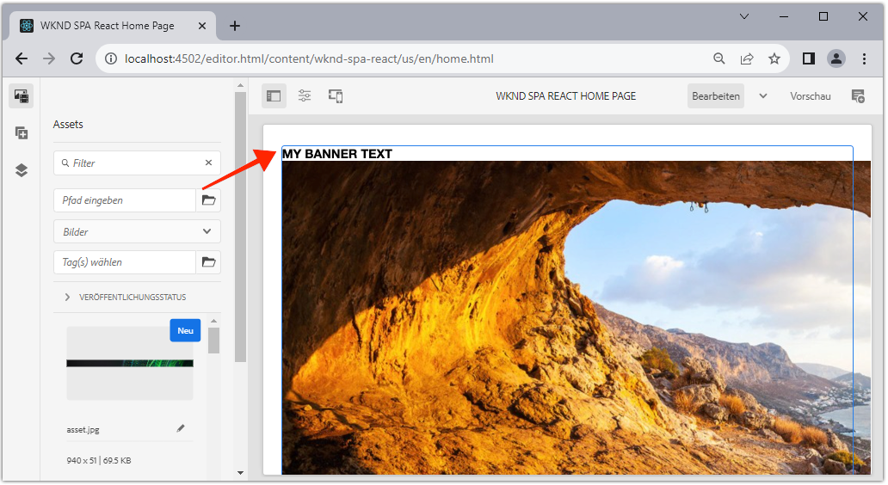

# Erweitern einer Kernkomponente {#extend-component}

Erfahren Sie, wie Sie eine vorhandene Kernkomponente erweitern, um sie mit dem AEM SPA Editor zu verwenden. Das Verständnis, wie eine vorhandene Komponente erweitert wird, ist eine leistungsstarke Methode, um die Funktionen einer AEM SPA Editor-Implementierung anzupassen und zu erweitern.

## Ziel

1. Erweitern einer vorhandenen Kernkomponente mit zusätzlichen Eigenschaften und Inhalten.
2. Grundlegendes zur Komponentenvererbung mit der Verwendung von `sling:resourceSuperType`.
3. Erfahren Sie, wie Sie die [Delegationsmuster](https://github.com/adobe/aem-core-wcm-components/wiki/Delegation-Pattern-for-Sling-Models) für Sling-Modelle zur Wiederverwendung vorhandener Logik und Funktionalität.

## Was Sie erstellen werden

Dieses Kapitel zeigt den zusätzlichen Code, der zum Hinzufügen einer zusätzlichen Eigenschaft zu einem Standard erforderlich ist `Image` -Komponente, um die Anforderungen für eine neue `Banner` -Komponente. Die `Banner` -Komponente enthält alle gleichen Eigenschaften wie der Standard `Image` -Komponente, enthält jedoch eine zusätzliche Eigenschaft, mit der Benutzer die **Bannertext**.


## Voraussetzungen

Überprüfen Sie die erforderlichen Tools und Anweisungen zum Einrichten eines [lokale Entwicklungsumgebung](overview.md#local-dev-environment). Es wird davon ausgegangen, dass die Benutzer des Tutorials zu diesem Zeitpunkt ein solides Verständnis der AEM SPA Editor-Funktion haben.

## Vererbung mit Sling Resource Super Type {#sling-resource-super-type}

Um eine vorhandene Komponente zu erweitern, legen Sie eine Eigenschaft mit dem Namen fest `sling:resourceSuperType` in der Definition Ihrer Komponente.  `sling:resourceSuperType`ist [property](https://sling.apache.org/documentation/the-sling-engine/resources.html#resource-properties) , die für die Definition einer AEM Komponente festgelegt werden können, die auf eine andere Komponente verweist. Dadurch wird die Komponente explizit so eingestellt, dass sie alle Funktionen der Komponente übernimmt, die als `sling:resourceSuperType`.

Wenn wir die `Image` Komponente bei `wknd-spa-react/components/image` Wir müssen den Code im `ui.apps` -Modul.

1. Erstellen Sie einen neuen Ordner unter dem `ui.apps` -Modul für `banner` at `ui.apps/src/main/content/jcr_root/apps/wknd-spa-react/components/banner`.
1. darunter `banner` Erstellen einer Komponentendefinition (`.content.xml`) wie folgt:

   ```xml
   <?xml version="1.0" encoding="UTF-8"?>
   <jcr:root xmlns:sling="http://sling.apache.org/jcr/sling/1.0" xmlns:cq="http://www.day.com/jcr/cq/1.0" xmlns:jcr="http://www.jcp.org/jcr/1.0"
       jcr:primaryType="cq:Component"
       jcr:title="Banner"
       sling:resourceSuperType="wknd-spa-react/components/image"
       componentGroup="WKND SPA React - Content"/>
   ```

   Diese Einstellung `wknd-spa-react/components/banner` alle Funktionen von `wknd-spa-react/components/image`.

## cq:editConfig {#cq-edit-config}

Die `_cq_editConfig.xml` -Datei bestimmt das Drag-and-Drop-Verhalten in der AEM Authoring-Benutzeroberfläche. Beim Erweitern der Bildkomponente ist es wichtig, dass der Ressourcentyp mit der Komponente selbst übereinstimmt.

1. Im `ui.apps` -Modul erstellen Sie eine weitere Datei unter `banner` benannt `_cq_editConfig.xml`.
1. Auffüllen `_cq_editConfig.xml` mit der folgenden XML-Datei:

   ```xml
   <?xml version="1.0" encoding="UTF-8"?>
   <jcr:root xmlns:sling="http://sling.apache.org/jcr/sling/1.0" xmlns:cq="http://www.day.com/jcr/cq/1.0" xmlns:jcr="http://www.jcp.org/jcr/1.0" xmlns:nt="http://www.jcp.org/jcr/nt/1.0"
       jcr:primaryType="cq:EditConfig">
       <cq:dropTargets jcr:primaryType="nt:unstructured">
           <image
               jcr:primaryType="cq:DropTargetConfig"
               accept="[image/gif,image/jpeg,image/png,image/webp,image/tiff,image/svg\\+xml]"
               groups="[media]"
               propertyName="./fileReference">
               <parameters
                   jcr:primaryType="nt:unstructured"
                   sling:resourceType="wknd-spa-react/components/banner"
                   imageCrop=""
                   imageMap=""
                   imageRotate=""/>
           </image>
       </cq:dropTargets>
       <cq:inplaceEditing
           jcr:primaryType="cq:InplaceEditingConfig"
           active="{Boolean}true"
           editorType="image">
           <inplaceEditingConfig jcr:primaryType="nt:unstructured">
               <plugins jcr:primaryType="nt:unstructured">
                   <crop
                       jcr:primaryType="nt:unstructured"
                       supportedMimeTypes="[image/jpeg,image/png,image/webp,image/tiff]"
                       features="*">
                       <aspectRatios jcr:primaryType="nt:unstructured">
                           <wideLandscape
                               jcr:primaryType="nt:unstructured"
                               name="Wide Landscape"
                               ratio="0.6180"/>
                           <landscape
                               jcr:primaryType="nt:unstructured"
                               name="Landscape"
                               ratio="0.8284"/>
                           <square
                               jcr:primaryType="nt:unstructured"
                               name="Square"
                               ratio="1"/>
                           <portrait
                               jcr:primaryType="nt:unstructured"
                               name="Portrait"
                               ratio="1.6180"/>
                       </aspectRatios>
                   </crop>
                   <flip
                       jcr:primaryType="nt:unstructured"
                       supportedMimeTypes="[image/jpeg,image/png,image/webp,image/tiff]"
                       features="-"/>
                   <map
                       jcr:primaryType="nt:unstructured"
                       supportedMimeTypes="[image/jpeg,image/png,image/webp,image/tiff,image/svg+xml]"
                       features="*"/>
                   <rotate
                       jcr:primaryType="nt:unstructured"
                       supportedMimeTypes="[image/jpeg,image/png,image/webp,image/tiff]"
                       features="*"/>
                   <zoom
                       jcr:primaryType="nt:unstructured"
                       supportedMimeTypes="[image/jpeg,image/png,image/webp,image/tiff]"
                       features="*"/>
               </plugins>
               <ui jcr:primaryType="nt:unstructured">
                   <inline
                       jcr:primaryType="nt:unstructured"
                       toolbar="[crop#launch,rotate#right,history#undo,history#redo,fullscreen#fullscreen,control#close,control#finish]">
                       <replacementToolbars
                           jcr:primaryType="nt:unstructured"
                           crop="[crop#identifier,crop#unlaunch,crop#confirm]"/>
                   </inline>
                   <fullscreen jcr:primaryType="nt:unstructured">
                       <toolbar
                           jcr:primaryType="nt:unstructured"
                           left="[crop#launchwithratio,rotate#right,flip#horizontal,flip#vertical,zoom#reset100,zoom#popupslider]"
                           right="[history#undo,history#redo,fullscreen#fullscreenexit]"/>
                       <replacementToolbars jcr:primaryType="nt:unstructured">
                           <crop
                               jcr:primaryType="nt:unstructured"
                               left="[crop#identifier]"
                               right="[crop#unlaunch,crop#confirm]"/>
                           <map
                               jcr:primaryType="nt:unstructured"
                               left="[map#rectangle,map#circle,map#polygon]"
                               right="[map#unlaunch,map#confirm]"/>
                       </replacementToolbars>
                   </fullscreen>
               </ui>
           </inplaceEditingConfig>
       </cq:inplaceEditing>
   </jcr:root>
   ```

1. Der eindeutige Aspekt der Datei ist die `<parameters>` -Knoten, der den resourceType auf `wknd-spa-react/components/banner`.

   ```xml
   <parameters
       jcr:primaryType="nt:unstructured"
       sling:resourceType="wknd-spa-react/components/banner"
       imageCrop=""
       imageMap=""
       imageRotate=""/>
   ```

   Die meisten Komponenten erfordern keine `_cq_editConfig`. Bildkomponenten und untergeordnete Elemente bilden die Ausnahme.

## Dialogfeld erweitern {#extend-dialog}

Unsere `Banner` -Komponente erfordert ein zusätzliches Textfeld im Dialogfeld, um die `bannerText`. Da wir die Sling-Vererbung verwenden, können wir Funktionen der [Sling Resource Merger](https://experienceleague.adobe.com/docs/experience-manager-65/developing/platform/sling-resource-merger.html?lang=de) , um Teile des Dialogfelds zu überschreiben oder zu erweitern. In diesem Beispiel wurde dem Dialogfeld eine neue Registerkarte hinzugefügt, um zusätzliche Daten von einem Autor zu erfassen und die Kartenkomponente zu füllen.

1. Im `ui.apps` -Modul unter dem `banner` Ordner erstellen, Ordner mit dem Namen `_cq_dialog`.
1. darunter `_cq_dialog` Dialogfelddefinitionsdatei erstellen `.content.xml`. Füllen Sie es mit folgendem Inhalt:

   ```xml
   <?xml version="1.0" encoding="UTF-8"?>
   <jcr:root xmlns:sling="http://sling.apache.org/jcr/sling/1.0" xmlns:granite="http://www.adobe.com/jcr/granite/1.0" xmlns:cq="http://www.day.com/jcr/cq/1.0" xmlns:jcr="http://www.jcp.org/jcr/1.0" xmlns:nt="http://www.jcp.org/jcr/nt/1.0"
       jcr:primaryType="nt:unstructured"
       jcr:title="Banner"
       sling:resourceType="cq/gui/components/authoring/dialog">
       <content jcr:primaryType="nt:unstructured">
           <items jcr:primaryType="nt:unstructured">
               <tabs jcr:primaryType="nt:unstructured">
                   <items jcr:primaryType="nt:unstructured">
                       <text
                           jcr:primaryType="nt:unstructured"
                           jcr:title="Text"
                           sling:orderBefore="asset"
                           sling:resourceType="granite/ui/components/coral/foundation/container"
                           margin="{Boolean}true">
                           <items jcr:primaryType="nt:unstructured">
                               <columns
                                   jcr:primaryType="nt:unstructured"
                                   sling:resourceType="granite/ui/components/coral/foundation/fixedcolumns"
                                   margin="{Boolean}true">
                                   <items jcr:primaryType="nt:unstructured">
                                       <column
                                           jcr:primaryType="nt:unstructured"
                                           sling:resourceType="granite/ui/components/coral/foundation/container">
                                           <items jcr:primaryType="nt:unstructured">
                                               <textGroup
                                                   granite:hide="${cqDesign.titleHidden}"
                                                   jcr:primaryType="nt:unstructured"
                                                   sling:resourceType="granite/ui/components/coral/foundation/well">
                                                   <items jcr:primaryType="nt:unstructured">
                                                       <bannerText
                                                           jcr:primaryType="nt:unstructured"
                                                           sling:resourceType="granite/ui/components/coral/foundation/form/textfield"
                                                           fieldDescription="Text to display on top of the banner."
                                                           fieldLabel="Banner Text"
                                                           name="./bannerText"/>
                                                   </items>
                                               </textGroup>
                                           </items>
                                       </column>
                                   </items>
                               </columns>
                           </items>
                       </text>
                   </items>
               </tabs>
           </items>
       </content>
   </jcr:root>
   ```

   Die obige XML-Definition erstellt eine neue Registerkarte mit dem Namen **Text** und bestellen Sie sie *before* vorhandene **Asset** Registerkarte. Sie enthält ein einzelnes Feld. **Bannertext**.

1. Das Dialogfeld sieht wie folgt aus:

   

   Beachten Sie, dass wir die Registerkarten für **Asset** oder **Metadaten**. Diese werden über die `sling:resourceSuperType` -Eigenschaft.

   Bevor wir eine Vorschau des Dialogfelds anzeigen können, müssen wir die SPA Komponente und die `MapTo` -Funktion.

## Implementieren SPA Komponente {#implement-spa-component}

Um die Bannerkomponente mit dem SPA Editor zu verwenden, muss eine neue SPA-Komponente erstellt werden, die `wknd-spa-react/components/banner`. Dies geschieht im `ui.frontend` -Modul.

1. Im `ui.frontend` Modul erstellen Sie einen neuen Ordner für `Banner` at `ui.frontend/src/components/Banner`.
1. Erstellen Sie eine neue Datei mit dem Namen `Banner.js` unterhalb der `Banner` Ordner. Füllen Sie es mit folgendem Inhalt:

   ```js
   import React, {Component} from 'react';
   import {MapTo} from '@adobe/aem-react-editable-components';
   
   export const BannerEditConfig = {
       emptyLabel: 'Banner',
   
       isEmpty: function(props) {
           return !props || !props.src || props.src.trim().length < 1;
       }
   };
   
   export default class Banner extends Component {
   
       get content() {
           return ;
       }
   
       // display our custom bannerText property!
       get bannerText() {
           if(this.props.bannerText) {
               return <h4>{this.props.bannerText}</h4>;
           }
   
           return null;
       }
   
       render() {
           if (BannerEditConfig.isEmpty(this.props)) {
               return null;
           }
   
           return (
               <div className="Banner">
                   {this.bannerText}
                   <div className="BannerImage">{this.content}</div>
               </div>
           );
       }
   }
   
   MapTo('wknd-spa-react/components/banner')(Banner, BannerEditConfig);
   ```

   Diese SPA Komponente wird der AEM Komponente zugeordnet. `wknd-spa-react/components/banner` zuvor erstellt wurde.

1. Aktualisieren `import-components.js` at `ui.frontend/src/components/import-components.js` , um die neue `Banner` SPA Komponente:

   ```diff
     import './ExperienceFragment/ExperienceFragment';
     import './OpenWeather/OpenWeather';
   + import './Banner/Banner';
   ```

1. An dieser Stelle kann das Projekt in AEM bereitgestellt und das Dialogfeld getestet werden. Stellen Sie das Projekt mithilfe Ihrer Maven-Kenntnisse bereit:

   ```shell
   $ cd aem-guides-wknd-spa.react
   $ mvn clean install -PautoInstallSinglePackage
   ```

1. Aktualisieren Sie die Richtlinie der SPA, um die `Banner` Komponente als **Zulassungskomponente**.

1. Navigieren Sie zu einer SPA Seite und fügen Sie die `Banner` auf eine der SPA Seiten:

   

   >[!NOTE]
   >
   > Im Dialogfeld können Sie einen Wert für **Bannertext** Dieser Wert wird jedoch nicht in der SPA-Komponente angezeigt. Dazu müssen wir das Sling-Modell für die Komponente erweitern.

## Java-Schnittstelle hinzufügen {#java-interface}

Um die Werte aus dem Komponentendialogfeld letztendlich der React-Komponente bereitzustellen, müssen wir das Sling-Modell aktualisieren, das die JSON für die `Banner` -Komponente. Dies geschieht im `core` -Modul, das den gesamten Java-Code für unser SPA-Projekt enthält.

Zunächst erstellen wir eine neue Java-Schnittstelle für `Banner` , die `Image` Java-Schnittstelle.

1. Im `core` -Modul erstellen Sie eine neue Datei mit dem Namen `BannerModel.java` at `core/src/main/java/com/adobe/aem/guides/wkndspa/react/core/models`.
1. Füllen Sie `BannerModel.java` wie folgt:

   ```java
   package com.adobe.aem.guides.wkndspa.react.core.models;
   
   import com.adobe.cq.wcm.core.components.models.Image;
   import org.osgi.annotation.versioning.ProviderType;
   
   @ProviderType
   public interface BannerModel extends Image {
   
       public String getBannerText();
   
   }
   ```

   Dadurch werden alle Methoden von der Kernkomponente übernommen `Image` -Schnittstelle und fügen Sie eine neue Methode hinzu `getBannerText()`.

## Implementieren des Sling-Modells {#sling-model}

Implementieren Sie als Nächstes das Sling-Modell für `BannerModel` -Schnittstelle.

1. Im `core` -Modul erstellen Sie eine neue Datei mit dem Namen `BannerModelImpl.java` at `core/src/main/java/com/adobe/aem/guides/wkndspa/react/core/models/impl`.

1. Füllen Sie `BannerModelImpl.java` wie folgt:

   ```java
   package com.adobe.aem.guides.wkndspa.react.core.models.impl;
   
   import com.adobe.aem.guides.wkndspa.react.core.models.BannerModel;
   import com.adobe.cq.export.json.ComponentExporter;
   import com.adobe.cq.export.json.ExporterConstants;
   import com.adobe.cq.wcm.core.components.models.Image;
   import org.apache.sling.models.annotations.*;
   import org.apache.sling.api.SlingHttpServletRequest;
   import org.apache.sling.models.annotations.Model;
   import org.apache.sling.models.annotations.injectorspecific.Self;
   import org.apache.sling.models.annotations.injectorspecific.ValueMapValue;
   import org.apache.sling.models.annotations.via.ResourceSuperType;
   
   @Model(
       adaptables = SlingHttpServletRequest.class, 
       adapters = { BannerModel.class,ComponentExporter.class}, 
       resourceType = BannerModelImpl.RESOURCE_TYPE, 
       defaultInjectionStrategy = DefaultInjectionStrategy.OPTIONAL
   )
   @Exporter(name = ExporterConstants.SLING_MODEL_EXPORTER_NAME, extensions = ExporterConstants.SLING_MODEL_EXTENSION)
   public class BannerModelImpl implements BannerModel {
   
       // points to the the component resource path in ui.apps
       static final String RESOURCE_TYPE = "wknd-spa-react/components/banner";
   
       @Self
       private SlingHttpServletRequest request;
   
       // With sling inheritance (sling:resourceSuperType) we can adapt the current resource to the Image class
       // this allows us to re-use all of the functionality of the Image class, without having to implement it ourself
       // see https://github.com/adobe/aem-core-wcm-components/wiki/Delegation-Pattern-for-Sling-Models
       @Self
       @Via(type = ResourceSuperType.class)
       private Image image;
   
       // map the property saved by the dialog to a variable named `bannerText`
       @ValueMapValue
       private String bannerText;
   
       // public getter to expose the value of `bannerText` via the Sling Model and JSON output
       @Override
       public String getBannerText() {
           return bannerText;
       }
   
       // Re-use the Image class for all other methods:
   
       @Override
       public String getSrc() {
           return null != image ? image.getSrc() : null;
       }
   
       @Override
       public String getAlt() {
           return null != image ? image.getAlt() : null;
       }
   
       @Override
       public String getTitle() {
           return null != image ? image.getTitle() : null;
       }
   
       // method required by `ComponentExporter` interface
       // exposes a JSON property named `:type` with a value of `wknd-spa-react/components/banner`
       // required to map the JSON export to the SPA component props via the `MapTo`
       @Override
       public String getExportedType() {
           return BannerModelImpl.RESOURCE_TYPE;
       }
   }
   ```

   Beachten Sie die Verwendung der `@Model` und `@Exporter` Anmerkungen, um sicherzustellen, dass das Sling-Modell über den Sling Model Exporter als JSON serialisiert werden kann.

   `BannerModelImpl.java` verwendet die [Delegationsmuster für Sling-Modelle](https://github.com/adobe/aem-core-wcm-components/wiki/Delegation-Pattern-for-Sling-Models) um zu vermeiden, dass die gesamte Logik aus der Bild-Kernkomponente umgeschrieben wird.

1. Überprüfen Sie die folgenden Zeilen:

   ```java
   @Self
   @Via(type = ResourceSuperType.class)
   private Image image;
   ```

   Die obige Anmerkung instanziiert ein Bildobjekt mit dem Namen `image` basierend auf der `sling:resourceSuperType` Vererbung der `Banner` -Komponente.

   ```java
   @Override
   public String getSrc() {
       return null != image ? image.getSrc() : null;
   }
   ```

   Dann ist es möglich, einfach die `image` -Objekt, um Methoden zu implementieren, die von der `Image` -Schnittstelle, ohne die Logik selbst schreiben zu müssen. Diese Technik wird für `getSrc()`, `getAlt()` und `getTitle()`.

1. Öffnen Sie ein Terminal-Fenster und stellen Sie nur die Updates für `core` -Modul mithilfe des Maven-Moduls `autoInstallBundle` Profil aus `core` Verzeichnis.

   ```shell
   $ cd core/
   $ mvn clean install -PautoInstallBundle
   ```

## Zusammenfassung {#put-together}

1. Kehren Sie zu AEM zurück und öffnen Sie die SPA Seite mit der `Banner` -Komponente.
1. Aktualisieren Sie die `Banner` Komponente einschließen **Bannertext**:

   

1. Füllen Sie die Komponente mit einem Bild:

   

   Speichern Sie die Aktualisierungen des Dialogfelds.

1. Sie sollten jetzt den gerenderten Wert von **Bannertext**:



1. Zeigen Sie die JSON-Modellantwort unter: [http://localhost:4502/content/wknd-spa-react/us/en.model.json](http://localhost:4502/content/wknd-spa-react/us/en.model.json) und suchen Sie nach `wknd-spa-react/components/card`:

   ```json
   "banner": {
       "bannerText": "My Banner Text",
       "src": "/content/wknd-spa-react/us/en/home/_jcr_content/root/responsivegrid/banner.coreimg.jpeg/1622167884688/sport-climbing.jpeg",
       "alt": "alt banner rock climber",
       ":type": "wknd-spa-react/components/banner"
    },
   ```

   Beachten Sie, dass das JSON-Modell nach der Implementierung des Sling-Modells in mit zusätzlichen Schlüssel/Wert-Paaren aktualisiert wird. `BannerModelImpl.java`.

## Herzlichen Glückwunsch! {#congratulations}

Herzlichen Glückwunsch! Sie haben gelernt, wie eine AEM-Komponente mithilfe der erweitert wird und wie Sling-Modelle und -Dialogfelder mit dem JSON-Modell funktionieren.
