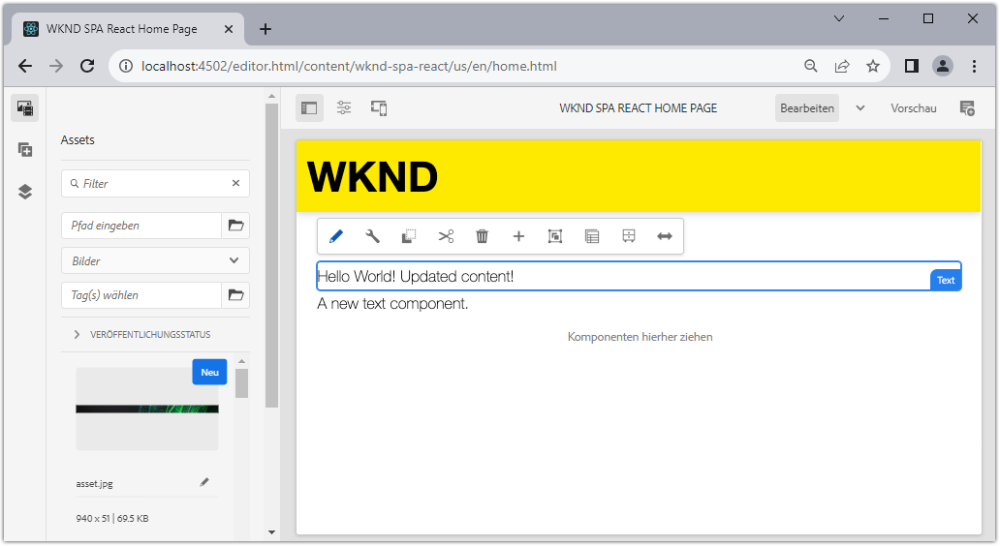
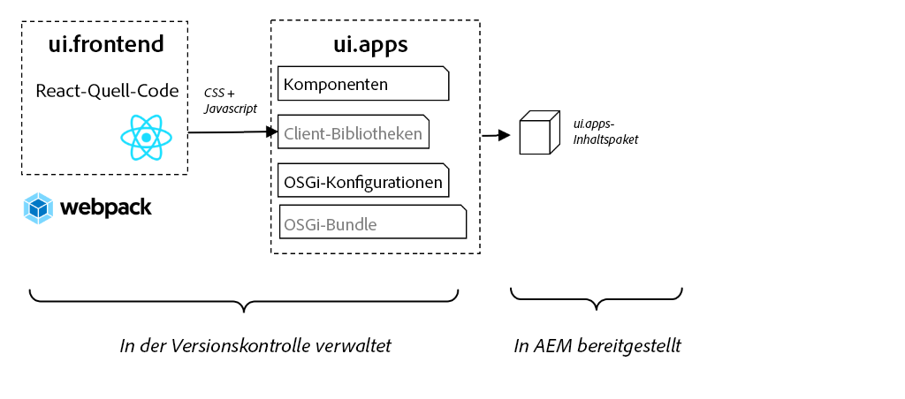
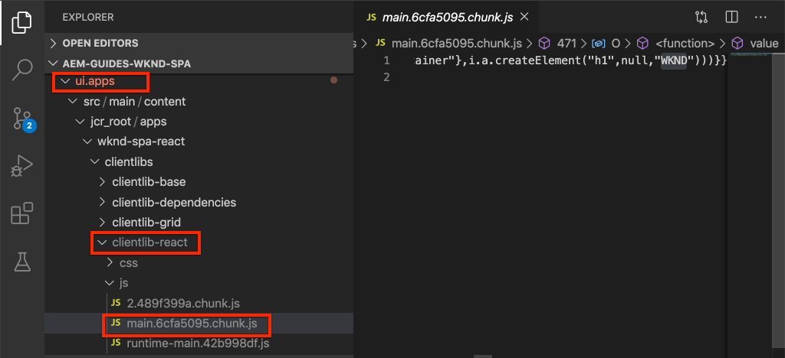
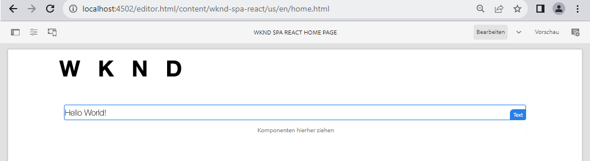

# Integrieren der SPA {#developer-workflow}

Erfahren Sie, wie der Quellcode für eine Single Page Application (SPA), die in React geschrieben wurde, in ein Adobe Experience Manager (AEM)-Projekt integriert werden kann. Finden Sie heraus, wie Sie mit modernen Frontend-Tools wie einem webpack-Dev-Server die SPA schnell für die AEM-JSON-Modell-API entwickeln können.

## Ziel

1. Erfahren Sie, wie das SPA-Projekt mit Client-seitigen Bibliotheken in AEM integriert wird
2. Erfahren Sie, wie Sie einen Webpack Development Server für die dedizierte Frontend-Entwicklung verwenden.
3. Erkunden Sie die Verwendung eines **Proxys** und einer statischen **Pseudodatei** für die Entwicklung mit der AEM JSON-Modell-API.

## Was Sie erstellen werden

In diesem Kapitel nehmen Sie einige kleine Änderungen an der SPA vor, um zu verstehen, wie sie in AEM integriert wird.
In diesem Kapitel wird beschrieben, wie der SPA eine einfache `Header`-Komponente hinzugefügt wird. Im Zuge der Erstellung einer **statischen** `Header`-Komponente werden verschiedene Ansätze zur Entwicklung einer AEM SPA verwendet.



*Die SPA wird um eine statische `Header`-Komponente erweitert*

## Voraussetzungen

Vergegenwärtigen Sie sich die erforderlichen Tools und Anweisungen zum Einrichten einer [lokalen Entwicklungsumgebung](overview.md#local-dev-environment). Dieses Kapitel ist eine Fortsetzung des Kapitels [Erstellen eines Projekts](create-project.md). Um diesem Kapitel zu folgen, benötigen Sie lediglich ein funktionierendes SPA-aktiviertes AEM-Projekt.

## Integrationsansatz {#integration-approach}

Im Rahmen des AEM-Projekts wurden zwei Module erstellt: `ui.apps` und `ui.frontend`.

Das `ui.frontend`-Modul ist ein [Webpack](https://webpack.js.org/)-Projekt, das den gesamten Quellcode der SPA enthält. Ein Großteil der SPA-Entwicklung und -Tests erfolgt im webpack-Projekt. Wenn ein Produktions-Build ausgelöst wird, wird die SPA mithilfe von webpack erstellt und kompiliert. Die kompilierten Artefakte (CSS und JavaScript) werden in das Modul `ui.apps` kopiert, das dann in der AEM-Laufzeitumgebung bereitgestellt wird.



*Eine Darstellung der SPA-Integration auf hoher Ebene.*

Weitere Informationen zum Aufbauen des Frontends finden Sie [hier](https://experienceleague.adobe.com/docs/experience-manager-core-components/using/developing/archetype/uifrontend-react.html?lang=de).

## Überprüfen der SPA-Integration {#inspect-spa-integration}

Überprüfen Sie anschließend das `ui.frontend`-Modul, um die SPA zu verstehen, die automatisch vom [AEM-Projektarchetyp](https://experienceleague.adobe.com/docs/experience-manager-core-components/using/developing/archetype/uifrontend-react.html?lang=de) generiert wurde.

1. Öffnen Sie Ihr AEM-Projekt in der IDE Ihrer Wahl. In diesem Tutorial wird die [Visual Studio Code-IDE](https://experienceleague.adobe.com/docs/experience-manager-learn/cloud-service/local-development-environment-set-up/development-tools.html?lang=de#microsoft-visual-studio-code) verwendet.

   

1. Erweitern und überprüfen Sie den Ordner `ui.frontend`. Öffnen Sie die Datei `ui.frontend/package.json`

1. Unter `dependencies` sollten Sie mehrere mit `react` zusammenhängende Angaben finden, darunter `react-scripts`

   `ui.frontend` ist eine React-App, die auf der [Create React App](https://create-react-app.dev/) oder kurz CRA basiert. Die `react-scripts`-Version gibt an, welche Version von CRA verwendet wird.

1. Es gibt auch mehrere Abhängigkeiten mit dem Präfix `@adobe`:

   ```json
   "@adobe/aem-react-editable-components": "~1.1.2",
   "@adobe/aem-spa-component-mapping": "~1.1.0",
   "@adobe/aem-spa-page-model-manager": "~1.3.3",
   "@adobe/aem-core-components-react-base": "1.1.8",
   "@adobe/aem-core-components-react-spa": "1.1.7",
   ```

   Die oben genannten Module bilden das [AEM SPA Editor JS SDK](https://experienceleague.adobe.com/docs/experience-manager-65/developing/headless/spas/spa-blueprint.html?lang=de) und stellen die Funktionalität bereit, mit der es möglich ist, SPA-Komponenten AEM-Komponenten zuzuordnen.

   Ebenfalls enthalten sind [AEM WCM-Komponenten – React-Core-Implementierung](https://github.com/adobe/aem-react-core-wcm-components-base) und [AEM WCM-Komponenten – SPA-Editor – React-Core-Implementierung](https://github.com/adobe/aem-react-core-wcm-components-spa). Hierbei handelt es sich um einen Satz wiederverwendbarer Komponenten der Benutzeroberfläche, die vordefinierten AEM-Komponenten zugeordnet sind. Sie können sie so verwenden, wie sie sind, und sie an die Anforderungen Ihres Projekts anpassen.

1. In der Datei `package.json` sind mehrere `scripts` definiert:

   ```json
   "scripts": {
       "start": "react-scripts start",
       "build": "react-scripts build && clientlib",
       "test": "react-scripts test",
       "eject": "react-scripts eject",
   }
   ```

   Dies sind Standard-Build-Skripte, die durch die Create React App [verfügbar](https://create-react-app.dev/docs/available-scripts) gemacht werden.

   Der einzige Unterschied ist die Hinzufügung von `&& clientlib` zum `build`-Skript. Diese zusätzliche Anweisung ist für das Kopieren der kompilierten SPA in das `ui.apps`-Modul als Client-seitige Bibliothek während eines Builds verantwortlich.

   Das npm-Modul [aem-clientlib-generator](https://github.com/wcm-io-frontend/aem-clientlib-generator) wird verwendet, um dies zu erleichtern.

1. Überprüfen Sie die Datei `ui.frontend/clientlib.config.js`. Diese Konfigurationsdatei wird von [aem-clientlib-generator](https://github.com/wcm-io-frontend/aem-clientlib-generator#clientlibconfigjs) verwendet, um zu bestimmen, wie die Client-Bibliothek generiert wird.

1. Überprüfen Sie die Datei `ui.frontend/pom.xml`. Diese Datei transformiert den Ordner `ui.frontend` in ein [Maven-Modul](https://maven.apache.org/guides/mini/guide-multiple-modules.html). Die Datei `pom.xml` wurde aktualisiert, um das [frontend-maven-plugin](https://github.com/eirslett/frontend-maven-plugin) dazu zu verwenden, die SPA zu **testen** und während eines Maven-Builds zu **erstellen**.

1. Überprüfen Sie die Datei `index.js` unter `ui.frontend/src/index.js`:

   ```js
   //ui.frontend/src/index.js
   ...
   document.addEventListener('DOMContentLoaded', () => {
       ModelManager.initialize().then(pageModel => {
           const history = createBrowserHistory();
           render(
           <Router history={history}>
               <App
               history={history}
               cqChildren={pageModel[Constants.CHILDREN_PROP]}
               cqItems={pageModel[Constants.ITEMS_PROP]}
               cqItemsOrder={pageModel[Constants.ITEMS_ORDER_PROP]}
               cqPath={pageModel[Constants.PATH_PROP]}
               locationPathname={window.location.pathname}
               />
           </Router>,
           document.getElementById('spa-root')
           );
       });
   });
   ```

   `index.js` ist der Einstiegspunkt der SPA. `ModelManager` wird vom AEM SPA Editor JS SDK bereitgestellt. Es ist für das Aufrufen und Einfügen von `pageModel` (der JSON-Inhalt) in die Anwendung verantwortlich.

1. Überprüfen Sie die Datei `import-components.js` unter `ui.frontend/src/components/import-components.js`. Diese Datei importiert die vorkonfigurierten **React-Kernkomponenten** und stellt sie für das Projekt zur Verfügung. Wir werden die Zuordnung von AEM-Inhalten zu SPA-Komponenten im nächsten Kapitel untersuchen.

## Hinzufügen einer statischen SPA-Komponente {#static-spa-component}

Fügen Sie anschließend eine neue Komponente zum SPA hinzu und stellen Sie die Änderungen auf einer lokalen AEM-Instanz bereit. Dies ist eine einfache Änderung, nur um zu veranschaulichen, wie das SPA aktualisiert wird.

1. Erstellen Sie im `ui.frontend`-Modul unterhalb von `ui.frontend/src/components` einen neuen Ordner namens `Header`.
1. Erstellen Sie eine Datei namens `Header.js` unterhalb des Ordners `Header`.

   

1. Füllen Sie `Header.js` wie folgt:

   ```js
   //Header.js
   import React, {Component} from 'react';
   
   export default class Header extends Component {
   
       render() {
           return (
                   <header className="Header">
                       <div className="Header-container">
                           <h1>WKND</h1>
                       </div>
                   </header>
           );
       }
   }
   ```

   Oben ist eine standardmäßige React-Komponente, die eine statische Textzeichenfolge ausgibt.

1. Öffnen Sie die Datei `ui.frontend/src/App.js`. Dies ist der Einstiegspunkt der Anwendung.
1. Nehmen Sie die folgenden Aktualisierungen an `App.js` vor, um den statischen `Header` einzubeziehen:

   ```diff
     import { Page, withModel } from '@adobe/aem-react-editable-components';
     import React from 'react';
   + import Header from './components/Header/Header';
   
     // This component is the application entry point
     class App extends Page {
     render() {
         return (
         <div>
   +       <Header />
            {this.childComponents}
            {this.childPages}
        </div>
   ```

1. Öffnen Sie ein neues Terminal, navigieren Sie in den Ordner `ui.frontend` und führen Sie den Befehl `npm run build` aus:

   ```shell
   $ cd aem-guides-wknd-spa
   $ cd ui.frontend
   $ npm run build
   ...
   Compiled successfully.
   
   File sizes after gzip:
   
   118.95 KB (-33 B)  build/static/js/2.489f399a.chunk.js
   1.11 KB (+48 B)    build/static/js/main.6cfa5095.chunk.js
   806 B              build/static/js/runtime-main.42b998df.js
   451 B              build/static/css/main.e57bbe8a.chunk.css
   ```

1. Navigieren Sie zum Ordner `ui.apps`. Unter `ui.apps/src/main/content/jcr_root/apps/wknd-spa-react/clientlibs/clientlib-react` sollten Sie sehen, dass die kompilierten SPA-Dateien aus dem Ordner `ui.frontend/build` kopiert worden sind.

   

1. Kehren Sie zum Terminal zurück und navigieren Sie in den Ordner `ui.apps`. Führen Sie den folgenden Maven-Befehl aus:

   ```shell
   $ cd ../ui.apps
   $ mvn clean install -PautoInstallPackage
   ...
   [INFO] ------------------------------------------------------------------------
   [INFO] BUILD SUCCESS
   [INFO] ------------------------------------------------------------------------
   [INFO] Total time:  9.629 s
   [INFO] Finished at: 2020-05-04T17:48:07-07:00
   [INFO] ------------------------------------------------------------------------
   ```

   Dadurch wird das Paket `ui.apps` in einer lokal ausgeführten Instanz von AEM bereitgestellt.

1. Öffnen Sie eine Browser-Registerkarte und navigieren Sie zu [http://localhost:4502/editor.html/content/wknd-spa-react/us/en/home.html](http://localhost:4502/editor.html/content/wknd-spa-react/us/en/home.html). Sie sollten nun den Inhalt der `Header`-Komponente in der SPA angezeigt bekommen.

   

   Die oben genannten Schritte werden automatisch ausgeführt, wenn ein Maven-Build aus dem Stammverzeichnis des Projekts (d. h. `mvn clean install -PautoInstallSinglePackage`) ausgelöst wird. Sie sollten jetzt die Grundlagen der Integration zwischen der SPA und Client-seitigen AEM-Bibliotheken verstehen. Beachten Sie, dass Sie in AEM weiterhin `Text`-Komponenten unterhalb der statischen `Header`-Komponente bearbeiten und hinzufügen können.

## webpack-Dev-Server – Proxy für JSON-API {#proxy-json}

Wie in den vorherigen Übungen gezeigt, dauert es einige Minuten, einen Build durchzuführen und die Client-Bibliothek mit einer lokalen Instanz von AEM zu synchronisieren. Dies ist für Endtests akzeptabel, aber nicht ideal für den Großteil der SPA-Entwicklung.

Ein [webpack-dev-server](https://webpack.js.org/configuration/dev-server/) kann zur schnellen Entwicklung der SPA verwendet werden. Der SPA liegt ein von AEM erstelltes JSON-Modell zugrunde. In dieser Übung wird der JSON-Inhalt einer laufenden Instanz von AEM **über einen Proxy** auf den Entwicklungs-Server übertragen.

1. Kehren Sie zur IDE zurück und öffnen Sie die Datei `ui.frontend/package.json`.

   Suchen Sie nach einer Zeile ähnlich der folgenden:

   ```json
   "proxy": "http://localhost:4502",
   ```

   Die [Create React App](https://create-react-app.dev/docs/proxying-api-requests-in-development) bietet einen einfachen Mechanismus, um API-Anfragen zu proxieren. Alle unbekannten Anfragen werden über `localhost:4502`, den lokalen AEM-Schnellstart, weitergeleitet.

1. Öffnen Sie ein Terminalfenster und navigieren Sie zum Ordner `ui.frontend`. Führen Sie den Befehl `npm start` aus:

   ```shell
   $ cd ui.frontend
   $ npm start
   ...
   Compiled successfully!
   
   You can now view wknd-spa-react in the browser.
   
   Local:            http://localhost:3000
   On Your Network:  http://192.168.86.136:3000
   
   Note that the development build is not optimized.
   To create a production build, use npm run build.
   ```

1. Öffnen Sie eine neue Browser-Registerkarte (falls noch nicht geöffnet) und navigieren Sie zu [http://localhost:3000/content/wknd-spa-react/us/en/home.html](http://localhost:3000/content/wknd-spa-react/us/en/home.html).

   

   Sie sollten denselben Inhalt wie in AEM sehen, jedoch ohne dass eine der Authoring-Funktionen aktiviert ist.

   >[!NOTE]
   >
   > Aufgrund der Sicherheitsanforderungen von AEM müssen Sie in der lokalen AEM-Instanz (http://localhost:4502) im selben Browser, aber in einer anderen Registerkarte angemeldet sein.

1. Kehren Sie zur IDE zurück und erstellen Sie eine Datei mit dem Namen `Header.css` im Ordner `src/components/Header`.
1. Befüllen Sie `Header.css` mit dem Folgenden:

   ```css
   .Header {
       background-color: #FFEA00;
       width: 100%;
       position: fixed;
       top: 0;
       left: 0;
       z-index: 99;
       box-shadow: 0px 0px 10px 0px rgba(0, 0, 0, 0.24);
   }
   
   .Header-container {
       display: flex;
       max-width: 1024px;
       margin: 0 auto;
       padding: 12px;
   }
   
   .Header-container h1 {
       letter-spacing: 0;
       font-size: 48px;
   }
   ```

   

1. Öffnen Sie `Header.js` erneut und fügen Sie die folgende Zeile als Referenz ein `Header.css`:

   ```diff
     //Header.js
     import React, {Component} from 'react';
   + require('./Header.css');
   ```

   Speichern Sie die Änderungen.

1. Navigieren Sie zu [http://localhost:3000/content/wknd-spa-react/us/en/home.html](http://localhost:3000/content/wknd-spa-react/us/en/home.html), um zu sehen, dass die Stiländerungen automatisch widergespiegelt werden.

1. Öffnen Sie die Datei `Page.css` unter `ui.frontend/src/components/Page`. Nehmen Sie die folgenden Änderungen am Skript vor, um das Padding zu richten:

   ```css
   .page {
     max-width: 1024px;
     margin: 0 auto;
     padding: 12px;
     padding-top: 50px;
   }
   ```

1. Kehren Sie zurück zum Browser unter [http://localhost:3000/content/wknd-spa-react/us/en/home.html](http://localhost:3000/content/wknd-spa-react/us/en/home.html). Sie sollten die Änderungen an der App sofort sehen.

   

   Sie können weiterhin Inhaltsaktualisierungen in AEM vornehmen und sehen, dass diese in **webpack-dev-server** reflektiert werden, da wir für den Inhalt einen Proxy verwenden.

1. Beenden Sie den Webpack Development Server mit `ctrl+c` im Terminal.

## Bereitstellen von SPA-Updates für AEM

Die Änderungen am `Header` sind derzeit nur über den **webpack-dev-server** sichtbar. Stellen Sie die aktualisierte SPA für AEM bereit, um die Änderungen anzuzeigen.

1. Navigieren Sie zum Stammverzeichnis des Projekts (`aem-guides-wknd-spa`) und stellen Sie das Projekt mithilfe von Maven für AEM bereit:

   ```shell
   $ cd ..
   $ mvn clean install -PautoInstallSinglePackage
   ```

2. Navigieren Sie zu [http://localhost:4502/editor.html/content/wknd-spa-react/us/en/home.html](http://localhost:4502/editor.html/content/wknd-spa-react/us/en/home.html). Sie sollten den aktualisierten `Header` und die angewandten Stile sehen.

   

   Nachdem sich jetzt die aktualisierte SPA in AEM befindet, kann die Bearbeitung fortgesetzt werden.

## Herzlichen Glückwunsch! {#congratulations}

Herzlichen Glückwunsch, Sie haben die SPA aktualisiert und die Integration mit AEM untersucht! Sie wissen jetzt, wie Sie die SPA mit der JSON-Modell-API von AEM unter Verwendung eines **webpack-dev-server** entwickeln können.

### Nächste Schritte {#next-steps}

[Zuordnen von SPA-Komponenten zu AEM-Komponenten](map-components.md): Erfahren Sie, wie Sie React-Komponenten mit dem AEM SPA Editor JS SDK auf Adobe Experience Manager (AEM)-Komponenten abbilden können. Die Komponentenzuordnung ermöglicht es Benutzenden, im AEM-SPA-Editor dynamische Aktualisierungen an SPA-Komponenten vorzunehmen, ähnlich wie beim herkömmlichen AEM-Authoring.

## (Bonus) Webpack Dev Server – Pseudo-JSON-API {#mock-json}

Eine weitere Möglichkeit, die Entwicklung zu beschleunigen, besteht darin, eine statische JSON-Datei als JSON-Modell zu verwenden. Durch JSON-„Mocking“ entfernen wir die Abhängigkeit von einer lokalen AEM-Instanz. Außerdem können dadurch Frontend-Entwicklerinnen und -Entwickler das JSON-Modell aktualisieren, um die Funktionalität zu testen und Änderungen an der JSON-API vorzunehmen, die später von Backend-Entwicklerinnen und -Entwicklern implementiert werden.

Die Ersteinrichtung des JSON-Pseudomodells **erfordert eine lokale AEM-Instanz**.

1. Kehren Sie zur IDE zurück, navigieren Sie zu `ui.frontend/public` und fügen Sie einen neuen Ordner mit dem Namen `mock-content` hinzu.
1. Erstellen Sie eine neue Datei mit dem Namen `mock.model.json` unter `ui.frontend/public/mock-content`.
1. Navigieren Sie im Browser zu [http://localhost:4502/content/wknd-spa-react/us/en.model.json](http://localhost:4502/content/wknd-spa-react/us/en.model.json).

   Hierbei handelt es sich um den von AEM exportierten JSON-Inhalt, von dem die Anwendung gesteuert wird. Kopieren Sie die JSON-Ausgabe.

1. Fügen Sie die JSON-Ausgabe aus dem vorherigen Schritt in die Datei `mock.model.json` ein.

   

1. Öffnen Sie die Datei `index.html` unter `ui.frontend/public/index.html`. Aktualisieren Sie die Metadateneigenschaft für das AEM Seitenmodell so, dass sie auf eine Variable `%REACT_APP_PAGE_MODEL_PATH%` verweist:

   ```html
       <!-- AEM page model -->
       <meta
          property="cq:pagemodel_root_url"
          content="%REACT_APP_PAGE_MODEL_PATH%"
       />
   ```

   Die Verwendung einer Variablen für den Wert von `cq:pagemodel_root_url` erleichtert das Umschalten zwischen dem Proxy- und dem Pseudo-JSON-Modell.

1. Öffnen Sie die Datei `ui.frontend/.env.development` und nehmen Sie die folgenden Aktualisierungen vor, um den vorherigen Wert für `REACT_APP_PAGE_MODEL_PATH` und `REACT_APP_API_HOST` auszukommentieren:

   ```diff
   + PUBLIC_URL=/
   - PUBLIC_URL=/etc.clientlibs/wknd-spa-react/clientlibs/clientlib-react/resources
   
   - REACT_APP_PAGE_MODEL_PATH=/content/wknd-spa-react/us/en.model.json
   + REACT_APP_PAGE_MODEL_PATH=/mock-content/mock.model.json
   
   - REACT_APP_API_HOST=http://localhost:4502
   + #REACT_APP_API_HOST=http://localhost:4502
   
   REACT_APP_ROOT=/content/wknd-spa-react/us/en/home.html
   ```

1. Halten Sie den **webpack-Dev-Server** an, falls er aktuell ausgeführt wird. Starten Sie den **webpack-dev-server** vom Terminal aus:

   ```shell
   $ cd ui.frontend
   $ npm start
   ```

   Navigieren Sie zu [http://localhost:3000/content/wknd-spa-react/us/en/home.html](http://localhost:3000/content/wknd-spa-react/us/en/home.html). Sie sollten jetzt die SPA mit dem gleichen Inhalt sehen, der in der **Proxy**-JSON verwendet wird.

1. Nehmen Sie eine kleine Änderung an der zuvor erstellten Datei `mock.model.json` vor. Sie sollten den aktualisierten Inhalt sofort im **webpack-dev-server** sehen.

   

Die Fähigkeit, das JSON-Modell zu bearbeiten und die Auswirkungen auf eine Live-SPA zu sehen, kann Entwicklerinnen und Entwicklern dabei helfen, die JSON-Modell-API zu verstehen. Außerdem können Frontend- und Backend-Entwicklung parallel erfolgen.

Sie können jetzt umschalten, wo der JSON-Inhalt verwendet werden soll, indem Sie die Einträge in der Datei `env.development` umschalten:

```plain
# JSON API via proxy to AEM
#REACT_APP_PAGE_MODEL_PATH=/content/wknd-spa-react/us/en.model.json
#REACT_APP_API_HOST=http://localhost:4502

# JSON API via static mock file
REACT_APP_PAGE_MODEL_PATH=/mock-content/mock.model.json
```
