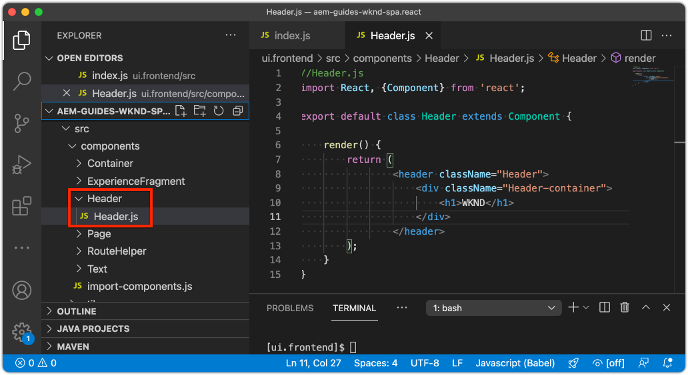

# SPA integrieren {#developer-workflow}

Erfahren Sie, wie der Quellcode für eine Einzelseiten-App (SPA), die in React geschrieben wurde, in ein Adobe Experience Manager (AEM)-Projekt integriert werden kann. Erfahren Sie, wie Sie mit modernen Frontend-Tools wie einem Webpack Development Server die SPA schnell mit der AEM JSON-Modell-API entwickeln können.

## Ziel

1. Erfahren Sie, wie das SPA-Projekt in AEM mit Client-seitigen Bibliotheken integriert ist.
2. Erfahren Sie, wie Sie einen Webpack Development Server für die dedizierte Front-End-Entwicklung verwenden.
3. Nutzung einer **Proxy** und statisch **mock** für die Entwicklung mit der AEM JSON-Modell-API.

## Was Sie erstellen werden

In diesem Kapitel nehmen Sie einige kleine Änderungen an der SPA vor, um zu verstehen, wie sie in AEM integriert ist.
Dieses Kapitel fügt ein einfaches `Header` -Komponente in die SPA. Im Zuge der Erstellung **statisch** `Header` -Komponente werden verschiedene Ansätze zur AEM SPA-Entwicklung verwendet.


*Der SPA wird erweitert, um einen statischen `Header` component*

## Voraussetzungen

Überprüfen Sie die erforderlichen Tools und Anweisungen zum Einrichten eines [lokale Entwicklungsumgebung](overview.md#local-dev-environment). Dieses Kapitel ist eine Fortsetzung der [Projekt erstellen](create-project.md) -Kapitel zu folgen, ist jedoch ein funktionierendes SPA-aktiviertes AEM.

## Integrationsansatz {#integration-approach}

Im Rahmen des AEM wurden zwei Module erstellt: `ui.apps` und `ui.frontend`.

Die `ui.frontend` -Modul [Webpack](https://webpack.js.org/) -Projekt, das den gesamten SPA Quellcode enthält. Ein Großteil der SPA Entwicklung und Tests wird im webpack-Projekt durchgeführt. Wenn ein Produktions-Build ausgelöst wird, wird der SPA mithilfe des Webpack erstellt und kompiliert. Die kompilierten Artefakte (CSS und JavaScript) werden in die `ui.apps` -Modul, das dann zur AEM Laufzeit bereitgestellt wird.


*Eine allgemeine Darstellung der SPA Integration.*

Weitere Informationen zum Front-End-Build finden Sie unter [hier finden](https://experienceleague.adobe.com/docs/experience-manager-core-components/using/developing/archetype/uifrontend-react.html).

## Inspect - SPA {#inspect-spa-integration}

Überprüfen Sie anschließend die `ui.frontend` -Modul, um die SPA zu verstehen, die automatisch von der [AEM Projektarchetyp](https://experienceleague.adobe.com/docs/experience-manager-core-components/using/developing/archetype/uifrontend-react.html).

1. Öffnen Sie in der IDE Ihrer Wahl Ihr AEM Projekt. In diesem Tutorial wird die [Visual Studio Code-IDE](https://experienceleague.adobe.com/docs/experience-manager-learn/cloud-service/local-development-environment-set-up/development-tools.html?lang=de#microsoft-visual-studio-code).

   

1. Erweitern und überprüfen Sie die `ui.frontend` Ordner. Öffnen Sie die Datei `ui.frontend/package.json`

1. Unter dem `dependencies` sollten mehrere `react` einschließlich `react-scripts`

   Die `ui.frontend` ist eine React-Anwendung, die auf der [React-App erstellen](https://create-react-app.dev/) oder kurz CRA. Die `react-scripts` -Version gibt an, welche Version von CRA verwendet wird.

1. Es gibt auch mehrere Abhängigkeiten mit dem Präfix `@adobe`:

   ```json
   "@adobe/aem-react-editable-components": "~1.1.2",
   "@adobe/aem-spa-component-mapping": "~1.1.0",
   "@adobe/aem-spa-page-model-manager": "~1.3.3",
   "@adobe/aem-core-components-react-base": "1.1.8",
   "@adobe/aem-core-components-react-spa": "1.1.7",
   ```

   Die oben genannten Module bilden die [AEM SPA Editor JS SDK](https://experienceleague.adobe.com/docs/experience-manager-65/developing/headless/spas/spa-blueprint.html) und stellen die Funktionalität bereit, mit der es möglich ist, SPA Komponenten AEM Komponenten zuzuordnen.

   Auch enthalten sind [AEM WCM-Komponenten - React-Core-Implementierung](https://github.com/adobe/aem-react-core-wcm-components-base) und [AEM WCM-Komponenten - SPA-Editor - React-Core-Implementierung](https://github.com/adobe/aem-react-core-wcm-components-spa). Hierbei handelt es sich um einen Satz wiederverwendbarer Komponenten der Benutzeroberfläche, die vordefinierten AEM Komponenten zugeordnet sind. Diese sind so konzipiert, dass sie wie besehen und entsprechend den Anforderungen Ihres Projekts gestaltet werden.

1. Im `package.json` Datei gibt es mehrere `scripts` definiert:

   ```json
   "scripts": {
       "start": "react-scripts start",
       "build": "react-scripts build && clientlib",
       "test": "react-scripts test",
       "eject": "react-scripts eject",
   }
   ```

   Dies sind standardmäßige Build-Skripte, die erstellt werden [available](https://create-react-app.dev/docs/available-scripts) durch die React-App erstellen.

   Der einzige Unterschied besteht darin, dass `&& clientlib` der `build` Skript. Diese zusätzliche Anleitung ist für das Kopieren der kompilierten SPA in die `ui.apps` -Modul als clientseitige Bibliothek während eines Builds.

   Das npm-Modul [aem-clientlib-generator](https://github.com/wcm-io-frontend/aem-clientlib-generator) wird verwendet, um dies zu erleichtern.

1. Prüfen Sie die Datei `ui.frontend/clientlib.config.js`. Diese Konfigurationsdatei wird von [aem-clientlib-generator](https://github.com/wcm-io-frontend/aem-clientlib-generator#clientlibconfigjs) , um zu bestimmen, wie die Client-Bibliothek generiert wird.

1. Prüfen Sie die Datei `ui.frontend/pom.xml`. Diese Datei transformiert die `ui.frontend` Ordner in ein [Maven-Modul](https://maven.apache.org/guides/mini/guide-multiple-modules.html). Die `pom.xml` wurde aktualisiert, um die [frontend-maven-plugin](https://github.com/eirslett/frontend-maven-plugin) nach **test** und **build** die SPA während eines Maven-Builds.

1. Inspect der Datei `index.js` at `ui.frontend/src/index.js`:

   ```js
   //ui.frontend/src/index.js
   ...
   document.addEventListener('DOMContentLoaded', () => {
       ModelManager.initialize().then(pageModel => {
           const history = createBrowserHistory();
           render(
           <Router history={history}>
               <App
               history={history}
               cqChildren={pageModel[Constants.CHILDREN_PROP]}
               cqItems={pageModel[Constants.ITEMS_PROP]}
               cqItemsOrder={pageModel[Constants.ITEMS_ORDER_PROP]}
               cqPath={pageModel[Constants.PATH_PROP]}
               locationPathname={window.location.pathname}
               />
           </Router>,
           document.getElementById('spa-root')
           );
       });
   });
   ```

   `index.js` ist der Einstiegspunkt des SPA. `ModelManager` wird vom AEM SPA Editor JS SDK bereitgestellt. Es ist für das Aufrufen und Einfügen der `pageModel` (der JSON-Inhalt) in die Anwendung.

1. Inspect der Datei `import-components.js` at `ui.frontend/src/components/import-components.js`. Diese Datei importiert die vorkonfigurierte **React-Kernkomponenten** und stellt sie für das Projekt zur Verfügung. Im nächsten Kapitel werden wir die Zuordnung AEM Inhalts zu SPA Komponenten untersuchen.

## Hinzufügen einer statischen SPA-Komponente {#static-spa-component}

Fügen Sie anschließend eine neue Komponente zum SPA hinzu und stellen Sie die Änderungen auf einer lokalen AEM-Instanz bereit. Dies wird eine einfache Änderung sein, um nur zu veranschaulichen, wie die SPA aktualisiert wird.

1. Im `ui.frontend` -Modul, darunter `ui.frontend/src/components` Erstellen Sie einen neuen Ordner mit dem Namen `Header`.
1. Erstellen Sie eine Datei mit dem Namen `Header.js` unterhalb der `Header` Ordner.

   

1. Füllen Sie `Header.js` wie folgt:

   ```js
   //Header.js
   import React, {Component} from 'react';
   
   export default class Header extends Component {
   
       render() {
           return (
                   <header className="Header">
                       <div className="Header-container">
                           <h1>WKND</h1>
                       </div>
                   </header>
           );
       }
   }
   ```

   Oben ist eine standardmäßige React-Komponente, die eine statische Textzeichenfolge ausgibt.

1. Öffnen Sie die Datei `ui.frontend/src/App.js`. Dies ist der Einstiegspunkt der Anwendung.
1. Nehmen Sie die folgenden Aktualisierungen vor, um `App.js` , um das Statische einzuschließen `Header`:

   ```diff
     import { Page, withModel } from '@adobe/aem-react-editable-components';
     import React from 'react';
   + import Header from './components/Header/Header';
   
     // This component is the application entry point
     class App extends Page {
     render() {
         return (
         <div>
   +       <Header />
            {this.childComponents}
            {this.childPages}
        </div>
   ```

1. Öffnen Sie ein neues Terminal und navigieren Sie zum `ui.frontend` und führen Sie die `npm run build` command:

   ```shell
   $ cd aem-guides-wknd-spa
   $ cd ui.frontend
   $ npm run build
   ...
   Compiled successfully.
   
   File sizes after gzip:
   
   118.95 KB (-33 B)  build/static/js/2.489f399a.chunk.js
   1.11 KB (+48 B)    build/static/js/main.6cfa5095.chunk.js
   806 B              build/static/js/runtime-main.42b998df.js
   451 B              build/static/css/main.e57bbe8a.chunk.css
   ```

1. Navigieren Sie zum Ordner `ui.apps`. darunter `ui.apps/src/main/content/jcr_root/apps/wknd-spa-react/clientlibs/clientlib-react` Sie sollten sehen, dass die kompilierten SPA aus dem`ui.frontend/build` Ordner.

   

1. Kehren Sie zum Terminal zurück und navigieren Sie zum `ui.apps` Ordner. Führen Sie den folgenden Maven-Befehl aus:

   ```shell
   $ cd ../ui.apps
   $ mvn clean install -PautoInstallPackage
   ...
   [INFO] ------------------------------------------------------------------------
   [INFO] BUILD SUCCESS
   [INFO] ------------------------------------------------------------------------
   [INFO] Total time:  9.629 s
   [INFO] Finished at: 2020-05-04T17:48:07-07:00
   [INFO] ------------------------------------------------------------------------
   ```

   Dadurch wird die `ui.apps` auf eine lokale, laufende Instanz von AEM.

1. Öffnen Sie eine Browser-Registerkarte und navigieren Sie zu [http://localhost:4502/editor.html/content/wknd-spa-react/us/en/home.html](http://localhost:4502/editor.html/content/wknd-spa-react/us/en/home.html). Sie sollten nun den Inhalt der `Header` -Komponente in der SPA angezeigt.

   

   Die oben genannten Schritte werden automatisch ausgeführt, wenn ein Maven-Build aus dem Stammverzeichnis des Projekts ausgelöst wird (d. h. `mvn clean install -PautoInstallSinglePackage`). Sie sollten jetzt die Grundlagen der Integration zwischen den SPA- und AEM Client-seitigen Bibliotheken verstehen. Beachten Sie, dass Sie weiterhin bearbeiten und hinzufügen können. `Text` Komponenten in AEM unter dem statischen `Header` -Komponente.

## Webpack Dev Server - Proxy der JSON-API {#proxy-json}

Wie in den vorherigen Übungen gezeigt, dauert es einige Minuten, einen Build durchzuführen und die Client-Bibliothek mit einer lokalen Instanz von AEM zu synchronisieren. Dies ist für Endtests akzeptabel, aber nicht ideal für den Großteil der SPA.

A [webpack-dev-server](https://webpack.js.org/configuration/dev-server/) kann zur schnellen Entwicklung des SPA verwendet werden. Die SPA wird von einem JSON-Modell gesteuert, das von AEM generiert wurde. In dieser Übung wird der JSON-Inhalt aus einer laufenden Instanz von AEM **proxid** in den Entwicklungsserver.

1. Kehren Sie zur IDE zurück und öffnen Sie die Datei . `ui.frontend/package.json`.

   Suchen Sie nach einer Zeile wie der folgenden:

   ```json
   "proxy": "http://localhost:4502",
   ```

   Die [React-App erstellen](https://create-react-app.dev/docs/proxying-api-requests-in-development) bietet einen einfachen Mechanismus zum Proxy von API-Anfragen. Alle unbekannten Anfragen werden durch Proxy weitergeleitet. `localhost:4502`, der lokale AEM Schnellstart.

1. Öffnen Sie ein Terminal-Fenster und navigieren Sie zum `ui.frontend` Ordner. Führen Sie den Befehl `npm start` aus:

   ```shell
   $ cd ui.frontend
   $ npm start
   ...
   Compiled successfully!
   
   You can now view wknd-spa-react in the browser.
   
   Local:            http://localhost:3000
   On Your Network:  http://192.168.86.136:3000
   
   Note that the development build is not optimized.
   To create a production build, use npm run build.
   ```

1. Öffnen Sie eine neue Browser-Registerkarte (falls noch nicht geöffnet) und navigieren Sie zu [http://localhost:3000/content/wknd-spa-react/us/en/home.html](http://localhost:3000/content/wknd-spa-react/us/en/home.html).

   

   Sie sollten denselben Inhalt wie in AEM sehen, jedoch ohne eine der Authoring-Funktionen aktiviert zu haben.

   >[!NOTE]
   >
   > Aufgrund der Sicherheitsanforderungen von AEM müssen Sie in der lokalen AEM-Instanz (http://localhost:4502) im selben Browser, aber in einer anderen Registerkarte angemeldet sein.

1. Kehren Sie zur IDE zurück und erstellen Sie eine Datei mit dem Namen `Header.css` im `src/components/Header` Ordner.
1. Füllen Sie die `Header.css` durch Folgendes ersetzen:

   ```css
   .Header {
       background-color: #FFEA00;
       width: 100%;
       position: fixed;
       top: 0;
       left: 0;
       z-index: 99;
       box-shadow: 0px 0px 10px 0px rgba(0, 0, 0, 0.24);
   }
   
   .Header-container {
       display: flex;
       max-width: 1024px;
       margin: 0 auto;
       padding: 12px;
   }
   
   .Header-container h1 {
       letter-spacing: 0;
       font-size: 48px;
   }
   ```

   

1. Erneutes Öffnen `Header.js` und fügen Sie die folgende Zeile als Referenz hinzu `Header.css`:

   ```diff
     //Header.js
     import React, {Component} from 'react';
   + require('./Header.css');
   ```

   Speichern Sie die Änderungen.

1. Navigieren Sie zu [http://localhost:3000/content/wknd-spa-react/us/en/home.html](http://localhost:3000/content/wknd-spa-react/us/en/home.html) um die Stiländerungen automatisch widerzuspiegeln.

1. Öffnen Sie die Datei `Page.css` unter `ui.frontend/src/components/Page`. Nehmen Sie die folgenden Änderungen vor, um den Abstand zu korrigieren:

   ```css
   .page {
     max-width: 1024px;
     margin: 0 auto;
     padding: 12px;
     padding-top: 50px;
   }
   ```

1. Kehren Sie zum Browser unter zurück [http://localhost:3000/content/wknd-spa-react/us/en/home.html](http://localhost:3000/content/wknd-spa-react/us/en/home.html). Sie sollten die Änderungen an der App sofort sehen.

   

   Sie können Inhaltsaktualisierungen weiterhin in AEM vornehmen und sie in **webpack-dev-server**, da wir den Inhalt proxieren.

1. Beenden Sie den Webpack Development Server mit `ctrl+c` im Terminal.

## Bereitstellen SPA Updates für AEM

Die Änderungen an den `Header` sind derzeit nur über die **webpack-dev-server**. Stellen Sie die aktualisierte SPA für AEM bereit, um die Änderungen anzuzeigen.

1. Navigieren Sie zum Stammverzeichnis des Projekts (`aem-guides-wknd-spa`) und stellen Sie das Projekt AEM mithilfe von Maven bereit:

   ```shell
   $ cd ..
   $ mvn clean install -PautoInstallSinglePackage
   ```

2. Navigieren Sie zu [http://localhost:4502/editor.html/content/wknd-spa-react/us/en/home.html](http://localhost:4502/editor.html/content/wknd-spa-react/us/en/home.html). Sie sollten die aktualisierte `Header` und angewendeten Stilen.

   

   Nachdem sich die aktualisierte SPA in AEM befindet, kann die Bearbeitung fortgesetzt werden.

## Herzlichen Glückwunsch! {#congratulations}

Herzlichen Glückwunsch, Sie haben die SPA aktualisiert und die Integration mit AEM untersucht! Sie wissen, wie Sie die SPA mit der AEM JSON-Modell-API mithilfe einer **webpack-dev-server**.

### Nächste Schritte {#next-steps}

[Zuordnen SPA Komponenten zu AEM Komponenten](map-components.md) - Erfahren Sie, wie Sie React-Komponenten Adobe Experience Manager-Komponenten (AEM) mit dem AEM SPA Editor JS SDK zuordnen. Die Komponentenzuordnung ermöglicht es Benutzern, im AEM SPA Editor dynamische Aktualisierungen an SPA -Komponenten vorzunehmen, ähnlich wie beim herkömmlichen AEM.

## (Bonus) Webpack Dev Server - JSON-API nachahmen {#mock-json}

Ein weiterer Ansatz für die schnelle Entwicklung besteht darin, eine statische JSON-Datei zu verwenden, um als JSON-Modell zu fungieren. Durch &quot;nachahmen&quot;der JSON entfernen wir die Abhängigkeit von einer lokalen AEM-Instanz. Darüber hinaus kann ein Frontend-Entwickler das JSON-Modell aktualisieren, um die Funktionalität zu testen und Änderungen an der JSON-API vorzunehmen, die später von einem Back-End-Entwickler implementiert würden.

Die anfängliche Einrichtung der JSON-nachgeahmten Datei **eine lokale AEM-Instanz benötigen**.

1. Kehren Sie zur IDE zurück und navigieren Sie zu `ui.frontend/public` und fügen Sie einen neuen Ordner mit dem Namen `mock-content`.
1. Erstellen Sie eine neue Datei mit dem Namen `mock.model.json` unter `ui.frontend/public/mock-content`.
1. Navigieren Sie im Browser zu [http://localhost:4502/content/wknd-spa-react/us/en.model.json](http://localhost:4502/content/wknd-spa-react/us/en.model.json).

   Dies ist die von AEM exportierte JSON, die die Anwendung steuert. Kopieren Sie die JSON-Ausgabe.

1. Fügen Sie die JSON-Ausgabe aus dem vorherigen Schritt in die Datei ein. `mock.model.json`.

   

1. Öffnen Sie die Datei `index.html` unter `ui.frontend/public/index.html`. Aktualisieren der Metadateneigenschaft für das AEM Seitenmodell, um auf eine Variable zu verweisen `%REACT_APP_PAGE_MODEL_PATH%`:

   ```html
       <!-- AEM page model -->
       <meta
          property="cq:pagemodel_root_url"
          content="%REACT_APP_PAGE_MODEL_PATH%"
       />
   ```

   Verwenden einer Variablen für den Wert der `cq:pagemodel_root_url` wird es einfacher, zwischen dem Proxy- und JSON-Modell zu wechseln.

1. Öffnen Sie die Datei `ui.frontend/.env.development` und nehmen Sie die folgenden Aktualisierungen vor, um den vorherigen Wert für `REACT_APP_PAGE_MODEL_PATH` und `REACT_APP_API_HOST`:

   ```diff
   + PUBLIC_URL=/
   - PUBLIC_URL=/etc.clientlibs/wknd-spa-react/clientlibs/clientlib-react/resources
   
   - REACT_APP_PAGE_MODEL_PATH=/content/wknd-spa-react/us/en.model.json
   + REACT_APP_PAGE_MODEL_PATH=/mock-content/mock.model.json
   
   - REACT_APP_API_HOST=http://localhost:4502
   + #REACT_APP_API_HOST=http://localhost:4502
   
   REACT_APP_ROOT=/content/wknd-spa-react/us/en/home.html
   ```

1. Wenn sie derzeit ausgeführt wird, beenden Sie die **webpack-dev-server**. Starten Sie die **webpack-dev-server** vom Terminal aus:

   ```shell
   $ cd ui.frontend
   $ npm start
   ```

   Navigieren Sie zu [http://localhost:3000/content/wknd-spa-react/us/en/home.html](http://localhost:3000/content/wknd-spa-react/us/en/home.html) und Sie sollten die SPA mit dem gleichen Inhalt sehen, der in der **Proxy** json.

1. Nehmen Sie eine kleine Änderung an der `mock.model.json` zuvor erstellte Datei. Sie sollten den aktualisierten Inhalt sofort im **webpack-dev-server**.

   

Die Fähigkeit, das JSON-Modell zu bearbeiten und die Auswirkungen auf eine Live-SPA zu sehen, kann Entwicklern dabei helfen, die JSON-Modell-API zu verstehen. Es ermöglicht auch die parallele Entwicklung von Frontend- und Backend-Anwendungen.

Sie können jetzt umschalten, wo der JSON-Inhalt verwendet werden soll, indem Sie die Einträge in der `env.development` Datei:

```plain
# JSON API via proxy to AEM
#REACT_APP_PAGE_MODEL_PATH=/content/wknd-spa-react/us/en.model.json
#REACT_APP_API_HOST=http://localhost:4502

# JSON API via static mock file
REACT_APP_PAGE_MODEL_PATH=/mock-content/mock.model.json
```
