# Zuordnen SPA Komponenten zu AEM Komponenten {#map-components}

Erfahren Sie, wie Sie React-Komponenten mit dem AEM SPA Editor JS SDK Adobe Experience Manager (AEM)-Komponenten zuordnen. Die Komponentenzuordnung ermöglicht es Benutzern, im AEM SPA Editor dynamische Aktualisierungen an SPA -Komponenten vorzunehmen, ähnlich wie beim herkömmlichen AEM.

In diesem Kapitel werden die AEM JSON-Modell-API und die Möglichkeiten erläutert, wie der von einer AEM-Komponente angezeigte JSON-Inhalt automatisch als Props in eine React-Komponente eingefügt werden kann.

## Ziel

1. Erfahren Sie, wie Sie AEM Komponenten SPA Komponenten zuordnen.
1. Inspect wie eine React-Komponente dynamische Eigenschaften verwendet, die von AEM übergeben werden.
1. Erfahren Sie, wie Sie vorkonfigurierte Funktionen nutzen können. [ReactAEMKernkomponenten](https://github.com/adobe/aem-react-core-wcm-components-examples).

## Was Sie erstellen werden

In diesem Kapitel wird untersucht, wie die `Text` SPA Komponente wird der AEM zugeordnet `Text`-Komponente. React-Kernkomponenten wie die `Image` SPA Komponente wird in der SPA verwendet und in AEM verfasst. Vorkonfigurierte Funktionen der **Layout-Container** und **Vorlagen-Editor** -Richtlinien werden auch verwendet, um eine Ansicht zu erstellen, die etwas abwechslungsreicher erscheint.

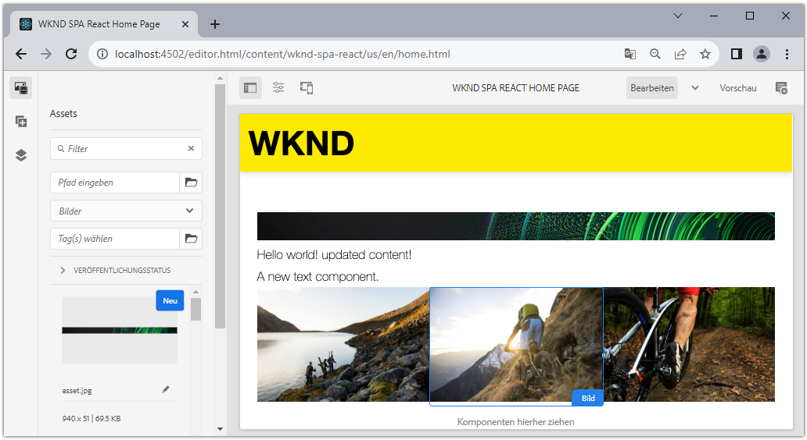

## Voraussetzungen

Überprüfen Sie die erforderlichen Tools und Anweisungen zum Einrichten eines [lokale Entwicklungsumgebung](overview.md#local-dev-environment). Dieses Kapitel ist eine Fortsetzung der [SPA integrieren](integrate-spa.md) -Kapitel zu folgen, ist jedoch ein SPA-aktiviertes AEM-Projekt.

## Mapping-Ansatz

Das grundlegende Konzept besteht darin, eine SPA Komponente einer AEM Komponente zuzuordnen. AEM Komponenten, Server-seitig ausführen, Inhalte als Teil der JSON-Modell-API exportieren. Der JSON-Inhalt wird vom SPA verwendet, der clientseitig im Browser ausgeführt wird. Es wird eine 1:1-Zuordnung zwischen SPA Komponenten und einer AEM Komponente erstellt.

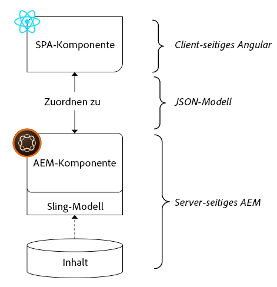

*Allgemeine Übersicht über die Zuordnung einer AEM Komponente zu einer React-Komponente*

## Inspect der Textkomponente

Die [AEM Projektarchetyp](https://github.com/adobe/aem-project-archetype) bietet eine `Text` Komponente, die dem AEM zugeordnet ist [Textkomponente](https://experienceleague.adobe.com/docs/experience-manager-core-components/using/components/text.html?lang=de). Dies ist ein Beispiel für eine **content** Komponente, da sie *content* von AEM.

Sehen wir uns an, wie die Komponente funktioniert.

### Inspect des JSON-Modells

1. Bevor Sie in den SPA-Code springen, müssen Sie das von AEM bereitgestellte JSON-Modell verstehen. Navigieren Sie zum [Kernkomponentenbibliothek](https://www.aemcomponents.dev/content/core-components-examples/library/core-content/text.html) und zeigen Sie die Seite für die Textkomponente an. Die Kernkomponentenbibliothek enthält Beispiele für alle AEM Kernkomponenten.
1. Wählen Sie die **JSON** für eines der folgenden Beispiele:

   

   Es sollten drei Eigenschaften angezeigt werden: `text`, `richText`und `:type`.

   `:type` ist eine reservierte Eigenschaft, die die `sling:resourceType` (oder Pfad) der AEM Komponente. Der Wert von `:type` wird verwendet, um die AEM Komponente der SPA zuzuordnen.

   `text` und `richText` sind zusätzliche Eigenschaften, die für die SPA-Komponente verfügbar gemacht werden.

1. Anzeigen der JSON-Ausgabe unter [http://localhost:4502/content/wknd-spa-react/us/en.model.json](http://localhost:4502/content/wknd-spa-react/us/en.model.json). Sie sollten einen Eintrag finden können, der in etwa wie folgt aussieht:

   ```json
   "text": {
       "id": "text-a647cec03a",
       "text": "<p>Hello World! Updated content!</p>\r\n",
       "richText": true,
       ":type": "wknd-spa-react/components/text",
       "dataLayer": {}
      }
   ```

### Inspect der SPA-Komponente

1. Öffnen Sie in der IDE Ihrer Wahl das AEM Projekt für die SPA. Erweitern Sie die `ui.frontend` -Modul und öffnen Sie die -Datei `Text.js` under `ui.frontend/src/components/Text/Text.js`.

1. Der erste Bereich, den wir untersuchen werden, ist der `class Text` bei ~line 40:

   ```js
   class Text extends Component {
   
       get richTextContent() {
           return (<div
                   id={extractModelId(this.props.cqPath)}
                   data-rte-editelement
                   dangerouslySetInnerHTML={{__html: DOMPurify.sanitize(this.props.text)}} />
                   );
       }
   
       get textContent() {
           return <div>{this.props.text}</div>;
       }
   
       render() {
           return this.props.richText ? this.richTextContent : this.textContent;
       }
   }
   ```

   `Text` ist eine standardmäßige React-Komponente. Die Komponente verwendet `this.props.richText` , um zu bestimmen, ob es sich bei dem zu rendernden Inhalt um Rich-Text oder Nur-Text handelt. Der tatsächlich verwendete &quot;Inhalt&quot;stammt aus `this.props.text`.

   Um einen potenziellen XSS-Angriff zu vermeiden, wird der Rich-Text über `DOMPurify` vor der Verwendung von [dangerousSetInnerHTML](https://reactjs.org/docs/dom-elements.html#dangerouslysetinnerhtml) , um den Inhalt zu rendern. Erinnern Sie sich an `richText` und `text` -Eigenschaften aus dem JSON-Modell, das zu einem früheren Zeitpunkt in der Übung verwendet wurde.

1. Sehen Sie sich als Nächstes die `TextEditConfig` bei ~line 29:

   ```js
   const TextEditConfig = {
   emptyLabel: 'Text',
   
       isEmpty: function(props) {
           return !props || !props.text || props.text.trim().length < 1;
       }
   };
   ```

   Der obige Code ist für die Bestimmung verantwortlich, wann der Platzhalter in der AEM Autorenumgebung wiedergegeben werden soll. Wenn die Variable `isEmpty` Methodenzurückgaben **true** dann wird der Platzhalter gerendert.

1. Sehen Sie sich abschließend die `MapTo` Aufruf bei ~line 62:

   ```js
   export default MapTo('wknd-spa-react/components/text')(Text, TextEditConfig);
   ```

   `MapTo` wird vom AEM SPA Editor JS SDK (`@adobe/aem-react-editable-components`). Der Pfad `wknd-spa-react/components/text` steht für `sling:resourceType` der AEM Komponente. Dieser Pfad entspricht dem `:type` durch das zuvor beobachtete JSON-Modell verfügbar gemacht werden. `MapTo` Analysiert die JSON-Modellantwort und übergibt die richtigen Werte als `props` zur SPA Komponente.

   Sie finden die AEM `Text` Komponentendefinition unter `ui.apps/src/main/content/jcr_root/apps/wknd-spa-react/components/text`.

## Verwenden von React-Kernkomponenten

[AEM WCM-Komponenten - React-Core-Implementierung](https://github.com/adobe/aem-react-core-wcm-components-base) und [AEM WCM-Komponenten - SPA-Editor - React-Core-Implementierung](https://github.com/adobe/aem-react-core-wcm-components-spa). Hierbei handelt es sich um einen Satz wiederverwendbarer Komponenten der Benutzeroberfläche, die vordefinierten AEM Komponenten zugeordnet sind. Die meisten Projekte können diese Komponenten als Ausgangspunkt für ihre eigene Implementierung wiederverwenden.

1. Öffnen Sie die Datei im Projektcode. `import-components.js` at `ui.frontend/src/components`.
Diese Datei importiert alle SPA Komponenten, die AEM Komponenten zugeordnet sind. Angesichts der Dynamik der SPA Editor-Implementierung müssen wir explizit auf alle SPA Komponenten verweisen, die mit AEM Authoring-fähigen Komponenten verknüpft sind. Dadurch kann ein AEM-Autor wählen, ob er eine Komponente überall in der Anwendung verwenden möchte.
1. Die folgenden Importanweisungen enthalten SPA Komponenten, die in das Projekt geschrieben wurden:

   ```js
   import './Page/Page';
   import './Text/Text';
   import './Container/Container';
   import './ExperienceFragment/ExperienceFragment';
   ```

1. Es gibt mehrere andere `imports` von `@adobe/aem-core-components-react-spa` und `@adobe/aem-core-components-react-base`. Diese importieren die React-Kernkomponenten und stellen sie im aktuellen Projekt zur Verfügung. Diese werden dann mithilfe der Variablen `MapTo`, genau wie bei der `Text` Komponentenbeispiel.

### AEM aktualisieren

Richtlinien sind eine Funktion AEM Vorlagen, die Entwicklern und Power-Benutzern eine granulare Steuerung darüber gibt, welche Komponenten verwendet werden können. Die React-Kernkomponenten sind im SPA-Code enthalten, müssen jedoch über eine Richtlinie aktiviert werden, bevor sie in der Anwendung verwendet werden können.

1. Navigieren Sie im Bildschirm AEM Start zu **Instrumente** > **Vorlagen** > **[WKND SPA React](http://localhost:4502/libs/wcm/core/content/sites/templates.html/conf/wknd-spa-react)**.

1. Auswählen und Öffnen der **SPA** Vorlage zur Bearbeitung.

1. Wählen Sie die **Layout-Container** und klicken Sie auf **policy** Symbol zum Bearbeiten der Richtlinie:

   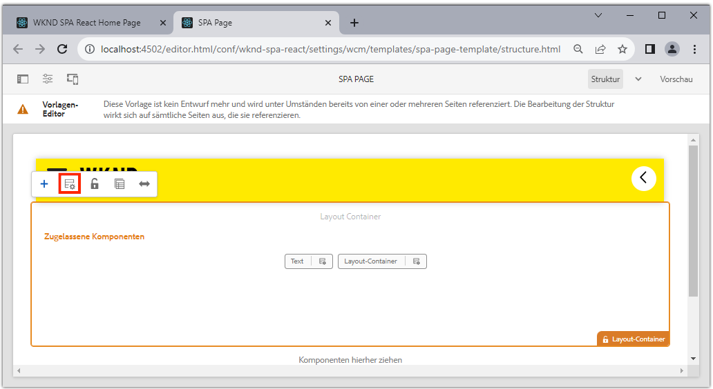

1. under **Zugelassene Komponenten** > **WKND SPA React - Content** > check **Bild**, **Teaser** und **Titel**.

   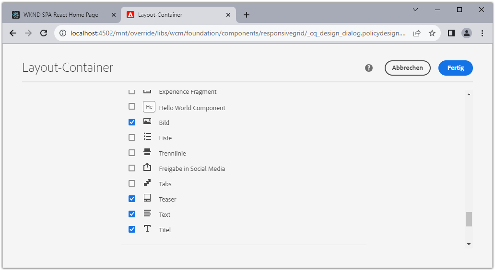

   under **Standardkomponenten** > **Zuordnung hinzufügen** und wählen Sie die **Bild - WKND SPA React - Content** component:

   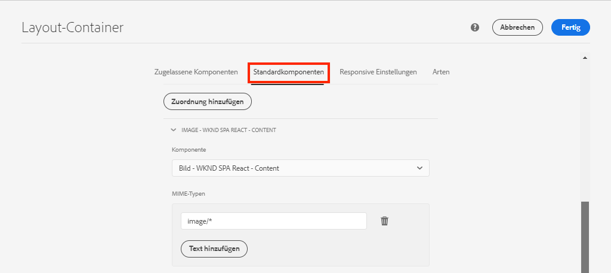

   Geben Sie einen **MIME-Typ** von `image/*`.

   Klicken **Fertig** , um die Richtlinienaktualisierungen zu speichern.

1. Im **Layout-Container** klicken Sie auf **policy** -Symbol für **Text** -Komponente.

   Erstellen Sie eine neue Richtlinie mit dem Namen **WKND SPA Text**. under **Plugins** > **Formatierung** > aktivieren Sie alle Kästchen, um zusätzliche Formatierungsoptionen zu aktivieren:

   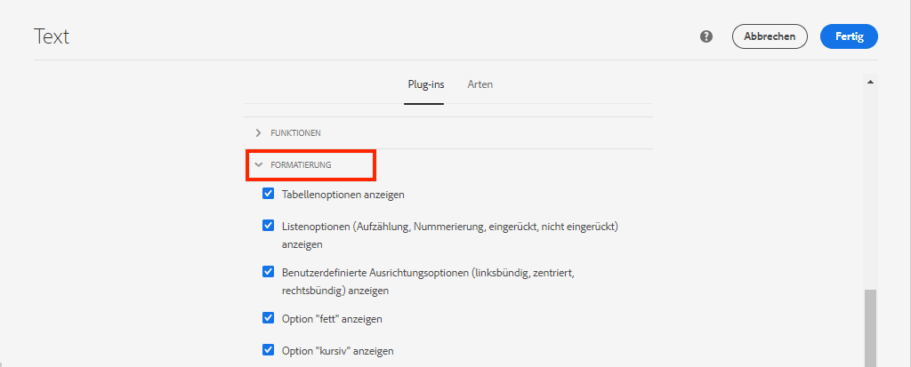

   under **Plugins** > **Absatzformate** > aktivieren Sie das Kontrollkästchen **Absatzstile aktivieren**:

   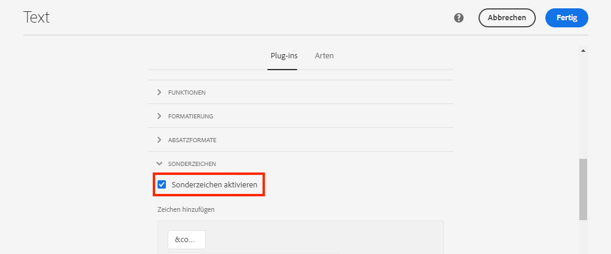

   Klicken **Fertig** , um die Richtlinienaktualisierung zu speichern.

### Autoreninhalt

1. Navigieren Sie zum **Homepage** [http://localhost:4502/editor.html/content/wknd-spa-react/us/en/home.html](http://localhost:4502/editor.html/content/wknd-spa-react/us/en/home.html).

1. Sie sollten jetzt in der Lage sein, die zusätzlichen Komponenten zu verwenden **Bild**, **Teaser** und **Titel** auf der Seite.

   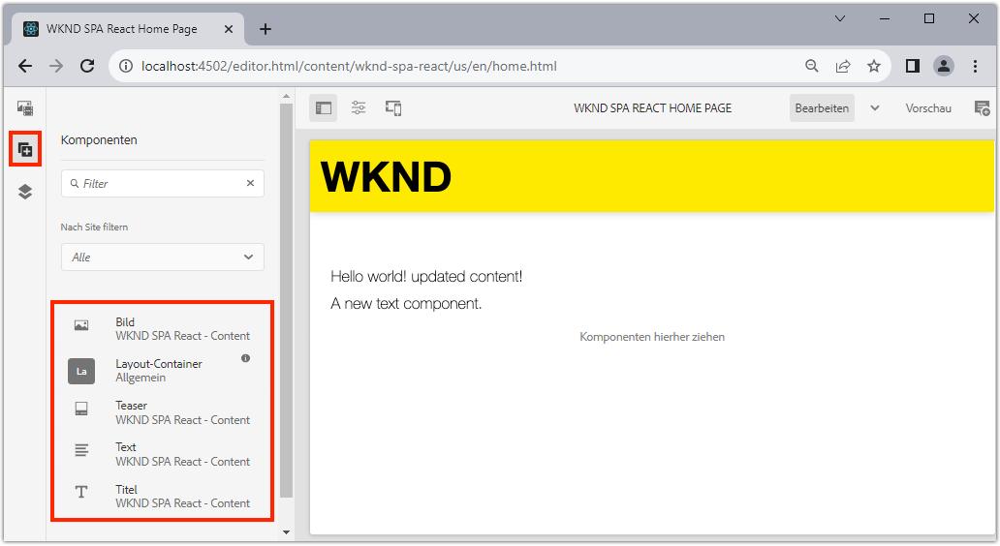

1. Sie sollten auch die `Text` Komponente hinzufügen und zusätzliche Absatzstile in **Vollbild** -Modus.

   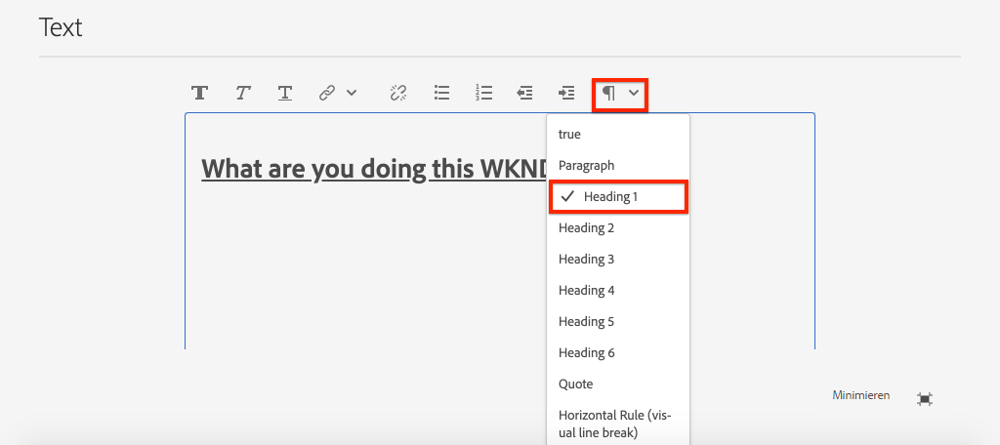

1. Sie sollten auch ein Bild per Drag-and-Drop aus der **Asset-Suche**:

   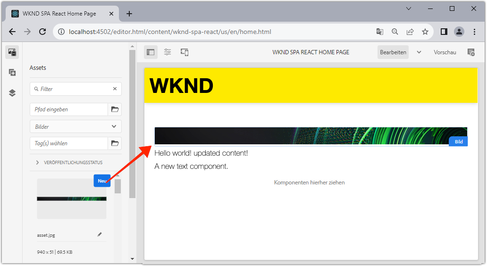

1. Erfahrung mit der **Titel** und **Teaser** Komponenten.

1. Fügen Sie Ihre eigenen Bilder hinzu über [AEM Assets](http://localhost:4502/assets.html/content/dam) oder installieren Sie die fertige Codebasis für den Standard [WKND-Referenz-Site](https://github.com/adobe/aem-guides-wknd/releases/latest). Die [WKND-Referenz-Site](https://github.com/adobe/aem-guides-wknd/releases/latest) enthält viele Bilder, die auf der WKND-SPA wiederverwendet werden können. Das Paket kann mit [AEM Package Manager](http://localhost:4502/crx/packmgr/index.jsp).

   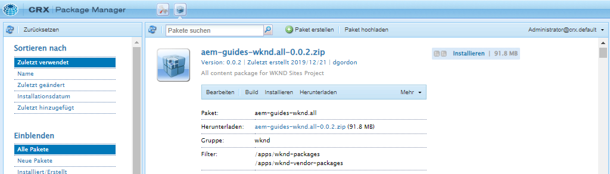

## Inspect des Layout-Containers

Unterstützung für **Layout-Container** wird automatisch vom AEM SPA Editor SDK bereitgestellt. Die **Layout-Container**, wie durch den Namen angegeben, ist ein **container** -Komponente. Container-Komponenten sind Komponenten, die JSON-Strukturen akzeptieren, die *other* Komponenten und instanziieren sie dynamisch.

Überprüfen wir nun den Layout-Container weiter.

1. Navigieren Sie in einem Browser zu [http://localhost:4502/content/wknd-spa-react/us/en.model.json](http://localhost:4502/content/wknd-spa-react/us/en.model.json)

   

   Die **Layout-Container** -Komponente verfügt über eine `sling:resourceType` von `wcm/foundation/components/responsivegrid` und vom SPA Editor mithilfe der `:type` -Eigenschaft, genau wie die `Text` und `Image` Komponenten.

   Die gleichen Funktionen für die Neuskalierung einer Komponente mit [Layout-Modus](https://experienceleague.adobe.com/docs/experience-manager-65/authoring/siteandpage/responsive-layout.html#defining-layouts-layout-mode) sind mit dem SPA Editor verfügbar.

2. Zurück zu [http://localhost:4502/editor.html/content/wknd-spa-react/us/en/home.html](http://localhost:4502/editor.html/content/wknd-spa-react/us/en/home.html). Hinzufügen zusätzlicher **Bild** Komponenten und versuchen Sie, sie mithilfe der **Layout** Option:

   

3. Erneutes Öffnen des JSON-Modells [http://localhost:4502/content/wknd-spa-react/us/en.model.json](http://localhost:4502/content/wknd-spa-react/us/en.model.json) und beobachten Sie die `columnClassNames` als Teil des JSON:

   

   Der Klassenname `aem-GridColumn--default--4` gibt an, dass die Komponente basierend auf einem 12-Spalten-Raster 4 Spalten breit sein sollte. Weitere Informationen zum [Responsives Raster finden Sie hier .](https://adobe-marketing-cloud.github.io/aem-responsivegrid/).

4. Kehren Sie zur IDE zurück und im `ui.apps` -Modul gibt es eine clientseitige Bibliothek, die unter definiert ist. `ui.apps/src/main/content/jcr_root/apps/wknd-spa-react/clientlibs/clientlib-grid`. Öffnen Sie die Datei `less/grid.less`.

   Diese Datei bestimmt die Haltepunkte (`default`, `tablet`und `phone`) verwendet von der **Layout-Container**. Diese Datei soll gemäß den Projektspezifikationen angepasst werden. Derzeit sind die Haltepunkte auf `1200px` und `768px`.

5. Sie sollten die responsiven Funktionen und die aktualisierten Rich-Text-Richtlinien der `Text` -Komponente, um eine Ansicht wie die folgende zu erstellen:

   

## Herzlichen Glückwunsch! {#congratulations}

Herzlichen Glückwunsch! Sie haben gelernt, wie Sie SPA Komponenten AEM Komponenten zuordnen und die React-Kernkomponenten verwendet haben. Außerdem haben Sie die Möglichkeit, die responsiven Funktionen der **Layout-Container**.

### Nächste Schritte {#next-steps}

[Navigation und Routing](navigation-routing.md) - Erfahren Sie, wie mehrere Ansichten im SPA unterstützt werden können, indem Sie sie mit dem SPA Editor SDK AEM Seiten zuordnen. Die dynamische Navigation wird mit React-Router und React-Kernkomponenten implementiert.

## (Bonus) Beibehalten von Konfigurationen zur Quell-Code-Verwaltung {#bonus-configs}

In vielen Fällen ist es insbesondere zu Beginn eines AEM-Projekts nützlich, Konfigurationen wie Vorlagen und zugehörige Inhaltsrichtlinien zur Quell-Code-Verwaltung beizubehalten. Dadurch wird sichergestellt, dass alle Entwickler mit demselben Inhalt und denselben Konfigurationen arbeiten und zusätzliche Konsistenz zwischen Umgebungen sichergestellt wird. Sobald ein Projekt einen gewissen Reifegrad erreicht hat, kann die Verwaltung von Vorlagen einer speziellen Gruppe von Power-Benutzern übertragen werden.

Die nächsten Schritte werden mit der Visual Studio Code-IDE und [VSCode AEM Sync](https://marketplace.visualstudio.com/items?itemName=yamato-ltd.vscode-aem-sync) kann jedoch jedes beliebige Tool und jede IDE verwenden, für die Sie konfiguriert haben **abrufen** oder **importieren** Inhalt von einer lokalen Instanz von AEM.

1. Stellen Sie in der Visual Studio Code-IDE sicher, dass Sie **VSCode AEM Sync** über die Marketplace-Erweiterung installiert wird:

   

2. Erweitern Sie die **ui.content** -Modul im Projekt-Explorer ein und navigieren Sie zu `/conf/wknd-spa-react/settings/wcm/templates`.

3. **Rechts+Klicken** die `templates` Ordner und wählen Sie **Import von AEM Server**:

   

4. Wiederholen Sie die Schritte zum Importieren von Inhalten, wählen Sie jedoch die **policies** Ordner unter `/conf/wknd-spa-react/settings/wcm/templates/policies`.

5. Inspect `filter.xml` Datei unter `ui.content/src/main/content/META-INF/vault/filter.xml`.

   ```xml
   <!--ui.content filter.xml-->
   <?xml version="1.0" encoding="UTF-8"?>
    <workspaceFilter version="1.0">
        <filter root="/conf/wknd-spa-react" mode="merge"/>
        <filter root="/content/wknd-spa-react" mode="merge"/>
        <filter root="/content/dam/wknd-spa-react" mode="merge"/>
        <filter root="/content/experience-fragments/wknd-spa-react" mode="merge"/>
    </workspaceFilter>
   ```

   Die `filter.xml` -Datei ist für die Identifizierung der Pfade von Knoten verantwortlich, die mit dem Paket installiert werden. Beachten Sie die `mode="merge"` bei jedem Filter, der anzeigt, dass existierender Inhalt nicht geändert wird, werden nur neue Inhalte hinzugefügt. Da Inhaltsautoren diese Pfade möglicherweise aktualisieren, ist es wichtig, dass eine Codebereitstellung **not** Inhalt überschreiben. Siehe [FileVault-Dokumentation](https://jackrabbit.apache.org/filevault/filter.html) Weitere Informationen zum Arbeiten mit Filterelementen.

   Vergleichen `ui.content/src/main/content/META-INF/vault/filter.xml` und `ui.apps/src/main/content/META-INF/vault/filter.xml` um die verschiedenen Knoten zu verstehen, die von den einzelnen Modulen verwaltet werden.

## (Bonus) Erstellen einer benutzerdefinierten Bildkomponente {#bonus-image}

Eine SPA Bildkomponente wurde bereits von den React-Kernkomponenten bereitgestellt. Wenn Sie jedoch eine zusätzliche Übung wünschen, erstellen Sie Ihre eigene React-Implementierung, die dem AEM zugeordnet ist [Bildkomponente](https://experienceleague.adobe.com/docs/experience-manager-core-components/using/components/image.html?lang=de). Die `Image` -Komponente ist ein weiteres Beispiel für eine **content** -Komponente.

### Inspect the JSON

Bevor Sie in den SPA-Code springen, überprüfen Sie das von AEM bereitgestellte JSON-Modell.

1. Navigieren Sie zum [Bildbeispiele in der Kernkomponentenbibliothek](https://www.aemcomponents.dev/content/core-components-examples/library/core-content/image.html).

   

   Eigenschaften von `src`, `alt`und `title` werden zum Ausfüllen der SPA verwendet `Image` -Komponente.

   >[!NOTE]
   >
   > Es werden andere Bildeigenschaften bereitgestellt (`lazyEnabled`, `widths`), die es einem Entwickler ermöglichen, eine adaptive und verzögerte Ladekomponente zu erstellen. Die in diesem Tutorial erstellte Komponente ist einfach und erfüllt folgende Aufgaben: **not** Verwenden Sie diese erweiterten Eigenschaften.

### Implementieren der Bildkomponente

1. Erstellen Sie anschließend einen neuen Ordner mit dem Namen `Image` under `ui.frontend/src/components`.
1. Unter dem `Image` Ordner erstellen Sie eine neue Datei mit dem Namen `Image.js`.

   

1. Fügen Sie Folgendes hinzu: `import` Anweisungen `Image.js`:

   ```js
   import React, {Component} from 'react';
   import {MapTo} from '@adobe/aem-react-editable-components';
   ```

1. Fügen Sie dann die `ImageEditConfig` um zu bestimmen, wann der Platzhalter in AEM angezeigt werden soll:

   ```js
   export const ImageEditConfig = {
   
       emptyLabel: 'Image',
   
       isEmpty: function(props) {
           return !props || !props.src || props.src.trim().length < 1;
       }
   };
   ```

   Der Platzhalter zeigt an, ob die `src` -Eigenschaft nicht festgelegt ist.

1. Die nächste Implementierung `Image` -Klasse:

   ```js
    export default class Image extends Component {
   
       get content() {
           return ;
       }
   
       render() {
           if(ImageEditConfig.isEmpty(this.props)) {
               return null;
           }
   
           return (
                   <div className="Image">
                       {this.content}
                   </div>
           );
       }
   }
   ```

   Der obige Code gibt eine `` basierend auf den Eigenschaften `src`, `alt`und `title` vom JSON-Modell übergeben.

1. Fügen Sie die `MapTo` Code zum Zuordnen der React-Komponente zur AEM Komponente:

   ```js
   MapTo('wknd-spa-react/components/image')(Image, ImageEditConfig);
   ```

   Beachten Sie die Zeichenfolge `wknd-spa-react/components/image` entspricht dem Speicherort der AEM Komponente in `ui.apps` unter: `ui.apps/src/main/content/jcr_root/apps/wknd-spa-react/components/image`.

1. Erstellen Sie eine neue Datei mit dem Namen `Image.css` im selben Ordner und fügen Sie Folgendes hinzu:

   ```scss
   .Image-src {
       margin: 1rem 0;
       width: 100%;
       border: 0;
   }
   ```

1. In `Image.js` Fügen Sie oben unter der `import` -Anweisungen:

   ```js
   import React, {Component} from 'react';
   import {MapTo} from '@adobe/aem-react-editable-components';
   
   require('./Image.css');
   ```

1. Öffnen Sie die Datei `ui.frontend/src/components/import-components.js` und fügen Sie einen Verweis zum neuen `Image` component:

   ```js
   import './Page/Page';
   import './Text/Text';
   import './Container/Container';
   import './ExperienceFragment/ExperienceFragment';
   import './Image/Image'; //add reference to Image component
   ```

1. In `import-components.js` kommentieren Sie das Bild der React-Kernkomponente aus:

   ```js
   //MapTo('wknd-spa-react/components/image')(ImageV2, {isEmpty: ImageV2IsEmptyFn});
   ```

   Dadurch wird sichergestellt, dass stattdessen unsere benutzerdefinierte Bildkomponente verwendet wird.

1. Stellen Sie aus dem Stammverzeichnis des Projekts den SPA-Code mithilfe von Maven für AEM bereit:

   ```shell
   $ cd aem-guides-wknd-spa.react
   $ mvn clean install -PautoInstallSinglePackage
   ```

1. Inspect die SPA in AEM. Alle Bildkomponenten auf der Seite sollten weiterhin funktionieren. Inspect die gerenderte Ausgabe und Sie sollten das Markup für unsere benutzerdefinierte Bildkomponente anstelle der React-Kernkomponente sehen.

   *Markup für benutzerdefinierte Bildkomponenten*

   ```html
   <div class="Image">
       
   </div>
   ```

   *Bild-Markup der React-Kernkomponente*

   ```html
   <div class="cmp-image cq-dd-image">
       
   </div>
   ```

   Dies ist eine gute Einführung in die Erweiterung und Implementierung Ihrer eigenen Komponenten.
