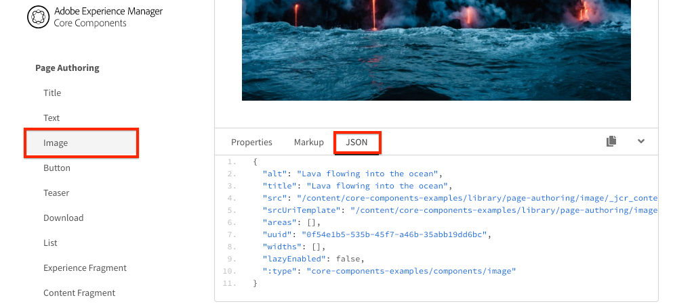

# Zuordnen von SPA-Komponenten zu AEM-Komponenten {#map-components}

Erfahren Sie, wie Sie React-Komponenten mit dem AEM SPA Editor JS SDK auf Adobe Experience Manager (AEM)-Komponenten abbilden können. Die Komponentenzuordnung ermöglicht es Benutzenden, im AEM-SPA-Editor dynamische Aktualisierungen an SPA-Komponenten vorzunehmen, ähnlich wie beim herkömmlichen AEM-Authoring.

In diesem Kapitel werden die AEM JSON-Modell-API und die Möglichkeiten erläutert, wie der von einer AEM-Komponente angezeigte JSON-Inhalt automatisch als Props in eine React-Komponente eingefügt werden kann.

## Ziel

1. Erfahren Sie, wie Sie AEM-Komponenten SPA-Komponenten zuordnen.
1. Sehen Sie sich an, wie eine React-Komponente dynamische Eigenschaften verwendet, die von AEM übergeben werden.
1. Erfahren Sie, wie Sie vorkonfigurierte [React AEM-Kernkomponenten](https://github.com/adobe/aem-react-core-wcm-components-examples) nutzen können.

## Was Sie erstellen werden

In diesem Kapitel wird untersucht, wie die bereitgestellte SPA-`Text`-Komponente auf die AEM-`Text`-Komponente abgebildet wird. React-Kernkomponenten wie die SPA-`Image`-Komponente werden in der SPA verwendet und in AEM verfasst. Vorkonfigurierte Funktionen der **Layout-Container**- und **Vorlageneditor**-Richtlinien werden auch verwendet, um eine Ansicht zu erstellen, die etwas abwechslungsreicher erscheint.


## Voraussetzungen

Vergegenwärtigen Sie sich die erforderlichen Tools und Anweisungen zum Einrichten einer [lokalen Entwicklungsumgebung](overview.md#local-dev-environment). Dieses Kapitel ist eine Fortsetzung des Kapitels [Integration von SPA](integrate-spa.md). Um dem Kapitel zu folgen, benötigen Sie lediglich ein SPA-fähiges AEM-Projekt.

## Zuordnungsansatz

Das grundlegende Konzept besteht darin, eine SPA-Komponente einer AEM-Komponente zuzuordnen. Server-seitig ausgeführte AEM-Komponenten exportieren Inhalte als Teil der JSON-Modell-API. Der JSON-Inhalt wird von der SPA verwendet, die Client-seitig im Browser ausgeführt wird. Es wird eine 1:1-Zuordnung zwischen SPA-Komponenten und einer AEM-Komponente erstellt.


*Allgemeine Übersicht über die Zuordnung einer AEM-Komponente zu einer React-Komponente*

## Überprüfen der Textkomponente

Der [AEM-Projektarchetyp](https://github.com/adobe/aem-project-archetype) bietet eine `Text`-Komponente, die der AEM-[Textkomponente](https://experienceleague.adobe.com/docs/experience-manager-core-components/using/components/text.html?lang=de) zugeordnet ist. Dies ist ein Beispiel für eine **Inhaltskomponente**, da sie *Inhalte* von AEM rendert.

Sehen wir uns an, wie die Komponente funktioniert.

### Überprüfen des JSON-Modells

1. Bevor wir zum SPA-Code kommen, müssen Sie zunächst das von AEM bereitgestellte JSON-Modell verstehen. Navigieren Sie zur [Kernkomponentenbibliothek](https://www.aemcomponents.dev/content/core-components-examples/library/core-content/text.html) und rufen Sie die Seite für die Textkomponente auf. Die Kernkomponentenbibliothek enthält Beispiele für alle AEM-Kernkomponenten.
1. Wählen Sie die Registerkarte **JSON** für eines der folgenden Beispiele aus:

   

   Es sollten drei Eigenschaften angezeigt werden: `text`, `richText`und `:type`.

   `:type` ist eine reservierte Eigenschaft, die den `sling:resourceType` (oder Pfad) der AEM-Komponente auflistet. Der Wert von `:type` wird verwendet, um die AEM-Komponente der SPA zuzuordnen.

   `text` und `richText` sind zusätzliche Eigenschaften, die für die SPA-Komponente verfügbar gemacht werden.

1. Sehen Sie sich die JSON-Ausgabe unter [http://localhost:4502/content/wknd-spa-react/us/en.model.json](http://localhost:4502/content/wknd-spa-react/us/en.model.json) an. Sie sollten einen Eintrag finden können, der in etwa wie folgt aussieht:

   ```json
   "text": {
       "id": "text-a647cec03a",
       "text": "<p>Hello World! Updated content!</p>\r\n",
       "richText": true,
       ":type": "wknd-spa-react/components/text",
       "dataLayer": {}
      }
   ```

### Überprüfen der Text-SPA-Komponente

1. Öffnen Sie in der IDE Ihrer Wahl das AEM-Projekt für die SPA. Erweitern Sie das `ui.frontend`-Modul und öffnen Sie die Datei `Text.js` unter `ui.frontend/src/components/Text/Text.js`.

1. Der erste Bereich, den wir untersuchen werden, ist der `class Text` bei ~Zeile 40:

   ```js
   class Text extends Component {
   
       get richTextContent() {
           return (<div
                   id={extractModelId(this.props.cqPath)}
                   data-rte-editelement
                   dangerouslySetInnerHTML={{__html: DOMPurify.sanitize(this.props.text)}} />
                   );
       }
   
       get textContent() {
           return <div>{this.props.text}</div>;
       }
   
       render() {
           return this.props.richText ? this.richTextContent : this.textContent;
       }
   }
   ```

   `Text` ist eine standardmäßige React-Komponente. Die Komponente verwendet `this.props.richText`, um zu bestimmen, ob es sich bei dem zu rendernden Inhalt um Rich-Text oder Nur-Text handelt. Der tatsächlich verwendete „Inhalt“ stammt aus `this.props.text`.

   Um einen möglichen XSS-Angriff zu vermeiden, wird der Rich-Text über `DOMPurify` mit Escape-Zeichen versehen, bevor [dangerouslySetInnerHTML](https://reactjs.org/docs/dom-elements.html#dangerouslysetinnerhtml) zum Rendern des Inhalts verwendet wird. Erinnern Sie sich an die `richText`- und `text`-Eigenschaften aus dem JSON-Modell, das zu einem früheren Zeitpunkt in der Übung verwendet wurde.

1. Als Nächstes öffnen Sie `ui.frontend/src/components/import-components.js` und schauen Sie sich `TextEditConfig` in ~Zeile 86 an:

   ```js
   const TextEditConfig = {
   emptyLabel: 'Text',
   
       isEmpty: function(props) {
           return !props || !props.text || props.text.trim().length < 1;
       }
   };
   ```

   Der obige Code bestimmt, wann der Platzhalter in der AEM Author-Umgebung gerendert werden soll. Wenn die Methode `isEmpty` **true** zurückgibt, wird der Platzhalter gerendert.

1. Sehen Sie sich abschließend den Aufruf `MapTo` bei ~Zeile 94 an:

   ```js
   export default MapTo('wknd-spa-react/components/text')(LazyTextComponent, TextEditConfig);
   ```

   `MapTo` wird durch das AEM SPA Editor JS SDK (`@adobe/aem-react-editable-components`) bereitgestellt. Der Pfad `wknd-spa-react/components/text` stellt die `sling:resourceType` der AEM-Komponente dar. Dieser Pfad wird mit dem `:type` abgeglichen, der von dem zuvor festgestellten JSON-Modell bereitgestellt wird. `MapTo` analysiert die JSON-Modellantwort und übergibt die richtigen Werte als `props` zur SPA-Komponente.

   Sie finden die AEM-`Text`Komponentendefinition unter `ui.apps/src/main/content/jcr_root/apps/wknd-spa-react/components/text`.

## Verwenden Sie die React-Kernkomponenten

[AEM WCM-Komponenten – React-Kernimplementierung](https://github.com/adobe/aem-react-core-wcm-components-base) und [AEM WCM-Komponenten – SPA-Editor – React-Kernimplementierung](https://github.com/adobe/aem-react-core-wcm-components-spa). Hierbei handelt es sich um einen Satz wiederverwendbarer Komponenten der Benutzeroberfläche, die vordefinierten AEM-Komponenten zugeordnet sind. Die meisten Projekte können diese Komponenten als Ausgangspunkt für ihre eigene Implementierung wiederverwenden.

1. Öffnen Sie im Projekt-Code die Datei `import-components.js` unter `ui.frontend/src/components`.
Diese Datei importiert alle SPA-Komponenten, die AEM-Komponenten zugeordnet sind. Angesichts der Dynamik der SPA-Editor-Implementierung müssen wir explizit auf alle SPA-Komponenten verweisen, die mit AEM Author-fähigen Komponenten verknüpft sind. Dadurch können AEM-Autorinnen und -Autoren wählen, ob sie eine Komponente überall in der Anwendung verwenden möchten.
1. Die folgenden Importanweisungen enthalten SPA-Komponenten, die in das Projekt geschrieben wurden:

   ```js
   import './Page/Page';
   import './Text/Text';
   import './Container/Container';
   import './ExperienceFragment/ExperienceFragment';
   ```

1. Es gibt mehrere andere `imports` aus `@adobe/aem-core-components-react-spa` und `@adobe/aem-core-components-react-base`. Diese importieren die React-Kernkomponenten und stellen sie im aktuellen Projekt zur Verfügung. Diese werden dann mithilfe von `MapTo` projektspezifischen AEM-Komponenten zugeordnet, genau wie im Beispiel der `Text`-Komponente zuvor.

### Aktualisieren von AEM-Richtlinien

Richtlinien sind eine Funktion von AEM-Vorlagen, die Entwickelnden und Hauptbenutzenden eine granulare Steuerung darüber gibt, welche Komponenten verwendet werden können. Die React-Kernkomponenten sind im SPA-Code enthalten, müssen jedoch über eine Richtlinie aktiviert werden, bevor sie in der Anwendung verwendet werden können.

1. Navigieren Sie auf dem AEM-Startbildschirm zu **Tools** > **Vorlagen** > **[WKND SPA React](http://localhost:4502/libs/wcm/core/content/sites/templates.html/conf/wknd-spa-react)**.

1. Wählen Sie die Vorlage **SPA-Seite** aus und öffnen Sie sie zur Bearbeitung.

1. Wählen Sie den **Layout-Container** und klicken Sie auf das Symbol **Richtlinie**, um die Richtlinie zu bearbeiten:

   

1. Unter **Zugelassene Komponenten** > **WKND SPA React – Inhalt** > überprüfen Sie **Bild**, **Teaser** und **Titel**.

   

   Unter **Standardkomponenten** > **Zuordnung hinzufügen** wählen Sie die Komponente **Bild – WKND SPA React – Inhalt**:

   

   Geben Sie einen **MIME-Typ** von `image/*` ein.

   Klicken Sie auf **Fertig**, um die Richtlinienaktualisierungen zu speichern.

1. Klicken Sie im **Layout-Container** auf das Symbol **Richtlinie** für die Komponente **Text**.

   Erstellen Sie eine neue Richtlinie mit dem Namen **WKND SPA-Text**. Unter **Plugins** > **Formatierung** > markieren Sie alle Kästchen, um zusätzliche Formatierungsoptionen zu aktivieren:

   

   Kreuzen Sie unter **Plugins** > **Absatzformate** > das Kontrollkästchen **Absatzformate aktivieren** an:

   

   Klicken Sie auf **Fertig**, um die Richtlinienaktualisierung zu speichern.

### Authoring von Inhalten

1. Navigieren Sie zur **Startseite** [http://localhost:4502/editor.html/content/wknd-spa-react/us/en/home.html](http://localhost:4502/editor.html/content/wknd-spa-react/us/en/home.html).

1. Sie sollten jetzt in der Lage sein, die zusätzlichen Komponenten **Bild**, **Teaser** und **Titel** auf der Seite zu verwenden.

   

1. Sie sollten auch in der Lage sein, die `Text`-Komponente zu bearbeiten und zusätzliche Absatzformate im **Vollbild**-Modus hinzuzufügen.

   

1. Sie sollten auch dazu in der Lage sein, ein Bild per Drag-and-Drop aus dem **Asset-Finder** zu ziehen:

   

1. Experimentieren Sie mit der **Titel**- und der **Teaser**-Komponente.

1. Fügen Sie Ihre eigenen Bilder über [AEM Assets](http://localhost:4502/assets.html/content/dam) hinzu oder installieren Sie die fertige Codebasis für die standardmäßige [WKND-Referenz-Site](https://github.com/adobe/aem-guides-wknd/releases/latest). Die [WKND-Referenz-Site](https://github.com/adobe/aem-guides-wknd/releases/latest) enthält viele Bilder, die auf der WKND-SPA wiederverwendet werden können. Das Paket kann mit dem [Package Manager von AEM](http://localhost:4502/crx/packmgr/index.jsp) installiert werden.

   

## Überprüfen des Layout-Containers

Unterstützung für den **Layout-Container** wird automatisch vom AEM SPA Editor SDK bereitgestellt. Der **Layout-Container** ist, wie der Name schon sagt, eine **Container**-Komponente. Container-Komponenten sind Komponenten, die JSON-Strukturen akzeptieren, die *andere* Komponenten darstellen und dynamisch instanziieren.

Überprüfen wir den Layout-Container weiter.

1. Navigieren Sie in einem Browser zu [http://localhost:4502/content/wknd-spa-react/us/en.model.json](http://localhost:4502/content/wknd-spa-react/us/en.model.json)

   

   Die Komponente **Layout-Container** verfügt über einen `sling:resourceType` von `wcm/foundation/components/responsivegrid` und wird vom SPA-Editor mithilfe der `:type`-Eigenschaft erkannt, genau wie die Komponenten `Text` und `Image`.

   Die gleichen Funktionen für die Änderung der Größe einer Komponente mit dem [Layout-Modus](https://experienceleague.adobe.com/docs/experience-manager-65/authoring/siteandpage/responsive-layout.html?lang=de#defining-layouts-layout-mode) sind mit dem SPA-Editor verfügbar.

2. Kehren Sie zurück zu [http://localhost:4502/editor.html/content/wknd-spa-react/us/en/home.html](http://localhost:4502/editor.html/content/wknd-spa-react/us/en/home.html). Fügen Sie zusätzliche **Bild**-Komponenten hinzu und versuchen Sie, mithilfe der **Layout**-Option ihre Größe zu verändern:

   

3. Öffnen Sie das JSON-Modell [http://localhost:4502/content/wknd-spa-react/us/en.model.json](http://localhost:4502/content/wknd-spa-react/us/en.model.json) erneut und betrachten Sie die `columnClassNames` als Teil von JSON:

   

   Der Klassenname `aem-GridColumn--default--4` gibt an, dass die Komponente basierend auf einem 12-Spalten-Raster 4 Spalten breit sein sollte. Weitere Informationen zum [Responsiven Raster finden Sie hier.](https://adobe-marketing-cloud.github.io/aem-responsivegrid/)

4. Kehren Sie zur IDE zurück. Im `ui.apps`-Modul gibt es eine Client-seitige Bibliothek, die unter `ui.apps/src/main/content/jcr_root/apps/wknd-spa-react/clientlibs/clientlib-grid` definiert ist. Öffnen Sie die Datei `less/grid.less`.

   Diese Datei bestimmt die Haltepunkte (`default`, `tablet` und `phone`), die der **Layout-Container** verwendet. Diese Datei soll gemäß den Projektspezifikationen angepasst werden. Derzeit sind die Haltepunkte auf `1200px` und `768px` festgelegt.

5. Sie sollten in der Lage sein, die responsiven Funktionen und die aktualisierten Rich-Text-Richtlinien der `Text`-Komponente zu verwenden, um eine Ansicht wie die folgende zu erstellen:

   

## Herzlichen Glückwunsch! {#congratulations}

Herzlichen Glückwunsch! Sie haben gelernt, wie Sie SPA-Komponenten AEM-Komponenten zuordnen und Sie haben die React-Kernkomponenten verwendet. Außerdem hatten Sie die Möglichkeit, die responsiven Funktionen des **Layout-Containers** kennenzulernen.

### Nächste Schritte {#next-steps}

[Navigation und Routing](navigation-routing.md) – Erfahren Sie, wie mehrere Ansichten in der SPA durch Zuordnung zu AEM-Seiten mit dem SPA Editor SDK unterstützt werden können. Die dynamische Navigation wird mit React Router und React-Kernkomponenten implementiert.

## (Bonus) Beibehalten von Konfigurationen zur Verwaltung der Quelle {#bonus-configs}

In vielen Fällen, insbesondere zu Beginn eines AEM-Projekts, ist es nützlich, Konfigurationen wie Vorlagen und zugehörige Inhaltsrichtlinien beizubehalten, um die Quelle zu verwalten. Dadurch wird sichergestellt, dass alle Entwicklerinnen und Entwickler mit demselben Inhaltssatz und denselben Konfigurationen arbeiten, und zusätzliche Konsistenz zwischen Umgebungen gewährleistet. Sobald ein Projekt einen gewissen Reifegrad erreicht hat, kann die Verwaltung von Vorlagen einer speziellen Gruppe von Power-Benutzenden übertragen werden.

Die nächsten Schritte werden mit der Visual Studio Code-IDE und [VSCode AEM Sync](https://marketplace.visualstudio.com/items?itemName=yamato-ltd.vscode-aem-sync) durchgeführt, jedoch kann jedes beliebige Tool und jede IDE verwendet werden, für die Sie konfiguriert haben, dass sie Inhalt von einer lokalen Instanz von AEM **abrufen** oder **importieren**.

1. Stellen Sie in der Visual Studio Code-IDE sicher, dass Sie **VSCode AEM Sync** über die Marketplace-Erweiterung installiert haben:

   

2. Erweitern Sie das **ui.content**-Modul im Project Explorer und navigieren Sie zu `/conf/wknd-spa-react/settings/wcm/templates`.

3. **Klicken Sie mit der rechten Maustaste** auf den Ordner `templates` und wählen Sie **Importieren aus AEM Server**:

   

4. Wiederholen Sie die Schritte zum Importieren von Inhalten, aber wählen Sie den Ordner **policies** unter `/conf/wknd-spa-react/settings/wcm/templates/policies` aus.

5. Überprüfen Sie die Datei `filter.xml` unter `ui.content/src/main/content/META-INF/vault/filter.xml`.

   ```xml
   <!--ui.content filter.xml-->
   <?xml version="1.0" encoding="UTF-8"?>
    <workspaceFilter version="1.0">
        <filter root="/conf/wknd-spa-react" mode="merge"/>
        <filter root="/content/wknd-spa-react" mode="merge"/>
        <filter root="/content/dam/wknd-spa-react" mode="merge"/>
        <filter root="/content/experience-fragments/wknd-spa-react" mode="merge"/>
    </workspaceFilter>
   ```

   Die Datei `filter.xml` ist für die Identifizierung der Pfade von Knoten verantwortlich, die mit dem Paket installiert werden. `mode="merge"` bei jedem Filter bedeutet, dass vorhandener Inhalt nicht geändert wird, sondern nur neue Inhalte hinzugefügt werden. Da Inhaltsautorinnen und Inhaltsautoren diese Pfade möglicherweise aktualisieren, ist es wichtig, dass Inhalte bei einer Code-Bereitstellung **nicht** überschrieben werden. Weitere Informationen zum Arbeiten mit Filterelementen finden Sie in der [FileVault-Dokumentation](https://jackrabbit.apache.org/filevault/filter.html).

   Vergleichen Sie `ui.content/src/main/content/META-INF/vault/filter.xml` und `ui.apps/src/main/content/META-INF/vault/filter.xml`, um die verschiedenen Knoten zu verstehen, die von den einzelnen Modulen verwaltet werden.

## (Bonus) Erstellen einer benutzerdefinierten Bildkomponente {#bonus-image}

Eine SPA-Bildkomponente wurde bereits von den React-Kernkomponenten bereitgestellt. Wenn Sie jedoch zusätzlich üben möchten, erstellen Sie Ihre eigene React-Implementierung, die der [Bildkomponente](https://experienceleague.adobe.com/docs/experience-manager-core-components/using/components/image.html?lang=de) von AEM zugeordnet ist. Die `Image`-Komponente ist ein weiteres Beispiel für eine **Inhaltskomponente**.

### Überprüfen des JSON-Modells

Bevor wir zum SPA-Code kommen, überprüfen Sie das von AEM bereitgestellte JSON-Modell.

1. Navigieren Sie zu den [Bildbeispielen in der Kernkomponentenbibliothek](https://www.aemcomponents.dev/content/core-components-examples/library/core-content/image.html).

   

   Die Eigenschaften `src`, `alt` und `title` werden zum Auffüllen der `Image`-SPA-Komponente verwendet.

   >[!NOTE]
   >
   > Es werden andere Bildeigenschaften bereitgestellt (`lazyEnabled`, `widths`), die es Entwickelnden ermöglichen, eine adaptive und Lazy-Loading-basierte Komponente zu erstellen. Die in diesem Tutorial erstellte Komponente ist einfach und verwendet **nicht** diese erweiterten Eigenschaften.

### Implementieren der Bildkomponente

1. Als Nächstes erstellen Sie einen neuen Ordner mit dem Namen `Image` unter `ui.frontend/src/components`.
1. Erstellen Sie im Ordner `Image` eine neue Datei mit dem Namen `Image.js`.

   

1. Fügen Sie folgende `import`-Anweisung zu `Image.js` hinzu:

   ```js
   import React, {Component} from 'react';
   import {MapTo} from '@adobe/aem-react-editable-components';
   ```

1. Fügen Sie dann `ImageEditConfig` hinzu, um zu bestimmen, wann der Platzhalter in AEM angezeigt werden soll:

   ```js
   export const ImageEditConfig = {
   
       emptyLabel: 'Image',
   
       isEmpty: function(props) {
           return !props || !props.src || props.src.trim().length < 1;
       }
   };
   ```

   Der Platzhalter zeigt an, wenn die Eigenschaft `src` nicht festgelegt ist.

1. Implementieren Sie anschließend die `Image`-Klasse:

   ```js
    export default class Image extends Component {
   
       get content() {
           return ;
       }
   
       render() {
           if(ImageEditConfig.isEmpty(this.props)) {
               return null;
           }
   
           return (
                   <div className="Image">
                       {this.content}
                   </div>
           );
       }
   }
   ```

   Der obige Code rendert nun ein ``-Objekt basierend auf den vom JSON-Modell übergebenen Eigenschaften `src`, `alt` und `title`.

1. Fügen Sie den Code `MapTo` zum Zuordnen der React-Komponente zur AEM-Komponente hinzu:

   ```js
   MapTo('wknd-spa-react/components/image')(Image, ImageEditConfig);
   ```

   Beachten Sie, dass die Zeichenfolge `wknd-spa-react/components/image` dem Speicherort der AEM-Komponente in `ui.apps` unter `ui.apps/src/main/content/jcr_root/apps/wknd-spa-react/components/image` entspricht.

1. Erstellen Sie eine neue Datei mit dem Namen `Image.css` im selben Verzeichnis und fügen Sie Folgendes hinzu:

   ```scss
   .Image-src {
       margin: 1rem 0;
       width: 100%;
       border: 0;
   }
   ```

1. Fügen Sie in `Image.js` einen Verweis auf die Datei oben unter den `import`-Anweisungen hinzu:

   ```js
   import React, {Component} from 'react';
   import {MapTo} from '@adobe/aem-react-editable-components';
   
   require('./Image.css');
   ```

1. Öffnen Sie die Datei `ui.frontend/src/components/import-components.js` und fügen Sie einen Verweis auf die neue `Image`-Komponente hinzu:

   ```js
   import './Page/Page';
   import './Text/Text';
   import './Container/Container';
   import './ExperienceFragment/ExperienceFragment';
   import './Image/Image'; //add reference to Image component
   ```

1. Kommentieren Sie in `import-components.js` das Bild der React-Kernkomponente aus:

   ```js
   //MapTo('wknd-spa-react/components/image')(ImageV2, {isEmpty: ImageV2IsEmptyFn});
   ```

   Dadurch wird sichergestellt, dass stattdessen die benutzerdefinierte Bildkomponente verwendet wird.

1. Stellen Sie aus dem Stammverzeichnis des Projekts den SPA-Code mithilfe von Maven für AEM bereit:

   ```shell
   $ cd aem-guides-wknd-spa.react
   $ mvn clean install -PautoInstallSinglePackage
   ```

1. Überprüfen Sie die SPA in AEM. Alle Bildkomponenten auf der Seite sollten weiterhin funktionieren. Überprüfen Sie die gerenderte Ausgabe. Sie sollten das Markup für die benutzerdefinierte Bildkomponente anstelle der React-Kernkomponente sehen.

   *Markup für die benutzerdefinierte Bildkomponente*

   ```html
   <div class="Image">
       
   </div>
   ```

   *Markup für das Bild der React-Kernkomponente*

   ```html
   <div class="cmp-image cq-dd-image">
       
   </div>
   ```

   Dies stellt eine gute Einführung in die Erweiterung und Implementierung Ihrer eigenen Komponenten dar.
