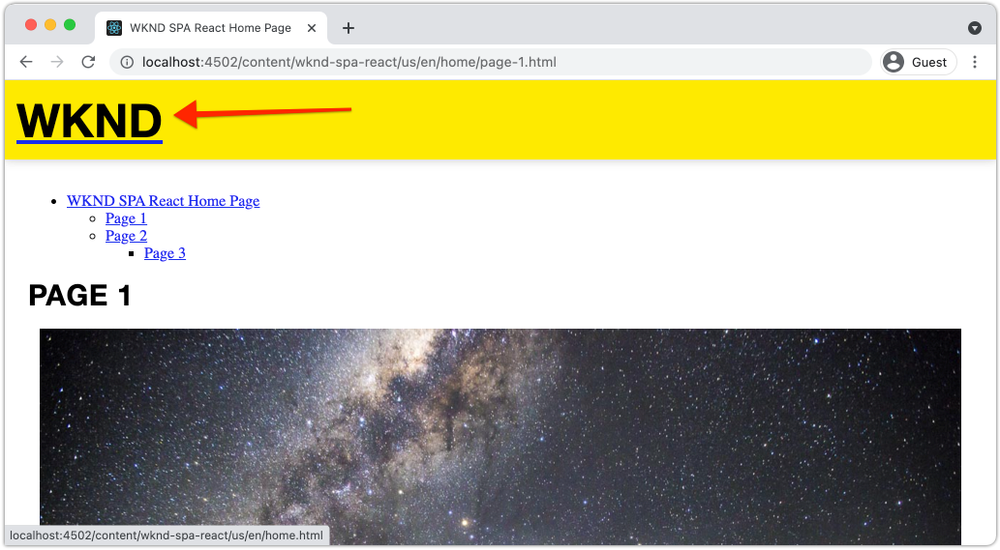

# Hinzufügen von Navigation und Routing {#navigation-routing}

Erfahren Sie, wie mehrere Ansichten im SPA unterstützt werden können, indem Sie sie mit dem SPA Editor SDK AEM Seiten zuordnen. Die dynamische Navigation wird mit React-Router und React-Kernkomponenten implementiert.

## Ziele

1. Machen Sie sich mit den SPA Routing-Optionen vertraut, die bei Verwendung des SPA-Editors verfügbar sind.
1. Erfahren Sie, wie Sie mit [React Router](https://reacttraining.com/react-router/) zwischen verschiedenen Ansichten der SPA navigieren können.
1. Verwenden Sie AEM React-Kernkomponenten, um eine dynamische Navigation zu implementieren, die von der AEM Seitenhierarchie gesteuert wird.

## Was Sie erstellen werden

Dieses Kapitel fügt einem SPA in AEM Navigation hinzu. Das Navigationsmenü wird von der AEM-Seitenhierarchie gesteuert und nutzt das JSON-Modell, das von der [Navigations-Kernkomponente](https://experienceleague.adobe.com/docs/experience-manager-core-components/using/components/navigation.html) bereitgestellt wird.


## Voraussetzungen

Überprüfen Sie die erforderlichen Tools und Anweisungen zum Einrichten einer [lokalen Entwicklungsumgebung](overview.md#local-dev-environment). Dieses Kapitel ist eine Fortsetzung des Kapitels [Zuordnungskomponenten](map-components.md). Um jedoch alles zu befolgen, was Sie benötigen, ist ein SPA-aktiviertes AEM-Projekt, das auf einer lokalen AEM-Instanz bereitgestellt wird.

## Hinzufügen der Navigation zur Vorlage {#add-navigation-template}

1. Öffnen Sie einen Browser und melden Sie sich AEM [http://localhost:4502/](http://localhost:4502/) an. Die Basis für den Startcode sollte bereits bereitgestellt werden.
1. Navigieren Sie zur SPA **Seitenvorlage**: [http://localhost:4502/editor.html/conf/wknd-spa-react/settings/wcm/templates/spa-page-template/structure.html](http://localhost:4502/editor.html/conf/wknd-spa-react/settings/wcm/templates/spa-page-template/structure.html).
1. Wählen Sie den äußersten **Root Layout Container** aus und klicken Sie auf das Symbol **Richtlinie**. Achten Sie darauf, dass **nicht** den **Layout-Container** nicht gesperrt für die Bearbeitung auswählt.

   

1. Erstellen Sie eine neue Richtlinie mit dem Namen **SPA Struktur**:

   

   Wählen Sie unter **Zulässige Komponenten** > **Allgemein** die Komponente **Layout-Container** aus.

   Wählen Sie unter **Zulässige Komponenten** > **WKND SPA REACT - STRUCTURE** > die Komponente **Navigation** aus:

   

   Wählen Sie unter **Zulässige Komponenten** > **WKND SPA REACT - Content** > die Komponenten **Bild** und **Text** aus. Es sollten vier Komponenten ausgewählt sein.

   Klicken Sie auf **Fertig** , um die Änderungen zu speichern.

1. Aktualisieren Sie die Seite und fügen Sie die Komponente **Navigation** über dem nicht gesperrten **Layout-Container** hinzu:

   

1. Wählen Sie die Komponente **Navigation** aus und klicken Sie auf das Symbol **Richtlinie**, um die Richtlinie zu bearbeiten.
1. Erstellen Sie eine neue Richtlinie mit einem **Richtlinientitel** von **SPA Navigation**.

   Unter **Properties**:

   * Setzen Sie den **Navigationsstamm** auf `/content/wknd-spa-react/us/en`.
   * Setzen Sie **Stammebenen ausschließen** auf **1**.
   * Deaktivieren Sie **Sammlung aller untergeordneten Seiten**.
   * Setzen Sie die **Navigationsstrukturtiefe** auf **3**.

   

   Dadurch werden die Navigations-2 Ebenen tief unter `/content/wknd-spa-react/us/en` erfasst.

1. Nachdem Sie Ihre Änderungen gespeichert haben, sollte das ausgefüllte `Navigation` als Teil der Vorlage angezeigt werden:

   

## Untergeordnete Seiten erstellen

Als Nächstes erstellen Sie zusätzliche Seiten in AEM , die als verschiedene Ansichten in der SPA dienen. Wir werden auch die hierarchische Struktur des von AEM bereitgestellten JSON-Modells untersuchen.

1. Navigieren Sie zur Konsole **Sites**: [http://localhost:4502/sites.html/content/wknd-spa-react/us/en/home](http://localhost:4502/sites.html/content/wknd-spa-react/us/en/home). Wählen Sie die **WKND SPA React Home Page** aus und klicken Sie auf **Erstellen** > **Seite**:

   

1. Wählen Sie unter **Vorlage** **SPA Seite** aus. Geben Sie unter **Properties** **Page 1** für **Title** und **page-1** als Namen ein.

   

   Klicken Sie auf **Erstellen** und klicken Sie im Popup-Dialogfeld auf **Öffnen** , um die Seite im AEM SPA Editor zu öffnen.

1. Fügen Sie eine neue Komponente **Text** zum Haupt-Container **Layout-Container** hinzu. Bearbeiten Sie die Komponente und geben Sie den Text ein: **Seite 1** unter Verwendung des RTE und des Elements **H2**.

   

   Sie können zusätzliche Inhalte hinzufügen, wie z. B. ein Bild.

1. Kehren Sie zur AEM Sites-Konsole zurück und wiederholen Sie die obigen Schritte. Erstellen Sie eine zweite Seite mit dem Namen **Seite 2** als Geschwister von **Seite 1**.
1. Erstellen Sie schließlich eine dritte Seite, **Seite 3**, aber als **untergeordnetes Element** von **Seite 2**. Nach Abschluss der Site-Hierarchie sollte wie folgt aussehen:

   

1. Die Navigationskomponente kann jetzt verwendet werden, um zu verschiedenen Bereichen des SPA zu navigieren.

   

1. Öffnen Sie die Seite außerhalb des AEM-Editors: [http://localhost:4502/content/wknd-spa-react/us/en/home.html](http://localhost:4502/content/wknd-spa-react/us/en/home.html). Verwenden Sie die Komponente **Navigation** , um zu verschiedenen Ansichten der App zu navigieren.

1. Verwenden Sie beim Navigieren die Entwicklertools Ihres Browsers, um die Netzwerkanforderungen zu überprüfen. Die folgenden Screenshots werden aus dem Google Chrome-Browser erfasst.

   

   Beachten Sie, dass die nachfolgende Navigation nach dem ersten Laden der Seite nicht zu einer vollständigen Seitenaktualisierung führt und dass der Netzwerk-Traffic bei der Rückkehr zu zuvor besuchten Seiten minimiert wird.

## JSON-Modell für Hierarchieseite {#hierarchy-page-json-model}

Überprüfen Sie anschließend das JSON-Modell, das das mehrdimensionale Erlebnis des SPA steuert.

1. Öffnen Sie in einer neuen Registerkarte die von AEM bereitgestellte JSON-Modell-API: [http://localhost:4502/content/wknd-spa-react/us/en.model.json](http://localhost:4502/content/wknd-spa-react/us/en.model.json). Es kann hilfreich sein, eine Browsererweiterung zu verwenden, um [JSON](https://chrome.google.com/webstore/detail/json-formatter/bcjindcccaagfpapjjmafapmmgkkhgoa) zu formatieren.

   Dieser JSON-Inhalt wird angefordert, wenn die SPA zum ersten Mal geladen wird. Die äußere Struktur sieht wie folgt aus:

   ```json
   {
   "language": "en",
   "title": "en",
   "templateName": "spa-app-template",
   "designPath": "/libs/settings/wcm/designs/default",
   "cssClassNames": "spa page basicpage",
   ":type": "wknd-spa-react/components/spa",
   ":items": {},
   ":itemsOrder": [],
   ":hierarchyType": "page",
   ":path": "/content/wknd-spa-react/us/en",
   ":children": {
      "/content/wknd-spa-react/us/en/home": {},
      "/content/wknd-spa-react/us/en/home/page-1": {},
      "/content/wknd-spa-react/us/en/home/page-2": {},
      "/content/wknd-spa-react/us/en/home/page-2/page-3": {}
      }
   }
   ```

   Unter `:children` sollte für jede der erstellten Seiten ein Eintrag angezeigt werden. Der Inhalt für alle Seiten befindet sich in dieser ersten JSON-Anfrage. Mit dem Navigations-Routing werden nachfolgende Ansichten des SPA schnell geladen, da der Inhalt bereits clientseitig verfügbar ist.

   Es ist nicht ratsam, **ALL** des Inhalts eines SPA in der ersten JSON-Anfrage zu laden, da dies das anfängliche Laden der Seite verlangsamen würde. Als Nächstes wird untersucht, wie die Hierarchietiefe von Seiten erfasst wird.

1. Navigieren Sie zur Vorlage **SPA Stamm** unter: [http://localhost:4502/editor.html/conf/wknd-spa-react/settings/wcm/templates/spa-app-template/structure.html](http://localhost:4502/editor.html/conf/wknd-spa-react/settings/wcm/templates/spa-app-template/structure.html).

   Klicken Sie auf das Menü **Seiteneigenschaften** > **Seitenrichtlinie**:

   

1. Die Vorlage **SPA Stamm** verfügt über eine zusätzliche Registerkarte **Hierarchische Struktur** , um den erfassten JSON-Inhalt zu steuern. Die **Strukturtiefe** bestimmt, wie tief in der Site-Hierarchie untergeordnete Seiten unter **root** erfasst werden. Sie können auch das Feld **Strukturmuster** verwenden, um zusätzliche Seiten basierend auf einem regulären Ausdruck herauszufiltern.

   Aktualisieren Sie die **Strukturtiefe** auf **2**:

   

   Klicken Sie auf **Fertig** , um die Änderungen an der Richtlinie zu speichern.

1. Öffnen Sie das JSON-Modell [http://localhost:4502/content/wknd-spa-react/us/en.model.json](http://localhost:4502/content/wknd-spa-react/us/en.model.json) erneut.

   ```json
   {
   "language": "en",
   "title": "en",
   "templateName": "spa-app-template",
   "designPath": "/libs/settings/wcm/designs/default",
   "cssClassNames": "spa page basicpage",
   ":type": "wknd-spa-react/components/spa",
   ":items": {},
   ":itemsOrder": [],
   ":hierarchyType": "page",
   ":path": "/content/wknd-spa-react/us/en",
   ":children": {
      "/content/wknd-spa-react/us/en/home": {},
      "/content/wknd-spa-react/us/en/home/page-1": {},
      "/content/wknd-spa-react/us/en/home/page-2": {}
      }
   }
   ```

   Beachten Sie, dass der Pfad **Seite 3** entfernt wurde: `/content/wknd-spa-react/us/en/home/page-2/page-3` vom ersten JSON-Modell aus. Dies liegt daran, dass sich **Seite 3** auf einer Ebene 3 in der Hierarchie befindet und wir die Richtlinie so aktualisiert haben, dass sie nur Inhalte mit einer maximalen Tiefe von Ebene 2 enthält.

1. Öffnen Sie die SPA Homepage erneut: [http://localhost:4502/content/wknd-spa-react/us/en/home.html](http://localhost:4502/content/wknd-spa-react/us/en/home.html) und öffnen Sie die Entwicklertools Ihres Browsers.

   Aktualisieren Sie die Seite und Sie sollten die XHR-Anfrage an `/content/wknd-spa-react/us/en.model.json` sehen, die der SPA Stamm ist. Beachten Sie, dass nur drei untergeordnete Seiten enthalten sind, basierend auf der Hierarchietiefenkonfiguration der SPA-Stammvorlage, die zuvor im Tutorial vorgenommen wurde. Dies umfasst nicht **Seite 3**.

   

1. Wenn die Entwicklertools geöffnet sind, verwenden Sie die Komponente `Navigation` , um direkt zu **Seite 3** zu navigieren:

   Beachten Sie, dass eine neue XHR-Anfrage an Folgendes gesendet wird: `/content/wknd-spa-react/us/en/home/page-2/page-3.model.json`

   

   Der AEM Model Manager weiß, dass der JSON-Inhalt von **Seite 3** nicht verfügbar ist, und Trigger automatisch die zusätzliche XHR-Anforderung.

1. Experimentieren Sie mit Deep-Links, indem Sie direkt zu folgenden Elementen navigieren: [http://localhost:4502/content/wknd-spa-react/us/en/home/page-2.html](http://localhost:4502/content/wknd-spa-react/us/en/home/page-2.html). Beachten Sie außerdem, dass die Zurück-Schaltfläche des Browsers weiterhin funktioniert.

## Inspect React Routing  {#react-routing}

Die Navigation und das Routing werden mit [React Router](https://reactrouter.com/) implementiert. React Router sind eine Sammlung von Navigationskomponenten für React-Anwendungen. [AEM React-Kernkomponenten ](https://github.com/adobe/aem-react-core-wcm-components-base) verwenden die Funktionen des React-Routers, um die in den vorherigen Schritten verwendete  **** Navigationskomponente zu implementieren.

Überprüfen Sie anschließend, wie der React-Router mit dem SPA integriert ist, und experimentieren Sie mit der Komponente [Link](https://reactrouter.com/web/api/Link) des React-Routers.

1. Öffnen Sie in der IDE die Datei `index.js` unter `ui.frontend/src/index.js`.

   ```js
   /* index.js */
   import { Router } from 'react-router-dom';
   ...
   ...
    ModelManager.initialize().then(pageModel => {
       const history = createBrowserHistory();
       render(
       <Router history={history}>
           <App
           history={history}
           cqChildren={pageModel[Constants.CHILDREN_PROP]}
           cqItems={pageModel[Constants.ITEMS_PROP]}
           cqItemsOrder={pageModel[Constants.ITEMS_ORDER_PROP]}
           cqPath={pageModel[Constants.PATH_PROP]}
           locationPathname={window.location.pathname}
           />
       </Router>,
       document.getElementById('spa-root')
       );
   });
   ```

   Beachten Sie, dass `App` in die `Router`-Komponente von [React-Router](https://reacttraining.com/react-router/) eingeschlossen ist. Das vom AEM SPA Editor JS SDK bereitgestellte `ModelManager` fügt die dynamischen Routen zu AEM Seiten hinzu, die auf der JSON-Modell-API basieren.

1. Öffnen Sie die Datei `Page.js` unter `ui.frontend/src/components/Page/Page.js`

   ```js
   class AppPage extends Page {
     get containerProps() {
       let attrs = super.containerProps;
       attrs.className =
         (attrs.className || '') + ' page ' + (this.props.cssClassNames || '');
       return attrs;
     }
   }
   
   export default MapTo('wknd-spa-react/components/page')(
     withComponentMappingContext(withRoute(AppPage))
   );
   ```

   Die Komponente `Page` SPA verwendet die Funktion `MapTo`, um **Seiten** in AEM einer entsprechenden SPA-Komponente zuzuordnen. Das Dienstprogramm `withRoute` hilft dabei, die SPA dynamisch zur entsprechenden untergeordneten Seite AEM basierend auf der Eigenschaft `cqPath` weiterzuleiten.

1. Öffnen Sie die Komponente `Header.js` unter `ui.frontend/src/components/Header/Header.js`.
1. Aktualisieren Sie `Header`, um das Tag `<h1>` in einen [Link](https://reactrouter.com/web/api/Link) zur Homepage zu verpacken:

   ```diff
     //Header.js
     import React, {Component} from 'react';
   + import {Link} from 'react-router-dom';
     require('./Header.css');
   
   export default class Header extends Component {
   
       render() {
           return (
               <header className="Header">
               <div className="Header-container">
   +              <Link to="/content/wknd-spa-react/us/en/home.html">
                       <h1>WKND</h1>
   +              </Link>
               </div>
               </header>
           );
       }
   ```

   Statt ein standardmäßiges `<a>` Anker-Tag zu verwenden, verwenden wir `<Link>`, das vom React-Router bereitgestellt wird. Solange das `to=` auf eine gültige Route verweist, wechselt der SPA zu dieser Route und **not** führt eine vollständige Seitenaktualisierung durch. Hier wird einfach der Link zur Startseite hartcodiert, um die Verwendung von `Link` zu veranschaulichen.

1. Aktualisieren Sie den Test bei `App.test.js` unter `ui.frontend/src/App.test.js`.

   ```diff
   + import { BrowserRouter as Router } from 'react-router-dom';
     import App from './App';
   
     it('renders without crashing', () => {
       const div = document.createElement('div');
   -   ReactDOM.render(<App />, div);
   +   ReactDOM.render(<Router><App /></Router>, div);
     });
   ```

   Da wir Funktionen des React-Routers innerhalb einer statischen Komponente verwenden, auf die in `App.js` verwiesen wird, müssen wir den Komponententest entsprechend aktualisieren.

1. Öffnen Sie ein Terminal, navigieren Sie zum Stammverzeichnis des Projekts und stellen Sie das Projekt mithilfe Ihrer Maven-Kenntnisse AEM bereit:

   ```shell
   $ cd aem-guides-wknd-spa.react
   $ mvn clean install -PautoInstallSinglePackage
   ```

1. Navigieren Sie zu einer der Seiten im SPA in AEM: [http://localhost:4502/content/wknd-spa-react/us/en/home/page-1.html](http://localhost:4502/content/wknd-spa-react/us/en/home/page-1.html)

   Verwenden Sie anstelle der `Navigation`-Komponente zum Navigieren den Link in `Header`.

   

   Beachten Sie, dass eine vollständige Seitenaktualisierung **nicht** ausgelöst wird und dass das SPA Routing funktioniert.

1. Experimentieren Sie optional mit der Datei `Header.js` unter Verwendung eines standardmäßigen `<a>` Anker-Tags:

   ```js
   <a href="/content/wknd-spa-react/us/en/home.html">
       <h1>WKND</h1>
   </a>
   ```

   Dies kann den Unterschied zwischen SPA Routing und regulären Web-Seiten-Links veranschaulichen.

## Herzlichen Glückwunsch! {#congratulations}

Herzlichen Glückwunsch! Sie haben erfahren, wie mehrere Ansichten im SPA durch die Zuordnung zu AEM Seiten mit dem SPA Editor SDK unterstützt werden können. Die dynamische Navigation wurde mit dem React-Router implementiert und der Komponente `Header` hinzugefügt.
