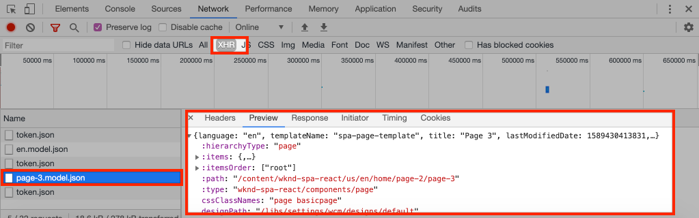

# Hinzufügen von Navigation und Routing {#navigation-routing}

Erfahren Sie, wie mehrere Ansichten in der SPA unterstützt werden können, indem sie mit dem SPA Editor SDK AEM-Seiten zugeordnet werden. Die dynamische Navigation wird mit React Router und React-Kernkomponenten implementiert.

## Ziel

1. Machen Sie sich mit den SPA-Modell-Routing-Optionen vertraut, die bei Verwendung des SPA-Editors verfügbar sind.
1. Lernen Sie die Verwendung von [React Router](https://reacttraining.com/react-router), um zwischen verschiedenen Ansichten der SPA zu navigieren.
1. Verwenden Sie AEM React-Kernkomponenten, um eine dynamische Navigation zu implementieren, die von der AEM-Seitenhierarchie gesteuert wird.

## Was Sie erstellen werden

Dieses Kapitel fügt Navigation zu einer SPA in AEM hinzu. Das Navigationsmenü wird von der AEM-Seitenhierarchie gesteuert und nutzt das JSON-Modell, das von der [Navigations-Kernkomponente](https://experienceleague.adobe.com/docs/experience-manager-core-components/using/wcm-components/navigation.html?lang=de) bereitgestellt wird.


## Voraussetzungen

Vergegenwärtigen Sie sich die erforderlichen Tools und Anweisungen zum Einrichten einer [lokalen Entwicklungsumgebung](overview.md#local-dev-environment). Dieses Kapitel ist eine Fortsetzung des Kapitels [Komponenten zuordnen](map-components.md). Um dem Kapitel folgen zu können, brauchen Sie jedoch nur ein SPA-aktiviertes AEM-Projekt, das in einer lokalen AEM-Instanz bereitgestellt wird.

## Hinzufügen der Navigation zur Vorlage {#add-navigation-template}

1. Öffnen Sie einen Browser und melden Sie sich bei AEM an, [http://localhost:4502/](http://localhost:4502/). Die Code-Basis für den Start sollte bereits bereitgestellt sein.
1. Navigieren Sie zur **SPA-Seitenvorlage**: [http://localhost:4502/editor.html/conf/wknd-spa-react/settings/wcm/templates/spa-page-template/structure.html](http://localhost:4502/editor.html/conf/wknd-spa-react/settings/wcm/templates/spa-page-template/structure.html).
1. Wählen Sie den äußersten **Stamm-Layout-Container** aus und klicken Sie auf das Symbol **Richtlinie**. Achten Sie darauf, dass Sie **nicht** den **Layout-Container** auswählen, der für das Authoring entsperrt ist.

   

1. Erstellen Sie eine neue Richtlinie mit dem Namen **SPA-Struktur**:

   

   Wählen Sie unter **Zugelassene Komponenten** > **Allgemein** > die **Layout-Container**-Komponente aus.

   Wählen Sie unter **Zugelassene Komponenten** > **WKND SPA REACT – STRUKTUR** > die **Navigationskomponente** aus:

   

   Wählen Sie unter **Zugelassene Komponenten** > **WKND SPA REACT – Inhalt** > die **Bild**- und **Text**-Komponenten aus. Es sollten insgesamt vier Komponenten ausgewählt sein.

   Klicken Sie auf **Fertig**, um die Änderungen zu speichern.

1. Aktualisieren Sie die Seite und fügen Sie die **Navigationskomponente** über dem entsperrten **Layout-Container** hinzu:

   

1. Wählen Sie die **Navigationskomponente** aus und klicken Sie auf ihr **Richtliniensymbol**, um die Richtlinie zu bearbeiten.
1. Erstellen Sie eine neue Richtlinie mit dem **Richtliniennamen** **SPA-Navigation**.

   Unter den **Eigenschaften**:

   * Legen Sie den **Navigationsstamm** auf `/content/wknd-spa-react/us/en` fest.
   * Legen Sie für **Stammebenen ausschließen** den Wert **1** fest.
   * Deaktivieren Sie **Alle untergeordneten Seiten erfassen**.
   * Legen Sie die **Navigationsstrukturtiefe** auf den Wert **3** fest.

   

   Dadurch wird die Navigation 2 Ebenen unterhalb von `/content/wknd-spa-react/us/en` erfasst.

1. Nach dem Speichern der Änderungen sollten Sie die befüllte `Navigation` als Teil der Vorlage sehen:

   

## Erstellen untergeordneter Seiten

Als Nächstes erstellen wir zusätzliche Seiten in AEM, die als verschiedene Ansichten in der SPA dienen. Wir werden auch die hierarchische Struktur des von AEM bereitgestellten JSON-Modells untersuchen.

1. Navigieren Sie zur **Sites**-Konsole: [http://localhost:4502/sites.html/content/wknd-spa-react/us/en/home](http://localhost:4502/sites.html/content/wknd-spa-react/us/en/home). Aktivieren Sie das Kontrollkästchen **WKND SPA React Home Page** und klicken Sie auf **Erstellen** > **Seite**:

   

1. Wählen Sie unter **Vorlage** die Option **SPA-Seite** aus. Geben Sie unter **Eigenschaften** den Text **Page 1** als **Titel** und **page-1** als Namen für die erste Seite ein.

   

   Klicken Sie auf **Erstellen** und dann im Dialogfeld-Popup auf **Öffnen**, um die Seite im AEM-SPA-Editor zu öffnen.

1. Fügen Sie eine neue **Text**-Komponente zum **Haupt-Layout-Container** hinzu. Bearbeiten Sie die Komponente und geben Sie den Text **Page 1** mithilfe des RTE und **H2**-Elements ein.

   

   Sie können gerne zusätzliche Inhalte hinzufügen, z. B. ein Bild.

1. Kehren Sie zur AEM Sites-Konsole zurück und wiederholen Sie die oben beschriebenen Schritte. Erstellen Sie dann eine zweite Seite mit dem Namen **Page 2** als gleichgeordnetes Element von **Page 1**.
1. Erstellen Sie abschließend eine dritte Seite, **Page 3**, diese allerdings als **untergeordnetes Element** von **Page 2**. Danach sollte die Website-Hierarchie wie folgt aussehen:

   

1. Die Navigationskomponente kann jetzt verwendet werden, um zu verschiedenen Bereichen der SPA zu navigieren.

   

1. Öffnen Sie die Seite außerhalb des AEM-Editors: [http://localhost:4502/content/wknd-spa-react/us/en/home.html](http://localhost:4502/content/wknd-spa-react/us/en/home.html). Verwenden Sie die **Navigationskomponente**, um zu verschiedenen Ansichten der App zu navigieren.

1. Verwenden Sie beim Navigieren die Entwickler-Tools Ihres Browsers, um die Netzwerkanforderungen zu überprüfen. Die folgenden Screenshots stammen vom Google Chrome-Browser.

   

   Beachten Sie, dass die nachfolgende Navigation nach dem ersten Laden der Seite nicht zu einer vollständigen Seitenaktualisierung führt und dass der Netzwerk-Traffic bei der Rückkehr zu einer zuvor besuchten Seiten minimiert ist.

## JSON-Modell für die Hierarchieseite {#hierarchy-page-json-model}

Überprüfen Sie als Nächstes das JSON-Modell, das die Bereitstellung der unterschiedlichen Ansichten der SPA steuert.

1. Öffnen Sie in einer neuen Registerkarte die von AEM bereitgestellte JSON-Modell-API: [http://localhost:4502/content/wknd-spa-react/us/en.model.json](http://localhost:4502/content/wknd-spa-react/us/en.model.json). Es kann hilfreich sein, eine Browser-Erweiterung zu verwenden, um [JSON zu formatieren](https://chrome.google.com/webstore/detail/json-formatter/bcjindcccaagfpapjjmafapmmgkkhgoa).

   Dieser JSON-Inhalt wird angefordert, wenn die SPA zum ersten Mal geladen wird. Die äußere Struktur sieht wie folgt aus:

   ```json
   {
   "language": "en",
   "title": "en",
   "templateName": "spa-app-template",
   "designPath": "/libs/settings/wcm/designs/default",
   "cssClassNames": "spa page basicpage",
   ":type": "wknd-spa-react/components/spa",
   ":items": {},
   ":itemsOrder": [],
   ":hierarchyType": "page",
   ":path": "/content/wknd-spa-react/us/en",
   ":children": {
      "/content/wknd-spa-react/us/en/home": {},
      "/content/wknd-spa-react/us/en/home/page-1": {},
      "/content/wknd-spa-react/us/en/home/page-2": {},
      "/content/wknd-spa-react/us/en/home/page-2/page-3": {}
      }
   }
   ```

   Unter `:children` sollte für jede der erstellten Seiten ein Eintrag angezeigt werden. Der Inhalt für alle Seiten ist in dieser ersten JSON-Anfrage enthalten. Beim Navigations-Routing werden nachfolgende Ansichten der SPA schnell geladen, da der Inhalt bereits Client-seitig verfügbar ist.

   Es ist nicht ratsam, den **GESAMTEN** Inhalt einer SPA in der ersten JSON-Anfrage zu laden, da dies das erste Laden der Seite verlangsamen würde. Sehen wir uns als Nächstes an, wie die Hierarchietiefe von Seiten erfasst wird.

1. Navigieren Sie zur **SPA-Stammvorlage** unter [http://localhost:4502/editor.html/conf/wknd-spa-react/settings/wcm/templates/spa-app-template/structure.html](http://localhost:4502/editor.html/conf/wknd-spa-react/settings/wcm/templates/spa-app-template/structure.html).

   Klicken Sie auf **Seiteneigenschaften** > **Seitenrichtlinie**:

   

1. Die **SPA-Stammvorlage** weist die zusätzliche Registerkarte **Hierarchische Struktur** für den erfassten JSON-Inhalt auf. Die **Strukturtiefe** bestimmt, wie tief in der Website-Hierarchie untergeordnete Seiten unterhalb des **Stamms** erfasst werden. Sie können auch das Feld **Strukturmuster** verwenden, um zusätzliche Seiten basierend auf einem regulären Ausdruck herauszufiltern.

   Ändern Sie die **Strukturtiefe** in **2**:

   

   Klicken Sie auf **Fertig**, um die Änderungen an der Richtlinie zu speichern.

1. Öffnen Sie erneut das JSON-Modell [http://localhost:4502/content/wknd-spa-react/us/en.model.json](http://localhost:4502/content/wknd-spa-react/us/en.model.json).

   ```json
   {
   "language": "en",
   "title": "en",
   "templateName": "spa-app-template",
   "designPath": "/libs/settings/wcm/designs/default",
   "cssClassNames": "spa page basicpage",
   ":type": "wknd-spa-react/components/spa",
   ":items": {},
   ":itemsOrder": [],
   ":hierarchyType": "page",
   ":path": "/content/wknd-spa-react/us/en",
   ":children": {
      "/content/wknd-spa-react/us/en/home": {},
      "/content/wknd-spa-react/us/en/home/page-1": {},
      "/content/wknd-spa-react/us/en/home/page-2": {}
      }
   }
   ```

   Beachten Sie, dass der Pfad von **Seite 3** aus dem ursprünglichen JSON-Modell entfernt wurde: `/content/wknd-spa-react/us/en/home/page-2/page-3`. Dies liegt daran, dass sich **Seite 3** auf Ebene 3 in der Hierarchie befindet und wir die Richtlinie so aktualisiert haben, dass nur Inhalte mit einer maximalen Tiefe von Ebene 2 berücksichtigt werden.

1. Öffnen Sie die SPA-Homepage [http://localhost:4502/content/wknd-spa-react/us/en/home.html](http://localhost:4502/content/wknd-spa-react/us/en/home.html) erneut und öffnen Sie danach die Entwickler-Tools Ihres Browsers.

   Aktualisieren Sie die Seite. Danach sollten Sie die XHR-Anfrage an `/content/wknd-spa-react/us/en.model.json` sehen. Dies ist der SPA-Stamm. Beachten Sie, dass nur drei untergeordnete Seiten enthalten sind. Dies basiert auf der Hierarchietiefenkonfiguration der SPA-Stammvorlage, die zuvor im Tutorial vorgenommen wurde. Dies umfasst nicht **Seite 3**.

   

1. Verwenden Sie bei geöffneten Entwickler-Tools die `Navigation`-Komponente, um direkt zur **Seite 3** zu gehen:

   Beachten Sie, dass eine neue XHR-Anfrage gesendet wird an: `/content/wknd-spa-react/us/en/home/page-2/page-3.model.json`

   

   AEM Model Manager weiß, dass der JSON-Inhalt der **Seite 3** nicht verfügbar ist, und löst automatisch die zusätzliche XHR-Anfrage aus.

1. Experimentieren Sie mit Deep-Links, indem Sie direkt zu [http://localhost:4502/content/wknd-spa-react/us/en/home/page-2.html](http://localhost:4502/content/wknd-spa-react/us/en/home/page-2.html) navigieren. Beachten Sie außerdem, dass die Zurück-Schaltfläche des Browsers weiterhin funktioniert.

## Prüfen von React-Routing  {#react-routing}

Die Navigation und das Routing werden mit [React Router](https://reactrouter.com/de/main) implementiert. React Router ist eine Sammlung von Navigationskomponenten für React-Apps. Die [AEM React-Kernkomponenten](https://github.com/adobe/aem-react-core-wcm-components-base) verwenden React-Router-Funktionen, um die in den vorherigen Schritten verwendete Komponente **Navigation** zu implementieren.

Überprüfen Sie als Nächstes, wie React Router mit der SPA integriert ist, und experimentieren Sie mit der [Link](https://reactrouter.com/de/main/components/link)-Komponente von React Router.

1. Öffnen Sie in der IDE die Datei `index.js` unter `ui.frontend/src/index.js`.

   ```js
   /* index.js */
   import { Router } from 'react-router-dom';
   ...
   ...
    ModelManager.initialize().then(pageModel => {
       const history = createBrowserHistory();
       render(
       <Router history={history}>
           <App
           history={history}
           cqChildren={pageModel[Constants.CHILDREN_PROP]}
           cqItems={pageModel[Constants.ITEMS_PROP]}
           cqItemsOrder={pageModel[Constants.ITEMS_ORDER_PROP]}
           cqPath={pageModel[Constants.PATH_PROP]}
           locationPathname={window.location.pathname}
           />
       </Router>,
       document.getElementById('spa-root')
       );
   });
   ```

   Beachten Sie, dass `App` in der `Router`-Komponente von [React Router](https://reacttraining.com/react-router) umschlossen ist. Der vom AEM SPA Editor JS SDK bereitgestellte `ModelManager` fügt basierend auf der JSON-Modell-API die dynamischen Routen zu AEM-Seiten hinzu.

1. Öffnen Sie die Datei `Page.js` unter `ui.frontend/src/components/Page/Page.js`

   ```js
   class AppPage extends Page {
     get containerProps() {
       let attrs = super.containerProps;
       attrs.className =
         (attrs.className || '') + ' page ' + (this.props.cssClassNames || '');
       return attrs;
     }
   }
   
   export default MapTo('wknd-spa-react/components/page')(
     withComponentMappingContext(withRoute(AppPage))
   );
   ```

   Die `Page`-SPA-Komponente verwendet die `MapTo`-Funktion, um **Seiten** in AEM einer entsprechenden SPA-Komponente zuzuordnen. Das `withRoute`-Dienstprogramm hilft basierend auf der `cqPath`-Eigenschaft beim dynamischen Routing der SPA zur entsprechenden untergeordneten AEM-Seite.

1. Öffnen Sie die `Header.js`-Komponente unter `ui.frontend/src/components/Header/Header.js`.
1. Aktualisieren Sie die `Header`, um den `<h1>`-Tag in einem [Link](https://reactrouter.com/de/main/components/link) zur Homepage zu umschließen:

   ```diff
     //Header.js
     import React, {Component} from 'react';
   + import {Link} from 'react-router-dom';
     require('./Header.css');
   
   export default class Header extends Component {
   
       render() {
           return (
               <header className="Header">
               <div className="Header-container">
   +              <Link to="/content/wknd-spa-react/us/en/home.html">
                       <h1>WKND</h1>
   +              </Link>
               </div>
               </header>
           );
       }
   ```

   Statt des standardmäßigen Anker-Tags `<a>` verwenden wir `<Link>`, bereitgestellt von React Router. Solange die Variable `to=` auf eine gültige Route verweist, wechselt die SPA zu dieser Route und führt **keine** vollständige Seitenaktualisierung durch. Hier haben wir den Link zur Startseite einfach hartcodiert, um die Verwendung von `Link` zu illustrieren.

1. Aktualisieren Sie den Test bei `App.test.js` unter `ui.frontend/src/App.test.js`.

   ```diff
   + import { BrowserRouter as Router } from 'react-router-dom';
     import App from './App';
   
     it('renders without crashing', () => {
       const div = document.createElement('div');
   -   ReactDOM.render(<App />, div);
   +   ReactDOM.render(<Router><App /></Router>, div);
     });
   ```

   Da wir Funktionen von React Router innerhalb einer statischen Komponente verwenden, auf die in `App.js` verwiesen wird, müssen wir den Modultest aktualisieren, um dies zu berücksichtigen.

1. Öffnen Sie ein Terminal, navigieren Sie zum Stammverzeichnis des Projekts und stellen Sie das Projekt mithilfe von Maven in AEM bereit:

   ```shell
   $ cd aem-guides-wknd-spa.react
   $ mvn clean install -PautoInstallSinglePackage
   ```

1. Navigieren Sie zu einer der Seiten im SPA in AEM: [http://localhost:4502/content/wknd-spa-react/us/en/home/page-1.html](http://localhost:4502/content/wknd-spa-react/us/en/home/page-1.html)

   Statt die `Navigation`-Komponente zur Navigation zu verwenden, verwenden Sie den Link in der `Header`.

   

   Beachten Sie, dass **keine** vollständige Seitenaktualisierung ausgelöst wurde und das SPA-Routing funktioniert.

1. Sie können optional mit der `Header.js`-Datei unter Verwendung eines standardmäßigen `<a>`-Anker-Tags experimentieren:

   ```js
   <a href="/content/wknd-spa-react/us/en/home.html">
       <h1>WKND</h1>
   </a>
   ```

   Dies kann den Unterschied zwischen SPA-Routing und regulären Web-Seiten-Links veranschaulichen.

## Herzlichen Glückwunsch! {#congratulations}

Herzlichen Glückwunsch! Sie wissen jetzt, wie mehrere Ansichten in der SPA durch die Zuordnung zu AEM-Seiten mit dem SPA Editor SDK unterstützt werden können. Die dynamische Navigation wurde mit React Router implementiert und zur `Header`-Komponente hinzugefügt.
