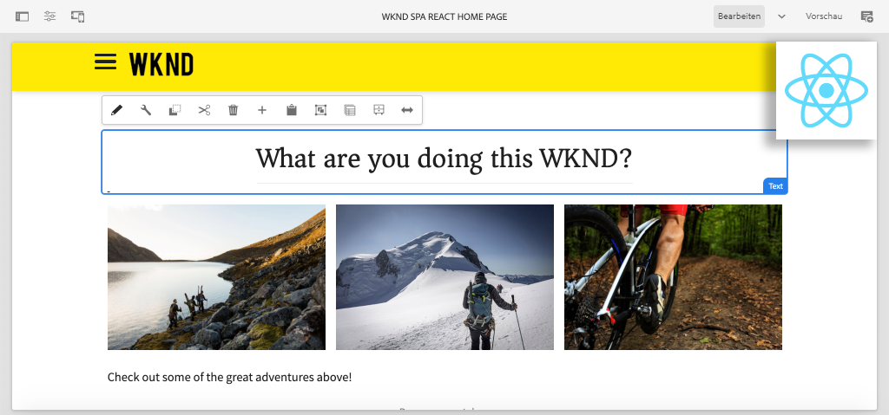

# Erstellen Ihres ersten React-SPA-Projekts in AEM {#overview}

Willkommen bei einem mehrteiligen Tutorial, das für Entwickler entwickelt wurde, die mit der Funktion **SPA Editor** in Adobe Experience Manager (AEM) neu sind. Dieses Tutorial führt Sie durch die Implementierung einer React-Anwendung für eine fiktive Lifestyle-Marke, die WKND. Die React-App wird für die Bereitstellung mit AEM SPA Editor entwickelt, der React-Komponenten AEM Komponenten zuordnet. Die abgeschlossene SPA, die in AEM bereitgestellt wird, kann mit herkömmlichen In-line-Bearbeitungswerkzeugen von AEM dynamisch erstellt werden.

*WKND SPA Implementierung*

## Info

Das Tutorial wurde für die Verwendung mit **AEM als Cloud Service** entwickelt und ist rückwärtskompatibel mit **AEM 6.5.4+** und **AEM 6.4.8+**.

## Neuester Code

Den gesamten Tutorial-Code finden Sie unter [GitHub](https://github.com/adobe/aem-guides-wknd-spa).

Die [neueste Codebasis](https://github.com/adobe/aem-guides-wknd-spa/releases) ist als herunterladbare AEM verfügbar.

## Voraussetzungen

Bevor Sie mit diesem Tutorial beginnen, benötigen Sie Folgendes:

* Grundlegendes zu HTML, CSS und JavaScript
* Grundlegende Vertrautheit mit [React](https://reactjs.org/tutorial/tutorial.html)

*Obwohl dies nicht erforderlich ist, ist es von Vorteil, über ein grundlegendes Verständnis für die  [Entwicklung herkömmlicher AEM Sites-Komponenten](https://experienceleague.adobe.com/docs/experience-manager-learn/getting-started-wknd-tutorial-develop/overview.html) zu verfügen.*

## Lokale Entwicklungsumgebung {#local-dev-environment}

Zum Abschluss dieses Tutorials ist eine lokale Entwicklungsumgebung erforderlich. Screenshots und Videos werden mit dem AEM as a Cloud Service SDK erfasst, das in einer Mac OS-Umgebung mit [Visual Studio Code](https://code.visualstudio.com/) als IDE ausgeführt wird. Befehle und Code sollten unabhängig vom lokalen Betriebssystem sein, sofern nicht anders angegeben.

### Erforderliche Software

* [AEM als Cloud Service-SDK](https://experienceleague.adobe.com/docs/experience-manager-learn/cloud-service/local-development-environment-set-up/aem-runtime.html),  [AEM 6.5.4 ](https://experienceleague.adobe.com/docs/experience-manager-release-information/aem-release-updates/aem-releases-updates.html?lang=en#aem-65) oder  [AEM 6.4.8+](https://experienceleague.adobe.com/docs/experience-manager-release-information/aem-release-updates/aem-releases-updates.html?lang=en#aem-64)
* [Java](https://downloads.experiencecloud.adobe.com/content/software-distribution/en/general.html)
* [Apache Maven](https://maven.apache.org/) (3.3.9 oder höher)
* [Node.](https://nodejs.org/en/) jsand  [npm](https://www.npmjs.com/)

>[!NOTE]
>
> **Neu bei AEM as a Cloud Service?** Sehen Sie sich die  [folgende Anleitung zum Einrichten einer lokalen Entwicklungsumgebung mit dem AEM as a Cloud Service SDK](https://docs.adobe.com/content/help/de-DE/experience-manager-learn/cloud-service/local-development-environment-set-up/overview.html) an.
>
> **Neu bei AEM 6.5?** Sehen Sie sich die  [folgende Anleitung zum Einrichten einer lokalen Entwicklungsumgebung](https://docs.adobe.com/content/help/de-DE/experience-manager-learn/foundation/development/set-up-a-local-aem-development-environment.html) an.

## Nächste Schritte {#next-steps}

Worauf wartest du?! Beginnen Sie das Tutorial, indem Sie zum Kapitel [Projekt erstellen](create-project.md) navigieren und erfahren Sie, wie Sie ein Projekt mit aktiviertem SPA-Editor mithilfe des Projektarchetyps AEM erstellen.
