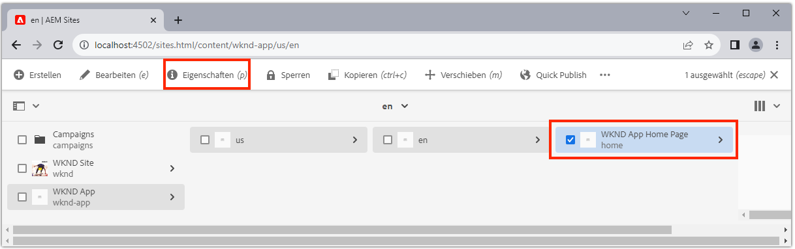
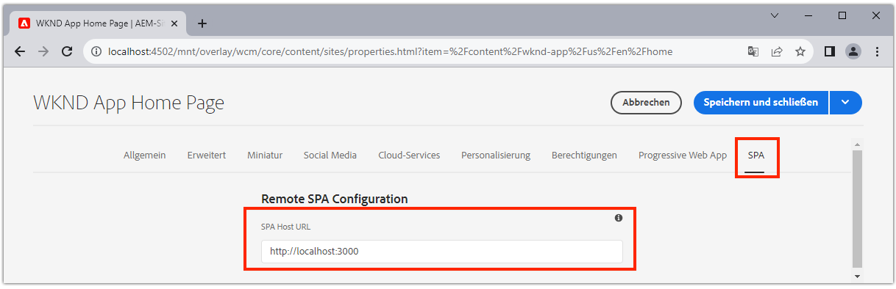

# AEM für SPA Editor konfigurieren

Während die SPA Codebasis außerhalb von AEM verwaltet wird, ist ein AEM Projekt erforderlich, um unterstützende Konfigurations- und Inhaltsanforderungen einzurichten. Dieses Kapitel erläutert die Erstellung eines AEM Projekts, das die erforderlichen Konfigurationen enthält:

+ AEM WCM-Hauptkomponenten-Proxy
+ AEM Remote SPA Page Proxy
+ Vorlagen für Remote-SPA
+ Grundlegende Remote-SPA AEM
+ Teilprojekt zum Definieren von SPA zu AEM URL-Zuordnungen
+ OSGi-Konfigurationsordner

## Erstellen eines AEM Projekts

Erstellen Sie ein AEM Projekt, in dem Konfigurationen und Grundlageninhalte verwaltet werden.

_Verwenden Sie immer die neueste Version des  [AEM Archetyps](https://github.com/adobe/aem-project-archetype)._


```
$ mkdir -p ~/Code/wknd-app
$ cd ~/Code/wknd-app
$ mvn -B archetype:generate \
 -D archetypeGroupId=com.adobe.aem \
 -D archetypeArtifactId=aem-project-archetype \
 -D archetypeVersion=27 \
 -D aemVersion=cloud \
 -D appTitle="WKND App" \
 -D appId="wknd-app" \
 -D groupId="com.adobe.aem.guides.wkndapp" \
 -D frontendModule="react"
$ mv ~/Code/wknd-app/wknd-app ~/Code/wknd-app/com.adobe.aem.guides.wknd-app
```

_Der letzte Befehl benennt den AEM Projektordner einfach um, damit klar ist, dass es das AEM Projekt ist, und nicht zu verwechseln mit Remote SPA__

Wenn `frontendModule="react"` angegeben ist, wird das `ui.frontend`-Projekt nicht für den Remote-SPA verwendet. Die SPA wird extern zu AEM entwickelt und verwaltet und verwendet nur AEM als Inhalts-API. Das `frontendModule="react"`-Flag ist für das Projekt erforderlich, einschließlich der `spa-project` AEM Java™-Abhängigkeiten und Einrichtung der Vorlagen für Remote-SPA.

Der AEM Projektarchiv generiert die folgenden Elemente, die zur Konfiguration der AEM für die Integration mit der SPA verwendet wurden.

+ __AEM WCM-Hauptkomponenten-__ Proxys  `ui.content/src/.../apps/wknd-app/components`
+ __AEM SPA Remote Page__ Proxyat  `ui.content/src/.../apps/wknd-app/components/remotepage`
+ __AEM__ Seitenvorlagen  `ui.content/src/.../conf/wknd-app/settings/wcm/templates`
+ __Unterprojekt zum Definieren von__ Inhaltszuordnungen  `ui.content/src/...`
+ __Grundlegende Remote-SPA AEM__ Seiten  `ui.content/src/.../content/wknd-app`
+ __OSGi-__ Konfigurationsordner  `ui.config/src/.../apps/wknd-app/osgiconfig`

Wenn das AEM Projekt generiert wird, stellen einige Anpassungen SPA Editor-Kompatibilität mit Remote SPA sicher.

## ui.frontend-Projekt entfernen

Da die SPA eine Remote-SPA ist, nehmen Sie an, dass sie außerhalb des AEM Projekts entwickelt und verwaltet wird. Um Konflikte zu vermeiden, entfernen Sie das `ui.frontend`-Projekt aus der Bereitstellung. Wenn das `ui.frontend`-Projekt nicht entfernt wird, werden zwei SPA, die im `ui.frontend`-Projekt bereitgestellten SPA und die Remote SPA gleichzeitig im AEM SPA Editor geladen.

1. Öffnen Sie das AEM Projekt (`~/Code/wknd-app/com.adobe.aem.guides.wknd-app`) in Ihrer IDE
1. Öffnen Sie den Stammordner `pom.xml`
1. Kommentieren Sie `<module>ui.frontend</module` aus der `<modules>`-Liste

   ```
   <modules>
       <module>all</module>
       <module>core</module>
   
       <!-- <module>ui.frontend</module> -->
   
       <module>ui.apps</module>
       <module>ui.apps.structure</module>
       <module>ui.config</module>
       <module>ui.content</module>
       <module>it.tests</module>
       <module>dispatcher</module>
       <module>ui.tests</module>
       <module>analyse</module>
   </modules>
   ```

   Die Datei `pom.xml` sollte wie folgt aussehen:

   

1. Öffnen Sie das `ui.apps/pom.xml`
1. Kommentieren Sie `<dependency>` auf `<artifactId>wknd-app.ui.frontend</artifactId>`

   ```
   <dependencies>
   
       <!-- Remote SPA project will provide all frontend resources
       <dependency>
           <groupId>com.adobe.aem.guides.wkndapp</groupId>
           <artifactId>wknd-app.ui.frontend</artifactId>
           <version>${project.version}</version>
           <type>zip</type>
       </dependency>
       --> 
   </dependencies>
   ```

   Die Datei `ui.apps/pom.xml` sollte wie folgt aussehen:

   

Wenn das AEM Projekt vor diesen Änderungen erstellt wurde, löschen Sie die `ui.frontend` generierte Client-Bibliothek manuell aus dem `ui.apps`-Projekt unter `ui.apps/src/main/content/jcr_root/apps/wknd-app/clientlibs/clientlib-react`.

## AEM Inhaltszuordnung

Damit AEM die Remote-SPA im SPA Editor laden können, müssen Zuordnungen zwischen den SPA Routen und den AEM Seiten, die zum Öffnen und Verfassen von Inhalten verwendet werden, erstellt werden.

Die Bedeutung dieser Konfiguration wird später untersucht.

Die Zuordnung kann mit [Sling-Zuordnung](https://sling.apache.org/documentation/the-sling-engine/mappings-for-resource-resolution.html#root-level-mappings-1) durchgeführt werden, die in `/etc/map` definiert ist.

1. Öffnen Sie in der IDE das Unterprojekt `ui.content`
1. Navigieren Sie zu  `src/main/content/jcr_root/etc`
1. Erstellen von Ordnern `map`
1. Erstellen Sie in `map` einen Ordner `http`
1. Erstellen Sie in `http` eine Datei `.content.xml` mit dem Inhalt:

   ```
   <?xml version="1.0" encoding="UTF-8"?>
   <jcr:root xmlns:sling="http://sling.apache.org/jcr/sling/1.0" xmlns:jcr="http://www.jcp.org/jcr/1.0"
       jcr:primaryType="sling:Mapping">
       <localhost_any/>
   </jcr:root>
   ```

1. Erstellen Sie in `http` einen Ordner `localhost_any`
1. Erstellen Sie in `localhost_any` eine Datei `.content.xml` mit dem Inhalt:

   ```
   <?xml version="1.0" encoding="UTF-8"?>
   <jcr:root xmlns:sling="http://sling.apache.org/jcr/sling/1.0" xmlns:jcr="http://www.jcp.org/jcr/1.0"
       jcr:primaryType="sling:Mapping"
       sling:match="localhost\\.\\d+">
       <wknd-app-routes-adventure/>
   </jcr:root>
   ```

1. Erstellen Sie in `localhost_any` einen Ordner `wknd-app-routes-adventure`
1. Erstellen Sie in `wknd-app-routes-adventure` eine Datei `.content.xml` mit dem Inhalt:

   ```
   <?xml version="1.0" encoding="UTF-8"?>
   
   <!--
   The 'wknd-app-routes-adventure' mapping, maps requests to the SPA's adventure route 
   to it's corresponding page in AEM at /content/wknd-app/us/en/home/adventure/xxx.
   
   Note the adventure AEM pages will be created directly in AEM.
   -->
   
   <jcr:root xmlns:sling="http://sling.apache.org/jcr/sling/1.0" xmlns:jcr="http://www.jcp.org/jcr/1.0"
       jcr:primaryType="sling:Mapping"
       sling:match="adventure:.*/([^/]+)/?$"
       sling:internalRedirect="/content/wknd-app/us/en/home/adventure/$1"/>
   ```

1. hinzufügen Sie die Zuordnungs-Nodes auf `ui.content/src/main/content/META-INF/vault/filter.xml` zu den im AEM Paket enthaltenen Nodes.

   ```
   <?xml version="1.0" encoding="UTF-8"?>
   <workspaceFilter version="1.0">
       <filter root="/conf/wknd-app" mode="merge"/>
       <filter root="/content/wknd-app" mode="merge"/>
       <filter root="/content/dam/wknd-app/asset.jpg" mode="merge"/>
       <filter root="/content/experience-fragments/wknd-app" mode="merge"/>
   
       <!-- Add the Sling Mapping rules for the WKND App -->
       <filter root="/etc/map" mode="merge"/>
   </workspaceFilter>
   ```

Die Ordnerstruktur und `.context.xml`-Dateien sollten wie folgt aussehen:


Die Datei `filter.xml` sollte wie folgt aussehen:


Wenn das AEM Projekt nun bereitgestellt wird, werden diese Konfigurationen automatisch einbezogen.

Die Sling Mapping-Effekte AEM auf `http` und `localhost` ausgeführt, unterstützen also nur die lokale Entwicklung. Bei der Bereitstellung auf AEM als Cloud Service müssen ähnliche Sling-Zuordnungen dieser Zielgruppe `https` und der entsprechenden AEM als Cloud Service-Domänen hinzugefügt werden. Weitere Informationen finden Sie in der Dokumentation [Sling Mapping](https://sling.apache.org/documentation/the-sling-engine/mappings-for-resource-resolution.html).

## Sicherheitsrichtlinien für die gemeinsame Nutzung von Herkünfte

Konfigurieren Sie anschließend AEM, um den Inhalt zu schützen, damit nur dieser SPA auf den AEM zugreifen kann. C Konfigurieren Sie [Cross-Herkunft Resource Sharing in AEM](https://experienceleague.adobe.com/docs/experience-manager-learn/foundation/security/develop-for-cross-origin-resource-sharing.html).

1. Öffnen Sie in Ihrer IDE das Unterprojekt `ui.config` Maven
1. Navigieren `src/main/content/jcr_root/apps/wknd-app/osgiconfig/config`
1. Erstellen Sie eine Datei mit dem Namen `com.adobe.granite.cors.impl.CORSPolicyImpl~wknd-app_remote-spa.cfg.json`
1. Fügen Sie der Datei den folgenden hinzu:

   ```
   {
       "supportscredentials":true,
       "exposedheaders":[
           ""
       ],
       "supportedmethods":[
           "GET",
           "HEAD",
           "POST",
           "OPTIONS"
       ],
       "alloworigin":[
           "https://external-hosted-app", "localhost:3000"
       ],
       "maxage:Integer":1800,
       "alloworiginregexp":[
           ".*"
       ],
       "allowedpaths":[
           ".*"
       ],
       "supportedheaders":[
           "Origin",
           "Accept",
           "X-Requested-With",
           "Content-Type",
           "Access-Control-Request-Method",
           "Access-Control-Request-Headers",
           "Authorization"
       ]
   }
   ```

Die Datei `com.adobe.granite.cors.impl.CORSPolicyImpl~wknd-app_remote-spa.cfg.json` sollte wie folgt aussehen:


Die wichtigsten Konfigurationselemente sind:

+ `alloworigin` gibt an, welche Hosts Inhalte von AEM abrufen dürfen.
   + `localhost:3000` hinzugefügt, um die lokale SPA zu unterstützen
   + `https://external-hosted-app` dient als Platzhalter, der durch die Domäne ersetzt wird, auf der Remote SPA gehostet wird.
+ `allowedpaths` Geben Sie an, welche Pfade in AEM von dieser CORS-Konfiguration abgedeckt werden. Die Standardeinstellung erlaubt den Zugriff auf alle Inhalte in AEM, kann jedoch nur auf die spezifischen Pfade beschränkt werden, auf die die SPA zugreifen können, z. B.: `/content/wknd-app`.

## AEM Seite als Remote-SPA festlegen

Der AEM Project Archetype generiert ein Projekt, das für AEM Integration mit einem Remote-SPA ausgelegt ist, erfordert jedoch eine kleine, aber wichtige Anpassung der automatisch generierten AEM. Der Typ der automatisch erstellten AEM muss in __Remote SPA Seite__ geändert werden, anstatt auf eine __SPA Seite__.

1. Öffnen Sie in Ihrer IDE das Unterprojekt `ui.content`
1. Öffnen auf `src/main/content/jcr_root/content/wknd-app/us/en/home/.content.xml`
1. Diese `.content.xml`-Datei aktualisieren mit:

   ```
   <?xml version="1.0" encoding="UTF-8"?>
   <jcr:root xmlns:sling="http://sling.apache.org/jcr/sling/1.0" xmlns:cq="http://www.day.com/jcr/cq/1.0" xmlns:jcr="http://www.jcp.org/jcr/1.0" xmlns:nt="http://www.jcp.org/jcr/nt/1.0"
           jcr:primaryType="cq:Page">
       <jcr:content
           cq:template="/conf/wknd-app/settings/wcm/templates/spa-remote-page"
           jcr:primaryType="cq:PageContent"
           jcr:title="WKND App Home Page"
           sling:resourceType="wknd-app/components/remotepage">
           <root
               jcr:primaryType="nt:unstructured"
               sling:resourceType="wcm/foundation/components/responsivegrid">
               <responsivegrid
                   jcr:primaryType="nt:unstructured"
                   sling:resourceType="wcm/foundation/components/responsivegrid">
                   <text
                       jcr:primaryType="nt:unstructured"
                       sling:resourceType="wknd-app/components/text"
                       text="&lt;p>Hello World!&lt;/p>"
                       textIsRich="true">
                       <cq:responsive jcr:primaryType="nt:unstructured"/>
                   </text>
               </responsivegrid>
           </root>
       </jcr:content>
   </jcr:root>
   ```

Die wichtigsten Änderungen sind Aktualisierungen der Nodes `jcr:content`:

+ `cq:template` in `/conf/wknd-app/settings/wcm/templates/spa-remote-page`
+ `sling:resourceType` in `wknd-app/components/remotepage`

Die Datei `src/main/content/jcr_root/content/wknd-app/us/en/home/.content.xml` sollte wie folgt aussehen:


Diese Änderungen ermöglichen es dieser Seite, die als SPA Stamm in AEM fungiert, die Remote-SPA in SPA Editor zu laden.

>[!NOTE]
>
>Wenn dieses Projekt zuvor AEM sollte, müssen Sie die AEM Seite mit __Sites > WKND-App > us > en > WKND-App-Startseite__ löschen, da das `ui.content`-Projekt auf __merge__-Knoten anstatt auf __update__ eingestellt ist.

Diese Seite kann auch entfernt und als Remote-SPA in AEM selbst neu erstellt werden. Da diese Seite jedoch automatisch im `ui.content`-Projekt erstellt wird, ist es am besten, sie in der Code-Basis zu aktualisieren.

## Bereitstellen des AEM-Projekts für AEM SDK

1. Stellen Sie sicher, dass der AEM Author-Dienst auf Port 4502 ausgeführt wird.
1. Navigieren Sie in der Befehlszeile zum Stammverzeichnis des AEM Maven-Projekts
1. Verwenden Sie Maven, um das Projekt für Ihren lokalen AEM SDK Authoring-Dienst bereitzustellen.

   ```
   $ mvn clean install -PautoInstallSinglePackage
   ```

   

## Konfigurieren der AEM

Bei der Bereitstellung des AEM-Projekts gibt es einen letzten Schritt, um SPA Editor vorzubereiten, um unsere Remote-SPA zu laden. Markieren Sie AEM die AEM Seite, die dem SPA Stammordner `/content/wknd-app/us/en/home` entspricht, der vom AEM Projektarchiv generiert wurde.

1. Bei AEM Author anmelden
1. Navigieren Sie zu __Sites > WKND-App > us > en__
1. Wählen Sie die __WKND-App-Startseite__ und tippen Sie auf __Eigenschaften__

   

1. Navigieren Sie zur Registerkarte __SPA__
1. Füllen Sie die __Remote SPA Configuration__ aus.
   + __SPA Host-URL__:  `http://localhost:3000`
      + Die URL zum Stamm der Remote-SPA

   

1. Tippen Sie auf __Speichern und Schließen__

Denken Sie daran, dass der Typ dieser Seite in den Typ einer __Remote-SPA__ geändert wurde. So können wir die Registerkarte __SPA__ in den __Seiteneigenschaften__ sehen.

Diese Konfiguration muss nur auf der AEM Seite festgelegt werden, die dem Stamm der SPA entspricht. Alle AEM Seiten unter dieser Seite übernehmen den Wert.

## Herzlichen Glückwunsch

Sie haben jetzt AEM Konfigurationen vorbereitet und sie für Ihren lokalen AEM Autor bereitgestellt! Sie wissen jetzt, wie:

+ Entfernen Sie die AEM Project Archetype-generierte SPA, indem Sie die Abhängigkeiten in `ui.frontend` auskommentieren
+ hinzufügen Sling Mappings zu AEM, die die SPA Routen zu Ressourcen in AEM ordnen
+ Richten Sie AEM Sicherheitsrichtlinien für die Freigabe von Ressourcen für mehrere Herkünfte ein, die es Remote-SPA ermöglichen, Inhalte von AEM zu konsumieren.
+ Bereitstellen des AEM Projekts für den lokalen AEM SDK Author-Dienst
+ Markieren Sie eine AEM als Remote-SPA mit der Eigenschaft SPA Host URL

## Nächste Schritte

Mit AEM Konfiguration können wir uns auf [Bootstrapping des Remote SPA](./spa-bootstrap.md) konzentrieren, mit Unterstützung für bearbeitbare Bereiche mit AEM SPA Editor!