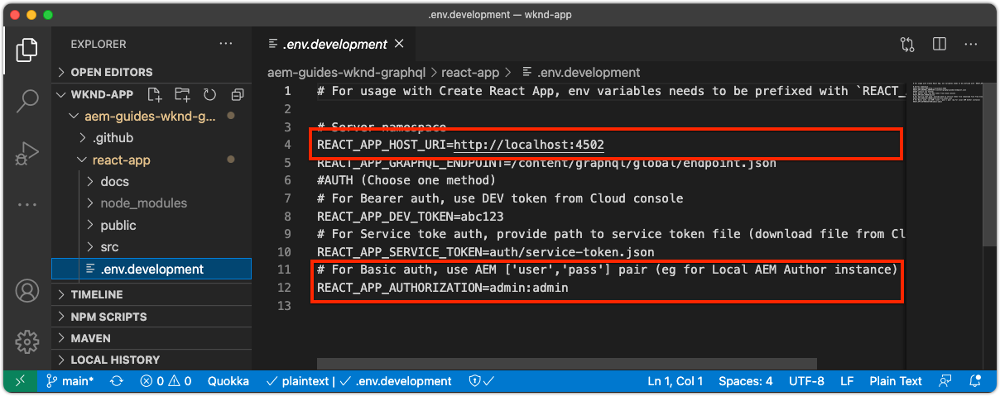
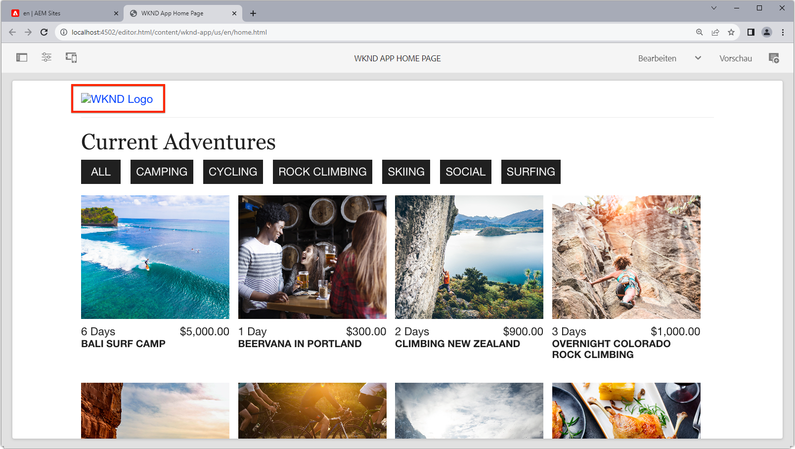
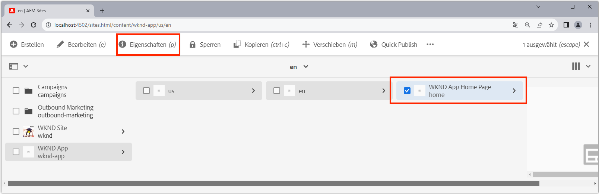
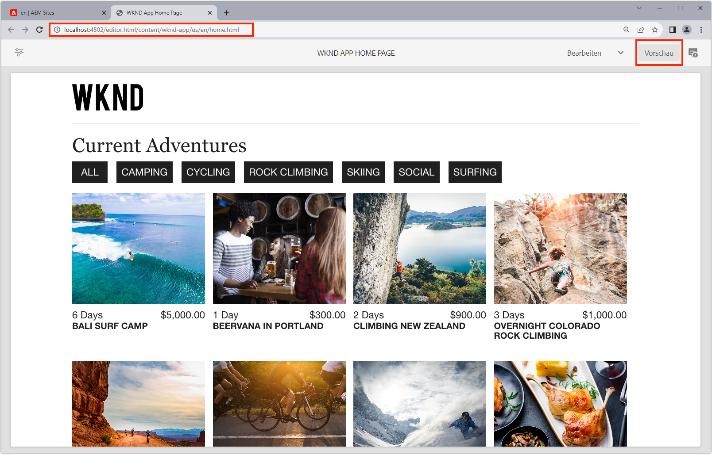

# Bootstrap der Remote-SPA für SPA Editor

Bevor die bearbeitbaren Bereiche der Remote-SPA hinzugefügt werden können, müssen sie mit dem AEM SPA Editor JavaScript SDK und einigen anderen Konfigurationen geboottet werden.

## Abhängigkeiten AEM SPA Editor JS SDK npm

Zuerst fügen Sie AEM npm-Abhängigkeiten zum React-Projekt hinzu.

```
$ cd ~/Code/wknd-app/aem-guides-wknd-graphql/react-app
$ npm install --save \
    @adobe/aem-spa-page-model-manager \
    @adobe/aem-spa-component-mapping \
    @adobe/aem-react-editable-components \
    @adobe/aem-core-components-react-base \
    @adobe/aem-core-components-react-spa
```

+ `@adobe/aem-spa-page-model-manager` stellt die API zum Abrufen von Inhalten aus AEM bereit.
+ `@adobe/aem-spa-component-mapping` stellt die API bereit, die AEM Inhalt SPA Komponenten zuordnet.
+ ` @adobe/aem-react-editable-components` stellt eine API zum Erstellen benutzerdefinierter SPA-Komponenten bereit und stellt gängige Implementierungen wie die  `AEMPage` React-Komponente bereit.
+ `@adobe/aem-core-components-react-base` bietet eine Suite von gebrauchsfertigen React-Komponenten, die nahtlos in die AEM WCM-Kernkomponenten integriert werden können und SPA Editor agnostisch sind. Dazu gehören vor allem Inhaltskomponenten wie:
   + Titel
   + Text
   + Breadcrumb
   + Und so weiter.
+ `@adobe/aem-core-components-react-spa` bietet eine Suite von gebrauchsfertigen React-Komponenten, die nahtlos in die AEM WCM-Kernkomponenten integriert werden können und SPA Editor erfordern. Diese enthalten in erster Linie Komponenten, die Inhaltskomponenten von `@adobe/aem-core-components-react-base` enthalten, z. B.:
   + Container
   + Karussell
   + und so weiter.

## Überprüfen SPA Umgebung

Mehrere Umgebung müssen dem Remote-SPA zur Verfügung stehen, damit er mit AEM interagieren kann.

1. Öffnen Sie das Remote-SPA unter `~/Code/wknd-app/aem-guides-wknd-graphql/react-app` in Ihrer IDE
1. Öffnen Sie die Datei `.env.development`
1. hinzufügen Sie die Datei unter besonderer Berücksichtigung der Schlüssel:

   ```
   REACT_APP_HOST_URI=http://localhost:4502
   REACT_APP_AUTHORIZATION=admin:admin
   ```

   

   *Beachten Sie, dass benutzerspezifische Umgebung in React mit einem Präfix versehen werden müssen  `REACT_APP_`.*

   + `REACT_APP_AEM_URI`: das Schema und den Host des AEM Dienstes, mit dem die Remote SPA verbunden ist.
      + Dieser Wert ändert sich je nachdem, ob die AEM Umgebung (lokal, dev, Stage oder Produktion) und der AEM Diensttyp (Autor vs. Veröffentlichen) geändert werden.
   + `REACT_APP_AEM_AUTH`: die vom SPA verwendeten Anmeldeinformationen zum AEM und Abrufen von Inhalten authentifizieren.
      + Erforderlich für die Verwendung mit AEM Author
      + Möglich erforderlich für die Verwendung mit AEM Publish (wenn Inhalt geschützt ist)
      + Die Entwicklung mit dem AEM SDK unterstützt lokale Konten über Basic Auth. Diese Methode wird in diesem Lernprogramm verwendet.
      + Verwenden Sie bei der Integration mit AEM als Cloud Service [Zugriffstoken](https://experienceleague.adobe.com/docs/experience-manager-learn/getting-started-with-aem-headless/authentication/overview.html)

## ModelManager-API integrieren

Wenn die Abhängigkeiten der AEM SPA npm für die App verfügbar sind, initialisieren Sie AEM `ModelManager` im Projekt `index.js`, bevor `ReactDOM.render(...)` aufgerufen wird.

Der [ModelManager](https://www.npmjs.com/package/@adobe/aem-spa-page-model-manager) ist für die Verbindung mit AEM zum Abrufen bearbeitbarer Inhalte verantwortlich.

1. Öffnen Sie das Remote SPA-Projekt in Ihrer IDE
1. Öffnen Sie die Datei `src/index.js`
1. hinzufügen `ModelManager` importieren und vor dem `ReactDOM.render(..)`-Aufruf initialisieren,

   ```
   ...
   import { ModelManager } from "@adobe/aem-spa-page-model-manager";
   
   // Initialize the ModelManager before invoking ReactDOM.render(...).
   ModelManager.initializeAsync();
   
   ReactDOM.render(...);
   ```

Die Datei `src/index.js` sollte wie folgt aussehen:


## Einrichten eines internen SPA

Wenn Sie bearbeitbare Inhalte aus AEM im SPA beziehen, sollten Sie am besten einen [internen Proxy in SPA](https://create-react-app.dev/docs/proxying-api-requests-in-development/#configuring-the-proxy-manually) einrichten, der so konfiguriert ist, dass die entsprechenden Anforderungen an AEM weitergeleitet werden. Dies geschieht mit dem Modul [http-proxy-middleware](https://www.npmjs.com/package/http-proxy-middleware) npm, das bereits von der Basis-WKND GraphQL App installiert wurde.

1. Öffnen Sie das Remote SPA-Projekt in Ihrer IDE
1. Erstellen einer Datei unter `src/proxy/setupProxy.spa-editor.auth.basic.js`
1. Fügen Sie der Datei den folgenden Code hinzu:

   ```
   const { createProxyMiddleware } = require('http-proxy-middleware');
   const {REACT_APP_HOST_URI, REACT_APP_AUTHORIZATION } = process.env;
   
   /*
       Set up a proxy with AEM for local development
       In a production environment this proxy should be set up at the webserver level or absolute URLs should be used.
   */
   module.exports = function(app) {
   
       /**
       * Filter to check if the request should be re-routed to AEM. The paths to be re-routed at:
       * - Starts with /content (AEM content)
       * - Starts with /graphql (AEM graphQL endpoint)
       * - Ends with .model.json (AEM Content Services)
       * 
       * @param {*} path the path being requested of the SPA
       * @param {*} req the request object
       * @returns true if the SPA request should be re-routed to AEM
       */
       const toAEM = function(path, req) {
           return path.startsWith('/content') || 
               path.startsWith('/graphq') ||
               path.endsWith('.model.json')
       }
   
       /**
       * Re-writes URLs being proxied to AEM such that they can resolve to real AEM resources
       * - The "root" case of `/.model.json` are rewritten to the SPA's home page in AEM
       * - .model.json requests for /adventure:xxx routes are rewritten to their corresponding adventure page under /content/wknd-app/us/en/home/adventure/ 
       * 
       * @param {*} path the path being requested of the SPA
       * @param {*} req the request object
       * @returns returns a re-written path, or nothing to use the @param path
       */
       const pathRewriteToAEM = function (path, req) { 
           if (path === '/.model.json') {
               return '/content/wknd-app/us/en/home.model.json';
           } else if (path.startsWith('/adventure:') && path.endsWith('.model.json')) {
               return '/content/wknd-app/us/en/home/adventure/' + path.split('/').pop();
           }    
       }
   
       /**
       * Register the proxy middleware using the toAEM filter and pathRewriteToAEM rewriter 
       */
       app.use(
           createProxyMiddleware(
               toAEM, // Only route the configured requests to AEM
               {
                   target: REACT_APP_HOST_URI,
                   changeOrigin: true,
                   // Pass in credentials when developing against an Author environment
                   auth: REACT_APP_AUTHORIZATION,
                   pathRewrite: pathRewriteToAEM // Rewrite SPA paths being sent to AEM
               }
           )
       );
   
       /**
       * Enable CORS on requests from the SPA to AEM
       * 
       * If this rule is not in place, CORS errors will occur when running the SPA on http://localhost:3000
       */
       app.use((req, res, next) => {
           res.header("Access-Control-Allow-Origin", REACT_APP_HOST_URI);
           next();
       });
   };
   ```

   Die Datei `setupProxy.spa-editor.auth.basic.js` sollte wie folgt aussehen:

   

   Diese Proxy-Konfiguration hat zwei Hauptaufgaben:

   1. Proxy-spezifische Anforderungen an SPA, `http://localhost:3000` bis AEM `http://localhost:4502`
      + Es werden nur Anforderungen proximiert, deren Pfade mit Mustern übereinstimmen, die angeben, dass sie von AEM bedient werden sollen, wie in `toAEM(path, req)` definiert.
      + Es schreibt SPA Pfade zu den entsprechenden AEM-Seiten neu, wie in `pathRewriteToAEM(path, req)` definiert.
   1. Es fügt allen Anforderungen CORS-Kopfzeilen hinzu, um den Zugriff auf AEM Inhalt zu ermöglichen, wie durch `res.header("Access-Control-Allow-Origin", REACT_APP_HOST_URI);` definiert
      + Wenn dies nicht hinzugefügt wird, treten CORS-Fehler auf, wenn AEM Inhalt in die SPA geladen wird.

1. Öffnen Sie die Datei `src/setupProxy.js`
1. Zeile `const proxy = require('./proxy/setupProxy.auth.basic')` kommentieren
1. hinzufügen eine Zeile, die auf die neue Proxykonfigurationsdatei verweist:

   ```
   // Proxy configuration for SPA Editor (and GraphQL) using Basic Auth
   const proxy = require('./proxy/setupProxy.spa-editor.auth.basic')
   ```

   Die Datei `setupProxy.js` sollte wie folgt aussehen:

   

Beachten Sie, dass alle Änderungen an den `src/setupProxy.js`- oder den referenzierten Dateien einen Neustart des SPA erfordern.

## Statische SPA

Statische SPA wie das WKND-Logo und das Laden von Grafiken müssen ihre src-URLs aktualisieren, damit sie vom Remote-SPA geladen werden. Wenn der SPA relativ bleibt und zum Authoring in SPA Editor geladen wird, verwenden diese URLs standardmäßig AEM Host und nicht den SPA, was zu 404 Anforderungen führt, wie in der Abbildung unten dargestellt.



Um dieses Problem zu beheben, stellen Sie sicher, dass eine statische Ressource, die vom Remote-SPA gehostet wird, absolute Pfade verwendet, die die Remote-SPA-Herkunft enthalten.

1. Öffnen Sie das SPA in Ihrer IDE
1. Öffnen Sie die SPA-Variablendatei `src/.env.development` und fügen Sie eine Variable für den SPA öffentlichen URI hinzu:

   ```
   ...
   # The base URI the SPA is accessed from
   REACT_APP_PUBLIC_URI=http://localhost:3000
   ```

   _Bei der Bereitstellung auf AEM als Cloud Service müssen Sie dasselbe für die entsprechenden  `.env` Dateien tun._

1. Öffnen Sie die Datei `src/App.js`
1. SPA öffentlichen URI aus den Variablen SPA Umgebung importieren

   ```
   const {  REACT_APP_PUBLIC_URI } = process.env;
   
   function App() { ... }
   ```

1. Präfix des WKND-Logos `` mit `REACT_APP_PUBLIC_URI`, um die Auflösung gegen die SPA zu erzwingen.

   ```
   
   ```

1. Dasselbe gilt für das Laden von Bildern in `src/components/Loading.js`

   ```
   const { REACT_APP_PUBLIC_URI } = process.env;
   
   class Loading extends Component {
   
       render() {
           return (<div className="loading">
               
           </div>);
       }
   }
   ```

1. ... und für die __zwei Instanzen__ der Zurück-Taste in `src/components/AdventureDetails.js`

   ```
   const { REACT_APP_PUBLIC_URI } = process.env;
   
   function AdventureDetail(props) {
       ...
       render() {
           
       }
   }
   ```

Die Dateien `App.js`, `Loading.js` und `AdventureDetails.js` sollten wie folgt aussehen:


## AEM Responsive Grid

Zur Unterstützung SPA Layout-Modus des Editors für bearbeitbare Bereiche in der SPA müssen AEM Responsive Grid CSS in die SPA integriert werden. Machen Sie sich keine Gedanken - dieses Rastersystem wird nur zu den bearbeitbaren Containern, und Sie können Ihr Rastersystem Ihrer Wahl verwenden, um das Layout des restlichen SPA.

hinzufügen Sie die AEM Responsive Grid SCSS-Dateien an die SPA.

1. Öffnen Sie das SPA in Ihrer IDE
1. Laden Sie die folgenden beiden Dateien herunter und kopieren Sie sie in `src/styles`
   + [_grid.scss](./assets/spa-bootstrap/_grid.scss)
      + Der AEM Responsive Grid SCSS-Generator
   + [_grid-init.scss](./assets/spa-bootstrap/_grid.scss)
      + Ruft `_grid.scss` mithilfe der SPA spezifischen Haltepunkte (Desktop und Mobil) und Spalten (12) auf.
1. Öffnen Sie `src/App.scss` und importieren Sie `./styles/grid-init.scss`

   ```
   ...
   @import './styles/grid-init';
   ...
   ```

Die Dateien `_grid.scss` und `_grid-init.scss` sollten wie folgt aussehen:


Die SPA enthält jetzt das CSS, das zur Unterstützung AEM Layoutmodus für Komponenten erforderlich ist, die einem AEM Container hinzugefügt werden.

## Beginn der SPA

Nun, da die SPA für die Integration mit AEM bootstrappert ist, lassen Sie uns die SPA laufen und sehen, wie es aussieht!

1. Navigieren Sie in der Befehlszeile zum Stammverzeichnis des SPA Projekts
1. Beginn der SPA mit den normalen Befehlen (führen Sie `npm install` aus, wenn Sie noch nicht über die Befehlsfolge verfügen)

   ```
   $ cd ~/Code/wknd-app/aem-guides-wknd-graphql/react-app
   $ npm install 
   $ npm run start
   ```

1. Durchsuchen Sie die SPA unter [http://localhost:3000](http://localhost:3000). Alles sollte gut aussehen!


## Öffnen Sie die SPA im AEM SPA Editor

Wenn die SPA auf [http://localhost:3000](http://localhost:3000) ausgeführt wird, öffnen wir sie mit AEM SPA Editor. Im SPA ist noch nichts bearbeitbar, dies validiert nur die SPA in AEM.

1. Bei AEM Author anmelden
1. Navigieren Sie zu __Sites > WKND-App > us > en__
1. Wählen Sie die __WKND App-Startseite__ und tippen Sie auf __Bearbeiten__, und das SPA wird angezeigt.

   

1. Wechseln Sie mit dem Modusumschalter oben rechts zu __Vorschau__
1. Klicken Sie um die SPA

   

## Herzlichen Glückwunsch!

Sie haben die Remote SPA Bootstrapping für AEM SPA Editor kompatibel! Sie wissen jetzt, wie:

+ hinzufügen Abhängigkeiten des AEM SPA Editor JS SDK zum SPA Projekt
+ SPA Umgebung konfigurieren
+ Integrieren Sie die ModelManager-API mit der SPA
+ Richten Sie einen internen Proxy für die SPA ein, damit die entsprechenden Inhaltsanforderungen an AEM weitergeleitet werden
+ Beheben von Problemen mit statischen SPA im Kontext des SPA-Editors
+ hinzufügen AEM Responsive Grid CSS zur Unterstützung des Layouts in AEM bearbeitbaren Containern

## Nächste Schritte

Jetzt, da wir eine Grundlinie der Kompatibilität mit AEM SPA Editor erreicht haben, können wir Beginn machen, bearbeitbare Bereiche einzuführen. Wir werden uns zuerst ansehen, wie eine [feste bearbeitbare Komponente](./spa-fixed-component.md) in die SPA platziert wird.
