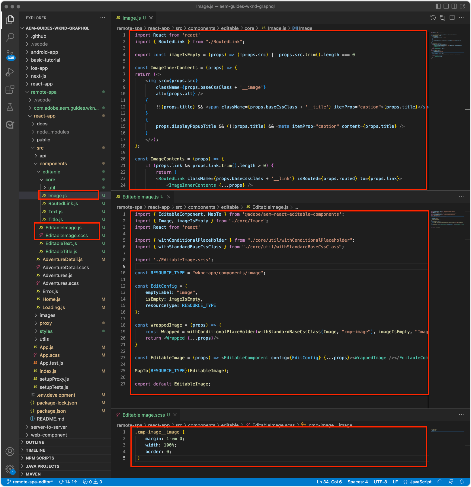

# Bearbeitbare Container-Komponenten

[Feste Komponenten](./spa-fixed-component.md) bieten eine gewisse Flexibilität beim Erstellen von SPA-Inhalten. Dieser Ansatz ist jedoch starr und erfordert, dass Entwicklerinnen und Entwickler die genaue Komposition des bearbeitbaren Inhalts definieren. Um die Erstellung außergewöhnlicher Erlebnisse durch Autorinnen und Autoren zu unterstützen, unterstützt der SPA-Editor die Verwendung von Container-Komponenten in der SPA. Container-Komponenten ermöglichen es Autorinnen und Autoren, zulässige Komponenten per Drag-and-Drop in den Container zu ziehen und sie wie beim herkömmlichen Verfassen in AEM Sites zu erstellen.


In diesem Kapitel fügen wir der Startansicht einen bearbeitbaren Container hinzu, der es Autorinnen und Autoren ermöglicht, Rich-Content-Erlebnisse mit bearbeitbaren React-Komponenten direkt in der SPA zu erstellen und anzuordnen.

## Aktualisieren der WKND-App

So fügen Sie eine Container-Komponente zur Startansicht hinzu:

+ Importieren Sie die `ResponsiveGrid`-Komponente der AEM React Editable-Komponente
+ Importieren und registrieren Sie benutzerdefinierte, bearbeitbare React-Komponenten (Text und Bild) für die Verwendung in der ResponsiveGrid-Komponente

### Verwenden der ResponsiveGrid-Komponente

So fügen Sie einen bearbeitbaren Bereich zur Startansicht hinzu:

1. Öffnen und bearbeiten Sie `react-app/src/components/Home.js`
1. Importieren Sie die `ResponsiveGrid`-Komponente aus `@adobe/aem-react-editable-components` und fügen Sie sie zur `Home`-Komponente hinzu.
1. Legen Sie die folgenden Attribute für die `<ResponsiveGrid...>`-Komponente fest.
   + `pagePath = '/content/wknd-app/us/en/home'`
   + `itemPath = 'root/responsivegrid'`

   Hierdurch wird die `ResponsiveGrid`-Komponente angewiesen, ihren Inhalt aus der AEM-Ressource abzurufen:

   + `/content/wknd-app/us/en/home/jcr:content/root/responsivegrid`

   `itemPath` ist dem Knoten `responsivegrid` zugeordnet, der in der AEM-Vorlage `Remote SPA Page` definiert ist, und wird automatisch auf neuen, auf Grundlage der AEM-Vorlage `Remote SPA Page` generierten AEM-Seiten erstellt.

   Aktualisieren Sie `Home.js`, um die `<ResponsiveGrid...>`-Komponente hinzuzufügen.

   ```javascript
   ...
   import { ResponsiveGrid } from '@adobe/aem-react-editable-components';
   ...
   
   function Home() {
       return (
           <div className="Home">
               <ResponsiveGrid
                   pagePath='/content/wknd-app/us/en/home' 
                   itemPath='root/responsivegrid'/>
   
               <EditableTitle
                   pagePath='/content/wknd-app/us/en/home' 
                   itemPath='title'/>
   
               <Adventures />
           </div>
       );
   }
   ```

Die Datei `Home.js` sollte wie folgt aussehen:


## Erstellen bearbeitbarer Komponenten

Um die volle Wirkung des flexiblen Authoring-Erlebnisses zu erzielen, das Container im SPA -Editor bieten, haben wir bereits eine bearbeitbare Titelkomponente erstellt. Erstellen wir nun aber noch ein paar weitere Komponenten, die es Autorinnen und Autoren ermöglichen, bearbeitbare Text- und Bildkomponenten in der neu hinzugefügten ResponsiveGrid-Komponente zu verwenden.

Die neuen bearbeitbaren React-Komponenten für Text und Bild werden mit dem in [bearbeitbaren festen Komponenten](./spa-fixed-component.md) bereitgestellten Definitionsmuster der bearbeitbaren Komponente erstellt.

### Bearbeitbare Textkomponente

1. Öffnen Sie das SPA-Projekt in Ihrer IDE.
1. Erstellen Sie eine React-Komponente unter `src/components/editable/core/Text.js`.
1. Fügen Sie den folgenden Code zu `Text.js` hinzu.

   ```javascript
   import React from 'react'
   
   const TextPlain = (props) => <div className={props.baseCssClass}><p className="cmp-text__paragraph">{props.text}</p></div>;
   const TextRich = (props) => {
   const text = props.text;
   const id = (props.id) ? props.id : (props.cqPath ? props.cqPath.substr(props.cqPath.lastIndexOf('/') + 1) : "");
       return <div className={props.baseCssClass} id={id} data-rte-editelement dangerouslySetInnerHTML={{ __html: text }} />
   };
   
   export const Text = (props) => {
       if (!props.baseCssClass) {
           props.baseCssClass = 'cmp-text'
       }
   
       const { richText = false } = props
   
       return richText ? <TextRich {...props} /> : <TextPlain {...props} />
       }
   
       export function textIsEmpty(props) {
       return props.text == null || props.text.length === 0;
   }
   ```

1. Erstellen Sie eine bearbeitbare React-Komponente unter `src/components/editable/EditableText.js`.
1. Fügen Sie den folgenden Code zu `EditableText.js` hinzu.

   ```javascript
   import React from 'react'
   import { EditableComponent, MapTo } from '@adobe/aem-react-editable-components';
   import { Text, textIsEmpty } from "./core/Text";
   import { withConditionalPlaceHolder } from "./core/util/withConditionalPlaceholder";
   import { withStandardBaseCssClass } from "./core/util/withStandardBaseCssClass";
   
   const RESOURCE_TYPE = "wknd-app/components/text";
   
   const EditConfig = {
       emptyLabel: "Text",
       isEmpty: textIsEmpty,
       resourceType: RESOURCE_TYPE
   };
   
   export const WrappedText = (props) => {
       const Wrapped = withConditionalPlaceHolder(withStandardBaseCssClass(Text, "cmp-text"), textIsEmpty, "Text V2")
       return <Wrapped {...props} />
   };
   
   const EditableText = (props) => <EditableComponent config={EditConfig} {...props}><WrappedText /></EditableComponent>
   
   MapTo(RESOURCE_TYPE)(EditableText);
   
   export default EditableText;
   ```

Die Implementierung der bearbeitbaren Textkomponente sollte wie folgt aussehen:


### Bildkomponente

1. Öffnen Sie das SPA-Projekt in Ihrer IDE.
1. Erstellen Sie eine React-Komponente unter `src/components/editable/core/Image.js`.
1. Fügen Sie den folgenden Code zu `Image.js` hinzu.

   ```javascript
   import React from 'react'
   import { RoutedLink } from "./RoutedLink";
   
   export const imageIsEmpty = (props) => (!props.src) || props.src.trim().length === 0
   
   const ImageInnerContents = (props) => {
   return (<>
       
       {
           !!(props.title) && <span className={props.baseCssClass + '__title'} itemProp="caption">{props.title}</span>
       }
       {
           props.displayPopupTitle && (!!props.title) && <meta itemProp="caption" content={props.title} />
       }
       </>);
   };
   
   const ImageContents = (props) => {
       if (props.link && props.link.trim().length > 0) {
           return (
           <RoutedLink className={props.baseCssClass + '__link'} isRouted={props.routed} to={props.link}>
               <ImageInnerContents {...props} />
           </RoutedLink>
           )
       }
       return <ImageInnerContents {...props} />
   };
   
   export const Image = (props) => {
       if (!props.baseCssClass) {
           props.baseCssClass = 'cmp-image'
       }
   
       const { isInEditor = false } = props;
       const cssClassName = (isInEditor) ? props.baseCssClass + ' cq-dd-image' : props.baseCssClass;
   
       return (
           <div className={cssClassName}>
               <ImageContents {...props} />
           </div>
       )
   };
   ```

1. Erstellen Sie eine bearbeitbare React-Komponente unter `src/components/editable/EditableImage.js`.
1. Fügen Sie den folgenden Code zu `EditableImage.js` hinzu.

```javascript
import { EditableComponent, MapTo } from '@adobe/aem-react-editable-components';
import { Image, imageIsEmpty } from "./core/Image";
import React from 'react'

import { withConditionalPlaceHolder } from "./core/util/withConditionalPlaceholder";
import { withStandardBaseCssClass } from "./core/util/withStandardBaseCssClass";

const RESOURCE_TYPE = "wknd-app/components/image";

const EditConfig = {
    emptyLabel: "Image",
    isEmpty: imageIsEmpty,
    resourceType: RESOURCE_TYPE
};

const WrappedImage = (props) => {
    const Wrapped = withConditionalPlaceHolder(withStandardBaseCssClass(Image, "cmp-image"), imageIsEmpty, "Image V2");
    return <Wrapped {...props}/>
}

const EditableImage = (props) => <EditableComponent config={EditConfig} {...props}><WrappedImage /></EditableComponent>

MapTo(RESOURCE_TYPE)(EditableImage);

export default EditableImage;
```


1. Erstellen Sie eine SCSS-Datei `src/components/editable/EditableImage.scss`, die benutzerdefinierte Stile für `EditableImage.scss` bereitstellt. Diese Stile zielen auf die CSS-Klassen der bearbeitbaren React-Komponente ab.
1. Fügen Sie das folgende SCSS zu `EditableImage.scss` hinzu.

   ```css
   .cmp-image__image {
       margin: 1rem 0;
       width: 100%;
       border: 0;
    }
   ```

1. Importieren Sie `EditableImage.scss` in `EditableImage.js`.

   ```javascript
   ...
   import './EditableImage.scss';
   ...
   ```

Die Implementierung der bearbeitbaren Bildkomponente sollte wie folgt aussehen:




### Importieren der bearbeitbaren Komponenten

Auf die neu erstellten React-Komponenten `EditableText` und `EditableImage` wird in der SPA verwiesen. Sie werden basierend auf der AEM-JSON-Rückgabe dynamisch instanziiert. Um sicherzustellen, dass diese Komponenten für die SPA verfügbar sind, erstellen Sie Importanweisungen für sie in `Home.js`.

1. Öffnen Sie das SPA-Projekt in Ihrer IDE.
1. Öffnen Sie die Datei `src/Home.js`
1. Fügen Sie Importanweisungen für `AEMText` und `AEMImage` hinzu.

   ```javascript
   ...
   // The following need to be imported, so that MapTo is run for the components
   import EditableText from './editable/EditableText';
   import EditableImage from './editable/EditableImage';
   ...
   ```

Das Ergebnis sollte dann wie folgt aussehen:


Wenn diese Importe _nicht_ hinzugefügt werden, wird der `EditableText`- und `EditableImage`-Code nicht von SPA aufgerufen, und somit werden die Komponenten nicht auf die bereitgestellten Ressourcentypen abgebildet.

## Konfigurieren des Containers in AEM

AEM Container-Komponenten verwenden Richtlinien, um ihre zulässigen Komponenten anzugeben. Dies ist eine kritische Konfiguration bei der Verwendung des SPA-Editors, da nur AEM-Komponenten, die einem entsprechenden SPA-Komponentenmapping zugeordnet sind, vom SPA gerendert werden können. Stellen Sie sicher, dass nur die Komponenten zulässig sind, für die wir SPA-Implementierungen bereitgestellt haben:

+ `EditableTitle` zugeordnet zu `wknd-app/components/title`
+ `EditableText` zugeordnet zu `wknd-app/components/text`
+ `EditableImage` zugeordnet zu `wknd-app/components/image`

So konfigurieren Sie den responsiven Raster-Container der Remote-SPA-Seitenvorlage:

1. Melden Sie sich bei AEM Author an
1. Navigieren Sie zu __Tools > Allgemein > Vorlagen > WKND-App__
1. Bearbeiten des __SPA-Seitenberichts__

   

1. Wählen Sie __Struktur__ im Modusschalter oben rechts
1. Tippen Sie, um den __Layout-Container__ auszuwählen.
1. Tippen Sie auf das Symbol __Richtlinie__ in der Popup-Leiste

   

1. Erweitern Sie auf der rechten Seite unter der Registerkarte __Erlaubte Komponenten__ die Option __WKND APP – CONTENT__.
1. Stellen Sie sicher, dass nur Folgendes ausgewählt ist:
   + Bild
   + Text
   + Titel

   

1. Tippen Sie auf __Fertig__

## Authoring des Containers in AEM

Nach der Aktualisierung der SPA zum Einbetten von `<ResponsiveGrid...>`, Wrappers für drei bearbeitbare React-Komponenten (`EditableTitle`, `EditableText` und `EditableImage`) sowie nach der Aktualisierung von AEM mit einer übereinstimmenden Vorlagenrichtlinie, können wir damit beginnen, Inhalte in der Container-Komponente zu erstellen.

1. Melden Sie sich bei AEM Author an
1. Navigieren Sie zu __Sites > WKND App__
1. Tippen Sie auf __Startseite__ und wählen Sie __Bearbeiten__ in der oberen Aktionsleiste.
   + Eine „Hello World“-Textkomponente wird angezeigt, da diese beim Generieren des Projekts aus dem AEM-Projektarchetyp automatisch hinzugefügt wurde.
1. Wählen Sie __Bearbeiten__ aus der Modusauswahl oben rechts im Seiteneditor.
1. Suchen Sie den bearbeitbaren Bereich __Layout-Container__ unter dem Titel.
1. Öffnen Sie die __Seitenleiste des Seiteneditors__ und wählen Sie die __Komponentenansicht__
1. Ziehen Sie die folgenden Komponenten in den __Layout-Container__
   + Bild
   + Titel
1. Ziehen Sie die Komponenten in die folgende Reihenfolge, um sie neu anzuordnen:
   1. Titel
   1. Bild
   1. Text
1. __Erstellen__ Sie die __Titelkomponente__
   1. Tippen Sie auf die Titelkomponente und dann auf das __Schraubenschlüssel__-Symbol, um die Titelkomponente zu __bearbeiten__
   1. Fügen Sie den folgenden Text hinzu:
      + Titel: __Der Sommer kommt, lassen Sie uns das Beste daraus machen!__
      + Typ: __H1__
   1. Tippen Sie auf __Fertig__
1. __Erstellen__ Sie die __Bildkomponente__
   1. Ziehen Sie ein Bild aus der Seitenleiste (nach dem Wechsel zur Asset-Ansicht) auf die Bildkomponente
   1. Tippen Sie auf die Bildkomponente und tippen Sie auf das __Schraubenschlüssel__-Symbol, um es zu bearbeiten
   1. Aktivieren Sie das Kontrollkästchen __Bild ist dekorativ__
   1. Tippen Sie auf __Fertig__
1. __Erstellen__ Sie die __Textkomponente__
   1. Bearbeiten Sie die Textkomponente, indem Sie auf die Textkomponente und dann auf das __Schraubenschlüssel__-Symbol tippen.
   1. Fügen Sie den folgenden Text hinzu:
      + _Aktuell erhalten Sie 15 % Rabatt auf alle 1-wöchigen Adventures und 20 % Rabatt auf alle Adventures, die 2 Wochen oder länger dauern! Fügen Sie an der Kasse den Kampagnen-Code SUMMERISCOMING hinzu, um die Rabatte zu erhalten._
   1. Tippen Sie auf __Fertig__

1. Ihre Komponenten werden jetzt erstellt, sind aber vertikal gestapelt.

   

Verwenden Sie den AEM-Layout-Modus, um die Größe und das Layout der Komponenten anzupassen.

1. Wechseln Sie über die Modusauswahl oben rechts in den __Layout-Modus__.
1. __Ändern Sie die Größe__ der Bild- und Textkomponenten so, dass sie nebeneinander angeordnet sind.
   + Die __Bildkomponente__ sollte __8 Spalten breit__ sein.
   + Die __Textkomponente__ sollte __3 Spalten breit__ sein.

   

1. Zeigen Sie Ihre Änderungen im AEM-Seiten-Editor in einer __Vorschau__ an.
1. Aktualisieren Sie die WKND-App, die lokal auf [http://localhost:3000](http://localhost:3000) ausgeführt wird, um die erstellten Änderungen zu sehen.

   


## Herzlichen Glückwunsch!

Sie haben eine Container-Komponente hinzugefügt, mit der Autorinnen und Autoren bearbeitbare Komponenten zur WKND-App hinzufügen können. Sie wissen jetzt, wie man Folgendes tut:

+ Verwenden der AEM React Editable-Komponente `ResponsiveGrid` in der SPA.
+ Erstellen und Registrieren bearbeitbarer React-Komponenten (Text und Bild) zur Verwendung in der SPA über die Container-Komponente.
+ Konfigurieren der Remote-SPA-Seitenvorlage, um die SPA-aktivierten Komponenten zuzulassen.
+ Hinzufügen bearbeitbarer Komponenten zur Container-Komponente.
+ Erstellen und Anordnen von Komponenten im SPA-Editor.

## Nächste Schritte

Im nächsten Schritt wird dieselbe Technik zum [Hinzufügen einer bearbeitbaren Komponente zu einer Adventure-Details-Route](./spa-dynamic-routes.md) in der SPA verwendet.
