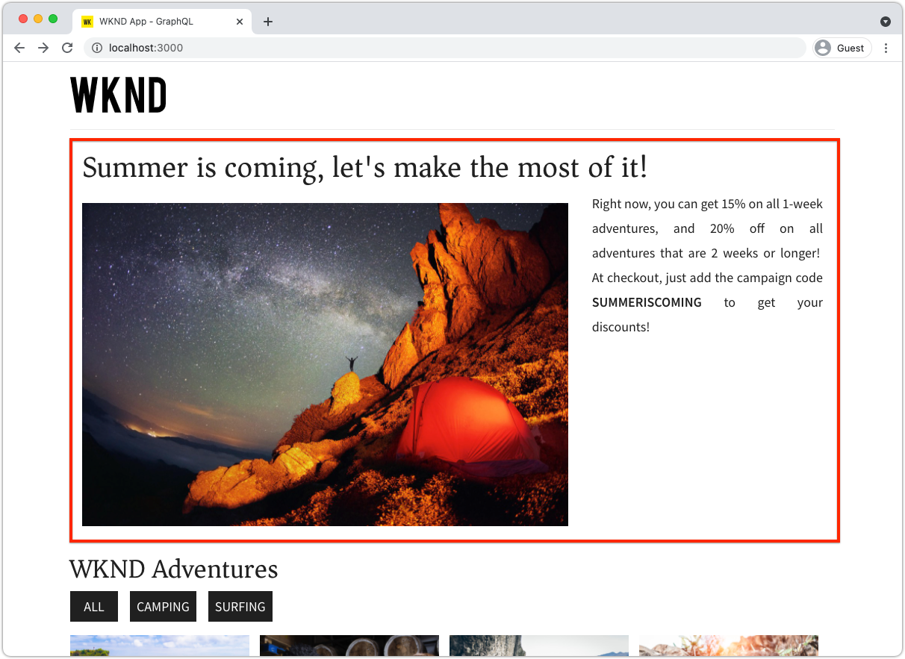
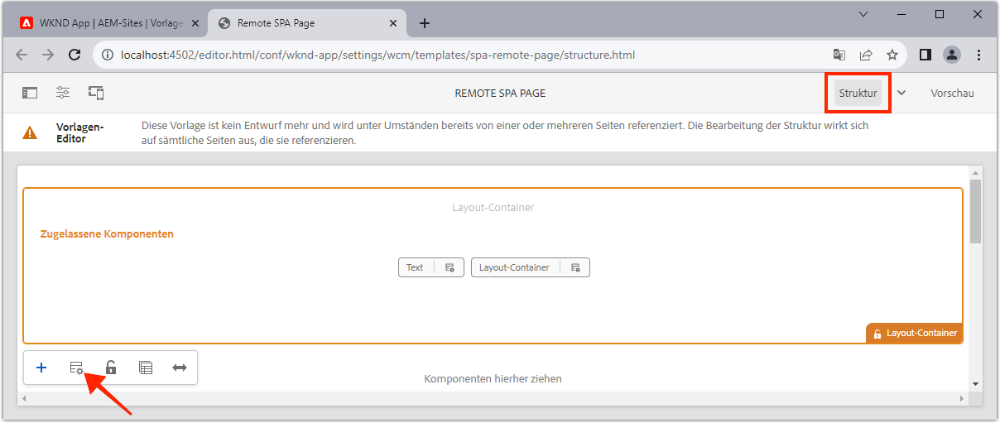
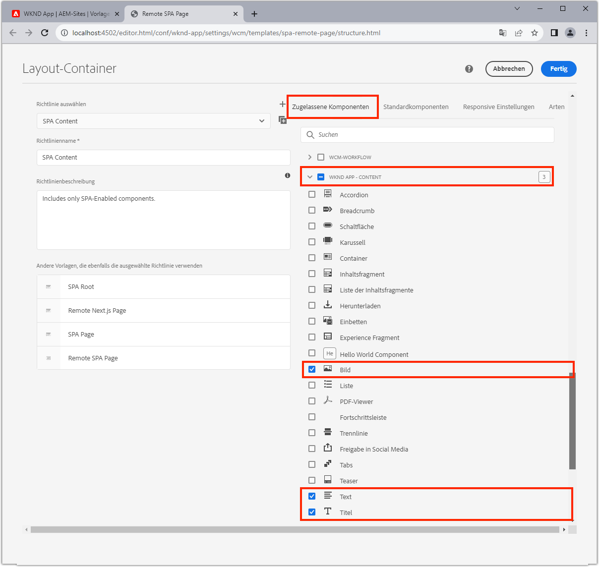
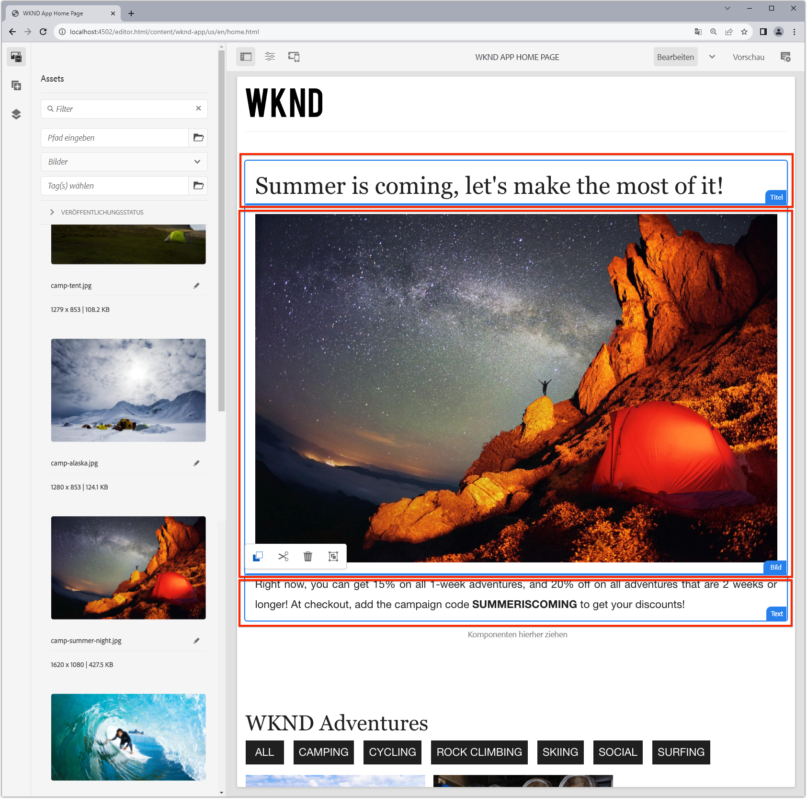
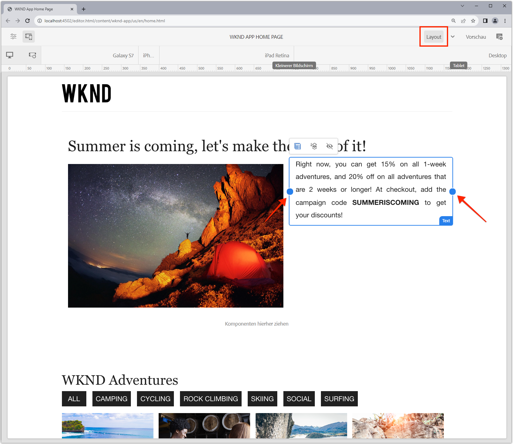

# Bearbeitbare Container-Komponenten

[Die korrigierte ](./spa-fixed-component.md) Komponente bietet eine gewisse Flexibilität beim Authoring SPA Inhalts. Dieser Ansatz ist jedoch starr und erfordert, dass Entwickler die genaue Zusammensetzung des bearbeitbaren Inhalts definieren. Um die Erstellung außergewöhnlicher Erlebnisse durch Autoren zu unterstützen, unterstützt SPA Editor die Verwendung von Container-Komponenten im SPA. Container-Komponenten ermöglichen es Autoren, zulässige Komponenten per Drag &amp; Drop in den Container zu ziehen und sie zu erstellen, genau wie sie es beim herkömmlichen AEM Sites-Authoring tun können!



In diesem Kapitel fügen wir einen bearbeitbaren Container zur Home-Ansicht hinzu, der Autoren die Möglichkeit gibt, Rich-Content-Erlebnisse mit AEM React Core-Komponenten direkt im SPA zu erstellen und zu gestalten.

## WKND-App aktualisieren

So fügen Sie der Startseite-Ansicht eine Container-Komponente hinzu:

+ Importieren der Komponente ResponsiveGrid der AEM React Editable-Komponente
+ Importieren und registrieren Sie AEM React Core Components (Text und Bild) zur Verwendung in der Container-Komponente

### Importieren in die Komponente &quot;ResponsiveGrid-Container&quot;

Um der Ansicht &quot;Home&quot;einen bearbeitbaren Bereich zuzuweisen, müssen wir:

1. Importieren der ResponsiveGrid-Komponente von `@adobe/aem-react-editable-components`
1. Registrieren Sie es mit `withMappable`, damit Entwickler es in der SPA platzieren können
1. Registrieren Sie sich auch bei `MapTo`, damit es in anderen Container-Komponenten wiederverwendet werden kann, wodurch Container effektiv verschachtelt werden.

Gehen Sie hierfür wie folgt vor:

1. Öffnen Sie das SPA in Ihrer IDE
1. Erstellen einer React-Komponente unter `src/components/aem/AEMResponsiveGrid.js`
1. hinzufügen Sie folgenden Code zu `AEMResponsiveGrid.js`

   ```
   // Import the withMappable API provided bu the AEM SPA Editor JS SDK
   import { withMappable, MapTo } from '@adobe/aem-react-editable-components';
   
   // Import the base ResponsiveGrid component
   import { ResponsiveGrid } from "@adobe/aem-react-editable-components";
   
   // The sling:resourceType for which this Core Component is registered with in AEM
   const RESOURCE_TYPE = "wcm/foundation/components/responsivegrid";
   
   // Create an EditConfig to allow the AEM SPA Editor to properly render the component in the Editor's context
   const EditConfig = {
       emptyLabel: "Layout Container",  // The component placeholder in AEM SPA Editor
       isEmpty: function(props) { 
           return props.cqItemsOrder == null || props.cqItemsOrder.length === 0;
       },                              // The function to determine if this component has been authored
       resourceType: RESOURCE_TYPE     // The sling:resourceType this SPA component is mapped to
   };
   
   // MapTo allows the AEM SPA Editor JS SDK to dynamically render components added to SPA Editor Containers
   MapTo(RESOURCE_TYPE)(ResponsiveGrid, EditConfig);
   
   // withMappable allows the component to be hardcoded into the SPA; <AEMResponsiveGrid .../>
   const AEMResponsiveGrid = withMappable(ResponsiveGrid, EditConfig);
   
   export default AEMResponsiveGrid;
   ```

Der Code ist ähnlich wie `AEMTitle.js`, dass [die Komponente &quot;Titel der AEM-Kernkomponenten&quot;](./spa-fixed-component.md) importiert hat.


Die Datei `AEMResponsiveGrid.js` sollte wie folgt aussehen:


### Verwenden der SPA-Komponente AEMResponsiveGrid

Nachdem AEM ResponsiveGrid-Komponente in der SPA registriert und zur Verwendung verfügbar ist, können wir sie in der Home-Ansicht platzieren.

1. `react-app/src/App.js` öffnen und bearbeiten
1. Importieren Sie die Komponente `AEMResponsiveGrid` und platzieren Sie sie über der Komponente `<AEMTitle ...>`.
1. Legen Sie die folgenden Attribute für die Komponente `<AEMResponsiveGrid...>` fest
   + `pagePath = '/content/wknd-app/us/en/home'`
   + `itemPath = 'root/responsivegrid'`

   Dies weist diese Komponente an, ihren Inhalt aus der AEM-Ressource abzurufen:`AEMResponsiveGrid`

   + `/content/wknd-app/us/en/home/jcr:content/root/responsivegrid`

   Der Knoten `itemPath` wird dem Knoten `responsivegrid` zugeordnet, der in der `Remote SPA Page`-AEM-Vorlage definiert ist, und wird automatisch auf neuen AEM Seiten erstellt, die aus der AEM Vorlage `Remote SPA Page` erstellt wurden.

   Aktualisieren Sie `App.js`, um die Komponente `<AEMResponsiveGrid...>` hinzuzufügen.

   ```
   ...
   import AEMResponsiveGrid from './components/aem/AEMResponsiveGrid';
   ...
   
   function Home() {
   return (
       <div className="Home">
           <AEMResponsiveGrid
               pagePath='/content/wknd-app/us/en/home' 
               itemPath='root/responsivegrid'/>
   
           <AEMTitle
               pagePath='/content/wknd-app/us/en/home' 
               itemPath='title'/>
           <Adventures />
       </div>
   );
   }
   ```

Die Datei `Apps.js` sollte wie folgt aussehen:


## Erstellen bearbeitbarer Komponenten

Um die volle Wirkung des flexiblen Authoring-Erlebnisses zu erzielen, bieten die Container in SPA Editor. Wir haben bereits eine bearbeitbare Titelkomponente erstellt, lassen Sie uns aber noch ein paar weitere erstellen, die Autoren die Verwendung von Text und Bild AEM WCM-Kernkomponenten in der neu hinzugefügten Container-Komponente ermöglichen.

### Textkomponente

1. Öffnen Sie das SPA in Ihrer IDE
1. Erstellen einer React-Komponente unter `src/components/aem/AEMText.js`
1. hinzufügen Sie folgenden Code zu `AEMText.js`

   ```
   import { withMappable, MapTo } from '@adobe/aem-react-editable-components';
   import { TextV2, TextV2IsEmptyFn } from "@adobe/aem-core-components-react-base";
   
   const RESOURCE_TYPE = "wknd-app/components/text";
   
   const EditConfig = {    
       emptyLabel: "Text",
       isEmpty: TextV2IsEmptyFn,
       resourceType: RESOURCE_TYPE
   };
   
   MapTo(RESOURCE_TYPE)(TextV2, EditConfig);
   
   const AEMText = withMappable(TextV2, EditConfig);
   
   export default AEMText;
   ```

Die Datei `AEMText.js` sollte wie folgt aussehen:


### Bildkomponente

1. Öffnen Sie das SPA in Ihrer IDE
1. Erstellen einer React-Komponente unter `src/components/aem/AEMImage.js`
1. hinzufügen Sie folgenden Code zu `AEMImage.js`

   ```
   import { withMappable, MapTo } from '@adobe/aem-react-editable-components';
   import { ImageV2, ImageV2IsEmptyFn } from "@adobe/aem-core-components-react-base";
   
   const RESOURCE_TYPE = "wknd-app/components/image";
   
   const EditConfig = {    
       emptyLabel: "Image",
       isEmpty: ImageV2IsEmptyFn,
       resourceType: RESOURCE_TYPE
   };
   
   MapTo(RESOURCE_TYPE)(ImageV2, EditConfig);
   
   const AEMImage = withMappable(ImageV2, EditConfig);
   
   export default AEMImage;
   ```

1. Erstellen Sie eine SCSS-Datei `src/components/aem/AEMImage.scss`, die benutzerdefinierte Stile für `AEMImage.scss` bereitstellt. Diese Stile Zielgruppe der CSS-Klassen der AEM React Core Component.
1. hinzufügen Sie die folgende SCSS an `AEMImage.scss`

   ```
   .cmp-image__image {
       margin: 1rem 0;
       width: 100%;
       border: 0;
    }
   ```

1. `AEMImage.scss` in `AEMImage.js` importieren

   ```
   ...
   import './AEMImage.scss';
   ...
   ```

Die Variablen `AEMImage.js` und `AEMImage.scss` sollten wie folgt aussehen:


### Importieren der bearbeitbaren Komponenten

Die neu erstellten Komponenten `AEMText` und `AEMImage` SPA werden in der SPA referenziert und dynamisch instanziiert, basierend auf der von AEM zurückgegebenen JSON. Um sicherzustellen, dass diese Komponenten für die SPA verfügbar sind, erstellen Sie Importanweisungen für sie in `App.js`

1. Öffnen Sie das SPA in Ihrer IDE
1. Öffnen Sie die Datei `src/App.js`
1. hinzufügen Importanweisungen für `AEMText` und `AEMImage`

   ```
   ...
   import AEMText from './components/aem/AEMText';
   import AEMImage from './components/aem/AEMImage';
   ...
   ```


Das Ergebnis sollte wie folgt aussehen:


Wenn diese Importe _nicht_ hinzugefügt werden, werden der `AEMText`- und der `AEMImage`-Code von SPA nicht aufgerufen. Daher werden die Komponenten nicht für die bereitgestellten Ressourcentypen registriert.

## Konfigurieren des Containers in AEM

AEM Container-Komponenten verwenden Richtlinien, um ihre zulässigen Komponenten anzugeben. Dies ist eine kritische Konfiguration bei Verwendung SPA Editors, da nur AEM WCM-Kernkomponenten, denen SPA Komponenten zugeordnet sind, vom SPA gerenderbar sind. Stellen Sie sicher, dass nur die Komponenten zulässig sind, für die wir SPA Implementierungen bereitgestellt haben:

+ `AEMTitle` zugeordnet zu  `wknd-app/components/title`
+ `AEMText` zugeordnet zu  `wknd-app/components/text`
+ `AEMImage` zugeordnet zu  `wknd-app/components/image`

So konfigurieren Sie den reponsivegrid-Container der Vorlage &quot;Remote SPA&quot;:

1. Bei AEM Author anmelden
1. Navigieren Sie zu __Tools > Allgemein > Vorlagen > WKND-App__
1. Bearbeiten Sie __SPA Berichtseite__

   

1. Wählen Sie __Struktur__ im Modus-Umschalter oben rechts aus.
1. Tippen Sie auf , um den __Layout-Container__ auszuwählen.
1. Tippen Sie in der Popup-Leiste auf das Symbol __Richtlinie__

   

1. Erweitern Sie auf der rechten Seite unter der Registerkarte __Zulässige Komponenten__ __WKND-APP - CONTENT__
1. Stellen Sie sicher, dass nur die folgenden Optionen ausgewählt sind:
   + Bild
   + Text
   + Titel

   

1. Tippen Sie auf __Fertig__

## Erstellen des Containers in AEM

Wenn die SPA aktualisiert wurde, um `<AEMResponsiveGrid...>`, Wrapper für drei AEM React Core-Komponenten (`AEMTitle`, `AEMText` und `AEMImage`) einzubetten, und AEM mit einer entsprechenden Vorlagenrichtlinie aktualisiert wird, können wir Beginn-Authoring-Inhalte in der Container-Komponente erstellen.

1. Bei AEM Author anmelden
1. Navigieren Sie zu __Sites > WKND-App__
1. Tippen Sie auf __Home__ und wählen Sie __Bearbeiten__ in der oberen Aktionsleiste
   + Es wird eine Textkomponente &quot;Hello World&quot;angezeigt, die beim Generieren des Projekts aus dem AEM Project-Archetyp automatisch hinzugefügt wurde
1. Wählen Sie __Bearbeiten__ aus der Modusauswahl oben rechts im Seiten-Editor
1. Suchen Sie den bearbeitbaren Bereich __Layout Container__ unter dem Titel
1. Öffnen Sie die Seitenleiste __Seiteneditor__ und wählen Sie die __Komponenten-Ansicht__
1. Ziehen Sie die folgenden Komponenten in den Container __Layout__
   + Bild
   + Titel
1. Ziehen Sie die Komponenten in die folgende Reihenfolge:
   1. Titel
   1. Bild
   1. Text
1. __Komponente__ für  ____ Titel autorisieren
   1. Tippen Sie auf die Komponente &quot;Title&quot;und dann auf das Symbol __wSchraubenschlüssel__, um __edit__ die Komponente &quot;Title&quot;
   1. hinzufügen folgenden Text:
      + Titel: __Der Sommer kommt, machen wir das Beste!__
      + Typ: __H1__
   1. Tippen Sie auf __Fertig__
1. ____ Authoring der  ____ Bildkomponente
   1. Ziehen Sie ein Bild aus der Seitenleiste (nach dem Wechsel zur Asset-Ansicht) auf die Bildkomponente
   1. Tippen Sie auf die Bildkomponente und dann auf das Symbol __Schraubenschlüssel__, um sie zu bearbeiten
   1. Aktivieren Sie das Kontrollkästchen __Bild ist dekorativ__
   1. Tippen Sie auf __Fertig__
1. ____ Autorisieren der  ____ Textkomponente
   1. Bearbeiten Sie die Komponente &quot;Text&quot;, indem Sie auf die Komponente &quot;Text&quot;tippen und auf das Symbol __Schraubenschlüssel__ tippen
   1. hinzufügen folgenden Text:
      + _Im Moment können Sie 15% auf alle 1-wöchigen Abenteuer und 20% Rabatt auf alle Abenteuer, die 2 Wochen oder länger sind! Fügen Sie einfach den Kampagne Code SUMMERISCOMING hinzu, um Ihre Rabatte zu erhalten!_
   1. Tippen Sie auf __Fertig__

1. Ihre Komponenten werden jetzt erstellt, aber vertikal stapelt.

   

   Verwenden Sie AEM Layoutmodus, um die Größe und das Layout der Komponenten anzupassen.

1. Wechseln Sie mit der Modusauswahl oben rechts zum Layoutmodus ____
1. __Ändern Sie die__ Größe der Bild- und Textkomponenten so, dass sie nebeneinander stehen
   + ____ ImageComponent sollte  __8 Spalten breit sein__
   + __Textkomponente__ sollte  __3 Spalten breit sein__

   

1. __Änderungen in der__ Vorschau im Seiteneditor AEM
1. Aktualisieren Sie die WKND-App, die lokal auf [http://localhost:3000](http://localhost:3000) ausgeführt wird, um die erstellten Änderungen anzuzeigen!

   


## Herzlichen Glückwunsch!

Sie haben eine Container-Komponente hinzugefügt, mit der Sie bearbeitbare Komponenten der WKND-App hinzufügen können! Sie wissen jetzt, wie:

+ Verwenden Sie die Komponente &quot;ResponsiveGrid&quot;der Komponente &quot;AEM React Editable&quot;in der SPA
+ Registrieren AEM React-Core-Komponenten (Text und Bild) zur Verwendung in der SPA über die Container-Komponente
+ Konfigurieren Sie die Vorlage für die Remote-SPA, um die SPA aktivierten Core-Komponenten zuzulassen.
+ hinzufügen bearbeitbarer Komponenten in der Container-Komponente
+ Komponenten für Autor und Layout im SPA Editor

## Nächste Schritte

Im nächsten Schritt wird dieselbe Technik verwendet, um [eine bearbeitbare Komponente zu einer Abenteuerdetails-Route](./spa-dynamic-routes.md) in der SPA hinzuzufügen.
