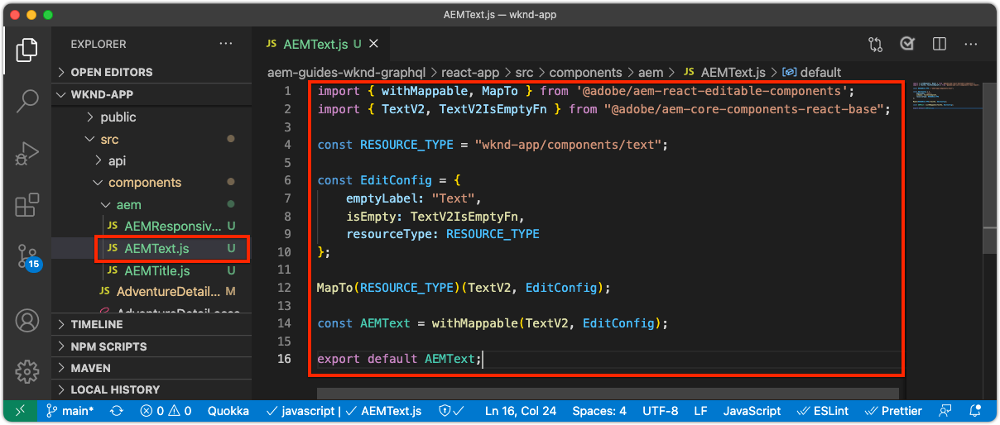

# Bearbeitbare Container-Komponenten

[Feste Komponenten](./spa-fixed-component.md) bieten eine gewisse Flexibilität beim Erstellen SPA Inhalts. Dieser Ansatz ist jedoch starr und erfordert, dass Entwickler die genaue Zusammensetzung des bearbeitbaren Inhalts definieren. Um die Erstellung außergewöhnlicher Erlebnisse durch Autoren zu unterstützen, unterstützt SPA Editor die Verwendung von Container-Komponenten in der SPA. Container-Komponenten ermöglichen es Autoren, zulässige Komponenten per Drag &amp; Drop in den Container zu ziehen und sie wie beim herkömmlichen AEM Sites-Authoring zu erstellen!


In diesem Kapitel fügen wir einen bearbeitbaren Container zur Startansicht hinzu, der es Autoren ermöglicht, Rich-Content-Erlebnisse mit AEM React-Kernkomponenten direkt in der SPA zu erstellen und anzuordnen.

## WKND-App aktualisieren

Hinzufügen einer Container-Komponente zur Startansicht:

+ Importieren der Komponente &quot;ResponsiveGrid&quot;der AEM React Editable-Komponente
+ Importieren und registrieren Sie AEM React-Kernkomponenten (Text und Bild) zur Verwendung in der Container-Komponente

### Importieren in die Komponente des responsivenGrid-Containers

Um einen bearbeitbaren Bereich in der Startansicht zu platzieren, müssen wir:

1. Importieren Sie die Komponente &quot;ResponsiveGrid&quot;aus `@adobe/aem-react-editable-components`
1. Registrieren Sie sie mithilfe von `withMappable` , damit Entwickler sie in die SPA platzieren können
1. Registrieren Sie sich auch bei `MapTo` sodass sie in anderen Container-Komponenten wiederverwendet werden kann, wodurch Container effektiv verschachtelt werden.

Gehen Sie hierfür wie folgt vor:

1. Öffnen Sie das SPA in Ihrer IDE.
1. Erstellen einer React-Komponente unter `src/components/aem/AEMResponsiveGrid.js`
1. Fügen Sie den folgenden Code zu `AEMResponsiveGrid.js`

   ```
   // Import the withMappable API provided bu the AEM SPA Editor JS SDK
   import { withMappable, MapTo } from '@adobe/aem-react-editable-components';
   
   // Import the base ResponsiveGrid component
   import { ResponsiveGrid } from "@adobe/aem-react-editable-components";
   
   // The sling:resourceType for which this Core Component is registered with in AEM
   const RESOURCE_TYPE = "wcm/foundation/components/responsivegrid";
   
   // Create an EditConfig to allow the AEM SPA Editor to properly render the component in the Editor's context
   const EditConfig = {
       emptyLabel: "Layout Container",  // The component placeholder in AEM SPA Editor
       isEmpty: function(props) { 
           return props.cqItemsOrder == null || props.cqItemsOrder.length === 0;
       },                              // The function to determine if this component has been authored
       resourceType: RESOURCE_TYPE     // The sling:resourceType this SPA component is mapped to
   };
   
   // MapTo allows the AEM SPA Editor JS SDK to dynamically render components added to SPA Editor Containers
   MapTo(RESOURCE_TYPE)(ResponsiveGrid, EditConfig);
   
   // withMappable allows the component to be hardcoded into the SPA; <AEMResponsiveGrid .../>
   const AEMResponsiveGrid = withMappable(ResponsiveGrid, EditConfig);
   
   export default AEMResponsiveGrid;
   ```

Der Code ist ähnlich `AEMTitle.js` dass [Importierte die Komponente Titel der AEM ReichweitenKernkomponenten](./spa-fixed-component.md).


Die `AEMResponsiveGrid.js` sollte wie folgt aussehen:


### Verwenden der SPA-Komponente AEMResponsiveGrid

Nachdem AEM Komponente ResponsiveGrid in registriert ist und für die Verwendung in der SPA verfügbar ist, können wir sie in der Startansicht platzieren.

1. Öffnen und Bearbeiten `react-app/src/Home.js`
1. Importieren Sie die `AEMResponsiveGrid` -Komponente und platzieren Sie sie über dem `<AEMTitle ...>` -Komponente.
1. Legen Sie die folgenden Attribute für die `<AEMResponsiveGrid...>` component
   + `pagePath = '/content/wknd-app/us/en/home'`
   + `itemPath = 'root/responsivegrid'`

   Dies weist die `AEMResponsiveGrid` -Komponente, um ihren Inhalt aus der AEM-Ressource abzurufen:

   + `/content/wknd-app/us/en/home/jcr:content/root/responsivegrid`

   Die `itemPath` der `responsivegrid` Knoten, der im `Remote SPA Page` AEM Vorlage und wird automatisch auf neuen AEM erstellt, die aus dem `Remote SPA Page` AEM Vorlage.

   Aktualisieren `Home.js` , um `<AEMResponsiveGrid...>` -Komponente.

   ```
   ...
   import AEMResponsiveGrid from './aem/AEMResponsiveGrid';
   ...
   
   function Home() {
       return (
           <div className="Home">
               <AEMResponsiveGrid
                   pagePath='/content/wknd-app/us/en/home' 
                   itemPath='root/responsivegrid'/>
   
               <AEMTitle
                   pagePath='/content/wknd-app/us/en/home' 
                   itemPath='title'/>
               <Adventures />
           </div>
       );
   }
   ```

Die `Home.js` sollte wie folgt aussehen:


## Erstellen bearbeitbarer Komponenten

Um die volle Wirkung der flexiblen Authoring-Erlebnis-Container im SPA Editor zu erzielen. Wir haben bereits eine bearbeitbare Titelkomponente erstellt, aber lassen Sie uns noch ein paar weitere Aspekte anstellen, die es Autoren ermöglichen, Text und Bild AEM WCM-Kernkomponenten in der neu hinzugefügten Container-Komponente zu verwenden.

### Textkomponente

1. Öffnen Sie das SPA in Ihrer IDE.
1. Erstellen einer React-Komponente unter `src/components/aem/AEMText.js`
1. Fügen Sie den folgenden Code zu `AEMText.js`

   ```
   import { withMappable, MapTo } from '@adobe/aem-react-editable-components';
   import { TextV2, TextV2IsEmptyFn } from "@adobe/aem-core-components-react-base";
   
   const RESOURCE_TYPE = "wknd-app/components/text";
   
   const EditConfig = {    
       emptyLabel: "Text",
       isEmpty: TextV2IsEmptyFn,
       resourceType: RESOURCE_TYPE
   };
   
   MapTo(RESOURCE_TYPE)(TextV2, EditConfig);
   
   const AEMText = withMappable(TextV2, EditConfig);
   
   export default AEMText;
   ```

Die `AEMText.js` sollte wie folgt aussehen:



### Bildkomponente

1. Öffnen Sie das SPA in Ihrer IDE.
1. Erstellen einer React-Komponente unter `src/components/aem/AEMImage.js`
1. Fügen Sie den folgenden Code zu `AEMImage.js`

   ```
   import { withMappable, MapTo } from '@adobe/aem-react-editable-components';
   import { ImageV2, ImageV2IsEmptyFn } from "@adobe/aem-core-components-react-base";
   
   const RESOURCE_TYPE = "wknd-app/components/image";
   
   const EditConfig = {    
       emptyLabel: "Image",
       isEmpty: ImageV2IsEmptyFn,
       resourceType: RESOURCE_TYPE
   };
   
   MapTo(RESOURCE_TYPE)(ImageV2, EditConfig);
   
   const AEMImage = withMappable(ImageV2, EditConfig);
   
   export default AEMImage;
   ```

1. Erstellen einer SCSS-Datei `src/components/aem/AEMImage.scss` , das benutzerdefinierte Stile für die `AEMImage.scss`. Diese Stile zielen auf die CSS-Klassen der AEM React-Kernkomponente mit BEM-Notation ab.
1. Fügen Sie die folgende SCSS zu `AEMImage.scss`

   ```
   .cmp-image__image {
       margin: 1rem 0;
       width: 100%;
       border: 0;
    }
   ```

1. Import `AEMImage.scss` in `AEMImage.js`

   ```
   ...
   import './AEMImage.scss';
   ...
   ```

Die `AEMImage.js` und `AEMImage.scss` sollte wie folgt aussehen:


### Importieren der bearbeitbaren Komponenten

Die neu erstellte `AEMText` und `AEMImage` SPA Komponenten werden in der SPA referenziert und basierend auf der von AEM zurückgegebenen JSON dynamisch instanziiert. Um sicherzustellen, dass diese Komponenten für die SPA verfügbar sind, erstellen Sie Importanweisungen für sie in `Home.js`

1. Öffnen Sie das SPA in Ihrer IDE.
1. Öffnen Sie die Datei `src/Home.js`
1. Hinzufügen von Importanweisungen für `AEMText` und `AEMImage`

   ```
   ...
   import AEMText from './components/aem/AEMText';
   import AEMImage from './components/aem/AEMImage';
   ...
   ```


Das Ergebnis sollte wie folgt aussehen:


Wenn diese Einfuhren _not_ hinzugefügt, `AEMText` und `AEMImage` -Code von SPA nicht aufgerufen wird und daher werden die Komponenten nicht für die bereitgestellten Ressourcentypen registriert.

## Container in AEM konfigurieren

AEM Container-Komponenten verwenden Richtlinien, um ihre zulässigen Komponenten anzugeben. Dies ist eine kritische Konfiguration bei der Verwendung des SPA-Editors, da nur AEM WCM-Kernkomponenten, die SPA Komponenten-Entsprechungen zugeordnet haben, vom SPA gerenderbar sind. Stellen Sie sicher, dass nur die Komponenten zulässig sind, für die wir SPA Implementierungen bereitgestellt haben:

+ `AEMTitle` zugeordnet zu `wknd-app/components/title`
+ `AEMText` zugeordnet zu `wknd-app/components/text`
+ `AEMImage` zugeordnet zu `wknd-app/components/image`

So konfigurieren Sie den Reponsivegrid-Container der Vorlage Remote-SPA:

1. Bei der AEM-Autoreninstanz anmelden
1. Navigieren Sie zu __Tools > Allgemein > Vorlagen > WKND-App__
1. Bearbeiten __SPA__

   

1. Auswählen __Struktur__ im Modusschalter oben rechts
1. Tippen, um die __Layout-Container__
1. Tippen Sie auf __Politik__ Symbol in der Popup-Leiste

   

1. Rechts unter dem __Zugelassene Komponenten__ Registerkarte, erweitern __WKND-APP - INHALT__
1. Stellen Sie sicher, dass nur Folgendes ausgewählt ist:
   + Bild
   + Text
   + Titel

   

1. Tippen Sie auf __Fertig__

## Container in AEM erstellen

Nach der Aktualisierung des SPA zum Einbetten des `<AEMResponsiveGrid...>`, Wrapper für drei AEM React-Kernkomponenten (`AEMTitle`, `AEMText`und `AEMImage`) und AEM mit einer übereinstimmenden Vorlagenrichtlinie aktualisiert wird, können wir damit beginnen, Inhalte in der Container-Komponente zu erstellen.

1. Bei der AEM-Autoreninstanz anmelden
1. Navigieren Sie zu __Sites > WKND-App__
1. Tippen __Startseite__ und wählen Sie __Bearbeiten__ in der oberen Aktionsleiste
   + Eine Textkomponente &quot;Hello World&quot;wird angezeigt, da diese automatisch hinzugefügt wurde, wenn das Projekt über den AEM Projektarchetyp generiert wurde
1. Auswählen __Bearbeiten__ über die Modusauswahl oben rechts im Seiteneditor
1. Suchen Sie die __Layout-Container__ bearbeitbarer Bereich unter dem Titel
1. Öffnen Sie die __Seitenleiste des Seiteneditors__ und wählen Sie die __Komponentenansicht__
1. Ziehen Sie die folgenden Komponenten in die __Layout-Container__
   + Bild
   + Titel
1. Ziehen Sie die Komponenten in die folgende Reihenfolge, um sie neu anzuordnen:
   1. Titel
   1. Bild
   1. Text
1. __Autor__ die __Titel__ component
   1. Tippen Sie auf die Komponente Titel und dann auf __Schraubenschlüssel__ Symbol zu __edit__ die Titelkomponente
   1. Fügen Sie den folgenden Text hinzu:
      + Titel: __Der Sommer kommt, lassen Sie uns das Beste daraus machen!__
      + Typ: __H1__
   1. Tippen Sie auf __Fertig__
1. __Autor__ die __Bild__ component
   1. Ziehen Sie ein Bild aus der Seitenleiste (nach dem Wechsel zur Asset-Ansicht) auf die Bildkomponente
   1. Tippen Sie auf die Bildkomponente und tippen Sie auf __Schraubenschlüssel__ Symbol zum Bearbeiten
   1. Überprüfen Sie die __Bild ist dekorativ__ Kontrollkästchen
   1. Tippen Sie auf __Fertig__
1. __Autor__ die __Text__ component
   1. Bearbeiten Sie die Textkomponente, indem Sie auf die Textkomponente tippen und auf die __Schraubenschlüssel__ icon
   1. Fügen Sie den folgenden Text hinzu:
      + _Jetzt erhalten Sie 15% auf allen 1-wöchigen Abenteuern und 20% Rabatt auf alle Abenteuer, die 2 Wochen oder länger sind! Fügen Sie beim Checkout den Kampagnencode SUMMERISCOMING hinzu, um Ihre Rabatte zu erhalten!_
   1. Tippen Sie auf __Fertig__

1. Ihre Komponenten werden jetzt erstellt, aber vertikal stapelt.

   

   Verwenden Sie AEM Layout-Modus , um die Größe und das Layout der Komponenten anzupassen.

1. Wechseln zu __Layout-Modus__ Verwenden der Modusauswahl oben rechts
1. __Größe ändern__ die Bild- und Text-Komponenten, sodass sie nebeneinander angeordnet sind
   + __Bild__ -Komponente sollte __8 Spalten breit__
   + __Text__ -Komponente sollte __3 Spalten breit__

   

1. __Vorschau__ Ihre Änderungen in AEM Seiteneditor
1. Aktualisieren Sie die WKND-App, die lokal ausgeführt wird auf [http://localhost:3000](http://localhost:3000) um die erstellten Änderungen zu sehen!

   


## Herzlichen Glückwunsch!

Sie haben eine Container-Komponente hinzugefügt, mit der Autoren bearbeitbare Komponenten zur WKND-App hinzufügen können! Sie wissen jetzt, wie:

+ Verwenden Sie die Komponente &quot;ResponsiveGrid&quot;der AEM React Editable-Komponente im SPA
+ Registrieren AEM React-Kernkomponenten (Text und Bild) zur Verwendung in der SPA über die Container-Komponente
+ Konfigurieren Sie die Vorlage für die Remote-SPA, um die SPA aktivierten Kernkomponenten zuzulassen.
+ Hinzufügen bearbeitbarer Komponenten zur Container-Komponente
+ Autoren- und Layoutkomponenten im SPA Editor

## Nächste Schritte

Im nächsten Schritt wird dieselbe Technik verwendet, um [Hinzufügen einer bearbeitbaren Komponente zu einer Abenteuer-Details-Route](./spa-dynamic-routes.md) im SPA.
